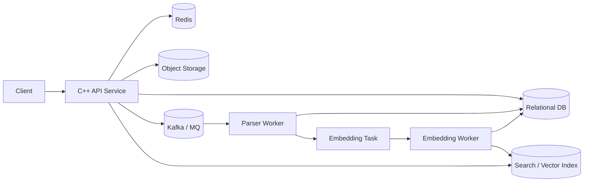
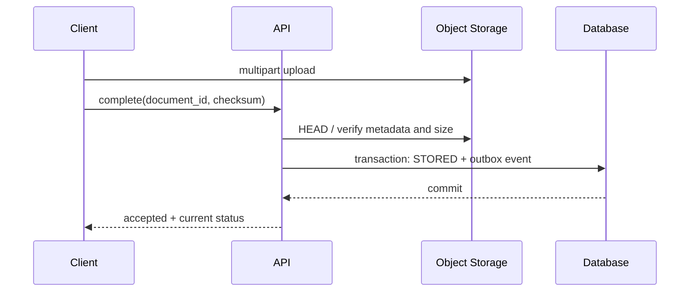

# 项目二：AI 文档处理与检索平台

## 1. 业务目标

构建一个后端平台：用户上传文档，系统异步解析、切分、Embedding、建立全文与向量索引，最后提供关键词/语义混合检索。C++ 负责 API、调度或高性能服务；Python 可承载模型推理 worker。

### 先定义服务等级

示例目标不是固定答案，而是提醒设计必须可量化：

- API 创建上传会话的 P95 小于目标阈值，可用率达到约定 SLO；
- 99% 的普通文档在给定分钟内从上传完成变为可检索；
- 搜索接口在目标数据规模和并发下满足 P95/P99；
- 单个坏文档不能永久阻塞一个分区或 GPU 批次；
- 租户之间必须隔离权限、配额、缓存 key 和索引过滤。

“文档处理成功率”和“搜索 API 可用率”是不同 SLI；异步处理慢不一定等于查询服务不可用。

## 2. 架构



数据库是任务状态和元数据的权威来源；对象存储保存原始文件和派生产物；消息队列传递“需要做什么”，不应成为唯一业务状态；Redis 用于热点结果、会话、限流或短期状态；搜索引擎提供召回。

### 同步与异步边界

同步上传 API 只完成鉴权、配额检查、元数据创建和上传授权，不等待解析/Embedding。异步 worker 只通过稳定 ID 读取对象和状态，消息中不传大正文。这样可以把用户请求超时与长任务生命周期分离。

但异步并不意味着无限等待。每个 stage 仍需处理时限、最大尝试次数、租约/心跳和终止状态；否则任务会永久停留在 `PROCESSING`。

### 组件失效时的业务行为

| 组件异常 | 立即影响 | 可接受降级 | 不应发生 |
| --- | --- | --- | --- |
| Redis | 缓存 miss、限流状态可能退化 | 回源 DB、局部拒绝或保守配额 | 把缓存丢失当成文档丢失 |
| Kafka/MQ | 新任务暂时无法推进 | 保留 outbox，恢复后继续投递 | API 宣称任务已进入队列但无持久记录 |
| 搜索集群 | 查询或索引不可用 | 返回明确错误/旧索引/关键词降级 | 绕过租户权限过滤 |
| Embedding 服务 | 向量阶段积压 | 仅关键词检索、延迟处理 | 无限同步重试占满 API 线程 |
| 对象存储 | 上传/解析读取失败 | 可重试并显示处理中/失败 | DB 标记完成但对象未经校验 |

## 3. 核心数据模型

示例实体：

- `document(id, tenant_id, object_key, checksum, version, status, created_at, ...)`
- `job(id, document_id, stage, attempt, status, idempotency_key, error_code, ...)`
- `chunk(id, document_id, document_version, ordinal, content_hash, metadata, ...)`
- `outbox(id, event_type, aggregate_id, payload, published_at, ...)`

文档状态机示例：

```text
UPLOADING -> STORED -> PARSING -> PARSED -> EMBEDDING -> INDEXED
                    \-> FAILED         \-> FAILED
```

每次转换都要定义前置状态、幂等条件、持久化原子边界和重复事件行为。不要仅靠内存状态判断任务是否完成。

### 约束与版本

- `document` 使用业务主键；`(tenant_id, checksum, version)` 是否唯一取决于是否允许重复上传。
- `job.idempotency_key` 建唯一约束，把“检查是否处理过”和“创建任务”变成同一数据库原子边界。
- `chunk` 对 `(document_id, document_version, ordinal)` 建唯一约束，重复解析写入不会产生两套片段。
- 状态更新使用条件写：`UPDATE ... WHERE status = expected AND version = expected_version`，受影响行数为零表示状态已变化。
- outbox 事件包含 schema version；消费者对新增字段向后兼容，对破坏性变化使用新事件类型或版本迁移。

任务状态不能只有 `SUCCESS/FAILED`。建议记录 `next_retry_at`、`lease_owner`、`lease_until`、`attempt`、稳定 `error_code` 和诊断摘要，以支持抢占恢复、退避和运维查询。

## 4. 上传路径

大文件优先使用对象存储预签名 URL，让客户端 multipart 上传，API 只授权和记录元数据。完成后验证大小、内容类型和校验和；对象 key 不直接使用用户文件名。

安全边界：租户隔离、扩展名与真实内容检测、大小/页数上限、恶意压缩包、解析沙箱、下载时响应头、对象访问权限和日志脱敏。

上传完成和任务投递存在双写问题。可在数据库事务中更新文档并写 outbox，由可靠 relay 投递消息；relay 与消费者都要允许重复。

### 完成上传的校验时序



客户端声称上传完成不是证据。API 至少验证对象存在、大小、预期 key/租户和可用的 checksum 信息。multipart ETag 不一定等于整文件 MD5，应使用对象存储提供的 checksum 能力或业务自己计算的摘要。

完成接口本身也应幂等：相同文档版本再次调用时返回当前状态；如果 checksum 与首次确认不一致，则返回冲突而不是悄悄覆盖。

## 5. 异步流水线

### 消息设计

消息携带稳定 ID 和引用，不塞入大文件：

```json
{
  "event_id": "...",
  "document_id": "...",
  "document_version": 3,
  "stage": "parse",
  "trace_context": "..."
}
```

以 `document_id + version + stage` 构造幂等键。消费者事务先检查/竞争任务状态，再执行或采用结果表唯一约束。外部副作用无法与消息 offset 原子提交时，系统必须容忍“副作用已完成但确认失败”导致的重投。

#### Outbox relay

relay 分页读取未发布事件，投递后标记 `published_at`。如果“消息已发出、标记前崩溃”，事件会重复投递，所以消费者仍需幂等。多个 relay 可用行锁/跳过已锁行或租约分工；还要监控最老未发布事件年龄，而不只是表中行数。

定期归档已发布 outbox，避免主表无限增长。清理必须晚于消息系统和消费者可能需要的追查窗口。

### 重试分类

- 可重试：临时网络错误、限流、短暂服务不可用；指数退避 + 抖动 + 上限。
- 不可重试：格式不支持、内容损坏、超出限制；直接标记失败或死信。
- 资源不足：单文档过大或模型 OOM；需要拆分、换规格或人工处理，盲目重试会放大故障。

分阶段 topic/队列能隔离不同资源需求。每阶段都监控消费延迟、积压年龄、处理耗时、重试率和死信数。

### Worker 租约和恢复

消费者拿到任务后通过条件更新取得有限租约；长任务周期性续租。租约到期允许其他 worker 重试，但原 worker 可能仍在运行，因此最终写入必须比较任务版本或 fencing token，不能只相信“我曾经拿到租约”。

处理大文档时把解析、切分、Embedding 和索引拆成可重入阶段，每阶段产物使用版本化对象 key。失败重试可复用已验证产物，而不是从头重复昂贵工作。

### GPU 批处理与背压

Embedding worker 常用动态批处理：在最大等待时间内收集请求，到最大 batch size 或截止时间即执行。大 batch 提高吞吐，但会增加排队延迟、显存占用和单批失败影响。

至少监控：队列最老消息年龄、batch size 分布、等待时间、推理耗时、tokens/秒、GPU 利用率/显存、OOM、重试率。队列积压时不能只增加消费者；还要确认模型服务、对象读取、索引写入和分区数中的真实瓶颈。

## 6. 检索路径

1. 鉴权并确定 `tenant_id` 过滤；
2. 解析查询，生成关键词查询和查询向量；
3. 全文 BM25 与向量 ANN 分别召回；
4. 用 RRF、归一化加权或重排模型融合；
5. 过滤文档版本、权限和已删除内容；
6. 返回片段、来源和稳定游标。

缓存 key 必须包含租户、权限/过滤条件、索引版本和查询规范化结果。敏感结果不要跨用户错误复用。

混合检索评估不能只看延迟：建立带相关性标注的查询集，记录 Recall@K、MRR/NDCG（按业务选择）以及人工错误分析。模型或切分策略变更应版本化并支持重建索引。

### 混合融合细节

- BM25 分数和向量相似度不在同一量纲，直接相加通常缺少稳定含义。
- RRF 根据各召回列表的名次融合，对分数标定不敏感，通常适合作为初始基线；最终效果仍需用业务标注集验证。
- 加权融合需要对分数归一化，并使用离线标注集调权；查询类型变化时固定权重可能失效。
- Cross-encoder 重排质量更高但计算昂贵，通常只重排前几十或几百个候选。

过滤条件应尽量进入召回阶段，同时验证 ANN 过滤对召回率的影响。租户/ACL 是安全条件，不应仅在返回前“尽力过滤”，否则候选泄漏、聚合或缓存都可能暴露信息。

### 分页和索引版本

相关性排序可能随 refresh、更新或模型变化而改变。深分页使用稳定 sort + `search_after`/PIT 一类机制（具体以引擎为准），不要依赖大 offset。响应携带索引/模型版本，便于线上问题复现。

## 7. 一致性与删除

数据库更新、对象、缓存和搜索索引不在单一事务中。通常选择最终一致性并明确：

- UI 如何展示 `PROCESSING/FAILED/INDEXED`；
- 搜索何时可见新文档；
- 更新期间读旧版本还是暂时不可用；
- 删除如何传播到对象、索引和缓存；
- 失败任务如何扫描、补偿和对账；
- 数据保留与真正删除的时间目标。

使用版本号避免旧任务覆盖新文档索引：消费者写入前比较 `document_version`，索引 alias/collection 切换可用于批量重建。

### 删除状态机

删除不是一次跨系统原子操作：

```text
ACTIVE -> DELETE_REQUESTED -> HIDDEN -> PURGING -> DELETED
                              \-> PURGE_FAILED
```

收到请求后先在权威数据库记录意图并让 API/搜索过滤该文档，再异步删除索引、派生 chunk、缓存和对象。永久删除失败必须可重试、可对账并满足保留期限。对象存储版本控制或删除标记可能意味着“DELETE 成功”仍保留历史版本，需要按合规目标配置生命周期。

### 索引重建

建立新版本索引 → 从权威数据回放 → 增量追平 → 运行质量/数量校验 → 原子切换 alias → 保留旧索引一段回滚窗口。重建期间写入要么双写新旧索引，要么依赖可回放事件日志；无论哪种都要说明重复、乱序和旧版本覆盖规则。

## 8. API 语义示例

- `POST /documents`：创建上传会话，支持 `Idempotency-Key`。
- `POST /documents/{id}/complete`：确认对象上传并启动任务。
- `GET /documents/{id}`：返回状态和稳定错误码。
- `POST /search`：接受查询、过滤和游标，设置总体截止时间。
- `DELETE /documents/{id}`：记录删除意图，异步清理各存储。

API 超时不代表后台操作一定取消。客户端重试创建接口时，幂等键应返回同一操作结果或状态，而不是生成重复文档。

错误响应至少区分：认证失败、无权限、配额不足、请求冲突、格式不支持、依赖暂时不可用和内部错误。只有明确的暂时错误才建议客户端重试；服务端返回 `Retry-After` 时客户端仍需指数退避与抖动。

幂等键应绑定租户、接口、规范化请求摘要和有效期。相同 key 携带不同请求体必须返回冲突，避免把一个旧结果错误用于新操作。

## 9. 可观测与 SLO

关键 SLI 示例：

- API 可用率和 P95/P99 延迟；
- 文档从上传完成到可检索的端到端耗时；
- 各阶段成功率、处理耗时、重试和积压年龄；
- 搜索空结果率、全文/向量召回贡献、相关性离线指标；
- DB/Redis/MQ/搜索客户端池等待和超时。

trace 从 API/outbox 延续到消费者时，需要显式传播 trace context；长时间异步任务可用 span link 表达因果关系。日志统一带 `request_id/document_id/job_id/tenant_id`，但不记录文档正文、凭据和原始向量。

### 指标分层

| 层次 | 示例 | 用途 |
| --- | --- | --- |
| 用户 SLI | 搜索成功率、上传到可检索时间 | 判断用户影响和 SLO |
| 流水线 | 各 stage 吞吐、失败、最老任务年龄 | 定位积压在哪一段形成 |
| 资源 | CPU、RSS、GPU、池等待、连接数 | 判断容量和饱和 |
| 质量 | Recall@K、NDCG、空结果率、点击反馈 | 防止“更快但更差” |
| 数据一致性 | DB/对象/索引数量差异、旧版本写拒绝数 | 发现遗漏和迟到任务 |

告警优先基于用户 SLI 和积压年龄，资源告警作为诊断信号。单纯 GPU 利用率低不必然是故障，可能是流量低或上游无任务。

## 10. 必做故障演练

1. 消费者在写入结果后、提交 offset 前崩溃：验证重复消费幂等。
2. Embedding 服务变慢：验证超时、队列积压、重试退避和降级。
3. Redis 清空或不可用：核心数据仍能从权威存储恢复，服务可控降级。
4. 搜索索引重建：验证版本隔离、双写/回放和原子切换。
5. 消息中出现永久毒任务：不会无限阻塞同分区，能进入死信并告警。
6. 服务滚动发布：旧实例排空，新实例 readiness 后才接流量。

每次演练记录：假设、注入方式、用户影响、预期指标、实际指标、自动恢复时间、是否需要人工动作、未满足的告警或 runbook。只证明“进程最后恢复”不足以说明 SLO 与数据正确性满足要求。

## 11. 容量估算示例

假设每天新增 `D` 个文档，平均每文档 `K` 个 chunk，每 chunk 向量维度 `V`，每维原始存储 `B` 字节，则原始向量体积下界约为：

```text
vector_bytes_per_day ≈ D × K × V × B
```

实际索引还包含图结构、文档字段、副本、segment 和元数据，需要以引擎实测放大系数估算。峰值任务产生率为 `R_in`，单 worker 平均处理率为 `R_worker`，理论 worker 下界约为 `R_in / R_worker`，但还要为失败、尾延迟、发布和冗余留容量。

积压清空时间粗估：

```text
drain_time ≈ backlog / (total_consume_rate - incoming_rate)
```

若消费能力不高于持续生产能力，增加等待时间不能清空积压，必须扩容、降载或降低单任务成本。

## 12. 安全与多租户

- 每次 DB 查询、缓存 key、对象 key 和搜索过滤都显式带租户边界；不要依赖客户端传入的 tenant 值。
- 上传采用短期、最小权限凭证，限制对象 key、大小、方法和过期时间。
- 解析器处理不可信文件，应限制 CPU、内存、临时磁盘、网络访问、递归深度和解压后体积。
- 下载响应防止内容嗅探和脚本执行；日志、trace、死信和告警中不写正文或凭据。
- 管理员重放死信、重建索引和永久删除属于高权限操作，需要审计与速率限制。

安全测试包含跨租户 ID 枚举、缓存污染、索引过滤遗漏、预签名 URL 越权、压缩炸弹和恶意解析输入。

## 13. 进阶方向

- 每租户配额、公平调度和成本计量；
- 批量 Embedding 的延迟/吞吐权衡；
- 模型版本、提示词和评测数据的可追溯性；
- 多地域对象存储与索引灾备；
- 文档级 ACL 过滤的性能与泄漏测试。

## 14. 最终交付物

- 需求、SLO、容量估算和成本假设；
- API、数据库 schema、消息 schema、状态机与索引 mapping；
- 同步路径、异步路径、删除和索引重建时序；
- 幂等、Outbox、重试/死信、对账和人工恢复说明；
- 相关性离线评测与在线延迟/吞吐报告；
- 至少六类故障演练、告警截图/数据和 runbook；
- 安全边界、已知限制、灰度与回滚方案。
