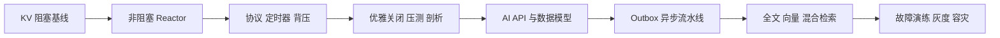

# 综合项目

综合项目的目标不是堆组件，而是证明你能管理端到端语义：请求进入后在哪里排队、超时如何传递、数据如何保持一致、重复如何处理、服务如何关闭、故障如何发现。

## 为什么需要两个项目

[高性能 KV 服务](01-项目一-高性能KV服务.md)把范围限制在单进程/单机，迫使你正面处理 C++ 所有权、fd、Reactor、缓冲、定时器和线程模型。[AI 文档处理与检索平台](02-项目二-AI文档处理与检索平台.md)则使用成熟组件，把难点转移到跨系统状态、异步任务、幂等、最终一致、检索质量和运维。

这两个项目分别回答：

- **单个服务如何正确而高效地运行？**
- **多个服务和数据系统如何在部分失败下协作？**

不建议一开始就把 KV 项目分布式化，也不建议在 AI 平台中自己重写消息队列或对象存储。每个项目只在它要训练的边界内“造轮子”。

## 项目选择

1. [项目一：高性能 KV 服务](01-项目一-高性能KV服务.md)：聚焦 C++、Socket、Reactor、协议、并发、生命周期和性能。
2. [项目二：AI 文档处理与检索平台](02-项目二-AI文档处理与检索平台.md)：聚焦 HTTP/RPC、数据库、Redis、消息队列、对象存储、混合检索和分布式可靠性。
3. [工程验收模板](03-工程验收模板.md)：统一设计、测试、压测、故障演练和交付标准。

建议先不使用完整网络框架实现项目一，以理解底层；项目二使用成熟框架和客户端库，把精力转移到服务边界和正确性。

## 推荐实施顺序

每个里程碑都先提交设计说明和测试，再实现功能。性能优化放在正确性和可观测性之后，否则无法判断优化是否改变语义。

## 共同约束

- 所有队列、线程池、连接池必须有上限和满载策略。
- 所有跨进程调用必须有截止时间；只在可证明安全的位置重试。
- 所有异步任务必须定义投递语义、幂等键、状态机和毒消息处理。
- 所有服务必须支持 readiness、停止接流量、连接排空和有截止时间的退出。
- 至少注入三类故障，并用日志、指标、追踪解释影响。
- 性能结论必须附环境、数据集、负载模型、延迟分位数、错误率和资源指标。

## 评审维度

| 维度 | 评审问题 |
| --- | --- |
| 所有权 | 谁创建、访问、关闭 fd/线程/连接/任务？迟到回调如何处理？ |
| 协议 | 边界、版本、大小限制、错误码、幂等和取消语义是否明确？ |
| 容量 | 每个队列/池/缓冲的上限是什么？满载时如何退化？ |
| 一致性 | 权威状态在哪？双写失败和重复怎样发现与修复？ |
| 可靠性 | 超时、重试、熔断、排空和恢复是否有明确时序？ |
| 可观测 | 用户 SLI 能否拆到队列、依赖、资源和具体业务状态？ |
| 安全 | 输入、租户、凭据、日志、对象和管理操作如何隔离？ |
| 验证 | 测试与演练能证明什么，哪些结论仍是未验证假设？ |

## 每阶段交付包

1. 一页目标/非目标和容量假设；
2. 组件图、线程/状态图和关键时序；
3. API/协议与数据模型；
4. 自动测试和故障注入脚本说明；
5. 指标、日志字段、trace 和告警设计；
6. 可复现结果、已知限制和下一阶段决策。

具体填写项使用[工程验收模板](03-工程验收模板.md)，实验方法参考[实验与验证指南](../09-实验与验证指南.md)。
