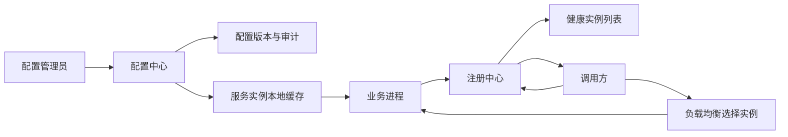
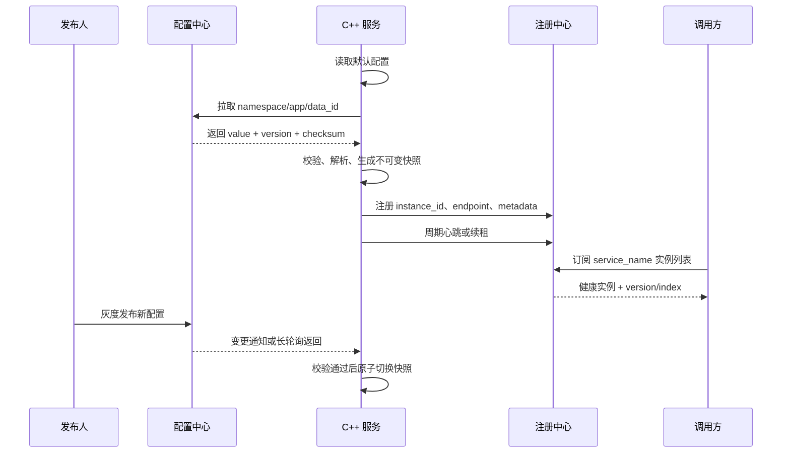

# 配置中心与服务发现

## 学习目标

- 区分配置中心、服务注册、服务发现、负载均衡的职责。
- 理解配置变更的发布、订阅、灰度和回滚流程。
- 理解客户端发现、服务端发现、DNS 发现、控制面下发的差异。
- 能为 C++ 后端服务设计一套保守的配置读取与发现接入路径。

## 核心概念

配置中心管理运行时配置，例如数据库地址、功能开关、限流阈值、采样率、日志级别。它关注配置版本、权限、审计、动态刷新和回滚。

服务发现维护“服务名到健康实例列表”的映射。注册中心接收实例注册和心跳，发现客户端订阅实例变化，调用方再结合负载均衡策略选择目标实例。

两者容易被混在一起，因为它们都属于控制面。但配置中心传递的是运行参数，服务发现传递的是可调用端点。生产系统中应把二者的变更权限、发布流程和故障策略分开设计。

常见形态：

- 配置中心：Apollo、Nacos、Consul KV、etcd、自研配置服务、Kubernetes ConfigMap/Secret。
- 服务发现：Consul、Nacos、Eureka、etcd、Kubernetes Service/DNS、xDS 控制面。
- C++ 接入路径：配置 SDK、HTTP 拉取、文件挂载、sidecar、本地 agent、DNS 解析、gRPC resolver、服务网格代理。

## 架构与数据流



关键链路：

1. 服务启动时读取本地默认配置。
2. 从配置中心拉取指定环境、集群、命名空间的配置。
3. 监听配置变更并写入本地缓存。
4. 服务实例向注册中心注册地址、端口、版本、健康状态。
5. 调用方订阅实例列表，按健康状态和负载均衡策略发起调用。

## 示例

一个服务的配置可以拆成静态启动参数和动态运行参数。下面是结构示意，生产环境还需要配套权限、审计、Secret 管理、灰度发布和回滚流程。

```yaml
service:
  name: order-service
  env: staging
  instance_id: order-10.1.2.3-8080

server:
  port: 8080

runtime:
  log_level: info
  trace_sample_ratio: 0.05
  max_inflight_requests: 2000

dependencies:
  payment_service: payment-service
```

C++ 服务常见做法：

- 启动参数和本地 YAML/JSON 提供最小可运行配置。
- 配置中心 SDK 或 HTTP 客户端拉取动态配置。
- 配置解析后转换成不可变快照，用原子指针或读写锁热更新。
- 对发现结果使用本地缓存，避免注册中心短暂故障直接影响请求路径。

## 典型工作流

1. 新服务上线前，先创建服务名、环境、配置命名空间和权限。
2. 配置默认值进入代码仓库，环境差异进入配置中心。
3. 服务启动后注册自身实例，并暴露健康检查。
4. 调用方通过服务名发现实例，不在代码中写死 IP。
5. 配置变更先灰度小流量实例，观察指标和日志，再全量发布。
6. 异常时回滚配置版本，必要时摘除不健康实例。

## 常见坑

- 把数据库密码、Token 等敏感配置放进普通配置项，缺少加密和访问审计。
- 动态配置没有版本号，排障时无法知道某次异常对应哪次配置发布。
- 配置热更新直接修改共享对象，导致 C++ 多线程读写竞态。
- 服务发现结果没有本地缓存，注册中心抖动会放大成全站故障。
- 实例注册成功但健康检查不准确，调用方持续打到不可用实例。
- 服务名、环境、集群命名不统一，后续日志、指标、Trace 无法关联。

## 排障步骤

1. 确认服务实际加载的配置版本、环境和命名空间。
2. 对比本地默认配置、配置中心当前值和进程内生效快照。
3. 查看配置发布审计，确认异常时间点是否有变更。
4. 检查服务实例是否注册，注册地址是否可从调用方网络访问。
5. 检查健康检查结果与真实依赖状态是否一致。
6. 在调用方确认发现缓存、负载均衡选择和连接错误。
7. 临时回滚配置或摘除实例后，观察错误率、延迟和日志是否恢复。

## 练习

1. 为一个 C++ HTTP 服务设计配置结构，区分启动配置和动态配置。
2. 写出一次配置灰度发布的步骤和回滚条件。
3. 画出调用方通过服务名访问 `payment-service` 的发现流程。
4. 列出 5 个必须进入实例元数据的字段，并说明用途。

## 检查清单

- 配置有默认值、版本号、审计和回滚能力。
- 动态配置更新是线程安全的。
- 敏感配置经过加密或 Secret 管理。
- 服务注册包含服务名、环境、版本、实例 ID、地址、端口。
- 调用方有发现缓存和失败重试策略。
- 健康检查能反映进程和关键依赖状态。
- 配置和发现字段能与日志、指标、Trace 统一关联。

## 前置知识与完成标准

前置知识：

- 了解 HTTP、DNS、gRPC、TCP 端口、负载均衡和健康检查的基本含义。
- 了解强一致、最终一致、缓存、心跳、租约、长轮询、watch 这几类分布式系统术语。
- 能读懂 YAML/JSON 配置，并知道进程启动参数、环境变量、本地文件和远端配置的优先级可能不同。

完成本节后应能做到：

- 给一个服务画出“配置读取”和“实例发现”两条控制面链路。
- 说明为什么配置中心不能替代服务发现，服务发现也不能替代网关或服务网格。
- 设计一套配置热更新方案，说明一致性、缓存降级、回滚和线程安全边界。
- 设计一套服务注册发现方案，说明健康检查、监听/轮询、本地缓存和调用方负载均衡。

## 知识点拆解

### 配置中心

原理：配置中心把环境差异和运行时参数从应用包中外置出来，按应用、环境、命名空间、配置项和版本管理。客户端启动时读取本地默认值，再拉取远端配置，之后通过长轮询、watch、推送或定期轮询感知变更。

数据模型：

```text
namespace/env -> application/service -> group/namespace -> data_id/key -> value -> version
```

适用场景：

- 功能开关、限流阈值、采样率、日志级别、降级开关。
- 不同环境的非敏感差异项，例如依赖服务名、连接池大小。
- 需要灰度、审计和快速回滚的运行时参数。

边界：

- 不应作为大对象存储、频繁写入数据库或消息总线。
- Secret 可以由配置中心引用，但明文密钥应交给 Secret 管理系统。
- 热更新只适合能安全切换的参数；端口、线程模型、存储 schema 这类启动期参数通常需要重启。

与相邻概念区别：

- 环境变量适合部署期注入，变更通常需要重启；配置中心适合运行期受控变更。
- Kubernetes ConfigMap/Secret 是集群原生配置对象；Apollo/Nacos/Consul KV 更强调应用维度、灰度和审计。
- Feature Flag 更偏产品实验和流量规则；配置中心更通用。

### 服务注册与服务发现

原理：服务实例启动后把实例地址、端口、权重、版本和健康状态注册到注册中心。调用方按服务名查询或订阅实例列表，再用本地负载均衡选择目标实例。注册信息一般带租约或心跳，失联后自动摘除。

数据模型：

```text
namespace/env -> service_name -> cluster/zone -> instance_id -> endpoint + metadata + health
```

适用场景：

- 微服务之间不写死 IP，实例可弹性扩缩容。
- 灰度实例按版本、机房、权重或元数据筛选。
- 注册中心或 Kubernetes Service 维护服务名到健康后端的映射。

边界：

- 服务发现只回答“有哪些可调用实例”，不保证请求级限流、熔断、认证和路由策略完整正确。
- 健康状态是观测结果，不等于真实业务可用性；探针过浅会误判，探针过深会放大依赖故障。
- DNS 发现有 TTL 和缓存延迟，不能假设瞬时收敛。

与相邻概念区别：

- 注册中心保存服务目录；负载均衡器负责选择和转发；网关负责入口协议、安全和路由；服务网格负责更细的东西向流量治理。
- 客户端发现把选择逻辑放在调用方；服务端发现把选择逻辑放在代理、网关或 kube-proxy 等中间层。

## 一致性、监听、轮询与缓存降级

一致性选择要和风险匹配：

- 强一致读：适合锁、主节点选举、全局唯一状态，但延迟和可用性成本更高。etcd 默认提供线性一致读写，适合 Kubernetes 控制面这类强一致元数据。
- 最终一致读：适合配置和服务发现的多数查询路径，允许短暂滞后，用缓存和版本号防止回退。
- 单调版本：客户端只接受版本号递增的配置，避免网络乱序导致旧配置覆盖新配置。

监听/轮询方式：

- 长轮询：客户端发起请求，服务端在变更或超时后返回。优点是穿透网络简单；缺点是连接数和超时管理要做好。
- Watch/流式订阅：服务端持续推送变更事件。优点是实时性好；缺点是断线重连、断点续传和事件压缩要处理。
- 定期轮询：实现简单，适合作为兜底；缺点是变更延迟和无效请求更多。

缓存降级原则：

1. 启动必须有本地默认配置，最低限度让进程能暴露健康检查和日志。
2. 远端拉取失败时使用最后一次成功快照，并打出配置版本、快照时间和失败原因。
3. 快照过期后进入保守模式，例如关闭高风险功能、降低采样率或停止接收新流量。
4. 发现中心不可用时继续使用本地实例缓存，但缩短连接空闲时间，避免长期打到坏实例。

## 更细的架构与数据流



关键数据：

- 配置侧：`namespace`、`data_id`、`group`、`version`、`checksum`、`operator`、`publish_time`。
- 发现侧：`service_name`、`instance_id`、`ip`、`port`、`weight`、`zone`、`version`、`healthy`、`enabled`。
- 观测侧：配置版本应进入日志字段和指标标签，但不要把每个配置项都变成标签。

## 分步接入

1. 先把启动必需配置、本地默认配置和动态运行配置分开。
2. 给每个配置项定义类型、默认值、合法范围、是否可热更新和回滚策略。
3. 接入配置中心拉取接口，成功后落本地快照，失败时继续使用默认值或上次快照。
4. 接入监听、长轮询或 watch，同时保留定期轮询作为兜底。
5. 服务启动后注册实例，元数据包含服务名、环境、版本、zone、权重和健康端点。
6. 调用方订阅或轮询实例列表，使用本地缓存和负载均衡策略选择健康实例。
7. 把配置版本、发现缓存版本、注册状态和健康状态暴露为指标与日志字段。

## 从零可复现实验

目标：不用真实 Nacos/Consul，也能复现“远端配置 + 本地缓存 + 服务发现”的行为。

目录准备：

```bash
mkdir -p /tmp/obs-demo/config /tmp/obs-demo/registry
cat >/tmp/obs-demo/config/order.json <<'JSON'
{"version":1,"log_level":"info","max_inflight_requests":2000,"trace_sample_ratio":0.05}
JSON
cat >/tmp/obs-demo/registry/payment-service.json <<'JSON'
{"version":1,"instances":[{"id":"pay-1","host":"127.0.0.1","port":18080,"healthy":true,"weight":100}]}
JSON
```

启动一个只读 HTTP 文件服务：

```bash
cd /tmp/obs-demo
python3 -m http.server 19000
```

另开终端拉取配置和发现结果：

```bash
curl -s http://127.0.0.1:19000/config/order.json
curl -s http://127.0.0.1:19000/registry/payment-service.json
```

模拟配置发布：

```bash
cat >/tmp/obs-demo/config/order.json <<'JSON'
{"version":2,"log_level":"debug","max_inflight_requests":1500,"trace_sample_ratio":0.1}
JSON
curl -s http://127.0.0.1:19000/config/order.json
```

预期数据：

- 第一次返回 `version=1`，第二次返回 `version=2`。
- 客户端应记录“旧版本 -> 新版本”的切换日志。
- 如果 JSON 损坏，客户端应拒绝切换并继续使用旧快照。

失败现象：

- HTTP 连接失败：使用本地快照，日志中出现 `config_fetch_failed`。
- 返回旧版本：客户端忽略，日志中出现 `config_stale_ignored`。
- 注册列表为空：调用方进入无可用实例状态，错误应是 `NO_HEALTHY_INSTANCE`，不是连接超时。

验证方法：

- 修改配置后观察进程内导出的 `config_version` 是否变为 2。
- 断开文件服务后确认业务仍使用最后一次成功配置。
- 把实例 `healthy` 改为 `false`，确认调用方不再选择该实例。

## 配置逐段解释

示例服务配置：

```yaml
service:
  name: order-service
  env: prod
  instance_id: order-10-1-2-3-8080

runtime:
  log_level: info
  trace_sample_ratio: 0.05
  max_inflight_requests: 2000

discovery:
  provider: nacos
  refresh_interval: 30s
  cache_ttl: 10m
```

逐段说明：

- `service` 是资源身份，必须与日志、指标、Trace 的资源字段一致。
- `runtime` 是可热更新参数，每一项都要定义合法范围和默认值。
- `trace_sample_ratio` 的变更会直接影响后端成本，适合灰度发布。
- `discovery.provider` 是发现实现，不应散落在业务代码里。
- `refresh_interval` 是轮询兜底，不等于实时监听间隔。
- `cache_ttl` 是降级边界，超过后应进入保守模式并告警。

## 成本、安全、隐私、采样、基数与保留

- 成本：配置和发现系统的成本主要来自连接数、watch 数、心跳频率、历史版本和审计日志。大规模服务应合并订阅，避免每个线程各自监听。
- 安全：配置发布需要最小权限、双人审批或变更窗口；发现注册接口不能暴露到公网。
- 隐私：配置值、实例元数据和审计日志中不要放手机号、身份证号、用户 Token。
- 采样：配置中心本身的访问日志可采样，但发布、回滚、权限变更必须完整保留。
- 标签基数：指标标签可包含 `service`、`env`、`namespace`，不要包含 `data_id` 全量值、实例唯一 ID 的高频组合或配置内容。
- 保留策略：配置版本保留最近 N 次和关键发布点；审计日志按合规要求保留；发现心跳明细短期保留，聚合指标长期保留。

## 排障决策树

```text
服务异常
├─ 是否刚发布配置？
│  ├─ 是：核对生效版本 -> 灰度范围 -> 回滚到上个稳定版本
│  └─ 否：继续
├─ 进程内配置是否等于配置中心当前值？
│  ├─ 否：检查监听/轮询、缓存快照、解析失败日志
│  └─ 是：继续
├─ 调用方是否发现到实例？
│  ├─ 否：检查注册、心跳、租约、命名空间、服务名
│  └─ 是：继续
├─ 发现结果是否只包含健康实例？
│  ├─ 否：检查探针、保护阈值、enabled/healthy 差异
│  └─ 是：检查网络、负载均衡、依赖自身错误
```

## 分层练习与答案要点

基础练习：把 `log_level` 从 `info` 改为 `debug`，写出安全发布步骤。

答案要点：先校验合法值；灰度到单实例；确认日志量、CPU、磁盘写入无异常；再扩大范围；异常时按版本回滚。

进阶练习：注册中心短暂不可用 5 分钟，调用方应该如何表现？

答案要点：使用最后一次健康实例缓存；对连接失败实例做本地熔断；持续告警注册中心不可用；缓存超过 TTL 后停止扩大流量或进入保守模式。

综合练习：设计 `order-service` 调 `payment-service` 的发现方案。

答案要点：服务名按环境隔离；实例注册包含版本、zone、weight；调用方订阅实例列表并本地缓存；健康检查区分 liveness/readiness；发现变更进入指标和日志；异常时能按服务名、版本和 zone 下钻。

## 小结

配置中心解决“运行参数如何安全变化”，服务发现解决“调用方如何找到健康实例”。两者都属于控制面，但数据模型、权限、故障边界和缓存策略不同。生产接入时最重要的不是 SDK 调通，而是版本、审计、回滚、健康检查和本地降级完整闭环。

## 官方延伸阅读

- Nacos 配置与服务发现概览：https://nacos.io/en/docs/v2/what-is-nacos/
- Nacos 服务发现模型：https://nacos.io/en/docs/latest/manual/user/naming/overview/
- Nacos 健康、权重与元数据：https://www.nacos.io/en/docs/next/manual/user/naming/health-and-metadata/
- Nacos 监控与健康端点：https://nacos.io/en/docs/latest/manual/admin/monitor/
- Consul 服务发现：https://developer.hashicorp.com/consul/docs/discover
- Consul Watches：https://developer.hashicorp.com/consul/docs/automate/watch
- etcd API 保证：https://etcd.io/docs/v3.5/learning/api_guarantees/
- etcd Watch API：https://etcd.io/docs/v3.7/learning/api/
- Kubernetes 探针：https://kubernetes.io/docs/tasks/configure-pod-container/configure-liveness-readiness-probes/
