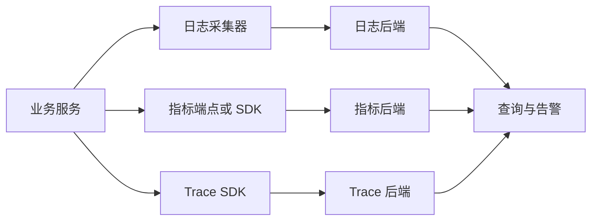
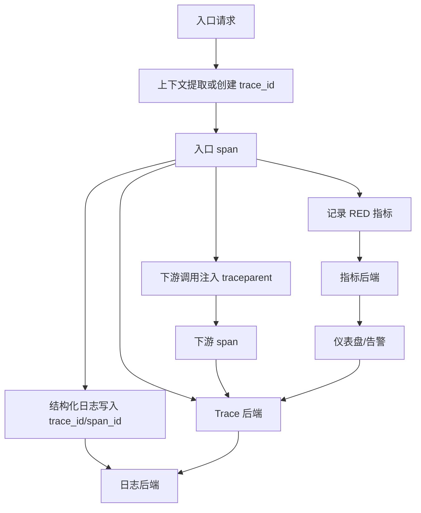

# 日志、指标、Trace 三类信号

## 学习目标

- 区分日志、指标、Trace 的用途、成本和数据模型。
- 理解三类信号如何通过上下文字段关联。
- 掌握采集链路、采样策略和标签/基数风险。
- 能为 C++ 后端服务设计基础观测方案。

## 核心概念

日志是事件记录，数据模型通常是一条带时间戳和字段的事件。它适合回答“发生了什么”，例如一次订单创建失败的错误码、请求参数摘要、异常堆栈。

指标是按时间聚合的数值序列，数据模型通常是指标名加标签集合再加样本值。它适合回答“整体状态如何变化”，例如 QPS、错误率、P99 延迟、队列长度。

Trace 是一次请求的因果路径，数据模型通常是 trace、span、span event、span attribute。它适合回答“一次请求经过了哪些服务，哪里慢或失败”。

三者不是替代关系。一次典型排障会先看指标发现异常，再用 Trace 定位慢服务或失败依赖，最后用日志查看局部细节。

## 信号用途与数据模型

| 信号 | 主要用途 | 数据模型 | 优点 | 风险 |
| --- | --- | --- | --- | --- |
| 日志 | 解释离散事件和错误细节 | 时间戳 + 级别 + 消息 + 字段 | 细节丰富，便于审计 | 成本高，查询依赖字段质量 |
| 指标 | 趋势、告警、容量分析 | metric name + labels + samples | 成本低，聚合快 | 高基数会拖垮存储和查询 |
| Trace | 请求路径和因果关系 | trace id + spans + attributes | 跨服务定位直观 | 采样后不一定覆盖所有请求 |

## 架构与数据流



关联字段建议：

- `service.name`：服务名。
- `deployment.environment`：环境。
- `service.version`：版本。
- `service.instance.id`：实例 ID。
- `trace_id` 和 `span_id`：日志与 Trace 关联。
- `http.route`：低基数路由模板，例如 `/orders/{id}`。
- `error.type` 或 `error_code`：错误分类。

团队应维护一张跨后端字段映射表。OpenTelemetry 语义字段常用点号，例如 `service.name`；进入 Prometheus 或 Loki 时通常要转换成合法标签名或团队约定名，例如 `service.name` 映射为 `service` 或 `service_name`，`deployment.environment` 映射为 `env` 或 `deployment_environment`。关键不是某个名字天然正确，而是日志、指标、Trace、仪表盘和告警规则使用同一套映射。

## 示例

结构化日志：

```json
{
  "timestamp": "2026-08-31T09:00:00Z",
  "level": "error",
  "service.name": "order-service",
  "trace_id": "4bf92f3577b34da6a3ce929d0e0e4736",
  "span_id": "00f067aa0ba902b7",
  "event": "payment_request_failed",
  "order_id_hash": "b6f1",
  "error_code": "PAYMENT_TIMEOUT"
}
```

Prometheus 指标：

```text
http_server_requests_total{service="order-service",method="POST",route="/orders",status="500"} 17
http_server_request_duration_seconds_bucket{service="order-service",route="/orders",le="0.5"} 1200
```

Trace span 属性：

```text
span.name = POST /orders
trace_id = 4bf92f3577b34da6a3ce929d0e0e4736
attributes:
  service.name = order-service
  http.method = POST
  http.route = /orders
  error.type = PAYMENT_TIMEOUT
```

C++ 接入路径：

- 日志：spdlog、glog、Boost.Log 等输出 JSON 或 key-value 格式。
- 指标：Prometheus C++ client、StatsD 客户端、OpenTelemetry Metrics SDK、服务网格指标。
- Trace：OpenTelemetry C++ SDK、gRPC/HTTP 中间件、sidecar 自动注入能力。

## 典型工作流

1. 先定义统一资源字段：服务名、环境、版本、实例 ID。
2. 为入口请求生成或读取 Trace 上下文。
3. 在日志中写入 Trace ID 和错误分类，而不是只写自然语言。
4. 为关键路径增加 RED 指标：Rate、Errors、Duration。
5. 为资源增加 USE 指标：Utilization、Saturation、Errors。
6. 对 Trace 设置采样策略，保留错误请求或慢请求样本。
7. 在仪表盘里从错误率跳转到 Trace，再从 Trace 跳转到日志。

## 常见坑

- 指标标签放用户 ID、订单 ID、请求 ID，造成高基数。
- 日志只有字符串消息，没有结构化字段，查询只能模糊匹配。
- Trace ID 没写入日志，导致三类信号无法串联。
- Span 命名包含具体 ID，例如 `GET /orders/123`，导致聚合失效。
- 只采集成功路径，错误路径没有日志和 span status。
- 告警直接基于单实例瞬时值，误报和漏报都严重。

## 排障步骤

1. 从指标确认影响面：哪些服务、路由、状态码、实例异常。
2. 查看部署、配置、流量是否在异常前后变化。
3. 用 Trace 查询慢请求或错误请求，定位失败 span。
4. 根据 Trace ID 查日志，读取错误码、依赖返回和本地上下文。
5. 检查标签基数和采样率，确认不是观测系统自身丢数据。
6. 修复后用同一组指标验证错误率和延迟恢复。

## 练习

1. 为 `POST /orders` 设计 3 条日志字段、3 个指标和 3 个 span 属性。
2. 判断这些标签是否适合放进指标：`user_id`、`http.route`、`region`、`request_id`。
3. 写一条排障路径：P99 延迟升高但错误率不变时如何定位。
4. 给 C++ 服务设计一个把 Trace ID 写入日志上下文的方案。

## 检查清单

- 日志、指标、Trace 的职责没有混用。
- 三类信号共享服务名、环境、版本、实例 ID。
- 日志包含 Trace ID、错误分类和关键业务上下文。
- 指标标签保持低基数，避免用户级和请求级标签。
- Trace span 使用稳定名称和语义化属性。
- 采样策略覆盖错误请求和慢请求。
- 仪表盘支持从指标跳到 Trace 和日志。

## 前置知识与完成标准

前置知识：

- 知道一次 HTTP/RPC 请求会经过入口、业务逻辑、依赖调用和返回响应。
- 理解时间戳、字段、标签、聚合、采样和请求 ID。
- 能区分单次事件、聚合趋势和跨服务因果链路。

完成标准：

- 能为一个接口同时设计日志字段、指标和 Trace span。
- 能解释三类信号的数据模型、成本差异和关联字段。
- 能判断故障定位时先看哪类信号，何时切换到另一类信号。
- 能识别高基数、过度日志、过低采样和字段不一致造成的问题。

## 三类信号逐项拆解

### 日志

原理：日志记录离散事件。每条日志是某个时间点发生的一件事，适合保留上下文、错误原因、审计证据和异常堆栈。

数据模型：

```text
timestamp + observed_timestamp + severity + body/message + resource + attributes + trace_id + span_id
```

适用场景：

- 解释某次失败的业务原因，例如支付渠道返回 `UPSTREAM_TIMEOUT`。
- 审计关键操作，例如配置发布、权限变更、订单状态迁移。
- 保存异常堆栈、多行错误和输入摘要。

边界：

- 日志不适合直接计算全局 P99 或高频告警。
- 自然语言日志难以稳定查询，生产应以结构化字段为主。
- 明细日志成本最高，必须控制级别、采样、脱敏和保留周期。

与相邻概念区别：日志回答“这次发生了什么”；事件审计更强调不可抵赖和合规；Trace span event 是某次 Trace 内的事件，不一定进入日志系统长期保留。

### 指标

原理：指标把事件聚合为时间序列。一个指标名加一组标签形成一条序列，后端按时间保存样本，适合快速聚合、告警和容量分析。

数据模型：

```text
metric_name + labels + timestamp + value
```

适用场景：

- RED：请求速率、错误率、耗时分布。
- USE：资源使用率、饱和度、错误。
- SLI/SLO：可用性、延迟达标率、错误预算消耗。

边界：

- 指标会丢失单次请求细节。
- 标签必须低基数；`user_id`、`request_id`、完整 URL、异常消息不应作为标签。
- Counter 要用 `rate()` 或 `increase()` 看变化，不能把累计值当瞬时值。

与相邻概念区别：指标回答“整体状态如何变化”；日志聚合可以临时生成指标，但成本和稳定性通常不如原生指标。

### Trace

原理：Trace 把一次请求拆成多个 span。每个 span 表示一个操作，带开始时间、持续时间、父子关系、状态和属性。上下文传播让跨服务调用共享同一个 Trace ID。

数据模型：

```text
trace_id -> span_id + parent_span_id + name + kind + start/end + status + attributes + events + links
```

适用场景：

- 还原一次请求经过哪些服务和依赖。
- 定位慢点在入口、业务代码、数据库、缓存还是下游服务。
- 分析扇出、重试、异步消息和跨服务错误传播。

边界：

- Trace 通常采样，不保证每次请求都有样本。
- span 属性同样有基数风险，不能把大对象、明文 PII 或无限枚举放进去。
- 没有上下文传播时，Trace 会断裂成多个局部片段。

与相邻概念区别：Trace 回答“这次请求的因果路径是什么”；调用链拓扑是 Trace 聚合后的视图，不等于单次请求证据。

## 何时选择哪类信号

| 问题 | 首选信号 | 切换条件 |
| --- | --- | --- |
| 用户报“下单慢” | 指标 | 确认 P95/P99 异常后查 Trace |
| 单个订单失败 | 日志 | 有 Trace ID 时从 Trace 看跨服务路径 |
| 新版本错误率升高 | 指标 | 按版本拆分后查错误 Trace 和日志 |
| 数据不一致 | 日志 | 需要确认跨服务调用顺序时查 Trace |
| 容量不足 | 指标 | 需要确认热点请求路径时查 Trace |
| 安全审计 | 日志 | 只用指标无法满足审计证据 |

## 分步接入

1. 先定义统一资源字段和命名规范，避免每个后端各用一套字段。
2. 给入口请求接入 Trace 上下文，保证日志能写入 `trace_id` 和 `span_id`。
3. 为入口和关键依赖增加 RED 指标，指标标签只保留低基数字段。
4. 把自然语言日志改成结构化日志，至少包含事件名、错误类型和资源字段。
5. 为关键业务步骤增加 span，并在错误路径设置 status 和错误属性。
6. 在仪表盘上建立“指标 -> Trace -> 日志”的跳转路径。
7. 评审采样、保留、脱敏和基数规则，再扩大到更多服务。

## 更细的架构与关联数据流



统一字段映射：

| 语义 | OTel 字段 | Prometheus/Loki 常见标签 | 日志字段 |
| --- | --- | --- | --- |
| 服务名 | `service.name` | `service` 或 `service_name` | `service.name` |
| 环境 | `deployment.environment.name` | `env` | `deployment.environment.name` |
| 路由 | `http.route` | `route` | `http.route` |
| 错误类型 | `error.type` | `error_type` | `error.type` |
| Trace ID | `trace_id` | 通常不做指标标签 | `trace_id` |

## 从零可复现实验

目标：用一个本地脚本手工生成三类信号，理解它们如何关联。

```bash
mkdir -p /tmp/obs-signals
cat >/tmp/obs-signals/app.log <<'LOG'
{"ts":"2026-08-31T09:00:00Z","level":"error","service.name":"order-service","trace_id":"aaaaaaaaaaaaaaaaaaaaaaaaaaaaaaaa","span_id":"bbbbbbbbbbbbbbbb","event":"payment_failed","error.type":"UPSTREAM_TIMEOUT","http.route":"/orders"}
LOG
cat >/tmp/obs-signals/metrics.prom <<'METRIC'
http_server_requests_total{service="order-service",route="/orders",status="500"} 1
http_server_request_duration_seconds_bucket{service="order-service",route="/orders",le="0.5"} 0
http_server_request_duration_seconds_bucket{service="order-service",route="/orders",le="1"} 1
http_server_request_duration_seconds_count{service="order-service",route="/orders"} 1
http_server_request_duration_seconds_sum{service="order-service",route="/orders"} 0.8
METRIC
cat >/tmp/obs-signals/trace.txt <<'TRACE'
trace_id=aaaaaaaaaaaaaaaaaaaaaaaaaaaaaaaa
span_id=bbbbbbbbbbbbbbbb
name=POST /orders
status=ERROR
attribute.error.type=UPSTREAM_TIMEOUT
TRACE
```

验证方法：

```bash
grep aaaaaaaaaaaaaaaaaaaaaaaaaaaaaaaa /tmp/obs-signals/app.log
grep http_server_requests_total /tmp/obs-signals/metrics.prom
grep attribute.error.type /tmp/obs-signals/trace.txt
```

预期数据：

- 日志和 Trace 使用同一个 `trace_id`。
- 指标不包含 `trace_id`，只按服务、路由、状态码聚合。
- `error.type` 同时出现在日志和 Trace，可用于跳转后确认原因。

失败现象：

- 日志没有 `trace_id`：从 Trace 无法跳转到具体日志。
- 指标标签含 `request_id`：每个请求产生新序列，查询和存储成本爆炸。
- Trace 采样没保留错误请求：指标显示错误，但 Trace 后端没有样本。

## 查询与配置逐段解释

指标查询：

```promql
sum by (service, route) (
  rate(http_server_requests_total{status=~"5.."}[5m])
)
/
sum by (service, route) (
  rate(http_server_requests_total[5m])
)
```

逐段解释：

- `http_server_requests_total` 是 Counter，必须用 `rate(...[5m])` 转成每秒速率。
- `{status=~"5.."}` 只选择 5xx。
- `sum by (service, route)` 聚合实例维度，保留服务和路由维度。
- 分子除以分母得到 5 分钟错误率。

日志查询思路：

```text
service.name="order-service" AND error.type="UPSTREAM_TIMEOUT" AND trace_id="aaaaaaaaaaaaaaaaaaaaaaaaaaaaaaaa"
```

逐段解释：

- 先用服务名和时间范围缩小范围。
- 再用错误类型定位同类失败。
- 最后用 Trace ID 找单次请求上下文。

Trace 查询思路：

```text
service.name = order-service
span.name = POST /orders
status = ERROR
duration > 500ms
```

逐段解释：

- 服务名定位入口。
- span 名称必须是路由模板，不是具体 URL。
- `status=ERROR` 找失败样本。
- `duration` 找慢请求。

## 成本、安全、隐私、采样、基数与保留

- 成本：日志按字节和索引收费最多；Trace 成本受 span 数和采样率影响；指标成本受时间序列数量影响。
- 安全：日志和 Trace 属性中不要写密钥、Token、身份证号、手机号、完整银行卡号。
- 隐私：用户标识应哈希化或分级访问；能用于重识别的字段要按隐私数据处理。
- 采样：指标通常不采样；Trace 做头部采样、尾部采样或错误优先采样；日志可按级别或事件类型采样。
- 标签基数：指标标签最低要求是可枚举、稳定、低数量；日志字段可高一些，但索引字段仍要控制；Trace 属性应避免无限枚举。
- 保留：聚合指标可长期保留；明细日志短期热存，归档冷存；Trace 样本按排障窗口保留。

## 排障决策树

```text
发现异常
├─ 是趋势性问题吗？
│  ├─ 是：先看指标，确认服务/路由/版本/实例影响面
│  └─ 否：先查日志或用户提供的 Trace ID
├─ 指标是否能定位到服务？
│  ├─ 否：检查标签规范和仪表盘口径
│  └─ 是：查错误或慢请求 Trace
├─ Trace 是否完整？
│  ├─ 否：检查上下文传播、异步边界、采样规则
│  └─ 是：定位失败 span
└─ 需要错误细节？
   ├─ 是：用 trace_id/span_id 查日志
   └─ 否：用指标验证恢复
```

## 分层练习与答案要点

基础练习：判断 `user_id`、`route`、`status`、`request_id` 哪些适合做指标标签。

答案要点：`route` 和 `status` 适合；`user_id`、`request_id` 高基数，不适合。

进阶练习：P99 延迟升高但错误率不变，设计排障路径。

答案要点：先按路由和实例拆指标；查慢 Trace；看慢 span 是数据库、缓存、下游还是本地 CPU；用日志确认是否有重试、限流或超时。

综合练习：为 `POST /orders` 设计三类信号。

答案要点：日志包含 `trace_id`、`order_id_hash`、`error.type`；指标包含请求总数和延迟 Histogram；Trace 包含入口 span、支付 span、库存 span，并在错误 span 标记 status 和错误类型。

## 小结

日志、指标、Trace 是互补关系。指标负责发现和量化，Trace 负责还原路径，日志负责解释细节。三者能否协同，取决于统一资源字段、低基数设计、上下文传播、采样策略和跨后端跳转。

## 官方延伸阅读

- OpenTelemetry 日志数据模型：https://opentelemetry.io/docs/specs/otel/logs/data-model/
- OpenTelemetry 语义约定：https://opentelemetry.io/docs/concepts/semantic-conventions/
- OpenTelemetry Metrics 数据模型：https://github.com/open-telemetry/opentelemetry-specification/blob/main/specification/metrics/data-model.md
- OpenTelemetry 上下文传播：https://opentelemetry.io/docs/concepts/context-propagation/
- Prometheus 数据模型与查询基础：https://prometheus.io/docs/prometheus/latest/querying/basics/
