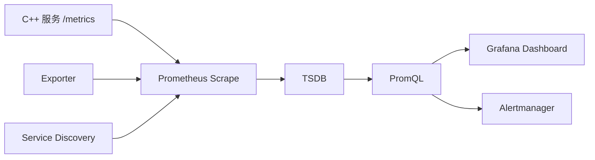
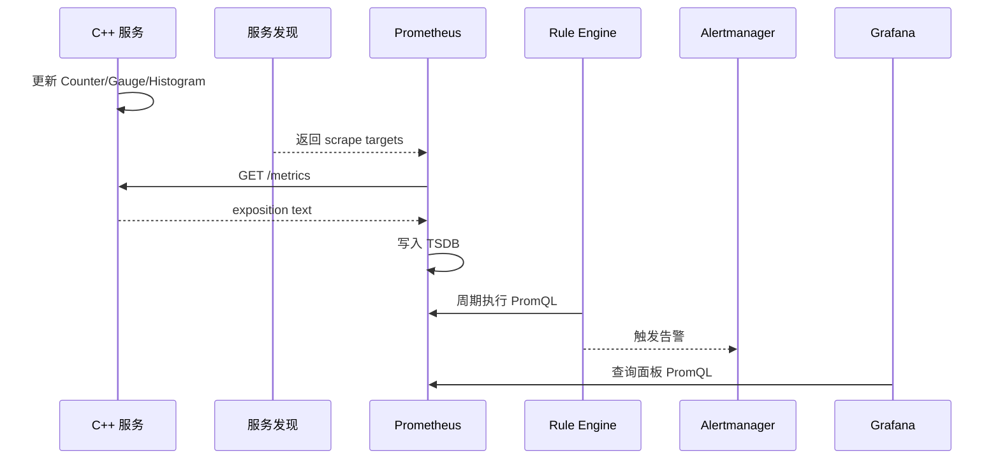

# Prometheus 与 Grafana

## 学习目标

- 理解 Prometheus 的拉取模型、时间序列模型和 PromQL。
- 理解 Grafana 在可视化、告警和跳转分析中的角色。
- 能设计低基数指标和基础 SLI/SLO 仪表盘。
- 掌握 C++ 服务暴露指标的常见路径。

## 核心概念

Prometheus 是面向指标的监控系统。它按 scrape 配置定期拉取目标的 `/metrics`，把样本存储为时间序列。每条序列由指标名和标签集合唯一确定。

Grafana 是可视化和分析入口。它通常不负责采集数据，而是连接 Prometheus、Loki、Elasticsearch、Tempo 等数据源，提供仪表盘、告警规则和跨数据源跳转。

Prometheus 的核心风险是高基数。标签集合越多，时间序列越多。用户 ID、订单 ID、请求 ID、完整 URL、异常消息都不适合作为指标标签。

## 架构与数据流



数据模型：

```text
metric_name{label_a="x", label_b="y"} value timestamp
```

常见指标类型：

- Counter：只增不减，适合请求数、错误数。
- Gauge：可增可减，适合内存、连接数、队列长度。
- Histogram：桶计数，适合延迟分布和分位数估算。
- Summary：客户端计算分位数，跨实例聚合能力较弱，使用需谨慎。

## 示例

推荐的 HTTP 指标：

```text
http_server_requests_total{method="POST",route="/orders",status="500"} 42
http_server_request_duration_seconds_bucket{method="POST",route="/orders",le="0.5"} 900
http_server_request_duration_seconds_count{method="POST",route="/orders"} 1000
http_server_request_duration_seconds_sum{method="POST",route="/orders"} 123.4
```

错误率 PromQL：

```promql
sum(rate(http_server_requests_total{status=~"5.."}[5m]))
/
sum(rate(http_server_requests_total[5m]))
```

P99 延迟 PromQL：

```promql
histogram_quantile(
  0.99,
  sum by (le, route) (
    rate(http_server_request_duration_seconds_bucket[5m])
  )
)
```

C++ 常见接入路径：

- 在进程内使用 Prometheus C++ client 暴露 `/metrics`。
- 对无法改造的组件使用 exporter，例如 node exporter、数据库 exporter。
- 通过 OpenTelemetry Metrics SDK 输出，再由 Collector 转成 Prometheus 可抓取格式。
- 在 Kubernetes 中通过 ServiceMonitor 或 scrape annotation 发现目标。

## 典型工作流

1. 定义服务级 SLI：可用性、错误率、延迟、吞吐量。
2. 为入口请求和关键依赖增加 Counter 与 Histogram。
3. 配置 Prometheus scrape 目标和服务发现。
4. 在 Grafana 创建总览、服务详情、实例详情三个层级。
5. 告警基于持续时间和聚合结果，不基于单点瞬时抖动。
6. 仪表盘链接到日志查询和 Trace 查询。

## 常见坑

- 把完整 URL 当作 `path` 标签，导致每个资源 ID 生成一条时间序列。
- Histogram 桶设计不匹配业务延迟范围，P99 失真。
- Counter 直接求和看瞬时值，忘记用 `rate()` 或 `increase()`。
- 多实例分位数先算每个实例 P99 再平均，结果不正确。
- Grafana 面板很多但没有排障路径，只能“看热闹”。
- 告警没有区分用户影响和单实例噪声。

## 排障步骤

1. 用 `up` 检查目标是否被 Prometheus 正常抓取。
2. 查看 scrape duration、scrape samples、target labels 是否异常。
3. 用 `rate()` 查询请求量和错误率，确认异常开始时间。
4. 按 service、route、status、instance 逐层拆分。
5. 检查最近部署、配置变更和实例重启。
6. 如果查询变慢，检查高基数指标和标签爆炸。
7. 修复后观察告警是否恢复，确认 Grafana 面板与 PromQL 口径一致。

## 练习

1. 为一个 C++ 服务设计 `/metrics` 暴露的 5 个核心指标。
2. 写 PromQL 查询某路由 5 分钟错误率。
3. 解释为什么 `user_id` 不应作为 Prometheus 标签。
4. 设计一个 Grafana 服务详情页，列出至少 6 个面板。

## 检查清单

- 指标名稳定，单位明确，符合后端约定。
- 标签低基数，优先使用 service、route、method、status、instance。
- Counter 查询使用 `rate()` 或 `increase()`。
- 延迟使用 Histogram，并按桶聚合后计算分位数。
- Dashboard 从全局到服务再到实例逐层下钻。
- 告警有持续时间、影响范围和恢复条件。
- Grafana 面板链接到日志和 Trace。

## 前置知识与完成标准

前置知识：

- 了解 HTTP endpoint、定时任务、时间序列、标签和聚合函数。
- 知道服务实例可能动态扩缩容，需要服务发现提供抓取目标。
- 能读懂基本 YAML 和 PromQL 的过滤、聚合、区间选择器。

完成标准：

- 能解释 Prometheus 如何抓取、存储和查询指标。
- 能正确选择 Counter、Gauge、Histogram，并写出对应 PromQL。
- 能设计服务总览、路由详情、实例详情和告警规则。
- 能说明 Grafana 面板、数据源、Explore、Alerting 的职责边界。

## Prometheus 原理与数据模型

Prometheus 默认是拉取模型。服务暴露 `/metrics`，Prometheus 按 `scrape_interval` 周期访问目标，把文本 exposition 格式解析为样本，写入本地 TSDB。每条时间序列由指标名和完整标签集合唯一确定。

数据模型：

```text
metric_name{label_key="label_value"} sample_value sample_timestamp
```

适用场景：

- 服务 SLI/SLO、资源监控、容量趋势、告警。
- 低基数、多实例聚合、固定窗口趋势分析。
- Exporter 采集无法直接改造的系统，例如主机、数据库、中间件。

边界：

- Prometheus 不适合保存每次请求明细。
- 单机 Prometheus 本地存储有容量边界，大规模场景通常需要 remote write、分片或 Thanos/Mimir/Cortex 等体系。
- 抓取失败会导致时间序列断点，告警规则要区分业务异常和采集异常。

与相邻概念区别：

- Prometheus 负责指标采集、存储、PromQL 和规则评估。
- Grafana 负责连接数据源、展示、探索和部分告警管理。
- Alertmanager 负责 Prometheus 告警的去重、分组、静默和通知路由。

## 分步接入

1. 先定义服务 SLI 和指标命名，不从代码里随意暴露临时变量。
2. 在 C++ 服务中接入 metrics client 或 OTel Metrics SDK，暴露 `/metrics` 或 OTLP。
3. 使用 Counter 记录请求和错误，Gauge 记录当前状态，Histogram 记录耗时分布。
4. 配置 Prometheus scrape，先用静态目标验证，再接服务发现。
5. 在 Grafana 配置 Prometheus 数据源，建立总览、服务、实例三层面板。
6. 对稳定 PromQL 建 recording rules，告警规则使用持续时间和影响范围。
7. 评审标签基数、保留周期、权限和跨日志/Trace 跳转。

## 指标类型逐项说明

Counter：

- 原理：单调递增，进程重启可归零。
- 适合：请求总数、错误总数、任务完成数。
- 查询：用 `rate()` 看每秒速率，用 `increase()` 看窗口增量。
- 失败现象：直接看累计值会误判趋势；把可下降值做 Counter 会产生错误曲线。

Gauge：

- 原理：可增可减的瞬时值。
- 适合：内存、连接数、队列长度、当前 in-flight 请求数。
- 查询：用 `avg_over_time`、`max_over_time`、`min_over_time` 看窗口统计。
- 失败现象：用 `rate()` 查询 Gauge 通常没有业务含义。

Histogram：

- 原理：把观测值落入累计桶，同时产生 `_bucket`、`_sum`、`_count`。
- 适合：请求延迟、响应大小、任务耗时。
- 查询：先对 bucket 做 `rate()`，再按 `le` 和业务维度聚合，最后用 `histogram_quantile()` 估算分位数。
- 失败现象：桶边界不覆盖真实耗时，P99 会失真；不同服务桶不一致会影响聚合。

Summary：

- 原理：客户端计算滑动窗口分位数。
- 适合：少数不需要跨实例聚合的客户端视角统计。
- 边界：多实例分位数不能简单平均，服务端聚合能力弱，生产优先考虑 Histogram。

## 更细的架构与数据流



关键内部指标：

- `up`：目标最近一次抓取是否成功。
- `scrape_duration_seconds`：抓取消耗时间。
- `scrape_samples_scraped`：每次抓到的样本数。
- `prometheus_tsdb_head_series`：当前活跃序列数，可用于观察基数风险。

## 从零可复现实验

目标：本地跑一个可抓取 `/metrics` 的服务，并手工验证 Prometheus 指标格式。

创建最小指标文件：

```bash
mkdir -p /tmp/prom-demo
cat >/tmp/prom-demo/metrics <<'METRICS'
# HELP http_server_requests_total Total HTTP requests.
# TYPE http_server_requests_total counter
http_server_requests_total{method="POST",route="/orders",status="200"} 100
http_server_requests_total{method="POST",route="/orders",status="500"} 3
# HELP http_server_inflight_requests Current in-flight HTTP requests.
# TYPE http_server_inflight_requests gauge
http_server_inflight_requests{route="/orders"} 2
# HELP http_server_request_duration_seconds HTTP request duration.
# TYPE http_server_request_duration_seconds histogram
http_server_request_duration_seconds_bucket{route="/orders",le="0.1"} 40
http_server_request_duration_seconds_bucket{route="/orders",le="0.3"} 90
http_server_request_duration_seconds_bucket{route="/orders",le="1"} 103
http_server_request_duration_seconds_bucket{route="/orders",le="+Inf"} 103
http_server_request_duration_seconds_count{route="/orders"} 103
http_server_request_duration_seconds_sum{route="/orders"} 18.2
METRICS
cd /tmp/prom-demo
python3 -m http.server 19100
```

验证抓取内容：

```bash
curl -s http://127.0.0.1:19100/metrics
```

Prometheus 抓取配置示例：

```yaml
global:
  scrape_interval: 15s

scrape_configs:
  - job_name: order-service
    metrics_path: /metrics
    static_configs:
      - targets: ["127.0.0.1:19100"]
        labels:
          service: order-service
          env: dev
```

预期数据：

- `http_server_requests_total` 有 2 条序列，因为 `status` 不同。
- Histogram 至少包含多个 `_bucket`、`_count`、`_sum`。
- 目标正常时 `up{job="order-service"}` 应为 1。

失败现象：

- `up=0`：目标不可达、路径错误、超时或格式解析失败。
- `scrape_samples_scraped` 突增：可能新增高基数标签。
- PromQL 查询为空：时间范围不对、标签名不匹配或目标没被抓取。

验证方法：

- 用 `curl` 直接访问 `/metrics`，确认 exposition 格式可读。
- 在 Prometheus Targets 页面确认 `up=1`，再查询原始指标名。
- 在 Grafana Explore 中执行同一条 PromQL，确认面板问题不是数据源问题。

## PromQL 逐段解释

5 分钟 QPS：

```promql
sum by (service, route) (
  rate(http_server_requests_total[5m])
)
```

- `http_server_requests_total`：选择请求 Counter。
- `[5m]`：取每条序列最近 5 分钟样本。
- `rate()`：把 Counter 转换成每秒速率。
- `sum by (service, route)`：聚合实例、状态码等维度，保留服务和路由。

5xx 错误率：

```promql
sum(rate(http_server_requests_total{status=~"5.."}[5m]))
/
sum(rate(http_server_requests_total[5m]))
```

- `status=~"5.."` 使用正则匹配 500 到 599。
- 分子是 5xx 速率，分母是总请求速率。
- 生产告警应加 `for: 5m` 或更长 pending 时间，避免瞬时抖动。

P99 延迟：

```promql
histogram_quantile(
  0.99,
  sum by (le, route) (
    rate(http_server_request_duration_seconds_bucket[5m])
  )
)
```

- Histogram bucket 是 Counter，也要先 `rate()`。
- `sum by (le, route)` 必须保留 `le`，否则分位数无法计算。
- `histogram_quantile(0.99, ...)` 估算第 99 百分位。

## 告警规则逐段解释

```yaml
groups:
  - name: order-service
    rules:
      - alert: OrderServiceHighErrorRate
        expr: |
          sum(rate(http_server_requests_total{service="order-service",status=~"5.."}[5m]))
          /
          sum(rate(http_server_requests_total{service="order-service"}[5m]))
          > 0.02
        for: 10m
        labels:
          severity: page
          service: order-service
        annotations:
          summary: "order-service 5xx error rate is above 2%"
```

- `groups` 把规则按服务或领域归组。
- `expr` 是触发条件，建议基于聚合后的用户影响。
- `for: 10m` 表示条件持续 10 分钟才触发。
- `labels` 用于路由和去重，不要放高基数字段。
- `annotations` 给值班人员解释影响和入口链接。

## Grafana 仪表盘设计

服务总览：

- 请求量、错误率、P50/P95/P99 延迟、当前实例数、饱和度。
- 使用统一变量：`env`、`service`、`route`、`instance`。

服务详情：

- 按 route 拆分 QPS、错误率和 P99。
- 下方显示实例维度表格：`up`、CPU、内存、in-flight、重启次数。

排障跳转：

- 从错误率面板跳到 Loki 日志，带上 `service`、`env`、`route` 和时间范围。
- 从延迟面板跳到 Trace 后端，查询同一服务和路由的慢 Trace。

Grafana 边界：

- Grafana 数据源负责查询后端，不负责替代采集链路。
- Grafana-managed alert 可以直接基于数据源查询；Prometheus-native alert 仍应在规则文件中版本化管理。

## 成本、安全、隐私、采样、基数与保留

- 成本：活跃时间序列数约等于指标名乘以标签组合数。新增一个高基数标签比新增一个低基数指标更危险。
- 安全：Prometheus、Grafana、Alertmanager 管理端不要公网裸露；Grafana 数据源凭据要最小权限。
- 隐私：指标标签不要包含用户 ID、手机号、邮箱、Token、完整 URL 查询串。
- 采样：指标通常不对样本随机采样；可以通过降低抓取频率、预聚合、recording rules 控制成本。
- 标签基数：每个指标评审标签枚举规模，优先 `service`、`env`、`route`、`method`、`status`。
- 保留：高分辨率指标短期保留；长期趋势使用降采样或远端存储；告警所需窗口必须覆盖保留策略。

## 排障决策树

```text
Grafana 没数据
├─ Prometheus 查询有数据吗？
│  ├─ 有：检查 Grafana 数据源、变量、时间范围、权限
│  └─ 无：继续
├─ Prometheus target up 是 1 吗？
│  ├─ 否：检查服务发现、/metrics 路径、网络、超时
│  └─ 是：继续
├─ 指标名和标签正确吗？
│  ├─ 否：检查 instrumentation 和 relabel
│  └─ 是：检查查询窗口、rate 区间、抓取间隔
└─ 查询很慢？
   ├─ 是：检查高基数、聚合维度、recording rules
   └─ 否：检查面板单位和展示配置
```

## 分层练习与答案要点

基础练习：说明 Counter、Gauge、Histogram 各举两个指标。

答案要点：Counter 用请求数和错误数；Gauge 用队列长度和连接数；Histogram 用请求延迟和响应大小。

进阶练习：写出 `GET /users/{id}` 5 分钟错误率 PromQL。

答案要点：使用 `route="/users/{id}"`，状态码正则过滤 5xx，Counter 用 `rate()`，按需要保留 `service` 和 `route`。

综合练习：设计一个订单服务 Grafana Dashboard。

答案要点：顶部服务级 SLI；中部路由拆分；底部实例表和资源面板；每个关键面板有日志和 Trace 跳转；变量统一；告警链接 Runbook。

## 小结

Prometheus 的核心是低基数时间序列、拉取模型和 PromQL 聚合。Grafana 的核心是把指标、日志、Trace 组织成可操作的排障入口。指标设计时先确定问题和聚合维度，再写代码埋点，而不是先暴露大量标签再尝试补救。

## 官方延伸阅读

- Prometheus Metric Types：https://prometheus.io/docs/concepts/metric_types/
- Prometheus Querying Basics：https://prometheus.io/docs/prometheus/latest/querying/basics/
- Prometheus Query Functions：https://prometheus.io/docs/prometheus/3.5/querying/functions/
- Grafana 数据源：https://grafana.com/docs/grafana/latest/datasources/
- Grafana Prometheus 告警：https://grafana.com/docs/grafana/latest/datasources/prometheus/alerting/
- Prometheus 官方 Grafana 集成说明：https://prometheus.io/docs/visualization/grafana/
