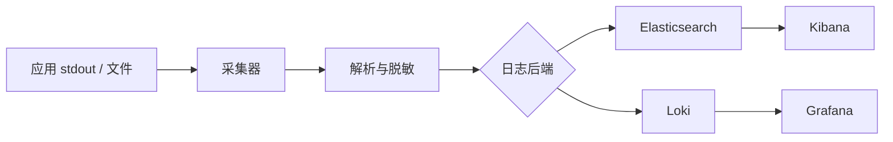
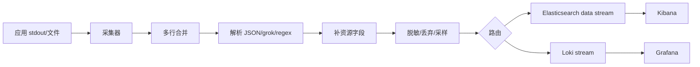

# ELK 与 Loki

## 学习目标

- 理解 Elasticsearch/Logstash/Kibana 与 Loki 的定位差异。
- 区分全文索引日志系统和标签索引日志系统。
- 掌握日志采集、解析、存储、查询的基本链路。
- 能设计可查询、可关联、成本可控的结构化日志。

## 核心概念

ELK 通常指 Elasticsearch、Logstash、Kibana，也常用 Beats 或 Fluent Bit/Fluentd 负责采集。Elasticsearch 对字段建立索引，适合复杂检索、聚合和日志分析，但索引成本较高。

Loki 的设计更接近 Prometheus。它主要索引少量标签，日志正文按块存储，查询时先用标签选流，再在日志内容里过滤。Loki 成本通常更低，但不适合把大量高基数字段都变成标签。

日志数据模型应以结构化事件为核心：时间戳、级别、服务字段、Trace ID、事件名、错误分类、必要业务上下文。自然语言消息可以保留，但不应是唯一可查询信息。

## 架构与数据流



ELK 典型链路：

1. Filebeat/Fluent Bit 读取文件或容器 stdout。
2. Logstash/Ingest Pipeline 解析 JSON、补字段、脱敏。
3. Elasticsearch 建索引并存储。
4. Kibana 查询、聚合和可视化。

Loki 典型链路：

1. Promtail/Fluent Bit/Alloy 读取日志。
2. 提取少量稳定标签，例如 service、env、namespace、pod。
3. 日志正文按 chunk 存储。
4. Grafana 用 LogQL 查询和跳转。

## 示例

推荐日志字段：

```json
{
  "ts": "2026-08-31T09:00:00Z",
  "level": "warn",
  "service.name": "payment-service",
  "deployment.environment": "prod",
  "service.version": "2026.08.31-1",
  "trace_id": "4bf92f3577b34da6a3ce929d0e0e4736",
  "event": "gateway_timeout",
  "error.type": "UPSTREAM_TIMEOUT",
  "http.route": "/payments",
  "http.status_code": 504
}
```

Loki 标签建议：

```text
{service_name="payment-service", env="prod", namespace="checkout"}
```

LogQL 示例：

```logql
{service_name="payment-service", env="prod"} |= "UPSTREAM_TIMEOUT"
```

Elasticsearch 查询思路：

```json
{
  "query": {
    "bool": {
      "filter": [
        { "term": { "service.name": "payment-service" } },
        { "term": { "error.type": "UPSTREAM_TIMEOUT" } }
      ]
    }
  }
}
```

C++ 常见接入路径：

- 应用输出 JSON 日志到 stdout，由容器平台采集。
- spdlog/glog/Boost.Log 配合自定义 formatter 输出结构化字段。
- 日志上下文中注入 Trace ID、请求 ID、用户匿名标识。
- 对敏感字段在应用侧或采集管道做脱敏。

## 典型工作流

1. 先统一日志 schema 和字段命名。
2. 应用只负责输出结构化日志，不直接耦合具体日志后端。
3. 采集器负责补充 Kubernetes、主机、实例等环境字段。
4. 管道负责解析、脱敏、采样或丢弃低价值日志。
5. 日志平台设置保留周期、冷热分层和索引策略。
6. Grafana/Kibana 查询从服务、错误类型、Trace ID 开始。

## 常见坑

- 日志字段随代码随意变化，查询和告警长期不稳定。
- 把 Trace ID、订单 ID、用户 ID 全部设为 Loki 标签，造成高基数。
- Elasticsearch 对所有字段自动索引，存储成本快速膨胀。
- 日志里输出明文密码、Token、手机号等敏感数据。
- 多行日志或异常堆栈没有正确合并，查询时上下文断裂。
- 本地时间、时区和采集时间混用，排障时间线错位。

## 排障步骤

1. 确认应用是否实际输出日志，stdout 和文件路径是否正确。
2. 检查采集器是否读取到目标，是否有解析错误或丢弃规则。
3. 查看日志后端写入速率、拒绝写入和限流信息。
4. 用服务名和时间范围做最小查询，确认数据存在。
5. 再加错误类型、Trace ID、路由等条件逐步缩小范围。
6. 对 Loki 检查标签数量和流数量，对 Elasticsearch 检查索引模板和字段映射。
7. 对敏感信息泄露，先阻断输出和采集，再清理或限制历史索引访问。

## 练习

1. 把一条普通文本错误日志改成结构化 JSON 日志。
2. 判断哪些字段适合作为 Loki 标签：service、env、trace_id、user_id、namespace。
3. 设计 Elasticsearch 索引保留策略，区分热日志和归档日志。
4. 为 C++ 服务设计异常堆栈、多行日志和 Trace ID 关联方案。

## 检查清单

- 日志是结构化输出，字段命名稳定。
- 日志包含服务、环境、版本、实例、Trace ID。
- 敏感字段有脱敏或禁止输出策略。
- Loki 只索引低基数标签。
- Elasticsearch 映射和索引生命周期受控。
- 日志采集器有监控和告警。
- 查询入口能从 Trace ID 或错误类型快速定位事件。

## 前置知识与完成标准

前置知识：

- 知道应用可以把日志输出到 stdout、文件或日志库 sink。
- 了解 JSON、正则、字段解析、索引、标签和对象存储的基本概念。
- 能区分“日志正文”“结构化字段”“索引字段”“标签”。

完成标准：

- 能解释 ELK 和 Loki 的索引策略差异。
- 能设计日志采集、解析、脱敏、写入、保留和查询链路。
- 能判断哪些字段适合 Elasticsearch 索引，哪些字段适合 Loki 标签。
- 能处理多行日志、解析失败、写入拒绝、查询慢和敏感信息泄露。

## ELK 与 Loki 原理拆解

### ELK/Elastic Stack

原理：Elasticsearch 把日志文档写入索引或 data stream，并对字段建立倒排索引、doc values 等结构。Kibana 查询时可以按字段过滤、全文检索、聚合和可视化。Logstash、Filebeat、Elastic Agent 或 Ingest Pipeline 负责采集和解析。

数据模型：

```text
data_stream/index -> document(@timestamp + fields + message) -> indexed fields + stored source
```

适用场景：

- 复杂全文检索、多字段聚合、审计分析。
- 需要对业务字段做临时过滤，例如错误码、订单状态、渠道类型。
- 安全日志、访问日志、应用日志的统一检索。

边界：

- 默认动态映射可能把大量字段都索引，成本快速上升。
- 高写入量需要分片、生命周期、冷热层和容量规划。
- 字段类型一旦冲突，写入会失败或查询不可用。

与相邻概念区别：Elasticsearch 是搜索和分析后端；Logstash/Filebeat 是采集管道；Kibana 是查询展示入口。

### Loki

原理：Loki 主要索引日志流标签，日志正文按 chunk 存储。查询先用标签选择 stream，再用 LogQL 对日志内容过滤、解析和聚合。它更像“日志版 Prometheus”，强调低索引成本。

数据模型：

```text
stream labels -> ordered log entries(timestamp + line) -> chunks
```

适用场景：

- Kubernetes/container stdout 日志。
- 与 Grafana、Prometheus、Tempo 联动排障。
- 标签少、查询通常从服务/命名空间/Pod 开始的场景。

边界：

- 不适合把 `trace_id`、`user_id`、`order_id` 这类高基数字段做标签。
- 纯全文检索能力不等于 Elasticsearch，查询需要先用标签缩小范围。
- 日志行结构差、标签设计差时，LogQL 会变慢。

与相邻概念区别：Loki 标签是索引入口，不是任意字段索引；日志正文解析通常发生在查询时或采集管线中。

## 索引与标签差异

| 维度 | Elasticsearch | Loki |
| --- | --- | --- |
| 查询入口 | 字段索引、全文检索、聚合 | 低基数标签选择日志流 |
| 成本来源 | 字段索引、分片、副本、存储层 | stream 数量、chunk、对象存储、查询扫描 |
| 适合字段 | 错误码、服务、路由、状态、审计字段 | service、env、namespace、pod、container |
| 危险字段 | 动态无限字段、长文本字段全索引 | trace_id、user_id、request_id、完整 path |
| 查询风格 | 先字段过滤，再聚合/全文 | 先标签过滤，再内容过滤/解析 |

## 更细的采集管线



关键阶段：

1. 采集：确认文件路径、容器 stdout、offset 和轮转策略。
2. 多行：异常堆栈必须合并成一条事件，否则上下文断裂。
3. 解析：优先 JSON；无法结构化时再用 grok/regex。
4. 丰富：添加 `service.name`、`env`、`namespace`、`pod`、`trace_id`。
5. 脱敏：删除或哈希手机号、邮箱、Token、身份证号。
6. 路由：高价值日志进热索引，低价值 debug 可采样或短保留。

## 分步接入

1. 先统一日志 schema，明确哪些字段必须输出、哪些字段禁止输出。
2. 应用输出 JSON Lines 到 stdout 或固定文件路径，不直接绑定后端。
3. 部署采集器读取日志，处理 offset、轮转和多行堆栈。
4. 在采集管线解析 JSON、补资源字段、脱敏和按事件类型采样。
5. Elasticsearch 侧配置 data stream、模板、字段映射和 ILM。
6. Loki 侧只选择低基数标签，其他字段保留在日志正文或 structured metadata。
7. 在 Kibana/Grafana 中保存常用查询，并打通 Trace ID 跳转。

## 从零可复现实验

目标：用本地文件模拟日志解析、标签选择和敏感字段脱敏。

准备日志：

```bash
mkdir -p /tmp/log-demo
cat >/tmp/log-demo/app.log <<'LOG'
{"@timestamp":"2026-08-31T09:00:00Z","level":"error","service.name":"payment-service","deployment.environment.name":"prod","trace_id":"aaaaaaaaaaaaaaaaaaaaaaaaaaaaaaaa","event":"gateway_timeout","error.type":"UPSTREAM_TIMEOUT","phone":"13800000000","message":"gateway timeout"}
{"@timestamp":"2026-08-31T09:00:01Z","level":"info","service.name":"payment-service","deployment.environment.name":"prod","trace_id":"bbbbbbbbbbbbbbbbbbbbbbbbbbbbbbbb","event":"payment_ok","message":"payment completed"}
LOG
```

本地验证结构化字段：

```bash
python3 -m json.tool /tmp/log-demo/app.log
```

上面的命令会失败，因为文件是 JSON Lines，不是单个 JSON 文档。应逐行验证：

```bash
while read -r line; do printf '%s\n' "$line" | python3 -m json.tool >/dev/null; done </tmp/log-demo/app.log
```

模拟脱敏检查：

```bash
grep -E '1[0-9]{10}|token|password' /tmp/log-demo/app.log
```

预期数据：

- 每行都是合法 JSON。
- 第一行能按 `service.name`、`error.type` 和 `trace_id` 查询。
- 脱敏检查会命中手机号，说明这条日志不能直接进入生产后端。

失败现象：

- JSON 解析失败：采集管道应打 `parse_error`，原文进入隔离索引或被丢弃。
- 多行堆栈拆散：Kibana/Grafana 中只能看到碎片。
- Loki stream 数暴涨：标签包含高基数字段。
- Elasticsearch 写入 400：字段映射冲突或字段数量超过限制。

验证方法：

- 用逐行 JSON 校验确认应用输出格式稳定。
- 用敏感字段正则扫描样本日志，确认脱敏规则先于写入后端。
- 在 Loki 先查标签选择器，再追加内容过滤；在 Elasticsearch 先查时间范围和精确字段。

## 查询与配置逐段解释

Loki LogQL：

```logql
{service_name="payment-service", env="prod"} |= "UPSTREAM_TIMEOUT" | json | error_type="UPSTREAM_TIMEOUT"
```

- `{service_name="payment-service", env="prod"}` 用低基数标签选择 stream。
- `|= "UPSTREAM_TIMEOUT"` 在日志正文中做快速包含过滤。
- `| json` 把 JSON 日志行解析成临时字段。
- `error_type="UPSTREAM_TIMEOUT"` 对解析字段过滤。

Elasticsearch bool 查询：

```json
{
  "query": {
    "bool": {
      "filter": [
        { "range": { "@timestamp": { "gte": "now-15m" } } },
        { "term": { "service.name": "payment-service" } },
        { "term": { "error.type": "UPSTREAM_TIMEOUT" } }
      ]
    }
  }
}
```

- `range @timestamp` 必须放在最前面的思维步骤，避免扫太大范围。
- `term` 用于精确字段，适合 keyword 类型。
- `filter` 不参与相关性评分，适合日志排障。

Filebeat 到 Logstash 的思路：

```yaml
filebeat.inputs:
  - type: filestream
    paths: ["/var/log/app/*.log"]

output.logstash:
  hosts: ["logstash:5044"]
```

- `filestream` 读取文件并维护 offset。
- `paths` 要覆盖轮转后的路径。
- `output.logstash` 把事件交给 Logstash 做解析和路由。

## 成本、安全、隐私、采样、基数与保留

- 成本：Elastic 成本重点是索引字段、分片、副本和热存储；Loki 成本重点是 stream 数、chunk 压缩、对象存储和查询扫描量。
- 安全：采集器到后端启用 TLS；Kibana/Grafana 按团队和环境做权限隔离；生产日志后端禁止匿名查询。
- 隐私：应用侧优先不输出敏感字段；管道侧再做二次脱敏；历史泄露要限制访问并按合规流程处理。
- 采样：debug/info 日志可按事件采样；error、审计、支付状态变更不应随机丢弃。
- 标签基数：Loki 标签控制在服务、环境、namespace、pod、container 等有限集合；Elastic 索引字段也要有模板和动态字段限制。
- 保留：错误和审计日志保留更久；debug 短保留；热数据用于排障，冷数据用于合规和离线分析。

## 排障决策树

```text
查不到日志
├─ 应用实际输出了吗？
│  ├─ 否：检查日志级别、输出路径、容器 stdout
│  └─ 是：继续
├─ 采集器读到了吗？
│  ├─ 否：检查路径、权限、offset、文件轮转
│  └─ 是：继续
├─ 解析和脱敏是否丢弃？
│  ├─ 是：查 parse_error/drop 计数和隔离索引
│  └─ 否：继续
├─ 后端写入成功吗？
│  ├─ 否：检查限流、映射冲突、认证、队列积压
│  └─ 是：检查查询时间范围、标签/字段名、权限
└─ 查询很慢？
   ├─ Loki：缩小标签和时间范围，检查 stream 基数
   └─ Elastic：检查索引模板、分片、字段基数、ILM 热层
```

## 分层练习与答案要点

基础练习：把 `payment failed: timeout` 改成结构化日志。

答案要点：至少包含时间、级别、服务、环境、事件名、错误类型、Trace ID 和稳定消息；不要只写自然语言。

进阶练习：判断 `service`、`env`、`trace_id`、`user_id`、`namespace` 哪些适合做 Loki 标签。

答案要点：`service`、`env`、`namespace` 适合；`trace_id`、`user_id` 高基数，不适合。

综合练习：设计支付服务日志保留策略。

答案要点：error 和审计日志热存 7-14 天、冷存按合规要求；debug 1-3 天或按采样保留；敏感字段禁止入库；索引模板固定字段类型；Loki 标签低基数。

## 小结

ELK 适合复杂字段检索和日志分析，代价是索引和存储成本更高。Loki 适合以低基数标签为入口的云原生日志排障，代价是不能把它当成任意字段全文索引系统。日志系统能否好用，主要取决于结构化 schema、解析质量、脱敏、标签/索引治理和保留策略。

## 官方延伸阅读

- Elastic Data Streams：https://www.elastic.co/docs/manage-data/data-store/data-streams
- Filebeat 官方文档：https://www.elastic.co/docs/reference/beats/filebeat
- Logstash 日志解析管线：https://www.elastic.co/guide/en/logstash/current/advanced-pipeline.html
- Grafana Loki 文档：https://grafana.com/docs/loki/latest/
- Loki LogQL：https://grafana.com/docs/loki/latest/query/
- OpenTelemetry Logs 数据模型：https://opentelemetry.io/docs/specs/otel/logs/data-model/
