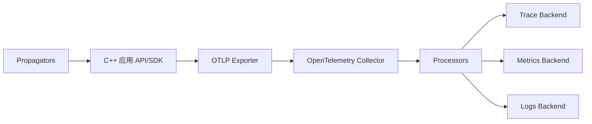
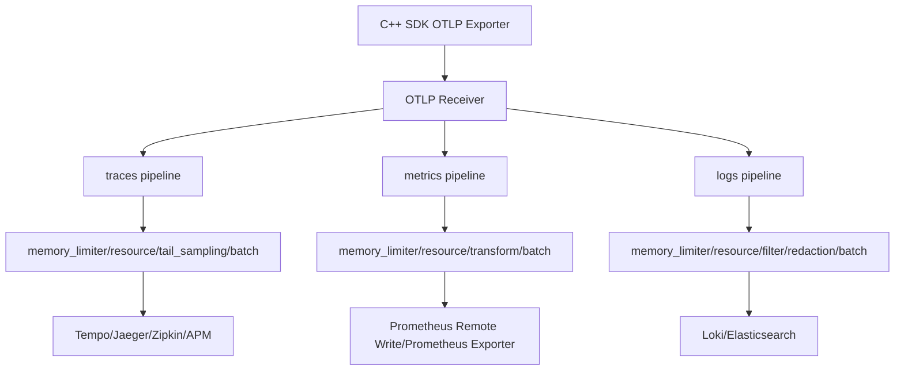

# OpenTelemetry

## 学习目标

- 理解 OpenTelemetry 的 API、SDK、Collector 和后端之间的关系。
- 掌握 Trace、Metrics、Logs 在 OpenTelemetry 中的统一资源模型。
- 理解上下文传播、采样、处理器、导出器的职责。
- 能为 C++ 服务选择不绑定厂商的接入方式。

## 核心概念

OpenTelemetry 是一套可观测性标准和工具链，目标是统一采集、处理和导出日志、指标、Trace。它不要求绑定某个存储后端，数据可以导出到 Prometheus、Grafana Tempo、Jaeger、Zipkin、Loki、Elasticsearch、商业 APM 等系统。

API 是业务代码调用的接口，SDK 是具体实现。Instrumentation 负责给 HTTP、gRPC、数据库等库自动或半自动埋点。Collector 是独立进程，负责接收、处理、批量发送和路由遥测数据。

统一资源模型很关键。`service.name`、`deployment.environment`、`service.version`、`service.instance.id` 应在 SDK 或 Collector 中统一设置，保证三类信号可关联。

## 架构与数据流



Collector 常见组件：

- Receivers：接收 OTLP、Prometheus scrape、Jaeger、Zipkin 等数据。
- Processors：批处理、内存限制、采样、资源字段补充、属性过滤。
- Exporters：导出到 Prometheus、OTLP 后端、Loki、Elasticsearch 等。
- Pipelines：把 receiver、processor、exporter 组合成 traces、metrics、logs 链路。

## 示例

Collector 配置片段：

```yaml
receivers:
  otlp:
    protocols:
      grpc:
      http:

processors:
  batch:
  memory_limiter:
    limit_mib: 512
  resource:
    attributes:
      - key: deployment.environment.name
        value: prod
        action: upsert

exporters:
  otlp/traces:
    endpoint: tempo:4317
  otlp/logs:
    endpoint: loki-otel-gateway:4317
  prometheus:
    endpoint: "0.0.0.0:9464"

service:
  pipelines:
    traces:
      receivers: [otlp]
      processors: [memory_limiter, resource, batch]
      exporters: [otlp/traces]
    metrics:
      receivers: [otlp]
      processors: [memory_limiter, resource, batch]
      exporters: [prometheus]
    logs:
      receivers: [otlp]
      processors: [memory_limiter, resource, batch]
      exporters: [otlp/logs]
```

Trace 上下文传播：

```text
traceparent: 00-4bf92f3577b34da6a3ce929d0e0e4736-00f067aa0ba902b7-01
```

C++ 常见接入路径：

- 使用 OpenTelemetry C++ API/SDK 手动创建 tracer、meter 和 span。
- 对 gRPC、HTTP 客户端或服务端使用已有 instrumentation。
- 通过 OTLP exporter 把数据发给本地 Collector。
- 使用 sidecar 或服务网格补充网络层观测，但业务语义仍建议在代码中埋点。

## 典型工作流

1. 确定资源字段和命名规范。
2. 在服务入口接收或创建 Trace 上下文。
3. 为关键业务步骤创建 span，并标记错误状态。
4. 为关键路径增加指标，保持标签低基数。
5. 日志输出 Trace ID，使日志能从 Trace 页面反查。
6. 应用把 OTLP 数据发给本地或节点级 Collector。
7. Collector 做批处理、限流、采样、脱敏和后端路由。
8. 后端分别承担查询、可视化、告警和长期存储。

## 常见坑

- 业务代码直接绑定某个商业 APM SDK，后续迁移成本高。
- 没有设置 `service.name`，后端里所有数据混成默认服务。
- Trace 采样过低，问题请求没有样本；采样过高，又造成成本暴涨。
- 异步线程、消息队列、回调链路没有传播上下文。
- 在 span attribute 中放用户 ID、订单 ID 等高基数字段且长期保留。
- Collector 没有 memory limiter 和 batch，流量高峰时不稳定。
- 指标语义不统一，同一个概念在不同服务中有多个名称。

## 排障步骤

1. 确认应用 SDK 是否初始化，resource 字段是否正确。
2. 检查应用到 Collector 的 OTLP endpoint、协议和 TLS 配置。
3. 查看 Collector receiver 是否收到数据，processor 是否丢弃数据。
4. 检查 exporter 到后端的错误、重试和队列积压。
5. 用 Trace ID 验证上下文是否跨服务传播。
6. 检查采样规则，确认错误请求是否被保留。
7. 对指标异常，检查 temporality、单位、标签和聚合方式。

## 练习

1. 为一个 C++ 服务画出 OpenTelemetry 接入链路。
2. 设计一个 span：名称、父子关系、属性、错误状态。
3. 写出 Collector 中 traces 和 metrics 两条 pipeline 的职责。
4. 解释为什么 Collector 可以降低业务进程与后端的耦合。

## 检查清单

- 使用 OpenTelemetry API/SDK 或兼容协议，避免厂商锁定。
- 资源字段统一且完整。
- Trace 上下文能跨 HTTP、gRPC、消息队列传播。
- Collector 有限流、批处理、重试和内存保护。
- 指标标签和 span 属性经过基数审查。
- 日志包含 Trace ID 并能与 Trace 后端跳转。
- 后端选择不影响业务代码的埋点接口。

## 前置知识与完成标准

前置知识：

- 理解日志、指标、Trace 三类信号的基本数据模型。
- 知道 HTTP/gRPC 请求可以通过 header 传播上下文。
- 了解 SDK、agent/collector、后端存储和 exporter 的职责差异。

完成标准：

- 能解释 API、SDK、Instrumentation、Collector、OTLP 的边界。
- 能画出 traces、metrics、logs 三条 pipeline。
- 能为 C++ 服务设计接入步骤，包括资源字段、上下文传播、采样和 Collector。
- 能排查“应用已埋点但后端没有数据”的链路问题。

## 核心组件逐项拆解

### API

原理：API 是业务代码和库调用的稳定接口，例如创建 span、记录 metric、读取当前上下文。没有 SDK 时，API 通常应保持 no-op 或只传播上下文，避免业务逻辑依赖具体后端。

适用场景：

- 业务代码手动埋点。
- 公共库暴露 instrumentation，但不强制绑定某个厂商 SDK。

边界：API 不负责采样、批处理、导出和后端认证。

与相邻概念区别：API 是接口；SDK 是实现；Instrumentation 是使用 API 给框架/库埋点的代码。

### SDK

原理：SDK 实现 TracerProvider、MeterProvider、LoggerProvider、Processor、Sampler、Exporter 等能力，把 API 记录的数据加工并导出。

适用场景：

- 服务进程内生成 Trace、Metrics、Logs。
- 设置资源字段、采样器、span processor、metric reader 和 exporter。

边界：

- SDK 运行在业务进程内，不能承担过重的路由、重试和复杂转换。
- 高峰流量下应优先保护业务进程，避免 telemetry 阻塞请求路径。

### Collector

原理：Collector 是独立进程，接收多种协议的遥测数据，通过 processor 批处理、限流、补字段、脱敏、采样、转换，再导出到一个或多个后端。

适用场景：

- 解耦业务进程和后端。
- 统一三类信号的资源字段、脱敏和路由。
- 多后端迁移或同时输出到开源/商业系统。

边界：

- Collector 不会自动修复业务埋点语义错误。
- Collector 过载会丢数据或排队，应监控自身指标。

### OTLP

原理：OTLP 是 OpenTelemetry 原生传输协议，常用 gRPC `4317` 或 HTTP `4318`。应用可以把三类信号通过 OTLP 发给 Collector。

适用场景：

- 统一传输 traces、metrics、logs。
- 减少每个语言 SDK 对不同后端 exporter 的直接依赖。

边界：后端字段限制、标签合法字符、temporality 和 histogram 支持仍可能不同，Collector 需要做适配。

## 三类 Pipeline



Pipeline 职责：

- traces：保留父子关系、采样、错误优先、导出到 Trace 后端。
- metrics：处理 temporality、聚合、单位、标签过滤、导出到指标后端。
- logs：解析、脱敏、过滤、关联 Trace ID、导出到日志后端。

## 上下文传播

OpenTelemetry 默认使用 W3C Trace Context，HTTP header 典型形态如下：

```text
traceparent: 00-4bf92f3577b34da6a3ce929d0e0e4736-00f067aa0ba902b7-01
```

字段含义：

- `00`：版本。
- `4bf92f3577b34da6a3ce929d0e0e4736`：Trace ID，32 位十六进制。
- `00f067aa0ba902b7`：当前 Span ID，16 位十六进制。
- `01`：Trace flags，最低位通常表示 sampled。

接入边界：

- 服务端入口要 extract 上游上下文；没有上游时创建 root span。
- 客户端发起 HTTP/gRPC 调用前要 inject 当前上下文。
- 异步任务、线程池、消息队列要显式传递上下文，否则 Trace 断裂。
- 对公网入口要考虑伪造 trace header，可选择清洗或重新创建可信边界内的上下文。

## C++ 接入步骤

分步接入：

1. 统一资源字段：`service.name`、`service.version`、`deployment.environment.name`、`service.instance.id`。
2. 初始化 OpenTelemetry C++ SDK，配置 OTLP exporter 指向本机或节点 Collector。
3. 在入口中间件 extract `traceparent`，创建 server span。
4. 在下游 HTTP/gRPC 客户端 inject 上下文。
5. 对关键业务步骤手动创建 child span，设置稳定 span name 和低基数属性。
6. 用 Meter 记录 Counter、Gauge、Histogram，避免请求级属性。
7. 日志库输出 `trace_id` 和 `span_id`，让日志后端可反查 Trace。
8. Collector 统一做 batch、memory limiter、采样、脱敏和后端路由。

C++ 伪代码：

```cpp
auto tracer = provider->GetTracer("order-service");
auto span = tracer->StartSpan("POST /orders");
auto scope = tracer->WithActiveSpan(span);

span->SetAttribute("http.route", "/orders");
span->SetAttribute("order.channel", "web");

// 调用下游前把当前 Context 注入 HTTP/gRPC metadata。
// 失败时设置 span status，并在结构化日志中写入 trace_id/span_id。

span->SetStatus(opentelemetry::trace::StatusCode::kOk);
span->End();
```

预期数据：

- Trace 后端看到 `order-service` 的 `POST /orders` span。
- 下游服务 span 与入口 span 处于同一个 Trace ID。
- 指标后端看到请求 Counter 和延迟 Histogram。
- 日志后端能用 Trace ID 查到同一次请求日志。

失败现象：

- 后端服务名是 `unknown_service`：资源字段未设置或被 Collector 覆盖。
- Trace 只有单服务：上下文没有 inject/extract，或异步边界丢失。
- Collector 收到数据但后端没有：exporter endpoint、TLS、认证或队列失败。
- 指标异常：temporality、单位、属性转换或后端不支持某类 histogram。

## Collector 配置逐段解释

```yaml
receivers:
  otlp:
    protocols:
      grpc:
        endpoint: 0.0.0.0:4317
      http:
        endpoint: 0.0.0.0:4318

processors:
  memory_limiter:
    limit_mib: 512
  resource:
    attributes:
      - key: deployment.environment.name
        value: prod
        action: upsert
  batch:

exporters:
  otlp/traces:
    endpoint: tempo:4317
    tls:
      insecure: true
  prometheus:
    endpoint: 0.0.0.0:9464
  otlp/logs:
    endpoint: loki-otel-gateway:4317
    tls:
      insecure: true

service:
  pipelines:
    traces:
      receivers: [otlp]
      processors: [memory_limiter, resource, batch]
      exporters: [otlp/traces]
    metrics:
      receivers: [otlp]
      processors: [memory_limiter, resource, batch]
      exporters: [prometheus]
    logs:
      receivers: [otlp]
      processors: [memory_limiter, resource, batch]
      exporters: [otlp/logs]
```

逐段说明：

- `receivers.otlp` 开启 OTLP gRPC 和 HTTP 入口。
- `memory_limiter` 在 Collector 内存过高前施加背压或丢弃，保护进程。
- `resource` 补充统一资源字段；生产中也可从 Kubernetes metadata 获取。
- `batch` 合并小批量数据，降低导出开销。
- `otlp/traces` 导出 Trace 到 Tempo、Jaeger 或其他 OTLP 后端。
- `prometheus` 把 OTel metrics 暴露成 Prometheus 可抓取端点。
- `otlp/logs` 把日志导出到支持 OTLP 的日志网关。
- `service.pipelines` 决定哪些 receiver、processor、exporter 真正启用。

## 从零可复现实验

目标：验证 OTLP 接收、Collector pipeline 和 Prometheus exporter 的基本链路。

准备 Collector 配置：

```bash
mkdir -p /tmp/otel-demo
cat >/tmp/otel-demo/collector.yaml <<'YAML'
receivers:
  otlp:
    protocols:
      grpc:
      http:
processors:
  batch:
exporters:
  debug:
    verbosity: detailed
  prometheus:
    endpoint: "0.0.0.0:9464"
service:
  pipelines:
    traces:
      receivers: [otlp]
      processors: [batch]
      exporters: [debug]
    metrics:
      receivers: [otlp]
      processors: [batch]
      exporters: [debug, prometheus]
    logs:
      receivers: [otlp]
      processors: [batch]
      exporters: [debug]
YAML
```

运行方式：

```bash
otelcol --config /tmp/otel-demo/collector.yaml
```

如果本机没有 `otelcol`，可以把该配置用于 Docker 或 Kubernetes 中的 Collector 镜像。实验成功标准是 Collector 启动日志中三条 pipeline 均创建成功，且 `http://127.0.0.1:9464/metrics` 可访问。

验证方法：

```bash
curl -s http://127.0.0.1:9464/metrics | head
```

## 采样策略

头部采样：

- 在创建 root span 时决定是否采样。
- 成本低，但看不到完整 Trace 后再决定保留。

尾部采样：

- Collector 或后端观察完整 Trace 后再决定保留。
- 适合保留错误、慢请求和特定路由，但需要更多内存和延迟。

父子采样：

- 下游尊重上游 sampled flag，避免同一 Trace 部分采样、部分丢弃。
- 跨信任边界时要审查外部传入的采样标记。

策略建议：

- 健康检查、静态资源、低价值高频请求低采样或不采样。
- 错误请求、慢请求、支付/下单等关键链路提高采样。
- 采样率通过配置中心动态控制，并把采样策略版本写入观测数据。

## 成本、安全、隐私、采样、基数与保留

- 成本：span 数、属性数、日志体大小、metric stream 数和 Collector 副本数共同决定成本。
- 安全：OTLP endpoint 不应公网裸露；跨网络传输启用 TLS 和认证；Collector 配置中的凭据使用 Secret。
- 隐私：Baggage、span attribute、log attributes 不要传播 PII、Token 或内部敏感架构信息。
- 采样：Trace 采样是成本核心；日志可按级别和事件采样；指标通常通过聚合和降采样控制。
- 标签基数：资源字段低基数，span 属性可稍高但要限制，metric attributes 必须最严格。
- 保留：Trace 样本短期排障；聚合指标长期趋势；日志按审计和排障价值分层保留。

## 排障决策树

```text
后端没有 OTel 数据
├─ 应用 SDK 初始化了吗？
│  ├─ 否：检查 provider/exporter 初始化和 shutdown/flush
│  └─ 是：继续
├─ OTLP endpoint 协议正确吗？
│  ├─ 否：区分 4317 gRPC 与 4318 HTTP
│  └─ 是：继续
├─ Collector receiver 收到数据吗？
│  ├─ 否：检查网络、TLS、认证、DNS、防火墙
│  └─ 是：继续
├─ processor 是否丢弃？
│  ├─ 是：检查 memory_limiter、filter、sampling、属性规则
│  └─ 否：继续
├─ exporter 成功吗？
│  ├─ 否：检查后端 endpoint、队列、重试、限流
│  └─ 是：检查后端查询条件、时间范围、资源字段
└─ Trace 断裂？
   ├─ 是：检查 extract/inject、线程池、消息队列和 Baggage
   └─ 否：用 trace_id 联查日志和指标
```

## 分层练习与答案要点

基础练习：说明 API、SDK、Collector、Exporter 的职责。

答案要点：API 给代码调用；SDK 实现采集和处理；Collector 独立接收、加工、路由；Exporter 把数据发到后端或暴露给后端抓取。

进阶练习：为 HTTP 入口和下游 gRPC 调用设计 span。

答案要点：入口 span 名称用 `POST /orders`；下游 span 名称用 `grpc.payment.PaymentService/Pay`；属性使用路由、状态码、错误类型、peer service；错误时设置 status。

综合练习：设计 C++ 服务 OTel 接入方案。

答案要点：资源字段统一；OTLP 发本地 Collector；入口 extract、出口 inject；日志带 Trace ID；指标低基数；Collector 分三条 pipeline；配置采样和脱敏；用 debug exporter 做首轮验证。

## 小结

OpenTelemetry 的价值是把三类信号的采集接口、语义字段、上下文传播和传输协议统一起来。业务代码应依赖 API 和语义约定，复杂处理放到 Collector。这样后端可以替换，采样和脱敏可以集中治理，C++ 服务也不必和某个商业 APM 深度绑定。

## 官方延伸阅读

- OpenTelemetry Collector：https://opentelemetry.io/docs/collector/
- OpenTelemetry C++：https://opentelemetry.io/docs/languages/cpp/
- OpenTelemetry Context Propagation：https://opentelemetry.io/docs/concepts/context-propagation/
- OpenTelemetry Trace API：https://opentelemetry.io/docs/specs/otel/trace/api/
- OpenTelemetry Trace SDK 与采样：https://opentelemetry.io/docs/specs/otel/trace/sdk/
- OpenTelemetry Logs 数据模型：https://opentelemetry.io/docs/specs/otel/logs/data-model/
- W3C Trace Context：https://www.w3.org/TR/trace-context/
