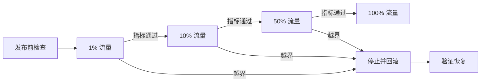

# 灰度发布、回滚和故障演练

## 学习目标

- 理解滚动、蓝绿、金丝雀、按特征开关发布的差异。
- 为灰度设计分批策略、观测窗口、晋级条件和停止条件。
- 把“回滚”拆成应用、配置、数据库和流量层面的可验证动作。
- 设计安全的故障演练并沉淀系统改进项。

## 1. 核心概念：发布策略

| 策略 | 做法 | 优点 | 主要代价/风险 |
| --- | --- | --- | --- |
| 滚动发布 | 分批替换旧实例 | 资源开销较小，平台常原生支持 | 新旧版本共存，失败时回滚速度受替换节奏影响 |
| 蓝绿发布 | 新旧两套完整环境切换流量 | 切换和回切快 | 资源成本高；数据库兼容仍需单独处理 |
| 金丝雀发布 | 少量实例/用户/流量先使用新版 | 控制爆炸半径，可数据化判断 | 路由、样本代表性和观测要求高 |
| 特性开关 | 部署代码与开放功能解耦 | 可按用户快速关闭功能 | 开关生命周期和组合复杂度需要治理 |

“部署成功”只表示新制品已运行；“发布成功”还要求用户流量、业务结果和 SLO 正常。

## 2. 示例：灰度发布状态机



每个阶段明确：

- **对象**：实例比例、请求比例、用户群、租户、地域或特定功能。
- **最短观察窗口**：覆盖足够请求和关键周期，低流量业务不能只按固定分钟判断。
- **健康指标**：技术指标与业务指标同时存在。
- **晋级条件**：例如新版相对基线的错误率差、p99 差、资源增幅在允许范围内。
- **停止/回滚条件**：硬阈值、持续时长、最低样本量和责任人。

比较新版和旧版时应尽量使用同一时间、同类用户和相近流量的基线，避免把整体流量波动当作版本差异。

## 3. 典型工作流：发布前检查

1. 制品不可变且可追溯：提交、构建记录、镜像摘要、依赖清单明确。
2. 变更已通过目标测试，关键仪表盘、告警和日志查询可用。
3. 容量有余量，可同时运行新旧版本或承受单批故障。
4. 新旧版本对 API、消息和持久化数据向前/向后兼容。
5. 回滚命令、权限、值班人、停止条件和验证步骤已写入变更单。
6. 避开已知高风险窗口，相关团队知道变更及观察时间。

## 4. 数据库变更：Expand–Migrate–Contract

数据库 schema 往往不能随应用镜像“一键回滚”。安全迁移通常拆为：

1. **Expand**：先增加兼容结构，不删除旧字段；新旧应用都可工作。
2. **Migrate**：双写或后台迁移数据，校验数量、校验和及失败记录。
3. **Switch**：读路径切到新结构，保留快速关闭的开关。
4. **Contract**：确认所有旧版本退出且观察期结束后，再删除旧结构。

避免在大表上直接执行未经评估的阻塞式 DDL。迁移脚本必须可重入、限速、可暂停，并监控复制延迟、锁等待和业务延迟。

## 5. 回滚不是一个命令

按层准备回退路径：

- **流量层**：将流量切回旧版本，关闭有问题的路由或功能开关。
- **应用层**：重新部署已知良好的不可变制品，而不是现场重新构建。
- **配置层**：恢复经版本化、已审查的配置；确认动态配置缓存是否刷新。
- **数据层**：优先用兼容设计前滚修复；若必须恢复数据，要明确 RPO/RTO 和恢复后的校验。
- **消息层**：确认旧消费者能否读取新版产生的事件；必要时隔离死信和停止生产。

回滚后至少验证：

```text
旧版本/目标配置已生效
错误率与延迟恢复到基线
积压、连接、线程池和资源饱和度开始恢复
核心业务成功率与数据一致性正常
告警已恢复且没有被静默
```

## 6. 自动判定示例（伪配置）

```yaml
steps:
  - traffic: 1%
    min_duration: 10m
    min_requests: 5000
  - traffic: 10%
    min_duration: 15m
  - traffic: 50%
    min_duration: 20m
analysis:
  compare_to: stable
  pass:
    - http_error_rate_delta < 0.2%
    - p99_latency_ratio < 1.10
    - checkout_success_rate_delta > -0.1%
  abort:
    - critical_alerts > 0
```

这是表达决策逻辑的伪配置，不对应某个特定发布工具。真实阈值应根据 SLO、自然波动和历史基线确定；错误率很低时，还要考虑样本量而非只比较百分比。

## 7. 故障演练

故障演练不是随机“搞坏生产”，而是用受控实验验证系统假设。

### 7.1 实验卡

```markdown
# 实验：单实例进程退出
- 假设：任意一个实例退出不会使服务错误率超过 SLO。
- 影响范围：预生产 / 指定命名空间 / 单个实例。
- 前置条件：当前无发布、容量余量 > 30%、告警和仪表盘可用。
- 注入方式：终止一个选定实例。
- 观察：错误率、p99、重试率、重新调度时间、连接池。
- 停止条件：错误率 > X 持续 Y 分钟，或出现关键业务告警。
- 恢复动作：停止注入，恢复副本，必要时切流。
- 责任人和沟通渠道：
```

### 7.2 渐进演练阶梯

1. 桌面推演：只走流程和决策，不改系统。
2. 本地/测试环境：验证注入工具和恢复步骤。
3. 预生产：使用接近真实的拓扑和监控。
4. 生产小范围：限定实例、租户、地域和时长，并准备人工终止开关。

可演练的假设包括：实例退出、节点不可用、DNS 失败、依赖延迟、丢包、磁盘满、证书过期、配置错误、消息积压和可用区故障。每次只控制有限变量。

### 7.3 复盘

复盘关注系统和流程，不把“操作失误”作为根因终点。记录时间线、预期与实际差异、告警是否及时、恢复是否可执行，以及有负责人和截止时间的改进项。改进完成后安排复验。

## 8. 常见坑与排障步骤

- **灰度样本不代表整体**：内部用户或低风险请求正常，不代表大租户、冷数据或写路径正常。按关键维度分层观察。
- **只看服务健康，不看业务结果**：补充订单成功、支付完成、任务正确率等业务 SLI。
- **回滚后仍异常**：检查配置/缓存未恢复、数据库已产生不兼容数据、队列积压、客户端缓存或重试风暴。
- **告警延迟大于灰度阶段**：延长观察窗或使用更快的近实时分析信号。
- **功能开关成为永久分支**：为开关指定所有者、删除日期和状态审计。
- **演练无法停止**：任何注入前都先验证停止与恢复通道，不依赖被演练系统本身的唯一控制面。

## 9. 练习

1. 为一次含新增数据库字段的发布画出兼容时间线，标明哪些阶段允许新旧应用共存。
2. 设计 1% → 10% → 50% → 100% 的判定规则，解释每个指标、窗口和样本量。
3. 在测试环境模拟依赖延迟，验证超时、重试、熔断、告警和恢复。
4. 进行一次桌面回滚演练，记录从发现异常到业务恢复的时间和人工步骤。

## 10. 检查清单

- [ ] 灰度对象、阶段、窗口、晋级和停止条件清楚。
- [ ] 技术 SLI 与业务 SLI 均与稳定版本对照。
- [ ] 制品、配置、schema 和消息格式都有兼容/回退方案。
- [ ] 回滚使用已验证制品，且完成后有恢复验证。
- [ ] 故障实验包含假设、范围、前置条件、停止条件和恢复动作。
- [ ] 生产演练逐步扩大，影响半径可控。
- [ ] 复盘改进项有负责人、截止时间和复验安排。

## 深化学习说明

前半部分提供发布策略、回滚和演练的速查框架。下面的内容进一步细化统计判定、发布单、数据库/消息兼容、回滚验证和演练安全控制，重点解决“发布工具成功但用户仍受影响”的场景。

## 11. 前置知识和完成标准

学习本章前，应理解服务副本、负载均衡、健康检查、数据库迁移、消息消费和基础 SLO 指标。发布可靠性关注的不是“命令执行成功”，而是“变更在真实流量下没有破坏用户可见行为，并且出错时能受控恢复”。

完成本章后，应能做到：

- 为一次发布写出分阶段流量计划、最小样本量、观察窗口、晋级条件和回滚条件。
- 区分应用回滚、配置回滚、流量回切、数据库前滚修复和消息隔离。
- 判断一次数据库或消息格式变更是否允许新旧版本共存。
- 设计一次故障演练实验卡，包含范围、停止条件、恢复动作和安全控制。
- 回滚后用指标、日志、数据一致性和业务结果验证恢复，而不是只看 Pod 或进程已启动。

## 12. 灰度判定中的统计和错误预算

灰度阶段样本太小会让百分比失真。1% 流量如果 10 分钟只有 200 个请求，0 个错误不能证明错误率低于 0.1%；它只能说明样本中没观察到错误。低流量服务应增加时间窗口、合并同类端点或使用更敏感的业务探针。

发布判定应同时看绝对值和相对基线：

```text
绝对阈值：新版 p99 < 300 ms，错误率 < 0.1%
相对阈值：新版 p99 不超过稳定版 1.10 倍，业务成功率下降不超过 0.1%
错误预算：若本月预算已消耗 80%，暂停非紧急高风险发布
```

当 SLO 错误预算接近耗尽时，灰度策略应更保守：缩小批次、延长观察、提高人工审批门槛，甚至只允许修复可靠性的变更。错误预算充足不代表可以跳过灰度，它只说明有更多可接受风险空间。

## 13. 从零开始工作流：一份可执行发布单

教学边界：以下是发布单模板和本地演练方法，不直接操作生产集群。真实生产发布必须使用团队批准的发布平台、权限、审计和回滚预案。

```markdown
# 发布单：checkout-service v2026.08.31
- 变更摘要：优化价格计算缓存。
- 制品：registry.example.com/checkout@sha256:...
- 影响面：checkout API，价格缓存读写，订单创建前校验。
- SLO 关联：checkout 成功率、p99 延迟、订单金额正确率。
- 灰度阶段：1% 10m/5000 请求 -> 10% 20m -> 50% 30m -> 100%。
- 晋级条件：错误率增量 < 0.05%，p99 比稳定版 < 1.10，金额校验差异 = 0。
- 回滚条件：关键告警触发；金额差异 > 0；错误率增量 >= 0.2% 持续 3m；队列积压持续增长 10m。
- 回滚动作：关闭 feature flag；流量切回 stable；恢复上一版配置；暂停新事件生产；验证积压恢复。
- 数据兼容：无 schema 删除；新增字段可空；旧版本忽略新字段。
- 消息兼容：依赖 Protobuf/Avro/JSON Schema 等协议和 schema registry 兼容模式；新增字段有默认值；消费者按 schema version 分支处理；旧消费者样本已回放验证。
- 观察链接：仪表盘、日志查询、Trace 查询、发布事件。
- 责任人：发布、观察、回滚、业务确认。
```

预期结果：发布前任何人都能从发布单知道“什么时候继续、什么时候停止、停止后怎么验证”。失败现象是条件写成“观察一下没问题就继续”，这会让压力下的判断变成临场猜测。

验证方式：发布前桌面推演一次，让不同角色按发布单回答：如果 10% 阶段 p99 上升 20% 但错误率正常，是否晋级？如果回滚后错误率恢复但消息积压继续上升，谁负责处理？

## 14. 命令和配置逐段解释

Kubernetes 示例仅用于解释概念，生产执行前必须确认 namespace、deployment、镜像摘要、当前副本和回滚窗口。

```bash
kubectl -n prod rollout status deployment/checkout
```

`-n prod` 指命名空间，`rollout status` 等待 Deployment 滚动状态完成。它证明控制器认为副本更新完成，不证明业务 SLO 正常。

```bash
kubectl -n prod rollout history deployment/checkout
kubectl -n prod rollout undo deployment/checkout --to-revision=12
```

第一行查看 Deployment 修订历史。第二行把 Deployment 模板回到指定修订，属于生产变更命令；执行前要确认 12 对应已知良好制品，并确认数据库、配置、消息格式仍兼容旧应用。

```yaml
strategy:
  type: RollingUpdate
  rollingUpdate:
    maxUnavailable: 0
    maxSurge: 1
```

`maxUnavailable: 0` 表示更新过程中不主动减少可用副本，适合容量紧张但更新更慢。`maxSurge: 1` 允许额外增加 1 个副本，需要集群有资源余量。它们控制实例替换节奏，不等同于金丝雀流量比例。

## 15. 数据库和消息兼容

数据库变更的安全边界：

- 新增可空列或有默认值列通常比重命名/删除列安全。
- 应用先兼容读旧结构和新结构，再逐步迁移数据。
- 大表 DDL 要评估锁、复制延迟、回滚成本和备份恢复时间。
- 删除字段、收紧约束、改变枚举含义属于高风险 contract 阶段，应等所有旧版本退出并观察完成。

消息兼容的安全边界：

- 新增字段应符合所用协议的兼容规则，并在 schema registry 中启用合适模式，例如 backward、forward 或 full compatibility；不同组织命名不同，应以当前平台定义为准。
- 新增字段应有默认值，旧消费者应能忽略未知字段；这依赖序列化协议和消费者实现，不是所有 JSON 解析或手写反序列化都自动安全。
- 改字段含义比新增字段危险，因为格式看似兼容但语义已破坏。
- 消费者升级慢于生产者时，要确认新版消息不会让旧消费者死循环或进入死信风暴。
- 回滚应用前，应确认新版已经写出的事件、缓存和数据库记录能被旧版读取。
- 发布前从生产脱敏样本和新版样本中各取一组消息，用旧消费者二进制在隔离环境回放，验证解析、默认值、幂等和业务副作用。只通过 schema registry 检查不能证明业务语义兼容。

验证方法：

```text
新应用读旧数据：通过
旧应用读新数据：通过
新消费者读旧消息：通过
旧消费者读新消息：通过旧消费者样本回放，或已通过路由/版本隔离
迁移脚本重复执行：无副作用
回滚后数据校验：数量、金额、状态机、幂等键一致
```

## 16. 回滚条件和恢复验证

回滚条件要可执行，不能只写“出现异常”。推荐同时定义硬条件和人工判断条件：

- 硬条件：金额错误、数据损坏、鉴权绕过、核心业务不可用、关键告警触发。
- 持续条件：错误率、p99、资源饱和、队列积压、下游限流超过阈值并持续若干分钟。
- 人工条件：指标未越界但用户投诉、业务探针失败、日志出现未知严重异常。

回滚后的验证顺序：

1. 流量是否回到旧版本或 feature flag 是否关闭。
2. 旧版本实例是否稳定通过 readiness/liveness。
3. 技术 SLI 是否回到发布前基线。
4. 业务 SLI 是否恢复，例如下单、支付、任务处理、通知发送。
5. 数据库、缓存、消息队列是否停止恶化并开始恢复。
6. 新版产生的数据是否需要前滚修复或补偿任务。

若回滚失败，不应反复执行同一命令。应切换到预案：停止新增流量、限流、关闭功能、隔离问题租户、暂停消费者、启用只读或降级路径。

## 17. 故障演练安全控制

生产演练必须先证明“能停”。最低安全控制包括：

- 明确影响半径：命名空间、实例、租户、地域、时间段和流量比例。
- 禁止叠加高风险事件：发布窗口、数据迁移、促销峰值、依赖维护期间不做破坏性演练。
- 设置人工终止开关：演练工具、流量路由和功能开关都要有独立停止路径。
- 设置通信节奏：开始、升级、停止、恢复、复盘的通知模板提前写好。
- 保护数据：不注入会破坏持久数据一致性的故障，除非在隔离环境并有恢复验证。
- 观测先行：演练前确认告警、仪表盘、日志、Trace 和业务探针有效。

演练后的成功不是“系统没挂”，而是验证了假设、暴露了不足并完成复验。若告警没响但用户受影响，演练结果应判为发现监控缺口，而不是成功。

## 18. 排障决策路径

灰度异常时：

1. 先暂停晋级，冻结当前流量比例，记录发布事件时间。
2. 对比新版和稳定版同窗口、同端点、同租户或同地域的 SLI。
3. 如果只有业务指标异常，优先查功能开关、配置、数据语义和下游返回。
4. 如果只有资源异常，查连接池、线程池、缓存命中率、GC、日志量和实例规格。
5. 如果回滚后仍异常，查数据库/消息是否已经产生不兼容状态、客户端缓存、重试风暴和队列积压。
6. 恢复后再决定前滚修复、补偿数据或重新发布；不要在事故中继续扩大灰度验证假设。

## 19. 练习答案要点

基础练习：新增数据库字段的兼容时间线应是 expand 先上线、应用双读/双写或兼容读、迁移校验、切读路径、观察、contract 删除旧字段。允许新旧应用共存的阶段是 expand 到 switch 后观察期，contract 前必须确认旧应用全部退出。

进阶练习：1% -> 10% -> 50% -> 100% 的规则应包含每阶段最短时间、最低请求数、技术 SLI、业务 SLI、错误预算状态和人工停止条件。低流量阶段应以最低样本量为准，而不是只按分钟。

综合练习：依赖延迟演练的答案要说明注入范围、延迟幅度、持续时间、超时配置、重试退避、熔断打开/半开/关闭、告警触发和恢复验证。若重试让下游请求数倍增，应判定客户端保护不足。

## 20. 章节小结

发布可靠性是一套可执行控制系统：小批量暴露风险，用 SLO 和错误预算判断是否继续，用兼容设计保证能退，用故障演练验证预案。真正的完成标准是用户行为恢复、数据一致、积压下降、告警闭环，而不是发布工具显示成功。

## 21. 官方延伸阅读

- Kubernetes Rolling Update：<https://kubernetes.io/docs/tasks/run-application/update-deployment-rolling/>
- `kubectl rollout` 官方参考：<https://kubernetes.io/docs/reference/kubectl/generated/kubectl_rollout/>
- Google SRE：Service Level Objectives：<https://sre.google/sre-book/service-level-objectives/>
- Google SRE：Service Best Practices：<https://sre.google/sre-book/service-best-practices/>
- OpenTelemetry Signals：<https://opentelemetry.io/docs/concepts/signals/>
