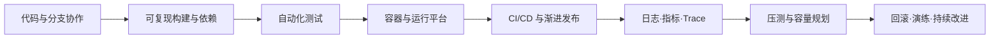

# 工程化与运维：总目录与学习路线

## 学习成果

完成这套笔记后，你应能独立走完一条基本工程链路：

对 C++ 项目，还要让每个制品关联工具链、ABI、调试符号和性能基线，使崩溃、内存和 CPU 问题具备可复现证据。

## 一、基础工具

- [Linux 与 Shell](01-基础工具/02-操作系统与命令行.md)
- [Git 和分支协作](01-基础工具/01-版本控制与分支协作.md)
- [CMake](01-基础工具/03-构建系统.md)
- [Python 环境和依赖管理](01-基础工具/04-脚本环境与依赖管理.md)

本组入口：[基础工具学习顺序](01-基础工具/本章导读.md)

## 二、测试、容器与交付平台

- [测试体系：单元测试、集成测试、接口测试](02-测试与交付平台/01-测试体系.md)
- [Docker：镜像、容器与交付一致性](02-测试与交付平台/02-容器技术.md)
- [Kubernetes 基础：声明式部署与服务编排](02-测试与交付平台/03-容器编排基础.md)
- [Nginx：反向代理、负载均衡与入口层](02-测试与交付平台/04-反向代理与负载均衡.md)
- [CI/CD：从提交到可回滚发布](02-测试与交付平台/05-持续集成与持续交付.md)

本组入口：[交付平台学习顺序](02-测试与交付平台/本章导读.md)

## 三、配置、服务发现与可观测性

- [配置中心与服务发现](03-配置与可观测性/01-配置中心与服务发现.md)
- [日志、指标、Trace 三类信号](03-配置与可观测性/02-可观测性三类信号.md)
- [Prometheus 与 Grafana](03-配置与可观测性/03-指标监控与可视化.md)
- [ELK 与 Loki](03-配置与可观测性/04-日志检索与聚合.md)
- [OpenTelemetry](03-配置与可观测性/05-开放遥测与可观测性.md)

本组入口：[可观测性学习顺序](03-配置与可观测性/本章导读.md)

## 四、容量与发布可靠性

- [压力测试和容量评估](04-容量与发布可靠性/01-压力测试与容量评估.md)
- [灰度发布、回滚和故障演练](04-容量与发布可靠性/02-灰度发布回滚与故障演练.md)

本组入口：[可靠性学习顺序](04-容量与发布可靠性/本章导读.md)

## 五、C++ 工程诊断专题

- [编译环境和 ABI 兼容](05-原生程序工程诊断/01-编译环境与二进制接口兼容.md)
- [Debug/Release 差异与 Sanitizer](05-原生程序工程诊断/02-构建模式与运行时检测.md)
- [Core Dump 定位崩溃](05-原生程序工程诊断/03-核心转储与崩溃分析.md)
- [CPU 火焰图](05-原生程序工程诊断/04-处理器火焰图.md)
- [内存泄漏和性能回归](05-原生程序工程诊断/05-内存泄漏与性能回归.md)

本组入口：[C++ 工程诊断学习顺序](05-原生程序工程诊断/本章导读.md)

## 推荐阶段路线

不要把所有工具并排背诵。按依赖关系完成以下阶段，每阶段都产生一个可验证产物。

| 阶段 | 学习重点 | 阶段产物 |
| --- | --- | --- |
| 1 | Git、Linux、Shell | 使用分支/评审流程协作，编写严格模式运维脚本 |
| 2 | CMake、Python 环境与依赖 | 从干净环境一条命令完成构建，依赖版本可追溯 |
| 3 | 单元/集成/API 测试 | 本地与 CI 能重复运行的分层测试集 |
| 4 | Docker、Nginx | 非 root、可探活的服务镜像与反向代理配置 |
| 5 | Kubernetes 基础、CI/CD | 声明式部署、健康检查、资源限制与交付流水线 |
| 6 | 配置中心、服务发现 | 配置版本化、动态更新策略和发现失败降级方案 |
| 7 | 日志、指标、Trace | 同一请求可用 `trace_id` 关联三类信号 |
| 8 | Prometheus/Grafana、ELK/Loki、OTel | 仪表盘、告警、查询与遥测采集链路 |
| 9 | 压测、容量和渐进发布 | 容量报告、灰度门槛和已验证回滚 runbook |
| 10 | C++ 诊断与演练 | Sanitizer CI、core 符号化、火焰图和性能基线 |

## 贯穿式实践项目

建议选择一个小型 C++ HTTP 服务作为主线，Python 用作接口测试和运维脚本。不要一开始追求复杂业务，重点是工程闭环。

### 里程碑 A：可构建、可测试

- CMake 生成 Debug、RelWithDebInfo 和 Sanitizer 构建。
- Git 提交规范与合并请求模板可执行。
- C++ 单元测试、依赖真实数据库的集成测试、Python API 测试分层运行。
- 依赖、编译器、flags 和测试结果可追溯。

### 里程碑 B：可部署、可配置

- 多阶段 Docker 构建，运行用户非 root，镜像有健康检查策略。
- Kubernetes 使用 Deployment、Service、ConfigMap/Secret、资源 requests/limits 和探针。
- Nginx 提供反向代理、超时与基本限流。
- CI 构建一次不可变制品；CD 在环境之间提升同一制品。

### 里程碑 C：可观测、可诊断

- 结构化日志有时间、级别、服务、请求/Trace ID，敏感字段已过滤。
- Prometheus 指标覆盖请求率、错误、延迟与饱和度；Grafana 有服务总览。
- OpenTelemetry Trace 穿过入口、服务与模拟依赖，并能从 Trace 跳转日志。
- 保留与制品匹配的独立符号，能离线分析 core 和 CPU profile。

### 里程碑 D：可评估、可恢复

- 负载模型包含请求比例、到达率、数据分布和成功断言。
- 输出含 p99、错误率、CPU/请求、内存、瓶颈和冗余的容量报告。
- 执行小比例灰度，指标越界自动/人工停止，并验证旧版恢复。
- 完成一次受控依赖延迟或实例退出演练，复盘改进后复验。

## 章节扩写结构

21 个专题章节均按“理解—操作—诊断—验证”的闭环扩写：

| 模块 | 要回答的问题 |
| --- | --- |
| 前置知识与完成标准 | 学习前应掌握什么，学完后能交付什么证据 |
| 核心原理与概念边界 | 技术为何这样工作，与相邻概念有什么区别 |
| 可复现实验或工作流 | 从零如何操作，预期看到什么结果 |
| 命令和配置解释 | 每个关键参数改变什么，教学示例离生产还差什么 |
| 常见故障与排障路径 | 失败现象对应哪些假设，按什么顺序收集证据 |
| 分层练习与答案要点 | 从基础复现到综合设计，答案必须包含哪些判断 |
| 小结与官方阅读 | 形成心智模型，并继续核对当前版本的一手文档 |

阅读时不要跳过“失败现象”和“如何验证”。工程能力不是记住正常路径，而是在信息不完整时仍能用证据缩小问题范围。

## 每章使用方法

1. 先读“学习目标”和“核心概念”，用自己的话解释边界。
2. 在隔离环境运行示例，不直接复制到生产。
3. 完成练习，并把命令、输入、输出和失败原因记入实验记录。
4. 用章节末检查清单自测；能排障比记住命令更重要。
5. 将示例替换为自己项目的版本、约束和风险控制。

## 全局原则

- **制品不可变、过程可追溯**：构建一次，记录提交、依赖、工具链与摘要。
- **先定义成功再自动化**：测试、告警、灰度和容量都要有明确判定口径。
- **最小权限与敏感数据治理**：日志、Trace、core、profile 和配置都可能泄露数据。
- **超时、重试和资源必须有界**：无界队列、缓存、重试和基数最终都会成为故障源。
- **观测必须服务决策**：仪表盘不是终点，要能回答发布、容量和故障问题。
- **回滚必须演练**：文档里存在但从未执行过的回滚，不是可靠的恢复能力。
- **版本变化要查官方文档**：CLI 参数、配置字段和默认行为会变化，示例用于理解思路，不替代当前版本文档。
