# Transformer 架构详解：从底层机制到 LLM

## 学习目标

读完本文，你应该能回答这些问题：

1. Transformer 为什么可以替代 RNN/CNN 成为现代大模型的基础架构？
2. 一个 token 是如何变成向量、参与注意力计算、再变成下一个 token 概率的？
3. Self-Attention 的 `Q/K/V`、缩放、mask、softmax 分别在解决什么问题？
4. Encoder、Decoder、Encoder-Decoder 三种 Transformer 在结构和用途上有什么区别？
5. 残差连接、LayerNorm、FFN、位置编码、KV Cache 为什么必不可少？
6. 为什么 Transformer 的计算瓶颈常常出现在注意力矩阵和显存，而不是参数量本身？

## 一句话总纲

Transformer 的本质是：**把序列中的每个 token 表示成向量，然后让每个位置通过 Attention 从所有允许看到的位置聚合信息，再用前馈网络逐位置加工，层层堆叠后得到上下文化表示或下一个 token 的概率分布。**

> 记忆口诀：**Embedding 定义“词是谁”，Position 定义“在哪儿”，Attention 决定“看谁”，FFN 决定“怎么加工”，Residual/Norm 保证“深层还能训练”，Mask 决定“能看见什么”。**

## 阅读路线

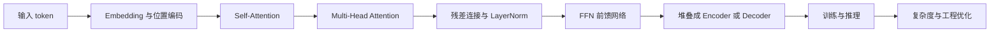

---

## 思维导图

> 先用三张小图建立全局框架，避免把所有细节塞进一张巨图。

### 1. 架构总览

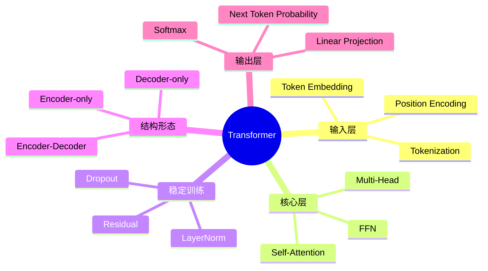

### 2. Attention 记忆图

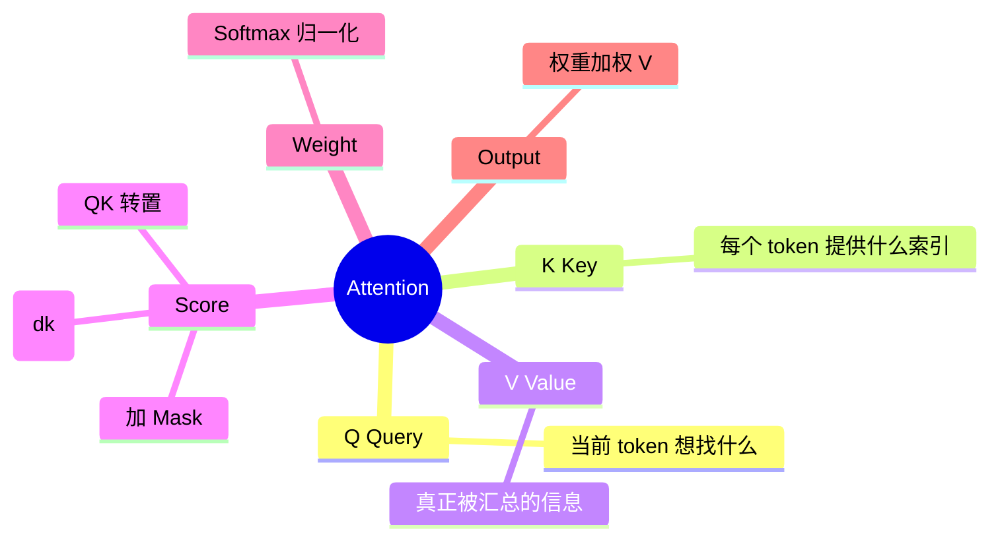

### 3. LLM 视角

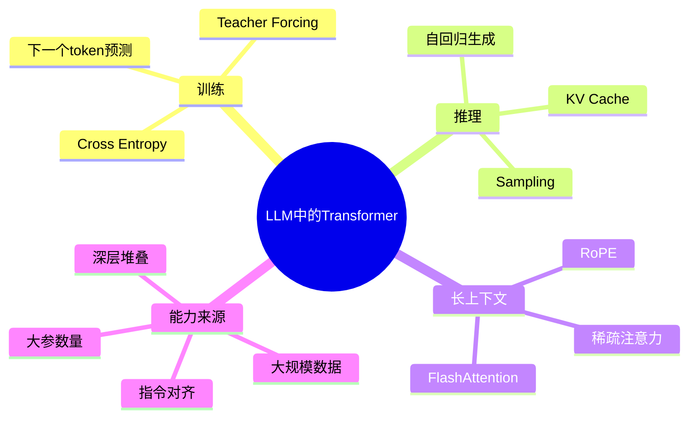

---

## 1. Transformer 解决了什么问题？

### 1.1 RNN 的瓶颈

在 Transformer 之前，序列建模常用 RNN/LSTM/GRU。RNN 的基本思想是从左到右读序列：

```text
h1 -> h2 -> h3 -> ... -> ht
```

问题是：

- **难以并行**：第 `t` 个状态依赖第 `t-1` 个状态，训练时很难同时计算所有位置。
- **长距离依赖困难**：早期 token 的信息要经过很多步才能影响后面 token，容易衰减或被覆盖。
- **路径太长**：第 1 个词影响第 1000 个词，需要经过约 999 次状态传递。

### 1.2 CNN 的瓶颈

CNN 可以并行，但它依赖局部窗口。想让远距离 token 交互，需要堆叠很多层或扩大卷积核。

### 1.3 Transformer 的关键改进

Transformer 用 Self-Attention 让任意两个位置可以在一层内直接交互。

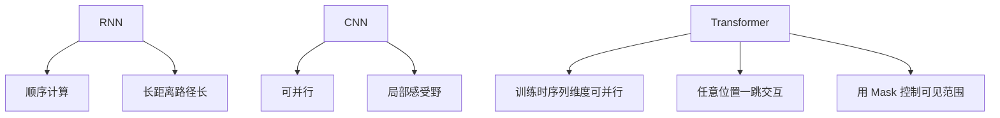

Transformer 的核心优势：

| 维度 | RNN | CNN | Transformer |
| --- | --- | --- | --- |
| 并行训练 | 弱 | 强 | 强 |
| 长距离依赖 | 难 | 需多层扩展 | 一层内可直接建模 |
| 位置信息 | 天然有顺序 | 局部顺序明显 | 需要显式位置编码 |
| 主要瓶颈 | 顺序依赖 | 局部窗口 | 注意力矩阵 `O(n²)` |

---

## 2. 从文本到张量：Transformer 的输入

Transformer 不直接处理字符串，而是处理 token ID 序列。

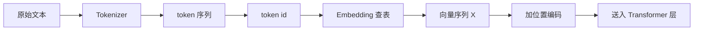

### 2.1 Tokenization

Tokenizer 把文本切成模型词表中的单位。现代 LLM 常用 BPE、Byte-Pair Encoding、Unigram 或 SentencePiece 一类子词方法。

例子：

```text
原文：Transformer is powerful
可能切分：Transform | er | is | powerful
```

注意：token 不一定等于中文词、英文单词或字符。它只是模型词表中的基本符号。

### 2.2 Token Embedding

假设：

- batch size = `B`
- 序列长度 = `T`
- 词表大小 = `V`
- 模型隐藏维度 = `d_model`

输入 token ids 的形状：

```text
[B, T]
```

Embedding 矩阵形状：

```text
[V, d_model]
```

查表后得到：

```text
X = Embedding[token_ids]
X.shape = [B, T, d_model]
```

直觉：Embedding 是一个“语义坐标表”。每个 token ID 对应一个可训练向量。

### 2.3 为什么需要位置编码？

Self-Attention 本身对输入顺序不敏感。如果不加入位置信息，下面两个序列在纯注意力看来很可能难以区分：

```text
猫 追 老鼠
老鼠 追 猫
```

所以 Transformer 必须显式注入位置。

---

## 3. 位置编码：让模型知道顺序

### 3.1 原始 Transformer 的正弦位置编码

原始 Transformer 使用固定的 sinusoidal position encoding：

$$
PE(pos, 2i) = \sin\left(\frac{pos}{10000^{2i/d_{model}}}\right)
$$

$$
PE(pos, 2i+1) = \cos\left(\frac{pos}{10000^{2i/d_{model}}}\right)
$$

含义：

- `pos` 是位置编号。
- `i` 是向量维度编号。
- 偶数维用 sin，奇数维用 cos。
- 不同维度有不同频率，让模型可以通过线性组合感知相对位置。

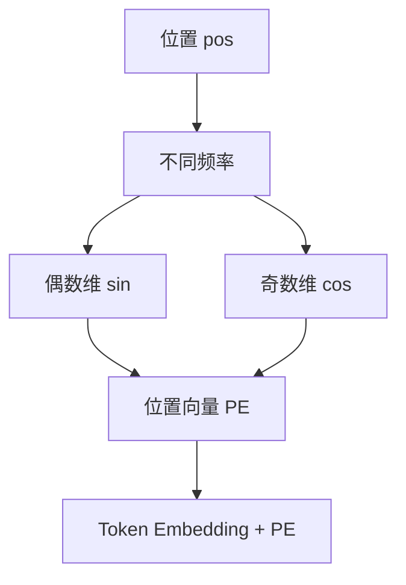

### 3.2 可学习位置编码

很多模型把位置编码做成可训练参数：

```text
PositionEmbedding.shape = [max_length, d_model]
```

优点：灵活，能适应训练数据。  
缺点：对超过训练长度的位置外推能力通常较弱。

### 3.3 RoPE：旋转位置编码

现代 LLM 常用 RoPE（Rotary Position Embedding）。它不是简单把位置向量加到 token embedding 上，而是在 Attention 中旋转 `Q` 和 `K` 的向量，使点积天然带有相对位置信息。

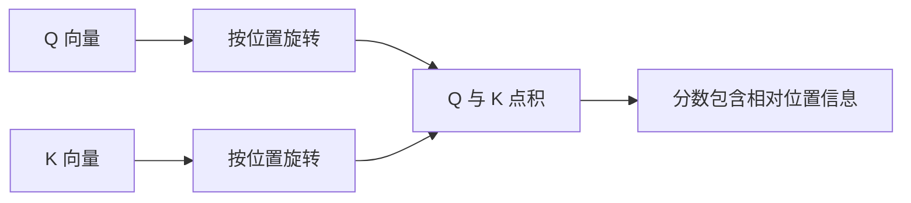

记忆：

- 绝对位置编码：告诉模型“我在第几个位置”。
- 相对位置思想：告诉模型“我和你相隔多远”。
- RoPE：通过旋转让 `Q·K` 对相对距离敏感。

---

## 4. Self-Attention：Transformer 的核心

### 4.1 一句话理解

Self-Attention 让每个 token 根据当前任务，从同一序列中挑选并汇总它需要的信息。

比如句子：

```text
小明把书放进书包，因为它很重。
```

“它”可能需要关注“书”，而不是“书包”。Attention 的作用就是学习这种关联。

### 4.2 Q、K、V 的直觉

| 符号 | 名称 | 直觉 | 类比 |
| --- | --- | --- | --- |
| Q | Query | 当前 token 想查询什么 | 搜索问题 |
| K | Key | 每个 token 可被匹配的索引 | 搜索标签 |
| V | Value | 每个 token 真正提供的信息 | 搜索结果内容 |

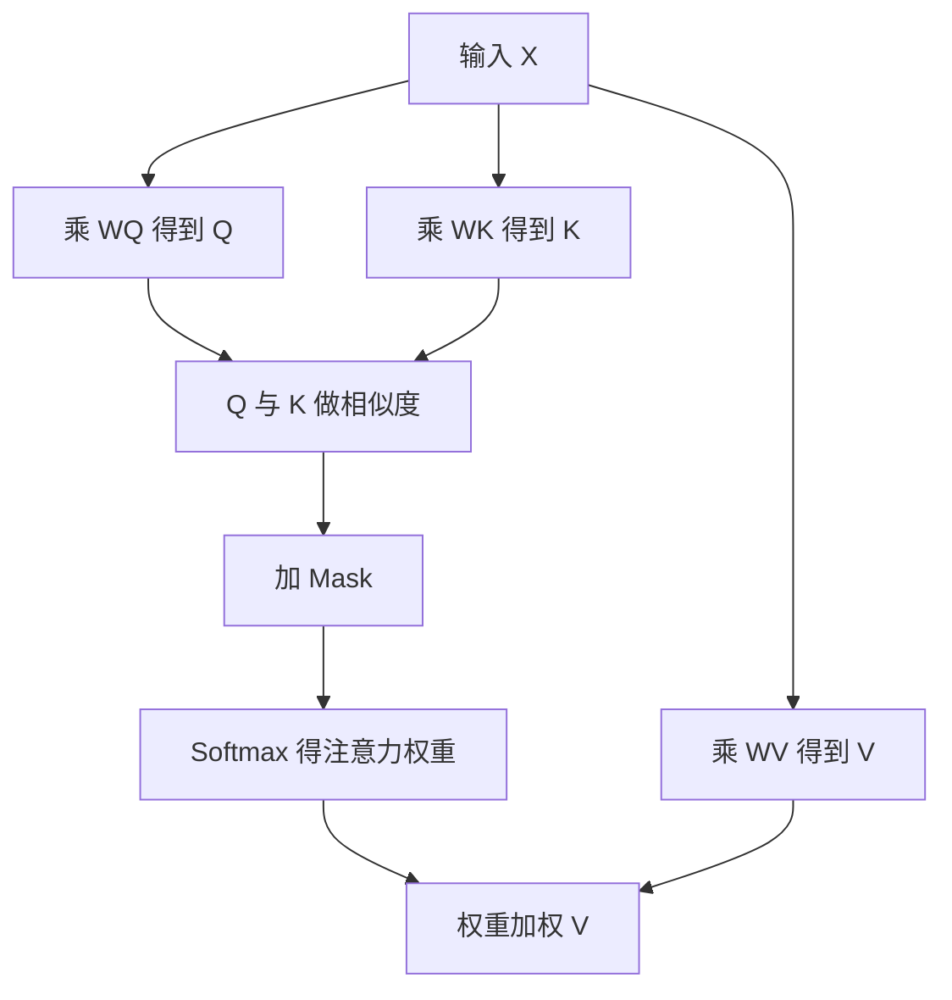

### 4.3 形状推导

输入：

```text
X.shape = [B, T, d_model]
```

线性投影：

```text
Q = X WQ
K = X WK
V = X WV
```

若单头注意力的维度是 `d_k`、`d_v`：

```text
WQ.shape = [d_model, d_k]
WK.shape = [d_model, d_k]
WV.shape = [d_model, d_v]

Q.shape = [B, T, d_k]
K.shape = [B, T, d_k]
V.shape = [B, T, d_v]
```

注意力分数：

```text
scores = Q @ K^T
scores.shape = [B, T, T]
```

其中 `scores[b, i, j]` 表示：第 `b` 个样本里，第 `i` 个位置对第 `j` 个位置的关注程度。

### 4.4 Scaled Dot-Product Attention 公式

$$
Attention(Q,K,V)=softmax\left(\frac{QK^T}{\sqrt{d_k}} + mask\right)V
$$

分解来看：

1. `QK^T`：计算每个 query 与所有 key 的相似度。
2. `/ sqrt(d_k)`：缩放分数，避免维度大时点积过大导致 softmax 饱和。
3. `+ mask`：禁止看某些位置，例如 padding 或未来 token。
4. `softmax`：把分数变成每行和为 1 的概率权重。
5. `权重 × V`：把相关 token 的 value 加权求和。

```mermaid
flowchart LR
  A[QK 转置] --> B[除以 sqrt(dk)]
  B --> C[加 Mask]
  C --> D[Softmax]
  D --> E[乘 V]
  E --> F[Attention 输出]
```

### 4.5 为什么要除以 `sqrt(d_k)`？

如果 `Q` 和 `K` 的各维近似独立，点积的方差会随着 `d_k` 增大而增大。分数过大时，softmax 会变得非常尖锐：最大值接近 1，其他接近 0，梯度容易变小。

缩放后：

```text
QK^T / sqrt(d_k)
```

可以让分数分布更稳定。

### 4.6 Softmax 是按行做的

对每个 query 位置，softmax 在所有 key 位置上归一化：

```text
第 i 行 = 第 i 个 token 看所有 token 的分布
```

示意：

| Query \ Key | 我 | 喜欢 | 机器 | 学习 |
| --- | ---: | ---: | ---: | ---: |
| 我 | 0.70 | 0.10 | 0.10 | 0.10 |
| 喜欢 | 0.20 | 0.30 | 0.20 | 0.30 |
| 机器 | 0.05 | 0.15 | 0.30 | 0.50 |
| 学习 | 0.05 | 0.10 | 0.55 | 0.30 |

每一行和为 1。

---

## 5. Mask：控制 token 能看见什么

Mask 是 Transformer 正确性的关键。它不改变模型参数，只改变 Attention 分数中哪些位置可见。

### 5.1 Padding Mask

不同样本长度不同，通常会 padding 到同一长度。

```text
真实句子：我 喜欢 NLP
填充后：我 喜欢 NLP <pad> <pad>
```

模型不应该关注 `<pad>`，所以要把 padding 位置 mask 掉。

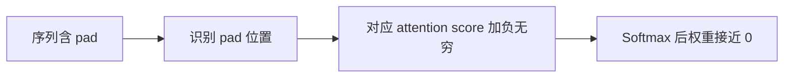

### 5.2 Causal Mask

Decoder-only LLM 生成下一个 token 时，当前位置不能偷看未来 token。

```text
预测第 4 个 token 时，只能看第 1、2、3 个 token。
```

Causal mask 是下三角可见矩阵：

| Query \ Key | 1 | 2 | 3 | 4 |
| --- | --- | --- | --- | --- |
| 1 | 可见 | 禁止 | 禁止 | 禁止 |
| 2 | 可见 | 可见 | 禁止 | 禁止 |
| 3 | 可见 | 可见 | 可见 | 禁止 |
| 4 | 可见 | 可见 | 可见 | 可见 |

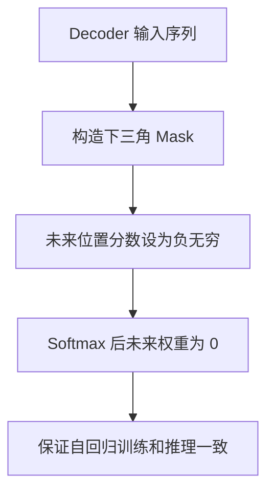

### 5.3 Mask 的底层实现直觉

常见实现不是把权重乘 0，而是在 softmax 前把禁止位置加上一个极小值：

```text
allowed score = 原始分数
blocked score = -inf 或非常小的负数
```

这样 softmax 后禁止位置的概率约等于 0。

---

## 6. Multi-Head Attention：为什么要多头？

### 6.1 单头的问题

单头 Attention 只能在一个表示子空间中计算关系。现实语言关系很多：

- 主谓关系
- 指代关系
- 修饰关系
- 位置关系
- 语义相似
- 代码中的括号匹配

一个注意力头不一定能同时捕捉所有关系。

### 6.2 多头的做法

Multi-Head Attention 把 `d_model` 拆成多个头，每个头独立计算 Attention，然后拼接回去。

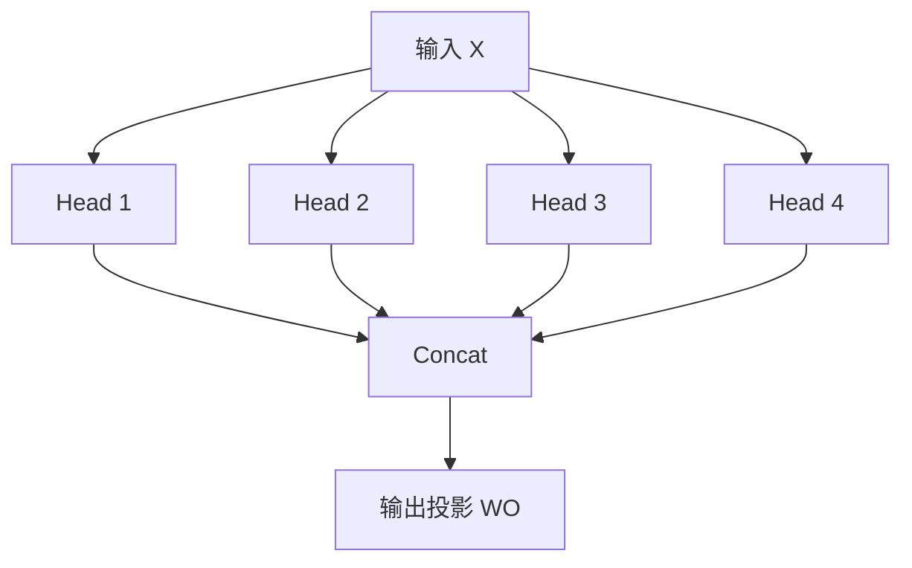

典型设定：

```text
d_model = 4096
num_heads = 32
head_dim = d_model / num_heads = 128
```

每个头：

```text
Q_head.shape = [B, num_heads, T, head_dim]
K_head.shape = [B, num_heads, T, head_dim]
V_head.shape = [B, num_heads, T, head_dim]
```

注意力权重：

```text
[B, num_heads, T, T]
```

### 6.3 多头的记忆方式

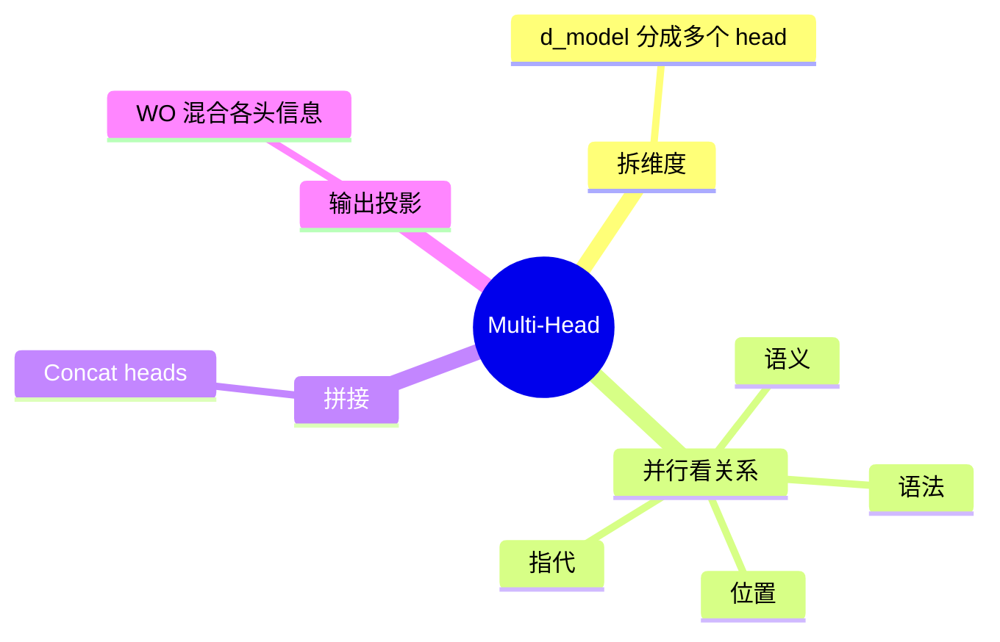

---

## 7. FFN：逐位置的非线性加工厂

Attention 负责“跨 token 混合信息”，FFN 负责“对每个位置的向量做非线性变换”。

原始 Transformer 的 FFN：

$$
FFN(x)=max(0, xW_1+b_1)W_2+b_2
$$

现代 LLM 常用 GELU、SwiGLU 等激活/门控变体。

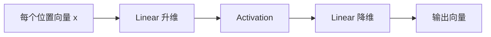

### 7.1 为什么 FFN 是逐位置的？

FFN 对每个 token 位置共享同一套参数，不直接混合不同位置：

```text
Attention：位置之间交流
FFN：每个位置内部加工
```

### 7.2 FFN 维度

常见设置：

```text
d_ff = 4 * d_model
```

若 `d_model = 4096`，则 `d_ff` 可能约为 `16384`。因此 FFN 往往占据 Transformer 参数量的大头。

---

## 8. 残差连接与 LayerNorm：让深层网络可训练

Transformer 通常堆叠很多层。没有稳定机制，深层网络会出现梯度消失、梯度爆炸或训练不稳定。

### 8.1 残差连接

残差连接把子层输出加回输入：

```text
y = x + Sublayer(x)
```

作用：

- 保留原始信息通道。
- 让梯度有更短路径回传。
- 让每一层学习“增量修改”，而不是从零重建表示。

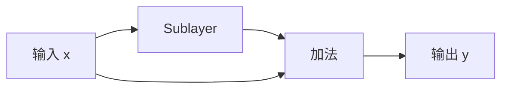

### 8.2 LayerNorm

LayerNorm 对每个 token 的隐藏维度做归一化：

```text
输入形状：[B, T, d_model]
归一化维度：d_model
```

它让每个位置的向量分布更稳定。

### 8.3 Post-LN 与 Pre-LN

原始 Transformer 常被描述为 Post-LN：

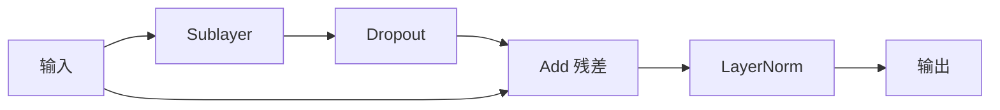

现代大规模 LLM 常用 Pre-LN：

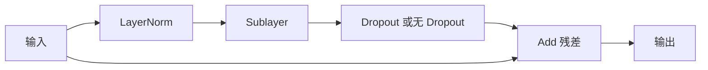

对比：

| 结构 | 顺序 | 特点 |
| --- | --- | --- |
| Post-LN | Sublayer → Add → Norm | 原始论文结构，深层时训练可能更难 |
| Pre-LN | Norm → Sublayer → Add | 大模型常用，深层训练更稳定 |

---

## 9. Encoder、Decoder 与完整 Transformer

Transformer 最初用于机器翻译，是 Encoder-Decoder 架构。

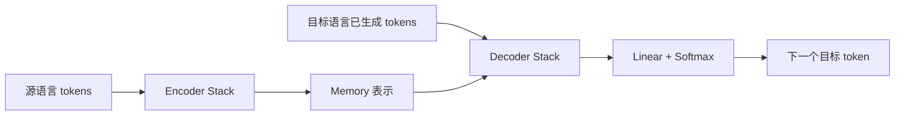

### 9.1 Encoder Layer

Encoder 每层包含：

1. Multi-Head Self-Attention
2. FFN
3. 残差连接与 LayerNorm

Encoder 的 self-attention 通常可以双向看见整个输入序列，但要屏蔽 padding。

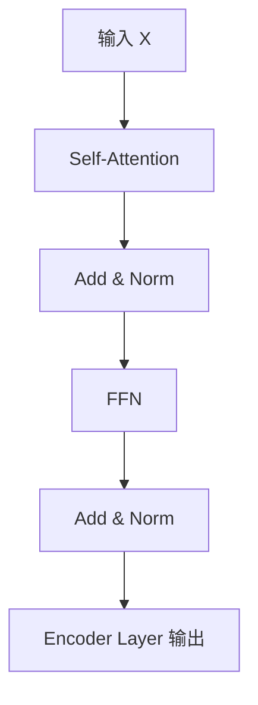

用途：适合理解任务，例如分类、抽取、语义匹配。代表：BERT 类模型。

### 9.2 Decoder Layer

原始 Decoder 每层包含：

1. Masked Self-Attention
2. Cross-Attention
3. FFN
4. 残差连接与 LayerNorm

```mermaid
flowchart TD
  X[目标端输入] --> A[Masked Self-Attention]
  A --> B[Add & Norm]
  M[Encoder Memory] --> C[Cross-Attention]
  B --> C
  C --> D[Add & Norm]
  D --> E[FFN]
  E --> F[Add & Norm]
  F --> Y[Decoder Layer 输出]
```

### 9.3 Cross-Attention 是什么？

在 Cross-Attention 中：

- `Q` 来自 Decoder 当前状态。
- `K`、`V` 来自 Encoder 输出。

公式仍然是 Attention，只是来源不同：

```text
Q = Decoder hidden states
K = Encoder hidden states
V = Encoder hidden states
```

直觉：Decoder 一边生成目标语言，一边查询源语言信息。

### 9.4 三类常见 Transformer

| 类型 | 注意力可见性 | 典型任务 | 代表模型 |
| --- | --- | --- | --- |
| Encoder-only | 双向可见 | 理解、分类、检索、抽取 | BERT |
| Decoder-only | 只能看过去 | 生成、对话、代码补全 | GPT 类、LLaMA 类 |
| Encoder-Decoder | Encoder 双向，Decoder 自回归 | 翻译、摘要、条件生成 | T5、原始 Transformer |

```mermaid
mindmap
  root((Transformer家族))
    Encoder-only
      双向理解
      适合分类检索抽取
      BERT
    Decoder-only
      Causal Mask
      自回归生成
      GPT LLaMA
    Encoder-Decoder
      编码输入
      解码输出
      翻译摘要
      T5
```

---

## 10. Decoder-only LLM：现代大语言模型的主流形式

现代聊天模型多采用 Decoder-only Transformer。它的训练目标通常是下一个 token 预测。

### 10.1 训练样本

给定文本：

```text
我 喜欢 机器 学习
```

模型训练为：

| 输入上下文 | 目标 token |
| --- | --- |
| 我 | 喜欢 |
| 我 喜欢 | 机器 |
| 我 喜欢 机器 | 学习 |

在实现中，模型可以一次性并行计算所有位置的预测，但用 causal mask 防止偷看未来。

```mermaid
flowchart LR
  A[完整训练序列] --> B[Causal Mask]
  B --> C[并行计算每个位置 hidden state]
  C --> D[预测每个位置的下一个 token]
  D --> E[Cross Entropy Loss]
```

### 10.2 推理生成

推理时是自回归的：

```mermaid
flowchart TD
  A[输入 Prompt] --> B[模型输出下一个 token 概率]
  B --> C[采样或贪心选择 token]
  C --> D[追加到上下文]
  D --> E{是否结束}
  E -- 否 --> B
  E -- 是 --> F[生成完成]
```

### 10.3 为什么训练可并行，推理仍顺序？

训练时，目标答案已经完整存在。Causal mask 保证每个位置只能看过去，所以可以并行计算所有位置的 loss。

推理时，未来 token 还不存在，必须生成一个，再把它追加进上下文，再生成下一个。

---

## 11. KV Cache：让自回归推理更快

### 11.1 没有 KV Cache 的问题

假设已经生成了 1000 个 token，要生成第 1001 个 token。如果每次都重新计算前 1000 个 token 的 `K` 和 `V`，会浪费大量计算。

### 11.2 KV Cache 的核心思想

过去 token 的 `K`、`V` 在当前模型参数固定时不会变化，可以缓存起来。

```mermaid
flowchart TD
  A[生成 token 1] --> B[缓存 K1 V1]
  B --> C[生成 token 2]
  C --> D[缓存 K2 V2]
  D --> E[生成 token t]
  E --> F[只计算新 token 的 Qt Kt Vt]
  F --> G[Qt 关注缓存中的 K1..Kt]
  G --> H[加权缓存中的 V1..Vt]
```

### 11.3 KV Cache 的代价

KV Cache 降低重复计算，但会占用显存。缓存大小大致与下面因素成正比：

```text
batch_size × layers × sequence_length × num_heads × head_dim × 2(K和V)
```

长上下文推理时，KV Cache 可能成为主要显存瓶颈。

---

## 12. 输出层：从隐藏向量到 token 概率

Decoder 最后一层输出：

```text
H.shape = [B, T, d_model]
```

通过线性层投影到词表大小：

```text
logits = H @ W_vocab
logits.shape = [B, T, vocab_size]
```

然后对词表维度做 softmax：

```text
probabilities = softmax(logits)
```

```mermaid
flowchart LR
  A[最后一层 hidden state] --> B[Linear 到 vocab_size]
  B --> C[Logits]
  C --> D[Softmax]
  D --> E[下一个 token 概率分布]
```

训练时用交叉熵损失：

$$
Loss = -\log P(\text{正确下一个 token})
$$

推理时根据 logits 选择 token：

| 方法 | 含义 | 特点 |
| --- | --- | --- |
| Greedy | 选概率最大 token | 稳定但可能死板 |
| Temperature | 调整分布尖锐程度 | 温度高更随机，低更保守 |
| Top-k | 只在前 k 个候选中采样 | 控制低概率噪声 |
| Top-p | 在累计概率 p 的候选集合中采样 | 候选数量动态变化 |

---

## 13. 一层 Transformer Block 的完整数据流

以现代 Pre-LN Decoder Block 为例：

```mermaid
flowchart TD
  X[输入 x] --> LN1[LayerNorm]
  LN1 --> MHA[Masked Multi-Head Self-Attention]
  MHA --> ADD1[残差相加 x + attn]
  X --> ADD1
  ADD1 --> LN2[LayerNorm]
  LN2 --> FFN[FFN or MLP]
  FFN --> ADD2[残差相加]
  ADD1 --> ADD2
  ADD2 --> Y[输出到下一层]
```

伪代码：

```python
# Pre-LN Transformer Decoder Block
x = x + masked_self_attention(layer_norm_1(x), mask=causal_mask)
x = x + ffn(layer_norm_2(x))
```

如果是 Encoder Block，则 attention 通常不使用 causal mask，而是使用 padding mask。

如果是 Encoder-Decoder Decoder Block，则在 masked self-attention 和 FFN 之间增加 cross-attention。

---

## 14. 底层矩阵计算：一步步看 Attention

假设一个很小的例子：

```text
B = 1
T = 3
d_model = 4
num_heads = 2
head_dim = 2
```

输入张量：

```text
X.shape = [1, 3, 4]
```

线性投影后：

```text
Q/K/V.shape = [1, 3, 4]
```

拆成 2 个头：

```text
Q/K/V.shape = [1, 2, 3, 2]
```

对每个头计算：

```text
scores = Q @ K.transpose(-1, -2)
scores.shape = [1, 2, 3, 3]
```

softmax 后：

```text
weights.shape = [1, 2, 3, 3]
```

乘 V：

```text
context = weights @ V
context.shape = [1, 2, 3, 2]
```

拼回：

```text
context.shape = [1, 3, 4]
```

输出投影：

```text
output = context @ WO
output.shape = [1, 3, 4]
```

```mermaid
flowchart TD
  A[X: B,T,d_model] --> B[Linear 得 Q K V]
  B --> C[reshape 为 B,H,T,D]
  C --> D[QK 转置 得 B,H,T,T]
  D --> E[Mask 与 Softmax]
  E --> F[乘 V 得 B,H,T,D]
  F --> G[Concat heads 得 B,T,d_model]
  G --> H[输出投影]
```

---

## 15. 为什么 Attention 是 `O(n²)`？

设序列长度为 `T`。每个 query 都要和所有 key 计算相似度，所以注意力分数矩阵大小是：

```text
T × T
```

当 `T = 4096`：

```text
T² = 16,777,216
```

如果还有多个 batch、多个 head、多个 layer，显存和计算压力会迅速增加。

```mermaid
flowchart LR
  A[序列长度 T] --> B[Attention Matrix T x T]
  B --> C[计算量约 O(T² d)]
  B --> D[显存约 O(T²)]
  C --> E[长上下文变慢]
  D --> E
```

### 15.1 参数量与激活显存不是一回事

- **参数量**：模型权重大小，主要由线性层、FFN、Embedding 决定。
- **激活显存**：训练中保存中间结果用于反向传播，和 batch、序列长度、层数密切相关。
- **KV Cache**：推理中保存历史 token 的 K/V，和上下文长度密切相关。

长上下文场景下，即使参数量不变，计算和显存也会随序列长度显著增长。

### 15.2 常见优化方向

| 优化 | 核心思想 | 解决问题 |
| --- | --- | --- |
| FlashAttention | 分块计算，减少显存读写和中间矩阵存储 | 加速注意力、降低显存 |
| Sparse Attention | 只看部分 token | 降低 `T²` 成本 |
| Sliding Window | 只看局部窗口 | 长文本局部建模 |
| GQA/MQA | 多个 query 头共享 K/V 头 | 降低 KV Cache |
| Quantization | 降低权重或缓存精度 | 降低显存占用 |

---

## 16. 训练过程：模型到底学什么？

### 16.1 前向传播

```mermaid
flowchart LR
  A[token ids] --> B[Embedding]
  B --> C[Transformer Blocks]
  C --> D[Logits]
  D --> E[Loss]
```

### 16.2 反向传播

Loss 反向传播，更新：

- Embedding 参数
- Q/K/V/O 投影矩阵
- FFN 权重
- LayerNorm 参数
- 输出投影矩阵

```mermaid
flowchart TD
  A[Loss] --> B[计算梯度]
  B --> C[更新 Attention 参数]
  B --> D[更新 FFN 参数]
  B --> E[更新 Embedding]
  B --> F[更新 LayerNorm]
```

### 16.3 自监督学习

语言模型不需要人工给每个 token 标注类别。文本本身提供监督信号：

```text
输入：前面的 token
标签：下一个 token
```

这就是自监督学习的一种形式。

---

## 17. Attention 学到的是“解释”吗？

注意力权重很有启发性，但不能简单等同于人类可解释因果关系。

原因：

1. 注意力只是模型内部的一种信息混合权重。
2. 后续 FFN、残差、多层堆叠会继续改变表示。
3. 多头之间可能分工复杂。
4. 高 attention 权重不一定意味着该 token 是最终预测的唯一原因。

正确理解：

```text
Attention 权重可以帮助观察模型在某一层某一头的信息路由倾向，
但不能直接当成完整解释。
```

---

## 18. Transformer 中常见概念对照

| 概念 | 解决的问题 | 记忆方式 |
| --- | --- | --- |
| Token Embedding | 把离散 token 变成连续向量 | 词的坐标 |
| Position Encoding | 注入顺序信息 | 位置标签 |
| Q/K/V | 建立查询、匹配、取值机制 | 搜索系统 |
| Scaled Dot-Product | 计算相关性并稳定 softmax | 相似度打分 |
| Mask | 控制可见范围 | 遮挡未来或 padding |
| Multi-Head | 在多个子空间看关系 | 多个观察角度 |
| FFN | 逐位置非线性加工 | token 的加工厂 |
| Residual | 保留信息和梯度通路 | 高速旁路 |
| LayerNorm | 稳定激活分布 | 每个 token 内部标准化 |
| KV Cache | 复用历史 K/V | 推理备忘录 |

---

## 19. 常见误区

### 误区 1：Transformer 不需要位置

错误。Self-Attention 本身对顺序不敏感，必须通过位置编码或相对位置机制注入顺序信息。

### 误区 2：Attention 就是全部智能来源

错误。Attention 负责信息路由，FFN、深层堆叠、大规模数据、训练目标和对齐过程同样关键。

### 误区 3：Decoder-only 训练不能并行

错误。训练时目标序列已知，可以用 causal mask 并行计算所有位置的 loss。推理时才必须逐 token 生成。

### 误区 4：上下文长度增加只影响输入大小

错误。标准全注意力的注意力矩阵是 `T × T`，长度翻倍，注意力矩阵大小约变为 4 倍。

### 误区 5：KV Cache 会减少模型参数

错误。KV Cache 不改变参数量，它减少重复计算，但增加推理时缓存显存。

---

## 20. 用一个故事记住 Transformer

把 Transformer 想象成一个大型会议系统：

1. 每个 token 是一个参会者。
2. Embedding 是每个人的身份资料。
3. Position Encoding 是座位号。
4. Query 是“我现在想问什么”。
5. Key 是“我能回答什么问题”。
6. Value 是“我的真实回答内容”。
7. Attention 是每个人决定听谁讲话、听多少。
8. Multi-Head 是每个人同时从语法、语义、位置、指代等多个频道听会。
9. FFN 是每个人听完后在自己脑子里加工总结。
10. Residual 是保留原始笔记，避免讨论中丢失重要信息。
11. LayerNorm 是每轮讨论后统一一下表达尺度。
12. 多层堆叠就是开很多轮会，理解逐步加深。
13. Decoder 的 causal mask 是会议规则：不能偷看未来发言。

```mermaid
mindmap
  root((会议类比))
    参会者
      token
    身份资料
      embedding
    座位号
      position
    提问
      query
    索引
      key
    内容
      value
    多频道讨论
      multi-head
    个人总结
      FFN
    会议纪律
      mask
```

---

## 21. 从原始 Transformer 到现代 LLM 的变化

| 模块 | 原始 Transformer | 现代 LLM 常见变化 |
| --- | --- | --- |
| 架构 | Encoder-Decoder | 多为 Decoder-only |
| 位置编码 | Sinusoidal absolute PE | RoPE、ALiBi、相对位置等 |
| Norm 位置 | Post-LN 常见 | Pre-LN 或 RMSNorm 常见 |
| FFN 激活 | ReLU | GELU、SwiGLU 等 |
| Attention | MHA | MHA、MQA、GQA、FlashAttention |
| 训练目标 | 翻译序列建模 | 大规模 next token prediction |
| 推理优化 | 不强调 KV Cache | KV Cache 是核心优化 |

注意：这些变化不是推翻 Transformer，而是在 Transformer Block 的基本范式上做工程和稳定性改进。

---

## 22. 最小伪代码：Decoder-only Transformer

下面是便于理解的伪代码，不等同于高性能框架实现。

```python
class DecoderOnlyTransformer:
    def forward(self, token_ids):
        # token_ids: [B, T]
        x = token_embedding(token_ids)          # [B, T, d_model]
        x = add_or_apply_position_encoding(x)   # [B, T, d_model]

        mask = causal_mask(T)                   # [T, T]

        for block in blocks:
            x = block(x, mask)

        x = final_norm(x)
        logits = x @ vocab_projection           # [B, T, vocab_size]
        return logits

class DecoderBlock:
    def forward(self, x, mask):
        x = x + self_attention(norm1(x), mask)
        x = x + mlp(norm2(x))
        return x
```

Attention 的伪代码：

```python
def attention(x, mask):
    q = x @ Wq
    k = x @ Wk
    v = x @ Wv

    q = split_heads(q)
    k = split_heads(k)
    v = split_heads(v)

    scores = q @ transpose_last_two_dims(k)
    scores = scores / sqrt(head_dim)
    scores = scores + mask

    weights = softmax(scores, dim=-1)
    context = weights @ v
    context = merge_heads(context)

    return context @ Wo
```

---

## 23. 学习自检

如果你能不看笔记回答下面问题，就说明已经掌握主干：

1. 为什么 Self-Attention 没有位置编码就不知道顺序？
2. `QK^T` 的形状为什么是 `[B, heads, T, T]`？
3. 为什么要除以 `sqrt(d_k)`？
4. Padding mask 和 causal mask 的区别是什么？
5. Multi-Head Attention 为什么不是简单重复同一个头？
6. FFN 为什么说是“逐位置”网络？
7. Residual 和 LayerNorm 分别解决什么训练问题？
8. Encoder-only、Decoder-only、Encoder-Decoder 分别适合什么任务？
9. 为什么 Decoder-only 模型训练时可以并行、推理时不可以完全并行？
10. KV Cache 节省了什么，又消耗了什么？
11. 为什么标准 Attention 的长上下文成本是二次方？
12. 现代 LLM 相比原始 Transformer 常见改动有哪些？

---

## 24. 速记卡片

### 24.1 Attention 公式卡

```text
Attention(Q,K,V) = softmax((QK^T / sqrt(dk)) + mask) V
```

记忆顺序：

```text
查相似度 → 缩放 → 遮挡 → 归一化 → 汇总信息
```

### 24.2 Block 结构卡

```text
Pre-LN Decoder Block:
x = x + SelfAttention(LN(x))
x = x + FFN(LN(x))
```

### 24.3 模块分工卡

```text
Embedding：把 token 变成向量
Position：告诉模型顺序
Attention：跨位置交换信息
FFN：逐位置加工信息
Residual：保留原信息与梯度通路
LayerNorm：稳定每层输入输出尺度
Mask：控制看见范围
```

### 24.4 复杂度卡

```text
标准全注意力：时间/显存核心压力来自 T × T 注意力矩阵
上下文长度翻倍，注意力矩阵约变 4 倍
KV Cache：省重复计算，吃显存
```

---

## 25. 总结

Transformer 可以记成一个循环堆叠的表示更新过程：

```mermaid
flowchart LR
  A[Token 向量] --> B[带位置信息]
  B --> C[Attention 跨 token 聚合]
  C --> D[FFN 逐 token 加工]
  D --> E[Residual 与 Norm 稳定训练]
  E --> F{是否还有下一层}
  F -- 有 --> C
  F -- 无 --> G[输出 hidden states]
  G --> H[任务头或词表概率]
```

最核心的理解不是背模块名称，而是知道每个模块的职责：

- **Embedding/Position**：把离散、有顺序的文本变成连续、有位置信息的向量序列。
- **Attention**：让 token 之间按需要通信。
- **FFN**：对每个位置的表示做非线性加工。
- **Residual/Norm**：让深层堆叠可训练。
- **Mask**：定义信息流边界。
- **Output Head**：把隐藏表示转成具体任务输出，LLM 中通常是下一个 token 概率。

记住这条主线，再看任何 Transformer 变体，都可以先问六个问题：

1. 它是 Encoder、Decoder，还是 Encoder-Decoder？
2. 它的位置编码怎么做？
3. 它的 Attention 可见范围是什么？
4. 它的 FFN/MLP 用什么激活或门控？
5. 它的 Norm 和残差顺序是什么？
6. 它为训练或推理做了哪些工程优化？

能回答这六个问题，就能快速拆解大部分 Transformer 架构。

## 参考

- Vaswani et al., 2017, *Attention Is All You Need*.
- Devlin et al., 2018, *BERT: Pre-training of Deep Bidirectional Transformers for Language Understanding*.
- Brown et al., 2020, *Language Models are Few-Shot Learners*.
- Su et al., 2021, *RoFormer: Enhanced Transformer with Rotary Position Embedding*.
