# Transformer 架构面试 20 问：从高频问题到底层机制

## 使用方式

这份文档不是单纯背答案，而是帮你建立“面试可说清、追问能展开、落到公式和工程细节也不慌”的知识结构。

每个问题建议按四层回答：

1. **先一句话定性**：告诉面试官你知道核心。
2. **再讲机制**：公式、张量形状、信息流。
3. **补充取舍**：为什么这样设计，有什么代价。
4. **应对追问**：训练、推理、复杂度、工程优化。

> 记忆口诀：**先总后分，先图后式，先职责后细节，先正确性后优化。**

---

## 高频考点地图

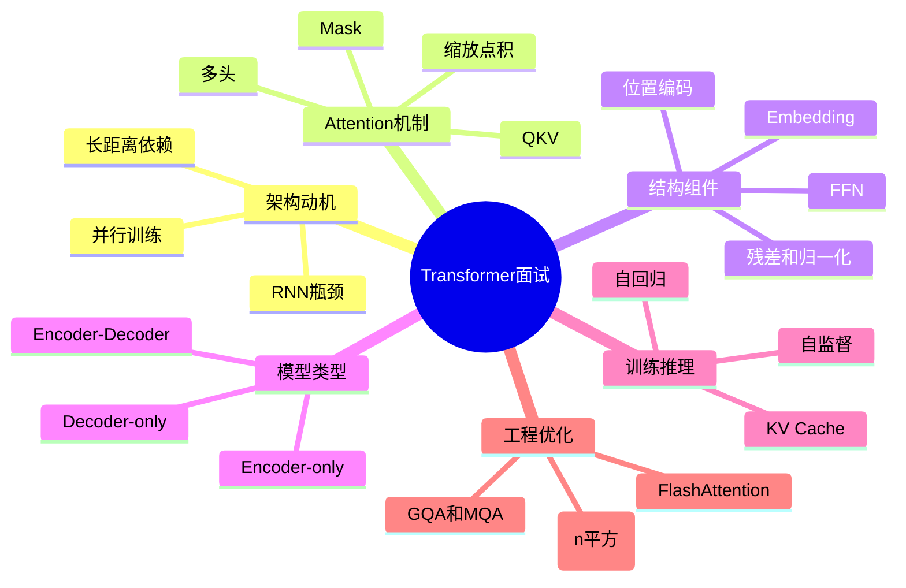

---

## Q1. Transformer 的核心思想是什么？为什么它重要？

### 面试官想考什么

考你是否能用一句话概括 Transformer，而不是只背“Attention is all you need”。

### 标准回答

Transformer 的核心思想是：**用 Self-Attention 让序列中每个 token 能直接和其他 token 建立关系，再通过 FFN、残差连接、归一化和多层堆叠不断更新表示。**

它重要是因为它同时解决了两类问题：

- 相比 RNN，训练时更容易并行。
- 相比局部 CNN，更容易建模远距离依赖。

### 深入展开

RNN 需要按时间顺序递推隐藏状态，第 `t` 个 token 依赖第 `t-1` 个状态，因此训练并行度差。Transformer 中，同一层的所有 token 可以同时计算 Q、K、V，并行得到注意力矩阵。

Self-Attention 让任意两个 token 在一层内直接交互，路径长度更短。例如第 1 个 token 和第 1000 个 token 在一层 Attention 中就能相互影响。

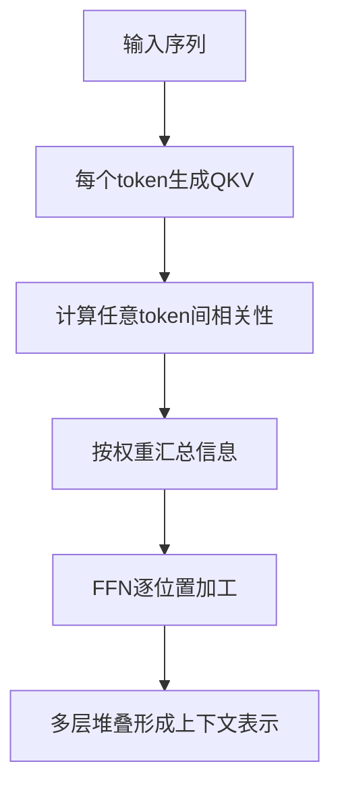

### 追问回答

如果面试官问“Transformer 是否完全没有顺序概念？”

答：不是。Self-Attention 本身不包含顺序偏置，所以必须加入位置编码或相对位置机制，例如 Sinusoidal Position Encoding、Learned Position Embedding、RoPE、ALiBi 等。

### 速记

```text
Transformer = Attention 信息路由 + FFN 非线性加工 + Residual/Norm 稳定深层训练
```

---

## Q2. Transformer 相比 RNN 和 CNN 的优势与代价是什么？

### 面试官想考什么

考你是否理解架构选择背后的 trade-off，而不是盲目说 Transformer 更强。

### 标准回答

Transformer 的优势是并行训练能力强、长距离依赖建模路径短、可扩展性好。代价是标准全注意力需要计算 `T × T` 注意力矩阵，序列长度变长时计算和显存开销是二次增长。

### 对比表

| 维度 | RNN | CNN | Transformer |
| --- | --- | --- | --- |
| 序列并行训练 | 弱 | 强 | 强 |
| 长距离依赖 | 容易衰减 | 依赖感受野 | 一层可直接交互 |
| 顺序归纳偏置 | 强 | 中等 | 需位置编码 |
| 长序列成本 | 线性但难并行 | 取决于卷积设计 | 标准注意力二次方 |
| 典型瓶颈 | 时间递推 | 局部建模 | 注意力矩阵和显存 |

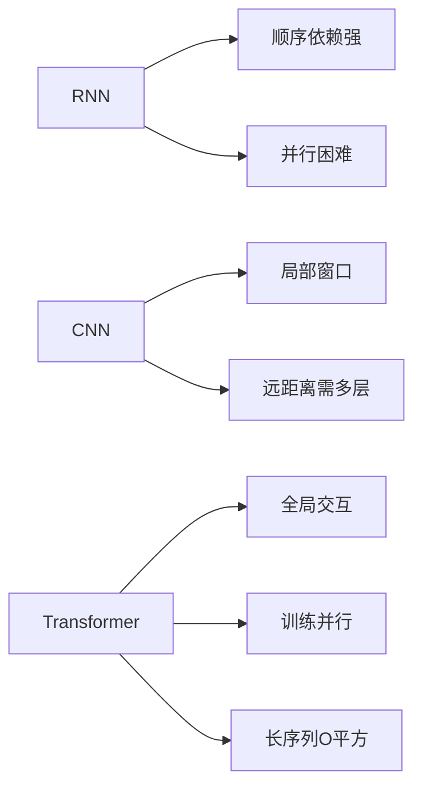

### 深入展开

Transformer 并不是在所有场景都绝对优于 RNN/CNN。如果序列特别长、资源有限、任务强局部化，标准 Transformer 的二次复杂度可能成为问题。因此才有稀疏注意力、滑动窗口注意力、线性注意力、FlashAttention、GQA、MQA 等优化。

### 速记

```text
优点：并行强、依赖短、扩展好
缺点：位置要补、长序列贵、显存压力大
```

---

## Q3. Self-Attention 的 Q、K、V 分别是什么？

### 面试官想考什么

这是最基础也最容易被追问到底层的问题。必须能讲清直觉、公式和形状。

### 标准回答

在 Self-Attention 中，输入向量 `X` 会通过三个不同的线性变换得到：

- `Q`，Query，表示当前 token 想查询什么。
- `K`，Key，表示每个 token 能被怎样匹配。
- `V`，Value，表示每个 token 真正提供的信息内容。

注意力先用 `Q` 和 `K` 计算匹配分数，再用分数加权汇总 `V`。

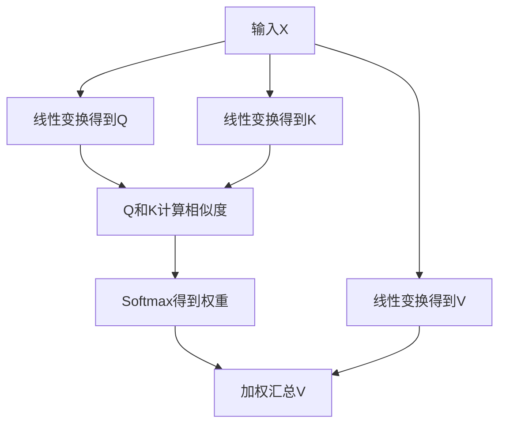

### 公式

$$
Q=XW_Q,\quad K=XW_K,\quad V=XW_V
$$

$$
Attention(Q,K,V)=softmax\left(\frac{QK^T}{\sqrt{d_k}}\right)V
$$

如果输入 `X` 的形状是：

```text
[B, T, d_model]
```

则单头情况下：

```text
Q: [B, T, d_k]
K: [B, T, d_k]
V: [B, T, d_v]
QK^T: [B, T, T]
Output: [B, T, d_v]
```

### 类比记忆

```text
Q = 搜索框里的问题
K = 每篇文档的索引标签
V = 每篇文档的正文内容
Attention = 用问题匹配索引，再按匹配度读取正文
```

### 追问回答

如果问“为什么 Q、K、V 要用不同矩阵？”

答：因为“用于查询的特征”“用于被匹配的特征”和“要被汇总的信息内容”不一定相同。用不同投影矩阵可以让模型在不同子空间中学习不同功能。

---

## Q4. Scaled Dot-Product Attention 为什么要除以 `sqrt(d_k)`？

### 面试官想考什么

考你是否理解缩放项不是随便加的，而是为了稳定 softmax 和梯度。

### 标准回答

`QK^T` 是点积。当 `d_k` 较大时，点积的方差会随维度增大，导致分数绝对值变大。过大的分数进入 softmax 后会使分布过于尖锐，梯度变小，训练不稳定。所以要除以 `sqrt(d_k)` 来稳定分数尺度。

```mermaid
flowchart LR
  A[维度dk变大] --> B[点积分数幅度变大]
  B --> C[Softmax过于尖锐]
  C --> D[多数位置权重接近0]
  D --> E[梯度变小]
  E --> F[除以sqrt(dk)稳定训练]
```

### 深入解释

假设 `Q` 和 `K` 每一维均值为 0、方差为 1，点积是 `d_k` 个随机变量之和，方差大约是 `d_k`。除以 `sqrt(d_k)` 后，方差会回到更稳定的范围。

### 速记

```text
不缩放：分数大 → softmax硬 → 梯度弱
缩放后：分数稳 → softmax柔 → 训练稳
```

### 常见追问

问：能不能除以 `d_k`？  
答：一般不这么做。点积方差随 `d_k` 增长，标准差随 `sqrt(d_k)` 增长，所以除以标准差更符合尺度校正。

---

## Q5. Self-Attention、Masked Self-Attention、Cross-Attention 有什么区别？

### 面试官想考什么

考你是否能区分 Encoder、Decoder 和 Encoder-Decoder 里的 Attention 来源与可见范围。

### 标准回答

- **Self-Attention**：Q、K、V 都来自同一个序列，常用于 Encoder，通常可以双向看见输入。
- **Masked Self-Attention**：Q、K、V 也来自同一目标序列，但用 causal mask 禁止看到未来 token，常用于 Decoder。
- **Cross-Attention**：Q 来自 Decoder 当前状态，K 和 V 来自 Encoder 输出，用于让 Decoder 查询源序列信息。

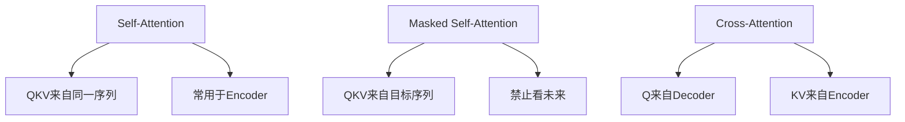

### 举例

机器翻译中：

1. Encoder 读完整源句子，用 self-attention 得到源句表示。
2. Decoder 生成目标句时，用 masked self-attention 看已经生成的目标词。
3. Decoder 再用 cross-attention 查询 Encoder 的源句表示。

### 速记

```text
Self：自己看自己
Masked Self：自己看过去的自己
Cross：目标端拿Q去查源端KV
```

---

## Q6. Attention Mask 有哪些类型？分别解决什么问题？

### 面试官想考什么

Mask 是 Transformer 正确性关键点，尤其 Decoder-only LLM 必问。

### 标准回答

常见 Attention Mask 有两类：

1. **Padding Mask**：屏蔽 padding token，避免模型关注无意义填充。
2. **Causal Mask**：屏蔽未来 token，保证自回归生成时不能偷看答案。

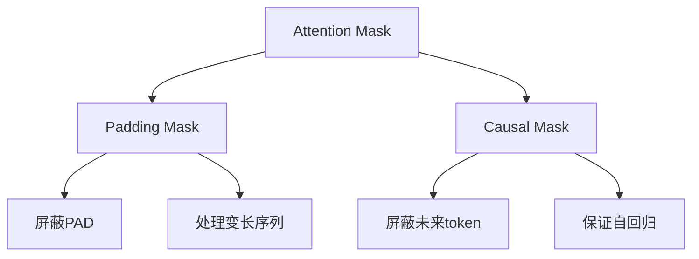

### 底层实现

Mask 通常是在 softmax 前加到 attention score 上：

```text
允许位置：加 0
禁止位置：加 -inf 或很大的负数
```

然后 softmax 后，禁止位置的权重接近 0。

### Causal Mask 示例

```text
第1个位置：只能看1
第2个位置：能看1和2
第3个位置：能看1和2和3
第4个位置：能看1和2和3和4
```

### 常见追问

问：训练 Decoder-only LLM 时，为什么可以把完整句子输入模型？  
答：因为 causal mask 会阻止每个位置看到未来 token，所以虽然完整序列并行输入，信息流仍然符合自回归约束。

---

## Q7. Multi-Head Attention 为什么有效？是不是头越多越好？

### 面试官想考什么

考你是否理解多头的意义以及资源约束。

### 标准回答

Multi-Head Attention 让模型在多个子空间中并行学习不同关系。不同头可以关注语法关系、语义关系、位置关系、指代关系等。最后把各头结果拼接并通过输出投影融合。

但头不是越多越好。总 `d_model` 固定时，头越多，每个头的 `head_dim` 越小，单头表达能力可能下降，同时也会带来调度和显存开销。

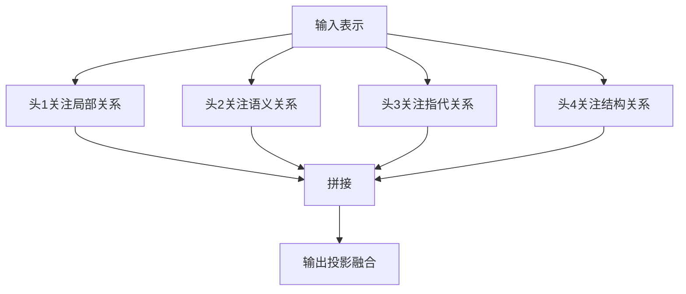

### 形状说明

```text
d_model = num_heads × head_dim
```

例如：

```text
d_model = 4096
num_heads = 32
head_dim = 128
```

注意力权重形状：

```text
[B, num_heads, T, T]
```

### 追问回答

问：多头是不是简单 ensemble？  
答：不完全是。多个头共享同一层输入，但有不同投影矩阵，关注不同子空间；拼接后还会经过输出投影融合，因此是同一模块内部的多视角表示学习。

---

## Q8. Transformer 为什么需要位置编码？常见位置编码有哪些？

### 面试官想考什么

考你是否知道 Self-Attention 本身不具备顺序感。

### 标准回答

Self-Attention 对输入 token 的排列本身没有天然顺序感。如果不加入位置信息，模型难以区分“猫追老鼠”和“老鼠追猫”。因此需要位置编码告诉模型 token 的顺序或相对距离。

常见位置机制包括：

- Sinusoidal Position Encoding
- Learned Position Embedding
- Relative Position Bias
- RoPE
- ALiBi

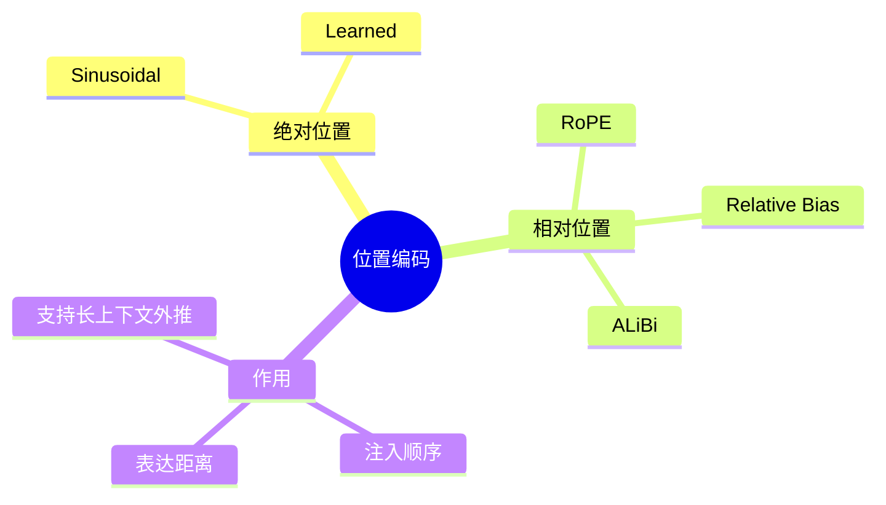

### 深入展开

原始 Transformer 使用正弦位置编码，把不同频率的 sin 和 cos 加到 token embedding 上。现代 LLM 常用 RoPE，它通过旋转 Q 和 K，使注意力分数自然包含相对位置信息。

### 追问回答

问：RoPE 为什么常用于 LLM？  
答：RoPE 把位置信息注入 Q、K 的旋转中，使 `QK` 点积对相对距离敏感，适合自回归注意力，也常被用于长上下文扩展方案。

### 速记

```text
Embedding告诉模型token是谁，Position告诉模型token在哪儿。
```

---

## Q9. Encoder-only、Decoder-only、Encoder-Decoder 有什么区别？

### 面试官想考什么

这是模型家族分类高频题。要能对应 BERT、GPT、T5。

### 标准回答

- **Encoder-only**：双向注意力，适合理解任务，例如分类、检索、抽取。代表是 BERT。
- **Decoder-only**：使用 causal mask，只能看过去，适合自回归生成。代表是 GPT、LLaMA 类模型。
- **Encoder-Decoder**：Encoder 双向编码输入，Decoder 自回归生成输出，适合翻译、摘要、条件生成。代表是原始 Transformer、T5。

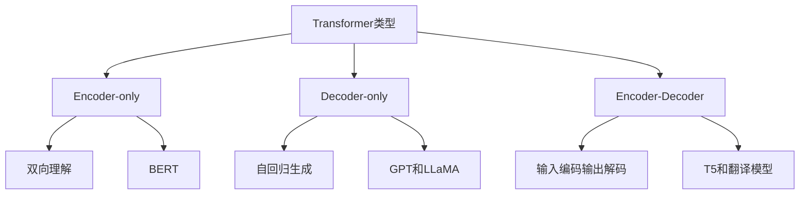

### 对比表

| 类型 | 可见范围 | 训练目标常见形式 | 适合任务 |
| --- | --- | --- | --- |
| Encoder-only | 双向 | Masked Language Modeling | 文本理解 |
| Decoder-only | 只能看过去 | Next Token Prediction | 文本生成 |
| Encoder-Decoder | Encoder 双向，Decoder 因果 | Seq2Seq | 翻译、摘要 |

### 常见追问

问：为什么 GPT 适合生成？  
答：因为 GPT 类 Decoder-only 模型训练目标就是根据历史 token 预测下一个 token，和推理时逐 token 生成的形式一致。

---

## Q10. Transformer 中 FFN 的作用是什么？为什么 Attention 后还要 FFN？

### 面试官想考什么

很多人只会讲 Attention，却忽略 FFN。面试官会看你是否理解 Block 的完整性。

### 标准回答

Attention 负责不同 token 之间的信息交互，FFN 负责对每个 token 位置的表示进行非线性变换和特征加工。没有 FFN，模型主要是线性加权组合，表达能力会受限。

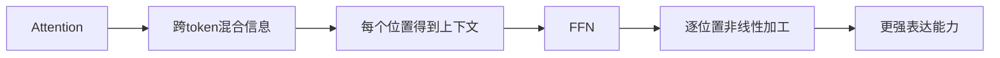

### 深入展开

原始 Transformer 的 FFN 是两层线性层加激活函数：

$$
FFN(x)=max(0,xW_1+b_1)W_2+b_2
$$

现代 LLM 常见变体包括 GELU、SwiGLU 等。FFN 通常会先升维再降维，例如 `d_ff` 可能是 `4 × d_model` 左右，因此 FFN 往往占据大量参数。

### 速记

```text
Attention负责交流，FFN负责思考。
```

---

## Q11. 残差连接和 LayerNorm 在 Transformer 中分别有什么作用？

### 面试官想考什么

考训练稳定性。越是大模型相关岗位，越容易问 Pre-LN、Post-LN、RMSNorm。

### 标准回答

残差连接让输入直接加到子层输出上，保留原始信息并提供更短的梯度通路，使深层网络更容易训练。LayerNorm 对每个 token 的隐藏维度做归一化，稳定激活分布，减少训练不稳定。

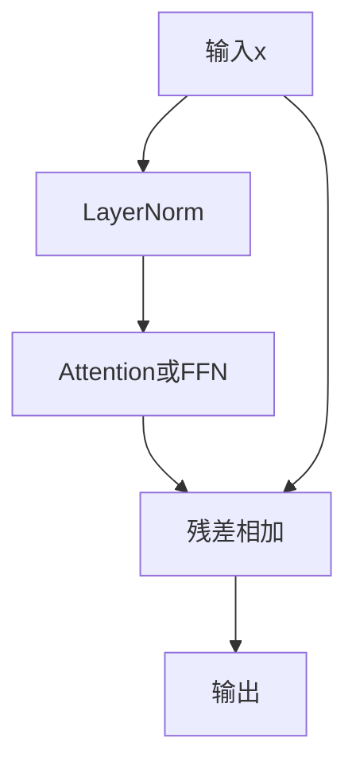

### Pre-LN 与 Post-LN

```text
Post-LN：x -> Sublayer -> Add -> LayerNorm
Pre-LN： x -> LayerNorm -> Sublayer -> Add
```

现代 LLM 常用 Pre-LN 或 RMSNorm 变体，因为深层训练更稳定。

### 追问回答

问：LayerNorm 和 BatchNorm 有什么区别？  
答：BatchNorm 通常跨 batch 统计，受 batch size 影响较大；LayerNorm 是对单个样本、单个 token 的隐藏维度归一化，更适合变长序列和自回归模型。

### 速记

```text
Residual保信息和梯度，Norm稳尺度和训练。
```

---

## Q12. Decoder-only LLM 的训练目标是什么？为什么训练可以并行？

### 面试官想考什么

考自监督、自回归、teacher forcing、causal mask 的统一理解。

### 标准回答

Decoder-only LLM 通常使用 next token prediction 训练：给定前面的 token，预测下一个 token。训练时完整序列已知，可以把整段文本一次性输入模型，并用 causal mask 保证每个位置只能看到过去和当前位置，因此所有位置的 loss 可以并行计算。

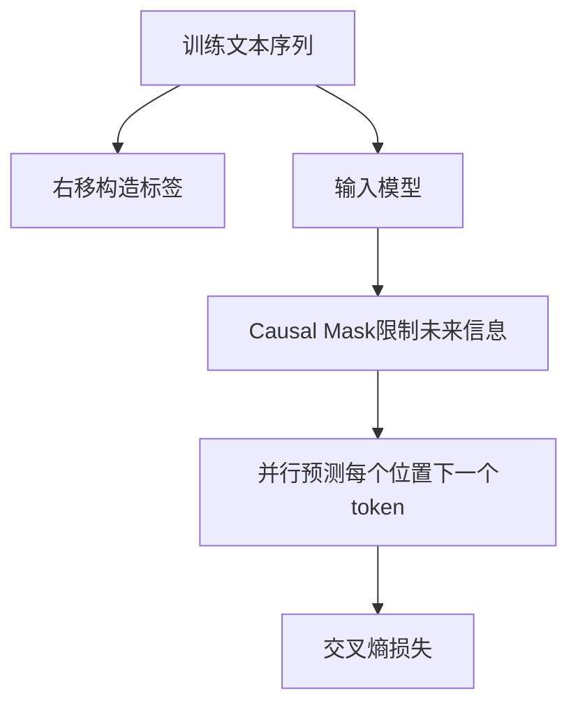

### 举例

文本：

```text
我 喜欢 机器 学习
```

训练目标：

```text
看到 我          预测 喜欢
看到 我 喜欢     预测 机器
看到 我 喜欢 机器 预测 学习
```

### 追问回答

问：训练时并行和推理时自回归矛盾吗？  
答：不矛盾。训练时答案已经存在，用 mask 防止偷看未来；推理时未来 token 尚未生成，所以必须一个 token 一个 token 生成。

---

## Q13. Transformer 推理时为什么需要 KV Cache？它节省了什么，消耗了什么？

### 面试官想考什么

考 LLM 工程推理性能。KV Cache 是非常高频的工程题。

### 标准回答

自回归生成时，每生成一个新 token 都需要关注历史 token。历史 token 的 K 和 V 在模型参数固定时不会变化，因此可以缓存起来。KV Cache 避免每一步重复计算历史 token 的 K/V，从而加速推理。但它会消耗显存，并且显存占用随层数、上下文长度、batch size、head 数和 head_dim 增长。

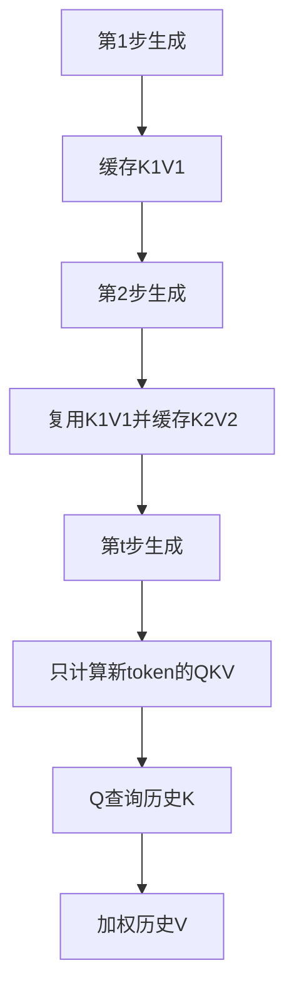

### 形状直觉

KV Cache 大小大致正比于：

```text
layers × batch_size × sequence_length × kv_heads × head_dim × 2
```

其中 `2` 表示 K 和 V 两份缓存。

### 追问回答

问：KV Cache 会降低注意力的理论复杂度吗？  
答：对单步增量推理，它避免重复计算历史 token 的投影和历史之间的注意力；但新 token 仍要关注已有上下文，所以每步仍与当前上下文长度相关。它主要减少重复计算，用显存换速度。

---

## Q14. Transformer 的时间复杂度和空间复杂度主要来自哪里？

### 面试官想考什么

考你是否理解长上下文为什么贵，以及瓶颈不只是参数量。

### 标准回答

标准全注意力的主要成本来自注意力矩阵。序列长度为 `T` 时，每个 query 要和所有 key 计算相似度，因此注意力矩阵是 `T × T`，时间和显存都与 `T²` 强相关。FFN 的成本通常与 `T × d_model × d_ff` 相关。

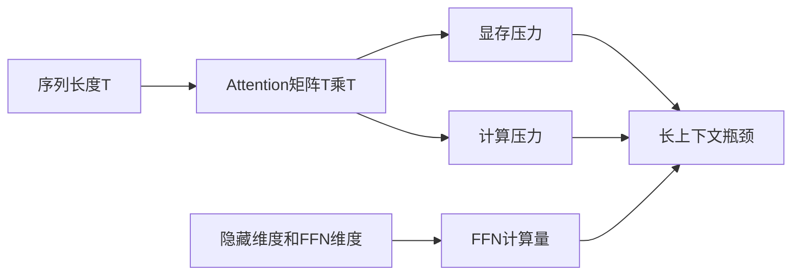

### 更细一点

Self-Attention 主要计算：

```text
QK^T: O(T² × d_head × heads)
Attention V: O(T² × d_head × heads)
```

FFN 主要计算：

```text
O(T × d_model × d_ff)
```

训练时还要保存激活用于反向传播，因此显存压力更大。推理时如果使用 KV Cache，注意力矩阵的训练式中间激活少了，但缓存显存会随上下文长度增长。

### 速记

```text
参数量看模型宽度和层数，长上下文瓶颈看T平方和KV Cache。
```

---

## Q15. FlashAttention 解决了什么问题？它是否改变 Attention 公式？

### 面试官想考什么

考你是否知道主流注意力优化的本质，不要把它误解成新模型结构。

### 标准回答

FlashAttention 主要通过分块计算和 IO 优化减少显存读写，避免显式存储完整的巨大注意力矩阵，从而加速并降低显存占用。它不改变标准 Attention 的数学结果，目标是在数值等价或近似等价的前提下更高效地计算。

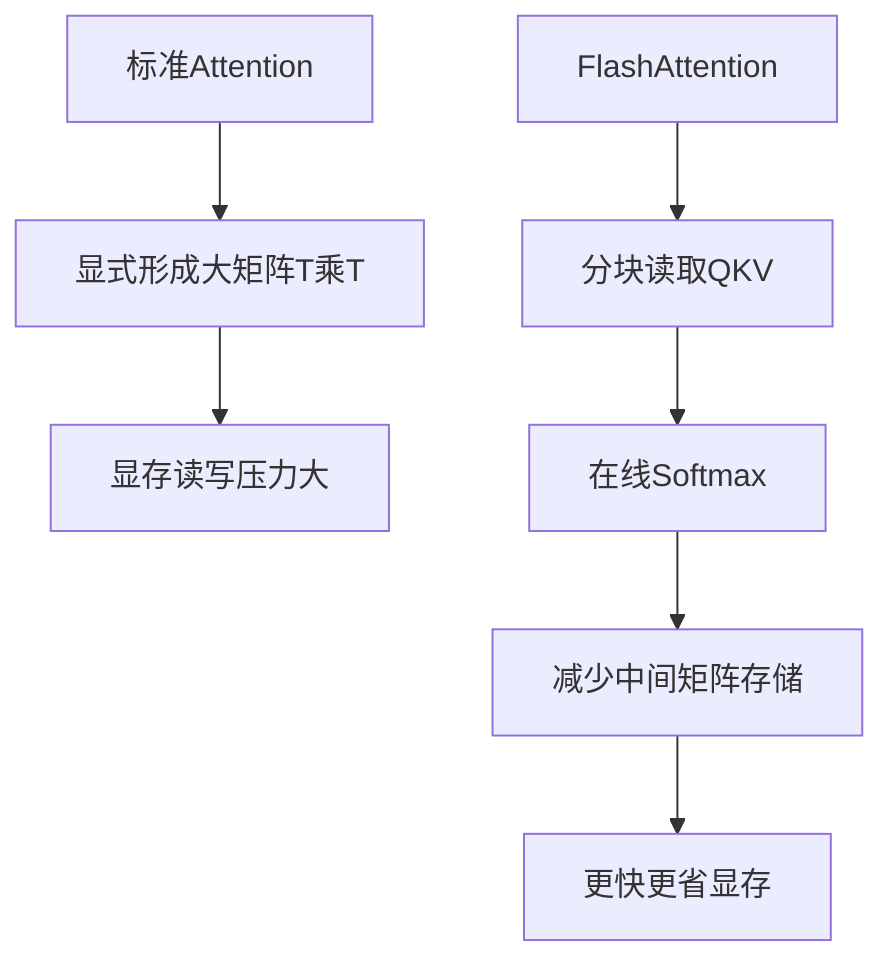

### 深入展开

GPU 计算不仅受 FLOPs 影响，也受显存带宽和读写次数影响。FlashAttention 的核心优势是减少高带宽内存访问，把更多计算留在更快的片上存储中完成。

### 追问回答

问：FlashAttention 能把 `O(T²)` 变成 `O(T)` 吗？  
答：不能从数学上的全局注意力计算量完全消除二次关系。它主要优化内存占用和实际运行效率，而不是把全注意力的依赖关系改成线性。

---

## Q16. MHA、MQA、GQA 有什么区别？为什么大模型推理常用 GQA？

### 面试官想考什么

考 LLM 推理优化，尤其 KV Cache 压缩。

### 标准回答

- **MHA**：Multi-Head Attention，每个 Query head 都有对应的 K/V head。
- **MQA**：Multi-Query Attention，多个 Query head 共享一组 K/V head。
- **GQA**：Grouped-Query Attention，把 Query heads 分成若干组，每组共享 K/V head，是 MHA 和 MQA 的折中。

GQA 常用于大模型推理，因为它能显著减少 KV Cache 大小，同时通常比 MQA 保留更好的表达能力。

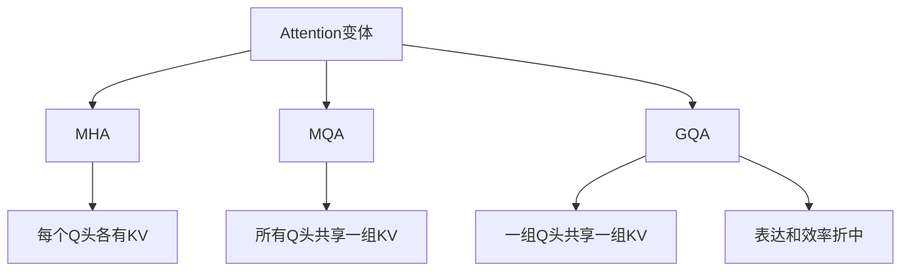

### 记忆图

```text
MHA：Q多，K/V也多，效果强但缓存大
MQA：Q多，K/V一组，缓存小但压缩强
GQA：Q多，K/V分组，常见折中方案
```

### 追问回答

问：GQA 主要减少哪部分显存？  
答：主要减少推理时 KV Cache 的 K/V head 数量。因为缓存大小与 `kv_heads × head_dim × sequence_length × layers` 成正比。

---

## Q17. Attention 权重能不能解释模型为什么这么回答？

### 面试官想考什么

考你是否能区分“可视化线索”和“因果解释”。

### 标准回答

Attention 权重可以提供一定的可视化线索，显示某层某头中某个 token 对其他 token 的关注分布。但它不能被简单等同为模型最终决策的完整解释。因为 Transformer 有多层、多头、残差连接、FFN 和输出投影，信息会被多次变换和混合。

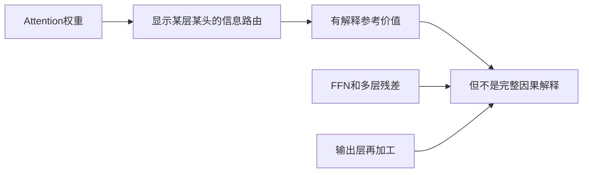

### 深入展开

一个 token 在某一层对另一个 token 权重高，只能说明这一层这一头的信息聚合中它占比较大。最终 logits 还受到后续层、其他头、FFN、残差路径的影响。

### 追问回答

问：那 Attention 可视化有没有用？  
答：有用。它可以帮助分析模型是否关注了合理位置、是否被提示词某部分强烈影响、是否存在模式偏差。但严谨解释还需要结合梯度、消融实验、表示分析等方法。

---

## Q18. 面试中如何推导一遍 Multi-Head Attention 的张量形状？

### 面试官想考什么

考基本功。能推 shape 往往说明你真的写过或读过实现。

### 标准回答

假设：

```text
B = batch size
T = sequence length
d_model = hidden size
H = num_heads
D = head_dim = d_model / H
```

输入：

```text
X: [B, T, d_model]
```

线性投影：

```text
Q, K, V: [B, T, d_model]
```

拆头：

```text
Q, K, V: [B, H, T, D]
```

计算注意力分数：

```text
scores = Q @ K.transpose(-1, -2)
scores: [B, H, T, T]
```

加权求和：

```text
context = weights @ V
context: [B, H, T, D]
```

合并 heads：

```text
context: [B, T, d_model]
```

输出投影：

```text
output: [B, T, d_model]
```

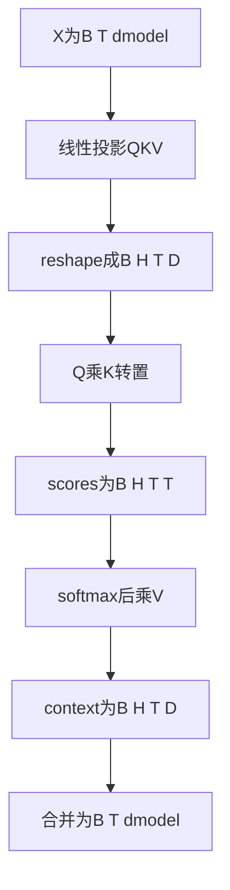

### 常见坑

- softmax 是在最后一个维度做，也就是对 key 维度归一化。
- `K` 转置的是最后两个维度，不是 batch 或 head 维度。
- mask 需要能 broadcast 到 `[B, H, T, T]`。

---

## Q19. Transformer 有哪些局限？如何缓解？

### 面试官想考什么

考你是否能客观评价模型，不只讲优点。

### 标准回答

Transformer 的主要局限包括：

1. 标准全注意力长序列成本高。
2. 需要大量数据和算力。
3. 对位置外推和超长上下文可能不稳定。
4. 语言模型可能产生幻觉。
5. 对训练数据偏差和提示词分布敏感。
6. 本身没有可靠事实校验机制。

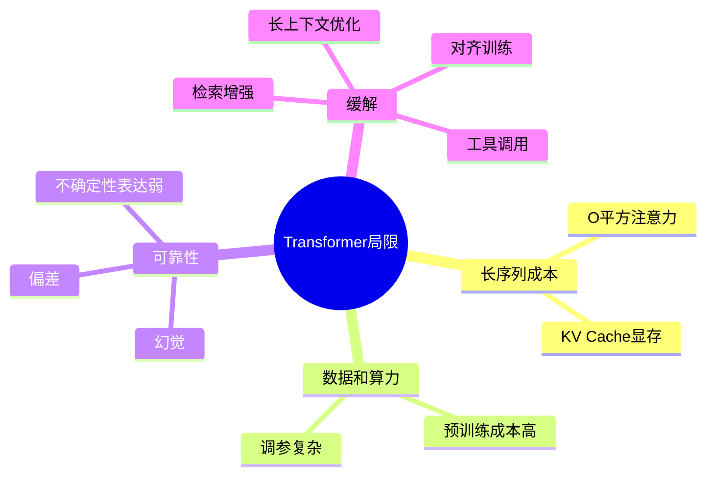

### 缓解方式

| 局限 | 缓解方法 |
| --- | --- |
| 长序列成本高 | FlashAttention、稀疏注意力、滑动窗口、GQA、MQA |
| 知识不实时 | RAG、工具调用、外部数据库 |
| 幻觉 | 检索增强、引用约束、验证器、拒答机制 |
| 推理成本高 | 量化、蒸馏、剪枝、缓存、批处理 |
| 位置外推困难 | RoPE scaling、长上下文继续训练、相对位置方法 |

### 追问回答

问：RAG 能不能彻底解决幻觉？  
答：不能。RAG 可以给模型提供外部证据，降低知识缺失导致的幻觉，但检索错误、证据冲突、模型误读证据仍可能导致错误输出。

---

## Q20. 如果让你从零描述一个 Decoder-only Transformer 的前向流程，你怎么讲？

### 面试官想考什么

这是综合题，考你能不能把所有模块串起来。

### 标准回答

我会按数据流描述：

1. 文本经过 tokenizer 变成 token ids。
2. token ids 通过 embedding 矩阵变成向量。
3. 注入位置信息，例如 RoPE 或位置 embedding。
4. 进入多层 Decoder Block。
5. 每个 Block 先做 masked multi-head self-attention，让每个位置只能聚合过去上下文。
6. 再经过 FFN 做逐位置非线性加工。
7. 每个子层配合残差连接和归一化保证训练稳定。
8. 最后一层 hidden state 经过输出投影得到 vocab logits。
9. 训练时用交叉熵预测下一个 token。
10. 推理时根据 logits 采样 token，并使用 KV Cache 加速后续生成。

```mermaid
flowchart TD
  A[文本Prompt] --> B[Tokenizer]
  B --> C[Token IDs]
  C --> D[Embedding]
  D --> E[位置编码]
  E --> F[Decoder Block堆叠]
  F --> G[Masked Self-Attention]
  G --> H[FFN]
  H --> I[Final Norm]
  I --> J[Linear到词表]
  J --> K[Logits]
  K --> L[采样下一个token]
  L --> M[追加上下文继续生成]
```

### 面试版 60 秒回答

Transformer Decoder-only 模型先把文本 token 化，再查 embedding 得到向量并加入位置信息。每层 Decoder Block 用 causal self-attention 让当前位置从历史上下文中取信息，再用 FFN 做非线性加工，残差和归一化保证深层训练稳定。多层堆叠后，最后的 hidden state 投影到词表得到 logits。训练时用 next token prediction 和交叉熵；推理时自回归逐 token 生成，并用 KV Cache 复用历史 K/V 降低重复计算。

### 速记

```text
文本 → token → embedding → position → 多层decoder → logits → next token
```

---

## 面试快速复盘表

| 问题 | 核心关键词 | 最短答案 |
| --- | --- | --- |
| Transformer 是什么 | Attention + FFN + Residual + Norm | 并行建模序列关系的架构 |
| 为什么不用 RNN | 并行和长依赖 | RNN 顺序瓶颈强 |
| QKV 是什么 | 查询、索引、内容 | 用 QK 算权重，用权重取 V |
| 为什么缩放 | softmax 稳定 | 除以点积标准差量级 |
| Mask 有什么用 | 可见性控制 | 屏蔽 PAD 或未来 token |
| 多头为什么有效 | 多子空间关系 | 多视角看序列 |
| 位置编码为何需要 | Attention 无序 | 注入顺序或距离 |
| Encoder vs Decoder | 双向 vs 因果 | 理解 vs 生成 |
| FFN 干什么 | 非线性加工 | Attention 后逐位置思考 |
| 残差和 Norm | 训练稳定 | 保梯度、稳分布 |
| 训练目标 | 下一个 token | 自监督交叉熵 |
| KV Cache | 推理加速 | 省重复算历史 K/V |
| 复杂度 | T 平方 | 注意力矩阵贵 |
| FlashAttention | IO 优化 | 不改变公式，减少显存读写 |
| GQA | KV 缓存优化 | MHA 和 MQA 折中 |

---

## 最终记忆图

```mermaid
mindmap
  root((Transformer面试总口诀))
    输入
      Tokenizer
      Embedding
      Position
    注意力
      Q找K
      权重取V
      Mask控视野
      多头看多关系
    模块
      FFN加工
      Residual保通路
      Norm稳训练
    类型
      Encoder理解
      Decoder生成
      EncoderDecoder转换
    工程
      训练可并行
      推理自回归
      KVCache换速度
      长上下文成本高
```

## 结束自测

闭卷回答下面 5 个问题，如果能流畅说出来，Transformer 面试主线基本稳了：

1. `QK^T` 为什么是注意力分数？为什么还要除以 `sqrt(d_k)`？
2. Decoder-only 训练时为什么能并行，但推理时必须自回归？
3. KV Cache 具体缓存什么？为什么它会吃显存？
4. Encoder-only、Decoder-only、Encoder-Decoder 的注意力可见范围分别是什么？
5. 标准 Attention 为什么长上下文成本高？FlashAttention 到底优化了什么？
