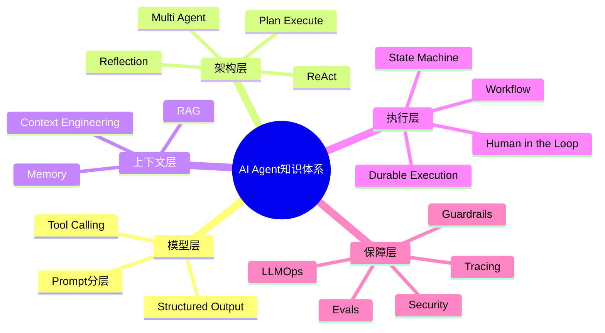
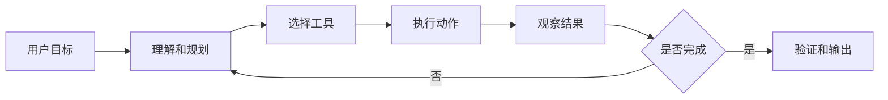
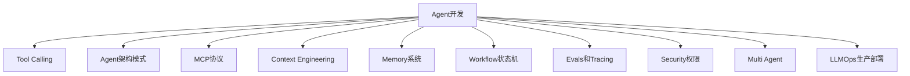
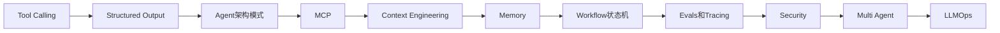
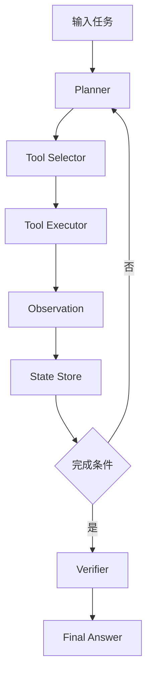

# 00. Agent 学习路线与知识地图

## 学习目标

读完本章，你应该能回答三个问题：

1. AI Agent 和普通 LLM 应用有什么区别？
2. 开发可靠 Agent 需要掌握哪些模块？
3. 学习顺序应该如何安排，避免只会写 prompt 而不会做系统？

## 一句话总纲

AI Agent 不是一个“更长的 Prompt”。它是一个由 **LLM、工具、状态、记忆、权限、评估、监控和工作流** 组成的系统，用来把用户目标拆解为可执行步骤，并在执行中观察、调整、验证和收敛。

> 记忆口诀：**LLM 负责判断，工具负责行动，状态负责连续性，权限负责边界，评估负责可信。**

## 思维导图



## 1. 什么是 AI Agent？

一个实用定义：

```text
AI Agent = LLM + 目标 + 上下文 + 工具 + 状态 + 反馈循环 + 安全边界
```

普通 LLM 调用通常是：输入问题，输出答案。

Agent 则会：

1. 理解目标。
2. 判断需要哪些信息。
3. 选择工具或检索资料。
4. 执行动作。
5. 观察结果。
6. 根据结果继续计划或修正。
7. 在满足停止条件后输出答案或完成任务。



## 2. Agent 与普通 LLM 应用的区别

| 维度 | 普通 LLM 应用 | AI Agent |
| --- | --- | --- |
| 输入输出 | 单轮或简单多轮问答 | 多步任务执行 |
| 工具使用 | 可选，通常固定 | 核心能力，需要选择和调度 |
| 状态 | 主要依赖聊天历史 | 需要显式任务状态和检查点 |
| 失败处理 | 失败就返回错误 | 重试、改写、换工具、请求人类审批 |
| 安全边界 | Prompt 约束为主 | 权限、沙箱、审批、审计共同约束 |
| 评估 | 看答案质量 | 看任务完成率、工具轨迹、成本和风险 |

## 3. 需要掌握的 10 个模块



### 模块 1：Tool Calling 与 Structured Output

这是 Agent 的“手”。模型必须能稳定地产生结构化参数，让系统调用真实函数或 API。

你要掌握：

- JSON Schema。
- 参数校验。
- 工具描述设计。
- 工具结果回传。
- 工具失败重试。
- 结构化输出和普通 JSON mode 的区别。

### 模块 2：Agent 架构模式

这是 Agent 的“脑内流程”。

你要掌握：

- ReAct：推理和行动交替。
- Plan and Execute：先计划，再执行。
- Reflection：失败后反思和改进。
- Supervisor：主管分派子 Agent。
- Router：按任务路由专家。

### 模块 3：MCP 协议

MCP 是连接模型应用和外部工具或上下文的标准化协议。

你要掌握：

- Host、Client、Server。
- Tools、Resources、Prompts。
- Roots、Sampling、Elicitation。
- JSON-RPC、能力协商、权限边界。

### 模块 4：Context Engineering

上下文不是把所有东西塞给模型，而是选择、压缩、排序和隔离。

你要掌握：

- system、developer、user、tool message 分层。
- 上下文窗口预算。
- 检索证据排序。
- 历史压缩。
- 防 prompt injection 的上下文隔离。

### 模块 5：Memory 系统

记忆让 Agent 不只依赖当前上下文窗口。

你要掌握：

- 短期记忆。
- 长期记忆。
- 语义记忆。
- 情景记忆。
- 用户偏好记忆。
- 记忆写入准则和遗忘机制。

### 模块 6：Workflow、状态机与 Human in the Loop

真实 Agent 需要暂停、恢复、审批、重试和回滚。

你要掌握：

- 有限状态机。
- durable execution。
- checkpoint。
- 队列和重试。
- 幂等性。
- 人类审批节点。

### 模块 7：Agent Evals 与 Observability

没有评估和追踪，就无法判断 Agent 是否真的可靠。

你要掌握：

- 任务成功率。
- 工具调用准确率。
- 轨迹评估。
- LLM-as-judge。
- 回归测试集。
- tracing、日志、成本和延迟监控。

### 模块 8：Agent 安全与权限

Agent 能行动，所以风险比普通聊天更大。

你要掌握：

- prompt injection。
- tool injection。
- 权限最小化。
- secrets 防泄露。
- 沙箱执行。
- 审批和审计。

### 模块 9：多 Agent 协作

多 Agent 不是越多越好，而是为了解耦角色、并行任务和隔离权限。

你要掌握：

- Router。
- Supervisor。
- Debate。
- Critic。
- Planner 和 Executor 分离。
- 上下文共享边界。

### 模块 10：LLMOps 与生产部署

Agent 要上生产，就必须考虑成本、延迟、可靠性和版本治理。

你要掌握：

- 模型路由。
- 缓存。
- 限流。
- 灰度发布。
- 回滚。
- 成本监控。
- SLA 和降级策略。

## 4. 推荐学习顺序



学习原则：

1. 先学工具调用，因为 Agent 不会行动就不是 Agent。
2. 再学结构化输出，因为系统不能依赖不稳定自然语言解析。
3. 再学架构模式，因为不同任务需要不同循环。
4. 再学 MCP，因为真实工具生态需要标准化协议。
5. 最后学评估、安全和运维，因为它们决定能否上线。

## 5. 最小可用 Agent 架构



最小可用不等于生产可用。生产级还需要：

- 工具权限。
- 失败重试。
- 速率限制。
- trace 日志。
- 人类审批。
- 回归测试。
- 成本预算。

## 6. 学习自检

1. Agent 和普通聊天机器人的本质区别是什么？
2. 为什么 Tool Calling 必须配合参数校验？
3. ReAct 和 Plan-Execute 的区别是什么？
4. MCP 中 Tools、Resources、Prompts 分别由谁控制？
5. 为什么上下文工程不是简单扩展 context window？
6. 记忆写入为什么需要准则？
7. durable execution 解决什么问题？
8. 如何评估一个 Agent 是否可靠？
9. 为什么权限过滤不能交给模型自己判断？
10. 多 Agent 什么时候有必要，什么时候只是增加复杂度？

## 参考

- OpenAI Agents SDK: https://platform.openai.com/docs/guides/agents-sdk/
- OpenAI Structured Outputs: https://platform.openai.com/docs/guides/structured-outputs
- Model Context Protocol Specification: https://modelcontextprotocol.io/specification/2025-06-18/basic
- LangGraph Durable Execution: https://docs.langchain.com/oss/python/langgraph/durable-execution
- ReAct: https://arxiv.org/abs/2210.03629
- Toolformer: https://arxiv.org/abs/2302.04761
