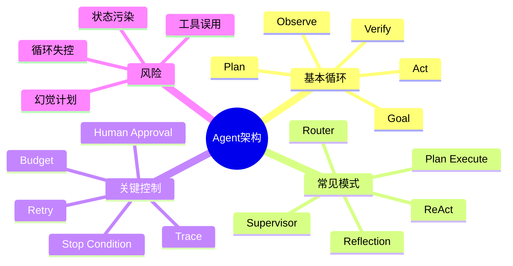
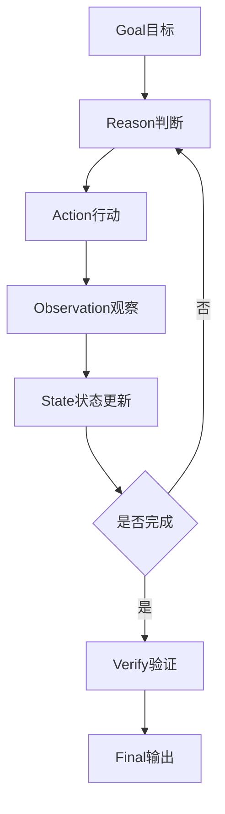
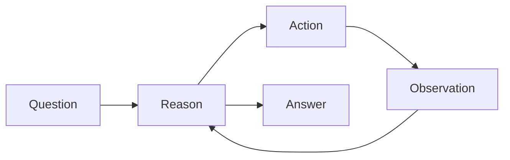
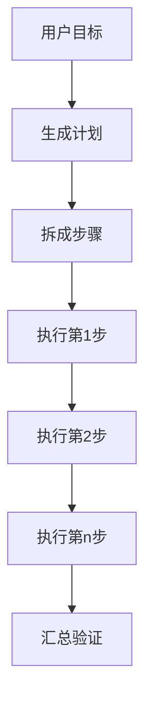
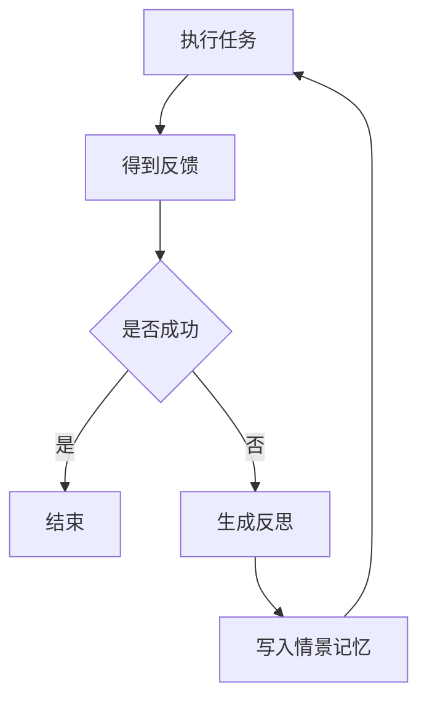
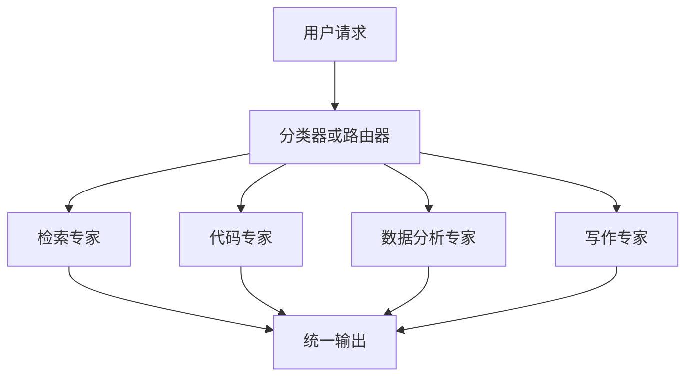
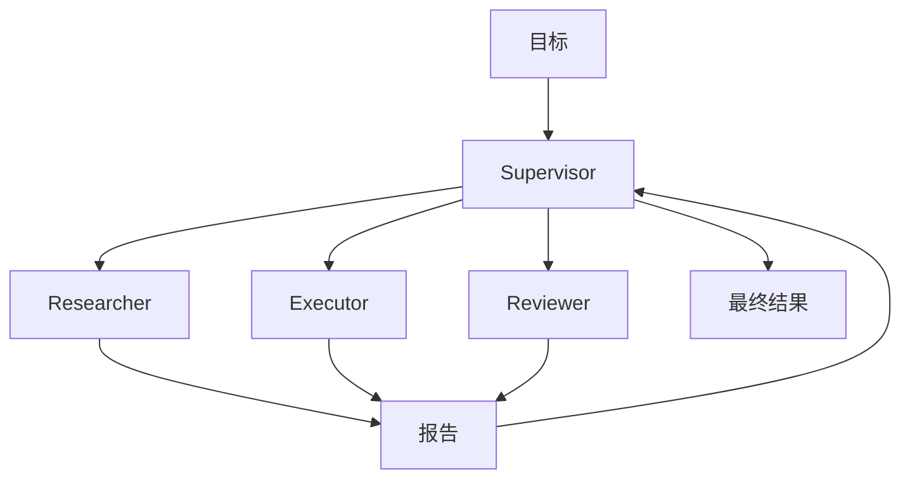
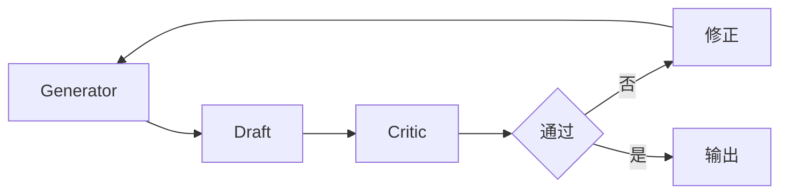
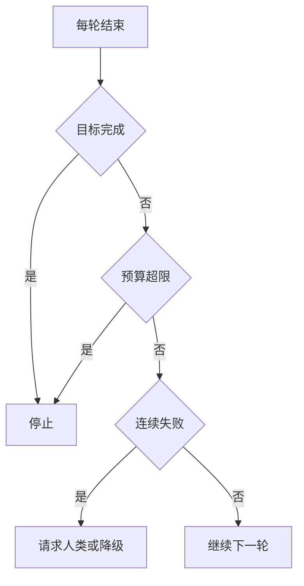

# 01. Agent 基础与架构模式

## 学习目标

读完本章，你应该能回答：

1. AI Agent 的基本循环是什么？
2. ReAct、Plan-Execute、Reflection、Router、Supervisor 分别适合什么场景？
3. 为什么 Agent 不能无限自主循环，必须有停止条件和验证节点？

## 一句话总纲

Agent 架构的核心是 **决策循环**：模型根据目标和状态选择下一步动作，工具执行动作，系统观察结果，再决定继续、修正、请求人类帮助或结束。

> 记忆口诀：**想一步、做一步、看结果、再决定。**

## 思维导图

## 1. Agent 的基本循环

这条循环里，LLM 不直接“完成一切”，而是扮演决策器：

- 根据当前状态决定下一步。
- 给工具生成结构化参数。
- 解释工具结果。
- 修正计划。
- 判断何时停止。

## 2. ReAct：推理和行动交替

ReAct 来自论文 *ReAct: Synergizing Reasoning and Acting in Language Models*。它的核心思想是让模型交替产生 reasoning traces 和 actions，让推理帮助选择行动，让行动从外部环境获得新信息。

### 适合场景

- 开放式问答需要查资料。
- 工具调用步骤不确定。
- 需要根据观察结果动态调整。
- 交互环境任务，例如网页、代码、数据库查询。

### 优点

- 可解释性较好。
- 能处理工具返回的异常。
- 不要求一次性计划完全正确。

### 风险

- 容易循环过长。
- reasoning 暴露可能带来安全或隐私问题。
- 如果工具结果不可靠，后续步骤会被带偏。

## 3. Plan and Execute：先计划，再执行

Plan-Execute 先生成整体计划，再逐步执行。

### 适合场景

- 多步骤任务较明确。
- 需要先估算成本或风险。
- 需要人类审批计划。
- 任务可以拆成有序子任务。

### 优点

- 用户可理解整体路径。
- 便于插入审批节点。
- 便于并行化部分子任务。

### 风险

- 初始计划可能错误。
- 环境变化后计划需要重规划。
- 计划过细会浪费 token，过粗会执行不稳。

## 4. Reflection：反思和自我修正

Reflection 的思想是让 Agent 在失败后生成文字化反思，并把反思放入后续尝试的上下文或记忆中。Reflexion 论文强调不更新模型权重，而是用语言反馈和情景记忆改善后续决策。

### 适合场景

- 编程任务。
- 需要多次尝试的推理任务。
- 工具调用容易失败但可从错误中学习的任务。

### 风险

反思不是事实。错误反思会污染后续上下文，所以最好基于明确反馈，例如测试失败、工具错误、用户纠正，而不是模型凭空自评。

## 5. Router：路由到专家

Router 根据任务类型选择不同工具、提示词或子 Agent。

### 适合场景

- 任务类型差异大。
- 不同任务需要不同工具权限。
- 想降低成本，简单任务用小模型，复杂任务用强模型。

## 6. Supervisor：主管调度

Supervisor 由一个主管 Agent 分配任务给多个专家 Agent，收集结果并整合。

### 适合场景

- 任务复杂，需要多个角色。
- 需要分工、审查和整合。
- 子任务之间可以并行。

### 风险

- 成本高。
- 上下文同步复杂。
- 多个 Agent 可能互相重复或冲突。
- 需要明确所有权和停止条件。

## 7. Critic / Verifier：审查者模式

不要让同一个 Agent 同时负责生成和最终判定。可以引入 Critic 或 Verifier 对结果进行检查。

适合：

- 代码生成。
- 数据分析。
- 法务或合规文本。
- 高风险工具调用前审批。

## 8. 停止条件与预算

Agent 必须有明确停止条件，否则会无限循环或过度调用工具。

常见停止条件：

- 达成任务目标。
- 验证通过。
- 达到最大迭代次数。
- 达到成本或时间预算。
- 连续失败次数超限。
- 需要人类输入或审批。

## 9. 架构选择表

| 模式 | 适合 | 不适合 |
| --- | --- | --- |
| ReAct | 动态检索、工具交互 | 高风险无审批操作 |
| Plan-Execute | 明确多步骤任务 | 环境高度不确定任务 |
| Reflection | 可从失败反馈中改进 | 没有可靠反馈的任务 |
| Router | 多任务分类 | 任务边界不清时 |
| Supervisor | 多角色复杂任务 | 简单低成本任务 |
| Critic | 高正确性要求 | 极低延迟场景 |

## 10. 学习自检

1. ReAct 为什么比一次性回答更适合工具任务？
2. Plan-Execute 的主要风险是什么？
3. Reflection 为什么不能只依赖模型自我感觉？
4. Router 和 Supervisor 有什么区别？
5. Agent 的停止条件应该包括哪些？

## 参考

- ReAct: https://arxiv.org/abs/2210.03629
- Reflexion: https://arxiv.org/abs/2303.11366
- OpenAI Agents SDK: https://platform.openai.com/docs/guides/agents-sdk/
