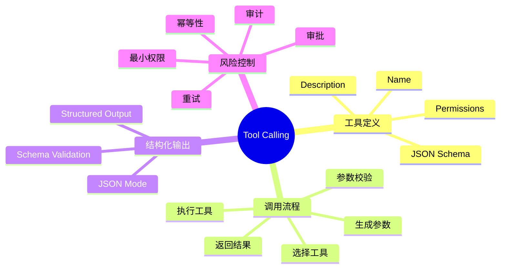
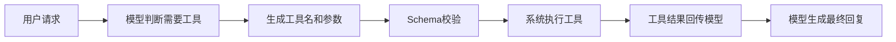
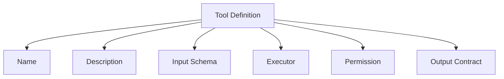
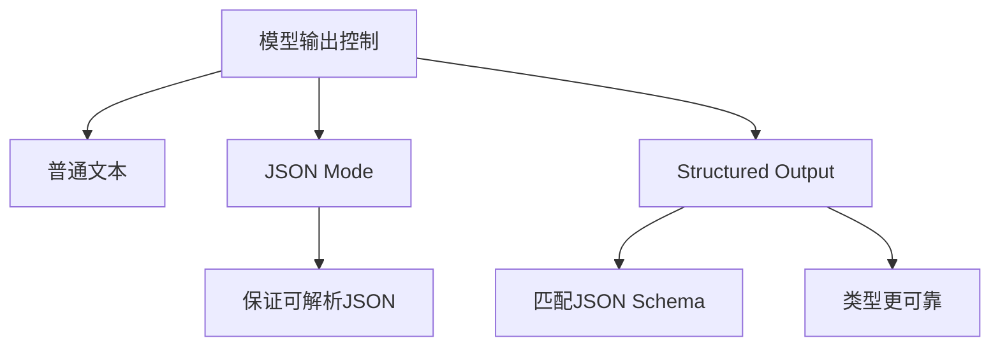
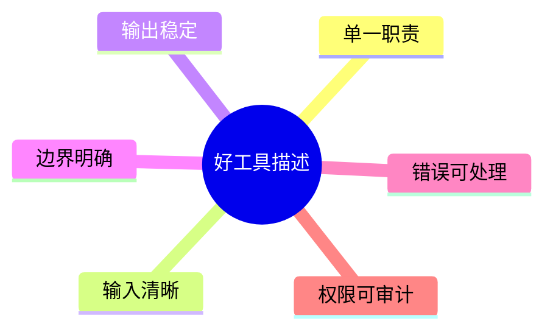
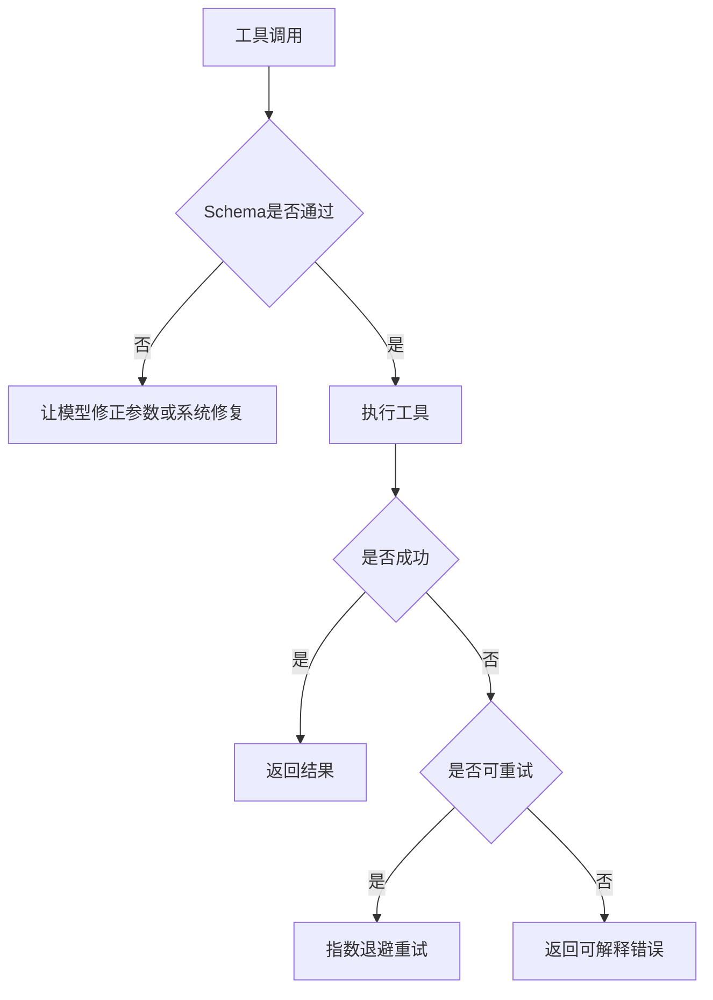
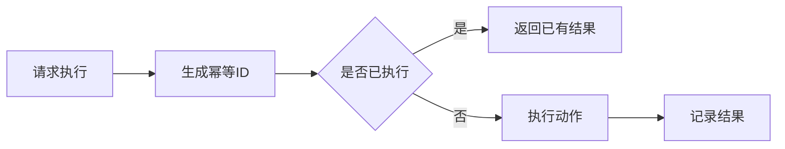
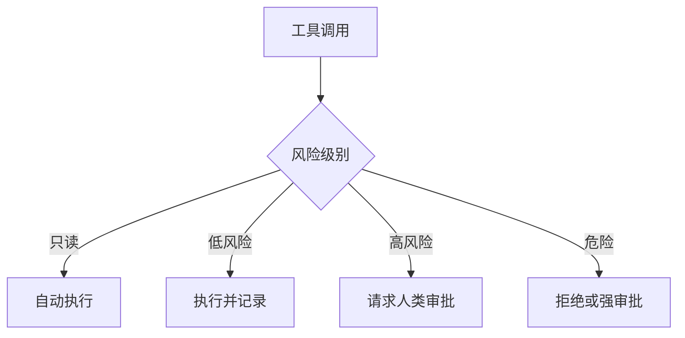

# 02. Tool Calling 与 Structured Output

## 学习目标

读完本章，你应该能回答：

1. Tool Calling 和普通文本输出有什么区别？
2. 为什么 Agent 开发必须重视 JSON Schema、参数校验和工具结果处理？
3. Structured Output、JSON mode、Function Calling 分别解决什么问题？
4. 工具设计如何影响模型是否会正确调用？

## 一句话总纲

Tool Calling 是让模型从“说答案”变成“请求系统执行动作”；Structured Output 是让模型输出可被程序稳定解析的数据结构。两者共同构成 Agent 行动能力的基础。

> 记忆口诀：**自然语言给人看，结构化输出给程序用，工具调用让系统行动。**

## 思维导图



## 1. Tool Calling 的基本流程



模型本身不真的执行工具。它只是生成一个结构化调用请求，实际执行由应用层完成。

## 2. Function Tool 的组成

一个工具至少包含：

| 字段 | 作用 |
| --- | --- |
| name | 工具唯一名称 |
| description | 告诉模型什么时候用这个工具 |
| parameters | JSON Schema，定义输入参数 |
| execute | 应用层真实执行逻辑 |
| permissions | 谁可以调用、是否需要审批 |
| timeout | 防止工具卡死 |
| output schema | 约束工具返回结构 |



## 3. JSON Schema 为什么关键？

没有 schema，模型输出可能是：

```text
帮我查一下北京明天的天气吧，大概需要 location=北京 date=明天
```

有 schema 后，系统期望得到：

```json
{
  "location": "北京",
  "date": "2026-05-04"
}
```

Schema 的作用：

- 限定字段名。
- 限定类型。
- 限定必填项。
- 限定枚举值。
- 便于程序校验和重试。

## 4. Structured Output 与 JSON mode

JSON mode 通常保证输出是合法 JSON，但不保证符合某个具体 schema。Structured Output 的目标是让模型输出匹配开发者提供的 JSON Schema。



### 对比表

| 能力 | 解决问题 | 不解决问题 |
| --- | --- | --- |
| JSON mode | 输出能被 JSON parser 解析 | 不保证字段和类型完全正确 |
| Structured Output | 输出符合 schema | 不保证业务值一定正确 |
| Tool Calling | 让模型请求工具执行 | 不负责工具真实权限和安全 |

## 5. 工具描述怎么写才好？

工具描述不是给人看的 API 文档，而是给模型做选择和填参的决策依据。

好工具描述应该：

- 单一职责。
- 说明何时使用。
- 说明何时不要使用。
- 参数含义清晰。
- 枚举值具体。
- 返回结果可解释。



### 示例

不佳：

```text
search: 搜索东西
```

较好：

```text
search_documents: 在公司知识库中搜索与用户问题相关的文档片段。只用于需要外部资料的问题，不用于数学计算或创建订单。
```

## 6. 工具结果如何回传模型？

工具返回给模型的结果应该：

- 简洁。
- 结构化。
- 包含必要状态。
- 不暴露敏感内部字段。
- 明确错误原因。

```json
{
  "status": "ok",
  "order_id": "A123",
  "shipping_status": "运输中",
  "last_update": "2026-05-03 10:30"
}
```

失败时：

```json
{
  "status": "error",
  "error_code": "ORDER_NOT_FOUND",
  "message": "未找到该订单"
}
```

## 7. 工具调用失败如何处理？



常见失败：

- 参数缺失。
- 参数类型错误。
- 权限不足。
- 外部 API 超时。
- 工具返回空结果。
- 工具执行产生副作用但模型误以为失败。

## 8. 工具的幂等性

对有副作用的工具，必须考虑幂等性。

例如创建订单、发送邮件、转账、删除文件，都不能因为重试而重复执行。

措施：

- 使用 idempotency key。
- 执行前确认。
- 执行后记录 action id。
- 重试前查询状态。



## 9. 工具权限和审批

工具可以分级：

| 级别 | 示例 | 策略 |
| --- | --- | --- |
| 只读 | 搜索文档、查询天气 | 可自动执行 |
| 低风险写入 | 创建草稿、生成文件 | 可执行但记录日志 |
| 高风险写入 | 发邮件、改数据库 | 人类审批 |
| 危险操作 | 删除、付款、外部发布 | 强审批或禁止 |



## 10. Toolformer 的启发

Toolformer 论文提出，模型可以学习何时调用 API、传什么参数、如何利用返回结果。这给 Agent 开发的启发是：工具调用不是外挂按钮，而是模型行为的一部分，需要数据、反馈和评估来优化。

你在工程中要关注：

- 工具是否被正确选择。
- 参数是否正确。
- 工具结果是否被正确使用。
- 不该调用时是否避免调用。

## 11. 学习自检

1. JSON mode 和 Structured Output 有什么区别？
2. 为什么工具参数不能只靠 prompt 约束？
3. 工具 description 应该包含哪些信息？
4. 只读工具和写工具的安全策略有什么不同？
5. 为什么发送邮件工具需要幂等性和审批？

## 参考

- OpenAI Function Calling Help: https://help.openai.com/en/articles/8555517-function-calling-in-the-openai-api
- OpenAI Structured Outputs: https://platform.openai.com/docs/guides/structured-outputs
- OpenAI Structured Outputs Announcement: https://openai.com/index/introducing-structured-outputs-in-the-api/
- Toolformer: https://arxiv.org/abs/2302.04761
