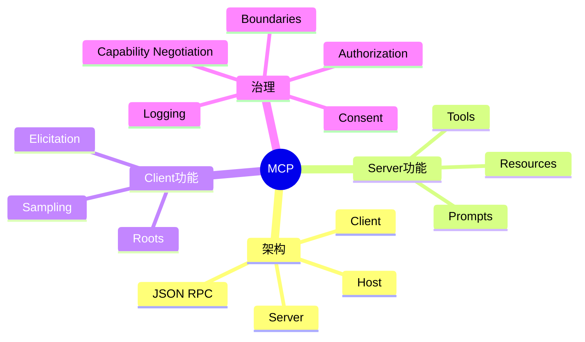
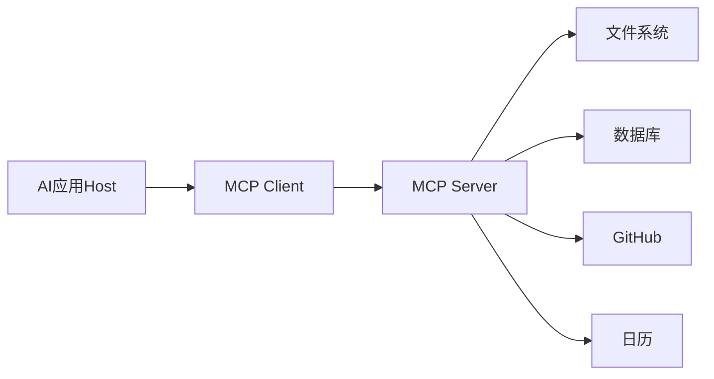
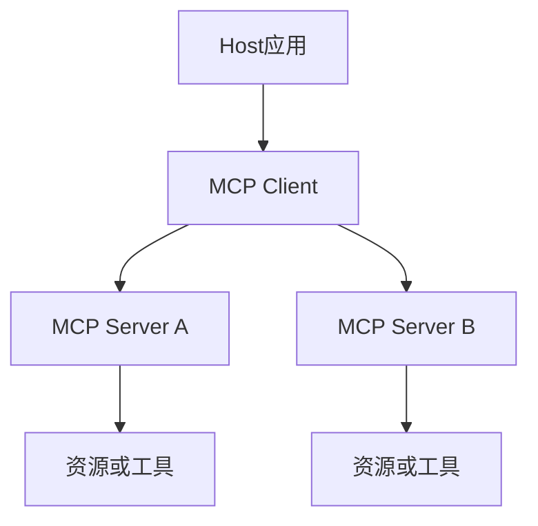
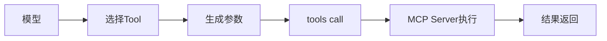
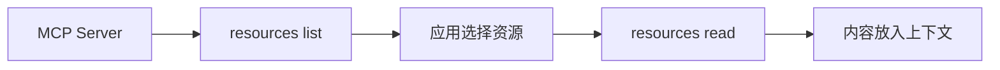
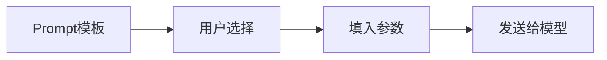
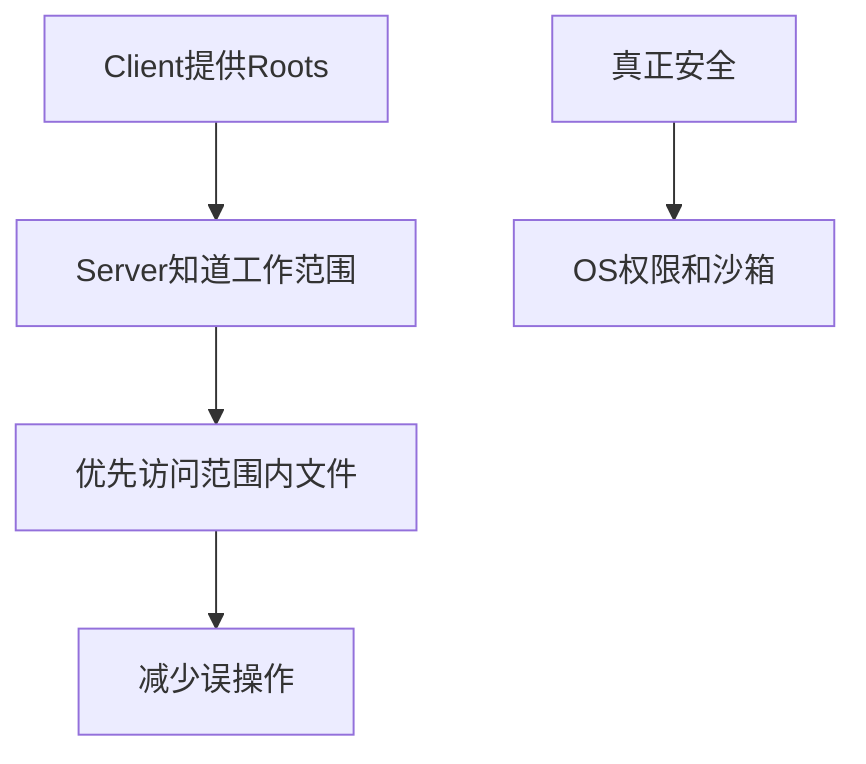
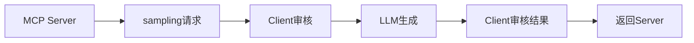
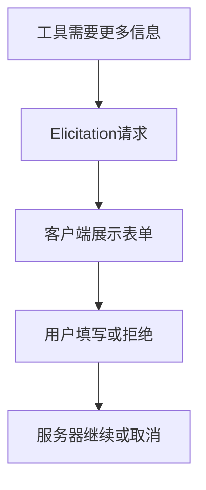
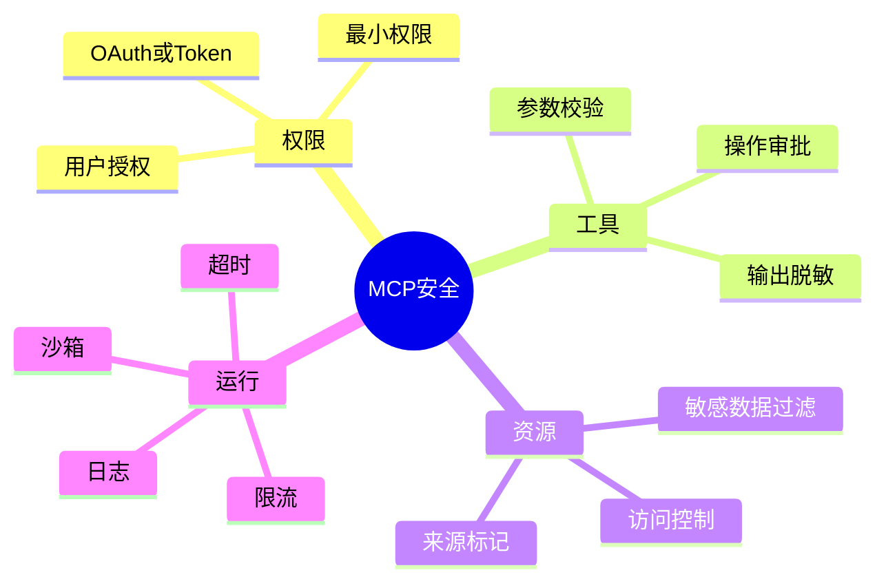

# 03. MCP 协议与工具生态

## 学习目标

读完本章，你应该能回答：

1. MCP 解决什么问题？
2. Host、Client、Server 在 MCP 中分别是什么？
3. Tools、Resources、Prompts、Roots、Sampling、Elicitation 分别有什么作用？
4. MCP 的安全边界在哪里，哪些地方不能误解？

## 一句话总纲

MCP，Model Context Protocol，是一种让 AI 应用以标准方式连接外部工具和上下文的协议。它把工具、资源、提示模板和客户端能力拆开，降低不同 Agent 应用接入外部系统的成本。

> 记忆口诀：**Tools 让模型行动，Resources 给模型资料，Prompts 给用户模板，Roots 告诉服务器范围，Sampling 让服务器请求模型。**

## 思维导图



## 1. MCP 为什么出现？

没有 MCP 时，每个 AI 应用都要为每个外部系统单独写集成：

```text
Claude Desktop -> GitHub集成
IDE Agent -> GitHub集成
内部Agent -> GitHub集成
```

MCP 的思想是：外部系统实现一个 MCP Server，AI 应用通过 MCP Client 与它通信。



## 2. Host、Client、Server

| 角色 | 含义 | 例子 |
| --- | --- | --- |
| Host | 用户直接使用的 AI 应用 | 桌面助手、IDE、Agent 平台 |
| Client | Host 内部的协议客户端 | 管理与服务器连接 |
| Server | 暴露工具和资源的程序 | 文件系统服务器、数据库服务器 |



## 3. Tools：模型可主动调用的动作

Tools 是 MCP Server 暴露给模型的可执行函数。

特点：

- 模型决定何时调用。
- 输入通常用 JSON Schema 描述。
- 可以读，也可以写。
- 可能需要用户批准。



适合：

- 查询数据库。
- 创建日历事件。
- 搜索文件。
- 发送消息。
- 调用业务 API。

## 4. Resources：应用提供给模型的资料

Resources 是被动数据源，通常由应用选择是否放入上下文。

特点：

- 不是模型随意执行的动作。
- 通常是只读上下文。
- 有 URI、MIME type 和内容。
- 可以是固定资源或资源模板。



例子：

- `file:///project/README.md`
- `db://schema/users`
- `docs://api/authentication`

## 5. Prompts：可复用提示模板

Prompts 是服务器提供的提示模板或工作流模板，用户或应用可以选择使用。

适合：

- 总结会议。
- 生成旅行计划。
- 代码审查模板。
- 数据库诊断模板。



## 6. Roots：范围提示，不是硬安全边界

Roots 用来告诉 MCP Server 当前应该关注哪些文件系统目录。

重要理解：Roots 是协调机制，不是强安全边界。真正的安全还要靠操作系统权限、沙箱、容器和应用层授权。



## 7. Sampling：服务器请求客户端调用模型

Sampling 允许 MCP Server 通过 Client 请求 LLM 生成内容。这样服务器不需要自己持有模型 API key，客户端仍可控制模型选择、权限和用户审批。



安全要点：

- 客户端应让用户能查看和拒绝 sampling 请求。
- 请求中不应包含不必要敏感数据。
- 要设置 token、成本和频率限制。

## 8. Elicitation：向用户请求结构化信息

Elicitation 允许服务器在信息不足时，通过客户端向用户请求特定字段。

例子：订机票工具需要出发城市、目的地、日期，如果缺少日期，可以请求用户补充。



## 9. MCP 与普通 Function Calling 的关系

| 维度 | Function Calling | MCP |
| --- | --- | --- |
| 范围 | 单应用内定义工具 | 标准化客户端和服务器协议 |
| 工具发现 | 应用手动提供 | Server 可 list tools |
| 资源 | 通常由应用自定义 | Resources 是一等概念 |
| 生态复用 | 较弱 | 一个 Server 可服务多个 Host |
| 协议 | API 内部机制 | JSON-RPC 协议与能力协商 |

## 10. MCP 安全清单



注意：

- 不要把 Roots 当作强隔离。
- 不要让服务器随意读取所有本地文件。
- 不要把工具执行权限完全交给模型判断。
- 高风险 tools 必须审批和审计。

## 11. 学习自检

1. MCP 中 Host、Client、Server 分别是什么？
2. Tools 和 Resources 的控制者有什么区别？
3. Prompts 为什么是一等概念？
4. Roots 为什么不是安全边界？
5. Sampling 为什么强调人类可审查？

## 参考

- MCP Specification Overview: https://modelcontextprotocol.io/specification/2025-06-18/basic
- MCP Server Concepts: https://modelcontextprotocol.io/docs/learn/server-concepts
- MCP Client Concepts: https://modelcontextprotocol.io/docs/learn/client-concepts
- MCP Sampling: https://modelcontextprotocol.io/docs/concepts/sampling
