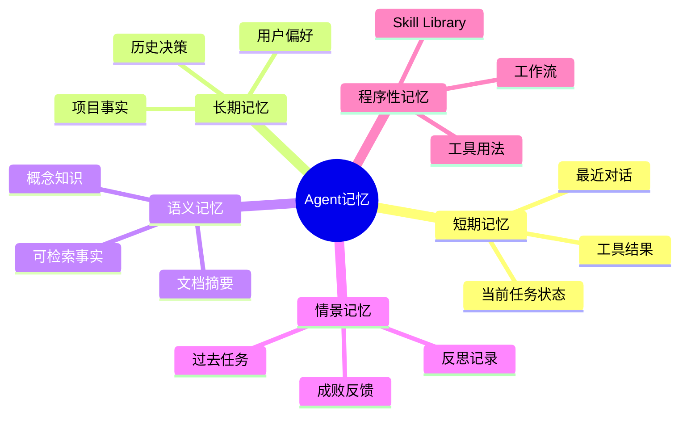
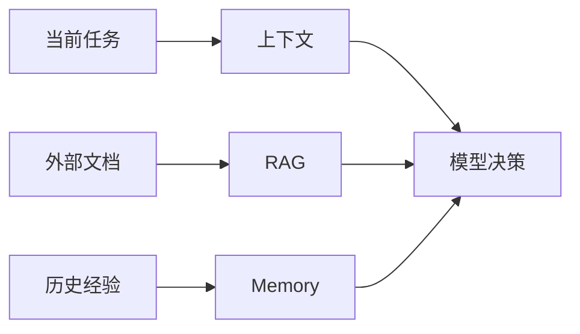
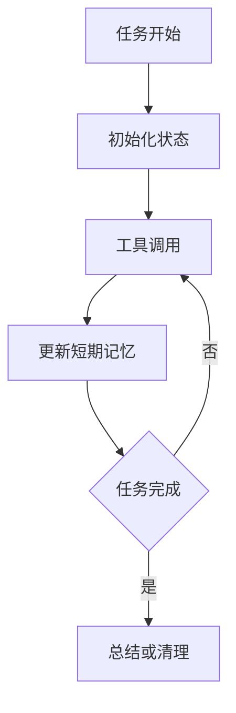
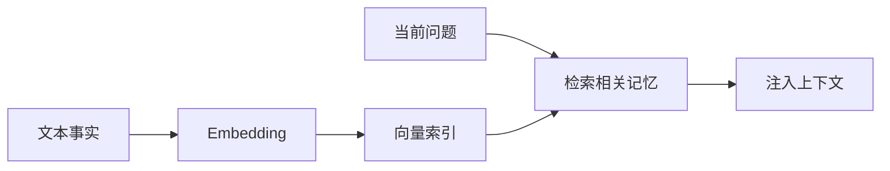
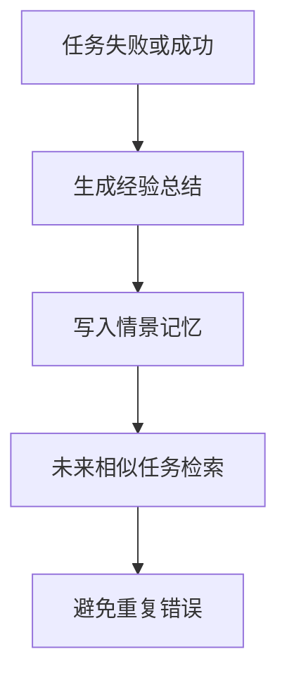
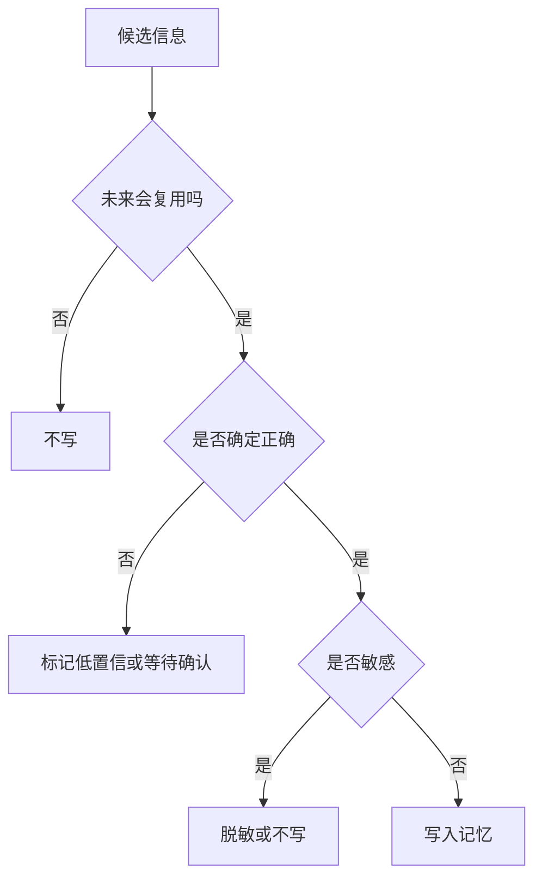

# 05. Agent 记忆系统

## 学习目标

读完本章，你应该能回答：

1. Agent 为什么需要记忆？它和上下文、RAG 有什么区别？
2. 短期记忆、长期记忆、语义记忆、情景记忆、程序性记忆分别是什么？
3. 什么时候应该写入记忆，什么时候不应该？
4. 如何避免错误记忆、过期记忆和隐私泄露？

## 一句话总纲

Agent 记忆是跨轮次、跨任务保存和检索有用信息的机制；它不是把所有对话永久保存，而是有选择地保存用户偏好、任务状态、经验教训和可复用知识。

> 记忆口诀：**上下文管当前，RAG 管外部知识，Memory 管持续经验。**

## 思维导图



## 1. 记忆和上下文的区别

| 概念 | 作用 | 生命周期 |
| --- | --- | --- |
| 上下文 | 当前模型调用输入 | 一次调用或短会话 |
| RAG | 外部知识检索 | 随知识库更新 |
| 记忆 | 跨任务保留经验和偏好 | 长期但需治理 |



## 2. 短期记忆

短期记忆保存当前任务运行中必要状态，例如：

- 用户当前目标。
- 已完成步骤。
- 待办事项。
- 最近工具结果。
- 临时变量。
- 失败原因。



短期记忆通常适合存放在：

- 会话状态。
- 工作流状态机。
- Redis 或数据库。
- Agent scratchpad。

## 3. 长期记忆

长期记忆跨会话保存，常见内容：

- 用户偏好：喜欢中文回答、偏好表格。
- 项目事实：项目使用 PostgreSQL。
- 决策记录：某方案因成本被拒绝。
- 常用联系人、术语和业务规则。

长期记忆写入要谨慎，因为错误记忆会长期影响模型。

## 4. 语义记忆

语义记忆保存可检索事实和知识，常用向量数据库实现。



适合：

- 用户历史偏好检索。
- 项目知识片段。
- 历史问题和解决方案。
- 文档摘要。

## 5. 情景记忆

情景记忆记录具体事件和任务轨迹：

```text
在任务 X 中，Agent 尝试了方案 A，测试失败；后来改用方案 B 成功。
```

它适合 Reflection 模式：失败后总结经验，下次遇到类似任务时检索使用。



## 6. 程序性记忆与 Skill Library

程序性记忆记录“怎么做”：

- 某 API 的调用流程。
- 某项目的测试命令。
- 某类任务的 checklist。
- 可复用脚本或技能。

这类记忆最好结构化成文档、脚本或 skill，而不是只作为自由文本放进向量库。

## 7. 什么时候写入记忆？



适合写入：

- 用户明确表达的长期偏好。
- 经过验证的项目事实。
- 任务中确认有效的解决方案。
- 可复用流程和工具经验。

不适合写入：

- 一次性临时信息。
- 未验证猜测。
- 敏感凭证。
- 用户不希望保存的信息。
- 可能很快过期的信息。

## 8. 记忆结构设计

一条好记忆应该包含：

| 字段 | 作用 |
| --- | --- |
| content | 记忆正文 |
| type | preference、fact、episode、skill |
| source | 来源对话、工具、文档 |
| confidence | 置信度 |
| timestamp | 写入时间 |
| expiry | 过期时间，可选 |
| scope | 用户、项目、组织、全局 |
| sensitivity | 敏感等级 |

## 9. 记忆检索和注入

不是所有记忆都应该注入上下文。

注入流程：


## 10. 记忆风险

| 风险 | 说明 | 缓解 |
| --- | --- | --- |
| 错误记忆 | 模型把猜测当事实 | 置信度、来源、人工确认 |
| 过期记忆 | 旧规则影响新任务 | expiry、版本、更新时间 |
| 隐私泄露 | 保存敏感数据 | 脱敏、权限、删除机制 |
| 记忆污染 | 恶意输入被保存 | 写入前过滤和确认 |
| 上下文干扰 | 注入无关记忆 | 相关性过滤 |

## 11. 学习自检

1. 记忆和 RAG 的区别是什么？
2. 用户偏好应该如何保存？
3. 为什么未验证猜测不应写入长期记忆？
4. 情景记忆适合解决什么问题？
5. 记忆注入前应该经过哪些过滤？

## 参考

- Reflexion: https://arxiv.org/abs/2303.11366
- Voyager: https://arxiv.org/abs/2305.16291
- LangGraph Memory Docs: https://docs.langchain.com/oss/python/langgraph/memory
