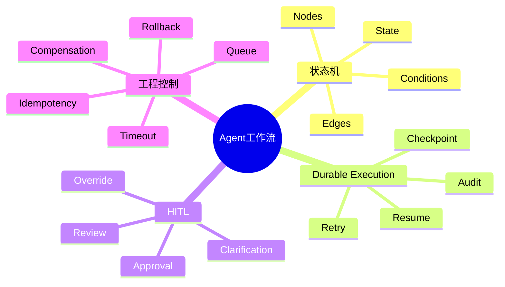
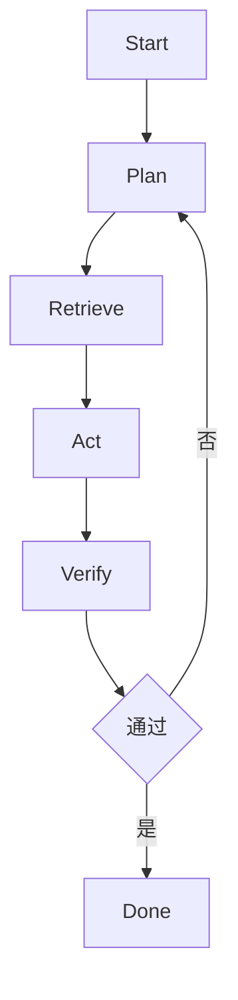
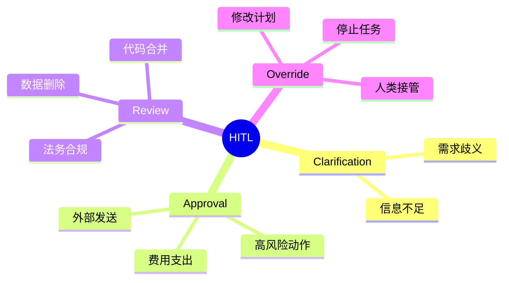
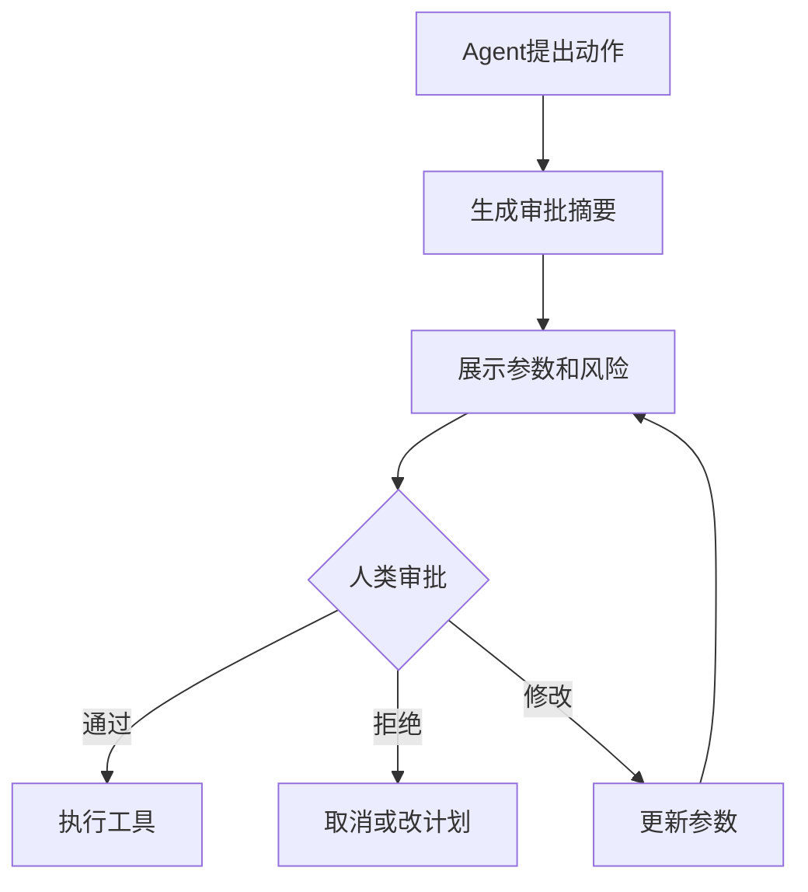
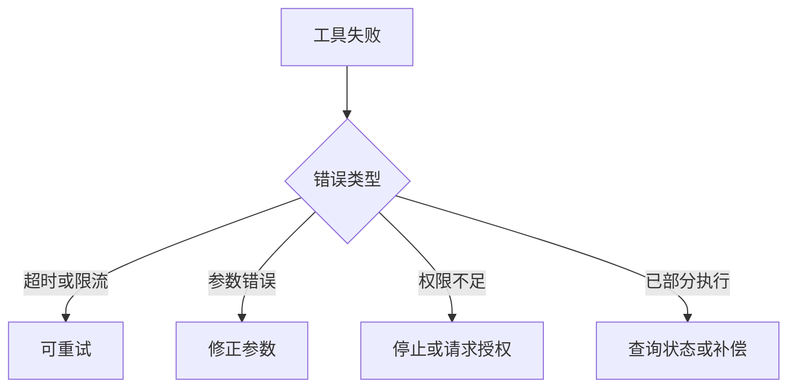

# 06. Workflow、状态机与 Human in the Loop

## 学习目标

读完本章，你应该能回答：

1. 为什么生产 Agent 不能只靠 while 循环？
2. 状态机、工作流、durable execution、checkpoint 分别解决什么问题？
3. 哪些节点需要 Human in the Loop？
4. 如何设计重试、回滚、幂等和暂停恢复？

## 一句话总纲

生产级 Agent 不是一次性脚本，而是一个可暂停、可恢复、可审计、可重试、可审批的工作流系统。

> 记忆口诀：**能暂停，能恢复，能审计，能回滚，才算生产 Agent。**

## 思维导图



## 1. 为什么不能只靠 while 循环？

简单 demo 常写成：

```text
while not done:
    ask_model()
    call_tool()
```

但生产中会遇到：

- 工具超时。
- 进程重启。
- 用户需要审批。
- 长任务跨小时或跨天。
- 外部 API 限流。
- 某一步已经执行，不能重复执行。
- 需要审计每一步决策。

所以需要显式工作流和状态管理。

## 2. 状态机基本结构



状态机包含：

| 元素 | 含义 |
| --- | --- |
| Node | 一个可执行步骤 |
| Edge | 步骤之间的转移 |
| Condition | 分支条件 |
| State | 跨节点共享的数据 |
| Checkpoint | 可恢复快照 |

## 3. Durable Execution

Durable execution 指工作流即使中断，也能从上次检查点恢复，而不是从头开始。


它解决：

- 长任务中断。
- 服务重启。
- 人类审批等待。
- 重试和恢复。
- 审计和复盘。

## 4. Checkpoint 应该保存什么？

建议保存：

- 当前节点。
- 任务目标。
- 已完成动作。
- 工具调用结果。
- 外部动作 ID。
- 错误和重试次数。
- 人类审批状态。
- 重要上下文摘要。

不要保存：

- 明文 secrets。
- 无用大日志。
- 可重新获取的大型文件全文。

## 5. Human in the Loop 的类型



### 什么时候必须有人参与？

- 发送外部邮件或消息。
- 删除、修改重要数据。
- 付款、下单、提交合同。
- 访问敏感信息。
- 模型不确定且代价高。
- 法律、医疗、金融等高风险场景。

## 6. 审批节点设计



审批摘要应该包含：

- 要执行什么。
- 为什么执行。
- 影响范围。
- 具体参数。
- 可逆性。
- 风险等级。

## 7. 重试与幂等

重试不能盲目。只读操作通常可重试；写操作必须保证幂等或需要补偿机制。



## 8. 回滚和补偿

有些操作不能真正回滚，只能补偿。

| 操作 | 回滚方式 |
| --- | --- |
| 写数据库草稿 | 删除或恢复旧版本 |
| 发邮件 | 不能回滚，只能补发说明 |
| 创建订单 | 取消订单 |
| 转账 | 需要反向交易或人工处理 |

设计 Agent 时要提前知道工具的可逆性。

## 9. 工作流可观测性

每个节点应记录：

- 输入。
- 输出。
- 工具调用参数。
- 工具结果。
- 模型选择理由的可审计摘要。
- 耗时。
- 成本。
- 错误。
- 审批人和审批结果。

## 10. 学习自检

1. durable execution 解决什么问题？
2. checkpoint 应该保存哪些信息？
3. 哪些动作必须 Human in the Loop？
4. 幂等性为什么对写工具重要？
5. 回滚和补偿有什么区别？

## 参考

- LangGraph Durable Execution: https://docs.langchain.com/oss/python/langgraph/durable-execution
- LangGraph Persistence: https://docs.langchain.com/oss/python/langgraph/persistence
- OpenAI Agents SDK: https://platform.openai.com/docs/guides/agents-sdk/
