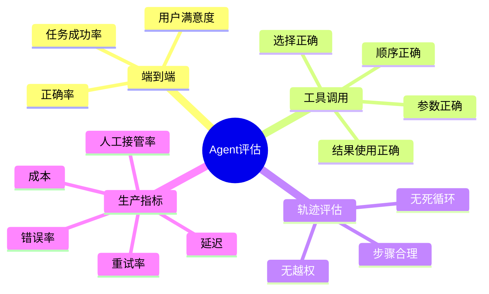
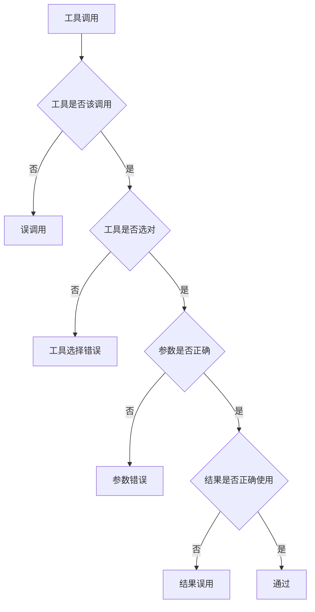
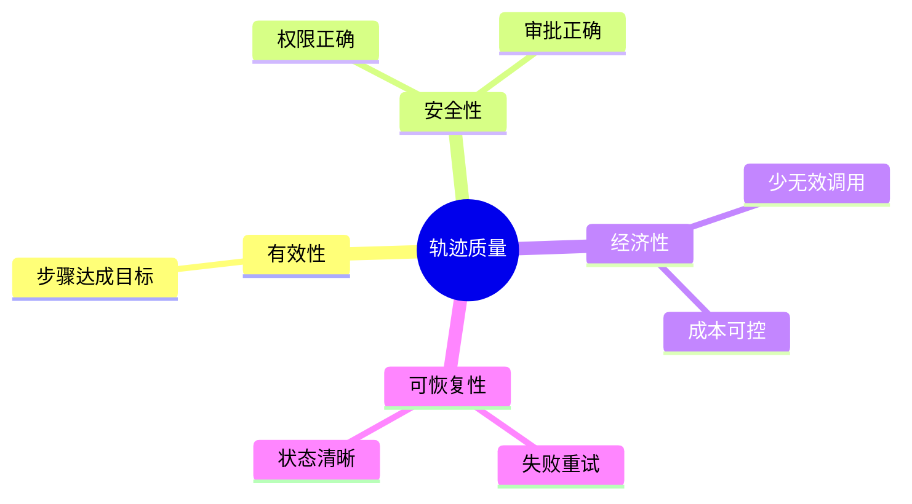
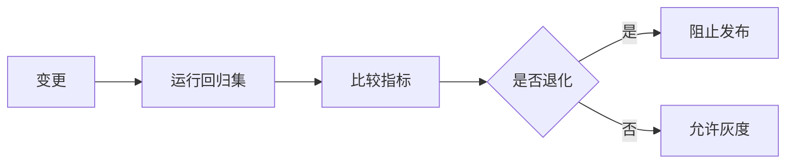
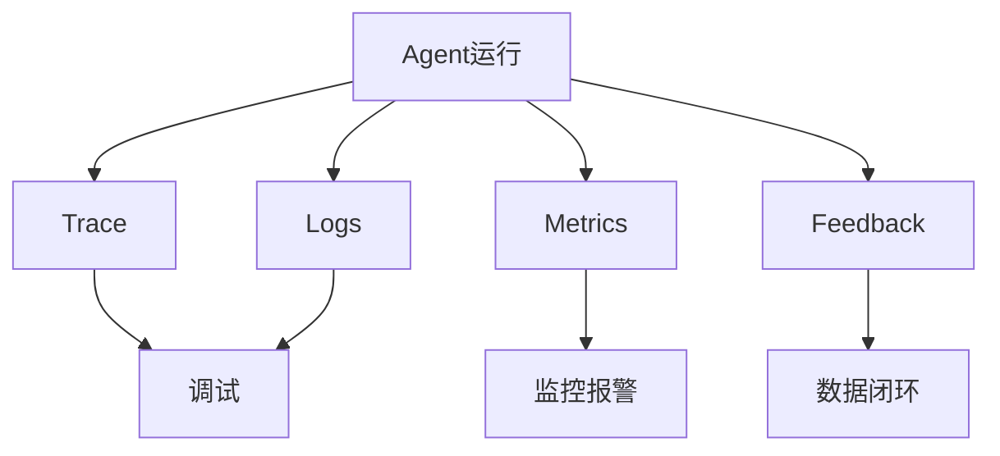
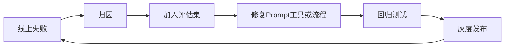

# 07. Agent 评估与 Observability

## 学习目标

读完本章，你应该能回答：

1. Agent 评估和普通 LLM 回答评估有什么区别？
2. 如何评估工具调用是否正确？
3. 轨迹评估、端到端评估、回归测试分别是什么？
4. Tracing、日志、指标和用户反馈如何组成观测系统？

## 一句话总纲

Agent 的质量不能只看最终答案，还要看是否选对工具、参数是否正确、步骤是否合理、是否遵守权限、成本是否可控、失败是否可恢复。

> 记忆口诀：**答案只是结果，轨迹才是证据。**

## 思维导图



## 1. 为什么 Agent 评估更复杂？

普通问答评估：

```text
输入问题 → 输出答案 → 判断答案好不好
```

Agent 评估：

```text
输入目标 → 多轮决策 → 多次工具调用 → 状态变化 → 最终结果
```


任何一个环节出错，都可能导致失败。

## 2. 评估层次

| 层次 | 关注点 |
| --- | --- |
| 单步输出 | 单次模型回答或工具参数 |
| 工具调用 | 工具选择、参数、顺序、错误处理 |
| 轨迹 | 多步骤是否合理、安全、经济 |
| 端到端 | 任务最终是否完成 |
| 生产 | 延迟、成本、失败率、用户反馈 |

## 3. 工具调用评估



指标：

- Tool selection accuracy。
- Argument exact match。
- Argument validity。
- Tool success rate。
- Unnecessary tool call rate。
- Unsafe tool call rate。

## 4. 轨迹评估

轨迹评估关注 Agent 做事过程。

好的轨迹应该：

- 步骤少而必要。
- 没有越权工具调用。
- 没有重复无效循环。
- 错误后能合理修正。
- 高风险动作前请求审批。
- 最终结果能被验证。



## 5. LLM-as-Judge

可以用另一个 LLM 辅助评分，但不能盲信。

适合评估：

- 答案是否覆盖要点。
- 是否忠实于证据。
- 工具轨迹是否合理。
- 输出格式是否满足要求。

需要注意：

- 使用明确 rubric。
- 对高风险评估做人工抽检。
- 固定 judge prompt 和模型版本。
- 保存评估输入和输出。

## 6. 回归测试集

每次改 prompt、模型、工具描述、检索策略、工作流，都可能改变 Agent 行为。因此需要回归测试集。



回归集应包含：

- 常见任务。
- 难例任务。
- 安全边界。
- 工具失败场景。
- 权限场景。
- 历史线上失败样本。

## 7. Observability：可观测性

Agent 生产系统至少记录：

- 用户输入。
- 模型输入和输出摘要。
- 工具调用名称和参数。
- 工具结果。
- 状态转移。
- 错误和重试。
- token、成本、延迟。
- 用户反馈。



## 8. 常见指标

| 指标 | 含义 |
| --- | --- |
| Task Success Rate | 任务完成率 |
| Tool Error Rate | 工具错误率 |
| Retry Rate | 重试率 |
| Human Takeover Rate | 人类接管率 |
| Unsafe Action Rate | 不安全动作率 |
| Latency p50/p95 | 响应延迟 |
| Cost per Task | 单任务成本 |
| Token per Task | 单任务 token 消耗 |
| User Satisfaction | 用户满意度 |

## 9. 失败样本闭环



失败归因分类：

- 意图理解错。
- 工具选错。
- 参数错。
- 检索错。
- 权限错。
- 模型幻觉。
- 工作流状态错。
- 外部服务失败。

## 10. 学习自检

1. 为什么 Agent 评估不能只看最终答案？
2. 工具调用准确率包括哪些维度？
3. 轨迹评估应该看什么？
4. LLM-as-judge 有哪些风险？
5. 线上失败样本为什么要进入回归集？

## 参考

- OpenAI Evals: https://github.com/openai/evals
- AgentBench: https://arxiv.org/abs/2308.03688
- SWE-bench: https://arxiv.org/abs/2310.06770
- OpenAI Agents SDK Tracing: https://platform.openai.com/docs/guides/agents-sdk/
