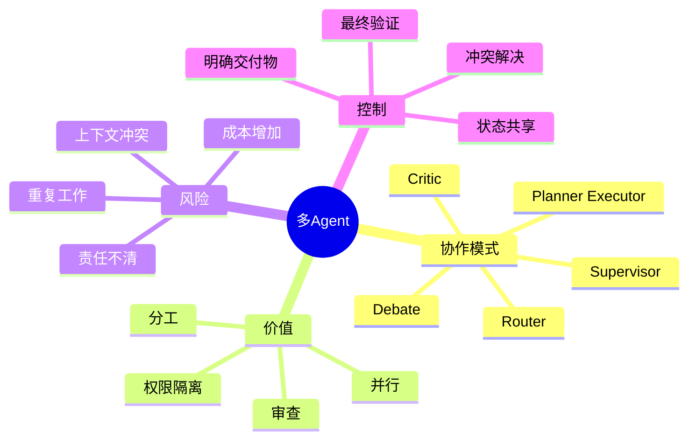
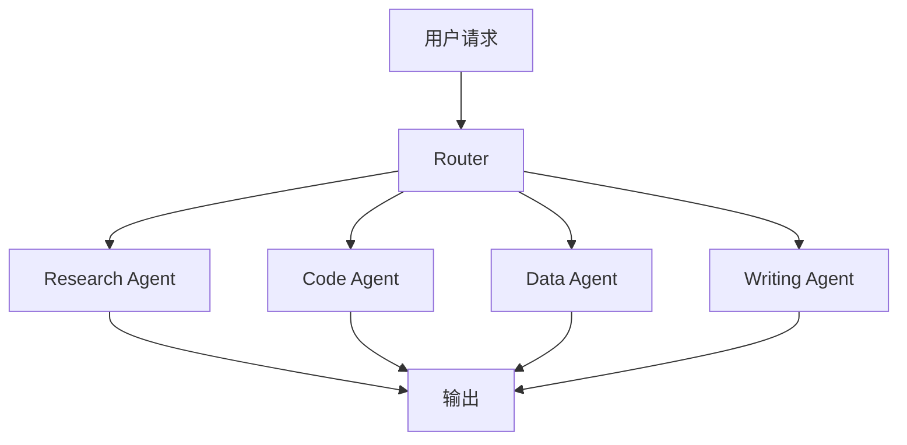
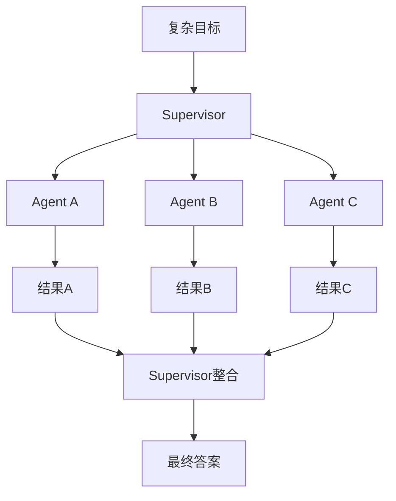
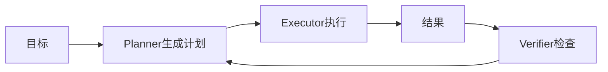
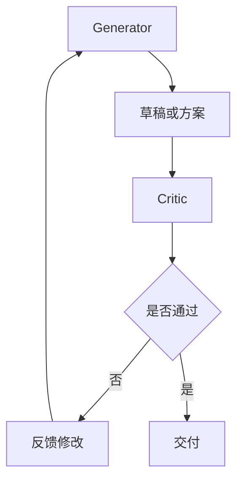
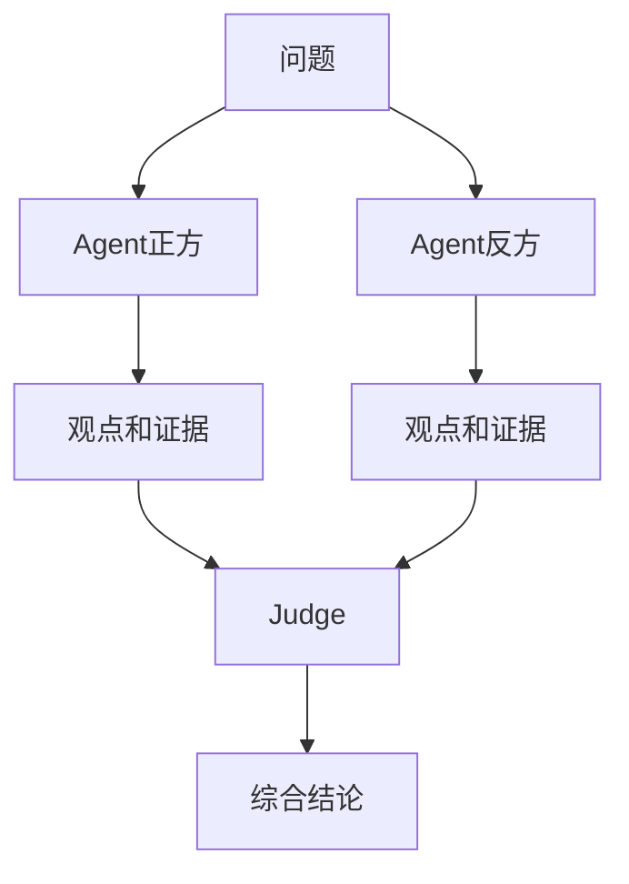
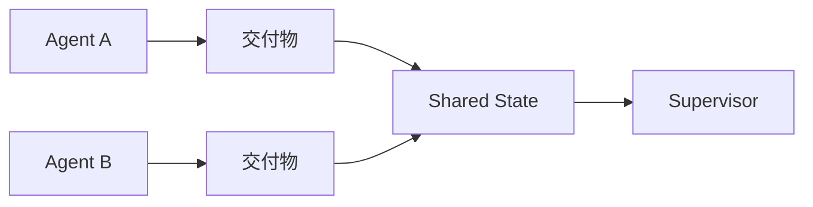
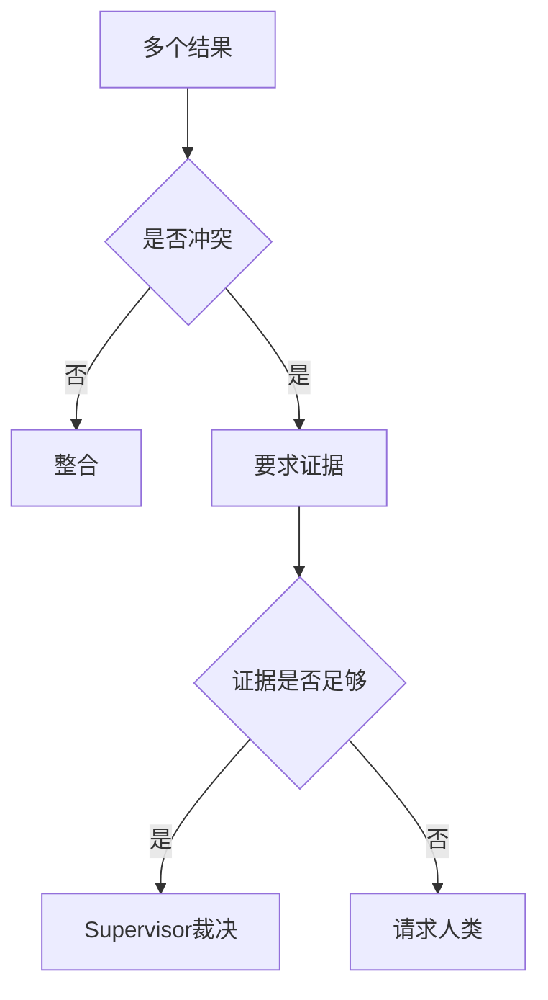

# 09. 多 Agent 协作模式

## 学习目标

读完本章，你应该能回答：

1. 多 Agent 什么时候有必要，什么时候只是增加复杂度？
2. Router、Supervisor、Planner-Executor、Critic、Debate 分别是什么？
3. 多 Agent 协作如何管理上下文、权限、所有权和冲突？
4. 如何评估多 Agent 系统是否真的提升了效果？

## 一句话总纲

多 Agent 的目的不是“让更多模型聊天”，而是通过角色分工、权限隔离、并行执行和互相审查，提高复杂任务的完成率和可控性。

> 记忆口诀：**能单 Agent 做好就别拆；拆了就要有角色、边界、交付物和验证。**

## 思维导图

## 1. 什么时候需要多 Agent？

适合：

- 任务天然多角色：研究、实现、审查、测试。
- 子任务可以并行。
- 不同角色需要不同工具权限。
- 需要独立批判或验证。
- 任务复杂到单一上下文难以承载。

不适合：

- 简单问答。
- 单步工具调用。
- 低延迟强约束场景。
- 没有清晰分工的任务。
- 只是为了“看起来更智能”。

## 2. Router 模式

Router 根据请求类型选择专家。

优点：成本可控，简单任务不用强模型。  
风险：路由错误会导致后续全错。

## 3. Supervisor 模式

Supervisor 负责拆解任务、分派、收集和整合。

关键要求：

- Supervisor 拥有最终决策权。
- 子 Agent 有明确任务和交付物。
- 子 Agent 不应擅自扩大范围。
- 需要统一验证。

## 4. Planner-Executor 分离

Planner 只规划，Executor 只执行。

优点：减少执行 Agent 自我编造计划的风险。  
适合：代码修改、数据迁移、长任务自动化。

## 5. Critic / Reviewer 模式

一个 Agent 生成，另一个 Agent 审查。

适合：

- 代码审查。
- 安全审查。
- 法务文本。
- 高风险操作计划。

## 6. Debate 模式

多个 Agent 从不同角度提出观点，再由 Judge 或用户决策。

适合：架构决策、方案权衡。  
不适合：事实检索问题或低延迟任务。

## 7. 上下文共享策略

多 Agent 不能无脑共享全部上下文。

| 策略 | 说明 |
| --- | --- |
| Shared State | 共享任务状态和关键事实 |
| Private Scratchpad | 每个 Agent 有私有思考空间 |
| Artifact Handoff | 只传递交付物，不传全部轨迹 |
| Event Log | 记录所有动作供审计 |
| Memory Store | 可检索历史经验 |

## 8. 权限隔离

不同 Agent 应该拥有不同权限。

例子：

| Agent | 权限 |
| --- | --- |
| Researcher | 只读搜索和浏览 |
| Executor | 修改工作区文件 |
| Reviewer | 只读审查 |
| Deployer | 需要审批后部署 |
| Finance Agent | 严格审批和审计 |

权限隔离可以降低某个 Agent 被 prompt injection 带偏后的损害范围。

## 9. 冲突处理

多 Agent 可能给出冲突结论。

处理方式：

- 要求每个结论附证据。
- Supervisor 按证据和优先级判断。
- 不确定时请求人类决策。
- 把冲突写入风险清单。

## 10. 多 Agent 评估

要证明多 Agent 有价值，不能只看“过程更热闹”。应比较：

- 任务成功率是否提升。
- 错误率是否下降。
- 成本是否可接受。
- 延迟是否可接受。
- 安全事故是否减少。
- 人类干预是否减少。

## 11. 学习自检

1. 多 Agent 的核心价值是什么？
2. Router 和 Supervisor 有什么区别？
3. Planner-Executor 分离解决什么问题？
4. 多 Agent 为什么需要权限隔离？
5. 如何判断多 Agent 是否值得？

## 参考

- OpenAI Agents SDK Handoffs: https://platform.openai.com/docs/guides/agents-sdk/
- LangGraph Multi-agent: https://langchain-ai.github.io/langgraph/concepts/multi_agent/
