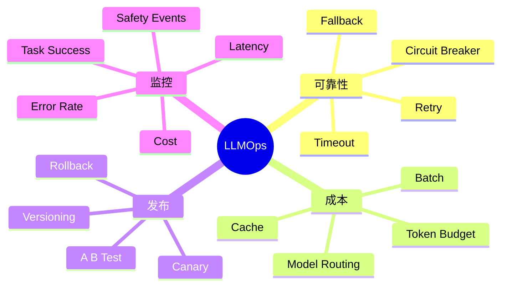
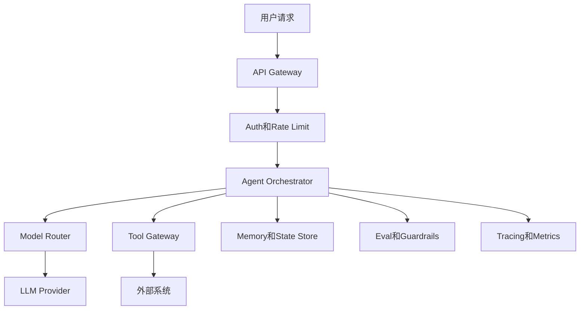
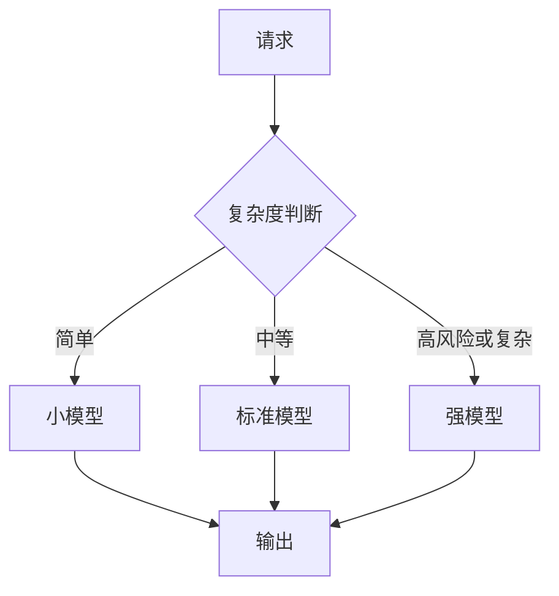
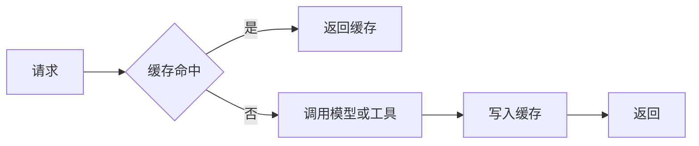
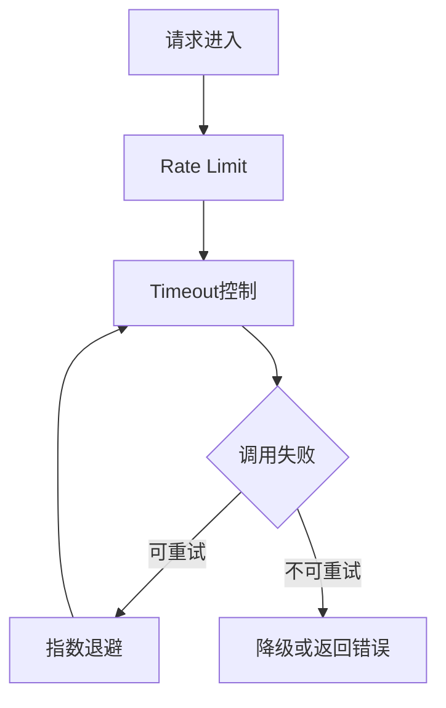
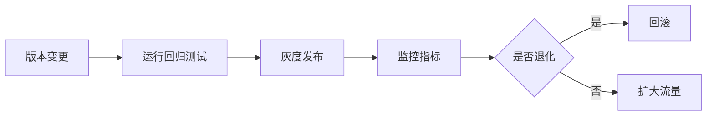
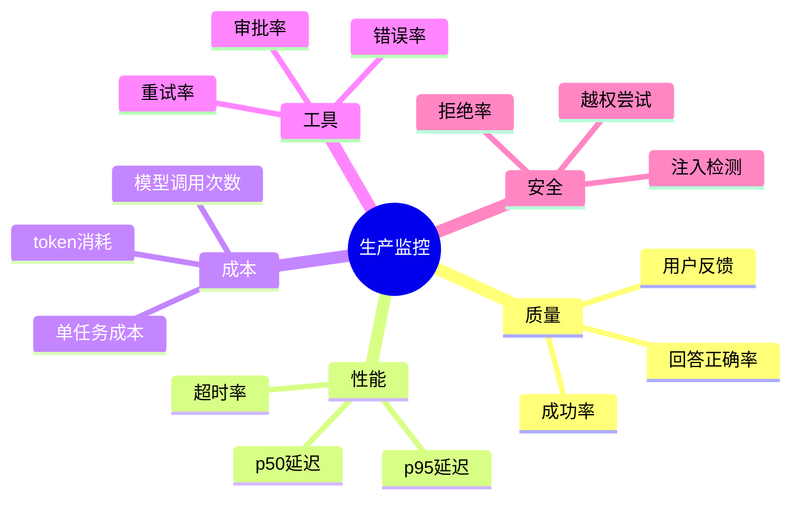

# 10. LLMOps 与生产部署

## 学习目标

读完本章，你应该能回答：

1. Agent 从 demo 到生产要补齐哪些工程能力？
2. 如何控制模型成本、延迟和稳定性？
3. 如何做模型路由、缓存、限流、灰度和回滚？
4. 生产 Agent 的监控指标有哪些？

## 一句话总纲

LLMOps 是把 LLM 和 Agent 系统稳定、可控、可观测、可回滚地运行在生产环境中的工程体系。

> 记忆口诀：**能跑 Demo 不难，难的是低成本、低延迟、可监控、可回滚、可持续改进。**

## 思维导图

## 1. Demo 与生产的差距

Demo 只需要一次成功。生产需要长期稳定。

| 能力 | Demo | 生产 |
| --- | --- | --- |
| 错误处理 | 打印错误 | 重试、降级、告警 |
| 成本控制 | 不关注 | 预算、缓存、模型路由 |
| 安全 | Prompt 约束 | 权限、审批、审计、沙箱 |
| 状态 | 内存变量 | 持久化、checkpoint |
| 评估 | 手工试用 | 回归集和线上指标 |
| 发布 | 直接改 | 灰度、A/B、回滚 |

## 2. 生产架构总览

## 3. 模型路由

不同任务使用不同模型，可以降低成本和延迟。

路由依据：

- 任务复杂度。
- 是否需要工具调用。
- 是否高风险。
- 用户等级。
- 延迟要求。
- 历史失败率。

## 4. 缓存策略

缓存可以降低成本和延迟，但要小心缓存错误和权限问题。

| 缓存类型 | 示例 |
| --- | --- |
| Prompt Cache | 相同系统指令或长上下文前缀 |
| Response Cache | 相同问题和上下文的答案 |
| Retrieval Cache | 相同 query 的检索结果 |
| Tool Cache | 只读 API 查询结果 |
| Embedding Cache | 文本到向量结果 |

注意：涉及用户权限、实时数据、个性化答案时，缓存 key 必须包含权限和版本信息。

## 5. 限流、超时与重试

重试原则：

- 网络超时可重试。
- 限流应指数退避。
- 写操作必须幂等。
- 参数错误不应盲目重试。
- 多次失败后熔断。

## 6. 版本管理

需要版本化的对象：

- 模型版本。
- Prompt 版本。
- 工具 schema 版本。
- RAG 索引版本。
- 评估集版本。
- 工作流图版本。
- 微调 adapter 版本。

## 7. 灰度和 A/B 测试

灰度发布：先给少量流量使用新版本，观察指标。  
A/B 测试：同时比较两个版本在真实流量下的效果。

要比较：

- 成功率。
- 用户满意度。
- 延迟。
- 成本。
- 工具错误率。
- 安全事件。
- 人类接管率。

## 8. 监控指标

## 9. 降级策略

当模型、工具或检索服务不可用时，需要降级。

| 故障 | 降级方式 |
| --- | --- |
| 强模型不可用 | 切换备用模型 |
| RAG 检索失败 | 提示无法访问知识库，不编造 |
| Rerank 超时 | 使用初始检索排序 |
| 写工具失败 | 创建草稿或请求人工处理 |
| 成本超预算 | 限制长上下文或转小模型 |

## 10. 数据闭环

生产 Agent 应持续从失败中改进。

## 11. 学习自检

1. LLMOps 和普通 DevOps 有什么不同？
2. 模型路由如何降低成本？
3. 缓存为什么要考虑权限和版本？
4. 哪些对象需要版本化？
5. 生产 Agent 常见降级策略有哪些？

## 参考

- OpenAI Agents SDK Tracing: https://platform.openai.com/docs/guides/agents-sdk/
- OpenAI Evals: https://github.com/openai/evals
- LangGraph Persistence: https://docs.langchain.com/oss/python/langgraph/persistence
