# 11. Agent 面试 20 问：从架构到生产落地

## 使用方式

这份文档用于面试复习。每个答案都尽量覆盖：定义、机制、工程取舍和风险。

> 答题口诀：**Agent 面试不要只讲模型，要讲工具、状态、权限、评估和生产。**

---

## 思维导图：高频考点地图

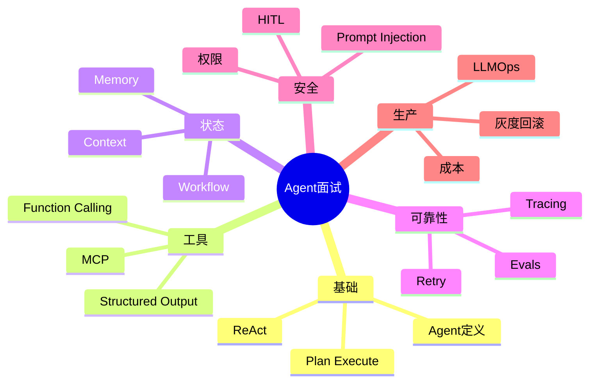

---

## Q1. AI Agent 和普通 LLM 应用有什么区别？

### 标准回答

普通 LLM 应用主要是输入问题、输出答案。AI Agent 则围绕目标进行多步决策，能够选择工具、执行动作、观察结果、更新状态并继续迭代，直到完成任务或触发停止条件。

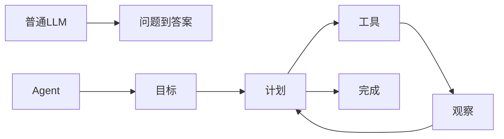

### 追问回答

Agent 的难点不只是 prompt，而是工具权限、状态管理、失败恢复、评估和安全边界。

---

## Q2. ReAct 模式是什么？适合什么场景？

### 标准回答

ReAct 是 Reasoning and Acting，让模型在推理、行动和观察之间循环。它适合需要动态检索、工具调用和根据环境反馈调整步骤的任务。

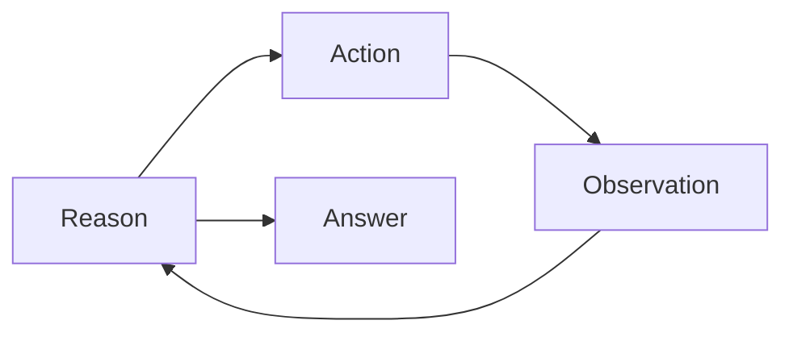

### 风险

需要限制最大步数、成本和工具权限，否则容易循环失控或误用工具。

---

## Q3. Plan-Execute 和 ReAct 有什么区别？

### 标准回答

ReAct 是边想边做，适合环境不确定、需要根据观察调整的任务。Plan-Execute 是先制定整体计划再执行，适合步骤相对明确、需要审批或并行的任务。

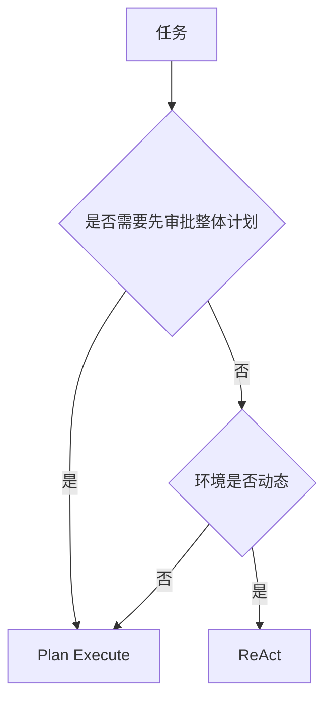

---

## Q4. Tool Calling 的完整链路是什么？

### 标准回答

模型根据用户目标选择工具并生成结构化参数；系统用 schema 校验参数，检查权限，执行工具，把结果作为 tool message 回传模型；模型再基于结果继续执行或生成最终回答。

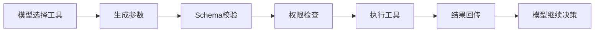

---

## Q5. Structured Output 和 JSON mode 有什么区别？

### 标准回答

JSON mode 通常保证输出是合法 JSON，但不保证符合具体字段和类型；Structured Output 通过 JSON Schema 约束输出结构，使程序更可靠地解析和使用。

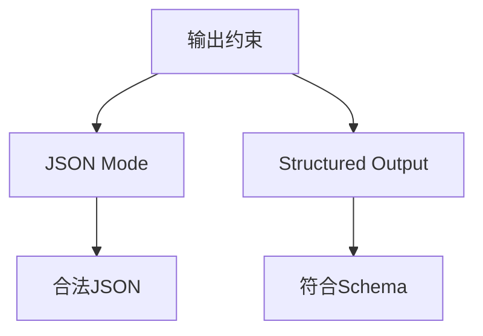

---

## Q6. MCP 是什么？为什么对 Agent 重要？

### 标准回答

MCP 是 Model Context Protocol，用标准方式连接 AI 应用与外部工具和上下文。它定义了 Host、Client、Server，以及 Tools、Resources、Prompts 等能力，让工具生态可以复用。

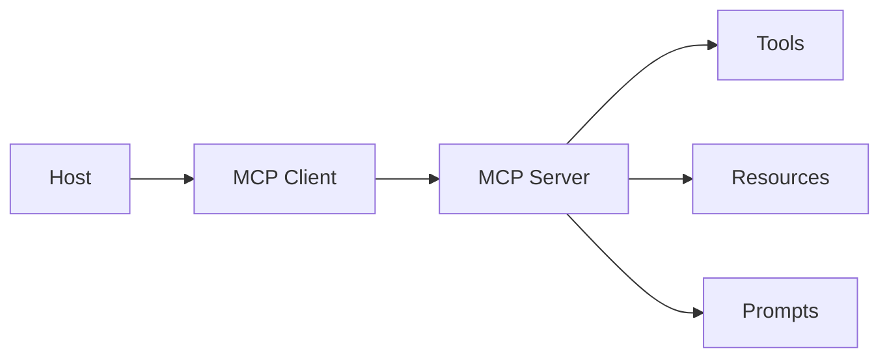

---

## Q7. MCP 中 Tools、Resources、Prompts 有什么区别？

### 标准回答

Tools 是模型可调用的动作；Resources 是应用可读取并放入上下文的数据；Prompts 是服务器提供的可复用提示模板。Tools 偏行动，Resources 偏资料，Prompts 偏模板。

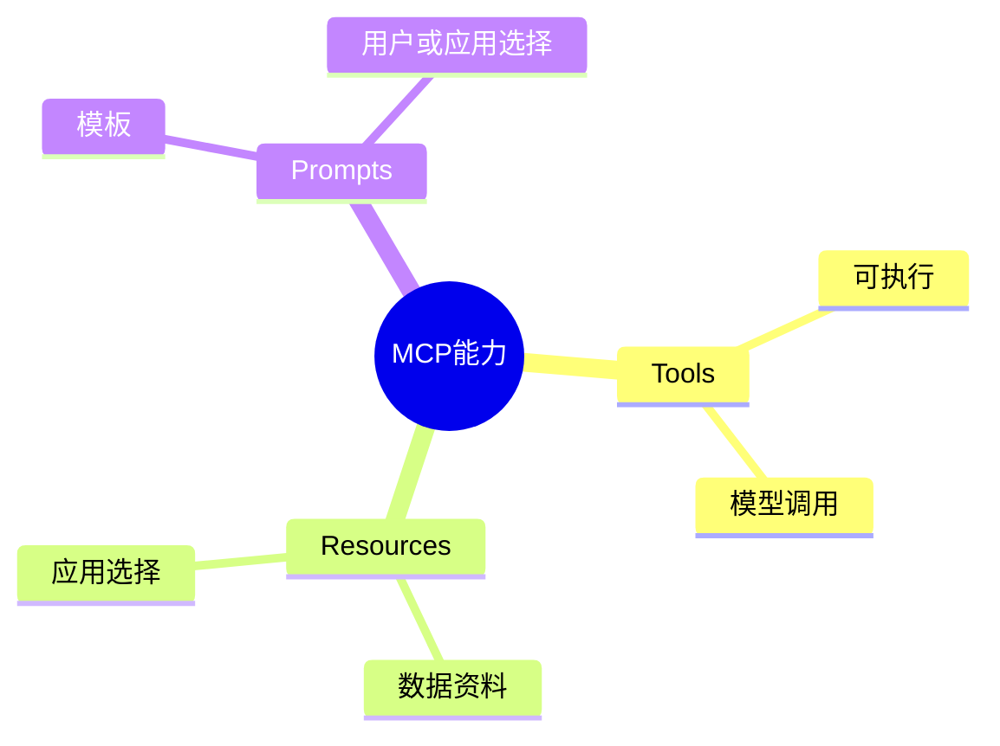

---

## Q8. Context Engineering 是什么？为什么重要？

### 标准回答

Context Engineering 是系统化管理模型输入，包括指令、历史、工具结果、RAG 证据和记忆的选择、排序、压缩和隔离。它重要是因为模型决策高度依赖上下文质量，错误或污染的上下文会导致错误行动。

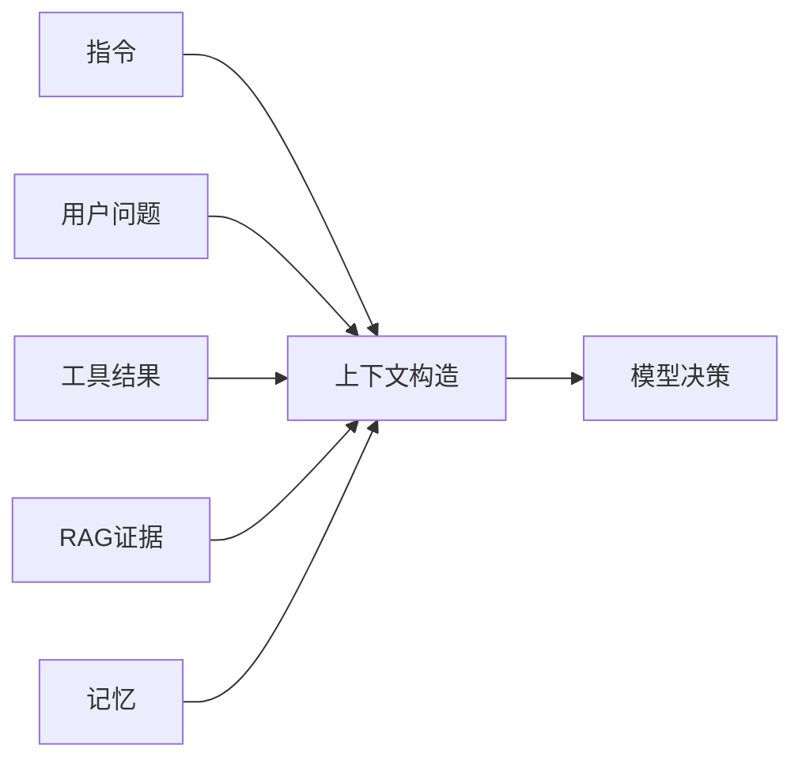

---

## Q9. Agent 记忆系统应该如何设计？

### 标准回答

记忆应分短期和长期。短期记忆保存当前任务状态和工具结果；长期记忆保存用户偏好、项目事实、历史决策和可复用经验。写入前要检查正确性、敏感性、过期时间和作用域，注入前要做相关性和权限过滤。

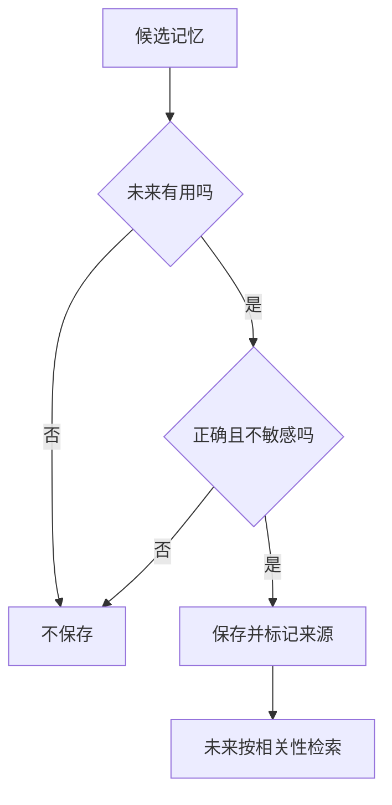

---

## Q10. Durable Execution 解决什么问题？

### 标准回答

Durable execution 让长任务在进程中断、服务重启、人类审批等待后，能从 checkpoint 恢复执行，而不是从头开始。它是生产 Agent 的关键能力。


---

## Q11. Human in the Loop 应该放在哪些地方？

### 标准回答

信息不足时需要澄清，高风险动作前需要审批，关键输出需要审查，异常或不确定性高时需要人类接管。尤其是发送邮件、删除数据、付款、部署、访问敏感信息等操作。

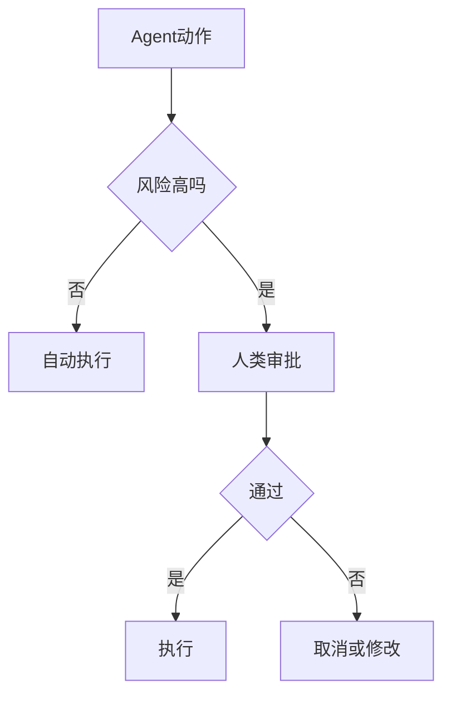

---

## Q12. 如何评估一个 Agent？

### 标准回答

要分层评估：最终任务是否成功，工具是否选对，参数是否正确，轨迹是否合理，是否遵守权限，成本和延迟是否可接受。不能只看最终答案。

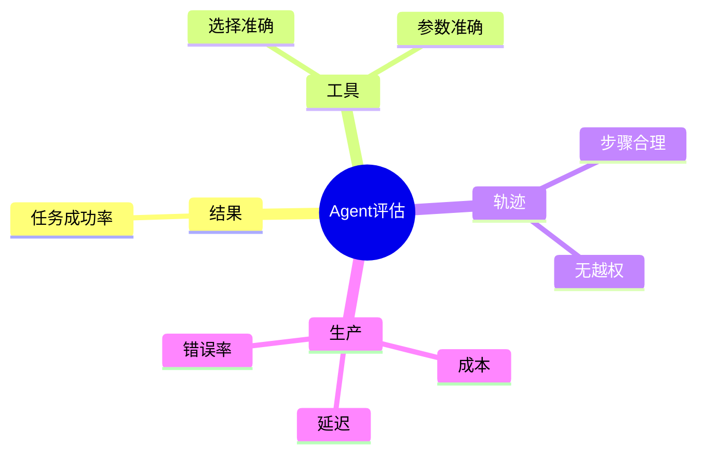

---

## Q13. Agent Tracing 应该记录什么？

### 标准回答

Tracing 应记录模型输入输出摘要、工具调用名称和参数、工具结果、状态转移、错误、重试、成本、延迟、审批结果和最终输出，便于调试、审计和评估。

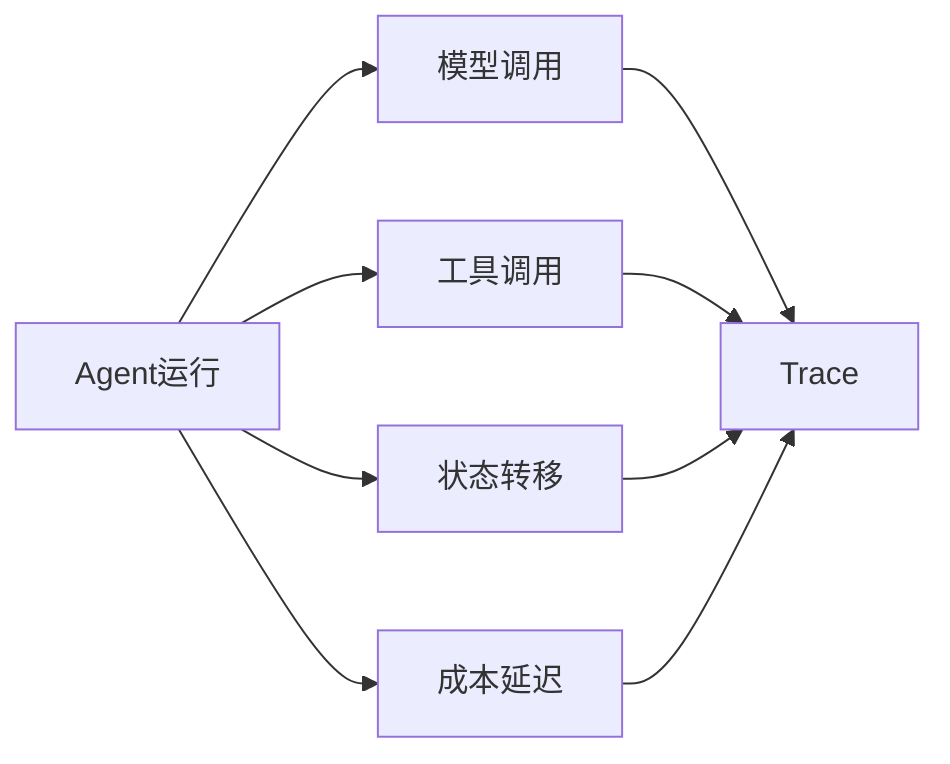

---

## Q14. Prompt Injection 在 Agent 中为什么危险？

### 标准回答

因为 Agent 能调用工具。恶意用户或外部文档可能通过提示注入诱导模型越权调用工具、泄露数据或执行危险操作。外部资料必须被视为不可信数据，而不是指令。

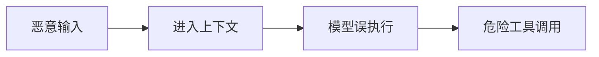

---

## Q15. 如何设计工具权限？

### 标准回答

按最小权限原则设计。只读工具可以自动执行，低风险写入记录日志，高风险写入需要审批，危险操作应禁止或强审批。权限应由系统判断，不由模型自己判断。

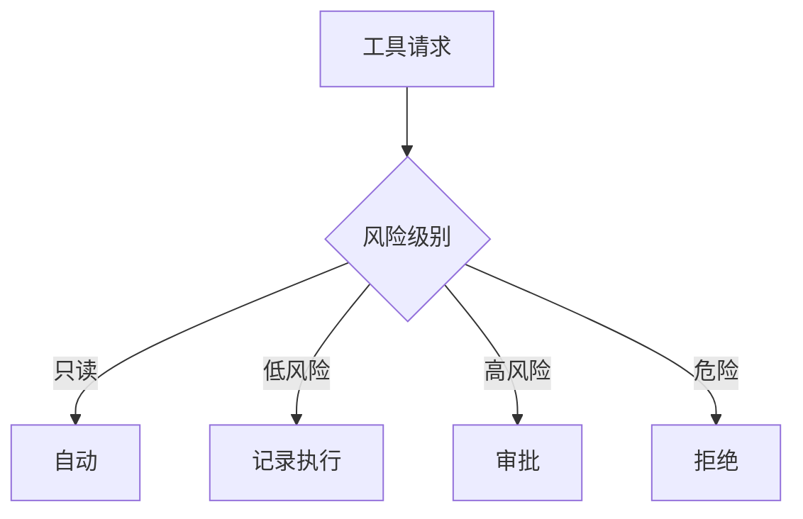

---

## Q16. 多 Agent 什么时候有必要？

### 标准回答

当任务需要不同角色分工、并行执行、权限隔离或独立审查时，多 Agent 有价值。简单任务使用多 Agent 只会增加成本、延迟和协调复杂度。

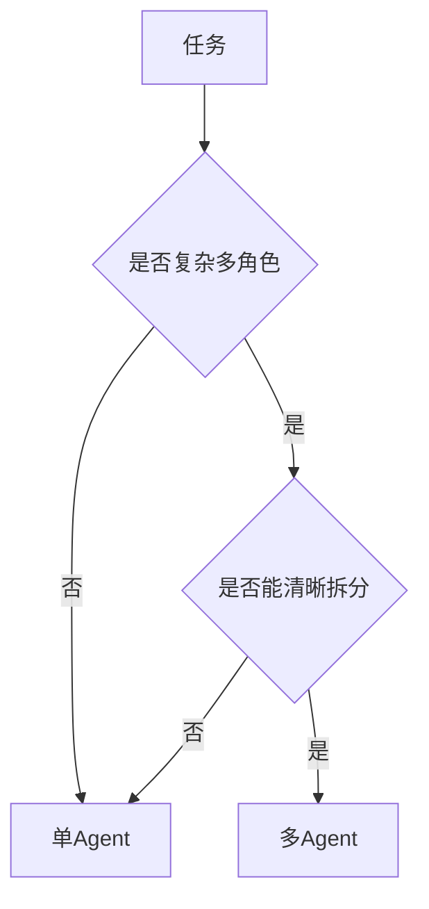

---

## Q17. Supervisor 模式的风险是什么？

### 标准回答

Supervisor 模式风险包括任务分派不清、子 Agent 重复工作、上下文不同步、成本过高、冲突结果无人裁决。需要明确每个子 Agent 的任务、写入范围、交付物和最终验证机制。

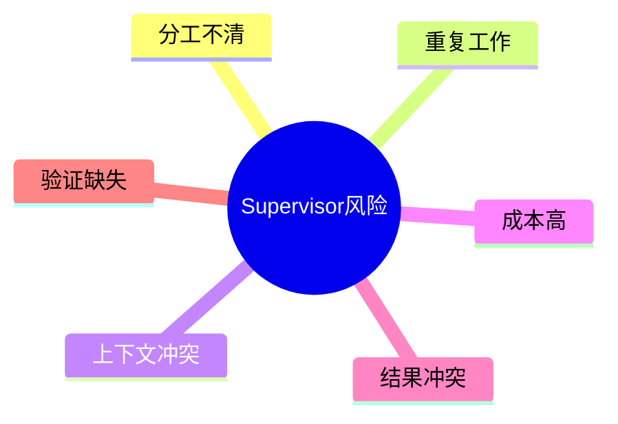

---

## Q18. Agent 如何控制成本和延迟？

### 标准回答

可以通过模型路由、缓存、上下文压缩、限制最大步数、减少无效工具调用、批处理、流式输出、超时和降级策略来控制成本和延迟。

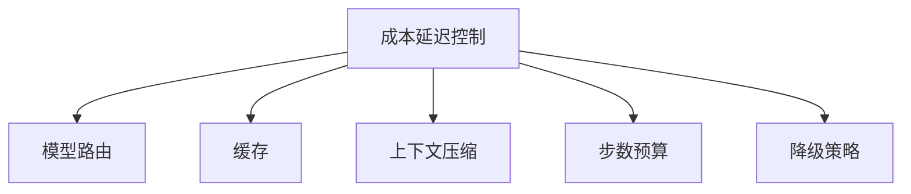

---

## Q19. Agent 上线前要做哪些检查？

### 标准回答

上线前要做回归评估、工具权限审查、安全红队、延迟成本压测、灰度方案、回滚方案、日志和监控配置、失败样本闭环设计。

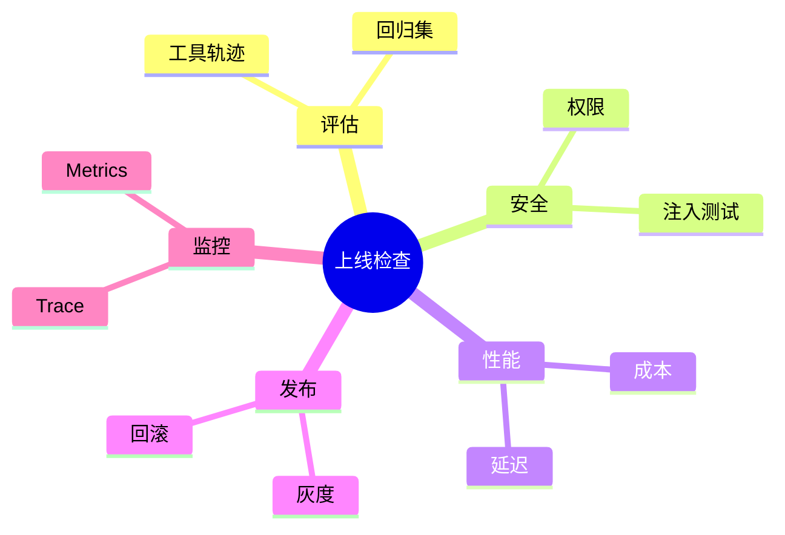

---

## Q20. 让你设计一个生产级 Agent，你会怎么做？

### 标准回答

我会先定义任务范围、风险等级和成功指标；再设计工具集合和权限；选择合适架构，如 ReAct 或 Plan-Execute；设计状态机、checkpoint 和人类审批节点；加入上下文工程、RAG 和记忆；建立评估集和 tracing；最后灰度上线，监控成本、延迟、成功率和安全事件。

```mermaid
flowchart TD
  A[定义目标和指标] --> B[工具和权限]
  B --> C[Agent架构]
  C --> D[状态机和HITL]
  D --> E[上下文和记忆]
  E --> F[评估和Tracing]
  F --> G[灰度上线]
  G --> H[监控和闭环]
```

---

## 面试快速复盘表

| 问题 | 关键词 | 最短答案 |
| --- | --- | --- |
| Agent 是什么 | 目标驱动多步执行 | LLM + 工具 + 状态 + 反馈 |
| ReAct | 想做看循环 | 动态工具任务 |
| Tool Calling | 结构化行动请求 | 模型生成参数，系统执行 |
| MCP | 标准工具协议 | Host Client Server |
| Context | 输入管理 | 选择排序压缩隔离 |
| Memory | 跨任务经验 | 写入和注入都要过滤 |
| Workflow | 状态机 | 可暂停恢复审计 |
| Evals | 结果和轨迹 | 不只看最终答案 |
| Security | 权限系统判断 | 外部资料不是指令 |
| LLMOps | 生产治理 | 成本延迟监控回滚 |

---

## 最终记忆图

```mermaid
mindmap
  root((Agent总口诀))
    架构
      ReAct
      PlanExecute
      Supervisor
    行动
      ToolCalling
      StructuredOutput
      MCP
    连续性
      Context
      Memory
      Workflow
    可靠性
      Evals
      Tracing
      Guardrails
    生产
      Security
      LLMOps
      Rollback
```
