# LLM 微调详解：从数据、训练到部署

## 学习目标

读完本文，你应该能回答这些问题：

1. 微调解决什么问题？它和 Prompt Engineering、RAG、重新预训练有什么区别？
2. SFT、Instruction Tuning、PEFT、LoRA、QLoRA、DPO、RLHF 分别处在什么位置？
3. 一条训练样本如何变成 token、label、loss？为什么常常要 mask 掉 prompt 部分？
4. LoRA 为什么能大幅减少可训练参数？`rank`、`alpha`、`target_modules` 怎么理解？
5. QLoRA 为什么能进一步省显存？它和普通量化有什么关系？
6. 微调数据如何清洗、切分、评估，如何避免过拟合、灾难性遗忘和安全退化？
7. 微调后如何部署、监控、回滚，并与 RAG 组合使用？

## 一句话总纲

LLM 微调不是“把知识硬塞进模型”的万能方法，而是：**在已有预训练能力基础上，用高质量任务数据或偏好数据，调整模型行为、格式、风格、领域技能和决策边界。**

> 记忆口诀：**RAG 补外部知识，Prompt 改短期行为，微调改长期习惯，预训练扩底层能力。**

## 阅读路线


---

## 思维导图

> 微调内容很容易混在一起。先用三张小图把“为什么调、调什么、怎么调”分开记。

### 1. 微调全局图

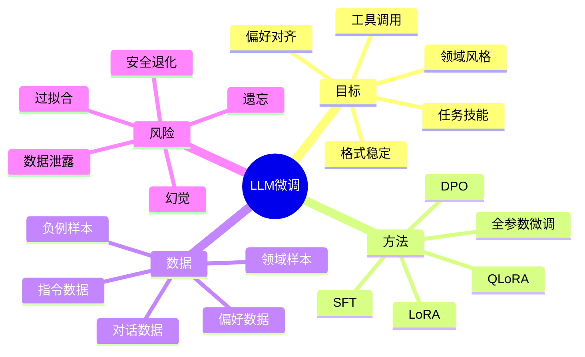

### 2. 方法选择图

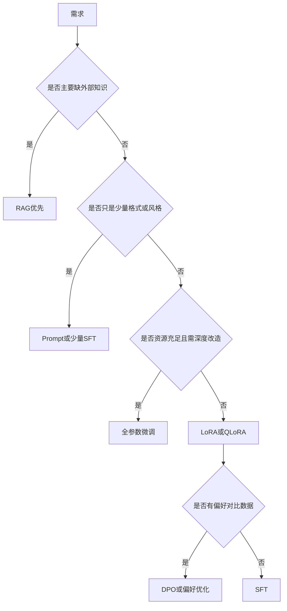

### 3. 训练闭环图


---

## 1. 什么是 LLM 微调？

微调是在一个已经预训练好的模型基础上，继续用较小、更有针对性的数据训练，让模型更适合某个任务、领域或行为规范。

预训练通常学习通用语言能力和世界知识；微调通常学习：

- 如何按指定格式回答。
- 如何遵守某个业务流程。
- 如何使用工具或函数调用格式。
- 如何形成某种写作风格。
- 如何在特定领域术语下表达。
- 如何更符合人类偏好或安全边界。


### 微调不是万能知识库

如果需求是“模型必须回答最新政策、公司文档、产品库存、数据库记录”，优先考虑 RAG 或工具调用。因为这些知识频繁变化，放进参数里更新成本高、可追溯性差。

微调更适合固化相对稳定的行为模式：

| 需求 | 更适合 |
| --- | --- |
| 回答最新文档内容 | RAG |
| 保持固定 JSON 输出 | Prompt 或 SFT |
| 学会企业客服话术 | SFT 或 LoRA |
| 遵守偏好排序 | DPO 或 RLHF |
| 扩展基础语言能力 | 继续预训练或领域预训练 |
| 记住大批实时知识 | 不建议靠微调 |

---

## 2. 微调、Prompt、RAG、预训练的区别

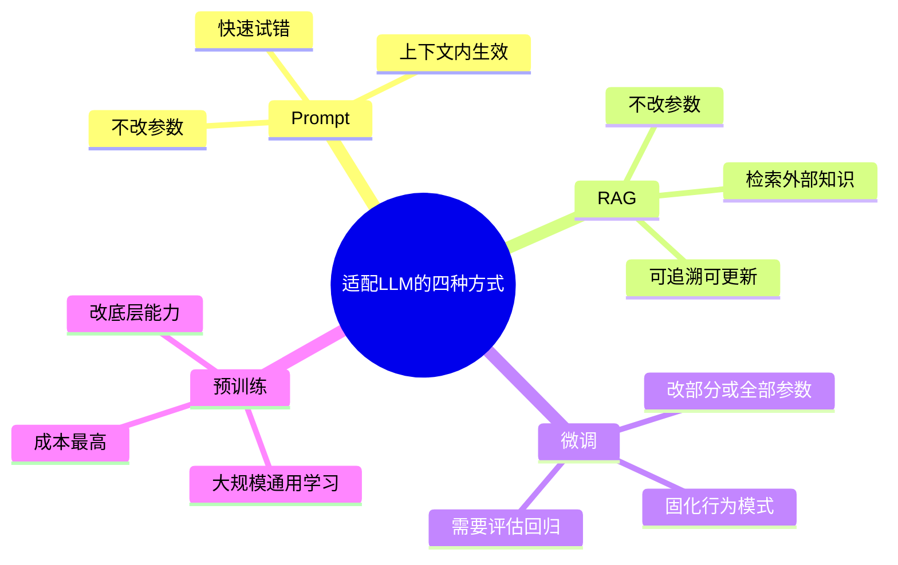

### Prompt Engineering

Prompt 是在上下文中给模型指令，不改变模型参数。

优点：快、便宜、可随时改。  
缺点：上下文有限，复杂格式和长期稳定性不一定好。

### RAG

RAG 先从外部知识库检索相关资料，再把资料放进上下文让模型回答。

优点：知识可更新、可引用来源、适合企业文档。  
缺点：依赖检索质量、切片质量、上下文构造和防注入能力。

### 微调

微调改变模型参数或附加参数，让模型形成更稳定的任务行为。

优点：格式、风格、流程、工具调用可以更稳定。  
缺点：需要数据、训练、评估、部署和回滚；不能天然保证事实正确。

### 继续预训练

继续预训练是在大量领域文本上延续语言建模训练，常用于让模型熟悉领域语料分布。

优点：能让模型吸收领域语言和术语。  
缺点：成本高，且不一定自动学会按指令工作，通常还需要后续 SFT。

---

## 3. 微调类型总览

| 类型    | 更新参数       | 典型数据                | 适合场景      | 主要代价              |
| ----- | ---------- | ------------------- | --------- | ----------------- |
| 全参数微调 | 所有权重       | 任务或领域数据             | 深度适配、资源充足 | 显存和存储成本高          |
| SFT   | 全参或适配器     | 指令-答案样本             | 学格式、流程、话术 | 依赖答案质量            |
| LoRA  | 低秩适配器      | 指令或任务数据             | 低成本适配     | 需选 target modules |
| QLoRA | 量化基座加 LoRA | 指令或任务数据             | 单卡或低显存训练  | 训练和量化细节更复杂        |
| DPO   | 通常适配器或全参   | chosen rejected 偏好对 | 偏好对齐      | 需要可靠偏好数据          |
| RLHF  | 策略模型和奖励模型  | 人类偏好排序              | 强对齐和复杂偏好  | 流程复杂、稳定性挑战        |

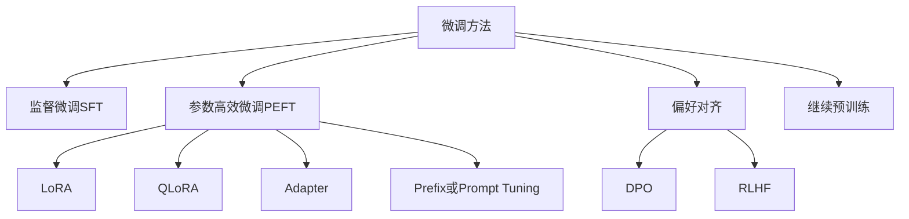

---

## 4. SFT：监督微调的基本机制

SFT，全称 Supervised Fine-Tuning，使用“输入指令 -> 理想回答”的样本训练模型。

### 4.1 典型样本

```json
{
  "messages": [
    {"role": "system", "content": "你是严谨的数据库助教。"},
    {"role": "user", "content": "解释事务隔离级别。"},
    {"role": "assistant", "content": "事务隔离级别用于..."}
  ]
}
```

训练时会套用模型对应的 chat template，把多轮消息变成 token 序列。

### 4.2 label 如何构造

Decoder-only 模型的目标仍是 next token prediction。不同的是，我们通常只希望模型学习 assistant 的回答，而不是学习复述用户输入。

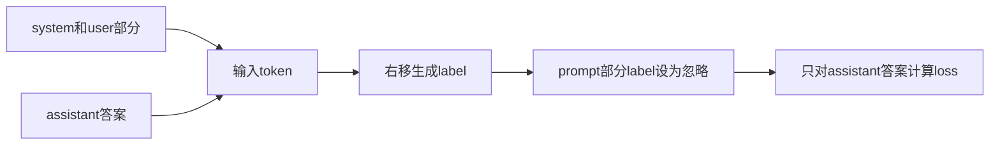

常见做法：

```text
prompt token 的 label = -100 或 ignore_index
assistant token 的 label = 对应下一个 token
```

这样模型主要学习“在这个上下文下应该如何回答”。

### 4.3 SFT 学到什么

SFT 学到的是条件分布：

```text
P(assistant_answer | system, user, history)
```

它不是简单背答案，而是在已有模型能力上强化某种回答模式。

---

## 5. 数据质量：微调成败的第一因素

微调常见误区是“数据越多越好”。更准确地说：**高质量、覆盖关键分布、格式一致、错误少的数据，通常比大量低质量数据更重要。**

### 5.1 数据构成

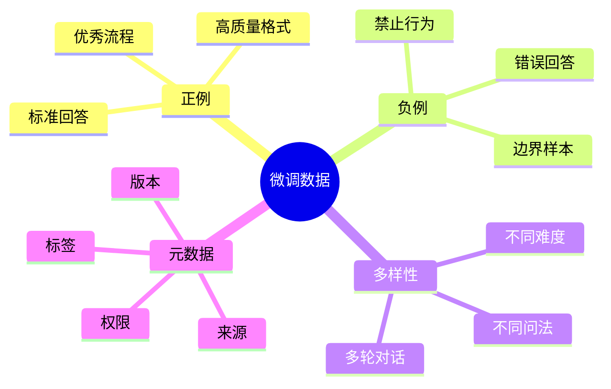

### 5.2 清洗检查清单

| 检查项 | 为什么重要 |
| --- | --- |
| 去重 | 重复样本会放大偏差，导致过拟合 |
| 去噪 | 错误答案会被模型认真学习 |
| 格式统一 | chat template 错误会破坏训练信号 |
| 隐私脱敏 | 避免模型记忆敏感信息 |
| 覆盖边界 | 避免只会回答简单问题 |
| 留出测试集 | 不能用训练样本证明模型有效 |
| 安全样本 | 防止模型学会危险输出 |

### 5.3 数据切分

建议至少切成：

```text
train：训练参数
validation：调超参和早停
test：最终评估
```

如果数据来自多个业务场景，最好按场景分层抽样，避免测试集只覆盖容易问题。

---

## 6. LoRA：低秩适配的核心原理

LoRA，全称 Low-Rank Adaptation。它的关键思想是：冻结原模型权重 `W`，不直接训练完整的 `ΔW`，而是用两个小矩阵的乘积表示权重增量。

### 6.1 公式

原线性层：

$$
y = xW
$$

微调后希望变成：

$$
y = x(W + \Delta W)
$$

LoRA 约束：

$$
\Delta W = BA
$$

其中 rank `r` 很小：

```text
A: [r, in_features]
B: [out_features, r]
r << min(in_features, out_features)
```

实际常带缩放：

$$
y = xW + \frac{\alpha}{r}xBA
$$

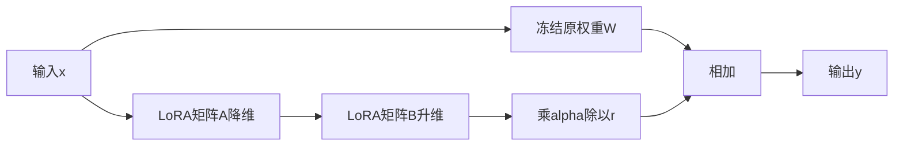

### 6.2 为什么省参数

假设一个线性层 `W` 是 `4096 × 4096`，全量更新需要约 1677 万参数。

如果 LoRA rank 为 `8`：

```text
A + B 参数量 = 8 × 4096 + 4096 × 8 = 65536
```

大幅少于完整矩阵。

### 6.3 LoRA 常见目标模块

在 Transformer LLM 中，LoRA 常挂在这些线性层上：

- `q_proj`
- `k_proj`
- `v_proj`
- `o_proj`
- `gate_proj`
- `up_proj`
- `down_proj`

不同模型命名不同，必须查看具体实现。

### 6.4 LoRA 参数含义

| 参数 | 含义 | 影响 |
| --- | --- | --- |
| rank `r` | 低秩瓶颈大小 | 越大表达力越强，参数越多 |
| alpha | 缩放系数 | 控制 LoRA 增量强度 |
| dropout | LoRA 分支 dropout | 防止小数据过拟合 |
| target_modules | 插入哪些线性层 | 决定适配范围和成本 |

---

## 7. QLoRA：量化基座上的 LoRA

QLoRA 的核心思想是：把预训练基座模型权重量化到低精度并冻结，然后通过 LoRA 适配器训练少量参数。

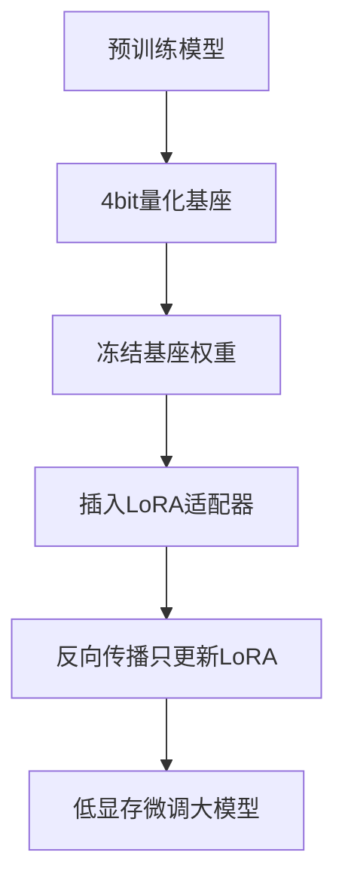

### 7.1 QLoRA 和普通 LoRA 的区别

| 维度 | LoRA | QLoRA |
| --- | --- | --- |
| 基座权重 | 通常 FP16 或 BF16 冻结 | 4-bit 量化冻结 |
| 可训练参数 | LoRA 参数 | LoRA 参数 |
| 主要收益 | 少训练参数 | 进一步降低显存 |
| 主要难点 | target 和超参 | 量化配置、计算 dtype、稳定性 |

### 7.2 QLoRA 不是把 LoRA 也 4-bit 训练

常见实现中，基座权重量化存储，LoRA 参数通常仍用较高精度训练。反向传播梯度经过量化基座的计算路径，但更新的是 LoRA 适配器。

### 7.3 适用场景

- 显存有限但想微调较大模型。
- 需要快速验证多个任务适配器。
- 可接受训练吞吐和实现复杂度之间的折中。

---

## 8. DPO、RLHF 与偏好对齐

SFT 学的是“给定输入，模仿标准答案”。但很多时候我们没有唯一标准答案，只知道 A 回答比 B 更好。这时可以使用偏好优化。

### 8.1 偏好数据格式

```json
{
  "prompt": "如何拒绝危险请求？",
  "chosen": "我不能帮助执行危险行为，但可以提供安全替代方案...",
  "rejected": "当然，下面是具体危险步骤..."
}
```

### 8.2 RLHF 流程

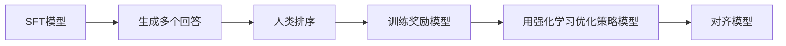

RLHF 能处理复杂偏好，但工程链路长，训练稳定性要求高。

### 8.3 DPO 流程

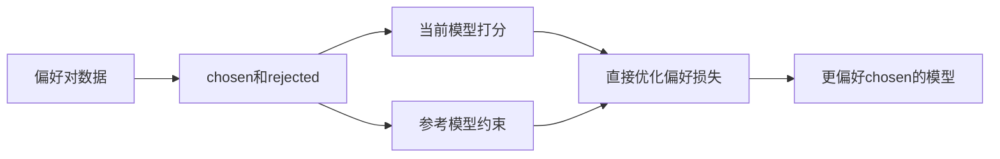

DPO 不需要显式训练奖励模型，也不需要典型 PPO 式在线强化学习流程，因此更简单稳定。它仍然需要高质量偏好数据和参考模型约束，避免模型偏离过大。

---

## 9. 超参数：从稳定开始，不要盲目追大

微调常用超参数包括：

| 超参数 | 含义 | 常见风险 |
| --- | --- | --- |
| learning rate | 学习率 | 太大破坏模型，太小学不动 |
| epochs | 训练轮数 | 过多容易过拟合 |
| batch size | 批大小 | 太小梯度噪声大，太大泛化可能变化 |
| warmup ratio | 预热比例 | 无预热时初期不稳定 |
| max sequence length | 最大长度 | 过短截断信息，过长显存高 |
| weight decay | 权重衰减 | 不当可能影响适配器训练 |
| LoRA rank | 适配器容量 | 太小欠拟合，太大过拟合或成本高 |
| LoRA alpha | 增量缩放 | 太强可能破坏原模型行为 |

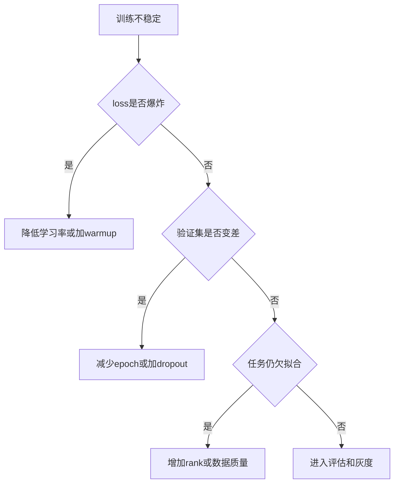

---

## 10. 评估：不要只看训练 loss

训练 loss 下降只说明模型更像训练数据，不说明它在真实业务中更好。

### 10.1 评估层次

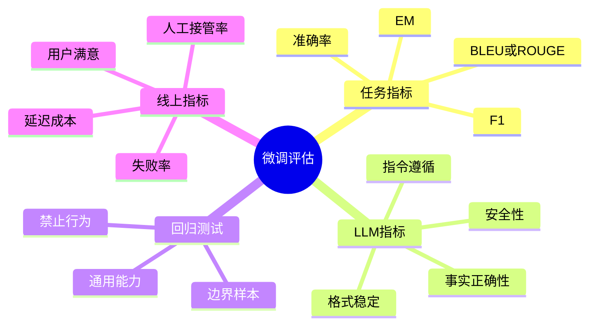

### 10.2 推荐评估集

至少准备四类：

1. **目标任务集**：证明微调确实提升目标任务。
2. **泛化测试集**：不同问法、不同难度、未见场景。
3. **安全和拒答集**：证明没有安全退化。
4. **通用能力回归集**：避免过拟合导致原能力下降。

### 10.3 人工评估要注意

如果用人类或 LLM-as-judge 评估，需要定义清晰 rubric：

- 事实是否正确。
- 是否遵守格式。
- 是否回答完整。
- 是否引用不存在信息。
- 是否拒绝不该拒绝的问题。
- 是否没有拒绝危险请求。

---

## 11. 微调常见风险

### 11.1 过拟合

模型在训练样本表现很好，在新问题上变差。

缓解：

- 减少 epoch。
- 提高数据多样性。
- 使用 validation early stopping。
- 降低 LoRA rank 或增加 dropout。

### 11.2 灾难性遗忘

模型为了适配新数据，损害原有通用能力。

缓解：

- 用较小学习率。
- PEFT 优先。
- 混入少量通用能力保持数据。
- 做通用能力回归测试。

### 11.3 幻觉并不会自动消失

微调可以改善回答格式和领域风格，但不能保证事实总是正确。对于需要可追溯知识的任务，仍应结合 RAG。

### 11.4 数据泄露和隐私记忆

模型可能记住训练样本中的敏感内容。训练前必须脱敏，部署后要测试敏感信息泄露风险。

---

## 12. 部署：Adapter、Merge 与版本管理

微调后的交付形态通常有两种：

### 12.1 Adapter 方式

保留基座模型不变，推理时加载 LoRA adapter。

优点：

- 多任务 adapter 管理方便。
- 基座模型复用。
- 回滚简单。

缺点：

- Serving 系统需要支持动态加载或选择 adapter。

### 12.2 Merge 方式

把 LoRA 增量合并进基座权重：

```text
W_merged = W + ΔW
```

优点：部署简单，推理路径更接近普通模型。  
缺点：每个任务可能需要一份合并模型，存储和版本管理成本更高。

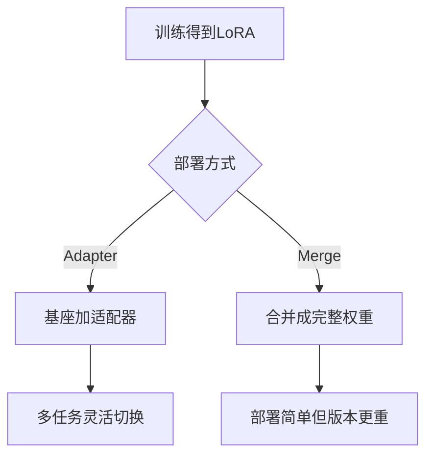

### 12.3 生产发布清单

- 记录基座模型版本。
- 记录训练数据版本和过滤规则。
- 记录超参数和随机种子。
- 保存评估报告。
- 支持灰度、回滚和 A/B 测试。
- 监控线上失败样本，进入下一轮数据闭环。

---

## 13. 微调与 RAG 如何组合？

微调和 RAG 不是互斥关系。

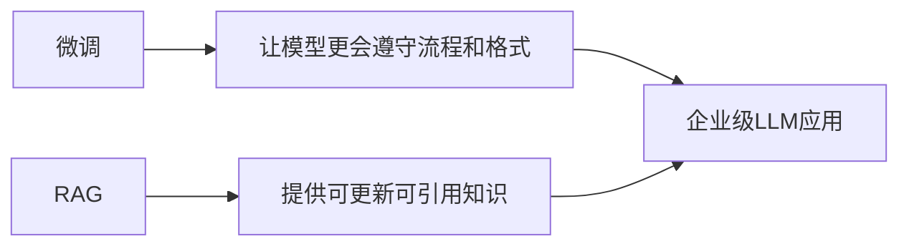

常见组合：

| 问题 | 方案 |
| --- | --- |
| 模型不会按公司格式输出 | 微调 |
| 模型不知道最新政策 | RAG |
| 检索到了材料但不会按业务流程回答 | 微调 + RAG |
| 工具调用参数经常错 | 微调工具调用样本 |
| 回答需要引用来源 | RAG 加引用约束 |

---

## 14. 决策流程：到底要不要微调？

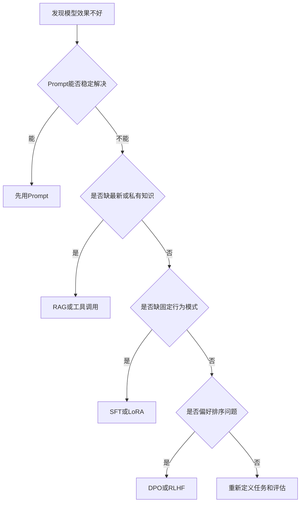

判断原则：

1. 能用 Prompt 解决的，不急着训练。
2. 知识更新频繁的，不优先塞进参数。
3. 格式、风格、流程、工具调用不稳定，可以微调。
4. 有偏好对比数据时，考虑 DPO。
5. 没有评估集，不要上线微调模型。

---

## 15. 最小微调项目模板

### 15.1 项目目标

```text
目标：让模型在客服场景中稳定输出三段式回答
约束：不能编造政策，不能泄露隐私，不能越权承诺
成功标准：格式通过率大于98%，事实错误率低于基线50%
```

### 15.2 数据样本

```json
{
  "messages": [
    {"role": "system", "content": "你是电商客服助手，必须先安抚，再核对，再给方案。"},
    {"role": "user", "content": "我的包裹三天没动了怎么办？"},
    {"role": "assistant", "content": "我理解你会担心。请先提供订单号，我会核对物流状态。若超过承诺时效，可为你申请催派或补偿流程。"}
  ]
}
```

### 15.3 训练和验证


---

## 16. 常见误区

### 误区 1：微调能让模型可靠记住所有知识

不可靠。参数化记忆不可追溯，更新成本高，且可能产生幻觉。动态知识优先 RAG。

### 误区 2：训练 loss 越低越好

不一定。训练 loss 很低可能是过拟合，必须看验证集和真实任务评估。

### 误区 3：LoRA rank 越大越好

不一定。rank 越大容量越强，但也更可能过拟合，成本更高。

### 误区 4：微调后不需要 Prompt

错误。微调固化习惯，Prompt 仍用于传递当前任务、约束、上下文和用户输入。

### 误区 5：微调可以替代安全策略

错误。微调是行为层优化，不等于完整安全系统。仍需要内容过滤、权限控制、审计和红队测试。

---

## 17. 学习自检

闭卷回答下面问题：

1. SFT 的 loss 是如何构造的？为什么 prompt 部分常被 mask？
2. LoRA 中 `ΔW = BA` 为什么能省参数？
3. QLoRA 为什么能在低显存下训练大模型？
4. 微调和 RAG 分别适合解决什么问题？
5. DPO 相比 RLHF 简化了什么？
6. 你会如何设计一个微调数据集的 train、validation、test？
7. 如何发现和缓解过拟合、灾难性遗忘、安全退化？
8. 微调模型上线前必须做哪些评估？

---

## 18. 速记卡片

### 18.1 方法卡

```text
SFT：模仿高质量答案
LoRA：冻结原模型，只训低秩增量
QLoRA：量化冻结基座，只训LoRA
DPO：用chosen与rejected直接优化偏好
RLHF：奖励模型加强化学习优化偏好
```

### 18.2 数据卡

```text
数据质量 > 数据数量
训练集学参数，验证集调超参，测试集做最终证明
敏感信息必须脱敏，坏答案会被模型认真学习
```

### 18.3 上线卡

```text
版本记录：基座模型 + 数据版本 + 训练代码 + 超参数 + 评估报告
发布策略：离线评估 → 灰度 → 监控 → 回滚 → 数据闭环
```

---

## 19. 总结

微调的本质是让模型在已有能力基础上形成稳定的任务行为。它最适合改变“怎么回答”，不适合单独承担“事实从哪里来”。


记住六个问题，就能拆解大部分微调项目：

1. 目标是知识、格式、风格、流程，还是偏好？
2. Prompt 或 RAG 能不能先解决？
3. 数据是否足够干净、覆盖真实分布？
4. 用全参、LoRA、QLoRA，还是 DPO？
5. 如何评估目标提升和副作用？
6. 如何部署、监控和回滚？

## 参考

- Hu et al., 2021, *LoRA: Low-Rank Adaptation of Large Language Models*, https://arxiv.org/abs/2106.09685
- Dettmers et al., 2023, *QLoRA: Efficient Finetuning of Quantized LLMs*, https://arxiv.org/abs/2305.14314
- Ouyang et al., 2022, *Training language models to follow instructions with human feedback*, https://arxiv.org/abs/2203.02155
- Rafailov et al., 2023, *Direct Preference Optimization: Your Language Model is Secretly a Reward Model*, https://arxiv.org/abs/2305.18290
