# LLM 微调面试 20 问：从训练机制到生产落地

## 使用方式

这份文档按面试高频问题组织。每个答案尽量做到：先一句话回答，再展开机制、风险和工程取舍。

> 面试答题口诀：**先判断是否该微调，再讲数据，再讲方法，再讲评估，最后讲上线风险。**

---

## 思维导图：高频考点地图

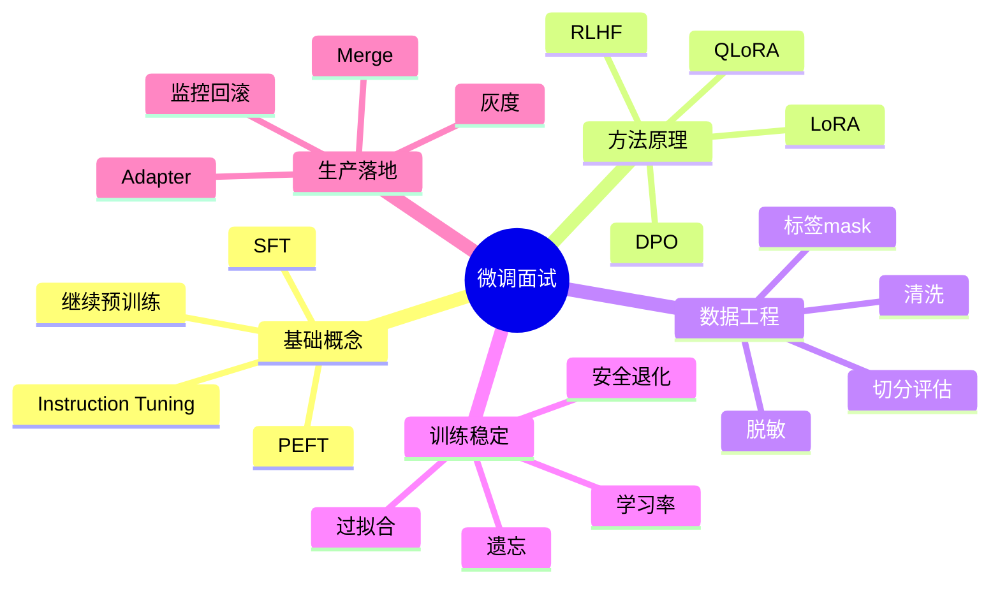

---

## Q1. 什么是 LLM 微调？它主要解决什么问题？

### 标准回答

LLM 微调是在预训练模型基础上，用目标任务或偏好数据继续训练，使模型更稳定地满足特定格式、风格、领域流程、工具调用或人类偏好。它主要解决“模型该如何回答”的行为适配问题，而不是单纯解决“模型缺少外部知识”的问题。


### 深入展开

微调常用于：

- 固定输出格式，比如 JSON、SQL、工具调用参数。
- 学习领域话术，比如客服、法律、医疗辅助写作。
- 学习业务流程，比如先问诊断信息再给建议。
- 学习偏好，比如更简洁、更安全、更符合品牌风格。

### 追问回答

如果面试官问“微调能否让模型记住公司知识库？”

答：可以让模型接触领域语料，但不适合把频繁变化、需要可追溯的知识都塞进参数。公司知识库通常优先用 RAG，微调用于让模型更会使用检索材料和遵守回答格式。

---

## Q2. 微调、Prompt Engineering、RAG、继续预训练有什么区别？

### 标准回答

Prompt 不改参数，适合快速约束当前输入；RAG 不改参数，通过检索外部知识增强回答；微调会更新模型参数或适配器，适合固化稳定行为；继续预训练用大规模领域文本延续语言建模，适合让模型熟悉领域分布。

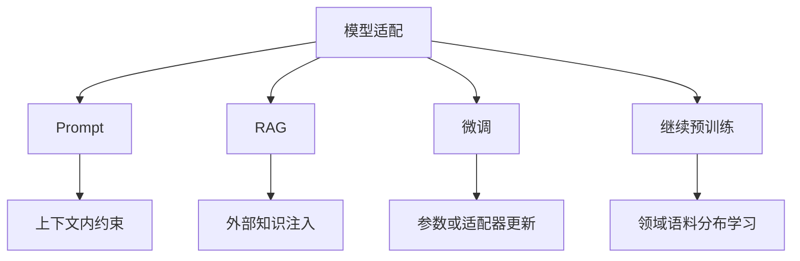

### 对比表

| 方法 | 是否改参数 | 适合问题 | 主要风险 |
| --- | --- | --- | --- |
| Prompt | 否 | 少量格式和任务约束 | 稳定性有限 |
| RAG | 否 | 最新、私有、可引用知识 | 检索失败和注入风险 |
| 微调 | 是 | 固化行为和偏好 | 过拟合、遗忘、安全退化 |
| 继续预训练 | 是 | 领域语言分布 | 成本高、仍需指令微调 |

### 速记

```text
Prompt管当前怎么说，RAG管材料从哪来，微调管长期习惯，预训练管底层能力。
```

---

## Q3. SFT 是什么？训练样本和 loss 如何构造？

### 标准回答

SFT 是监督微调，用“指令或上下文 -> 理想回答”的样本训练模型。对于 Decoder-only 模型，本质仍是 next token prediction；通常会把 prompt 部分的 label 设为 ignore，只对 assistant 回答部分计算交叉熵 loss。

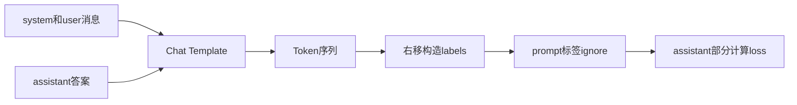

### 为什么 mask prompt

如果不 mask prompt，模型会学习复述 system 和 user 内容，而不是专注学习“在用户问题之后如何回答”。mask 掉 prompt 部分可以让 loss 更集中于 assistant 输出。

### 追问回答

问：所有 SFT 都必须 mask prompt 吗？  
答：不是绝对，但对指令微调和聊天模型很常见。具体取决于训练目标和数据格式。如果目标是普通语言建模或继续预训练，就不一定这样 mask。

---

## Q4. Instruction Tuning 和 SFT 是什么关系？

### 标准回答

Instruction Tuning 可以看作 SFT 的一种重要形式。它用大量“指令-回答”数据训练模型，让模型学会遵循人类自然语言指令。SFT 是训练范式，Instruction Tuning 是面向指令遵循能力的 SFT 数据组织方式。

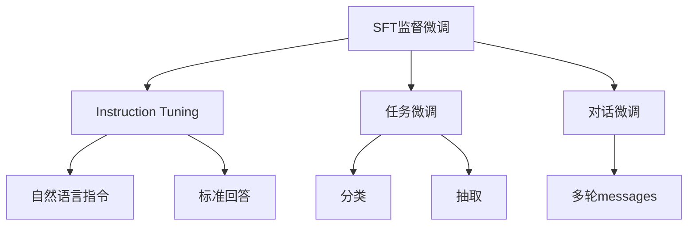

### 举例

Instruction Tuning 样本常长这样：

```text
指令：用三句话解释Transformer
回答：Transformer是一种...
```

而普通 SFT 也可以是情感分类、SQL 生成、摘要等特定任务。

### 速记

```text
SFT是训练方式，Instruction Tuning是让模型听懂指令的一类SFT。
```

---

## Q5. 全参数微调和 PEFT 有什么区别？

### 标准回答

全参数微调更新模型所有权重，适配能力强但显存、存储和部署成本高。PEFT 只训练少量新增参数或部分参数，例如 LoRA、Adapter、Prefix Tuning，成本低、便于多任务管理，但表达能力可能受限。

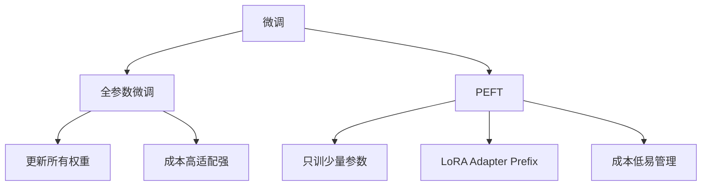

### 选择建议

| 场景              | 建议               |
| --------------- | ---------------- |
| 数据少、资源有限、需要快速试验 | LoRA 或 QLoRA     |
| 多个业务任务共享同一基座    | PEFT             |
| 需要深度改造模型能力且资源充足 | 全参数微调或继续预训练      |
| 只是格式不稳定         | 先 Prompt，再少量 SFT |

---

## Q6. LoRA 的核心原理是什么？为什么省参数？

### 标准回答

LoRA 冻结原始权重 `W`，只训练一个低秩增量 `ΔW`。它把 `ΔW` 分解成两个小矩阵 `B A`，rank `r` 远小于原矩阵维度，因此可训练参数大幅减少。

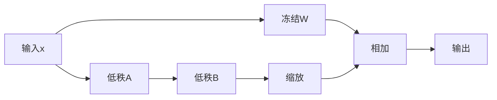

### 公式

$$
y = xW + \frac{\alpha}{r}xBA
$$

如果 `W` 是 `4096 × 4096`，完整矩阵约 1677 万参数；rank 为 8 的 LoRA 只需要约 6.5 万参数。

### 追问回答

问：LoRA 为什么不会直接破坏原模型？  
答：因为原权重冻结，LoRA 只学习一个增量分支。初始化通常让增量接近 0，训练初期模型行为接近原模型，更稳定。

---

## Q7. LoRA 中 rank、alpha、target_modules 怎么选？

### 标准回答

rank 控制适配器容量，越大表达力越强但参数和过拟合风险越高；alpha 控制 LoRA 增量缩放强度；target_modules 决定 LoRA 插入哪些线性层，常见是 q、k、v、o 投影和 MLP 投影层。

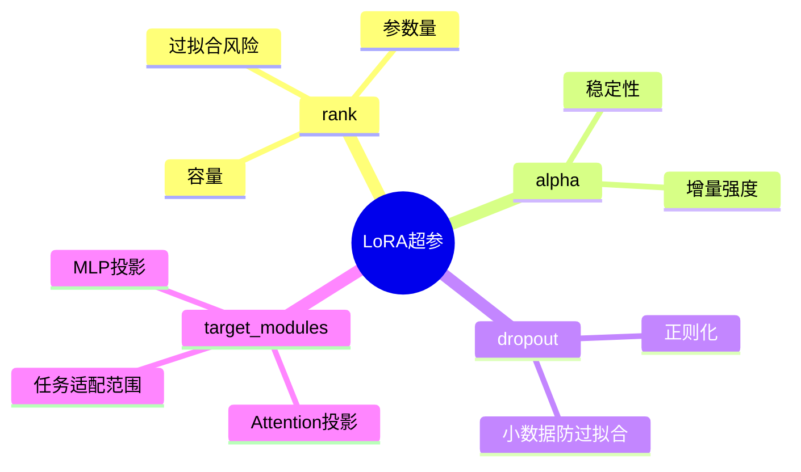

### 实践建议

- 数据少、任务简单：较小 rank。
- 任务复杂、格式和推理模式变化大：适当增大 rank 或覆盖更多模块。
- 只调 attention 可能不够，复杂任务可考虑 attention + MLP。
- 必须基于验证集和回归测试选择，而不是盲目追大。

---

## Q8. QLoRA 是什么？和 LoRA 有什么区别？

### 标准回答

QLoRA 是在量化后的冻结基座模型上训练 LoRA 适配器。LoRA 省的是可训练参数，QLoRA 进一步通过 4-bit 等量化降低基座模型显存占用，使低显存微调更大的模型成为可能。

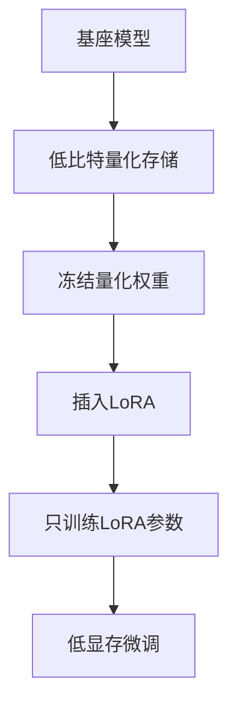

### 对比

| 维度 | LoRA | QLoRA |
| --- | --- | --- |
| 基座权重 | FP16/BF16 常见 | 4-bit 量化常见 |
| 训练参数 | LoRA | LoRA |
| 显存占用 | 低 | 更低 |
| 复杂度 | 中 | 更高 |

### 常见误区

QLoRA 不是把所有训练都变成 4-bit。通常是基座权重量化存储，LoRA 参数仍以较高精度训练，计算中也会涉及反量化或特定 dtype。

---

## Q9. DPO 是什么？它和 RLHF 有什么区别？

### 标准回答

DPO，Direct Preference Optimization，用 chosen/rejected 偏好对直接优化模型，使模型更倾向 chosen 而不是 rejected。相比 RLHF，DPO 不需要显式训练奖励模型，也不需要 PPO 式强化学习流程，工程更简单。

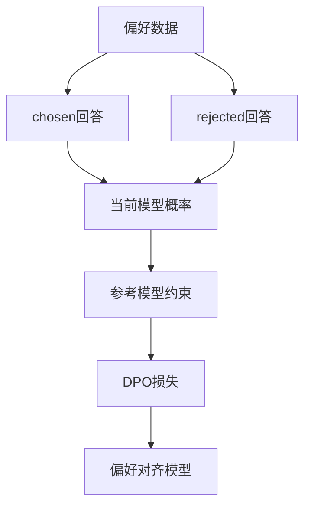

### RLHF 典型流程

```text
SFT模型 → 采样回答 → 人类排序 → 奖励模型 → 强化学习优化策略模型
```

DPO 则更像：

```text
偏好对 + 参考模型 → 直接优化语言模型
```

### 追问回答

问：DPO 是否一定优于 RLHF？  
答：不一定。DPO 简洁稳定，适合离线偏好数据；RLHF 更灵活但复杂。效果取决于数据质量、任务、训练配置和评估标准。

---

## Q10. 继续预训练和 SFT 应该如何配合？

### 标准回答

继续预训练让模型熟悉领域文本分布和术语，SFT 让模型学会按指令完成任务。常见顺序是先用大量领域无标注文本继续预训练，再用高质量指令数据做 SFT，最后可用偏好优化对齐。


### 适用场景

如果领域语言与通用语料差异很大，例如医学、法律、代码、专利、古文，继续预训练可能有帮助。但如果只是想让模型按格式回答，直接 SFT 或 Prompt 更合适。

---

## Q11. 微调数据应该如何清洗和构造？

### 标准回答

微调数据要围绕目标行为构造，保证正确、干净、多样、格式一致、无敏感泄露，并覆盖真实线上分布和边界场景。坏数据会被模型学习，高重复数据会放大偏差。

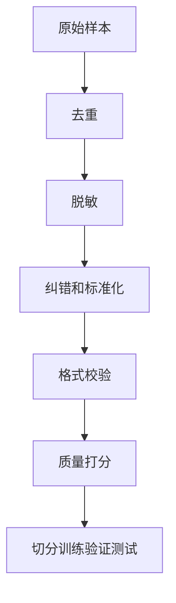

### 检查清单

- 是否有错误答案。
- 是否有敏感信息。
- 是否有大量重复模板。
- 是否覆盖困难样本和边界问题。
- 是否保留来源、版本和标注规则。
- 是否有独立测试集。

### 速记

```text
模型不会识别你的训练数据是不是垃圾，它只会认真学习。
```

---

## Q12. 如何设计微调评估集？

### 标准回答

评估集应该覆盖目标任务、泛化场景、安全边界和通用能力回归。不能只看训练 loss，也不能用训练样本证明模型有效。

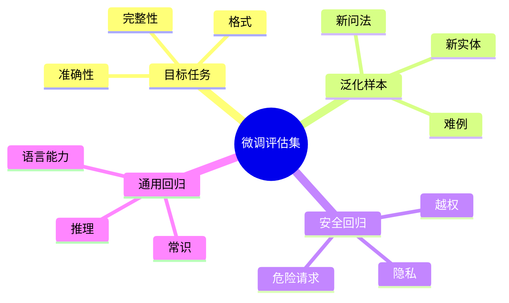

### 指标示例

| 目标 | 指标 |
| --- | --- |
| JSON 输出 | schema 通过率 |
| 分类任务 | Accuracy、F1 |
| 问答 | 人工评分、事实正确率 |
| 摘要 | ROUGE 加人工一致性 |
| 安全 | 拒答正确率、误拒率 |
| 工具调用 | 参数准确率、执行成功率 |

---

## Q13. 如何判断微调过拟合？怎么缓解？

### 标准回答

如果训练 loss 持续下降，但验证集指标下降，或者模型对训练样本表现很好、对新问法泛化差，就可能过拟合。缓解方法包括减少 epoch、降低学习率、增加数据多样性、使用 early stopping、降低 LoRA rank、增加 dropout。

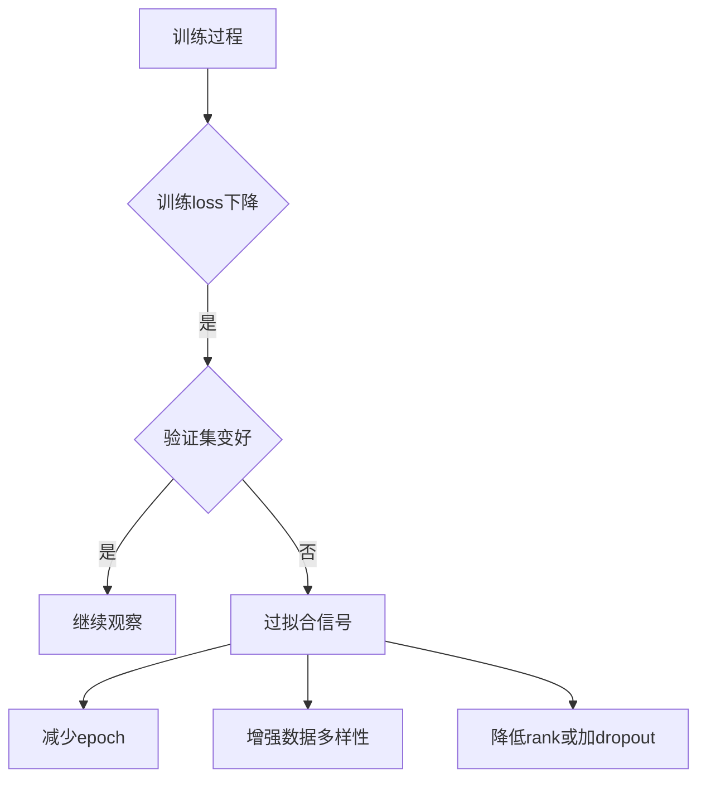

### 常见表现

- 输出越来越像训练模板，不会灵活变化。
- 对训练集问题几乎逐字复现。
- 新场景事实错误变多。
- 安全拒答边界变差。

---

## Q14. 什么是灾难性遗忘？如何避免？

### 标准回答

灾难性遗忘是模型在新任务微调后，原有通用能力或安全能力明显下降。避免方法包括使用 PEFT、小学习率、混入通用保持数据、限制训练轮数、做通用和安全回归评估。

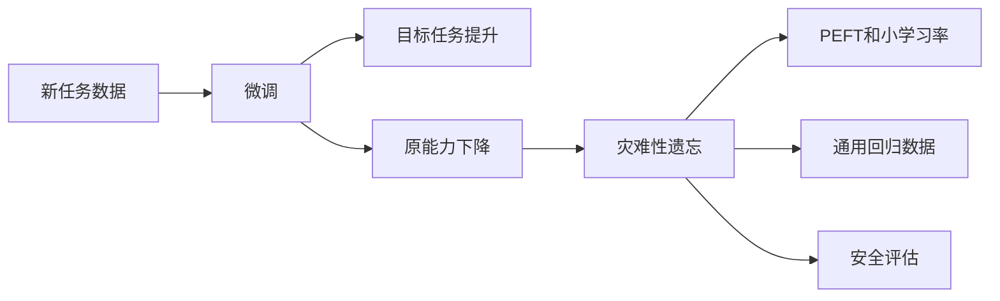

### 追问回答

问：LoRA 能完全避免遗忘吗？  
答：不能。LoRA 冻结基座，通常比全参微调更不容易破坏原模型，但适配器仍会影响输出分布，仍需回归测试。

---

## Q15. 微调为什么不能保证事实正确？

### 标准回答

微调优化的是模型在训练数据上的条件概率，不是事实数据库。它可能学到表达风格和常见知识，但不能保证知识最新、完整、可追溯。对于需要精确事实和来源的场景，应结合 RAG、工具调用或数据库查询。

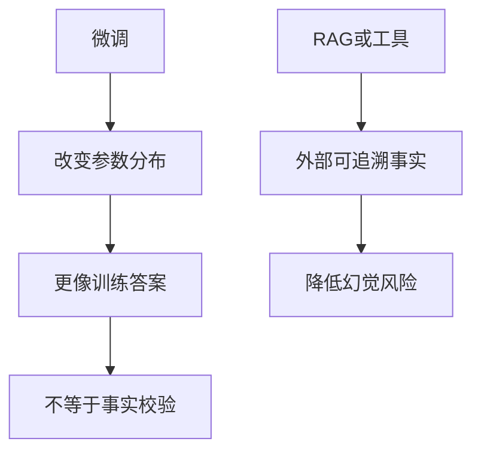

### 举例

如果公司退款政策每周变化，用微调更新模型：

- 训练成本高。
- 旧政策可能残留。
- 很难知道回答依据。

更合理：RAG 检索最新政策，微调让模型按客服流程解释政策。

---

## Q16. 微调后的 LoRA Adapter 要不要 merge？

### 标准回答

是否 merge 取决于部署需求。Adapter 不合并更灵活，适合多任务、多版本、快速回滚；merge 后推理路径简单，可能更方便部署，但每个任务会产生一份完整权重，版本和存储成本更高。

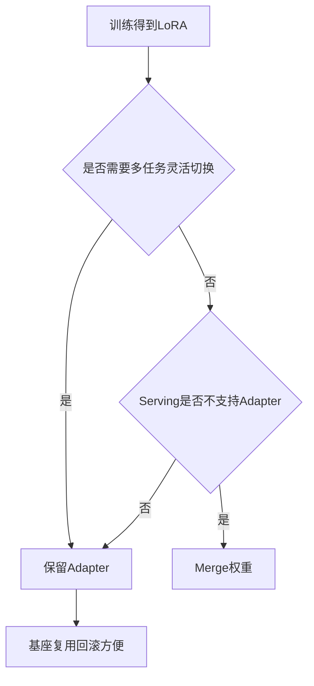

### 注意

Merge 前后要做一致性验证，尤其在量化部署场景中，merge、再量化、推理 dtype 都可能影响输出。

---

## Q17. 微调上线前必须做哪些检查？

### 标准回答

上线前至少要检查目标任务提升、通用能力回归、安全回归、格式稳定性、延迟成本、版本可追溯、灰度方案和回滚方案。

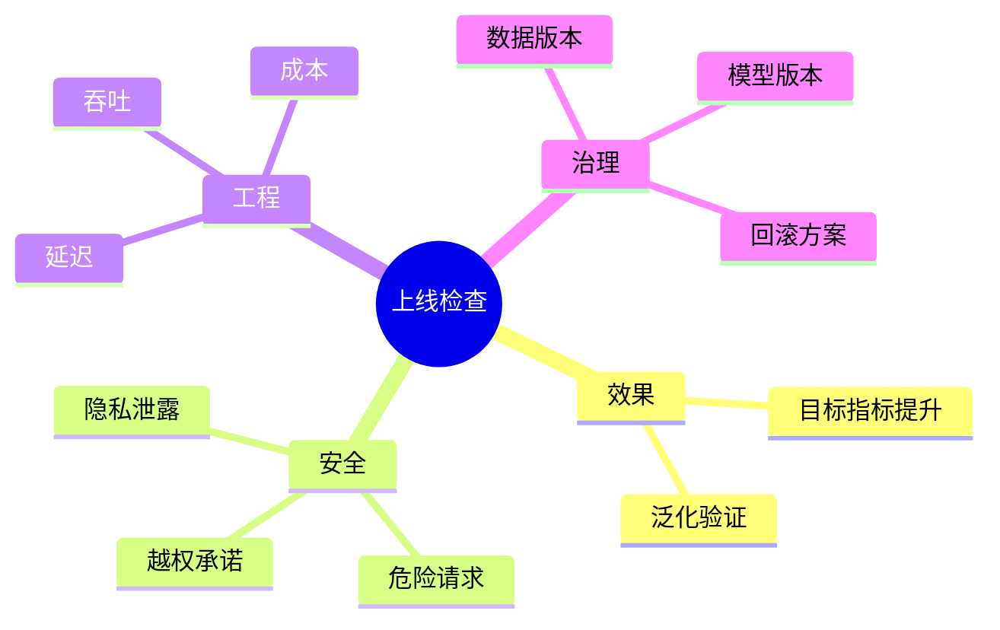

### 生产清单

- 基座模型版本。
- 训练数据版本和过滤规则。
- 训练代码 commit。
- 超参数和随机种子。
- 评估报告。
- 灰度范围。
- 监控指标。
- 回滚方式。

---

## Q18. 如果微调后模型输出格式更稳定，但事实错误变多，怎么办？

### 标准回答

这说明微调改善了行为格式，但没有解决事实来源，甚至可能让模型更自信地幻觉。应先定位错误来源：数据是否含错、是否过拟合、是否缺外部知识。解决方案通常是修正数据、降低训练强度、加入事实性评估，并结合 RAG 或工具查询。

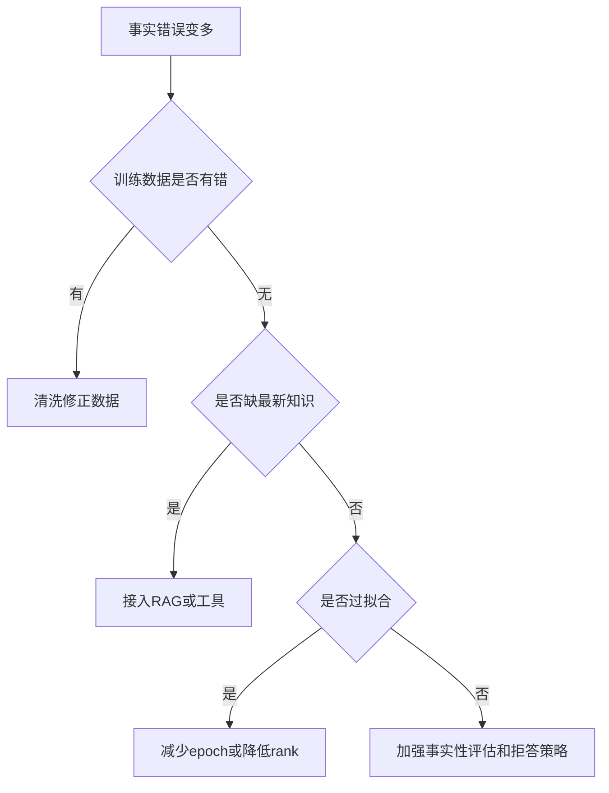

### 面试加分点

强调不要只用“格式通过率”作为上线指标。格式稳定和事实正确是两个不同维度。

---

## Q19. 如何选择学习率、epoch、batch size 等超参数？

### 标准回答

微调超参数应从保守稳定开始，通过验证集和回归集调整。学习率过大可能破坏模型行为，epoch 过多容易过拟合，batch size 影响梯度稳定性和吞吐。LoRA 场景还要调 rank、alpha、dropout 和 target_modules。

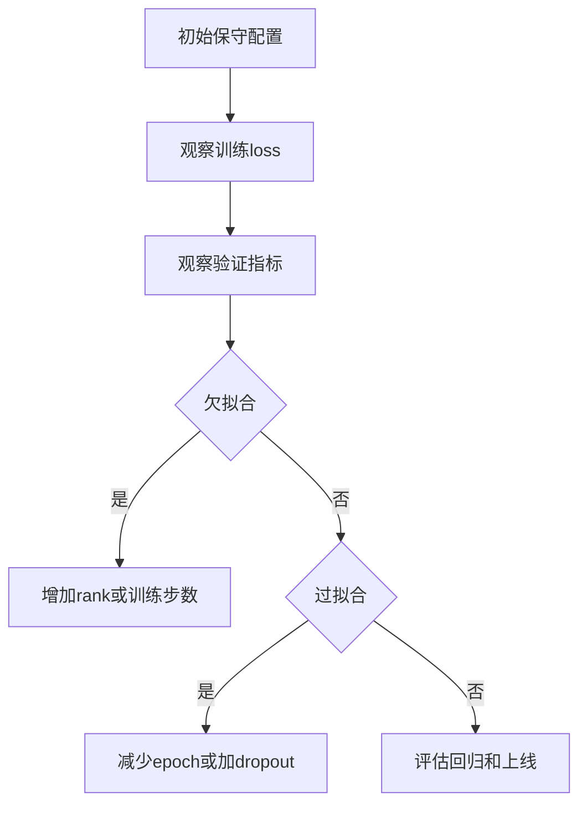

### 原则

- 不要只凭训练 loss 调参。
- 每次只改少量关键变量。
- 保留实验记录，避免不可复现。
- 小数据尤其要防过拟合。

---

## Q20. 给你一个业务场景，你如何设计完整微调方案？

### 标准回答

我会按“目标定义、方法选择、数据构造、训练、评估、部署、监控闭环”来设计。

```mermaid
flowchart TD
  A[业务问题] --> B[判断是否需要微调]
  B --> C[定义成功指标]
  C --> D[收集和清洗数据]
  D --> E[选择SFT LoRA QLoRA或DPO]
  E --> F[训练和调参]
  F --> G[离线评估]
  G --> H[安全和通用回归]
  H --> I[灰度上线]
  I --> J[监控和数据闭环]
```

### 60 秒回答模板

先确认问题是否真需要微调：如果是知识缺失，优先 RAG；如果是格式、流程、工具调用或风格不稳定，再考虑微调。然后定义指标，例如格式通过率、事实正确率、工具调用成功率和安全拒答率。数据上收集真实样本，脱敏、去重、纠错，切分 train/validation/test。资源有限时优先 LoRA 或 QLoRA，偏好问题可用 DPO。训练后不仅看 loss，还要做目标任务、泛化、安全、通用能力回归。上线采用灰度，记录数据和模型版本，监控失败样本并进入下一轮迭代。

---

## 面试快速复盘表

| 问题 | 关键词 | 最短答案 |
| --- | --- | --- |
| 微调是什么 | 行为适配 | 用任务数据改变模型长期习惯 |
| Prompt vs 微调 | 参数 | Prompt 不改参数，微调改参数或适配器 |
| SFT | 监督学习 | 模仿高质量答案 |
| label mask | ignore prompt | 只学 assistant 回答 |
| LoRA | 低秩增量 | 冻结 W，只训 BA |
| QLoRA | 量化基座 | 4-bit 基座加 LoRA |
| DPO | 偏好对 | 不显式训练奖励模型 |
| 过拟合 | 验证集变差 | 减 epoch、增数据、降 rank |
| 遗忘 | 原能力下降 | PEFT、小学习率、回归测试 |
| 幻觉 | 事实不保证 | RAG 或工具补事实来源 |
| 上线 | 灰度回滚 | 版本、评估、监控齐全 |

---

## 最终记忆图

```mermaid
mindmap
  root((微调总口诀))
    先判断
      Prompt能否解决
      RAG是否更合适
    再数据
      正确
      多样
      脱敏
      可评估
    选方法
      SFT
      LoRA
      QLoRA
      DPO
    控风险
      过拟合
      遗忘
      幻觉
      安全退化
    上生产
      版本记录
      灰度
      监控
      回滚
```
