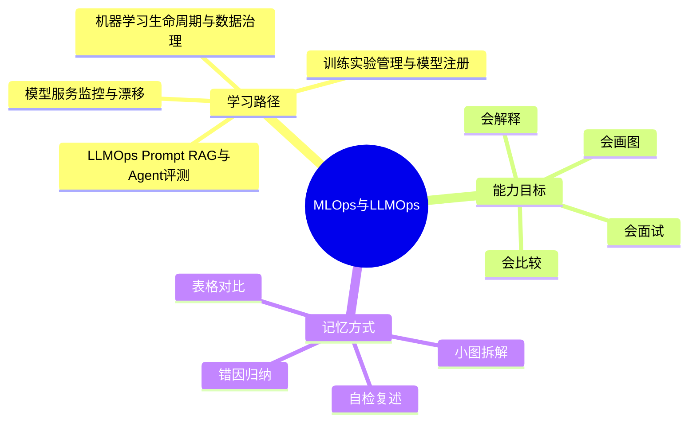
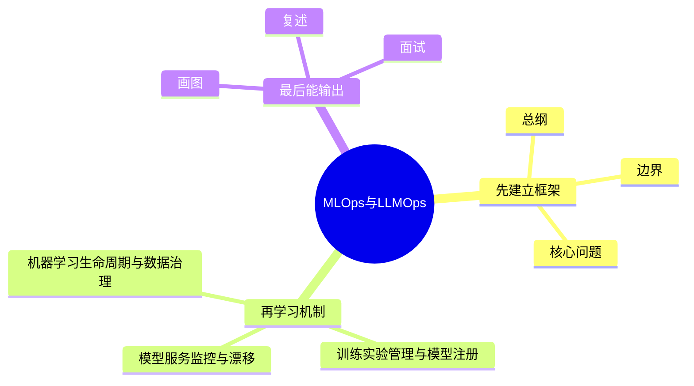
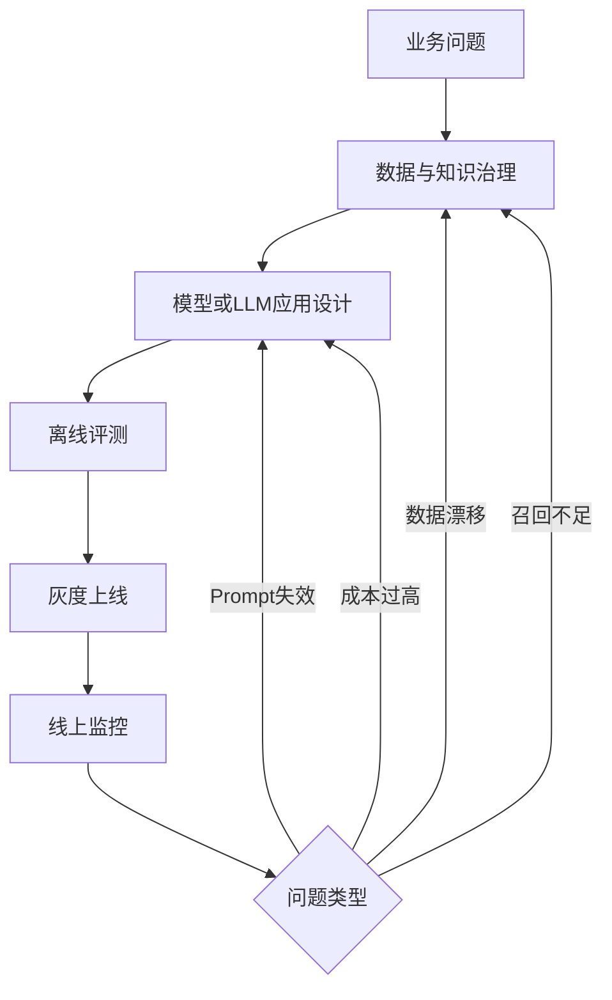

# MLOps与LLMOps学习路线与知识地图

## 学习目标
- 建立 MLOps与LLMOps 的整体知识框架。
- 明确每个章节解决什么问题、需要记住什么、如何用于工程或面试。
- 用多张小图和表格降低记忆负担，避免单张巨大思维导图。

## 一句话总纲
MLOps 管理机器学习从数据到上线的生命周期，LLMOps 在此基础上加入 Prompt、RAG、Agent、评测、安全和成本治理。

## 记忆口诀
> 数据可追，实验可复，模型可管，服务可观，LLM可评可控。

## 思维导图

## Mermaid 图解：学习路线

## 分文件章节安排
| 顺序 | 文件 | 学习重点 | 记忆抓手 |
|---|---|---|---|
| 第 1 章 | [[01-机器学习生命周期与数据治理]] | 理解数据采集、标注、特征、版本、质量和合规。 | 数据定上限，版本保复现 |
| 第 2 章 | [[02-训练实验管理与模型注册]] | 掌握实验跟踪、超参管理、模型注册、复现和审批。 | 参数可追，指标可比，模型可管 |
| 第 3 章 | [[03-模型服务监控与漂移]] | 理解模型部署、在线推理、A/B、监控、漂移和回滚。 | 上线不是终点，漂移要监控 |
| 第 4 章 | [[04-LLMOps Prompt RAG与Agent评测]] | 掌握 Prompt 管理、RAG 评测、Agent 工具调用和自动化评估。 | Prompt可版控，RAG可评测，Agent可追踪 |
| 第 5 章 | [[05-安全合规成本与持续改进]] | 理解隐私、安全、红队、成本控制和持续优化闭环。 | 安全有边界，成本可度量，反馈促迭代 |
| 面试 | [[20-MLOps与LLMOps面试20问]] | 高频问答、表达模板、易错点 | Q-A-图-口诀 |

## 推荐学习方法
1. 先读本路线，知道每章在全局中的位置。
2. 每章先看思维导图，再看概念解释，最后用自检题复述。
3. 面试题不要死背，按“定义 → 机制 → 适用场景 → 权衡 → 误区”回答。
4. 复杂图拆成小图，每次只记一个因果链或流程链。

## 自检题
- 你能用 1 分钟说清 MLOps与LLMOps 的核心问题吗？
- 你能指出每章最容易混淆的两个概念吗？
- 你能把章节图不看原文复画出来吗？

## 速记卡片
- 总纲：MLOps 管理机器学习从数据到上线的生命周期，LLMOps 在此基础上加入 Prompt、RAG、Agent、评测、安全和成本治理。
- 口诀：数据可追，实验可复，模型可管，服务可观，LLM可评可控。
- 面试表达：先定义边界，再解释机制，最后讲权衡和误区。

## 深度扩展：如何把本学科学到可迁移

### 1. 学科主线
把数据、实验、模型、Prompt、RAG、Agent、评测、安全和成本纳入可复现、可观测、可治理的生命周期。

这意味着学习时不要把章节看成离散文件，而要形成一条稳定链路：**问题从哪里来 → 需要哪些抽象 → 底层机制如何保证结果 → 代价和风险在哪里 → 如何验证理解是否正确**。

### 2. 小思维导图：三阶段学习法

### 3. 分阶段学习重点
| 阶段 | 目标 | 学习动作 | 产出物 |
|---|---|---|---|
| 入门 | 建立全局地图 | 先读路线，再快速浏览每章思维导图 | 能说清本学科解决什么问题 |
| 理解 | 掌握机制和边界 | 对每章画流程图、列前提条件 | 能解释为什么这样设计 |
| 应用 | 做题或工程迁移 | 用案例检查概念是否能落地 | 能选择方案并说出权衡 |
| 面试 | 形成表达模板 | 按 Q-A-图-误区复述 | 能稳定回答 20 个核心问题 |

### 4. 章节之间的关系
- **第 1 层：机器学习生命周期与数据治理** —— 学习时要问：它承接了前一章什么问题，又为后一章提供什么工具？
- **第 2 层：训练实验管理与模型注册** —— 学习时要问：它承接了前一章什么问题，又为后一章提供什么工具？
- **第 3 层：模型服务监控与漂移** —— 学习时要问：它承接了前一章什么问题，又为后一章提供什么工具？
- **第 4 层：LLMOps Prompt RAG与Agent评测** —— 学习时要问：它承接了前一章什么问题，又为后一章提供什么工具？
- **第 5 层：安全合规成本与持续改进** —— 学习时要问：它承接了前一章什么问题，又为后一章提供什么工具？

### 5. 复习闭环
- **风险提醒：** 最大风险是只关注模型效果，不管理数据版本、评测集、上线漂移、Prompt 变更和成本安全。
- **实践抓手：** 上线前必须回答：数据从哪来、指标如何评、失败如何回滚、日志如何追、成本如何控。
- **闭环方式：** 每学完一章，必须能完成“三件事”：复画图、讲反例、做迁移。

### 6. 总自检
1. 你能否不看目录，按依赖关系重新排列所有章节？
2. 你能否为每章说出一个工程场景或面试场景？
3. 你能否说明本学科与操作系统、网络、数据库、LLM 或后端工程的连接点？

## 专题深化：与其他学科的连接

- **本学科核心连接点：** 例如 RAG 问答上线要管理文档版本、切块方案、Embedding 模型、召回重排、Prompt 版本、回答引用、评测集和成本。
- **向上连接：** 可以支撑系统设计、工程实践、AI Agent 开发和面试表达。
- **向下连接：** 依赖数据结构、操作系统、计算机网络、数据库和数学基础中的概念。

### 学习产出标准
| 层次 | 能力表现 | 自检方式 |
|---|---|---|
| 记住 | 能说出核心名词 | 不看目录复述章节 |
| 理解 | 能画出机制图 | 给别人讲清流程 |
| 应用 | 能解决案例问题 | 用真实约束做方案选择 |
| 迁移 | 能跨学科解释 | 连接 OS/网络/数据库/LLM 场景 |

## 路线图再深化：从“模型能跑”到“系统可信”

### 1. 四条主线同时推进
MLOps/LLMOps 的学习不能只看模型训练或 Prompt 技巧，而要同时追踪四条线：

| 主线 | 关键问题 | 典型证据 | 常见失败 |
|---|---|---|---|
| 数据线 | 数据从哪里来，是否可追溯 | 数据版本、Schema、质量报告 | 训练/评测数据污染，线上分布漂移 |
| 模型线 | 模型如何训练、注册、发布 | 实验记录、模型卡、注册表 | 只保存权重，不保存环境和特征处理 |
| 应用线 | Prompt/RAG/Agent 如何稳定工作 | Prompt 版本、检索日志、轨迹记录 | Demo 有效，线上幻觉、越权或工具误用 |
| 治理线 | 成本、安全、合规如何闭环 | 预算阈值、权限审计、红队用例 | 指标只看效果，不看风险和成本 |

### 2. 小图：LLMOps 的闭环不是一条直线

### 3. 学习时的“底层追问”
- **数据治理：** 为什么同一份训练集必须记录版本、采样规则、清洗脚本和特征生成逻辑？因为没有这些元数据，实验结果不可复现。
- **实验管理：** 为什么只记录最终指标不够？因为排查退化时需要知道超参、随机种子、代码版本、依赖环境和数据切片。
- **模型服务：** 为什么线上指标要分层？因为延迟、错误率、漂移、置信度、业务转化和人工反馈反映不同故障面。
- **RAG/Agent：** 为什么必须记录检索结果和工具轨迹？因为回答错误往往来自“知识没召回”“召回了但没引用”“工具调用顺序错”。
- **安全成本：** 为什么成本治理要前置？因为 LLM 应用的输入长度、重试次数、工具调用和重排链路都会放大成本。

### 4. 工程落地检查表
| 阶段 | 必问问题 | 缺失后果 |
|---|---|---|
| 设计前 | 任务是否需要微调、RAG、Agent，还是规则系统足够？ | 过度工程，成本高且不可控 |
| 上线前 | 是否有离线集、对抗集、回归集和人工验收样例？ | 更新 Prompt/索引后无法判断是否退化 |
| 灰度中 | 是否按用户、流量、版本和场景切分指标？ | 平均值掩盖局部灾难 |
| 运行中 | 是否能追踪一次回答的 Prompt、检索、模型、工具和引用？ | 出错后无法复盘责任链 |
| 迭代中 | 是否把失败样例沉淀为数据、评测或规则？ | 同类问题反复出现 |

### 5. 面试表达模板
1. **先定边界：** MLOps 管模型生命周期，LLMOps 还要管 Prompt/RAG/Agent、评测、安全与成本。
2. **再讲链路：** 数据治理 → 实验训练 → 模型注册 → 服务部署 → 监控漂移 → 反馈迭代。
3. **补充 LLM 特有点：** 上下文、知识库、工具调用、越权访问、幻觉、引用可信度和 Token 成本。
4. **最后讲权衡：** 自动化越强，越需要观测、审计、回滚和人工兜底。

### 6. 记忆钩子
- **MLOps 记“数实模服监”：** 数据、实验、模型、服务、监控。
- **LLMOps 记“提检代评安成”：** Prompt、检索、Agent、评测、安全、成本。
- **排障记“先证据后猜测”：** 先查输入、版本、检索、Prompt、模型、工具轨迹，再讨论模型能力。

