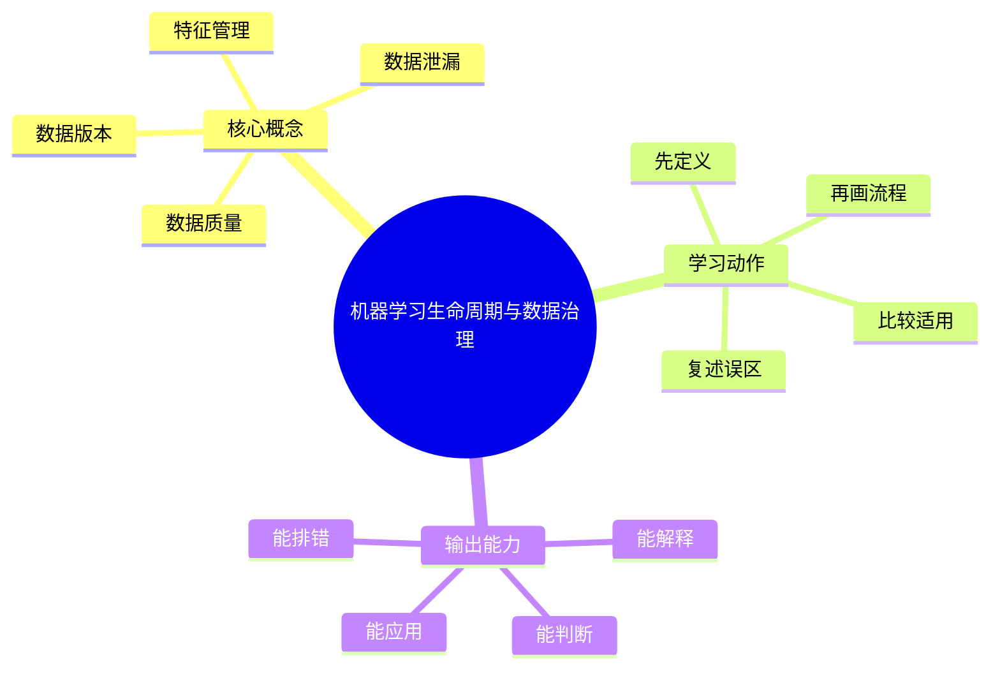

# MLOps与LLMOps：机器学习生命周期与数据治理

## 学习目标
- 理解数据采集、标注、特征、版本、质量和合规。
- 能画出本章核心流程图，并能用自己的话解释每个节点。
- 能说出适用场景、边界条件和常见误区。

## 一句话总纲
机器学习系统的上限常由数据质量和数据治理决定。

## 记忆口诀
> 数据定上限，版本保复现

## 思维导图

## Mermaid 图解：核心流程

## 分章节讲解
### 1. 数据版本
**核心定义：** 数据版本记录训练、验证和测试数据快照，使实验结果可追溯和可复现。

**理解路径：**
- 先明确它解决的具体问题，再判断它依赖的前提条件。
- 把它放回“机器学习系统的上限常由数据质量和数据治理决定。”这条主线中理解，不要孤立记忆。
- 学习时至少能说出：输入是什么、输出是什么、代价是什么、失败边界是什么。

**常见误区：** 只记录代码版本不够；数据变化会显著改变模型结果。

### 2. 数据质量
**核心定义：** 数据质量包括完整性、准确性、一致性、代表性和标签可靠性。

**理解路径：**
- 先明确它解决的具体问题，再判断它依赖的前提条件。
- 把它放回“机器学习系统的上限常由数据质量和数据治理决定。”这条主线中理解，不要孤立记忆。
- 学习时至少能说出：输入是什么、输出是什么、代价是什么、失败边界是什么。

**常见误区：** 更多数据不一定更好；低质量数据会系统性拉低模型。

### 3. 数据泄漏
**核心定义：** 数据泄漏指训练过程中使用了预测时不可获得的信息，导致离线效果虚高。

**理解路径：**
- 先明确它解决的具体问题，再判断它依赖的前提条件。
- 把它放回“机器学习系统的上限常由数据质量和数据治理决定。”这条主线中理解，不要孤立记忆。
- 学习时至少能说出：输入是什么、输出是什么、代价是什么、失败边界是什么。

**常见误区：** 随机切分在时间序列或用户级任务中可能造成泄漏。

### 4. 特征管理
**核心定义：** 特征管理统一离线训练和在线推理特征定义，减少训练服务偏差。

**理解路径：**
- 先明确它解决的具体问题，再判断它依赖的前提条件。
- 把它放回“机器学习系统的上限常由数据质量和数据治理决定。”这条主线中理解，不要孤立记忆。
- 学习时至少能说出：输入是什么、输出是什么、代价是什么、失败边界是什么。

**常见误区：** 训练和线上特征计算不一致会导致模型上线后性能下降。

## 关键对比表
| 知识点 | 正确理解 | 常见误区 |
|---|---|---|
| 数据版本 | 数据版本记录训练、验证和测试数据快照，使实验结果可追溯和可复现。 | 只记录代码版本不够；数据变化会显著改变模型结果。 |
| 数据质量 | 数据质量包括完整性、准确性、一致性、代表性和标签可靠性。 | 更多数据不一定更好；低质量数据会系统性拉低模型。 |
| 数据泄漏 | 数据泄漏指训练过程中使用了预测时不可获得的信息，导致离线效果虚高。 | 随机切分在时间序列或用户级任务中可能造成泄漏。 |
| 特征管理 | 特征管理统一离线训练和在线推理特征定义，减少训练服务偏差。 | 训练和线上特征计算不一致会导致模型上线后性能下降。 |

## 常见误区总结
- **数据版本：** 只记录代码版本不够；数据变化会显著改变模型结果。
- **数据质量：** 更多数据不一定更好；低质量数据会系统性拉低模型。
- **数据泄漏：** 随机切分在时间序列或用户级任务中可能造成泄漏。
- **特征管理：** 训练和线上特征计算不一致会导致模型上线后性能下降。

## 自检题
1. 本章的核心问题是什么？请用一句话回答：机器学习系统的上限常由数据质量和数据治理决定。
2. 本章每个概念的适用前提分别是什么？
3. 哪个误区最容易在面试或工程实践中出现？为什么？

## 速记卡片
- 章节口诀：数据定上限，版本保复现
- 答题结构：定义 → 机制 → 场景 → 权衡 → 误区。
- 复习动作：遮住正文，只根据思维导图复述一遍。

## 深度扩展：底层原理与应用边界

### 1. 本章在「MLOps与LLMOps」中的位置
- **核心定位：** 把数据、实验、模型、Prompt、RAG、Agent、评测、安全和成本纳入可复现、可观测、可治理的生命周期。
- **本章作用：** 「MLOps与LLMOps：机器学习生命周期与数据治理」负责把总纲落到可操作的判断框架：先确认问题边界，再拆解机制，最后根据代价和风险选择方法。
- **主要风险：** 最大风险是只关注模型效果，不管理数据版本、评测集、上线漂移、Prompt 变更和成本安全。
- **实践抓手：** 上线前必须回答：数据从哪来、指标如何评、失败如何回滚、日志如何追、成本如何控。

### 2. 小流程图：从概念到应用

### 3. 概念深化：逐个击破
#### 3.1 数据版本
- **先问它解决什么：** 数据版本 不是孤立名词，而是用来解决本章某类约束、关系、代价或风险判断的问题。
- **底层机制：** 学习时要拆成“输入条件 → 中间结构 → 处理规则 → 输出结果”四步；如果任何一步说不清，说明只是记住了结论。
- **适用条件：** 当前提满足、边界清楚、代价可接受时使用；如果输入分布、规模、时序、权限或一致性假设变化，就要重新评估。
- **不适用信号：** 需要违反前提才能套用、只能靠特殊样例解释、复杂度或维护成本明显失控时，应换方案。
- **面试表达：** “我会先定义 数据版本，再说明它依赖的前提，最后用一个反例说明边界。”

#### 3.2 数据质量
- **先问它解决什么：** 数据质量 不是孤立名词，而是用来解决本章某类约束、关系、代价或风险判断的问题。
- **底层机制：** 学习时要拆成“输入条件 → 中间结构 → 处理规则 → 输出结果”四步；如果任何一步说不清，说明只是记住了结论。
- **适用条件：** 当前提满足、边界清楚、代价可接受时使用；如果输入分布、规模、时序、权限或一致性假设变化，就要重新评估。
- **不适用信号：** 需要违反前提才能套用、只能靠特殊样例解释、复杂度或维护成本明显失控时，应换方案。
- **面试表达：** “我会先定义 数据质量，再说明它依赖的前提，最后用一个反例说明边界。”

#### 3.3 数据泄漏
- **先问它解决什么：** 数据泄漏 不是孤立名词，而是用来解决本章某类约束、关系、代价或风险判断的问题。
- **底层机制：** 学习时要拆成“输入条件 → 中间结构 → 处理规则 → 输出结果”四步；如果任何一步说不清，说明只是记住了结论。
- **适用条件：** 当前提满足、边界清楚、代价可接受时使用；如果输入分布、规模、时序、权限或一致性假设变化，就要重新评估。
- **不适用信号：** 需要违反前提才能套用、只能靠特殊样例解释、复杂度或维护成本明显失控时，应换方案。
- **面试表达：** “我会先定义 数据泄漏，再说明它依赖的前提，最后用一个反例说明边界。”

#### 3.4 特征管理
- **先问它解决什么：** 特征管理 不是孤立名词，而是用来解决本章某类约束、关系、代价或风险判断的问题。
- **底层机制：** 学习时要拆成“输入条件 → 中间结构 → 处理规则 → 输出结果”四步；如果任何一步说不清，说明只是记住了结论。
- **适用条件：** 当前提满足、边界清楚、代价可接受时使用；如果输入分布、规模、时序、权限或一致性假设变化，就要重新评估。
- **不适用信号：** 需要违反前提才能套用、只能靠特殊样例解释、复杂度或维护成本明显失控时，应换方案。
- **面试表达：** “我会先定义 特征管理，再说明它依赖的前提，最后用一个反例说明边界。”

### 4. 适用边界对比表
| 判断维度 | 应该怎么想 | 典型错误 | 记忆提示 |
|---|---|---|---|
| 前提条件 | 先列出输入规模、数据分布、系统假设或业务约束 | 不看条件直接套模板 | 先问“凭什么能用” |
| 正确性 | 需要能说明为什么结果保持不变或为什么局部选择成立 | 只给经验结论 | 用不变量、反例或交换论证检查 |
| 复杂度/成本 | 同时估算时间、空间、延迟、吞吐、人力和维护成本 | 只看理论最优 | 工程里还要看常数和可观测性 |
| 失败模式 | 主动说明边界外会怎样失败 | 面试中只讲优点 | 能说失败边界才算真理解 |

### 5. 记忆强化：三层复述法
1. **概念层：** 用一句话定义本章每个核心概念。
2. **机制层：** 不看原文画出输入到输出的流程。
3. **边界层：** 为每个概念准备一个“不能这样用”的反例。

### 6. 工程/做题/面试迁移
- **工程迁移：** 上线前必须回答：数据从哪来、指标如何评、失败如何回滚、日志如何追、成本如何控。
- **做题迁移：** 先把题目中的对象、关系、约束和目标函数圈出来，再映射到本章概念。
- **面试迁移：** 回答时不要只报名词，要说清“为什么需要它、它如何工作、它何时失效”。

### 7. 深度自检题
1. 你能否把本章概念按“前提 → 机制 → 结果 → 代价”重新组织？
2. 如果输入规模、并发量、数据分布或安全边界变化，原结论是否仍成立？
3. 本章哪个概念最容易被误用？请给出一个反例。
4. 如果让你设计一道面试题，你会怎样考察候选人是否真的理解？

### 8. 深度速记卡片
- **总抓手：** 把数据、实验、模型、Prompt、RAG、Agent、评测、安全和成本纳入可复现、可观测、可治理的生命周期。
- **答题模板：** 定义边界 → 拆底层机制 → 说适用条件 → 讲权衡 → 给反例。
- **复习动作：** 每次复习只看图和表，尝试口述 3 分钟；卡住处再回正文。

## 专题深化：具体机制、案例与追问

### 1. 具体案例：把「机器学习生命周期与数据治理」放进真实问题
例如 RAG 问答上线要管理文档版本、切块方案、Embedding 模型、召回重排、Prompt 版本、回答引用、评测集和成本。

### 2. 本章关键机制细化
- 数据版本和质量决定模型可复现性。
- 训练服务偏差常来自离线和在线特征不一致。
- 数据泄漏会让离线评估虚高。

### 3. 概念到判断的检查清单
| 概念/动作 | 你要检查什么 | 如果检查失败会怎样 |
|---|---|---|
| 数据版本 | 前提、输入、输出、代价、失败边界是否都说清 | 可能套错模型、复杂度失控或得到不可验证结论 |
| 数据质量 | 前提、输入、输出、代价、失败边界是否都说清 | 可能套错模型、复杂度失控或得到不可验证结论 |
| 数据泄漏 | 前提、输入、输出、代价、失败边界是否都说清 | 可能套错模型、复杂度失控或得到不可验证结论 |
| 特征管理 | 前提、输入、输出、代价、失败边界是否都说清 | 可能套错模型、复杂度失控或得到不可验证结论 |
| 本章在「MLOps与LLMOps」中的位置 | 前提、输入、输出、代价、失败边界是否都说清 | 可能套错模型、复杂度失控或得到不可验证结论 |

### 4. 面试追问路径

- 数据和 Prompt 是否可追溯？
- 评测能否定位检索错还是生成错？
- 线上漂移、注入和成本如何监控？

### 5. 验证与复盘
- **验证方式：** 用固定评测集、轨迹日志、人工抽检、线上监控和回滚演练验证。
- **复盘方式：** 每次做题或设计后，记录“我使用了哪个前提、哪个前提最容易被破坏、如果破坏如何调整”。
- **记忆方式：** 不背孤立结论，只背“问题 → 机制 → 边界 → 验证”的链路。
