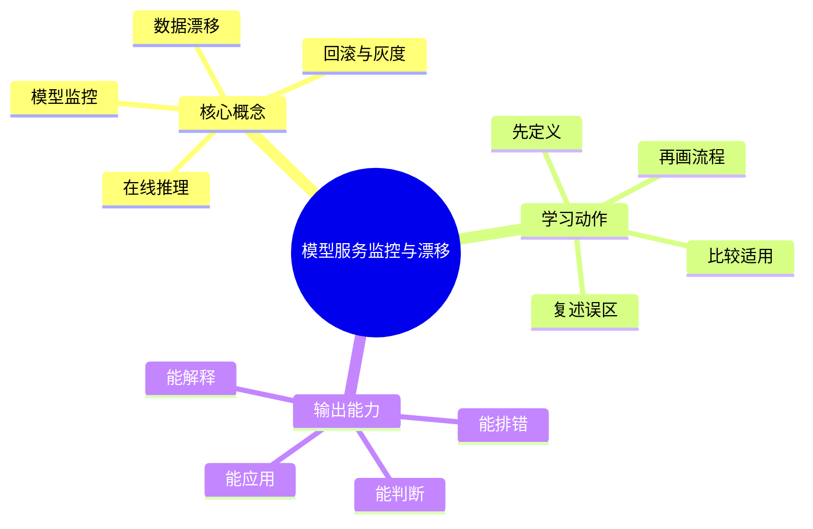

# MLOps与LLMOps：模型服务监控与漂移

## 学习目标
- 理解模型部署、在线推理、A/B、监控、漂移和回滚。
- 能画出本章核心流程图，并能用自己的话解释每个节点。
- 能说出适用场景、边界条件和常见误区。

## 一句话总纲
模型上线后会遇到数据分布变化，必须持续监控输入、输出和业务指标。

## 记忆口诀
> 上线不是终点，漂移要监控

## 思维导图

## Mermaid 图解：核心流程

## 分章节讲解
### 1. 在线推理
**核心定义：** 在线推理要求模型以受控延迟和可用性响应请求，需考虑批处理、缓存和资源隔离。

**理解路径：**
- 先明确它解决的具体问题，再判断它依赖的前提条件。
- 把它放回“模型上线后会遇到数据分布变化，必须持续监控输入、输出和业务指标。”这条主线中理解，不要孤立记忆。
- 学习时至少能说出：输入是什么、输出是什么、代价是什么、失败边界是什么。

**常见误区：** 离线吞吐高不代表在线延迟达标。

### 2. 模型监控
**核心定义：** 模型监控包括服务指标、输入分布、输出分布、业务指标和人工反馈。

**理解路径：**
- 先明确它解决的具体问题，再判断它依赖的前提条件。
- 把它放回“模型上线后会遇到数据分布变化，必须持续监控输入、输出和业务指标。”这条主线中理解，不要孤立记忆。
- 学习时至少能说出：输入是什么、输出是什么、代价是什么、失败边界是什么。

**常见误区：** 没有真实标签时也可先监控数据漂移和置信度变化。

### 3. 数据漂移
**核心定义：** 数据漂移是线上输入分布相对训练数据变化，可能导致模型效果下降。

**理解路径：**
- 先明确它解决的具体问题，再判断它依赖的前提条件。
- 把它放回“模型上线后会遇到数据分布变化，必须持续监控输入、输出和业务指标。”这条主线中理解，不要孤立记忆。
- 学习时至少能说出：输入是什么、输出是什么、代价是什么、失败边界是什么。

**常见误区：** 漂移不必然意味着模型坏了；要结合任务指标和标签验证。

### 4. 回滚与灰度
**核心定义：** 模型发布应支持灰度、影子流量、A/B 测试和快速回滚。

**理解路径：**
- 先明确它解决的具体问题，再判断它依赖的前提条件。
- 把它放回“模型上线后会遇到数据分布变化，必须持续监控输入、输出和业务指标。”这条主线中理解，不要孤立记忆。
- 学习时至少能说出：输入是什么、输出是什么、代价是什么、失败边界是什么。

**常见误区：** 一次性全量替换模型会放大风险。

## 关键对比表
| 知识点 | 正确理解 | 常见误区 |
|---|---|---|
| 在线推理 | 在线推理要求模型以受控延迟和可用性响应请求，需考虑批处理、缓存和资源隔离。 | 离线吞吐高不代表在线延迟达标。 |
| 模型监控 | 模型监控包括服务指标、输入分布、输出分布、业务指标和人工反馈。 | 没有真实标签时也可先监控数据漂移和置信度变化。 |
| 数据漂移 | 数据漂移是线上输入分布相对训练数据变化，可能导致模型效果下降。 | 漂移不必然意味着模型坏了；要结合任务指标和标签验证。 |
| 回滚与灰度 | 模型发布应支持灰度、影子流量、A/B 测试和快速回滚。 | 一次性全量替换模型会放大风险。 |

## 常见误区总结
- **在线推理：** 离线吞吐高不代表在线延迟达标。
- **模型监控：** 没有真实标签时也可先监控数据漂移和置信度变化。
- **数据漂移：** 漂移不必然意味着模型坏了；要结合任务指标和标签验证。
- **回滚与灰度：** 一次性全量替换模型会放大风险。

## 自检题
1. 本章的核心问题是什么？请用一句话回答：模型上线后会遇到数据分布变化，必须持续监控输入、输出和业务指标。
2. 本章每个概念的适用前提分别是什么？
3. 哪个误区最容易在面试或工程实践中出现？为什么？

## 速记卡片
- 章节口诀：上线不是终点，漂移要监控
- 答题结构：定义 → 机制 → 场景 → 权衡 → 误区。
- 复习动作：遮住正文，只根据思维导图复述一遍。

## 深度扩展：底层原理与应用边界

### 1. 本章在「MLOps与LLMOps」中的位置
- **核心定位：** 把数据、实验、模型、Prompt、RAG、Agent、评测、安全和成本纳入可复现、可观测、可治理的生命周期。
- **本章作用：** 「MLOps与LLMOps：模型服务监控与漂移」负责把总纲落到可操作的判断框架：先确认问题边界，再拆解机制，最后根据代价和风险选择方法。
- **主要风险：** 最大风险是只关注模型效果，不管理数据版本、评测集、上线漂移、Prompt 变更和成本安全。
- **实践抓手：** 上线前必须回答：数据从哪来、指标如何评、失败如何回滚、日志如何追、成本如何控。

### 2. 小流程图：从概念到应用

### 3. 概念深化：逐个击破
#### 3.1 在线推理
- **先问它解决什么：** 在线推理 不是孤立名词，而是用来解决本章某类约束、关系、代价或风险判断的问题。
- **底层机制：** 学习时要拆成“输入条件 → 中间结构 → 处理规则 → 输出结果”四步；如果任何一步说不清，说明只是记住了结论。
- **适用条件：** 当前提满足、边界清楚、代价可接受时使用；如果输入分布、规模、时序、权限或一致性假设变化，就要重新评估。
- **不适用信号：** 需要违反前提才能套用、只能靠特殊样例解释、复杂度或维护成本明显失控时，应换方案。
- **面试表达：** “我会先定义 在线推理，再说明它依赖的前提，最后用一个反例说明边界。”

#### 3.2 模型监控
- **先问它解决什么：** 模型监控 不是孤立名词，而是用来解决本章某类约束、关系、代价或风险判断的问题。
- **底层机制：** 学习时要拆成“输入条件 → 中间结构 → 处理规则 → 输出结果”四步；如果任何一步说不清，说明只是记住了结论。
- **适用条件：** 当前提满足、边界清楚、代价可接受时使用；如果输入分布、规模、时序、权限或一致性假设变化，就要重新评估。
- **不适用信号：** 需要违反前提才能套用、只能靠特殊样例解释、复杂度或维护成本明显失控时，应换方案。
- **面试表达：** “我会先定义 模型监控，再说明它依赖的前提，最后用一个反例说明边界。”

#### 3.3 数据漂移
- **先问它解决什么：** 数据漂移 不是孤立名词，而是用来解决本章某类约束、关系、代价或风险判断的问题。
- **底层机制：** 学习时要拆成“输入条件 → 中间结构 → 处理规则 → 输出结果”四步；如果任何一步说不清，说明只是记住了结论。
- **适用条件：** 当前提满足、边界清楚、代价可接受时使用；如果输入分布、规模、时序、权限或一致性假设变化，就要重新评估。
- **不适用信号：** 需要违反前提才能套用、只能靠特殊样例解释、复杂度或维护成本明显失控时，应换方案。
- **面试表达：** “我会先定义 数据漂移，再说明它依赖的前提，最后用一个反例说明边界。”

#### 3.4 回滚与灰度
- **先问它解决什么：** 回滚与灰度 不是孤立名词，而是用来解决本章某类约束、关系、代价或风险判断的问题。
- **底层机制：** 学习时要拆成“输入条件 → 中间结构 → 处理规则 → 输出结果”四步；如果任何一步说不清，说明只是记住了结论。
- **适用条件：** 当前提满足、边界清楚、代价可接受时使用；如果输入分布、规模、时序、权限或一致性假设变化，就要重新评估。
- **不适用信号：** 需要违反前提才能套用、只能靠特殊样例解释、复杂度或维护成本明显失控时，应换方案。
- **面试表达：** “我会先定义 回滚与灰度，再说明它依赖的前提，最后用一个反例说明边界。”

### 4. 适用边界对比表
| 判断维度 | 应该怎么想 | 典型错误 | 记忆提示 |
|---|---|---|---|
| 前提条件 | 先列出输入规模、数据分布、系统假设或业务约束 | 不看条件直接套模板 | 先问“凭什么能用” |
| 正确性 | 需要能说明为什么结果保持不变或为什么局部选择成立 | 只给经验结论 | 用不变量、反例或交换论证检查 |
| 复杂度/成本 | 同时估算时间、空间、延迟、吞吐、人力和维护成本 | 只看理论最优 | 工程里还要看常数和可观测性 |
| 失败模式 | 主动说明边界外会怎样失败 | 面试中只讲优点 | 能说失败边界才算真理解 |

### 5. 记忆强化：三层复述法
1. **概念层：** 用一句话定义本章每个核心概念。
2. **机制层：** 不看原文画出输入到输出的流程。
3. **边界层：** 为每个概念准备一个“不能这样用”的反例。

### 6. 工程/做题/面试迁移
- **工程迁移：** 上线前必须回答：数据从哪来、指标如何评、失败如何回滚、日志如何追、成本如何控。
- **做题迁移：** 先把题目中的对象、关系、约束和目标函数圈出来，再映射到本章概念。
- **面试迁移：** 回答时不要只报名词，要说清“为什么需要它、它如何工作、它何时失效”。

### 7. 深度自检题
1. 你能否把本章概念按“前提 → 机制 → 结果 → 代价”重新组织？
2. 如果输入规模、并发量、数据分布或安全边界变化，原结论是否仍成立？
3. 本章哪个概念最容易被误用？请给出一个反例。
4. 如果让你设计一道面试题，你会怎样考察候选人是否真的理解？

### 8. 深度速记卡片
- **总抓手：** 把数据、实验、模型、Prompt、RAG、Agent、评测、安全和成本纳入可复现、可观测、可治理的生命周期。
- **答题模板：** 定义边界 → 拆底层机制 → 说适用条件 → 讲权衡 → 给反例。
- **复习动作：** 每次复习只看图和表，尝试口述 3 分钟；卡住处再回正文。

## 专题深化：具体机制、案例与追问

### 1. 具体案例：把「模型服务监控与漂移」放进真实问题
例如 RAG 问答上线要管理文档版本、切块方案、Embedding 模型、召回重排、Prompt 版本、回答引用、评测集和成本。

### 2. 本章关键机制细化
- 线上推理关注延迟、吞吐、可用性和资源成本。
- 漂移不一定代表模型失效，但必须触发分析。
- 灰度和影子流量降低模型替换风险。

### 3. 概念到判断的检查清单
| 概念/动作 | 你要检查什么 | 如果检查失败会怎样 |
|---|---|---|
| 在线推理 | 前提、输入、输出、代价、失败边界是否都说清 | 可能套错模型、复杂度失控或得到不可验证结论 |
| 模型监控 | 前提、输入、输出、代价、失败边界是否都说清 | 可能套错模型、复杂度失控或得到不可验证结论 |
| 数据漂移 | 前提、输入、输出、代价、失败边界是否都说清 | 可能套错模型、复杂度失控或得到不可验证结论 |
| 回滚与灰度 | 前提、输入、输出、代价、失败边界是否都说清 | 可能套错模型、复杂度失控或得到不可验证结论 |
| 本章在「MLOps与LLMOps」中的位置 | 前提、输入、输出、代价、失败边界是否都说清 | 可能套错模型、复杂度失控或得到不可验证结论 |

### 4. 面试追问路径

- 数据和 Prompt 是否可追溯？
- 评测能否定位检索错还是生成错？
- 线上漂移、注入和成本如何监控？

### 5. 验证与复盘
- **验证方式：** 用固定评测集、轨迹日志、人工抽检、线上监控和回滚演练验证。
- **复盘方式：** 每次做题或设计后，记录“我使用了哪个前提、哪个前提最容易被破坏、如果破坏如何调整”。
- **记忆方式：** 不背孤立结论，只背“问题 → 机制 → 边界 → 验证”的链路。

## 本轮扩写：模型服务指标、漂移诊断与灰度回滚

### 1. 模型服务监控要同时看系统指标和模型指标
| 层次 | 指标 | 能回答的问题 | 常见误区 |
|---|---|---|---|
| 系统层 | QPS、延迟、错误率、GPU/CPU 利用率 | 服务是否健康 | 只看平均延迟 |
| 数据层 | 缺失率、分布、枚举值、特征延迟 | 输入是否变了 | 只监控训练集质量 |
| 模型层 | 置信度、校准、拒答率、命中率 | 预测是否可靠 | 没有线上反馈闭环 |
| 业务层 | 转化、留存、投诉、人工审核通过率 | 是否创造价值 | 离线指标好就直接全量 |

### 2. 漂移诊断流程

- **数据漂移：** 输入分布变化，但标签关系未必变化。
- **概念漂移：** 输入到标签的关系变化，例如用户偏好变化。
- **反馈延迟：** 标签晚到导致评估滞后，需要代理指标和人工抽检。
- **采样偏差：** 线上收集的数据被策略本身影响，不能直接当真实分布。

### 3. 模型灰度与回滚
- Shadow 模式只旁路打分，不影响用户，用于比较延迟、资源和预测分布。
- Canary 模式让小流量真实使用新模型，必须设置停止条件。
- 回滚不仅回模型权重，还要回特征处理、Prompt、检索索引和阈值。
- 回滚后要保留失败样本，用于再训练或评测集补充。

### 4. 面试追问路径
- “模型线上效果下降怎么排查？”——按数据、特征、模型、服务、业务反馈逐层定位。
- “没有实时标签怎么办？”——使用代理指标、延迟标签回填、人工抽检和分群分析。
- “为什么不能只看 AUC？”——AUC 不等于业务收益，也不反映校准、延迟、成本和公平性。
