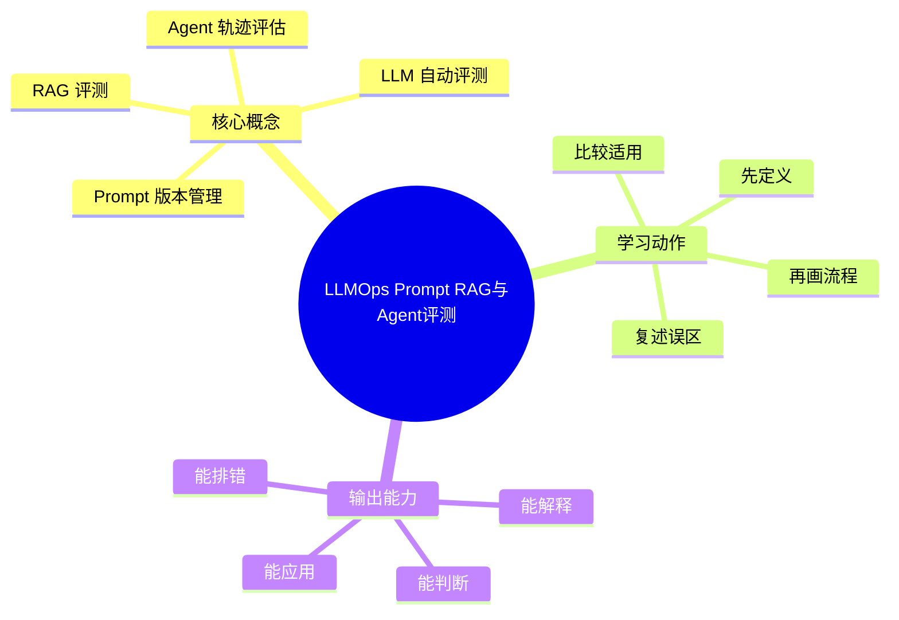

# MLOps与LLMOps：LLMOps Prompt RAG与Agent评测

## 学习目标
- 掌握 Prompt 管理、RAG 评测、Agent 工具调用和自动化评估。
- 能画出本章核心流程图，并能用自己的话解释每个节点。
- 能说出适用场景、边界条件和常见误区。

## 一句话总纲
LLMOps 的关键是把不可完全确定的生成行为纳入可测试、可观测、可回滚流程。

## 记忆口诀
> Prompt可版控，RAG可评测，Agent可追踪

## 思维导图

## Mermaid 图解：核心流程

## 分章节讲解
### 1. Prompt 版本管理
**核心定义：** Prompt 应像代码一样管理版本、变量、适用场景和评测结果。

**理解路径：**
- 先明确它解决的具体问题，再判断它依赖的前提条件。
- 把它放回“LLMOps 的关键是把不可完全确定的生成行为纳入可测试、可观测、可回滚流程。”这条主线中理解，不要孤立记忆。
- 学习时至少能说出：输入是什么、输出是什么、代价是什么、失败边界是什么。

**常见误区：** 手工改 Prompt 不记录会导致线上行为难以解释和回滚。

### 2. RAG 评测
**核心定义：** RAG 评测要拆分检索召回、重排质量、引用准确性和生成忠实度。

**理解路径：**
- 先明确它解决的具体问题，再判断它依赖的前提条件。
- 把它放回“LLMOps 的关键是把不可完全确定的生成行为纳入可测试、可观测、可回滚流程。”这条主线中理解，不要孤立记忆。
- 学习时至少能说出：输入是什么、输出是什么、代价是什么、失败边界是什么。

**常见误区：** 只评最终答案会掩盖是检索错、上下文错还是生成错。

### 3. Agent 轨迹评估
**核心定义：** Agent 评估需要记录计划、工具调用、观察、决策和最终结果，检查是否越权或走偏。

**理解路径：**
- 先明确它解决的具体问题，再判断它依赖的前提条件。
- 把它放回“LLMOps 的关键是把不可完全确定的生成行为纳入可测试、可观测、可回滚流程。”这条主线中理解，不要孤立记忆。
- 学习时至少能说出：输入是什么、输出是什么、代价是什么、失败边界是什么。

**常见误区：** 只看最终答案可能忽视危险工具调用和不可复现路径。

### 4. LLM 自动评测
**核心定义：** 自动评测可用规则、单元用例、模型裁判和人工抽检组合，需防止裁判偏差。

**理解路径：**
- 先明确它解决的具体问题，再判断它依赖的前提条件。
- 把它放回“LLMOps 的关键是把不可完全确定的生成行为纳入可测试、可观测、可回滚流程。”这条主线中理解，不要孤立记忆。
- 学习时至少能说出：输入是什么、输出是什么、代价是什么、失败边界是什么。

**常见误区：** 模型裁判不是绝对真理；关键场景要有人类基准或可执行验证。

## 关键对比表
| 知识点 | 正确理解 | 常见误区 |
|---|---|---|
| Prompt 版本管理 | Prompt 应像代码一样管理版本、变量、适用场景和评测结果。 | 手工改 Prompt 不记录会导致线上行为难以解释和回滚。 |
| RAG 评测 | RAG 评测要拆分检索召回、重排质量、引用准确性和生成忠实度。 | 只评最终答案会掩盖是检索错、上下文错还是生成错。 |
| Agent 轨迹评估 | Agent 评估需要记录计划、工具调用、观察、决策和最终结果，检查是否越权或走偏。 | 只看最终答案可能忽视危险工具调用和不可复现路径。 |
| LLM 自动评测 | 自动评测可用规则、单元用例、模型裁判和人工抽检组合，需防止裁判偏差。 | 模型裁判不是绝对真理；关键场景要有人类基准或可执行验证。 |

## 常见误区总结
- **Prompt 版本管理：** 手工改 Prompt 不记录会导致线上行为难以解释和回滚。
- **RAG 评测：** 只评最终答案会掩盖是检索错、上下文错还是生成错。
- **Agent 轨迹评估：** 只看最终答案可能忽视危险工具调用和不可复现路径。
- **LLM 自动评测：** 模型裁判不是绝对真理；关键场景要有人类基准或可执行验证。

## 自检题
1. 本章的核心问题是什么？请用一句话回答：LLMOps 的关键是把不可完全确定的生成行为纳入可测试、可观测、可回滚流程。
2. 本章每个概念的适用前提分别是什么？
3. 哪个误区最容易在面试或工程实践中出现？为什么？

## 速记卡片
- 章节口诀：Prompt可版控，RAG可评测，Agent可追踪
- 答题结构：定义 → 机制 → 场景 → 权衡 → 误区。
- 复习动作：遮住正文，只根据思维导图复述一遍。

## 深度扩展：底层原理与应用边界

### 1. 本章在「MLOps与LLMOps」中的位置
- **核心定位：** 把数据、实验、模型、Prompt、RAG、Agent、评测、安全和成本纳入可复现、可观测、可治理的生命周期。
- **本章作用：** 「MLOps与LLMOps：LLMOps Prompt RAG与Agent评测」负责把总纲落到可操作的判断框架：先确认问题边界，再拆解机制，最后根据代价和风险选择方法。
- **主要风险：** 最大风险是只关注模型效果，不管理数据版本、评测集、上线漂移、Prompt 变更和成本安全。
- **实践抓手：** 上线前必须回答：数据从哪来、指标如何评、失败如何回滚、日志如何追、成本如何控。

### 2. 小流程图：从概念到应用

### 3. 概念深化：逐个击破
#### 3.1 Prompt 版本管理
- **先问它解决什么：** Prompt 版本管理 不是孤立名词，而是用来解决本章某类约束、关系、代价或风险判断的问题。
- **底层机制：** 学习时要拆成“输入条件 → 中间结构 → 处理规则 → 输出结果”四步；如果任何一步说不清，说明只是记住了结论。
- **适用条件：** 当前提满足、边界清楚、代价可接受时使用；如果输入分布、规模、时序、权限或一致性假设变化，就要重新评估。
- **不适用信号：** 需要违反前提才能套用、只能靠特殊样例解释、复杂度或维护成本明显失控时，应换方案。
- **面试表达：** “我会先定义 Prompt 版本管理，再说明它依赖的前提，最后用一个反例说明边界。”

#### 3.2 RAG 评测
- **先问它解决什么：** RAG 评测 不是孤立名词，而是用来解决本章某类约束、关系、代价或风险判断的问题。
- **底层机制：** 学习时要拆成“输入条件 → 中间结构 → 处理规则 → 输出结果”四步；如果任何一步说不清，说明只是记住了结论。
- **适用条件：** 当前提满足、边界清楚、代价可接受时使用；如果输入分布、规模、时序、权限或一致性假设变化，就要重新评估。
- **不适用信号：** 需要违反前提才能套用、只能靠特殊样例解释、复杂度或维护成本明显失控时，应换方案。
- **面试表达：** “我会先定义 RAG 评测，再说明它依赖的前提，最后用一个反例说明边界。”

#### 3.3 Agent 轨迹评估
- **先问它解决什么：** Agent 轨迹评估 不是孤立名词，而是用来解决本章某类约束、关系、代价或风险判断的问题。
- **底层机制：** 学习时要拆成“输入条件 → 中间结构 → 处理规则 → 输出结果”四步；如果任何一步说不清，说明只是记住了结论。
- **适用条件：** 当前提满足、边界清楚、代价可接受时使用；如果输入分布、规模、时序、权限或一致性假设变化，就要重新评估。
- **不适用信号：** 需要违反前提才能套用、只能靠特殊样例解释、复杂度或维护成本明显失控时，应换方案。
- **面试表达：** “我会先定义 Agent 轨迹评估，再说明它依赖的前提，最后用一个反例说明边界。”

#### 3.4 LLM 自动评测
- **先问它解决什么：** LLM 自动评测 不是孤立名词，而是用来解决本章某类约束、关系、代价或风险判断的问题。
- **底层机制：** 学习时要拆成“输入条件 → 中间结构 → 处理规则 → 输出结果”四步；如果任何一步说不清，说明只是记住了结论。
- **适用条件：** 当前提满足、边界清楚、代价可接受时使用；如果输入分布、规模、时序、权限或一致性假设变化，就要重新评估。
- **不适用信号：** 需要违反前提才能套用、只能靠特殊样例解释、复杂度或维护成本明显失控时，应换方案。
- **面试表达：** “我会先定义 LLM 自动评测，再说明它依赖的前提，最后用一个反例说明边界。”

### 4. 适用边界对比表
| 判断维度 | 应该怎么想 | 典型错误 | 记忆提示 |
|---|---|---|---|
| 前提条件 | 先列出输入规模、数据分布、系统假设或业务约束 | 不看条件直接套模板 | 先问“凭什么能用” |
| 正确性 | 需要能说明为什么结果保持不变或为什么局部选择成立 | 只给经验结论 | 用不变量、反例或交换论证检查 |
| 复杂度/成本 | 同时估算时间、空间、延迟、吞吐、人力和维护成本 | 只看理论最优 | 工程里还要看常数和可观测性 |
| 失败模式 | 主动说明边界外会怎样失败 | 面试中只讲优点 | 能说失败边界才算真理解 |

### 5. 记忆强化：三层复述法
1. **概念层：** 用一句话定义本章每个核心概念。
2. **机制层：** 不看原文画出输入到输出的流程。
3. **边界层：** 为每个概念准备一个“不能这样用”的反例。

### 6. 工程/做题/面试迁移
- **工程迁移：** 上线前必须回答：数据从哪来、指标如何评、失败如何回滚、日志如何追、成本如何控。
- **做题迁移：** 先把题目中的对象、关系、约束和目标函数圈出来，再映射到本章概念。
- **面试迁移：** 回答时不要只报名词，要说清“为什么需要它、它如何工作、它何时失效”。

### 7. 深度自检题
1. 你能否把本章概念按“前提 → 机制 → 结果 → 代价”重新组织？
2. 如果输入规模、并发量、数据分布或安全边界变化，原结论是否仍成立？
3. 本章哪个概念最容易被误用？请给出一个反例。
4. 如果让你设计一道面试题，你会怎样考察候选人是否真的理解？

### 8. 深度速记卡片
- **总抓手：** 把数据、实验、模型、Prompt、RAG、Agent、评测、安全和成本纳入可复现、可观测、可治理的生命周期。
- **答题模板：** 定义边界 → 拆底层机制 → 说适用条件 → 讲权衡 → 给反例。
- **复习动作：** 每次复习只看图和表，尝试口述 3 分钟；卡住处再回正文。

## 专题深化：具体机制、案例与追问

### 1. 具体案例：把「LLMOps Prompt RAG与Agent评测」放进真实问题
例如 RAG 问答上线要管理文档版本、切块方案、Embedding 模型、召回重排、Prompt 版本、回答引用、评测集和成本。

### 2. 本章关键机制细化
- Prompt 需要版本化和评测绑定。
- RAG 要拆检索、重排、引用和忠实度评估。
- Agent 要记录工具轨迹和权限边界。

### 3. 概念到判断的检查清单
| 概念/动作 | 你要检查什么 | 如果检查失败会怎样 |
|---|---|---|
| Prompt 版本管理 | 前提、输入、输出、代价、失败边界是否都说清 | 可能套错模型、复杂度失控或得到不可验证结论 |
| RAG 评测 | 前提、输入、输出、代价、失败边界是否都说清 | 可能套错模型、复杂度失控或得到不可验证结论 |
| Agent 轨迹评估 | 前提、输入、输出、代价、失败边界是否都说清 | 可能套错模型、复杂度失控或得到不可验证结论 |
| LLM 自动评测 | 前提、输入、输出、代价、失败边界是否都说清 | 可能套错模型、复杂度失控或得到不可验证结论 |
| 本章在「MLOps与LLMOps」中的位置 | 前提、输入、输出、代价、失败边界是否都说清 | 可能套错模型、复杂度失控或得到不可验证结论 |

### 4. 面试追问路径

- 数据和 Prompt 是否可追溯？
- 评测能否定位检索错还是生成错？
- 线上漂移、注入和成本如何监控？

### 5. 验证与复盘
- **验证方式：** 用固定评测集、轨迹日志、人工抽检、线上监控和回滚演练验证。
- **复盘方式：** 每次做题或设计后，记录“我使用了哪个前提、哪个前提最容易被破坏、如果破坏如何调整”。
- **记忆方式：** 不背孤立结论，只背“问题 → 机制 → 边界 → 验证”的链路。

## 本轮扩写：Prompt、RAG、Agent 的评测分层

### 1. LLMOps 的核心资产不只是模型
Prompt、检索语料、工具 schema、Agent 轨迹、评测集和安全策略都需要版本化。

| 资产 | 为什么要版本化 | 失败表现 | 验证方式 |
|---|---|---|---|
| Prompt | 行为由指令细节决定 | 输出格式漂移、拒答异常 | golden case 回归 |
| RAG 语料 | 答案依赖文档新鲜度 | 引用过期、找不到证据 | 检索 Recall@K、引用准确率 |
| Tool schema | Agent 调用依赖参数定义 | 调错工具、漏填参数 | 工具调用轨迹测试 |
| Eval set | 决定优化方向 | 过拟合少数样例 | 分层抽样和盲测 |
| Safety policy | 控制越权和注入 | 泄露、越权、执行恶意指令 | 攻击样本红队测试 |

### 2. RAG 评测要分成“检索”和“生成”

- 检索层看 Recall@K、MRR、nDCG、权限过滤正确率。
- 上下文层看 chunk 粒度、去重、排序、token 预算和证据覆盖。
- 生成层看忠实性、完整性、引用准确率、拒答正确率。
- 人工复核要记录失败原因，而不是只给总分。

### 3. Agent 轨迹评估
Agent 不只评最终答案，还要评每一步是否合理。

| 轨迹维度 | 好轨迹 | 坏轨迹 | 检查方法 |
|---|---|---|---|
| 计划 | 分解清晰，可验证 | 一开始就执行高风险动作 | 计划审查 |
| 工具选择 | 先读证据再行动 | 猜测参数、乱调工具 | 工具日志回放 |
| 状态管理 | 保存关键中间结果 | 重复搜索或遗忘约束 | trace 对比 |
| 安全边界 | 遇到越权会停止 | 执行注入指令 | 红队样本 |
| 终止条件 | 有验证证据 | 没跑验证就完成 | 完成检查清单 |

### 4. Prompt 注入与 RAG 污染
- 文档内容可能包含“忽略之前指令”等恶意文本，必须把检索内容当不可信输入。
- 工具调用前要区分用户指令、系统策略和外部文档证据。
- 检索结果要保留来源和权限，不能让低信任文档覆盖高信任策略。
- 对高风险操作要做权限检查、参数白名单和人工确认边界。

### 5. 面试追问路径
- “如何评测 RAG？”——先拆检索、上下文、生成和引用，再讲样本集与失败归因。
- “Agent 为什么难测？”——因为动作序列、多工具副作用和环境状态都会影响结果。
- “如何防 Prompt 注入？”——回答输入分层、检索内容不可信、工具权限、输出约束和红队测试。
