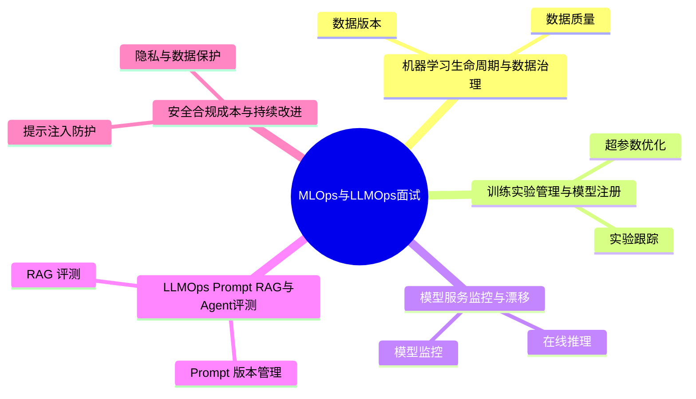

# MLOps与LLMOps面试20问

## 学习目标
- 用 20 个高频问题串起 MLOps与LLMOps 的核心知识。
- 每个答案都按“定义 → 机制 → 场景 → 权衡 → 误区 → 记忆点”组织，便于面试复述。
- 通过小型 Mermaid 图辅助记忆，避免超大图难以阅读。

## 一句话总纲
MLOps 管理机器学习从数据到上线的生命周期，LLMOps 在此基础上加入 Prompt、RAG、Agent、评测、安全和成本治理。

## 记忆口诀
> 数据可追，实验可复，模型可管，服务可观，LLM可评可控。

## 思维导图

## 答题总流程

## 第 1-5 问：小图记忆

## 深度面试答题框架

- **总主线：** 把数据、实验、模型、Prompt、RAG、Agent、评测、安全和成本纳入可复现、可观测、可治理的生命周期。
- **风险提醒：** 最大风险是只关注模型效果，不管理数据版本、评测集、上线漂移、Prompt 变更和成本安全。
- **实践抓手：** 上线前必须回答：数据从哪来、指标如何评、失败如何回滚、日志如何追、成本如何控。

## 面试答案强化版：逐题深答

> 回答每题都按：定义 → 机制 → 场景 → 权衡 → 误区 → 验证。

### Q1：请解释“数据版本”的核心思想、适用场景和常见误区。

**答：**
1. **定义：** 数据版本记录训练、验证和测试数据快照，使实验结果可追溯和可复现。
2. **机制：** 先确认前提，再说明它处理的数据、状态、边界或资源，最后说明输出结果为什么可信。结合本学科主线看，例如 RAG 问答上线要管理文档版本、切块方案、Embedding 模型、召回重排、Prompt 版本、回答引用、评测集和成本。
3. **适用场景：** 当问题与 数据版本 的前提一致，并且需要在正确性、性能、可靠性或可维护性之间做判断时使用。
4. **权衡：** 要主动比较收益和代价：它可能提升表达力、效率或可靠性，但也可能增加复杂度、资源消耗或维护成本。
5. **误区：** 不检查前提就套用；只讲结论不讲失败边界；无法说明如何验证。
6. **验证：** 用固定评测集、轨迹日志、人工抽检、线上监控和回滚演练验证。
**追问回答模板：** 如果面试官继续问“为什么不用别的方案”，从前提差异、失败模式和验证成本三个角度回答。

### Q2：请解释“数据质量”的核心思想、适用场景和常见误区。

**答：**
1. **定义：** 数据质量包括完整性、准确性、一致性、代表性和标签可靠性。
2. **机制：** 先确认前提，再说明它处理的数据、状态、边界或资源，最后说明输出结果为什么可信。结合本学科主线看，例如 RAG 问答上线要管理文档版本、切块方案、Embedding 模型、召回重排、Prompt 版本、回答引用、评测集和成本。
3. **适用场景：** 当问题与 数据质量 的前提一致，并且需要在正确性、性能、可靠性或可维护性之间做判断时使用。
4. **权衡：** 要主动比较收益和代价：它可能提升表达力、效率或可靠性，但也可能增加复杂度、资源消耗或维护成本。
5. **误区：** 不检查前提就套用；只讲结论不讲失败边界；无法说明如何验证。
6. **验证：** 用固定评测集、轨迹日志、人工抽检、线上监控和回滚演练验证。
**追问回答模板：** 如果面试官继续问“为什么不用别的方案”，从前提差异、失败模式和验证成本三个角度回答。

### Q3：请解释“数据泄漏”的核心思想、适用场景和常见误区。

**答：**
1. **定义：** 数据泄漏指训练过程中使用了预测时不可获得的信息，导致离线效果虚高。
2. **机制：** 先确认前提，再说明它处理的数据、状态、边界或资源，最后说明输出结果为什么可信。结合本学科主线看，例如 RAG 问答上线要管理文档版本、切块方案、Embedding 模型、召回重排、Prompt 版本、回答引用、评测集和成本。
3. **适用场景：** 当问题与 数据泄漏 的前提一致，并且需要在正确性、性能、可靠性或可维护性之间做判断时使用。
4. **权衡：** 要主动比较收益和代价：它可能提升表达力、效率或可靠性，但也可能增加复杂度、资源消耗或维护成本。
5. **误区：** 不检查前提就套用；只讲结论不讲失败边界；无法说明如何验证。
6. **验证：** 用固定评测集、轨迹日志、人工抽检、线上监控和回滚演练验证。
**追问回答模板：** 如果面试官继续问“为什么不用别的方案”，从前提差异、失败模式和验证成本三个角度回答。

### Q4：请解释“特征管理”的核心思想、适用场景和常见误区。

**答：**
1. **定义：** 特征管理统一离线训练和在线推理特征定义，减少训练服务偏差。
2. **机制：** 先确认前提，再说明它处理的数据、状态、边界或资源，最后说明输出结果为什么可信。结合本学科主线看，例如 RAG 问答上线要管理文档版本、切块方案、Embedding 模型、召回重排、Prompt 版本、回答引用、评测集和成本。
3. **适用场景：** 当问题与 特征管理 的前提一致，并且需要在正确性、性能、可靠性或可维护性之间做判断时使用。
4. **权衡：** 要主动比较收益和代价：它可能提升表达力、效率或可靠性，但也可能增加复杂度、资源消耗或维护成本。
5. **误区：** 不检查前提就套用；只讲结论不讲失败边界；无法说明如何验证。
6. **验证：** 用固定评测集、轨迹日志、人工抽检、线上监控和回滚演练验证。
**追问回答模板：** 如果面试官继续问“为什么不用别的方案”，从前提差异、失败模式和验证成本三个角度回答。

### Q5：请解释“实验跟踪”的核心思想、适用场景和常见误区。

**答：**
1. **定义：** 实验跟踪记录代码、数据、参数、指标、环境和产物，支持对比和复现。
2. **机制：** 先确认前提，再说明它处理的数据、状态、边界或资源，最后说明输出结果为什么可信。结合本学科主线看，例如 RAG 问答上线要管理文档版本、切块方案、Embedding 模型、召回重排、Prompt 版本、回答引用、评测集和成本。
3. **适用场景：** 当问题与 实验跟踪 的前提一致，并且需要在正确性、性能、可靠性或可维护性之间做判断时使用。
4. **权衡：** 要主动比较收益和代价：它可能提升表达力、效率或可靠性，但也可能增加复杂度、资源消耗或维护成本。
5. **误区：** 不检查前提就套用；只讲结论不讲失败边界；无法说明如何验证。
6. **验证：** 用固定评测集、轨迹日志、人工抽检、线上监控和回滚演练验证。
**追问回答模板：** 如果面试官继续问“为什么不用别的方案”，从前提差异、失败模式和验证成本三个角度回答。

### Q6：请解释“超参数优化”的核心思想、适用场景和常见误区。

**答：**
1. **定义：** 超参优化通过网格、随机、贝叶斯或多保真方案寻找更优配置。
2. **机制：** 先确认前提，再说明它处理的数据、状态、边界或资源，最后说明输出结果为什么可信。结合本学科主线看，例如 RAG 问答上线要管理文档版本、切块方案、Embedding 模型、召回重排、Prompt 版本、回答引用、评测集和成本。
3. **适用场景：** 当问题与 超参数优化 的前提一致，并且需要在正确性、性能、可靠性或可维护性之间做判断时使用。
4. **权衡：** 要主动比较收益和代价：它可能提升表达力、效率或可靠性，但也可能增加复杂度、资源消耗或维护成本。
5. **误区：** 不检查前提就套用；只讲结论不讲失败边界；无法说明如何验证。
6. **验证：** 用固定评测集、轨迹日志、人工抽检、线上监控和回滚演练验证。
**追问回答模板：** 如果面试官继续问“为什么不用别的方案”，从前提差异、失败模式和验证成本三个角度回答。

### Q7：请解释“模型注册”的核心思想、适用场景和常见误区。

**答：**
1. **定义：** 模型注册中心管理模型版本、阶段、元数据、审批和部署状态。
2. **机制：** 先确认前提，再说明它处理的数据、状态、边界或资源，最后说明输出结果为什么可信。结合本学科主线看，例如 RAG 问答上线要管理文档版本、切块方案、Embedding 模型、召回重排、Prompt 版本、回答引用、评测集和成本。
3. **适用场景：** 当问题与 模型注册 的前提一致，并且需要在正确性、性能、可靠性或可维护性之间做判断时使用。
4. **权衡：** 要主动比较收益和代价：它可能提升表达力、效率或可靠性，但也可能增加复杂度、资源消耗或维护成本。
5. **误区：** 不检查前提就套用；只讲结论不讲失败边界；无法说明如何验证。
6. **验证：** 用固定评测集、轨迹日志、人工抽检、线上监控和回滚演练验证。
**追问回答模板：** 如果面试官继续问“为什么不用别的方案”，从前提差异、失败模式和验证成本三个角度回答。

### Q8：请解释“可复现训练”的核心思想、适用场景和常见误区。

**答：**
1. **定义：** 可复现训练需要固定代码、数据、配置、依赖、随机种子和硬件差异记录。
2. **机制：** 先确认前提，再说明它处理的数据、状态、边界或资源，最后说明输出结果为什么可信。结合本学科主线看，例如 RAG 问答上线要管理文档版本、切块方案、Embedding 模型、召回重排、Prompt 版本、回答引用、评测集和成本。
3. **适用场景：** 当问题与 可复现训练 的前提一致，并且需要在正确性、性能、可靠性或可维护性之间做判断时使用。
4. **权衡：** 要主动比较收益和代价：它可能提升表达力、效率或可靠性，但也可能增加复杂度、资源消耗或维护成本。
5. **误区：** 不检查前提就套用；只讲结论不讲失败边界；无法说明如何验证。
6. **验证：** 用固定评测集、轨迹日志、人工抽检、线上监控和回滚演练验证。
**追问回答模板：** 如果面试官继续问“为什么不用别的方案”，从前提差异、失败模式和验证成本三个角度回答。

### Q9：请解释“在线推理”的核心思想、适用场景和常见误区。

**答：**
1. **定义：** 在线推理要求模型以受控延迟和可用性响应请求，需考虑批处理、缓存和资源隔离。
2. **机制：** 先确认前提，再说明它处理的数据、状态、边界或资源，最后说明输出结果为什么可信。结合本学科主线看，例如 RAG 问答上线要管理文档版本、切块方案、Embedding 模型、召回重排、Prompt 版本、回答引用、评测集和成本。
3. **适用场景：** 当问题与 在线推理 的前提一致，并且需要在正确性、性能、可靠性或可维护性之间做判断时使用。
4. **权衡：** 要主动比较收益和代价：它可能提升表达力、效率或可靠性，但也可能增加复杂度、资源消耗或维护成本。
5. **误区：** 不检查前提就套用；只讲结论不讲失败边界；无法说明如何验证。
6. **验证：** 用固定评测集、轨迹日志、人工抽检、线上监控和回滚演练验证。
**追问回答模板：** 如果面试官继续问“为什么不用别的方案”，从前提差异、失败模式和验证成本三个角度回答。

### Q10：请解释“模型监控”的核心思想、适用场景和常见误区。

**答：**
1. **定义：** 模型监控包括服务指标、输入分布、输出分布、业务指标和人工反馈。
2. **机制：** 先确认前提，再说明它处理的数据、状态、边界或资源，最后说明输出结果为什么可信。结合本学科主线看，例如 RAG 问答上线要管理文档版本、切块方案、Embedding 模型、召回重排、Prompt 版本、回答引用、评测集和成本。
3. **适用场景：** 当问题与 模型监控 的前提一致，并且需要在正确性、性能、可靠性或可维护性之间做判断时使用。
4. **权衡：** 要主动比较收益和代价：它可能提升表达力、效率或可靠性，但也可能增加复杂度、资源消耗或维护成本。
5. **误区：** 不检查前提就套用；只讲结论不讲失败边界；无法说明如何验证。
6. **验证：** 用固定评测集、轨迹日志、人工抽检、线上监控和回滚演练验证。
**追问回答模板：** 如果面试官继续问“为什么不用别的方案”，从前提差异、失败模式和验证成本三个角度回答。

### Q11：请解释“数据漂移”的核心思想、适用场景和常见误区。

**答：**
1. **定义：** 数据漂移是线上输入分布相对训练数据变化，可能导致模型效果下降。
2. **机制：** 先确认前提，再说明它处理的数据、状态、边界或资源，最后说明输出结果为什么可信。结合本学科主线看，例如 RAG 问答上线要管理文档版本、切块方案、Embedding 模型、召回重排、Prompt 版本、回答引用、评测集和成本。
3. **适用场景：** 当问题与 数据漂移 的前提一致，并且需要在正确性、性能、可靠性或可维护性之间做判断时使用。
4. **权衡：** 要主动比较收益和代价：它可能提升表达力、效率或可靠性，但也可能增加复杂度、资源消耗或维护成本。
5. **误区：** 不检查前提就套用；只讲结论不讲失败边界；无法说明如何验证。
6. **验证：** 用固定评测集、轨迹日志、人工抽检、线上监控和回滚演练验证。
**追问回答模板：** 如果面试官继续问“为什么不用别的方案”，从前提差异、失败模式和验证成本三个角度回答。

### Q12：请解释“回滚与灰度”的核心思想、适用场景和常见误区。

**答：**
1. **定义：** 模型发布应支持灰度、影子流量、A/B 测试和快速回滚。
2. **机制：** 先确认前提，再说明它处理的数据、状态、边界或资源，最后说明输出结果为什么可信。结合本学科主线看，例如 RAG 问答上线要管理文档版本、切块方案、Embedding 模型、召回重排、Prompt 版本、回答引用、评测集和成本。
3. **适用场景：** 当问题与 回滚与灰度 的前提一致，并且需要在正确性、性能、可靠性或可维护性之间做判断时使用。
4. **权衡：** 要主动比较收益和代价：它可能提升表达力、效率或可靠性，但也可能增加复杂度、资源消耗或维护成本。
5. **误区：** 不检查前提就套用；只讲结论不讲失败边界；无法说明如何验证。
6. **验证：** 用固定评测集、轨迹日志、人工抽检、线上监控和回滚演练验证。
**追问回答模板：** 如果面试官继续问“为什么不用别的方案”，从前提差异、失败模式和验证成本三个角度回答。

### Q13：请解释“Prompt 版本管理”的核心思想、适用场景和常见误区。

**答：**
1. **定义：** Prompt 应像代码一样管理版本、变量、适用场景和评测结果。
2. **机制：** 先确认前提，再说明它处理的数据、状态、边界或资源，最后说明输出结果为什么可信。结合本学科主线看，例如 RAG 问答上线要管理文档版本、切块方案、Embedding 模型、召回重排、Prompt 版本、回答引用、评测集和成本。
3. **适用场景：** 当问题与 Prompt 版本管理 的前提一致，并且需要在正确性、性能、可靠性或可维护性之间做判断时使用。
4. **权衡：** 要主动比较收益和代价：它可能提升表达力、效率或可靠性，但也可能增加复杂度、资源消耗或维护成本。
5. **误区：** 不检查前提就套用；只讲结论不讲失败边界；无法说明如何验证。
6. **验证：** 用固定评测集、轨迹日志、人工抽检、线上监控和回滚演练验证。
**追问回答模板：** 如果面试官继续问“为什么不用别的方案”，从前提差异、失败模式和验证成本三个角度回答。

### Q14：请解释“RAG 评测”的核心思想、适用场景和常见误区。

**答：**
1. **定义：** RAG 评测要拆分检索召回、重排质量、引用准确性和生成忠实度。
2. **机制：** 先确认前提，再说明它处理的数据、状态、边界或资源，最后说明输出结果为什么可信。结合本学科主线看，例如 RAG 问答上线要管理文档版本、切块方案、Embedding 模型、召回重排、Prompt 版本、回答引用、评测集和成本。
3. **适用场景：** 当问题与 RAG 评测 的前提一致，并且需要在正确性、性能、可靠性或可维护性之间做判断时使用。
4. **权衡：** 要主动比较收益和代价：它可能提升表达力、效率或可靠性，但也可能增加复杂度、资源消耗或维护成本。
5. **误区：** 不检查前提就套用；只讲结论不讲失败边界；无法说明如何验证。
6. **验证：** 用固定评测集、轨迹日志、人工抽检、线上监控和回滚演练验证。
**追问回答模板：** 如果面试官继续问“为什么不用别的方案”，从前提差异、失败模式和验证成本三个角度回答。

### Q15：请解释“Agent 轨迹评估”的核心思想、适用场景和常见误区。

**答：**
1. **定义：** Agent 评估需要记录计划、工具调用、观察、决策和最终结果，检查是否越权或走偏。
2. **机制：** 先确认前提，再说明它处理的数据、状态、边界或资源，最后说明输出结果为什么可信。结合本学科主线看，例如 RAG 问答上线要管理文档版本、切块方案、Embedding 模型、召回重排、Prompt 版本、回答引用、评测集和成本。
3. **适用场景：** 当问题与 Agent 轨迹评估 的前提一致，并且需要在正确性、性能、可靠性或可维护性之间做判断时使用。
4. **权衡：** 要主动比较收益和代价：它可能提升表达力、效率或可靠性，但也可能增加复杂度、资源消耗或维护成本。
5. **误区：** 不检查前提就套用；只讲结论不讲失败边界；无法说明如何验证。
6. **验证：** 用固定评测集、轨迹日志、人工抽检、线上监控和回滚演练验证。
**追问回答模板：** 如果面试官继续问“为什么不用别的方案”，从前提差异、失败模式和验证成本三个角度回答。

### Q16：请解释“LLM 自动评测”的核心思想、适用场景和常见误区。

**答：**
1. **定义：** 自动评测可用规则、单元用例、模型裁判和人工抽检组合，需防止裁判偏差。
2. **机制：** 先确认前提，再说明它处理的数据、状态、边界或资源，最后说明输出结果为什么可信。结合本学科主线看，例如 RAG 问答上线要管理文档版本、切块方案、Embedding 模型、召回重排、Prompt 版本、回答引用、评测集和成本。
3. **适用场景：** 当问题与 LLM 自动评测 的前提一致，并且需要在正确性、性能、可靠性或可维护性之间做判断时使用。
4. **权衡：** 要主动比较收益和代价：它可能提升表达力、效率或可靠性，但也可能增加复杂度、资源消耗或维护成本。
5. **误区：** 不检查前提就套用；只讲结论不讲失败边界；无法说明如何验证。
6. **验证：** 用固定评测集、轨迹日志、人工抽检、线上监控和回滚演练验证。
**追问回答模板：** 如果面试官继续问“为什么不用别的方案”，从前提差异、失败模式和验证成本三个角度回答。

### Q17：请解释“隐私与数据保护”的核心思想、适用场景和常见误区。

**答：**
1. **定义：** LLM 系统要控制敏感数据进入 Prompt、日志、向量库和第三方接口。
2. **机制：** 先确认前提，再说明它处理的数据、状态、边界或资源，最后说明输出结果为什么可信。结合本学科主线看，例如 RAG 问答上线要管理文档版本、切块方案、Embedding 模型、召回重排、Prompt 版本、回答引用、评测集和成本。
3. **适用场景：** 当问题与 隐私与数据保护 的前提一致，并且需要在正确性、性能、可靠性或可维护性之间做判断时使用。
4. **权衡：** 要主动比较收益和代价：它可能提升表达力、效率或可靠性，但也可能增加复杂度、资源消耗或维护成本。
5. **误区：** 不检查前提就套用；只讲结论不讲失败边界；无法说明如何验证。
6. **验证：** 用固定评测集、轨迹日志、人工抽检、线上监控和回滚演练验证。
**追问回答模板：** 如果面试官继续问“为什么不用别的方案”，从前提差异、失败模式和验证成本三个角度回答。

### Q18：请解释“提示注入防护”的核心思想、适用场景和常见误区。

**答：**
1. **定义：** 提示注入通过恶意输入影响模型指令遵循，防护要结合权限隔离、内容过滤和工具调用方案。
2. **机制：** 先确认前提，再说明它处理的数据、状态、边界或资源，最后说明输出结果为什么可信。结合本学科主线看，例如 RAG 问答上线要管理文档版本、切块方案、Embedding 模型、召回重排、Prompt 版本、回答引用、评测集和成本。
3. **适用场景：** 当问题与 提示注入防护 的前提一致，并且需要在正确性、性能、可靠性或可维护性之间做判断时使用。
4. **权衡：** 要主动比较收益和代价：它可能提升表达力、效率或可靠性，但也可能增加复杂度、资源消耗或维护成本。
5. **误区：** 不检查前提就套用；只讲结论不讲失败边界；无法说明如何验证。
6. **验证：** 用固定评测集、轨迹日志、人工抽检、线上监控和回滚演练验证。
**追问回答模板：** 如果面试官继续问“为什么不用别的方案”，从前提差异、失败模式和验证成本三个角度回答。

### Q19：请解释“成本治理”的核心思想、适用场景和常见误区。

**答：**
1. **定义：** 成本治理关注 Token、检索、模型路由、缓存、批处理和失败重试带来的费用。
2. **机制：** 先确认前提，再说明它处理的数据、状态、边界或资源，最后说明输出结果为什么可信。结合本学科主线看，例如 RAG 问答上线要管理文档版本、切块方案、Embedding 模型、召回重排、Prompt 版本、回答引用、评测集和成本。
3. **适用场景：** 当问题与 成本治理 的前提一致，并且需要在正确性、性能、可靠性或可维护性之间做判断时使用。
4. **权衡：** 要主动比较收益和代价：它可能提升表达力、效率或可靠性，但也可能增加复杂度、资源消耗或维护成本。
5. **误区：** 不检查前提就套用；只讲结论不讲失败边界；无法说明如何验证。
6. **验证：** 用固定评测集、轨迹日志、人工抽检、线上监控和回滚演练验证。
**追问回答模板：** 如果面试官继续问“为什么不用别的方案”，从前提差异、失败模式和验证成本三个角度回答。

### Q20：请解释“持续改进闭环”的核心思想、适用场景和常见误区。

**答：**
1. **定义：** 持续改进通过日志、反馈、评测集、错误分类和灰度实验迭代系统。
2. **机制：** 先确认前提，再说明它处理的数据、状态、边界或资源，最后说明输出结果为什么可信。结合本学科主线看，例如 RAG 问答上线要管理文档版本、切块方案、Embedding 模型、召回重排、Prompt 版本、回答引用、评测集和成本。
3. **适用场景：** 当问题与 持续改进闭环 的前提一致，并且需要在正确性、性能、可靠性或可维护性之间做判断时使用。
4. **权衡：** 要主动比较收益和代价：它可能提升表达力、效率或可靠性，但也可能增加复杂度、资源消耗或维护成本。
5. **误区：** 不检查前提就套用；只讲结论不讲失败边界；无法说明如何验证。
6. **验证：** 用固定评测集、轨迹日志、人工抽检、线上监控和回滚演练验证。
**追问回答模板：** 如果面试官继续问“为什么不用别的方案”，从前提差异、失败模式和验证成本三个角度回答。

## 面试终局复盘
| 能力 | 合格表现 | 优秀表现 |
|---|---|---|
| 概念 | 说清定义 | 还能说清边界和反例 |
| 机制 | 说清流程 | 能画图解释不变量或控制点 |
| 工程 | 能给场景 | 能给验证和回滚方式 |
| 表达 | 结构完整 | 能应对追问和对比 |

## 本轮扩写：Q1-Q20 追问速查表

| 题号 | 高频追问 | 回答抓手 |
|---|---|---|
| Q1 | 数据版本记录什么？ | 原始数据、处理代码、特征逻辑、时间窗口。 |
| Q2 | 数据质量如何自动化？ | schema、范围、缺失、分布、唯一性和漂移检查。 |
| Q3 | 数据泄漏如何发现？ | 时间穿越、标签泄漏、训练/验证异常差距。 |
| Q4 | 特征在线离线不一致怎么办？ | 统一特征定义、回放校验和特征监控。 |
| Q5 | 实验跟踪记录哪些？ | 参数、代码、数据、指标、模型和环境。 |
| Q6 | HPO 风险是什么？ | 过拟合验证集、搜索成本高和不可复现。 |
| Q7 | 模型注册解决什么？ | 版本、阶段、审批、血缘和回滚。 |
| Q8 | 可复现训练为何困难？ | 随机种子、依赖、硬件、数据和并行非确定性。 |
| Q9 | 在线推理瓶颈？ | 序列化、特征拉取、模型计算、批处理和冷启动。 |
| Q10 | 模型监控看什么？ | 系统、数据、模型、业务四层指标。 |
| Q11 | 漂移一定要重训吗？ | 不一定，先归因再选择阈值、特征或模型调整。 |
| Q12 | 模型回滚回什么？ | 权重、特征、Prompt、索引、阈值和依赖。 |
| Q13 | Prompt 版本化为什么重要？ | 小改动会改变行为，必须可回归和可回滚。 |
| Q14 | RAG 评测怎么拆？ | 检索、上下文、生成、引用和人工复核。 |
| Q15 | Agent 评测看最终答案够吗？ | 不够，还要看计划、工具、状态和安全边界。 |
| Q16 | LLM 自动评测风险？ | 裁判偏差、提示敏感和与人工偏好不一致。 |
| Q17 | 隐私保护怎么落地？ | 最小化、脱敏、权限、审计、保留周期。 |
| Q18 | Prompt 注入怎么防？ | 输入分层、文档不可信、工具权限和红队测试。 |
| Q19 | 成本治理从哪里入手？ | token、模型路由、缓存、TopK、重试和工具预算。 |
| Q20 | 持续改进怎么闭环？ | 失败归因、补评测集、版本化、灰度、回滚。 |
