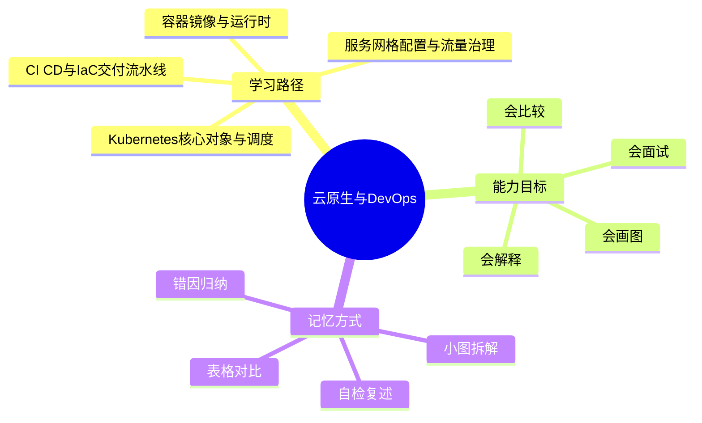
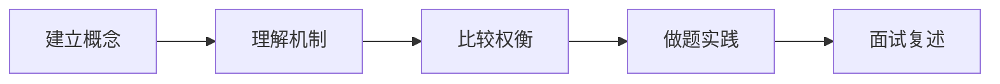
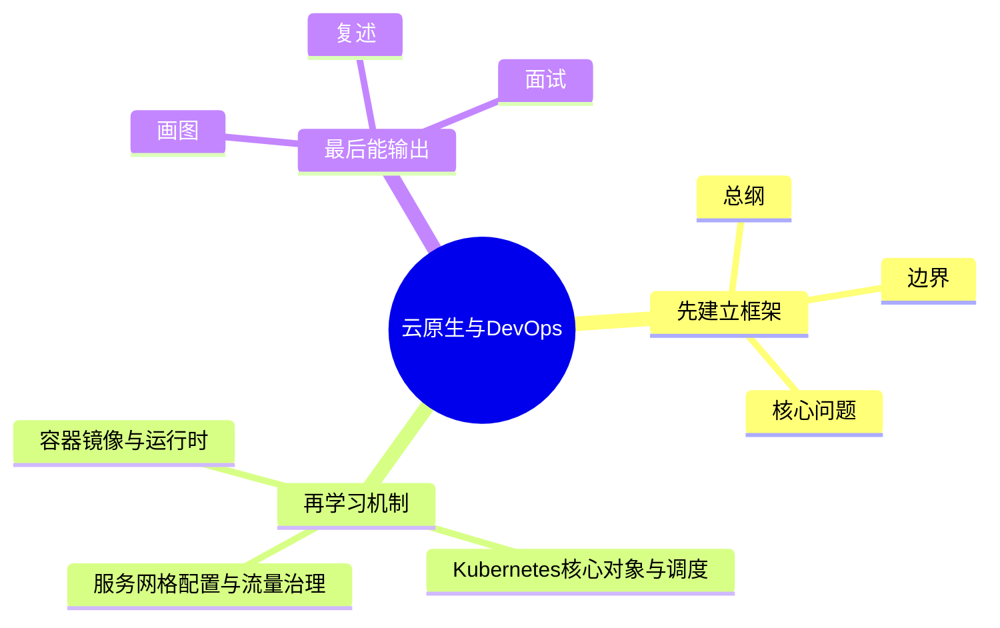
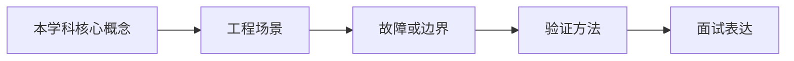
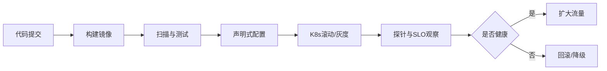

# 云原生与DevOps学习路线与知识地图

## 学习目标
- 建立 云原生与DevOps 的整体知识框架。
- 明确每个章节解决什么问题、需要记住什么、如何用于工程或面试。
- 用多张小图和表格降低记忆负担，避免单张巨大思维导图。

## 一句话总纲
云原生用容器、编排、声明式 API 和自动化运维构建弹性系统，DevOps 通过协作和流水线缩短从代码到价值的路径。

## 记忆口诀
> 容器封环境，K8s管编排，流水线交付，观测保可靠，安全贯全程。

## 思维导图

## Mermaid 图解：学习路线

## 分文件章节安排
| 顺序 | 文件 | 学习重点 | 记忆抓手 |
|---|---|---|---|
| 第 1 章 | [[01-容器镜像与运行时]] | 理解容器隔离、镜像层、Dockerfile、Registry 和运行时安全。 | 镜像分层，容器进程，仓库存放 |
| 第 2 章 | [[02-Kubernetes核心对象与调度]] | 掌握 Pod、Deployment、Service、ConfigMap、Secret、调度和控制器。 | 声明期望，控制器调谐 |
| 第 3 章 | [[03-服务网格配置与流量治理]] | 理解服务发现、负载均衡、Sidecar、mTLS、金丝雀和流量方案。 | 通信下沉，流量可控，身份加密 |
| 第 4 章 | [[04-CI CD与IaC交付流水线]] | 掌握持续集成、持续交付、基础设施即代码和环境管理。 | 代码即配置，流水线即交付 |
| 第 5 章 | [[05-可观测性可靠性与安全]] | 理解日志、指标、追踪、SLO、混沌工程和云原生安全。 | 三柱观测，SLO定目标，安全左移 |
| 面试 | [[20-云原生与DevOps面试20问]] | 高频问答、表达模板、易错点 | Q-A-图-口诀 |

## 推荐学习方法
1. 先读本路线，知道每章在全局中的位置。
2. 每章先看思维导图，再看概念解释，最后用自检题复述。
3. 面试题不要死背，按“定义 → 机制 → 适用场景 → 权衡 → 误区”回答。
4. 复杂图拆成小图，每次只记一个因果链或流程链。

## 自检题
- 你能用 1 分钟说清 云原生与DevOps 的核心问题吗？
- 你能指出每章最容易混淆的两个概念吗？
- 你能把章节图不看原文复画出来吗？

## 速记卡片
- 总纲：云原生用容器、编排、声明式 API 和自动化运维构建弹性系统，DevOps 通过协作和流水线缩短从代码到价值的路径。
- 口诀：容器封环境，K8s管编排，流水线交付，观测保可靠，安全贯全程。
- 面试表达：先定义边界，再解释机制，最后讲权衡和误区。

## 深度扩展：如何把本学科学到可迁移

### 1. 学科主线
用容器、编排、声明式配置、自动化流水线和可观测性构建弹性可交付系统。

这意味着学习时不要把章节看成离散文件，而要形成一条稳定链路：**问题从哪里来 → 需要哪些抽象 → 底层机制如何保证结果 → 代价和风险在哪里 → 如何验证理解是否正确**。

### 2. 小思维导图：三阶段学习法

### 3. 分阶段学习重点
| 阶段 | 目标 | 学习动作 | 产出物 |
|---|---|---|---|
| 入门 | 建立全局地图 | 先读路线，再快速浏览每章思维导图 | 能说清本学科解决什么问题 |
| 理解 | 掌握机制和边界 | 对每章画流程图、列前提条件 | 能解释为什么这样设计 |
| 应用 | 做题或工程迁移 | 用案例检查概念是否能落地 | 能选择方案并说出权衡 |
| 面试 | 形成表达模板 | 按 Q-A-图-误区复述 | 能稳定回答 20 个核心问题 |

### 4. 章节之间的关系
- **第 1 层：容器镜像与运行时** —— 学习时要问：它承接了前一章什么问题，又为后一章提供什么工具？
- **第 2 层：Kubernetes核心对象与调度** —— 学习时要问：它承接了前一章什么问题，又为后一章提供什么工具？
- **第 3 层：服务网格配置与流量治理** —— 学习时要问：它承接了前一章什么问题，又为后一章提供什么工具？
- **第 4 层：CI CD与IaC交付流水线** —— 学习时要问：它承接了前一章什么问题，又为后一章提供什么工具？
- **第 5 层：可观测性可靠性与安全** —— 学习时要问：它承接了前一章什么问题，又为后一章提供什么工具？

### 5. 复习闭环
- **风险提醒：** 最大风险是只会写 YAML，不理解控制器、调度、资源隔离、发布方案和安全边界。
- **实践抓手：** 排障和设计都要围绕镜像、Pod、Service、配置、网络、存储、流水线和观测信号展开。
- **闭环方式：** 每学完一章，必须能完成“三件事”：复画图、讲反例、做迁移。

### 6. 总自检
1. 你能否不看目录，按依赖关系重新排列所有章节？
2. 你能否为每章说出一个工程场景或面试场景？
3. 你能否说明本学科与操作系统、网络、数据库、LLM 或后端工程的连接点？

## 专题深化：与其他学科的连接

- **本学科核心连接点：** 例如一次服务发布要经历镜像构建、漏洞扫描、K8s 滚动更新、探针检查、灰度流量、指标观察和快速回滚。
- **向上连接：** 可以支撑系统设计、工程实践、AI Agent 开发和面试表达。
- **向下连接：** 依赖数据结构、操作系统、计算机网络、数据库和数学基础中的概念。

### 学习产出标准
| 层次 | 能力表现 | 自检方式 |
|---|---|---|
| 记住 | 能说出核心名词 | 不看目录复述章节 |
| 理解 | 能画出机制图 | 给别人讲清流程 |
| 应用 | 能解决案例问题 | 用真实约束做方案选择 |
| 迁移 | 能跨学科解释 | 连接 OS/网络/数据库/LLM 场景 |

## 路线图再深化：从“会写 YAML”到“能稳定交付”

### 1. 五层能力模型
云原生与 DevOps 的核心不是某个工具，而是把应用交付变成可声明、可调度、可观测、可回滚的工程系统。

| 层次 | 关注点 | 关键对象 | 常见误区 |
|---|---|---|---|
| 镜像与运行时 | 环境一致性、隔离、启动 | Image、Container、Runtime | 只会写 Dockerfile，不理解分层缓存和最小权限 |
| 编排与调度 | 期望状态、资源、健康 | Pod、Deployment、Service、Scheduler | 只看副本数，不看 request/limit、探针和 PDB |
| 流量与配置 | 服务发现、灰度、策略 | Ingress、Gateway、Service Mesh、ConfigMap | 把流量治理当负载均衡，不考虑超时重试放大 |
| 交付与 IaC | 流水线、环境、状态 | CI/CD、GitOps、Terraform、Helm | 手工改线上配置，导致声明状态失真 |
| 可靠性与安全 | SLO、观测、权限、供应链 | Metrics、Logs、Traces、RBAC、Policy | 事故后只扩容，不分析错误预算和变更来源 |

### 2. 小图：一次发布的控制闭环

### 3. 必须理解的底层机制
- **容器不是虚拟机：** 它复用宿主机内核，通过 namespace 做隔离，通过 cgroup 做资源限制。
- **Kubernetes 是控制器系统：** 用户提交期望状态，控制器不断对比实际状态并修正偏差。
- **调度不是随机分配：** Scheduler 要综合资源请求、亲和性、污点容忍、拓扑约束和优先级。
- **Service 不是服务本身：** 它提供稳定访问入口，背后仍依赖 Endpoint/EndpointSlice 指向真实 Pod。
- **DevOps 不是只做 CI/CD：** 它强调开发、测试、运维、安全围绕同一条价值流协作。

### 4. 工程排障路径
| 现象 | 第一层检查 | 第二层检查 | 深层原因 |
|---|---|---|---|
| Pod 起不来 | ImagePull、CrashLoop、探针 | Secret、Config、权限 | 镜像不可用、配置错误、启动依赖缺失 |
| 延迟升高 | CPU/内存、队列、下游 | 超时、重试、连接池 | 资源限制过紧或重试风暴 |
| 发布失败 | rollout 状态、事件 | readiness、PDB、HPA | 健康检查不合理或容量不足 |
| 配置漂移 | Git 状态、集群实际对象 | Helm/Terraform state | 手工改动绕过声明式流程 |
| 安全告警 | 镜像漏洞、RBAC | 网络策略、Secret 暴露 | 供应链或权限边界失控 |

### 5. 面试表达模板
1. **先讲目标：** 云原生让系统弹性、可移植、自动化；DevOps 缩短从代码到价值的反馈路径。
2. **再讲机制：** 镜像封装环境，K8s 控制器维护期望状态，流水线和 IaC 管理交付。
3. **补充可靠性：** 用探针、滚动更新、灰度、SLO、日志指标链路追踪保障上线质量。
4. **最后讲边界：** 小团队/简单服务不一定需要复杂服务网格；复杂度必须用收益证明。

### 6. 记忆钩子
- **K8s 排障四问：** 调度了吗？拉镜像了吗？启动了吗？Ready 了吗？
- **发布四件套：** 小流量、可观测、可回滚、可审计。
- **IaC 三不做：** 不手改线上、不跳过评审、不让状态文件失控。

