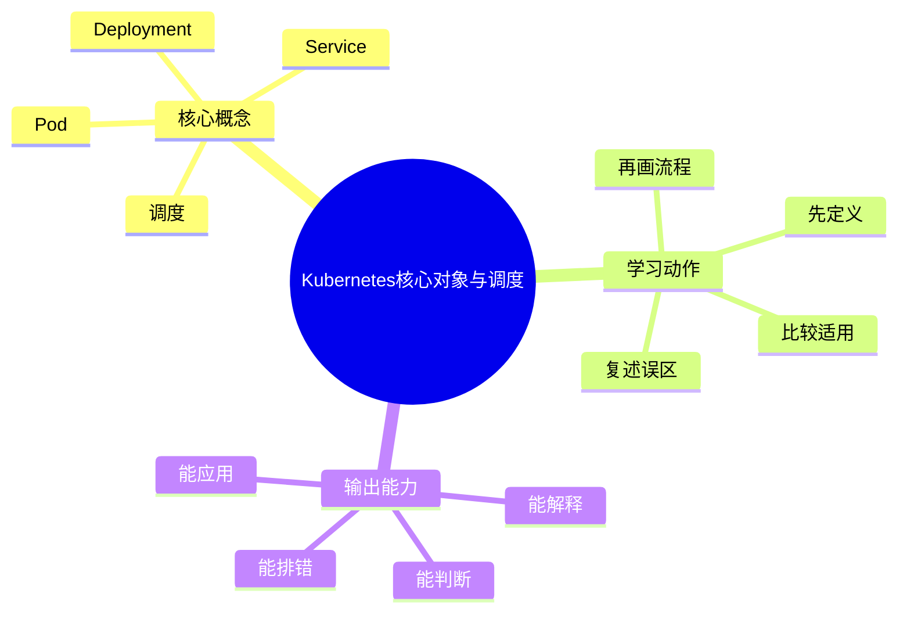
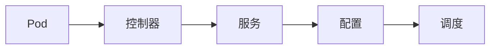
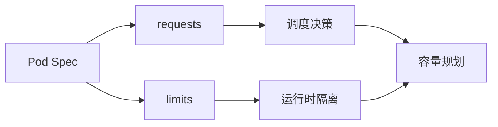

# 云原生与DevOps：Kubernetes核心对象与调度

## 学习目标
- 掌握 Pod、Deployment、Service、ConfigMap、Secret、调度和控制器。
- 能画出本章核心流程图，并能用自己的话解释每个节点。
- 能说出适用场景、边界条件和常见误区。

## 一句话总纲
Kubernetes 用声明式期望状态和控制器循环管理集群资源。

## 记忆口诀
> 声明期望，控制器调谐

## 思维导图

## Mermaid 图解：核心流程

## 分章节讲解
### 1. Pod
**核心定义：** Pod 是 Kubernetes 最小调度单元，包含一个或多个共享网络和存储的容器。

**理解路径：**
- 先明确它解决的具体问题，再判断它依赖的前提条件。
- 把它放回“Kubernetes 用声明式期望状态和控制器循环管理集群资源。”这条主线中理解，不要孤立记忆。
- 学习时至少能说出：输入是什么、输出是什么、代价是什么、失败边界是什么。

**常见误区：** 通常不直接管理裸 Pod，而是通过 Deployment、StatefulSet 等控制器管理。

### 2. Deployment
**核心定义：** Deployment 管理无状态副本、滚动更新和回滚，保证期望副本数。

**理解路径：**
- 先明确它解决的具体问题，再判断它依赖的前提条件。
- 把它放回“Kubernetes 用声明式期望状态和控制器循环管理集群资源。”这条主线中理解，不要孤立记忆。
- 学习时至少能说出：输入是什么、输出是什么、代价是什么、失败边界是什么。

**常见误区：** Deployment 不适合需要稳定网络身份和有序存储的有状态服务。

### 3. Service
**核心定义：** Service 为一组 Pod 提供稳定访问入口和负载均衡。

**理解路径：**
- 先明确它解决的具体问题，再判断它依赖的前提条件。
- 把它放回“Kubernetes 用声明式期望状态和控制器循环管理集群资源。”这条主线中理解，不要孤立记忆。
- 学习时至少能说出：输入是什么、输出是什么、代价是什么、失败边界是什么。

**常见误区：** Pod IP 会变化；客户端不应直接依赖 Pod IP。

### 4. 调度
**核心定义：** 调度器根据资源请求、亲和性、污点容忍和约束把 Pod 放到节点。

**理解路径：**
- 先明确它解决的具体问题，再判断它依赖的前提条件。
- 把它放回“Kubernetes 用声明式期望状态和控制器循环管理集群资源。”这条主线中理解，不要孤立记忆。
- 学习时至少能说出：输入是什么、输出是什么、代价是什么、失败边界是什么。

**常见误区：** 只设置 limit 不设置 request 会影响调度和资源保障。

## 关键对比表
| 知识点 | 正确理解 | 常见误区 |
|---|---|---|
| Pod | Pod 是 Kubernetes 最小调度单元，包含一个或多个共享网络和存储的容器。 | 通常不直接管理裸 Pod，而是通过 Deployment、StatefulSet 等控制器管理。 |
| Deployment | Deployment 管理无状态副本、滚动更新和回滚，保证期望副本数。 | Deployment 不适合需要稳定网络身份和有序存储的有状态服务。 |
| Service | Service 为一组 Pod 提供稳定访问入口和负载均衡。 | Pod IP 会变化；客户端不应直接依赖 Pod IP。 |
| 调度 | 调度器根据资源请求、亲和性、污点容忍和约束把 Pod 放到节点。 | 只设置 limit 不设置 request 会影响调度和资源保障。 |

## 常见误区总结
- **Pod：** 通常不直接管理裸 Pod，而是通过 Deployment、StatefulSet 等控制器管理。
- **Deployment：** Deployment 不适合需要稳定网络身份和有序存储的有状态服务。
- **Service：** Pod IP 会变化；客户端不应直接依赖 Pod IP。
- **调度：** 只设置 limit 不设置 request 会影响调度和资源保障。

## 自检题
1. 本章的核心问题是什么？请用一句话回答：Kubernetes 用声明式期望状态和控制器循环管理集群资源。
2. 本章每个概念的适用前提分别是什么？
3. 哪个误区最容易在面试或工程实践中出现？为什么？

## 速记卡片
- 章节口诀：声明期望，控制器调谐
- 答题结构：定义 → 机制 → 场景 → 权衡 → 误区。
- 复习动作：遮住正文，只根据思维导图复述一遍。

## 深度扩展：底层原理与应用边界

### 1. 本章在「云原生与DevOps」中的位置
- **核心定位：** 用容器、编排、声明式配置、自动化流水线和可观测性构建弹性可交付系统。
- **本章作用：** 「云原生与DevOps：Kubernetes核心对象与调度」负责把总纲落到可操作的判断框架：先确认问题边界，再拆解机制，最后根据代价和风险选择方法。
- **主要风险：** 最大风险是只会写 YAML，不理解控制器、调度、资源隔离、发布方案和安全边界。
- **实践抓手：** 排障和设计都要围绕镜像、Pod、Service、配置、网络、存储、流水线和观测信号展开。

### 2. 小流程图：从概念到应用

### 3. 概念深化：逐个击破
#### 3.1 Pod
- **先问它解决什么：** Pod 不是孤立名词，而是用来解决本章某类约束、关系、代价或风险判断的问题。
- **底层机制：** 学习时要拆成“输入条件 → 中间结构 → 处理规则 → 输出结果”四步；如果任何一步说不清，说明只是记住了结论。
- **适用条件：** 当前提满足、边界清楚、代价可接受时使用；如果输入分布、规模、时序、权限或一致性假设变化，就要重新评估。
- **不适用信号：** 需要违反前提才能套用、只能靠特殊样例解释、复杂度或维护成本明显失控时，应换方案。
- **面试表达：** “我会先定义 Pod，再说明它依赖的前提，最后用一个反例说明边界。”

#### 3.2 Deployment
- **先问它解决什么：** Deployment 不是孤立名词，而是用来解决本章某类约束、关系、代价或风险判断的问题。
- **底层机制：** 学习时要拆成“输入条件 → 中间结构 → 处理规则 → 输出结果”四步；如果任何一步说不清，说明只是记住了结论。
- **适用条件：** 当前提满足、边界清楚、代价可接受时使用；如果输入分布、规模、时序、权限或一致性假设变化，就要重新评估。
- **不适用信号：** 需要违反前提才能套用、只能靠特殊样例解释、复杂度或维护成本明显失控时，应换方案。
- **面试表达：** “我会先定义 Deployment，再说明它依赖的前提，最后用一个反例说明边界。”

#### 3.3 Service
- **先问它解决什么：** Service 不是孤立名词，而是用来解决本章某类约束、关系、代价或风险判断的问题。
- **底层机制：** 学习时要拆成“输入条件 → 中间结构 → 处理规则 → 输出结果”四步；如果任何一步说不清，说明只是记住了结论。
- **适用条件：** 当前提满足、边界清楚、代价可接受时使用；如果输入分布、规模、时序、权限或一致性假设变化，就要重新评估。
- **不适用信号：** 需要违反前提才能套用、只能靠特殊样例解释、复杂度或维护成本明显失控时，应换方案。
- **面试表达：** “我会先定义 Service，再说明它依赖的前提，最后用一个反例说明边界。”

#### 3.4 调度
- **先问它解决什么：** 调度 不是孤立名词，而是用来解决本章某类约束、关系、代价或风险判断的问题。
- **底层机制：** 学习时要拆成“输入条件 → 中间结构 → 处理规则 → 输出结果”四步；如果任何一步说不清，说明只是记住了结论。
- **适用条件：** 当前提满足、边界清楚、代价可接受时使用；如果输入分布、规模、时序、权限或一致性假设变化，就要重新评估。
- **不适用信号：** 需要违反前提才能套用、只能靠特殊样例解释、复杂度或维护成本明显失控时，应换方案。
- **面试表达：** “我会先定义 调度，再说明它依赖的前提，最后用一个反例说明边界。”

### 4. 适用边界对比表
| 判断维度 | 应该怎么想 | 典型错误 | 记忆提示 |
|---|---|---|---|
| 前提条件 | 先列出输入规模、数据分布、系统假设或业务约束 | 不看条件直接套模板 | 先问“凭什么能用” |
| 正确性 | 需要能说明为什么结果保持不变或为什么局部选择成立 | 只给经验结论 | 用不变量、反例或交换论证检查 |
| 复杂度/成本 | 同时估算时间、空间、延迟、吞吐、人力和维护成本 | 只看理论最优 | 工程里还要看常数和可观测性 |
| 失败模式 | 主动说明边界外会怎样失败 | 面试中只讲优点 | 能说失败边界才算真理解 |

### 5. 记忆强化：三层复述法
1. **概念层：** 用一句话定义本章每个核心概念。
2. **机制层：** 不看原文画出输入到输出的流程。
3. **边界层：** 为每个概念准备一个“不能这样用”的反例。

### 6. 工程/做题/面试迁移
- **工程迁移：** 排障和设计都要围绕镜像、Pod、Service、配置、网络、存储、流水线和观测信号展开。
- **做题迁移：** 先把题目中的对象、关系、约束和目标函数圈出来，再映射到本章概念。
- **面试迁移：** 回答时不要只报名词，要说清“为什么需要它、它如何工作、它何时失效”。

### 7. 深度自检题
1. 你能否把本章概念按“前提 → 机制 → 结果 → 代价”重新组织？
2. 如果输入规模、并发量、数据分布或安全边界变化，原结论是否仍成立？
3. 本章哪个概念最容易被误用？请给出一个反例。
4. 如果让你设计一道面试题，你会怎样考察候选人是否真的理解？

### 8. 深度速记卡片
- **总抓手：** 用容器、编排、声明式配置、自动化流水线和可观测性构建弹性可交付系统。
- **答题模板：** 定义边界 → 拆底层机制 → 说适用条件 → 讲权衡 → 给反例。
- **复习动作：** 每次复习只看图和表，尝试口述 3 分钟；卡住处再回正文。

## 专题深化：具体机制、案例与追问

### 1. 具体案例：把「Kubernetes核心对象与调度」放进真实问题
例如一次服务发布要经历镜像构建、漏洞扫描、K8s 滚动更新、探针检查、灰度流量、指标观察和快速回滚。

### 2. 本章关键机制细化
- Pod 是调度单元，Deployment 管理无状态副本。
- Service 提供稳定访问入口。
- request 影响调度，limit 影响资源上限。

### 3. 概念到判断的检查清单
| 概念/动作 | 你要检查什么 | 如果检查失败会怎样 |
|---|---|---|
| Pod | 前提、输入、输出、代价、失败边界是否都说清 | 可能套错模型、复杂度失控或得到不可验证结论 |
| Deployment | 前提、输入、输出、代价、失败边界是否都说清 | 可能套错模型、复杂度失控或得到不可验证结论 |
| Service | 前提、输入、输出、代价、失败边界是否都说清 | 可能套错模型、复杂度失控或得到不可验证结论 |
| 调度 | 前提、输入、输出、代价、失败边界是否都说清 | 可能套错模型、复杂度失控或得到不可验证结论 |
| 本章在「云原生与DevOps」中的位置 | 前提、输入、输出、代价、失败边界是否都说清 | 可能套错模型、复杂度失控或得到不可验证结论 |

### 4. 面试追问路径

- 声明式配置是否表达真实期望状态？
- 资源请求和限制是否合理？
- 发布失败时如何定位和回滚？

### 5. 验证与复盘
- **验证方式：** 用 CI 检查、部署演练、探针、日志指标追踪、SLO 和混沌实验验证。
- **复盘方式：** 每次做题或设计后，记录“我使用了哪个前提、哪个前提最容易被破坏、如果破坏如何调整”。
- **记忆方式：** 不背孤立结论，只背“问题 → 机制 → 边界 → 验证”的链路。

## 本轮扩写：探针、资源、调度与扰动预算

### 1. Pod 健康不等于进程存在
Kubernetes 用探针把“进程活着”“服务可接流量”“启动是否完成”分开。

| 探针 | 回答的问题 | 失败后动作 | 常见误区 |
|---|---|---|---|
| livenessProbe | 进程是否需要重启 | 重启容器 | 用它检查下游依赖，导致级联重启 |
| readinessProbe | 是否能接收流量 | 从 Service endpoints 移除 | 不配置导致未初始化就接流量 |
| startupProbe | 慢启动是否仍正常 | 保护启动期 | 用过大的 liveness 初始延迟替代 |

### 2. requests/limits 是调度和隔离的契约
- request 决定调度器如何放置 Pod，也是资源承诺。
- limit 决定容器可用资源上限，CPU 超限会被 throttling，内存超限可能 OOMKilled。
- request 过低会导致节点超卖和抖动；过高会导致集群利用率低。
- HPA 依赖资源指标时，request 设置不合理会让扩缩容判断失真。

### 3. 调度约束的适用边界
| 机制 | 适用 | 不适用 | 面试提醒 |
|---|---|---|---|
| nodeSelector | 简单固定标签 | 多条件复杂策略 | 简单但不灵活 |
| nodeAffinity | 节点亲和/反亲和 | 强制跨区高可用的全部需求 | 区分 required 和 preferred |
| taints/tolerations | 专用节点隔离 | 普通业务随意加 toleration | toleration 不是调度到该节点的保证 |
| topology spread | 跨区/跨节点打散 | 单副本服务 | 与副本数和可用区容量相关 |
| PDB | 自愿驱逐时保可用 | 节点硬故障 | 只约束自愿中断 |

### 4. 面试追问路径
- “Pod 一直重启怎么排查？”——看事件、退出码、探针、资源限制、镜像和依赖初始化。
- “为什么服务有 Pod 但没流量？”——检查 readiness、Service selector、Endpoints、NetworkPolicy。
- “如何做高可用部署？”——回答副本数、跨节点/跨区分布、PDB、滚动更新和容量冗余。
