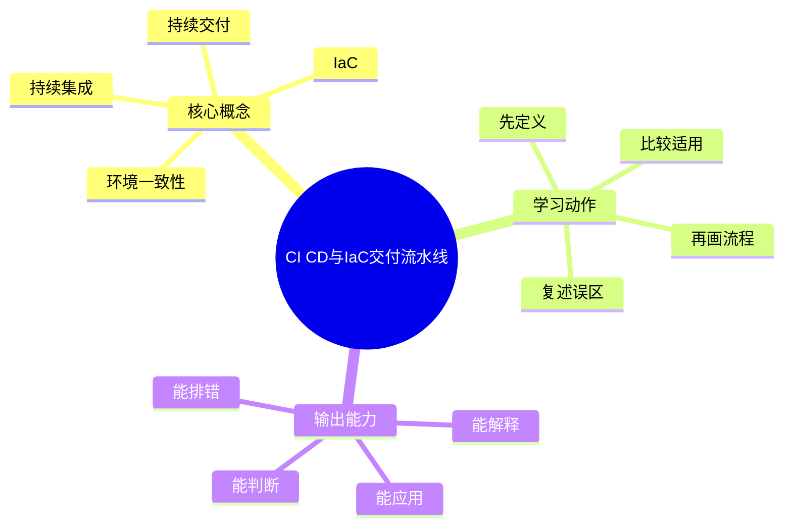
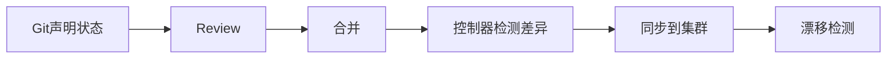

# 云原生与DevOps：CI CD与IaC交付流水线

## 学习目标
- 掌握持续集成、持续交付、基础设施即代码和环境管理。
- 能画出本章核心流程图，并能用自己的话解释每个节点。
- 能说出适用场景、边界条件和常见误区。

## 一句话总纲
DevOps 的目标是让变更可自动验证、可重复交付、可快速回滚。

## 记忆口诀
> 代码即配置，流水线即交付

## 思维导图

## Mermaid 图解：核心流程

## 分章节讲解
### 1. 持续集成
**核心定义：** 持续集成在代码合入前后自动构建、测试和静态检查，缩短反馈周期。

**理解路径：**
- 先明确它解决的具体问题，再判断它依赖的前提条件。
- 把它放回“DevOps 的目标是让变更可自动验证、可重复交付、可快速回滚。”这条主线中理解，不要孤立记忆。
- 学习时至少能说出：输入是什么、输出是什么、代价是什么、失败边界是什么。

**常见误区：** CI 慢且不稳定会被团队绕过；必须治理 flaky 测试。

### 2. 持续交付
**核心定义：** 持续交付保证代码随时处于可发布状态，部署动作自动化但可受审批控制。

**理解路径：**
- 先明确它解决的具体问题，再判断它依赖的前提条件。
- 把它放回“DevOps 的目标是让变更可自动验证、可重复交付、可快速回滚。”这条主线中理解，不要孤立记忆。
- 学习时至少能说出：输入是什么、输出是什么、代价是什么、失败边界是什么。

**常见误区：** 持续交付不等于每次提交都自动上生产。

### 3. IaC
**核心定义：** 基础设施即代码用声明式配置管理云资源、网络、权限和中间件。

**理解路径：**
- 先明确它解决的具体问题，再判断它依赖的前提条件。
- 把它放回“DevOps 的目标是让变更可自动验证、可重复交付、可快速回滚。”这条主线中理解，不要孤立记忆。
- 学习时至少能说出：输入是什么、输出是什么、代价是什么、失败边界是什么。

**常见误区：** 手工改云资源会造成漂移；状态文件和权限要保护。

### 4. 环境一致性
**核心定义：** 环境一致性通过镜像、配置模板、密钥管理和流水线减少开发到生产差异。

**理解路径：**
- 先明确它解决的具体问题，再判断它依赖的前提条件。
- 把它放回“DevOps 的目标是让变更可自动验证、可重复交付、可快速回滚。”这条主线中理解，不要孤立记忆。
- 学习时至少能说出：输入是什么、输出是什么、代价是什么、失败边界是什么。

**常见误区：** 把生产问题归因于“环境不一样”说明交付链路缺少约束。

## 关键对比表
| 知识点 | 正确理解 | 常见误区 |
|---|---|---|
| 持续集成 | 持续集成在代码合入前后自动构建、测试和静态检查，缩短反馈周期。 | CI 慢且不稳定会被团队绕过；必须治理 flaky 测试。 |
| 持续交付 | 持续交付保证代码随时处于可发布状态，部署动作自动化但可受审批控制。 | 持续交付不等于每次提交都自动上生产。 |
| IaC | 基础设施即代码用声明式配置管理云资源、网络、权限和中间件。 | 手工改云资源会造成漂移；状态文件和权限要保护。 |
| 环境一致性 | 环境一致性通过镜像、配置模板、密钥管理和流水线减少开发到生产差异。 | 把生产问题归因于“环境不一样”说明交付链路缺少约束。 |

## 常见误区总结
- **持续集成：** CI 慢且不稳定会被团队绕过；必须治理 flaky 测试。
- **持续交付：** 持续交付不等于每次提交都自动上生产。
- **IaC：** 手工改云资源会造成漂移；状态文件和权限要保护。
- **环境一致性：** 把生产问题归因于“环境不一样”说明交付链路缺少约束。

## 自检题
1. 本章的核心问题是什么？请用一句话回答：DevOps 的目标是让变更可自动验证、可重复交付、可快速回滚。
2. 本章每个概念的适用前提分别是什么？
3. 哪个误区最容易在面试或工程实践中出现？为什么？

## 速记卡片
- 章节口诀：代码即配置，流水线即交付
- 答题结构：定义 → 机制 → 场景 → 权衡 → 误区。
- 复习动作：遮住正文，只根据思维导图复述一遍。

## 深度扩展：底层原理与应用边界

### 1. 本章在「云原生与DevOps」中的位置
- **核心定位：** 用容器、编排、声明式配置、自动化流水线和可观测性构建弹性可交付系统。
- **本章作用：** 「云原生与DevOps：CI CD与IaC交付流水线」负责把总纲落到可操作的判断框架：先确认问题边界，再拆解机制，最后根据代价和风险选择方法。
- **主要风险：** 最大风险是只会写 YAML，不理解控制器、调度、资源隔离、发布方案和安全边界。
- **实践抓手：** 排障和设计都要围绕镜像、Pod、Service、配置、网络、存储、流水线和观测信号展开。

### 2. 小流程图：从概念到应用

### 3. 概念深化：逐个击破
#### 3.1 持续集成
- **先问它解决什么：** 持续集成 不是孤立名词，而是用来解决本章某类约束、关系、代价或风险判断的问题。
- **底层机制：** 学习时要拆成“输入条件 → 中间结构 → 处理规则 → 输出结果”四步；如果任何一步说不清，说明只是记住了结论。
- **适用条件：** 当前提满足、边界清楚、代价可接受时使用；如果输入分布、规模、时序、权限或一致性假设变化，就要重新评估。
- **不适用信号：** 需要违反前提才能套用、只能靠特殊样例解释、复杂度或维护成本明显失控时，应换方案。
- **面试表达：** “我会先定义 持续集成，再说明它依赖的前提，最后用一个反例说明边界。”

#### 3.2 持续交付
- **先问它解决什么：** 持续交付 不是孤立名词，而是用来解决本章某类约束、关系、代价或风险判断的问题。
- **底层机制：** 学习时要拆成“输入条件 → 中间结构 → 处理规则 → 输出结果”四步；如果任何一步说不清，说明只是记住了结论。
- **适用条件：** 当前提满足、边界清楚、代价可接受时使用；如果输入分布、规模、时序、权限或一致性假设变化，就要重新评估。
- **不适用信号：** 需要违反前提才能套用、只能靠特殊样例解释、复杂度或维护成本明显失控时，应换方案。
- **面试表达：** “我会先定义 持续交付，再说明它依赖的前提，最后用一个反例说明边界。”

#### 3.3 IaC
- **先问它解决什么：** IaC 不是孤立名词，而是用来解决本章某类约束、关系、代价或风险判断的问题。
- **底层机制：** 学习时要拆成“输入条件 → 中间结构 → 处理规则 → 输出结果”四步；如果任何一步说不清，说明只是记住了结论。
- **适用条件：** 当前提满足、边界清楚、代价可接受时使用；如果输入分布、规模、时序、权限或一致性假设变化，就要重新评估。
- **不适用信号：** 需要违反前提才能套用、只能靠特殊样例解释、复杂度或维护成本明显失控时，应换方案。
- **面试表达：** “我会先定义 IaC，再说明它依赖的前提，最后用一个反例说明边界。”

#### 3.4 环境一致性
- **先问它解决什么：** 环境一致性 不是孤立名词，而是用来解决本章某类约束、关系、代价或风险判断的问题。
- **底层机制：** 学习时要拆成“输入条件 → 中间结构 → 处理规则 → 输出结果”四步；如果任何一步说不清，说明只是记住了结论。
- **适用条件：** 当前提满足、边界清楚、代价可接受时使用；如果输入分布、规模、时序、权限或一致性假设变化，就要重新评估。
- **不适用信号：** 需要违反前提才能套用、只能靠特殊样例解释、复杂度或维护成本明显失控时，应换方案。
- **面试表达：** “我会先定义 环境一致性，再说明它依赖的前提，最后用一个反例说明边界。”

### 4. 适用边界对比表
| 判断维度 | 应该怎么想 | 典型错误 | 记忆提示 |
|---|---|---|---|
| 前提条件 | 先列出输入规模、数据分布、系统假设或业务约束 | 不看条件直接套模板 | 先问“凭什么能用” |
| 正确性 | 需要能说明为什么结果保持不变或为什么局部选择成立 | 只给经验结论 | 用不变量、反例或交换论证检查 |
| 复杂度/成本 | 同时估算时间、空间、延迟、吞吐、人力和维护成本 | 只看理论最优 | 工程里还要看常数和可观测性 |
| 失败模式 | 主动说明边界外会怎样失败 | 面试中只讲优点 | 能说失败边界才算真理解 |

### 5. 记忆强化：三层复述法
1. **概念层：** 用一句话定义本章每个核心概念。
2. **机制层：** 不看原文画出输入到输出的流程。
3. **边界层：** 为每个概念准备一个“不能这样用”的反例。

### 6. 工程/做题/面试迁移
- **工程迁移：** 排障和设计都要围绕镜像、Pod、Service、配置、网络、存储、流水线和观测信号展开。
- **做题迁移：** 先把题目中的对象、关系、约束和目标函数圈出来，再映射到本章概念。
- **面试迁移：** 回答时不要只报名词，要说清“为什么需要它、它如何工作、它何时失效”。

### 7. 深度自检题
1. 你能否把本章概念按“前提 → 机制 → 结果 → 代价”重新组织？
2. 如果输入规模、并发量、数据分布或安全边界变化，原结论是否仍成立？
3. 本章哪个概念最容易被误用？请给出一个反例。
4. 如果让你设计一道面试题，你会怎样考察候选人是否真的理解？

### 8. 深度速记卡片
- **总抓手：** 用容器、编排、声明式配置、自动化流水线和可观测性构建弹性可交付系统。
- **答题模板：** 定义边界 → 拆底层机制 → 说适用条件 → 讲权衡 → 给反例。
- **复习动作：** 每次复习只看图和表，尝试口述 3 分钟；卡住处再回正文。

## 专题深化：具体机制、案例与追问

### 1. 具体案例：把「CI CD与IaC交付流水线」放进真实问题
例如一次服务发布要经历镜像构建、漏洞扫描、K8s 滚动更新、探针检查、灰度流量、指标观察和快速回滚。

### 2. 本章关键机制细化
- CI 提供快速反馈，CD 保持可发布状态。
- IaC 让基础设施可审计、可复现。
- 环境漂移会破坏交付可靠性。

### 3. 概念到判断的检查清单
| 概念/动作 | 你要检查什么 | 如果检查失败会怎样 |
|---|---|---|
| 持续集成 | 前提、输入、输出、代价、失败边界是否都说清 | 可能套错模型、复杂度失控或得到不可验证结论 |
| 持续交付 | 前提、输入、输出、代价、失败边界是否都说清 | 可能套错模型、复杂度失控或得到不可验证结论 |
| IaC | 前提、输入、输出、代价、失败边界是否都说清 | 可能套错模型、复杂度失控或得到不可验证结论 |
| 环境一致性 | 前提、输入、输出、代价、失败边界是否都说清 | 可能套错模型、复杂度失控或得到不可验证结论 |
| 本章在「云原生与DevOps」中的位置 | 前提、输入、输出、代价、失败边界是否都说清 | 可能套错模型、复杂度失控或得到不可验证结论 |

### 4. 面试追问路径

- 声明式配置是否表达真实期望状态？
- 资源请求和限制是否合理？
- 发布失败时如何定位和回滚？

### 5. 验证与复盘
- **验证方式：** 用 CI 检查、部署演练、探针、日志指标追踪、SLO 和混沌实验验证。
- **复盘方式：** 每次做题或设计后，记录“我使用了哪个前提、哪个前提最容易被破坏、如果破坏如何调整”。
- **记忆方式：** 不背孤立结论，只背“问题 → 机制 → 边界 → 验证”的链路。

## 本轮扩写：GitOps、环境晋级与 IaC 状态治理

### 1. GitOps 的核心是“声明式期望状态 + 控制器收敛”

- Git 是审计入口，不是简单脚本仓库。
- 控制器负责比较期望状态和实际状态，并持续收敛。
- 生产变更应通过 PR 审核、策略检查和自动同步完成。
- 手工 kubectl 修改会制造漂移，需要检测和回收。

### 2. 环境晋级不是复制粘贴 YAML
| 阶段 | 关注点 | 常见错误 | 推荐做法 |
|---|---|---|---|
| Dev | 快速反馈 | 与生产差异过大 | 保持关键依赖形态一致 |
| Staging | 集成验证 | 测试数据不真实 | 使用脱敏数据和生产级配置 |
| Canary | 小流量验证 | 无停止条件 | 绑定 SLO 和回滚阈值 |
| Prod | 稳定运行 | 手工热修 | 声明式变更和审计 |

### 3. IaC 状态治理
- state 文件是基础设施真实映射，必须加密、加锁、备份和权限控制。
- plan 阶段要审查删除、替换和权限扩大。
- module 版本要固定，避免上游变化导致不可预测 diff。
- drift detection 要区分紧急手工修复和违规变更。

### 4. 与后端部署文档的边界
本章关注平台交付、环境治理、IaC 状态和集群收敛；后端工程的部署文档关注应用发布、日志指标追踪和线上排障。两者连接但不重复。

### 5. 面试追问路径
- “CI 和 CD 的区别？”——CI 保证集成质量，CD 保证可重复、安全地交付到环境。
- “为什么要 GitOps？”——回答审计、可回滚、漂移检测、权限收敛和声明式状态。
- “Terraform state 丢了怎么办？”——回答备份、导入、锁、权限和变更冻结。
