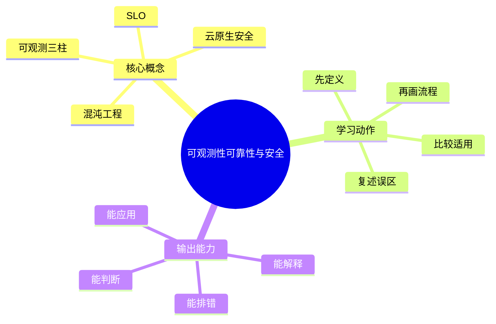
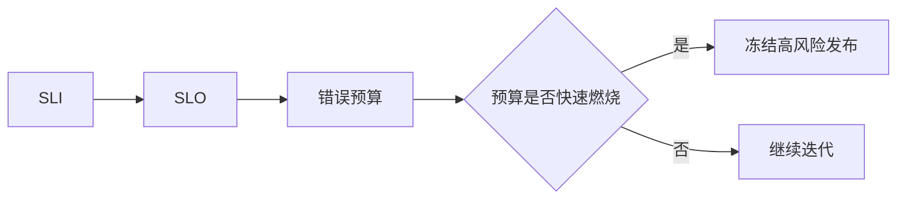

# 云原生与DevOps：可观测性可靠性与安全

## 学习目标
- 理解日志、指标、追踪、SLO、混沌工程和云原生安全。
- 能画出本章核心流程图，并能用自己的话解释每个节点。
- 能说出适用场景、边界条件和常见误区。

## 一句话总纲
云原生系统必须通过可观测性和自动化控制复杂性。

## 记忆口诀
> 三柱观测，SLO定目标，安全左移

## 思维导图

## Mermaid 图解：核心流程

## 分章节讲解
### 1. 可观测三柱
**核心定义：** 日志描述事件，指标描述趋势，追踪描述请求路径，三者互补。

**理解路径：**
- 先明确它解决的具体问题，再判断它依赖的前提条件。
- 把它放回“云原生系统必须通过可观测性和自动化控制复杂性。”这条主线中理解，不要孤立记忆。
- 学习时至少能说出：输入是什么、输出是什么、代价是什么、失败边界是什么。

**常见误区：** 只收集不使用没有价值；观测数据要和告警、排障流程结合。

### 2. SLO
**核心定义：** SLO 定义用户可感知的可靠性目标，错误预算用于平衡稳定性和迭代速度。

**理解路径：**
- 先明确它解决的具体问题，再判断它依赖的前提条件。
- 把它放回“云原生系统必须通过可观测性和自动化控制复杂性。”这条主线中理解，不要孤立记忆。
- 学习时至少能说出：输入是什么、输出是什么、代价是什么、失败边界是什么。

**常见误区：** 追求 100% 可用通常成本极高；SLO 要贴近用户体验。

### 3. 混沌工程
**核心定义：** 混沌工程通过受控故障实验验证系统韧性和应急能力。

**理解路径：**
- 先明确它解决的具体问题，再判断它依赖的前提条件。
- 把它放回“云原生系统必须通过可观测性和自动化控制复杂性。”这条主线中理解，不要孤立记忆。
- 学习时至少能说出：输入是什么、输出是什么、代价是什么、失败边界是什么。

**常见误区：** 混沌实验必须有假设、范围、回滚和保护措施。

### 4. 云原生安全
**核心定义：** 云原生安全覆盖镜像、集群、网络、身份、密钥、供应链和运行时检测。

**理解路径：**
- 先明确它解决的具体问题，再判断它依赖的前提条件。
- 把它放回“云原生系统必须通过可观测性和自动化控制复杂性。”这条主线中理解，不要孤立记忆。
- 学习时至少能说出：输入是什么、输出是什么、代价是什么、失败边界是什么。

**常见误区：** 只扫描镜像不足以保障运行时安全；权限和网络方案同样关键。

## 关键对比表
| 知识点 | 正确理解 | 常见误区 |
|---|---|---|
| 可观测三柱 | 日志描述事件，指标描述趋势，追踪描述请求路径，三者互补。 | 只收集不使用没有价值；观测数据要和告警、排障流程结合。 |
| SLO | SLO 定义用户可感知的可靠性目标，错误预算用于平衡稳定性和迭代速度。 | 追求 100% 可用通常成本极高；SLO 要贴近用户体验。 |
| 混沌工程 | 混沌工程通过受控故障实验验证系统韧性和应急能力。 | 混沌实验必须有假设、范围、回滚和保护措施。 |
| 云原生安全 | 云原生安全覆盖镜像、集群、网络、身份、密钥、供应链和运行时检测。 | 只扫描镜像不足以保障运行时安全；权限和网络方案同样关键。 |

## 常见误区总结
- **可观测三柱：** 只收集不使用没有价值；观测数据要和告警、排障流程结合。
- **SLO：** 追求 100% 可用通常成本极高；SLO 要贴近用户体验。
- **混沌工程：** 混沌实验必须有假设、范围、回滚和保护措施。
- **云原生安全：** 只扫描镜像不足以保障运行时安全；权限和网络方案同样关键。

## 自检题
1. 本章的核心问题是什么？请用一句话回答：云原生系统必须通过可观测性和自动化控制复杂性。
2. 本章每个概念的适用前提分别是什么？
3. 哪个误区最容易在面试或工程实践中出现？为什么？

## 速记卡片
- 章节口诀：三柱观测，SLO定目标，安全左移
- 答题结构：定义 → 机制 → 场景 → 权衡 → 误区。
- 复习动作：遮住正文，只根据思维导图复述一遍。

## 深度扩展：底层原理与应用边界

### 1. 本章在「云原生与DevOps」中的位置
- **核心定位：** 用容器、编排、声明式配置、自动化流水线和可观测性构建弹性可交付系统。
- **本章作用：** 「云原生与DevOps：可观测性可靠性与安全」负责把总纲落到可操作的判断框架：先确认问题边界，再拆解机制，最后根据代价和风险选择方法。
- **主要风险：** 最大风险是只会写 YAML，不理解控制器、调度、资源隔离、发布方案和安全边界。
- **实践抓手：** 排障和设计都要围绕镜像、Pod、Service、配置、网络、存储、流水线和观测信号展开。

### 2. 小流程图：从概念到应用

### 3. 概念深化：逐个击破
#### 3.1 可观测三柱
- **先问它解决什么：** 可观测三柱 不是孤立名词，而是用来解决本章某类约束、关系、代价或风险判断的问题。
- **底层机制：** 学习时要拆成“输入条件 → 中间结构 → 处理规则 → 输出结果”四步；如果任何一步说不清，说明只是记住了结论。
- **适用条件：** 当前提满足、边界清楚、代价可接受时使用；如果输入分布、规模、时序、权限或一致性假设变化，就要重新评估。
- **不适用信号：** 需要违反前提才能套用、只能靠特殊样例解释、复杂度或维护成本明显失控时，应换方案。
- **面试表达：** “我会先定义 可观测三柱，再说明它依赖的前提，最后用一个反例说明边界。”

#### 3.2 SLO
- **先问它解决什么：** SLO 不是孤立名词，而是用来解决本章某类约束、关系、代价或风险判断的问题。
- **底层机制：** 学习时要拆成“输入条件 → 中间结构 → 处理规则 → 输出结果”四步；如果任何一步说不清，说明只是记住了结论。
- **适用条件：** 当前提满足、边界清楚、代价可接受时使用；如果输入分布、规模、时序、权限或一致性假设变化，就要重新评估。
- **不适用信号：** 需要违反前提才能套用、只能靠特殊样例解释、复杂度或维护成本明显失控时，应换方案。
- **面试表达：** “我会先定义 SLO，再说明它依赖的前提，最后用一个反例说明边界。”

#### 3.3 混沌工程
- **先问它解决什么：** 混沌工程 不是孤立名词，而是用来解决本章某类约束、关系、代价或风险判断的问题。
- **底层机制：** 学习时要拆成“输入条件 → 中间结构 → 处理规则 → 输出结果”四步；如果任何一步说不清，说明只是记住了结论。
- **适用条件：** 当前提满足、边界清楚、代价可接受时使用；如果输入分布、规模、时序、权限或一致性假设变化，就要重新评估。
- **不适用信号：** 需要违反前提才能套用、只能靠特殊样例解释、复杂度或维护成本明显失控时，应换方案。
- **面试表达：** “我会先定义 混沌工程，再说明它依赖的前提，最后用一个反例说明边界。”

#### 3.4 云原生安全
- **先问它解决什么：** 云原生安全 不是孤立名词，而是用来解决本章某类约束、关系、代价或风险判断的问题。
- **底层机制：** 学习时要拆成“输入条件 → 中间结构 → 处理规则 → 输出结果”四步；如果任何一步说不清，说明只是记住了结论。
- **适用条件：** 当前提满足、边界清楚、代价可接受时使用；如果输入分布、规模、时序、权限或一致性假设变化，就要重新评估。
- **不适用信号：** 需要违反前提才能套用、只能靠特殊样例解释、复杂度或维护成本明显失控时，应换方案。
- **面试表达：** “我会先定义 云原生安全，再说明它依赖的前提，最后用一个反例说明边界。”

### 4. 适用边界对比表
| 判断维度 | 应该怎么想 | 典型错误 | 记忆提示 |
|---|---|---|---|
| 前提条件 | 先列出输入规模、数据分布、系统假设或业务约束 | 不看条件直接套模板 | 先问“凭什么能用” |
| 正确性 | 需要能说明为什么结果保持不变或为什么局部选择成立 | 只给经验结论 | 用不变量、反例或交换论证检查 |
| 复杂度/成本 | 同时估算时间、空间、延迟、吞吐、人力和维护成本 | 只看理论最优 | 工程里还要看常数和可观测性 |
| 失败模式 | 主动说明边界外会怎样失败 | 面试中只讲优点 | 能说失败边界才算真理解 |

### 5. 记忆强化：三层复述法
1. **概念层：** 用一句话定义本章每个核心概念。
2. **机制层：** 不看原文画出输入到输出的流程。
3. **边界层：** 为每个概念准备一个“不能这样用”的反例。

### 6. 工程/做题/面试迁移
- **工程迁移：** 排障和设计都要围绕镜像、Pod、Service、配置、网络、存储、流水线和观测信号展开。
- **做题迁移：** 先把题目中的对象、关系、约束和目标函数圈出来，再映射到本章概念。
- **面试迁移：** 回答时不要只报名词，要说清“为什么需要它、它如何工作、它何时失效”。

### 7. 深度自检题
1. 你能否把本章概念按“前提 → 机制 → 结果 → 代价”重新组织？
2. 如果输入规模、并发量、数据分布或安全边界变化，原结论是否仍成立？
3. 本章哪个概念最容易被误用？请给出一个反例。
4. 如果让你设计一道面试题，你会怎样考察候选人是否真的理解？

### 8. 深度速记卡片
- **总抓手：** 用容器、编排、声明式配置、自动化流水线和可观测性构建弹性可交付系统。
- **答题模板：** 定义边界 → 拆底层机制 → 说适用条件 → 讲权衡 → 给反例。
- **复习动作：** 每次复习只看图和表，尝试口述 3 分钟；卡住处再回正文。

## 专题深化：具体机制、案例与追问

### 1. 具体案例：把「可观测性可靠性与安全」放进真实问题
例如一次服务发布要经历镜像构建、漏洞扫描、K8s 滚动更新、探针检查、灰度流量、指标观察和快速回滚。

### 2. 本章关键机制细化
- SLO 以用户体验定义可靠性目标。
- 错误预算平衡稳定和迭代。
- 云原生安全覆盖镜像、集群、网络、身份和运行时。

### 3. 概念到判断的检查清单
| 概念/动作 | 你要检查什么 | 如果检查失败会怎样 |
|---|---|---|
| 可观测三柱 | 前提、输入、输出、代价、失败边界是否都说清 | 可能套错模型、复杂度失控或得到不可验证结论 |
| SLO | 前提、输入、输出、代价、失败边界是否都说清 | 可能套错模型、复杂度失控或得到不可验证结论 |
| 混沌工程 | 前提、输入、输出、代价、失败边界是否都说清 | 可能套错模型、复杂度失控或得到不可验证结论 |
| 云原生安全 | 前提、输入、输出、代价、失败边界是否都说清 | 可能套错模型、复杂度失控或得到不可验证结论 |
| 本章在「云原生与DevOps」中的位置 | 前提、输入、输出、代价、失败边界是否都说清 | 可能套错模型、复杂度失控或得到不可验证结论 |

### 4. 面试追问路径

- 声明式配置是否表达真实期望状态？
- 资源请求和限制是否合理？
- 发布失败时如何定位和回滚？

### 5. 验证与复盘
- **验证方式：** 用 CI 检查、部署演练、探针、日志指标追踪、SLO 和混沌实验验证。
- **复盘方式：** 每次做题或设计后，记录“我使用了哪个前提、哪个前提最容易被破坏、如果破坏如何调整”。
- **记忆方式：** 不背孤立结论，只背“问题 → 机制 → 边界 → 验证”的链路。

## 本轮扩写：SLO、错误预算、混沌与云原生安全

### 1. SLO 把可靠性变成可管理预算
| 概念 | 含义 | 用途 | 误区 |
|---|---|---|---|
| SLI | 可量化用户体验指标 | 衡量真实体验 | 只选机器指标 |
| SLO | SLI 的目标值 | 决定是否满足承诺 | 设成 100% |
| Error Budget | 允许失败额度 | 平衡迭代和稳定 | 用完还继续高风险发布 |
| Burn Rate | 预算消耗速度 | 快速发现风险 | 只看月末总量 |

### 2. 混沌工程要有假设和停止条件
- 先提出假设：例如“单节点故障不会让支付 API 错误率超过 1%”。
- 先在低风险环境演练，再逐步扩大到生产小范围。
- 必须设置停止条件：错误率、延迟、告警、人工中止。
- 演练后要补充自动化检测、Runbook 和容量冗余。

### 3. 云原生安全分层
| 层次 | 控制点 | 常见问题 | 验证方式 |
|---|---|---|---|
| 镜像 | SBOM、签名、漏洞扫描 | 使用未知基础镜像 | 构建准入 |
| 工作负载 | 最小权限、只读文件系统 | root 容器、特权模式 | admission policy |
| 网络 | NetworkPolicy、mTLS | 默认全互通 | 连通性测试 |
| 密钥 | Secret 加密、轮换 | 明文环境变量泄露 | 审计和扫描 |
| 集群 | RBAC、审计日志 | cluster-admin 泛滥 | 权限审查 |

### 4. 面试追问路径
- “为什么 SLO 不能设 100%？”——成本极高且会牺牲迭代，错误预算用于理性权衡。
- “混沌工程是不是故意搞坏系统？”——不是，目标是在受控条件下验证韧性假设。
- “K8s 安全从哪里入手？”——镜像供应链、运行时权限、网络隔离、密钥和 RBAC。
