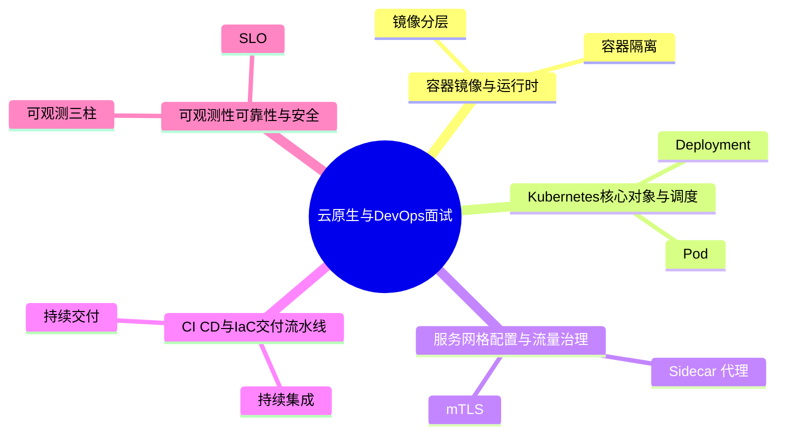
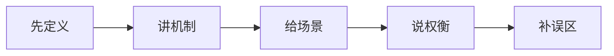
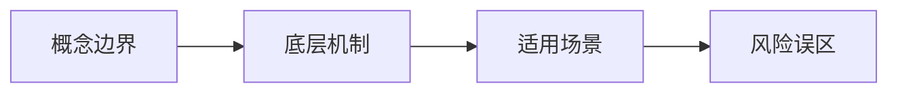
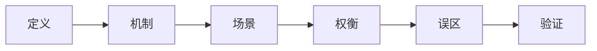
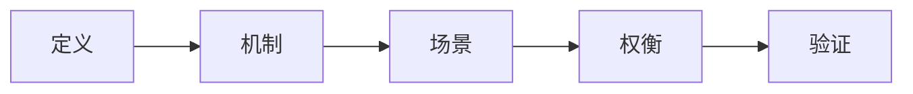

# 云原生与DevOps面试20问

## 学习目标
- 用 20 个高频问题串起 云原生与DevOps 的核心知识。
- 每个答案都按“定义 → 机制 → 场景 → 权衡 → 误区 → 记忆点”组织，便于面试复述。
- 通过小型 Mermaid 图辅助记忆，避免超大图难以阅读。

## 一句话总纲
云原生用容器、编排、声明式 API 和自动化运维构建弹性系统，DevOps 通过协作和流水线缩短从代码到价值的路径。

## 记忆口诀
> 容器封环境，K8s管编排，流水线交付，观测保可靠，安全贯全程。

## 思维导图

## 答题总流程

## 第 1-5 问：小图记忆

## 深度面试答题框架

- **总主线：** 用容器、编排、声明式配置、自动化流水线和可观测性构建弹性可交付系统。
- **风险提醒：** 最大风险是只会写 YAML，不理解控制器、调度、资源隔离、发布方案和安全边界。
- **实践抓手：** 排障和设计都要围绕镜像、Pod、Service、配置、网络、存储、流水线和观测信号展开。

## 面试答案强化版：逐题深答

> 回答每题都按：定义 → 机制 → 场景 → 权衡 → 误区 → 验证。

### Q1：请解释“镜像分层”的核心思想、适用场景和常见误区。

**答：**
1. **定义：** 镜像由只读层叠加构成，构建缓存和层顺序会影响速度与体积。
2. **机制：** 先确认前提，再说明它处理的数据、状态、边界或资源，最后说明输出结果为什么可信。结合本学科主线看，例如一次服务发布要经历镜像构建、漏洞扫描、K8s 滚动更新、探针检查、灰度流量、指标观察和快速回滚。
3. **适用场景：** 当问题与 镜像分层 的前提一致，并且需要在正确性、性能、可靠性或可维护性之间做判断时使用。
4. **权衡：** 要主动比较收益和代价：它可能提升表达力、效率或可靠性，但也可能增加复杂度、资源消耗或维护成本。
5. **误区：** 不检查前提就套用；只讲结论不讲失败边界；无法说明如何验证。
6. **验证：** 用 CI 检查、部署演练、探针、日志指标追踪、SLO 和混沌实验验证。
**追问回答模板：** 如果面试官继续问“为什么不用别的方案”，从前提差异、失败模式和验证成本三个角度回答。

### Q2：请解释“容器隔离”的核心思想、适用场景和常见误区。

**答：**
1. **定义：** 容器依赖 namespace、cgroup 和能力限制实现进程、资源和权限隔离。
2. **机制：** 先确认前提，再说明它处理的数据、状态、边界或资源，最后说明输出结果为什么可信。结合本学科主线看，例如一次服务发布要经历镜像构建、漏洞扫描、K8s 滚动更新、探针检查、灰度流量、指标观察和快速回滚。
3. **适用场景：** 当问题与 容器隔离 的前提一致，并且需要在正确性、性能、可靠性或可维护性之间做判断时使用。
4. **权衡：** 要主动比较收益和代价：它可能提升表达力、效率或可靠性，但也可能增加复杂度、资源消耗或维护成本。
5. **误区：** 不检查前提就套用；只讲结论不讲失败边界；无法说明如何验证。
6. **验证：** 用 CI 检查、部署演练、探针、日志指标追踪、SLO 和混沌实验验证。
**追问回答模板：** 如果面试官继续问“为什么不用别的方案”，从前提差异、失败模式和验证成本三个角度回答。

### Q3：请解释“Dockerfile 最佳实践”的核心思想、适用场景和常见误区。

**答：**
1. **定义：** Dockerfile 应使用小基础镜像、多阶段构建、固定版本和非 root 用户。
2. **机制：** 先确认前提，再说明它处理的数据、状态、边界或资源，最后说明输出结果为什么可信。结合本学科主线看，例如一次服务发布要经历镜像构建、漏洞扫描、K8s 滚动更新、探针检查、灰度流量、指标观察和快速回滚。
3. **适用场景：** 当问题与 Dockerfile 最佳实践 的前提一致，并且需要在正确性、性能、可靠性或可维护性之间做判断时使用。
4. **权衡：** 要主动比较收益和代价：它可能提升表达力、效率或可靠性，但也可能增加复杂度、资源消耗或维护成本。
5. **误区：** 不检查前提就套用；只讲结论不讲失败边界；无法说明如何验证。
6. **验证：** 用 CI 检查、部署演练、探针、日志指标追踪、SLO 和混沌实验验证。
**追问回答模板：** 如果面试官继续问“为什么不用别的方案”，从前提差异、失败模式和验证成本三个角度回答。

### Q4：请解释“镜像仓库”的核心思想、适用场景和常见误区。

**答：**
1. **定义：** 镜像仓库存储和分发镜像，需配合签名、扫描、权限和保留方案。
2. **机制：** 先确认前提，再说明它处理的数据、状态、边界或资源，最后说明输出结果为什么可信。结合本学科主线看，例如一次服务发布要经历镜像构建、漏洞扫描、K8s 滚动更新、探针检查、灰度流量、指标观察和快速回滚。
3. **适用场景：** 当问题与 镜像仓库 的前提一致，并且需要在正确性、性能、可靠性或可维护性之间做判断时使用。
4. **权衡：** 要主动比较收益和代价：它可能提升表达力、效率或可靠性，但也可能增加复杂度、资源消耗或维护成本。
5. **误区：** 不检查前提就套用；只讲结论不讲失败边界；无法说明如何验证。
6. **验证：** 用 CI 检查、部署演练、探针、日志指标追踪、SLO 和混沌实验验证。
**追问回答模板：** 如果面试官继续问“为什么不用别的方案”，从前提差异、失败模式和验证成本三个角度回答。

### Q5：请解释“Pod”的核心思想、适用场景和常见误区。

**答：**
1. **定义：** Pod 是 Kubernetes 最小调度单元，包含一个或多个共享网络和存储的容器。
2. **机制：** 先确认前提，再说明它处理的数据、状态、边界或资源，最后说明输出结果为什么可信。结合本学科主线看，例如一次服务发布要经历镜像构建、漏洞扫描、K8s 滚动更新、探针检查、灰度流量、指标观察和快速回滚。
3. **适用场景：** 当问题与 Pod 的前提一致，并且需要在正确性、性能、可靠性或可维护性之间做判断时使用。
4. **权衡：** 要主动比较收益和代价：它可能提升表达力、效率或可靠性，但也可能增加复杂度、资源消耗或维护成本。
5. **误区：** 不检查前提就套用；只讲结论不讲失败边界；无法说明如何验证。
6. **验证：** 用 CI 检查、部署演练、探针、日志指标追踪、SLO 和混沌实验验证。
**追问回答模板：** 如果面试官继续问“为什么不用别的方案”，从前提差异、失败模式和验证成本三个角度回答。

### Q6：请解释“Deployment”的核心思想、适用场景和常见误区。

**答：**
1. **定义：** Deployment 管理无状态副本、滚动更新和回滚，保证期望副本数。
2. **机制：** 先确认前提，再说明它处理的数据、状态、边界或资源，最后说明输出结果为什么可信。结合本学科主线看，例如一次服务发布要经历镜像构建、漏洞扫描、K8s 滚动更新、探针检查、灰度流量、指标观察和快速回滚。
3. **适用场景：** 当问题与 Deployment 的前提一致，并且需要在正确性、性能、可靠性或可维护性之间做判断时使用。
4. **权衡：** 要主动比较收益和代价：它可能提升表达力、效率或可靠性，但也可能增加复杂度、资源消耗或维护成本。
5. **误区：** 不检查前提就套用；只讲结论不讲失败边界；无法说明如何验证。
6. **验证：** 用 CI 检查、部署演练、探针、日志指标追踪、SLO 和混沌实验验证。
**追问回答模板：** 如果面试官继续问“为什么不用别的方案”，从前提差异、失败模式和验证成本三个角度回答。

### Q7：请解释“Service”的核心思想、适用场景和常见误区。

**答：**
1. **定义：** Service 为一组 Pod 提供稳定访问入口和负载均衡。
2. **机制：** 先确认前提，再说明它处理的数据、状态、边界或资源，最后说明输出结果为什么可信。结合本学科主线看，例如一次服务发布要经历镜像构建、漏洞扫描、K8s 滚动更新、探针检查、灰度流量、指标观察和快速回滚。
3. **适用场景：** 当问题与 Service 的前提一致，并且需要在正确性、性能、可靠性或可维护性之间做判断时使用。
4. **权衡：** 要主动比较收益和代价：它可能提升表达力、效率或可靠性，但也可能增加复杂度、资源消耗或维护成本。
5. **误区：** 不检查前提就套用；只讲结论不讲失败边界；无法说明如何验证。
6. **验证：** 用 CI 检查、部署演练、探针、日志指标追踪、SLO 和混沌实验验证。
**追问回答模板：** 如果面试官继续问“为什么不用别的方案”，从前提差异、失败模式和验证成本三个角度回答。

### Q8：请解释“调度”的核心思想、适用场景和常见误区。

**答：**
1. **定义：** 调度器根据资源请求、亲和性、污点容忍和约束把 Pod 放到节点。
2. **机制：** 先确认前提，再说明它处理的数据、状态、边界或资源，最后说明输出结果为什么可信。结合本学科主线看，例如一次服务发布要经历镜像构建、漏洞扫描、K8s 滚动更新、探针检查、灰度流量、指标观察和快速回滚。
3. **适用场景：** 当问题与 调度 的前提一致，并且需要在正确性、性能、可靠性或可维护性之间做判断时使用。
4. **权衡：** 要主动比较收益和代价：它可能提升表达力、效率或可靠性，但也可能增加复杂度、资源消耗或维护成本。
5. **误区：** 不检查前提就套用；只讲结论不讲失败边界；无法说明如何验证。
6. **验证：** 用 CI 检查、部署演练、探针、日志指标追踪、SLO 和混沌实验验证。
**追问回答模板：** 如果面试官继续问“为什么不用别的方案”，从前提差异、失败模式和验证成本三个角度回答。

### Q9：请解释“Sidecar 代理”的核心思想、适用场景和常见误区。

**答：**
1. **定义：** Sidecar 代理拦截服务入站和出站流量，提供路由、重试、超时和观测能力。
2. **机制：** 先确认前提，再说明它处理的数据、状态、边界或资源，最后说明输出结果为什么可信。结合本学科主线看，例如一次服务发布要经历镜像构建、漏洞扫描、K8s 滚动更新、探针检查、灰度流量、指标观察和快速回滚。
3. **适用场景：** 当问题与 Sidecar 代理 的前提一致，并且需要在正确性、性能、可靠性或可维护性之间做判断时使用。
4. **权衡：** 要主动比较收益和代价：它可能提升表达力、效率或可靠性，但也可能增加复杂度、资源消耗或维护成本。
5. **误区：** 不检查前提就套用；只讲结论不讲失败边界；无法说明如何验证。
6. **验证：** 用 CI 检查、部署演练、探针、日志指标追踪、SLO 和混沌实验验证。
**追问回答模板：** 如果面试官继续问“为什么不用别的方案”，从前提差异、失败模式和验证成本三个角度回答。

### Q10：请解释“mTLS”的核心思想、适用场景和常见误区。

**答：**
1. **定义：** mTLS 让服务双方互相认证并加密通信，提升东西向流量安全。
2. **机制：** 先确认前提，再说明它处理的数据、状态、边界或资源，最后说明输出结果为什么可信。结合本学科主线看，例如一次服务发布要经历镜像构建、漏洞扫描、K8s 滚动更新、探针检查、灰度流量、指标观察和快速回滚。
3. **适用场景：** 当问题与 mTLS 的前提一致，并且需要在正确性、性能、可靠性或可维护性之间做判断时使用。
4. **权衡：** 要主动比较收益和代价：它可能提升表达力、效率或可靠性，但也可能增加复杂度、资源消耗或维护成本。
5. **误区：** 不检查前提就套用；只讲结论不讲失败边界；无法说明如何验证。
6. **验证：** 用 CI 检查、部署演练、探针、日志指标追踪、SLO 和混沌实验验证。
**追问回答模板：** 如果面试官继续问“为什么不用别的方案”，从前提差异、失败模式和验证成本三个角度回答。

### Q11：请解释“流量治理”的核心思想、适用场景和常见误区。

**答：**
1. **定义：** 流量治理包括金丝雀、镜像流量、权重路由、超时、重试和熔断。
2. **机制：** 先确认前提，再说明它处理的数据、状态、边界或资源，最后说明输出结果为什么可信。结合本学科主线看，例如一次服务发布要经历镜像构建、漏洞扫描、K8s 滚动更新、探针检查、灰度流量、指标观察和快速回滚。
3. **适用场景：** 当问题与 流量治理 的前提一致，并且需要在正确性、性能、可靠性或可维护性之间做判断时使用。
4. **权衡：** 要主动比较收益和代价：它可能提升表达力、效率或可靠性，但也可能增加复杂度、资源消耗或维护成本。
5. **误区：** 不检查前提就套用；只讲结论不讲失败边界；无法说明如何验证。
6. **验证：** 用 CI 检查、部署演练、探针、日志指标追踪、SLO 和混沌实验验证。
**追问回答模板：** 如果面试官继续问“为什么不用别的方案”，从前提差异、失败模式和验证成本三个角度回答。

### Q12：请解释“服务发现”的核心思想、适用场景和常见误区。

**答：**
1. **定义：** 服务发现让服务通过逻辑名称找到后端实例，避免硬编码地址。
2. **机制：** 先确认前提，再说明它处理的数据、状态、边界或资源，最后说明输出结果为什么可信。结合本学科主线看，例如一次服务发布要经历镜像构建、漏洞扫描、K8s 滚动更新、探针检查、灰度流量、指标观察和快速回滚。
3. **适用场景：** 当问题与 服务发现 的前提一致，并且需要在正确性、性能、可靠性或可维护性之间做判断时使用。
4. **权衡：** 要主动比较收益和代价：它可能提升表达力、效率或可靠性，但也可能增加复杂度、资源消耗或维护成本。
5. **误区：** 不检查前提就套用；只讲结论不讲失败边界；无法说明如何验证。
6. **验证：** 用 CI 检查、部署演练、探针、日志指标追踪、SLO 和混沌实验验证。
**追问回答模板：** 如果面试官继续问“为什么不用别的方案”，从前提差异、失败模式和验证成本三个角度回答。

### Q13：请解释“持续集成”的核心思想、适用场景和常见误区。

**答：**
1. **定义：** 持续集成在代码合入前后自动构建、测试和静态检查，缩短反馈周期。
2. **机制：** 先确认前提，再说明它处理的数据、状态、边界或资源，最后说明输出结果为什么可信。结合本学科主线看，例如一次服务发布要经历镜像构建、漏洞扫描、K8s 滚动更新、探针检查、灰度流量、指标观察和快速回滚。
3. **适用场景：** 当问题与 持续集成 的前提一致，并且需要在正确性、性能、可靠性或可维护性之间做判断时使用。
4. **权衡：** 要主动比较收益和代价：它可能提升表达力、效率或可靠性，但也可能增加复杂度、资源消耗或维护成本。
5. **误区：** 不检查前提就套用；只讲结论不讲失败边界；无法说明如何验证。
6. **验证：** 用 CI 检查、部署演练、探针、日志指标追踪、SLO 和混沌实验验证。
**追问回答模板：** 如果面试官继续问“为什么不用别的方案”，从前提差异、失败模式和验证成本三个角度回答。

### Q14：请解释“持续交付”的核心思想、适用场景和常见误区。

**答：**
1. **定义：** 持续交付保证代码随时处于可发布状态，部署动作自动化但可受审批控制。
2. **机制：** 先确认前提，再说明它处理的数据、状态、边界或资源，最后说明输出结果为什么可信。结合本学科主线看，例如一次服务发布要经历镜像构建、漏洞扫描、K8s 滚动更新、探针检查、灰度流量、指标观察和快速回滚。
3. **适用场景：** 当问题与 持续交付 的前提一致，并且需要在正确性、性能、可靠性或可维护性之间做判断时使用。
4. **权衡：** 要主动比较收益和代价：它可能提升表达力、效率或可靠性，但也可能增加复杂度、资源消耗或维护成本。
5. **误区：** 不检查前提就套用；只讲结论不讲失败边界；无法说明如何验证。
6. **验证：** 用 CI 检查、部署演练、探针、日志指标追踪、SLO 和混沌实验验证。
**追问回答模板：** 如果面试官继续问“为什么不用别的方案”，从前提差异、失败模式和验证成本三个角度回答。

### Q15：请解释“IaC”的核心思想、适用场景和常见误区。

**答：**
1. **定义：** 基础设施即代码用声明式配置管理云资源、网络、权限和中间件。
2. **机制：** 先确认前提，再说明它处理的数据、状态、边界或资源，最后说明输出结果为什么可信。结合本学科主线看，例如一次服务发布要经历镜像构建、漏洞扫描、K8s 滚动更新、探针检查、灰度流量、指标观察和快速回滚。
3. **适用场景：** 当问题与 IaC 的前提一致，并且需要在正确性、性能、可靠性或可维护性之间做判断时使用。
4. **权衡：** 要主动比较收益和代价：它可能提升表达力、效率或可靠性，但也可能增加复杂度、资源消耗或维护成本。
5. **误区：** 不检查前提就套用；只讲结论不讲失败边界；无法说明如何验证。
6. **验证：** 用 CI 检查、部署演练、探针、日志指标追踪、SLO 和混沌实验验证。
**追问回答模板：** 如果面试官继续问“为什么不用别的方案”，从前提差异、失败模式和验证成本三个角度回答。

### Q16：请解释“环境一致性”的核心思想、适用场景和常见误区。

**答：**
1. **定义：** 环境一致性通过镜像、配置模板、密钥管理和流水线减少开发到生产差异。
2. **机制：** 先确认前提，再说明它处理的数据、状态、边界或资源，最后说明输出结果为什么可信。结合本学科主线看，例如一次服务发布要经历镜像构建、漏洞扫描、K8s 滚动更新、探针检查、灰度流量、指标观察和快速回滚。
3. **适用场景：** 当问题与 环境一致性 的前提一致，并且需要在正确性、性能、可靠性或可维护性之间做判断时使用。
4. **权衡：** 要主动比较收益和代价：它可能提升表达力、效率或可靠性，但也可能增加复杂度、资源消耗或维护成本。
5. **误区：** 不检查前提就套用；只讲结论不讲失败边界；无法说明如何验证。
6. **验证：** 用 CI 检查、部署演练、探针、日志指标追踪、SLO 和混沌实验验证。
**追问回答模板：** 如果面试官继续问“为什么不用别的方案”，从前提差异、失败模式和验证成本三个角度回答。

### Q17：请解释“可观测三柱”的核心思想、适用场景和常见误区。

**答：**
1. **定义：** 日志描述事件，指标描述趋势，追踪描述请求路径，三者互补。
2. **机制：** 先确认前提，再说明它处理的数据、状态、边界或资源，最后说明输出结果为什么可信。结合本学科主线看，例如一次服务发布要经历镜像构建、漏洞扫描、K8s 滚动更新、探针检查、灰度流量、指标观察和快速回滚。
3. **适用场景：** 当问题与 可观测三柱 的前提一致，并且需要在正确性、性能、可靠性或可维护性之间做判断时使用。
4. **权衡：** 要主动比较收益和代价：它可能提升表达力、效率或可靠性，但也可能增加复杂度、资源消耗或维护成本。
5. **误区：** 不检查前提就套用；只讲结论不讲失败边界；无法说明如何验证。
6. **验证：** 用 CI 检查、部署演练、探针、日志指标追踪、SLO 和混沌实验验证。
**追问回答模板：** 如果面试官继续问“为什么不用别的方案”，从前提差异、失败模式和验证成本三个角度回答。

### Q18：请解释“SLO”的核心思想、适用场景和常见误区。

**答：**
1. **定义：** SLO 定义用户可感知的可靠性目标，错误预算用于平衡稳定性和迭代速度。
2. **机制：** 先确认前提，再说明它处理的数据、状态、边界或资源，最后说明输出结果为什么可信。结合本学科主线看，例如一次服务发布要经历镜像构建、漏洞扫描、K8s 滚动更新、探针检查、灰度流量、指标观察和快速回滚。
3. **适用场景：** 当问题与 SLO 的前提一致，并且需要在正确性、性能、可靠性或可维护性之间做判断时使用。
4. **权衡：** 要主动比较收益和代价：它可能提升表达力、效率或可靠性，但也可能增加复杂度、资源消耗或维护成本。
5. **误区：** 不检查前提就套用；只讲结论不讲失败边界；无法说明如何验证。
6. **验证：** 用 CI 检查、部署演练、探针、日志指标追踪、SLO 和混沌实验验证。
**追问回答模板：** 如果面试官继续问“为什么不用别的方案”，从前提差异、失败模式和验证成本三个角度回答。

### Q19：请解释“混沌工程”的核心思想、适用场景和常见误区。

**答：**
1. **定义：** 混沌工程通过受控故障实验验证系统韧性和应急能力。
2. **机制：** 先确认前提，再说明它处理的数据、状态、边界或资源，最后说明输出结果为什么可信。结合本学科主线看，例如一次服务发布要经历镜像构建、漏洞扫描、K8s 滚动更新、探针检查、灰度流量、指标观察和快速回滚。
3. **适用场景：** 当问题与 混沌工程 的前提一致，并且需要在正确性、性能、可靠性或可维护性之间做判断时使用。
4. **权衡：** 要主动比较收益和代价：它可能提升表达力、效率或可靠性，但也可能增加复杂度、资源消耗或维护成本。
5. **误区：** 不检查前提就套用；只讲结论不讲失败边界；无法说明如何验证。
6. **验证：** 用 CI 检查、部署演练、探针、日志指标追踪、SLO 和混沌实验验证。
**追问回答模板：** 如果面试官继续问“为什么不用别的方案”，从前提差异、失败模式和验证成本三个角度回答。

### Q20：请解释“云原生安全”的核心思想、适用场景和常见误区。

**答：**
1. **定义：** 云原生安全覆盖镜像、集群、网络、身份、密钥、供应链和运行时检测。
2. **机制：** 先确认前提，再说明它处理的数据、状态、边界或资源，最后说明输出结果为什么可信。结合本学科主线看，例如一次服务发布要经历镜像构建、漏洞扫描、K8s 滚动更新、探针检查、灰度流量、指标观察和快速回滚。
3. **适用场景：** 当问题与 云原生安全 的前提一致，并且需要在正确性、性能、可靠性或可维护性之间做判断时使用。
4. **权衡：** 要主动比较收益和代价：它可能提升表达力、效率或可靠性，但也可能增加复杂度、资源消耗或维护成本。
5. **误区：** 不检查前提就套用；只讲结论不讲失败边界；无法说明如何验证。
6. **验证：** 用 CI 检查、部署演练、探针、日志指标追踪、SLO 和混沌实验验证。
**追问回答模板：** 如果面试官继续问“为什么不用别的方案”，从前提差异、失败模式和验证成本三个角度回答。

## 面试终局复盘
| 能力 | 合格表现 | 优秀表现 |
|---|---|---|
| 概念 | 说清定义 | 还能说清边界和反例 |
| 机制 | 说清流程 | 能画图解释不变量或控制点 |
| 工程 | 能给场景 | 能给验证和回滚方式 |
| 表达 | 结构完整 | 能应对追问和对比 |

## 本轮扩写：Q1-Q20 追问速查表

| 题号 | 高频追问 | 回答抓手 |
|---|---|---|
| Q1 | 镜像层为什么影响构建速度？ | 层缓存复用，变动越靠后越好。 |
| Q2 | 容器隔离边界是什么？ | namespace/cgroup，不等于虚拟机安全边界。 |
| Q3 | Dockerfile 如何减小风险？ | 最小基础镜像、非 root、多阶段、固定版本。 |
| Q4 | 镜像仓库要治理什么？ | 签名、扫描、保留策略和权限。 |
| Q5 | Pod 为什么是最小调度单元？ | 共享网络和存储，表达紧密协作容器。 |
| Q6 | Deployment 如何滚动更新？ | ReplicaSet、maxSurge、maxUnavailable 和 readiness。 |
| Q7 | Service 如何发现 Pod？ | selector 生成 endpoints，kube-proxy/iptables/ipvs 转发。 |
| Q8 | 调度器看哪些约束？ | request、亲和性、污点容忍、拓扑和资源。 |
| Q9 | Sidecar 代价是什么？ | 资源、延迟、调试复杂度和升级协调。 |
| Q10 | mTLS 解决什么？ | 服务身份、链路加密和双向认证。 |
| Q11 | 流量治理有哪些手段？ | 路由、重试、超时、熔断、镜像和金丝雀。 |
| Q12 | 服务发现失败怎么排查？ | selector、endpoints、DNS、NetworkPolicy。 |
| Q13 | CI 最关键检查？ | 测试、构建、扫描、契约和制品可追溯。 |
| Q14 | CD 如何安全？ | 分环境晋级、灰度、SLO 门禁和回滚。 |
| Q15 | IaC 风险是什么？ | state 损坏、漂移、误删和权限扩大。 |
| Q16 | 环境一致性如何保证？ | 声明式配置、镜像不可变、密钥分离。 |
| Q17 | 三柱如何联动？ | 指标发现、日志解释、追踪定位链路。 |
| Q18 | SLO 为什么关联错误预算？ | 用预算平衡稳定性和发布速度。 |
| Q19 | 混沌工程怎么安全做？ | 假设、范围、停止条件、回滚和复盘。 |
| Q20 | 云原生安全优先级？ | 镜像供应链、运行时权限、网络、密钥、RBAC。 |
