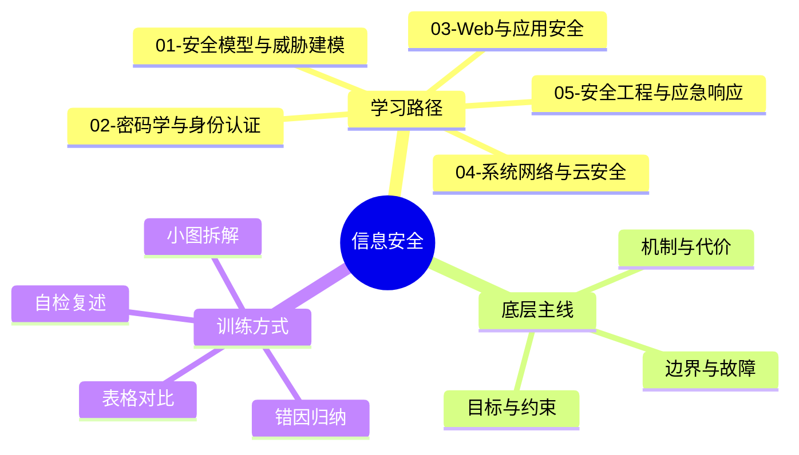
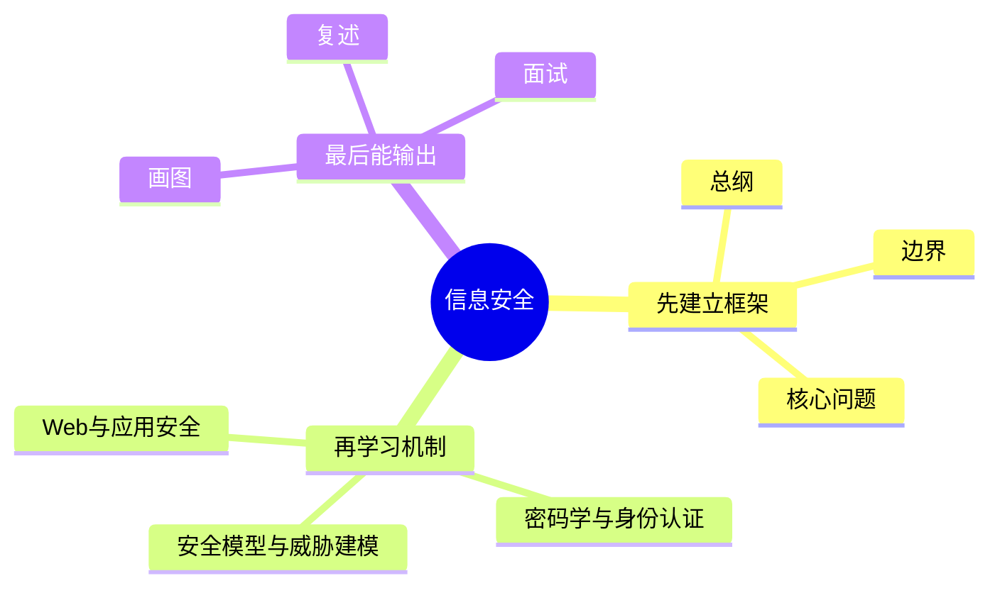
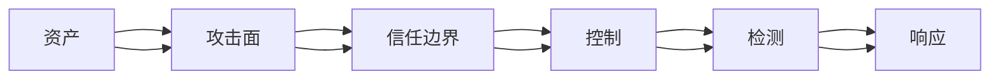
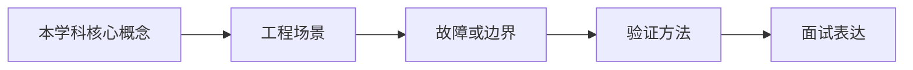

# 信息安全学习路线与知识地图

## 学习目标
- 建立 信息安全 的整体知识框架。
- 明确每个章节解决什么问题、需要记住什么、如何用于工程或面试。
- 能按“概念 → 机制 → 边界 → 实践 → 误区”复述每个章节。
- 用多张小图和表格降低记忆负担，避免单张巨大思维导图。

## 一句话总纲
信息安全的核心是保护机密性、完整性、可用性，并围绕身份、权限、输入、边界和审计建立可验证防线。

## 记忆口诀
> 先建模威胁，再最小权限；输入要验证，密钥要托管，日志能追踪。

## 思维导图

## Mermaid 图解：学习路线

## 底层原理总览
- 先用资产和 CIA 确定保护目标，再用威胁建模找到攻击路径。
- 身份和权限决定“谁能做什么”，输入和边界决定“攻击能从哪里进入”。
- 密码学、系统加固和监控响应分别覆盖保护、隔离、检测和恢复。

## 适用场景与不适用场景
| 场景 | 适合怎么学 | 不适合怎么学 | 原因 |
|---|---|---|---|
| 面试准备 | 用 Q1-Q20 训练结构化表达 | 只背定义 | 面试追问通常落在机制、边界和权衡 |
| 工程设计 | 画边界图、列前提、做对比表 | 直接套方案 | 信息安全 的机制都有适用前提 |
| 排障复盘 | 从失败模式和观测证据倒推 | 只看单点日志 | 复杂问题往往跨多个边界传播 |
| 考试做题 | 先识别关键词和约束 | 看到术语就套模板 | 题目常考边界条件而非名词本身 |

## 分文件章节安排
| 顺序 | 文件 | 学习重点 | 记忆抓手 |
|---|---|---|---|
| 第 1 章 | [[01-安全模型与威胁建模]] | 资产、攻击者、信任边界、STRIDE | 资产-边界-威胁-控制 |
| 第 2 章 | [[02-密码学与身份认证]] | 哈希、加密、签名、认证、授权 | 哈希验完整，加密保机密，签名证身份 |
| 第 3 章 | [[03-Web与应用安全]] | 注入、XSS、CSRF、会话安全 | 输入校验，输出编码，权限后端判 |
| 第 4 章 | [[04-系统网络与云安全]] | 网络分区、主机加固、容器、云 IAM | 分区隔离，最小权限，配置可审 |
| 第 5 章 | [[05-安全工程与应急响应]] | SDL、供应链、日志检测、事件响应 | 左移预防，运行检测，响应复盘 |
| 面试 | [[20-信息安全面试20问]] | Q1-Q20 高频表达 | 定义-机制-场景-权衡-误区 |

## 工程实践或做题/面试理解
1. 每章先用一句话说清核心问题，再解释机制为什么成立。
2. 每个概念都补一个“不适用场景”，避免把强机制用在弱需求上，或把弱机制误用在强约束上。
3. 表格用于比较边界，小图用于记流程，面试回答用于训练表达。
4. 工程落地要补验证：日志、测试、演练、监控或审计证据。

## 章节边界对比表
| 章节 | 主要解决 | 典型代价 | 容易误用 |
|---|---|---|---|
| [[01-安全模型与威胁建模]] | 资产、攻击者、信任边界、STRIDE | 复杂度、性能或维护成本上升 | 只记口诀，不检查前提和边界 |
| [[02-密码学与身份认证]] | 哈希、加密、签名、认证、授权 | 复杂度、性能或维护成本上升 | 只记口诀，不检查前提和边界 |
| [[03-Web与应用安全]] | 注入、XSS、CSRF、会话安全 | 复杂度、性能或维护成本上升 | 只记口诀，不检查前提和边界 |
| [[04-系统网络与云安全]] | 网络分区、主机加固、容器、云 IAM | 复杂度、性能或维护成本上升 | 只记口诀，不检查前提和边界 |
| [[05-安全工程与应急响应]] | SDL、供应链、日志检测、事件响应 | 复杂度、性能或维护成本上升 | 只记口诀，不检查前提和边界 |

## 推荐学习方法
1. 先读本路线，知道每章在全局中的位置。
2. 每章先看思维导图，再看概念解释，最后用自检题复述。
3. 面试题不要死背，按“定义 → 机制 → 场景 → 权衡 → 误区 → 记忆点”回答。
4. 复杂图拆成小图，每次只记一个因果链或流程链。
5. 复习时用“适用/不适用”检验自己是否真正理解边界。

## 常见误区与纠正方式
- **误区：** 只背名词。**纠正：** 每个名词必须说出输入、输出、代价和失败边界。
- **误区：** 只看理想路径。**纠正：** 主动问故障、攻击、重试、延迟或权限变化时会怎样。
- **误区：** 只画大图。**纠正：** 拆成 4-6 个节点的小图并配一张边界表。

## 自检题
- 你能用 1 分钟说清本学科的核心问题吗？
- 你能指出每章最容易混淆的两个概念吗？
- 你能把章节图不看原文复画出来吗？
- 你能为每章举一个适用场景和一个不适用场景吗？
- 你能把任一面试题按六段式完整回答吗？

## 速记卡片
- 总纲：信息安全的核心是保护机密性、完整性、可用性，并围绕身份、权限、输入、边界和审计建立可验证防线。
- 口诀：先建模威胁，再最小权限；输入要验证，密钥要托管，日志能追踪。
- 面试表达：先定义边界，再解释机制，最后讲权衡、误区和记忆点。
- 工程表达：先列前提，再给方案，最后给验证证据。

## 深度扩展：如何把本学科学到可迁移

### 1. 学科主线
围绕资产、攻击者、信任边界和控制措施保护机密性、完整性、可用性。

这意味着学习时不要把章节看成离散文件，而要形成一条稳定链路：**问题从哪里来 → 需要哪些抽象 → 底层机制如何保证结果 → 代价和风险在哪里 → 如何验证理解是否正确**。

### 2. 小思维导图：三阶段学习法

### 3. 分阶段学习重点
| 阶段 | 目标 | 学习动作 | 产出物 |
|---|---|---|---|
| 入门 | 建立全局地图 | 先读路线，再快速浏览每章思维导图 | 能说清本学科解决什么问题 |
| 理解 | 掌握机制和边界 | 对每章画流程图、列前提条件 | 能解释为什么这样设计 |
| 应用 | 做题或工程迁移 | 用案例检查概念是否能落地 | 能选择方案并说出权衡 |
| 面试 | 形成表达模板 | 按 Q-A-图-误区复述 | 能稳定回答 20 个核心问题 |

### 4. 章节之间的关系
- **第 1 层：安全模型与威胁建模** —— 学习时要问：它承接了前一章什么问题，又为后一章提供什么工具？
- **第 2 层：密码学与身份认证** —— 学习时要问：它承接了前一章什么问题，又为后一章提供什么工具？
- **第 3 层：Web与应用安全** —— 学习时要问：它承接了前一章什么问题，又为后一章提供什么工具？
- **第 4 层：系统网络与云安全** —— 学习时要问：它承接了前一章什么问题，又为后一章提供什么工具？
- **第 5 层：安全工程与应急响应** —— 学习时要问：它承接了前一章什么问题，又为后一章提供什么工具？
- **第 6 层：安全模型与威胁建模** —— 学习时要问：它承接了前一章什么问题，又为后一章提供什么工具？

### 5. 复习闭环
- **风险提醒：** 最大风险是把安全当成单点功能，而不是贯穿设计、实现、部署、运行和响应的闭环。
- **实践抓手：** 任何安全问题先问资产是什么、入口在哪里、权限如何判断、证据如何审计。
- **闭环方式：** 每学完一章，必须能完成“三件事”：复画图、讲反例、做迁移。

### 6. 总自检
1. 你能否不看目录，按依赖关系重新排列所有章节？
2. 你能否为每章说出一个工程场景或面试场景？
3. 你能否说明本学科与操作系统、网络、数据库、LLM 或后端工程的连接点？

## 综合深化：从威胁建模到安全工程闭环

本学科的深层学习目标，是把抽象概念变成能解释、能验证、能迁移的工程判断：**围绕资产、威胁、信任边界、控制措施、检测响应和持续改进建立风险降低闭环。**

### 1. 学习闭环
1. **先定对象：** 明确本章讨论的是数据、结构、行为、约束还是风险。
2. **再拆机制：** 说清输入、内部状态、转换规则和输出。
3. **证明边界：** 用反例、极端值、失效条件说明什么时候不能套用。
4. **连接实践：** 把概念放入做题、面试、工程排障或系统设计场景。
5. **验证复盘：** 用样例、测试、指标、日志或审计证据证明结论可信。

### 2. 综合案例
登录接口要同时考虑密码存储、暴力破解、会话固定、CSRF、日志脱敏、风控告警和事件响应。

### 3. 记忆提示
- 不背孤立名词，背“问题 → 机制 → 边界 → 验证”。
- 每章至少准备一个正例、一个反例、一个工程应用和一个面试追问。

## 专题深化：与其他学科的连接

- **本学科核心连接点：** 例如一个上传接口要同时考虑身份认证、对象级授权、文件类型校验、恶意内容扫描、存储权限、日志审计和限速。
- **向上连接：** 可以支撑系统设计、工程实践、AI Agent 开发和面试表达。
- **向下连接：** 依赖数据结构、操作系统、计算机网络、数据库和数学基础中的概念。

### 学习产出标准
| 层次 | 能力表现 | 自检方式 |
|---|---|---|
| 记住 | 能说出核心名词 | 不看目录复述章节 |
| 理解 | 能画出机制图 | 给别人讲清流程 |
| 应用 | 能解决案例问题 | 用真实约束做方案选择 |
| 迁移 | 能跨学科解释 | 连接 OS/网络/数据库/LLM 场景 |

## 继续扩写：信息安全学习路线深化

### 路线主线
围绕资产、攻击面、身份权限、输入边界、检测响应和供应链建立纵深防御。

### 四步学习法
- **1.** 先识别资产和攻击者能力，再选择控制措施
- **2.** 任何跨信任边界的数据都重新验证、授权和审计
- **3.** 密钥、凭证和权限默认最小化并可轮换
- **4.** 安全控制必须能被测试、监控和演练验证

### 典型应用场景
- 设计上传、支付、登录、管理后台等高风险功能
- 为云资源、容器、依赖链和 CI/CD 建立防线
- 应对漏洞披露、入侵告警和权限误配置

### 常见误区纠偏
- **误区：** 把 HTTPS、JWT 或加密当作安全全部。**纠正：** 回到前提、机制、边界和验证证据重新判断。
- **误区：** 只做输入过滤不做上下文编码和参数化。**纠正：** 回到前提、机制、边界和验证证据重新判断。
- **误区：** 没有日志、指标和演练，导致事件发生后不可追踪。**纠正：** 回到前提、机制、边界和验证证据重新判断。

### 阶段验收清单
| 阶段 | 必须能回答的问题 | 验收方式 |
|---|---|---|
| 入门 | 概念解决什么问题？ | 用一句话复述并画出最小流程图 |
| 深入 | 机制为什么成立？ | 手推一个正例和一个边界例 |
| 应用 | 什么场景适用/不适用？ | 写出选择理由和替代方案 |
| 面试 | 被追问时如何防守？ | 按“定义→机制→边界→案例→误区”回答 |
