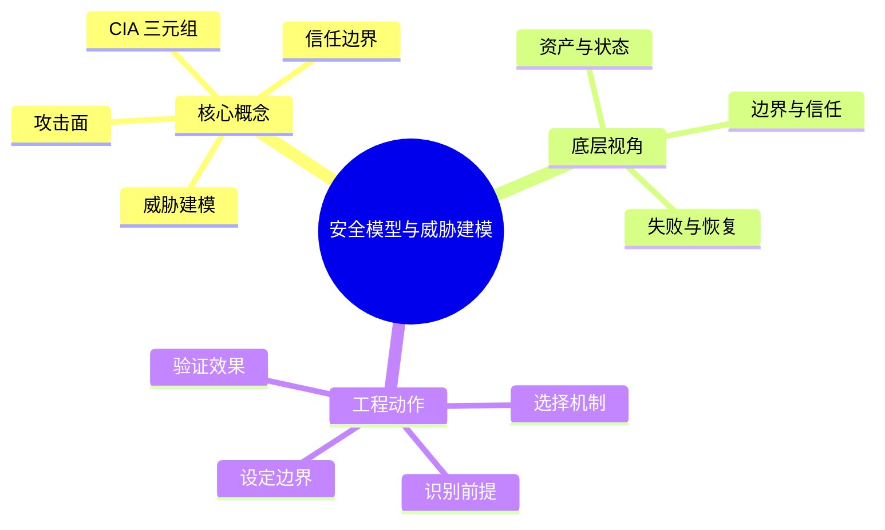
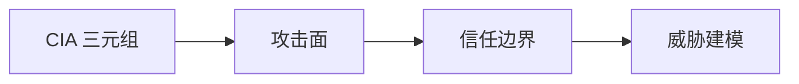

# 信息安全：安全模型与威胁建模

## 学习目标
- 理解 CIA、攻击面、信任边界和威胁建模方法。
- 能从底层机制、适用边界、工程实践和面试表达四个角度解释本章概念。
- 能画出本章核心流程图，并能用自己的话解释每个节点。
- 能说出至少一个不适用场景、一个常见误区和一个纠正方式。

## 一句话总纲
安全设计先问资产是什么、攻击者是谁、边界在哪里。

## 记忆口诀
> 资产-边界-威胁-控制

## 思维导图

## Mermaid 图解：核心流程

## 分章节讲解
### 1. CIA 三元组
**核心定义：** 机密性防止未授权读取，完整性防止未授权篡改，可用性保证服务在需要时可被使用；三者共同定义安全目标，而不是三个互相独立的口号。

**底层原理 / 机制拆解：**
- 机密性依赖身份鉴别、访问控制、加密、数据分级和最小披露，关键问题是“谁在什么上下文能看到什么”。
- 完整性依赖哈希、MAC、签名、事务约束、审计链和变更审批，关键问题是“数据从产生到消费是否被未授权改变”。
- 可用性依赖容量规划、限流、冗余、隔离、备份恢复和应急预案，关键问题是“攻击或故障下业务是否保持最低可服务能力”。

**适用场景：** 适用于安全需求拆解、风险评级、方案评审和事故复盘，能把“安全”落到泄露、篡改、中断三个可验证目标。

**不适用场景 / 失败边界：** 不适合直接替代威胁建模或控制清单；只说 CIA 不能说明攻击路径、控制位置和责任人。

**工程实践或做题/面试理解：** 工程上先给资产标注 CIA 优先级：支付余额更重完整性，用户隐私更重机密性，核心交易链路更重可用性。面试回答要补一句“三者会冲突，例如强校验提高完整性但可能牺牲延迟和可用性”。

**常见误区与纠正方式：** 只关注机密性会忽视业务中断和数据篡改风险；纠正方式是为每个资产分别写出泄露、篡改、不可用的业务影响。

**速记：** CIA 是目标坐标系：C 看见，I 改动，A 可用。

### 2. 攻击面
**核心定义：** 攻击面是攻击者可接触、可影响或可诱导执行的入口集合，包括公网接口、内部 API、依赖组件、配置、权限、运维流程和人员操作。

**底层原理 / 机制拆解：**
- 攻击面由入口、解析器、权限上下文和副作用组成；入口越多、解析越复杂、权限越高，风险越大。
- 攻击链常从低价值入口开始，经凭证泄露、SSRF、依赖漏洞或错误配置横向移动到高价值资产。
- 缩小攻击面不是“藏起来”，而是删除不必要入口、降低默认权限、隔离高危组件并加强可观测性。

**适用场景：** 适用于上线前安全评审、云资源盘点、资产暴露面治理、漏洞优先级排序和零信任改造。

**不适用场景 / 失败边界：** 不适合只用端口扫描代表全部风险；逻辑漏洞、供应链、CI/CD 密钥和人员流程同样属于攻击面。

**工程实践或做题/面试理解：** 工程上维护资产清单、入口清单、依赖清单和权限清单；面试可用“公网 API、管理后台、对象存储桶、CI Token”举例说明攻击面不止网络端口。

**常见误区与纠正方式：** 隐藏接口不等于安全；纠正方式是要求所有入口默认鉴权、限流、审计，并用资产发现验证是否有影子服务。

**速记：** 攻击面 = 能碰到 + 能解析 + 能产生影响。

### 3. 信任边界
**核心定义：** 信任边界区分不同信任级别的数据、身份、网络和执行环境；任何跨边界的数据都必须重新验证、授权、记录和限制副作用。

**底层原理 / 机制拆解：**
- 边界常出现在用户到前端、前端到后端、服务到服务、租户到租户、容器到宿主机、云账号到云账号之间。
- 边界内的凭证和上下文不能盲目继承到边界外；必须做身份传递、权限收敛、输入规范化和输出脱敏。
- 零信任把“网络位置”降级为弱信号，强调持续认证、设备状态、行为风险和最小权限。

**适用场景：** 适用于微服务、BFF、第三方回调、多租户、跨云访问、内部系统改造和敏感数据流设计。

**不适用场景 / 失败边界：** 不适合用“内网可信”一笔带过；一旦存在钓鱼、供应链或 SSRF，内网边界很快失效。

**工程实践或做题/面试理解：** 工程上画数据流图时用虚线标出边界，边界处写明鉴权方式、输入校验、速率限制、日志字段和失败方案。面试中强调“每次跨边界都要重新建立信任”。

**常见误区与纠正方式：** 内网不等于可信；纠正方式是服务间 mTLS、短期凭证、细粒度授权和东西向流量审计。

**速记：** 边界一跨，信任归零。

### 4. 威胁建模
**核心定义：** 威胁建模是在设计阶段系统识别资产、数据流、边界、攻击者能力、威胁类别和缓解措施的工程活动。

**底层原理 / 机制拆解：**
- 常用流程是画数据流图、枚举入口和边界、用 STRIDE 识别伪造/篡改/抵赖/信息泄露/拒绝服务/权限提升。
- 每个威胁要绑定可落地控制，例如认证、授权、参数化、签名、限流、隔离、告警和恢复。
- 威胁建模输出不是一次性文档，而是随架构变化、事故复盘和新漏洞情报持续更新的风险台账。

**适用场景：** 适用于新系统设计、重大权限改造、外部回调接入、敏感数据处理、云上架构变更和安全评审。

**不适用场景 / 失败边界：** 不适合在需求完全未定时做过细建模，也不能替代代码审计、渗透测试和运行时监控。

**工程实践或做题/面试理解：** 工程实践以 60-90 分钟小会为宜：产品/研发/测试/安全共同画图、列 Top 风险、指定 owner 和验收证据。面试回答要把 STRIDE 与数据流图结合。

**常见误区与纠正方式：** 威胁建模不是合规表格；纠正方式是每条威胁都写清攻击路径、影响、控制和验证方法。

**速记：** 画图找边界，沿线问 STRIDE。

## 实战深化：资产、攻击者与信任边界

### 1. 底层机制拆解
威胁建模先识别要保护什么，再识别谁会攻击、从哪里进入、能造成什么影响。

### 2. 适用与不适用
| 判断点 | 适用信号 | 不适用/风险信号 |
|---|---|---|
| 前提 | 对象、约束和目标清晰 | 概念边界含糊或约束缺失 |
| 机制 | 能说明中间状态如何变化 | 只能背结论，无法解释过程 |
| 成本 | 复杂度、维护成本或风险可接受 | 资源、复杂度或安全边界失控 |
| 验证 | 有样例、测试、证明或观测证据 | 无法复现、无法审计、无法回滚 |

### 3. 案例理解
文件上传功能要画出浏览器、网关、对象存储、扫描服务和下载域名之间的信任边界。

### 4. 常见误区与纠正
- **误区：** 只记概念定义，不问前提。**纠正：** 每次回答都先说适用条件。
- **误区：** 用单个样例证明普遍正确。**纠正：** 补充边界样例、反例或不变量。
- **误区：** 忽略工程成本。**纠正：** 同时说明性能、可靠性、安全性和维护代价。

### 5. 面试追问路径
- 如果输入规模、业务约束或安全边界变化，结论是否还成立？
- 这个概念和相邻概念的区别是什么？
- 如何设计一个测试、证明或观测指标来验证你的判断？

## 关键对比表
| 知识点 | 解决的核心问题 | 适用边界 | 不适用/风险边界 | 面试抓手 |
|---|---|---|---|---|
| CIA 三元组 | 机密性防止未授权读取，完整性防止未授权篡改，可用性保证服务在需要时可被使用 | 适用于安全需求拆解、风险评级、方案评审和事故复盘，能把“安全”落到泄露、篡改、中断三个可验证目标。 | 不适合直接替代威胁建模或控制清单；只说 CIA 不能说明攻击路径、控制位置和责任人。 | CIA 是目标坐标系：C 看见，I 改动，A 可用。 |
| 攻击面 | 攻击面是攻击者可接触、可影响或可诱导执行的入口集合，包括公网接口、内部 API、依赖组件、配置、权限、运维流程和人员操作。 | 适用于上线前安全评审、云资源盘点、资产暴露面治理、漏洞优先级排序和零信任改造。 | 不适合只用端口扫描代表全部风险；逻辑漏洞、供应链、CI/CD 密钥和人员流程同样属于攻击面。 | 攻击面 = 能碰到 + 能解析 + 能产生影响。 |
| 信任边界 | 信任边界区分不同信任级别的数据、身份、网络和执行环境 | 适用于微服务、BFF、第三方回调、多租户、跨云访问、内部系统改造和敏感数据流设计。 | 不适合用“内网可信”一笔带过；一旦存在钓鱼、供应链或 SSRF，内网边界很快失效。 | 边界一跨，信任归零。 |
| 威胁建模 | 威胁建模是在设计阶段系统识别资产、数据流、边界、攻击者能力、威胁类别和缓解措施的工程活动。 | 适用于新系统设计、重大权限改造、外部回调接入、敏感数据处理、云上架构变更和安全评审。 | 不适合在需求完全未定时做过细建模，也不能替代代码审计、渗透测试和运行时监控。 | 画图找边界，沿线问 STRIDE。 |

## 边界条件表
| 边界条件 | 应优先检查什么 | 如果忽视会怎样 | 推荐纠正方式 |
|---|---|---|---|
| 输入跨信任边界 | 身份、来源、格式、权限 | 被伪造、篡改或越权利用 | 边界处重新认证、授权、校验和审计 |
| 控制依赖人工流程 | owner、时限、证据 | 例外长期存在，风险不可追踪 | 自动化门禁 + 风险接受有效期 |
| 机制带来额外复杂度 | 性能、可用性、维护成本 | 安全控制被绕过或误伤业务 | 用威胁和资产价值决定控制强度 |
| 运行环境会变化 | 配置、依赖、权限漂移 | 文档正确但系统实际暴露 | 持续扫描、基线检测和复盘更新 |

## 常见误区总结
- **CIA 三元组：** 只关注机密性会忽视业务中断和数据篡改风险；纠正方式是为每个资产分别写出泄露、篡改、不可用的业务影响。
- **攻击面：** 隐藏接口不等于安全；纠正方式是要求所有入口默认鉴权、限流、审计，并用资产发现验证是否有影子服务。
- **信任边界：** 内网不等于可信；纠正方式是服务间 mTLS、短期凭证、细粒度授权和东西向流量审计。
- **威胁建模：** 威胁建模不是合规表格；纠正方式是每条威胁都写清攻击路径、影响、控制和验证方法。

## 自检题
1. 本章的核心问题是什么？请用一句话回答：安全设计先问资产是什么、攻击者是谁、边界在哪里。
2. 任选两个概念，说出它们的适用场景和不适用场景。
3. 如果机制失效，最可能先出现在哪个边界？如何验证？
4. 面试中如何用“定义 → 机制 → 场景 → 权衡 → 误区”回答本章任一概念？
5. 给一个真实系统例子，说明你会怎样落地本章控制或设计。

## 速记卡片
- 章节口诀：资产-边界-威胁-控制
- 答题结构：定义 → 机制 → 场景 → 权衡 → 误区 → 记忆点。
- 工程落地：先列前提，再定机制，最后用日志、测试或演练验证。
- CIA 三元组：CIA 是目标坐标系：C 看见，I 改动，A 可用。
- 攻击面：攻击面 = 能碰到 + 能解析 + 能产生影响。
- 信任边界：边界一跨，信任归零。
- 威胁建模：画图找边界，沿线问 STRIDE。

## 深度扩展：底层原理与应用边界

### 1. 本章在「信息安全」中的位置
- **核心定位：** 围绕资产、攻击者、信任边界和控制措施保护机密性、完整性、可用性。
- **本章作用：** 「信息安全：安全模型与威胁建模」负责把总纲落到可操作的判断框架：先确认问题边界，再拆解机制，最后根据代价和风险选择方法。
- **主要风险：** 最大风险是把安全当成单点功能，而不是贯穿设计、实现、部署、运行和响应的闭环。
- **实践抓手：** 任何安全问题先问资产是什么、入口在哪里、权限如何判断、证据如何审计。

### 2. 小流程图：从概念到应用

### 3. 概念深化：逐个击破
#### 3.1 CIA 三元组
- **先问它解决什么：** CIA 三元组 不是孤立名词，而是用来解决本章某类约束、关系、代价或风险判断的问题。
- **底层机制：** 学习时要拆成“输入条件 → 中间结构 → 处理规则 → 输出结果”四步；如果任何一步说不清，说明只是记住了结论。
- **适用条件：** 当前提满足、边界清楚、代价可接受时使用；如果输入分布、规模、时序、权限或一致性假设变化，就要重新评估。
- **不适用信号：** 需要违反前提才能套用、只能靠特殊样例解释、复杂度或维护成本明显失控时，应换方案。
- **面试表达：** “我会先定义 CIA 三元组，再说明它依赖的前提，最后用一个反例说明边界。”

#### 3.2 攻击面
- **先问它解决什么：** 攻击面 不是孤立名词，而是用来解决本章某类约束、关系、代价或风险判断的问题。
- **底层机制：** 学习时要拆成“输入条件 → 中间结构 → 处理规则 → 输出结果”四步；如果任何一步说不清，说明只是记住了结论。
- **适用条件：** 当前提满足、边界清楚、代价可接受时使用；如果输入分布、规模、时序、权限或一致性假设变化，就要重新评估。
- **不适用信号：** 需要违反前提才能套用、只能靠特殊样例解释、复杂度或维护成本明显失控时，应换方案。
- **面试表达：** “我会先定义 攻击面，再说明它依赖的前提，最后用一个反例说明边界。”

#### 3.3 信任边界
- **先问它解决什么：** 信任边界 不是孤立名词，而是用来解决本章某类约束、关系、代价或风险判断的问题。
- **底层机制：** 学习时要拆成“输入条件 → 中间结构 → 处理规则 → 输出结果”四步；如果任何一步说不清，说明只是记住了结论。
- **适用条件：** 当前提满足、边界清楚、代价可接受时使用；如果输入分布、规模、时序、权限或一致性假设变化，就要重新评估。
- **不适用信号：** 需要违反前提才能套用、只能靠特殊样例解释、复杂度或维护成本明显失控时，应换方案。
- **面试表达：** “我会先定义 信任边界，再说明它依赖的前提，最后用一个反例说明边界。”

#### 3.4 威胁建模
- **先问它解决什么：** 威胁建模 不是孤立名词，而是用来解决本章某类约束、关系、代价或风险判断的问题。
- **底层机制：** 学习时要拆成“输入条件 → 中间结构 → 处理规则 → 输出结果”四步；如果任何一步说不清，说明只是记住了结论。
- **适用条件：** 当前提满足、边界清楚、代价可接受时使用；如果输入分布、规模、时序、权限或一致性假设变化，就要重新评估。
- **不适用信号：** 需要违反前提才能套用、只能靠特殊样例解释、复杂度或维护成本明显失控时，应换方案。
- **面试表达：** “我会先定义 威胁建模，再说明它依赖的前提，最后用一个反例说明边界。”

### 4. 适用边界对比表
| 判断维度 | 应该怎么想 | 典型错误 | 记忆提示 |
|---|---|---|---|
| 前提条件 | 先列出输入规模、数据分布、系统假设或业务约束 | 不看条件直接套模板 | 先问“凭什么能用” |
| 正确性 | 需要能说明为什么结果保持不变或为什么局部选择成立 | 只给经验结论 | 用不变量、反例或交换论证检查 |
| 复杂度/成本 | 同时估算时间、空间、延迟、吞吐、人力和维护成本 | 只看理论最优 | 工程里还要看常数和可观测性 |
| 失败模式 | 主动说明边界外会怎样失败 | 面试中只讲优点 | 能说失败边界才算真理解 |

### 5. 记忆强化：三层复述法
1. **概念层：** 用一句话定义本章每个核心概念。
2. **机制层：** 不看原文画出输入到输出的流程。
3. **边界层：** 为每个概念准备一个“不能这样用”的反例。

### 6. 工程/做题/面试迁移
- **工程迁移：** 任何安全问题先问资产是什么、入口在哪里、权限如何判断、证据如何审计。
- **做题迁移：** 先把题目中的对象、关系、约束和目标函数圈出来，再映射到本章概念。
- **面试迁移：** 回答时不要只报名词，要说清“为什么需要它、它如何工作、它何时失效”。

### 7. 深度自检题
1. 你能否把本章概念按“前提 → 机制 → 结果 → 代价”重新组织？
2. 如果输入规模、并发量、数据分布或安全边界变化，原结论是否仍成立？
3. 本章哪个概念最容易被误用？请给出一个反例。
4. 如果让你设计一道面试题，你会怎样考察候选人是否真的理解？

### 8. 深度速记卡片
- **总抓手：** 围绕资产、攻击者、信任边界和控制措施保护机密性、完整性、可用性。
- **答题模板：** 定义边界 → 拆底层机制 → 说适用条件 → 讲权衡 → 给反例。
- **复习动作：** 每次复习只看图和表，尝试口述 3 分钟；卡住处再回正文。

## 专题深化：具体机制、案例与追问

### 1. 具体案例：把「安全模型与威胁建模」放进真实问题
例如一个上传接口要同时考虑身份认证、对象级授权、文件类型校验、恶意内容扫描、存储权限、日志审计和限速。

### 2. 本章关键机制细化
- 先识别资产和攻击者，再谈防护方案。
- 信任边界跨越处必须认证、授权、校验和审计。
- STRIDE 能帮助系统性发现伪造、篡改、抵赖、泄露、拒绝服务和越权。

### 3. 概念到判断的检查清单
| 概念/动作 | 你要检查什么 | 如果检查失败会怎样 |
|---|---|---|
| CIA 三元组 | 前提、输入、输出、代价、失败边界是否都说清 | 可能套错模型、复杂度失控或得到不可验证结论 |
| 攻击面 | 前提、输入、输出、代价、失败边界是否都说清 | 可能套错模型、复杂度失控或得到不可验证结论 |
| 信任边界 | 前提、输入、输出、代价、失败边界是否都说清 | 可能套错模型、复杂度失控或得到不可验证结论 |
| 威胁建模 | 前提、输入、输出、代价、失败边界是否都说清 | 可能套错模型、复杂度失控或得到不可验证结论 |
| 本章在「信息安全」中的位置 | 前提、输入、输出、代价、失败边界是否都说清 | 可能套错模型、复杂度失控或得到不可验证结论 |

### 4. 面试追问路径

- 资产是什么，攻击者能接触哪里？
- 信任边界在哪里跨越？
- 失败后能否发现、遏制和追溯？

### 5. 验证与复盘
- **验证方式：** 用威胁建模、权限测试、模糊测试、日志审计和演练验证。
- **复盘方式：** 每次做题或设计后，记录“我使用了哪个前提、哪个前提最容易被破坏、如果破坏如何调整”。
- **记忆方式：** 不背孤立结论，只背“问题 → 机制 → 边界 → 验证”的链路。

## 继续扩写：机制、边界与面试追问

### 机制拆解补充
- 威胁建模不是一次性表格，而是随架构、依赖和攻击者能力变化而更新的风险地图。
- STRIDE、攻击树和数据流图的目的都是暴露资产、入口、边界和控制缺口。
- 安全需求要转成可验证条款，例如“对象级授权必须覆盖读取、修改、删除和批量导出”。

### 适用 / 不适用场景
| 维度 | 适用信号 | 不适用信号 | 纠偏动作 |
|---|---|---|---|
| 前提 | 关键假设可明确写出 | 只能靠经验套模板 | 先补定义、约束和反例 |
| 代价 | 时间、空间、人力成本可接受 | 复杂度或维护成本不可控 | 降维、分层或换方案 |
| 验证 | 能用样例、测试或演练证明 | 只能口头保证 | 增加边界用例和观测点 |
| 演进 | 变化范围局部可控 | 一处变化牵动多处 | 重画边界和依赖关系 |

### 工程实践案例
- **场景：** 在真实项目或面试题中遇到 `01-安全模型与威胁建模` 相关问题时，先列出输入、输出、约束、风险和验收标准。
- **做法：** 用最小可行方案跑通主链路，再补边界用例、错误处理和性能/安全验证。
- **复盘：** 如果方案失败，优先检查前提是否被破坏，而不是继续堆叠特殊判断。

### 面试追问路径
1. 这个概念依赖哪些前提？前提不成立时会发生什么？
2. 和相邻方案相比，它牺牲了什么、换来了什么？
3. 如何用最小反例证明误用会失败？
4. 工程落地时需要哪些监控、测试或回滚手段？
