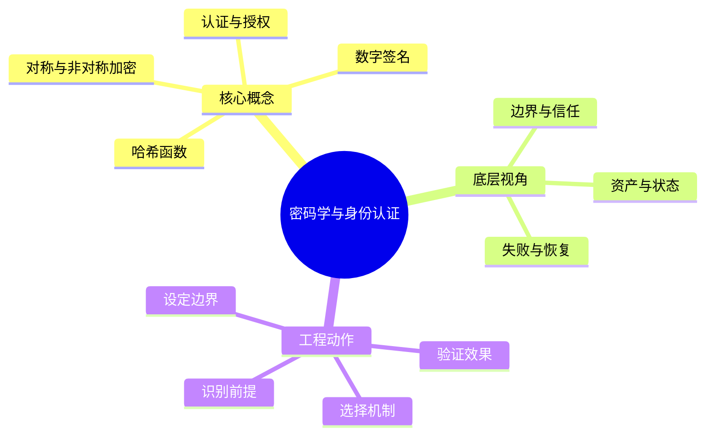

# 信息安全：密码学与身份认证

## 学习目标
- 掌握哈希、加密、签名、认证、授权和密钥管理。
- 能从底层机制、适用边界、工程实践和面试表达四个角度解释本章概念。
- 能画出本章核心流程图，并能用自己的话解释每个节点。
- 能说出至少一个不适用场景、一个常见误区和一个纠正方式。

## 一句话总纲
密码学解决数据保护和身份可信，但正确使用比自创算法更重要。

## 记忆口诀
> 哈希验完整，加密保机密，签名证身份

## 思维导图

## Mermaid 图解：核心流程

## 分章节讲解
### 1. 哈希函数
**核心定义：** 安全哈希把任意长度输入映射为固定长度摘要，并要求抗原像、抗第二原像和抗碰撞，常用于完整性校验、索引指纹和签名前摘要。

**底层原理 / 机制拆解：**
- 哈希是单向摘要，不提供机密性；同一输入应得到同一摘要，微小变化应产生雪崩效应。
- 密码存储需要盐和慢哈希/KDF，例如 bcrypt、scrypt、Argon2，目的是提高离线爆破成本。
- 完整性校验若面对主动攻击者，需要 HMAC 或签名，因为普通哈希可被攻击者连同数据一起替换。

**适用场景：** 适用于文件校验、内容寻址、去重、签名摘要和密码验证的组成部分。

**不适用场景 / 失败边界：** 不适合直接“加密”敏感数据，也不适合把普通快速哈希直接用于密码存储。

**工程实践或做题/面试理解：** 工程上区分 checksum、cryptographic hash、password hash；面试中主动说明“哈希验完整但不保密，密码要慢哈希加盐”。

**常见误区与纠正方式：** 把 MD5/SHA-1 或裸 SHA-256 当密码存储方案；纠正方式是使用专用 KDF、唯一盐、合理成本参数和迁移方案。

**速记：** 哈希不保密，密码要变慢。

### 2. 对称与非对称加密
**核心定义：** 对称加密加解密使用同一密钥，速度快；非对称加密使用公私钥对，便于密钥交换和身份绑定但成本高。

**底层原理 / 机制拆解：**
- 实际系统常采用混合加密：非对称算法协商会话密钥，对称 AEAD 加密业务数据。
- 安全加密需要随机数/nonce、模式选择和完整性保护；现代场景优先使用 AES-GCM 或 ChaCha20-Poly1305 等 AEAD。
- 密钥生命周期包括生成、分发、存储、轮换、吊销和销毁，任何一环薄弱都会破坏算法安全性。

**适用场景：** 对称加密适合大数据量传输和存储加密；非对称适合密钥交换、证书体系和数字信封。

**不适用场景 / 失败边界：** 不适合手写算法、复用 nonce、固定 IV，或把 RSA 直接用于大文件加密。

**工程实践或做题/面试理解：** 工程上使用成熟库和 KMS/HSM 管理密钥；面试可用 TLS 解释“非对称建信任，对称跑数据”。

**常见误区与纠正方式：** 以为加密自动提供完整性；纠正方式是使用 AEAD 或“Encrypt-then-MAC”，并验证失败时不返回可区分错误。

**速记：** 非对称开门，对称搬货，AEAD 上锁验封。

### 3. 数字签名
**核心定义：** 数字签名用私钥对消息摘要生成签名，接收方用公钥验证，提供身份认证、完整性和一定的不可否认性。

**底层原理 / 机制拆解：**
- 签名绑定“消息内容 + 私钥持有者”，验证依赖可信公钥或证书链。
- 签名不隐藏内容，任何拿到公钥的人都能验证；如需保密，要额外加密。
- 签名安全还依赖随机数、算法参数、证书有效期、吊销检查和私钥保护。

**适用场景：** 适用于软件发布、JWT/JWS、API 回调验签、交易指令、证书体系和审计证据。

**不适用场景 / 失败边界：** 不适合用来保护机密内容，也不能在公钥来源不可信时证明身份。

**工程实践或做题/面试理解：** 工程上要签名规范化后的原文，避免字段顺序、编码差异和重放；面试中区分“签名”和“加密”。

**常见误区与纠正方式：** 把“私钥加密、公钥解密”当作签名的准确表述；纠正方式是说“私钥签名、公钥验证，通常对摘要签名”。

**速记：** 签名证来源，不负责藏内容。

### 4. 认证与授权
**核心定义：** 认证确认主体是谁，授权决定主体能对哪些资源执行哪些动作；二者必须在后端可信边界内完成。

**底层原理 / 机制拆解：**
- 认证可基于密码、MFA、证书、OAuth/OIDC、短期 Token 或会话 Cookie。
- 授权模型包括 RBAC、ABAC、ACL 和方案引擎，关键是把主体、资源、动作、环境组合判断。
- 会话与 Token 需要过期、刷新、吊销、设备绑定和异常检测，避免凭证泄露后长期有效。

**适用场景：** 适用于登录、服务间调用、管理后台、API 网关、多租户资源访问和第三方授权。

**不适用场景 / 失败边界：** 不适合只在前端隐藏按钮，也不适合把“登录态存在”直接等价为对象级权限。

**工程实践或做题/面试理解：** 工程上每个敏感接口都做对象级授权，审计记录主体、资源、动作和决策理由；面试中先分清 AuthN/AuthZ。

**常见误区与纠正方式：** 登录成功不代表有资源权限；纠正方式是在业务服务层对资源所有权、租户边界和角色方案做强制校验。

**速记：** 先认人，再判事；权限跟资源走。

## 实战深化：密码原语、身份凭证与会话安全

### 1. 底层机制拆解
密码学原语解决机密性、完整性、认证和不可抵赖；身份认证还要处理凭证生命周期和会话风险。

### 2. 适用与不适用
| 判断点 | 适用信号 | 不适用/风险信号 |
|---|---|---|
| 前提 | 对象、约束和目标清晰 | 概念边界含糊或约束缺失 |
| 机制 | 能说明中间状态如何变化 | 只能背结论，无法解释过程 |
| 成本 | 复杂度、维护成本或风险可接受 | 资源、复杂度或安全边界失控 |
| 验证 | 有样例、测试、证明或观测证据 | 无法复现、无法审计、无法回滚 |

### 3. 案例理解
密码存储应使用带盐慢哈希；JWT 要控制过期、撤销、签名算法和密钥轮换。

### 4. 常见误区与纠正
- **误区：** 只记概念定义，不问前提。**纠正：** 每次回答都先说适用条件。
- **误区：** 用单个样例证明普遍正确。**纠正：** 补充边界样例、反例或不变量。
- **误区：** 忽略工程成本。**纠正：** 同时说明性能、可靠性、安全性和维护代价。

### 5. 面试追问路径
- 如果输入规模、业务约束或安全边界变化，结论是否还成立？
- 这个概念和相邻概念的区别是什么？
- 如何设计一个测试、证明或观测指标来验证你的判断？

## 关键对比表
| 知识点 | 解决的核心问题 | 适用边界 | 不适用/风险边界 | 面试抓手 |
|---|---|---|---|---|
| 哈希函数 | 安全哈希把任意长度输入映射为固定长度摘要，并要求抗原像、抗第二原像和抗碰撞，常用于完整性校验、索引指纹和签名前摘要。 | 适用于文件校验、内容寻址、去重、签名摘要和密码验证的组成部分。 | 不适合直接“加密”敏感数据，也不适合把普通快速哈希直接用于密码存储。 | 哈希不保密，密码要变慢。 |
| 对称与非对称加密 | 对称加密加解密使用同一密钥，速度快 | 对称加密适合大数据量传输和存储加密；非对称适合密钥交换、证书体系和数字信封。 | 不适合手写算法、复用 nonce、固定 IV，或把 RSA 直接用于大文件加密。 | 非对称开门，对称搬货，AEAD 上锁验封。 |
| 数字签名 | 数字签名用私钥对消息摘要生成签名，接收方用公钥验证，提供身份认证、完整性和一定的不可否认性。 | 适用于软件发布、JWT/JWS、API 回调验签、交易指令、证书体系和审计证据。 | 不适合用来保护机密内容，也不能在公钥来源不可信时证明身份。 | 签名证来源，不负责藏内容。 |
| 认证与授权 | 认证确认主体是谁，授权决定主体能对哪些资源执行哪些动作 | 适用于登录、服务间调用、管理后台、API 网关、多租户资源访问和第三方授权。 | 不适合只在前端隐藏按钮，也不适合把“登录态存在”直接等价为对象级权限。 | 先认人，再判事；权限跟资源走。 |

## 边界条件表
| 边界条件 | 应优先检查什么 | 如果忽视会怎样 | 推荐纠正方式 |
|---|---|---|---|
| 输入跨信任边界 | 身份、来源、格式、权限 | 被伪造、篡改或越权利用 | 边界处重新认证、授权、校验和审计 |
| 控制依赖人工流程 | owner、时限、证据 | 例外长期存在，风险不可追踪 | 自动化门禁 + 风险接受有效期 |
| 机制带来额外复杂度 | 性能、可用性、维护成本 | 安全控制被绕过或误伤业务 | 用威胁和资产价值决定控制强度 |
| 运行环境会变化 | 配置、依赖、权限漂移 | 文档正确但系统实际暴露 | 持续扫描、基线检测和复盘更新 |

## 常见误区总结
- **哈希函数：** 把 MD5/SHA-1 或裸 SHA-256 当密码存储方案；纠正方式是使用专用 KDF、唯一盐、合理成本参数和迁移方案。
- **对称与非对称加密：** 以为加密自动提供完整性；纠正方式是使用 AEAD 或“Encrypt-then-MAC”，并验证失败时不返回可区分错误。
- **数字签名：** 把“私钥加密、公钥解密”当作签名的准确表述；纠正方式是说“私钥签名、公钥验证，通常对摘要签名”。
- **认证与授权：** 登录成功不代表有资源权限；纠正方式是在业务服务层对资源所有权、租户边界和角色方案做强制校验。

## 自检题
1. 本章的核心问题是什么？请用一句话回答：密码学解决数据保护和身份可信，但正确使用比自创算法更重要。
2. 任选两个概念，说出它们的适用场景和不适用场景。
3. 如果机制失效，最可能先出现在哪个边界？如何验证？
4. 面试中如何用“定义 → 机制 → 场景 → 权衡 → 误区”回答本章任一概念？
5. 给一个真实系统例子，说明你会怎样落地本章控制或设计。

## 速记卡片
- 章节口诀：哈希验完整，加密保机密，签名证身份
- 答题结构：定义 → 机制 → 场景 → 权衡 → 误区 → 记忆点。
- 工程落地：先列前提，再定机制，最后用日志、测试或演练验证。
- 哈希函数：哈希不保密，密码要变慢。
- 对称与非对称加密：非对称开门，对称搬货，AEAD 上锁验封。
- 数字签名：签名证来源，不负责藏内容。
- 认证与授权：先认人，再判事；权限跟资源走。

## 深度扩展：底层原理与应用边界

### 1. 本章在「信息安全」中的位置
- **核心定位：** 围绕资产、攻击者、信任边界和控制措施保护机密性、完整性、可用性。
- **本章作用：** 「信息安全：密码学与身份认证」负责把总纲落到可操作的判断框架：先确认问题边界，再拆解机制，最后根据代价和风险选择方法。
- **主要风险：** 最大风险是把安全当成单点功能，而不是贯穿设计、实现、部署、运行和响应的闭环。
- **实践抓手：** 任何安全问题先问资产是什么、入口在哪里、权限如何判断、证据如何审计。

### 2. 小流程图：从概念到应用

### 3. 概念深化：逐个击破
#### 3.1 哈希函数
- **先问它解决什么：** 哈希函数 不是孤立名词，而是用来解决本章某类约束、关系、代价或风险判断的问题。
- **底层机制：** 学习时要拆成“输入条件 → 中间结构 → 处理规则 → 输出结果”四步；如果任何一步说不清，说明只是记住了结论。
- **适用条件：** 当前提满足、边界清楚、代价可接受时使用；如果输入分布、规模、时序、权限或一致性假设变化，就要重新评估。
- **不适用信号：** 需要违反前提才能套用、只能靠特殊样例解释、复杂度或维护成本明显失控时，应换方案。
- **面试表达：** “我会先定义 哈希函数，再说明它依赖的前提，最后用一个反例说明边界。”

#### 3.2 对称与非对称加密
- **先问它解决什么：** 对称与非对称加密 不是孤立名词，而是用来解决本章某类约束、关系、代价或风险判断的问题。
- **底层机制：** 学习时要拆成“输入条件 → 中间结构 → 处理规则 → 输出结果”四步；如果任何一步说不清，说明只是记住了结论。
- **适用条件：** 当前提满足、边界清楚、代价可接受时使用；如果输入分布、规模、时序、权限或一致性假设变化，就要重新评估。
- **不适用信号：** 需要违反前提才能套用、只能靠特殊样例解释、复杂度或维护成本明显失控时，应换方案。
- **面试表达：** “我会先定义 对称与非对称加密，再说明它依赖的前提，最后用一个反例说明边界。”

#### 3.3 数字签名
- **先问它解决什么：** 数字签名 不是孤立名词，而是用来解决本章某类约束、关系、代价或风险判断的问题。
- **底层机制：** 学习时要拆成“输入条件 → 中间结构 → 处理规则 → 输出结果”四步；如果任何一步说不清，说明只是记住了结论。
- **适用条件：** 当前提满足、边界清楚、代价可接受时使用；如果输入分布、规模、时序、权限或一致性假设变化，就要重新评估。
- **不适用信号：** 需要违反前提才能套用、只能靠特殊样例解释、复杂度或维护成本明显失控时，应换方案。
- **面试表达：** “我会先定义 数字签名，再说明它依赖的前提，最后用一个反例说明边界。”

#### 3.4 认证与授权
- **先问它解决什么：** 认证与授权 不是孤立名词，而是用来解决本章某类约束、关系、代价或风险判断的问题。
- **底层机制：** 学习时要拆成“输入条件 → 中间结构 → 处理规则 → 输出结果”四步；如果任何一步说不清，说明只是记住了结论。
- **适用条件：** 当前提满足、边界清楚、代价可接受时使用；如果输入分布、规模、时序、权限或一致性假设变化，就要重新评估。
- **不适用信号：** 需要违反前提才能套用、只能靠特殊样例解释、复杂度或维护成本明显失控时，应换方案。
- **面试表达：** “我会先定义 认证与授权，再说明它依赖的前提，最后用一个反例说明边界。”

### 4. 适用边界对比表
| 判断维度 | 应该怎么想 | 典型错误 | 记忆提示 |
|---|---|---|---|
| 前提条件 | 先列出输入规模、数据分布、系统假设或业务约束 | 不看条件直接套模板 | 先问“凭什么能用” |
| 正确性 | 需要能说明为什么结果保持不变或为什么局部选择成立 | 只给经验结论 | 用不变量、反例或交换论证检查 |
| 复杂度/成本 | 同时估算时间、空间、延迟、吞吐、人力和维护成本 | 只看理论最优 | 工程里还要看常数和可观测性 |
| 失败模式 | 主动说明边界外会怎样失败 | 面试中只讲优点 | 能说失败边界才算真理解 |

### 5. 记忆强化：三层复述法
1. **概念层：** 用一句话定义本章每个核心概念。
2. **机制层：** 不看原文画出输入到输出的流程。
3. **边界层：** 为每个概念准备一个“不能这样用”的反例。

### 6. 工程/做题/面试迁移
- **工程迁移：** 任何安全问题先问资产是什么、入口在哪里、权限如何判断、证据如何审计。
- **做题迁移：** 先把题目中的对象、关系、约束和目标函数圈出来，再映射到本章概念。
- **面试迁移：** 回答时不要只报名词，要说清“为什么需要它、它如何工作、它何时失效”。

### 7. 深度自检题
1. 你能否把本章概念按“前提 → 机制 → 结果 → 代价”重新组织？
2. 如果输入规模、并发量、数据分布或安全边界变化，原结论是否仍成立？
3. 本章哪个概念最容易被误用？请给出一个反例。
4. 如果让你设计一道面试题，你会怎样考察候选人是否真的理解？

### 8. 深度速记卡片
- **总抓手：** 围绕资产、攻击者、信任边界和控制措施保护机密性、完整性、可用性。
- **答题模板：** 定义边界 → 拆底层机制 → 说适用条件 → 讲权衡 → 给反例。
- **复习动作：** 每次复习只看图和表，尝试口述 3 分钟；卡住处再回正文。

## 专题深化：具体机制、案例与追问

### 1. 具体案例：把「密码学与身份认证」放进真实问题
例如一个上传接口要同时考虑身份认证、对象级授权、文件类型校验、恶意内容扫描、存储权限、日志审计和限速。

### 2. 本章关键机制细化
- 哈希、加密、签名解决的问题不同，不能混用。
- 密码存储需要盐和慢哈希，不能直接普通摘要。
- 认证证明身份，授权决定权限，对象级授权尤其容易遗漏。

### 3. 概念到判断的检查清单
| 概念/动作 | 你要检查什么 | 如果检查失败会怎样 |
|---|---|---|
| 哈希函数 | 前提、输入、输出、代价、失败边界是否都说清 | 可能套错模型、复杂度失控或得到不可验证结论 |
| 对称与非对称加密 | 前提、输入、输出、代价、失败边界是否都说清 | 可能套错模型、复杂度失控或得到不可验证结论 |
| 数字签名 | 前提、输入、输出、代价、失败边界是否都说清 | 可能套错模型、复杂度失控或得到不可验证结论 |
| 认证与授权 | 前提、输入、输出、代价、失败边界是否都说清 | 可能套错模型、复杂度失控或得到不可验证结论 |
| 本章在「信息安全」中的位置 | 前提、输入、输出、代价、失败边界是否都说清 | 可能套错模型、复杂度失控或得到不可验证结论 |

### 4. 面试追问路径

- 资产是什么，攻击者能接触哪里？
- 信任边界在哪里跨越？
- 失败后能否发现、遏制和追溯？

### 5. 验证与复盘
- **验证方式：** 用威胁建模、权限测试、模糊测试、日志审计和演练验证。
- **复盘方式：** 每次做题或设计后，记录“我使用了哪个前提、哪个前提最容易被破坏、如果破坏如何调整”。
- **记忆方式：** 不背孤立结论，只背“问题 → 机制 → 边界 → 验证”的链路。

## 继续扩写：机制、边界与面试追问

### 机制拆解补充
- 密码学工程重在正确组合原语：哈希、MAC、签名、加密和密钥交换不能互相替代。
- 认证解决“你是谁”，授权解决“你能做什么”；JWT、Session、OAuth 都必须落回服务端权限判断。
- 密钥生命周期包括生成、存储、使用、轮换、吊销和审计，缺一环都会削弱整体安全。

### 适用 / 不适用场景
| 维度 | 适用信号 | 不适用信号 | 纠偏动作 |
|---|---|---|---|
| 前提 | 关键假设可明确写出 | 只能靠经验套模板 | 先补定义、约束和反例 |
| 代价 | 时间、空间、人力成本可接受 | 复杂度或维护成本不可控 | 降维、分层或换方案 |
| 验证 | 能用样例、测试或演练证明 | 只能口头保证 | 增加边界用例和观测点 |
| 演进 | 变化范围局部可控 | 一处变化牵动多处 | 重画边界和依赖关系 |

### 工程实践案例
- **场景：** 在真实项目或面试题中遇到 `02-密码学与身份认证` 相关问题时，先列出输入、输出、约束、风险和验收标准。
- **做法：** 用最小可行方案跑通主链路，再补边界用例、错误处理和性能/安全验证。
- **复盘：** 如果方案失败，优先检查前提是否被破坏，而不是继续堆叠特殊判断。

### 面试追问路径
1. 这个概念依赖哪些前提？前提不成立时会发生什么？
2. 和相邻方案相比，它牺牲了什么、换来了什么？
3. 如何用最小反例证明误用会失败？
4. 工程落地时需要哪些监控、测试或回滚手段？
