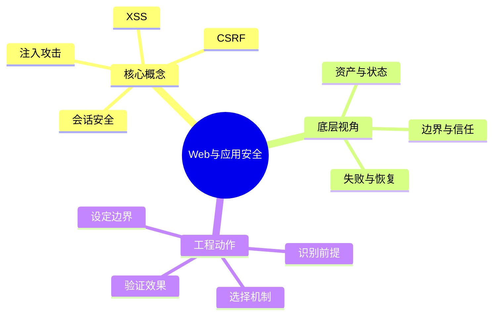
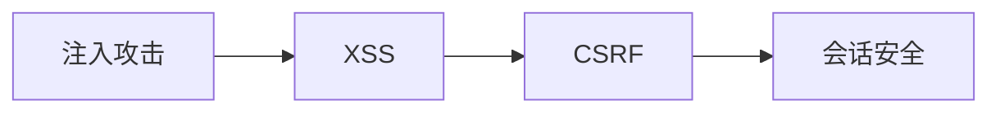
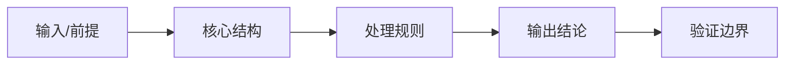
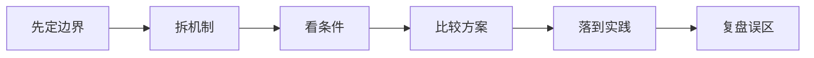
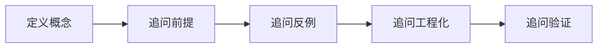
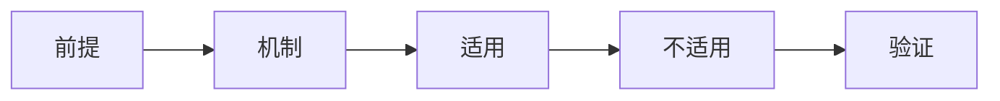

# 信息安全：Web与应用安全

## 学习目标
- 理解输入验证、注入、XSS、CSRF、会话安全和安全编码。
- 能从底层机制、适用边界、工程实践和面试表达四个角度解释本章概念。
- 能画出本章核心流程图，并能用自己的话解释每个节点。
- 能说出至少一个不适用场景、一个常见误区和一个纠正方式。

## 一句话总纲
应用安全的关键是不要信任输入，不要让权限判断停留在前端。

## 记忆口诀
> 输入校验，输出编码，权限后端判

## 思维导图

## Mermaid 图解：核心流程

## 分章节讲解
### 1. 注入攻击
**核心定义：** 注入攻击把不可信输入拼接进命令、查询、模板或解释器上下文，使攻击者改变原本语义，SQL 注入是最典型形式。

**底层原理 / 机制拆解：**
- 根因是数据和代码边界混淆：输入被解释器当作语法结构执行。
- 防护核心是参数化、预编译、上下文安全 API、最小权限和错误信息收敛。
- 注入不只 SQL，还包括命令注入、LDAP、XPath、NoSQL、模板注入和表达式注入。

**适用场景：** 防护方案适用于所有“把用户输入交给解释器”的地方，例如数据库查询、Shell 调用、模板渲染和动态规则执行。

**不适用场景 / 失败边界：** 黑名单过滤不适合承担主要防线，因为编码、转义、语法变体和多层解析会绕过规则。

**工程实践或做题/面试理解：** 工程上禁止字符串拼 SQL，数据库账号按功能最小授权，危险调用做 allowlist；面试回答要抓住“参数化把数据与语法分离”。

**常见误区与纠正方式：** 认为 ORM 一定免疫注入；纠正方式是审查 raw query、排序字段、动态表名和拼接片段。

**速记：** 凡进解释器，先分数据和语法。

### 2. XSS
**核心定义：** XSS 是攻击者让恶意脚本在受害者浏览器中以目标站点上下文执行，从而窃取凭证、冒充操作或篡改页面。

**底层原理 / 机制拆解：**
- 反射型来自请求立即回显，存储型来自恶意内容落库后展示，DOM 型来自前端脚本不安全操作 DOM。
- 防护主线是输入规范化、按上下文输出编码、避免危险 sink、启用 CSP、Cookie HttpOnly/SameSite/Secure。
- 浏览器上下文不同，HTML 文本、属性、URL、JavaScript 字符串需要不同编码方案。

**适用场景：** 适用于用户生成内容、富文本、搜索回显、评论、后台配置、Markdown 渲染和前端路由参数。

**不适用场景 / 失败边界：** 单纯过滤 `<script>` 不适合防 XSS；事件属性、SVG、URL scheme、模板语法都可能绕过。

**工程实践或做题/面试理解：** 工程上使用框架默认转义，不随意 `innerHTML`；富文本用成熟 sanitizer；面试中强调“输出编码按上下文”。

**常见误区与纠正方式：** 只做输入过滤不做输出编码；纠正方式是识别每个输出上下文并使用对应编码/安全组件。

**速记：** XSS 防在输出点，按上下文编码。

### 3. CSRF
**核心定义：** CSRF 利用浏览器自动携带 Cookie 的特性，诱导已登录用户向目标站点发起非本人意图的状态变更请求。

**底层原理 / 机制拆解：**
- 攻击成立需要用户已登录、请求凭证自动携带、接口仅凭 Cookie 授权且缺少意图证明。
- 防护包括 SameSite Cookie、CSRF Token、Origin/Referer 校验、重要操作二次确认和幂等语义约束。
- GET/HEAD 等安全方法不应产生副作用，状态变更应使用 POST/PUT/DELETE 并校验意图。

**适用场景：** 适用于浏览器 Cookie 会话、后台管理、转账改密、绑定邮箱、配置修改等状态变更接口。

**不适用场景 / 失败边界：** 若 API 完全使用不会自动携带的 Authorization Bearer Token，传统 CSRF 风险较低，但仍要防 XSS 和 CORS 错配。

**工程实践或做题/面试理解：** 工程上默认 SameSite=Lax/Strict，敏感操作用一次性 Token；面试中说明 CSRF 与 XSS 的区别：CSRF 借用户身份发请求，XSS 在页面执行脚本。

**常见误区与纠正方式：** 只检查登录 Cookie；纠正方式是增加不可预测且与会话绑定的意图凭证，并校验请求来源。

**速记：** Cookie 自动带，Token 证明是本人点。

### 4. 会话安全
**核心定义：** 会话安全管理用户登录后身份状态的创建、存储、传输、刷新、失效和审计，目标是限制凭证被盗后的影响半径。

**底层原理 / 机制拆解：**
- 安全 Cookie 需要 HttpOnly、Secure、SameSite、合理 Domain/Path 和过期时间。
- Token 体系要区分 access token 与 refresh token，前者短期、后者强保护并支持轮换和吊销。
- 会话固定、并发登录、设备丢失、注销失效和权限变更后旧 Token 仍有效都是常见边界。

**适用场景：** 适用于 Web 登录、移动端登录、单点登录、API Token、服务间短期凭证和管理员高危操作。

**不适用场景 / 失败边界：** 不适合把长期高权限 Token 放在 localStorage 或日志中，也不适合无吊销机制的永久 Token。

**工程实践或做题/面试理解：** 工程上做短有效期、刷新轮换、异常登录告警、服务端会话版本号和全链路脱敏；面试强调“会话是状态和风险窗口管理”。

**常见误区与纠正方式：** Token 放在不安全存储或有效期过长；纠正方式是短期化、绑定上下文、支持吊销并减少前端可读性。

**速记：** 短期凭证、可吊销、少暴露。

## 实战深化：输入、状态与浏览器安全模型

### 1. 底层机制拆解
Web 安全的核心是控制输入解释方式、权限状态和跨站边界。

### 2. 适用与不适用
| 判断点 | 适用信号 | 不适用/风险信号 |
|---|---|---|
| 前提 | 对象、约束和目标清晰 | 概念边界含糊或约束缺失 |
| 机制 | 能说明中间状态如何变化 | 只能背结论，无法解释过程 |
| 成本 | 复杂度、维护成本或风险可接受 | 资源、复杂度或安全边界失控 |
| 验证 | 有样例、测试、证明或观测证据 | 无法复现、无法审计、无法回滚 |

### 3. 案例理解
XSS 不是简单过滤尖括号，而是根据 HTML、属性、URL、JS、CSS 等上下文做编码。

### 4. 常见误区与纠正
- **误区：** 只记概念定义，不问前提。**纠正：** 每次回答都先说适用条件。
- **误区：** 用单个样例证明普遍正确。**纠正：** 补充边界样例、反例或不变量。
- **误区：** 忽略工程成本。**纠正：** 同时说明性能、可靠性、安全性和维护代价。

### 5. 面试追问路径
- 如果输入规模、业务约束或安全边界变化，结论是否还成立？
- 这个概念和相邻概念的区别是什么？
- 如何设计一个测试、证明或观测指标来验证你的判断？

## 关键对比表
| 知识点 | 解决的核心问题 | 适用边界 | 不适用/风险边界 | 面试抓手 |
|---|---|---|---|---|
| 注入攻击 | 注入攻击把不可信输入拼接进命令、查询、模板或解释器上下文，使攻击者改变原本语义，SQL 注入是最典型形式。 | 防护方案适用于所有“把用户输入交给解释器”的地方，例如数据库查询、Shell 调用、模板渲染和动态规则执行。 | 黑名单过滤不适合承担主要防线，因为编码、转义、语法变体和多层解析会绕过规则。 | 凡进解释器，先分数据和语法。 |
| XSS | XSS 是攻击者让恶意脚本在受害者浏览器中以目标站点上下文执行，从而窃取凭证、冒充操作或篡改页面。 | 适用于用户生成内容、富文本、搜索回显、评论、后台配置、Markdown 渲染和前端路由参数。 | 单纯过滤 `<script>` 不适合防 XSS；事件属性、SVG、URL scheme、模板语法都可能绕过。 | XSS 防在输出点，按上下文编码。 |
| CSRF | CSRF 利用浏览器自动携带 Cookie 的特性，诱导已登录用户向目标站点发起非本人意图的状态变更请求。 | 适用于浏览器 Cookie 会话、后台管理、转账改密、绑定邮箱、配置修改等状态变更接口。 | 若 API 完全使用不会自动携带的 Authorization Bearer Token，传统 CSRF 风险较低，但仍要防 XSS 和 CORS 错配。 | Cookie 自动带，Token 证明是本人点。 |
| 会话安全 | 会话安全管理用户登录后身份状态的创建、存储、传输、刷新、失效和审计，目标是限制凭证被盗后的影响半径。 | 适用于 Web 登录、移动端登录、单点登录、API Token、服务间短期凭证和管理员高危操作。 | 不适合把长期高权限 Token 放在 localStorage 或日志中，也不适合无吊销机制的永久 Token。 | 短期凭证、可吊销、少暴露。 |

## 边界条件表
| 边界条件 | 应优先检查什么 | 如果忽视会怎样 | 推荐纠正方式 |
|---|---|---|---|
| 输入跨信任边界 | 身份、来源、格式、权限 | 被伪造、篡改或越权利用 | 边界处重新认证、授权、校验和审计 |
| 控制依赖人工流程 | owner、时限、证据 | 例外长期存在，风险不可追踪 | 自动化门禁 + 风险接受有效期 |
| 机制带来额外复杂度 | 性能、可用性、维护成本 | 安全控制被绕过或误伤业务 | 用威胁和资产价值决定控制强度 |
| 运行环境会变化 | 配置、依赖、权限漂移 | 文档正确但系统实际暴露 | 持续扫描、基线检测和复盘更新 |

## 常见误区总结
- **注入攻击：** 认为 ORM 一定免疫注入；纠正方式是审查 raw query、排序字段、动态表名和拼接片段。
- **XSS：** 只做输入过滤不做输出编码；纠正方式是识别每个输出上下文并使用对应编码/安全组件。
- **CSRF：** 只检查登录 Cookie；纠正方式是增加不可预测且与会话绑定的意图凭证，并校验请求来源。
- **会话安全：** Token 放在不安全存储或有效期过长；纠正方式是短期化、绑定上下文、支持吊销并减少前端可读性。

## 自检题
1. 本章的核心问题是什么？请用一句话回答：应用安全的关键是不要信任输入，不要让权限判断停留在前端。
2. 任选两个概念，说出它们的适用场景和不适用场景。
3. 如果机制失效，最可能先出现在哪个边界？如何验证？
4. 面试中如何用“定义 → 机制 → 场景 → 权衡 → 误区”回答本章任一概念？
5. 给一个真实系统例子，说明你会怎样落地本章控制或设计。

## 速记卡片
- 章节口诀：输入校验，输出编码，权限后端判
- 答题结构：定义 → 机制 → 场景 → 权衡 → 误区 → 记忆点。
- 工程落地：先列前提，再定机制，最后用日志、测试或演练验证。
- 注入攻击：凡进解释器，先分数据和语法。
- XSS：XSS 防在输出点，按上下文编码。
- CSRF：Cookie 自动带，Token 证明是本人点。
- 会话安全：短期凭证、可吊销、少暴露。

## 深度扩展：底层原理与应用边界

### 1. 本章在「信息安全」中的位置
- **核心定位：** 围绕资产、攻击者、信任边界和控制措施保护机密性、完整性、可用性。
- **本章作用：** 「信息安全：Web与应用安全」负责把总纲落到可操作的判断框架：先确认问题边界，再拆解机制，最后根据代价和风险选择方法。
- **主要风险：** 最大风险是把安全当成单点功能，而不是贯穿设计、实现、部署、运行和响应的闭环。
- **实践抓手：** 任何安全问题先问资产是什么、入口在哪里、权限如何判断、证据如何审计。

### 2. 小流程图：从概念到应用

### 3. 概念深化：逐个击破
#### 3.1 注入攻击
- **先问它解决什么：** 注入攻击 不是孤立名词，而是用来解决本章某类约束、关系、代价或风险判断的问题。
- **底层机制：** 学习时要拆成“输入条件 → 中间结构 → 处理规则 → 输出结果”四步；如果任何一步说不清，说明只是记住了结论。
- **适用条件：** 当前提满足、边界清楚、代价可接受时使用；如果输入分布、规模、时序、权限或一致性假设变化，就要重新评估。
- **不适用信号：** 需要违反前提才能套用、只能靠特殊样例解释、复杂度或维护成本明显失控时，应换方案。
- **面试表达：** “我会先定义 注入攻击，再说明它依赖的前提，最后用一个反例说明边界。”

#### 3.2 XSS
- **先问它解决什么：** XSS 不是孤立名词，而是用来解决本章某类约束、关系、代价或风险判断的问题。
- **底层机制：** 学习时要拆成“输入条件 → 中间结构 → 处理规则 → 输出结果”四步；如果任何一步说不清，说明只是记住了结论。
- **适用条件：** 当前提满足、边界清楚、代价可接受时使用；如果输入分布、规模、时序、权限或一致性假设变化，就要重新评估。
- **不适用信号：** 需要违反前提才能套用、只能靠特殊样例解释、复杂度或维护成本明显失控时，应换方案。
- **面试表达：** “我会先定义 XSS，再说明它依赖的前提，最后用一个反例说明边界。”

#### 3.3 CSRF
- **先问它解决什么：** CSRF 不是孤立名词，而是用来解决本章某类约束、关系、代价或风险判断的问题。
- **底层机制：** 学习时要拆成“输入条件 → 中间结构 → 处理规则 → 输出结果”四步；如果任何一步说不清，说明只是记住了结论。
- **适用条件：** 当前提满足、边界清楚、代价可接受时使用；如果输入分布、规模、时序、权限或一致性假设变化，就要重新评估。
- **不适用信号：** 需要违反前提才能套用、只能靠特殊样例解释、复杂度或维护成本明显失控时，应换方案。
- **面试表达：** “我会先定义 CSRF，再说明它依赖的前提，最后用一个反例说明边界。”

#### 3.4 会话安全
- **先问它解决什么：** 会话安全 不是孤立名词，而是用来解决本章某类约束、关系、代价或风险判断的问题。
- **底层机制：** 学习时要拆成“输入条件 → 中间结构 → 处理规则 → 输出结果”四步；如果任何一步说不清，说明只是记住了结论。
- **适用条件：** 当前提满足、边界清楚、代价可接受时使用；如果输入分布、规模、时序、权限或一致性假设变化，就要重新评估。
- **不适用信号：** 需要违反前提才能套用、只能靠特殊样例解释、复杂度或维护成本明显失控时，应换方案。
- **面试表达：** “我会先定义 会话安全，再说明它依赖的前提，最后用一个反例说明边界。”

### 4. 适用边界对比表
| 判断维度 | 应该怎么想 | 典型错误 | 记忆提示 |
|---|---|---|---|
| 前提条件 | 先列出输入规模、数据分布、系统假设或业务约束 | 不看条件直接套模板 | 先问“凭什么能用” |
| 正确性 | 需要能说明为什么结果保持不变或为什么局部选择成立 | 只给经验结论 | 用不变量、反例或交换论证检查 |
| 复杂度/成本 | 同时估算时间、空间、延迟、吞吐、人力和维护成本 | 只看理论最优 | 工程里还要看常数和可观测性 |
| 失败模式 | 主动说明边界外会怎样失败 | 面试中只讲优点 | 能说失败边界才算真理解 |

### 5. 记忆强化：三层复述法
1. **概念层：** 用一句话定义本章每个核心概念。
2. **机制层：** 不看原文画出输入到输出的流程。
3. **边界层：** 为每个概念准备一个“不能这样用”的反例。

### 6. 工程/做题/面试迁移
- **工程迁移：** 任何安全问题先问资产是什么、入口在哪里、权限如何判断、证据如何审计。
- **做题迁移：** 先把题目中的对象、关系、约束和目标函数圈出来，再映射到本章概念。
- **面试迁移：** 回答时不要只报名词，要说清“为什么需要它、它如何工作、它何时失效”。

### 7. 深度自检题
1. 你能否把本章概念按“前提 → 机制 → 结果 → 代价”重新组织？
2. 如果输入规模、并发量、数据分布或安全边界变化，原结论是否仍成立？
3. 本章哪个概念最容易被误用？请给出一个反例。
4. 如果让你设计一道面试题，你会怎样考察候选人是否真的理解？

### 8. 深度速记卡片
- **总抓手：** 围绕资产、攻击者、信任边界和控制措施保护机密性、完整性、可用性。
- **答题模板：** 定义边界 → 拆底层机制 → 说适用条件 → 讲权衡 → 给反例。
- **复习动作：** 每次复习只看图和表，尝试口述 3 分钟；卡住处再回正文。

## 专题深化：具体机制、案例与追问

### 1. 具体案例：把「Web与应用安全」放进真实问题
例如一个上传接口要同时考虑身份认证、对象级授权、文件类型校验、恶意内容扫描、存储权限、日志审计和限速。

### 2. 本章关键机制细化
- 输入校验、输出编码、参数化查询和权限判断要按上下文做。
- XSS 的关键是攻击脚本在受害者上下文执行。
- CSRF 利用浏览器自动带凭证，不能只依赖 Cookie 登录态。

### 3. 概念到判断的检查清单
| 概念/动作 | 你要检查什么 | 如果检查失败会怎样 |
|---|---|---|
| 注入攻击 | 前提、输入、输出、代价、失败边界是否都说清 | 可能套错模型、复杂度失控或得到不可验证结论 |
| XSS | 前提、输入、输出、代价、失败边界是否都说清 | 可能套错模型、复杂度失控或得到不可验证结论 |
| CSRF | 前提、输入、输出、代价、失败边界是否都说清 | 可能套错模型、复杂度失控或得到不可验证结论 |
| 会话安全 | 前提、输入、输出、代价、失败边界是否都说清 | 可能套错模型、复杂度失控或得到不可验证结论 |
| 本章在「信息安全」中的位置 | 前提、输入、输出、代价、失败边界是否都说清 | 可能套错模型、复杂度失控或得到不可验证结论 |

### 4. 面试追问路径

- 资产是什么，攻击者能接触哪里？
- 信任边界在哪里跨越？
- 失败后能否发现、遏制和追溯？

### 5. 验证与复盘
- **验证方式：** 用威胁建模、权限测试、模糊测试、日志审计和演练验证。
- **复盘方式：** 每次做题或设计后，记录“我使用了哪个前提、哪个前提最容易被破坏、如果破坏如何调整”。
- **记忆方式：** 不背孤立结论，只背“问题 → 机制 → 边界 → 验证”的链路。

## 继续扩写：机制、边界与面试追问

### 机制拆解补充
- Web 安全的核心是上下文：SQL、Shell、HTML、URL、JSON、模板和反序列化环境需要不同防护。
- XSS 防编码，CSRF 防跨站意图，SSRF 防服务器代替攻击者访问内部资源，三者边界不能混淆。
- 应用安全要覆盖业务逻辑：越权、重放、并发竞争、金额篡改往往比通用漏洞更隐蔽。

### 适用 / 不适用场景
| 维度 | 适用信号 | 不适用信号 | 纠偏动作 |
|---|---|---|---|
| 前提 | 关键假设可明确写出 | 只能靠经验套模板 | 先补定义、约束和反例 |
| 代价 | 时间、空间、人力成本可接受 | 复杂度或维护成本不可控 | 降维、分层或换方案 |
| 验证 | 能用样例、测试或演练证明 | 只能口头保证 | 增加边界用例和观测点 |
| 演进 | 变化范围局部可控 | 一处变化牵动多处 | 重画边界和依赖关系 |

### 工程实践案例
- **场景：** 在真实项目或面试题中遇到 `03-Web与应用安全` 相关问题时，先列出输入、输出、约束、风险和验收标准。
- **做法：** 用最小可行方案跑通主链路，再补边界用例、错误处理和性能/安全验证。
- **复盘：** 如果方案失败，优先检查前提是否被破坏，而不是继续堆叠特殊判断。

### 面试追问路径
1. 这个概念依赖哪些前提？前提不成立时会发生什么？
2. 和相邻方案相比，它牺牲了什么、换来了什么？
3. 如何用最小反例证明误用会失败？
4. 工程落地时需要哪些监控、测试或回滚手段？
