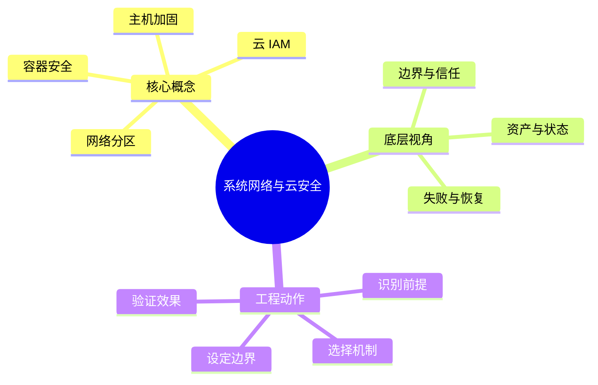

# 信息安全：系统网络与云安全

## 学习目标
- 掌握网络分区、主机加固、容器安全、云 IAM 和日志审计。
- 能从底层机制、适用边界、工程实践和面试表达四个角度解释本章概念。
- 能画出本章核心流程图，并能用自己的话解释每个节点。
- 能说出至少一个不适用场景、一个常见误区和一个纠正方式。

## 一句话总纲
系统安全要把主机、网络、身份、配置和供应链一起看。

## 记忆口诀
> 分区隔离，最小权限，配置可审

## 思维导图

## Mermaid 图解：核心流程

## 分章节讲解
### 1. 网络分区
**核心定义：** 网络分区按业务敏感度和访问方向划分网络区域，通过边界控制减少横向移动和爆炸半径。

**底层原理 / 机制拆解：**
- 分区依赖子网、路由、安全组、ACL、防火墙、服务网格和东西向流量方案。
- 有效分区要从数据流出发，只开放必要方向、端口和身份，而不是简单按环境命名。
- 分区后必须配合日志、流量基线和变更审计，否则规则膨胀会形成“纸面隔离”。

**适用场景：** 适用于生产/测试隔离、管理面隔离、数据库保护、零信任落地、合规分区和多租户网络。

**不适用场景 / 失败边界：** 不适合把网络隔离当唯一安全措施；应用层认证、授权和加密仍必需。

**工程实践或做题/面试理解：** 工程上用默认拒绝、最小端口、堡垒机/JIT 访问和 IaC 审批；面试强调“隔离降低横向移动，不替代身份”。

**常见误区与纠正方式：** 安全组全开内网；纠正方式是按服务依赖生成白名单并持续清理未命中规则。

**速记：** 网络先分舱，舱门默认关。

### 2. 主机加固
**核心定义：** 主机加固通过减少服务、收敛权限、修补漏洞、强化审计和限制执行来降低服务器被攻陷概率与后果。

**底层原理 / 机制拆解：**
- 基础动作包括补丁管理、关闭无用端口、禁用弱口令、SSH 强化、文件权限、最小 sudo、EDR/日志采集。
- 运行时加固包括 SELinux/AppArmor、系统调用限制、完整性监控、只读文件系统和基线漂移检测。
- 加固必须自动化，否则手工配置会在扩容、替换和紧急变更中失效。

**适用场景：** 适用于裸机、虚拟机、跳板机、数据库主机、CI Runner 和容器宿主机。

**不适用场景 / 失败边界：** 不适合依赖一次性人工 checklist；也不能用“打了补丁”代替凭证和权限治理。

**工程实践或做题/面试理解：** 工程上用镜像基线、配置管理、CIS Benchmark、漏洞扫描和不可变基础设施；面试补充“可审计比口头加固更重要”。

**常见误区与纠正方式：** 只关注系统漏洞忽视高权限服务账号；纠正方式是把进程权限、密钥文件和出网能力纳入基线。

**速记：** 少服务、少权限、勤补丁、强审计。

### 3. 容器安全
**核心定义：** 容器安全覆盖镜像、运行时、编排平台、网络、密钥和宿主机边界，核心是避免容器逃逸和供应链污染。

**底层原理 / 机制拆解：**
- 镜像层要控制基础镜像、依赖漏洞、签名、SBOM 和最小化包。
- 运行时要避免 privileged、hostPath、hostNetwork，设置非 root、只读根文件系统、seccomp/AppArmor 和资源限制。
- Kubernetes 中还要治理 RBAC、ServiceAccount Token、NetworkPolicy、Admission Policy 和 Secret 暴露。

**适用场景：** 适用于微服务、CI/CD、Kubernetes、弹性任务和多租户平台。

**不适用场景 / 失败边界：** 不适合把容器当强安全沙箱；共享内核意味着宿主机和内核漏洞仍是关键风险。

**工程实践或做题/面试理解：** 工程上构建阶段扫描签名，部署阶段 admission 校验，运行阶段检测异常系统调用；面试区分“镜像安全”和“运行时隔离”。

**常见误区与纠正方式：** 容器内 root 不重要；纠正方式是使用非 root 用户、丢弃 capabilities 并禁止特权容器。

**速记：** 镜像要干净，运行少特权，集群控 RBAC。

### 4. 云 IAM
**核心定义：** 云 IAM 通过身份、方案、角色和临时凭证控制云资源访问，是云上安全边界的核心控制面。

**底层原理 / 机制拆解：**
- 方案评估通常综合主体、动作、资源、条件和显式拒绝；显式拒绝优先于允许。
- 角色和临时凭证减少长期 AK/SK 泄露风险，配合 MFA、条件访问和权限边界控制高危操作。
- 云安全还涉及资源方案、组织方案、跨账号信任、审计日志和密钥轮换。

**适用场景：** 适用于多账号治理、服务间访问、CI/CD 部署、第三方代运维、数据桶访问和最小权限落地。

**不适用场景 / 失败边界：** 不适合长期共享管理员密钥，也不适合用一个大权限角色覆盖所有服务。

**工程实践或做题/面试理解：** 工程上从只读审计开始收敛权限，用访问分析生成最小方案，所有高危动作进入 CloudTrail/审计；面试强调“云上边界首先是身份边界”。

**常见误区与纠正方式：** 认为私有网络资源就安全；纠正方式是检查 IAM、资源方案和公开访问配置，防止绕过网络边界直接调用控制面。

**速记：** 云上先看 IAM，显式拒绝最强。

## 实战深化：最小权限、隔离与纵深防御

### 1. 底层机制拆解
系统网络和云安全靠身份、网络分段、最小权限、基线加固和审计形成多层防线。

### 2. 适用与不适用
| 判断点 | 适用信号 | 不适用/风险信号 |
|---|---|---|
| 前提 | 对象、约束和目标清晰 | 概念边界含糊或约束缺失 |
| 机制 | 能说明中间状态如何变化 | 只能背结论，无法解释过程 |
| 成本 | 复杂度、维护成本或风险可接受 | 资源、复杂度或安全边界失控 |
| 验证 | 有样例、测试、证明或观测证据 | 无法复现、无法审计、无法回滚 |

### 3. 案例理解
云上对象存储公开读写、过宽 IAM 和元数据服务暴露常常比代码漏洞更快造成事故。

### 4. 常见误区与纠正
- **误区：** 只记概念定义，不问前提。**纠正：** 每次回答都先说适用条件。
- **误区：** 用单个样例证明普遍正确。**纠正：** 补充边界样例、反例或不变量。
- **误区：** 忽略工程成本。**纠正：** 同时说明性能、可靠性、安全性和维护代价。

### 5. 面试追问路径
- 如果输入规模、业务约束或安全边界变化，结论是否还成立？
- 这个概念和相邻概念的区别是什么？
- 如何设计一个测试、证明或观测指标来验证你的判断？

## 关键对比表
| 知识点 | 解决的核心问题 | 适用边界 | 不适用/风险边界 | 面试抓手 |
|---|---|---|---|---|
| 网络分区 | 网络分区按业务敏感度和访问方向划分网络区域，通过边界控制减少横向移动和爆炸半径。 | 适用于生产/测试隔离、管理面隔离、数据库保护、零信任落地、合规分区和多租户网络。 | 不适合把网络隔离当唯一安全措施；应用层认证、授权和加密仍必需。 | 网络先分舱，舱门默认关。 |
| 主机加固 | 主机加固通过减少服务、收敛权限、修补漏洞、强化审计和限制执行来降低服务器被攻陷概率与后果。 | 适用于裸机、虚拟机、跳板机、数据库主机、CI Runner 和容器宿主机。 | 不适合依赖一次性人工 checklist；也不能用“打了补丁”代替凭证和权限治理。 | 少服务、少权限、勤补丁、强审计。 |
| 容器安全 | 容器安全覆盖镜像、运行时、编排平台、网络、密钥和宿主机边界，核心是避免容器逃逸和供应链污染。 | 适用于微服务、CI/CD、Kubernetes、弹性任务和多租户平台。 | 不适合把容器当强安全沙箱；共享内核意味着宿主机和内核漏洞仍是关键风险。 | 镜像要干净，运行少特权，集群控 RBAC。 |
| 云 IAM | 云 IAM 通过身份、方案、角色和临时凭证控制云资源访问，是云上安全边界的核心控制面。 | 适用于多账号治理、服务间访问、CI/CD 部署、第三方代运维、数据桶访问和最小权限落地。 | 不适合长期共享管理员密钥，也不适合用一个大权限角色覆盖所有服务。 | 云上先看 IAM，显式拒绝最强。 |

## 边界条件表
| 边界条件 | 应优先检查什么 | 如果忽视会怎样 | 推荐纠正方式 |
|---|---|---|---|
| 输入跨信任边界 | 身份、来源、格式、权限 | 被伪造、篡改或越权利用 | 边界处重新认证、授权、校验和审计 |
| 控制依赖人工流程 | owner、时限、证据 | 例外长期存在，风险不可追踪 | 自动化门禁 + 风险接受有效期 |
| 机制带来额外复杂度 | 性能、可用性、维护成本 | 安全控制被绕过或误伤业务 | 用威胁和资产价值决定控制强度 |
| 运行环境会变化 | 配置、依赖、权限漂移 | 文档正确但系统实际暴露 | 持续扫描、基线检测和复盘更新 |

## 常见误区总结
- **网络分区：** 安全组全开内网；纠正方式是按服务依赖生成白名单并持续清理未命中规则。
- **主机加固：** 只关注系统漏洞忽视高权限服务账号；纠正方式是把进程权限、密钥文件和出网能力纳入基线。
- **容器安全：** 容器内 root 不重要；纠正方式是使用非 root 用户、丢弃 capabilities 并禁止特权容器。
- **云 IAM：** 认为私有网络资源就安全；纠正方式是检查 IAM、资源方案和公开访问配置，防止绕过网络边界直接调用控制面。

## 自检题
1. 本章的核心问题是什么？请用一句话回答：系统安全要把主机、网络、身份、配置和供应链一起看。
2. 任选两个概念，说出它们的适用场景和不适用场景。
3. 如果机制失效，最可能先出现在哪个边界？如何验证？
4. 面试中如何用“定义 → 机制 → 场景 → 权衡 → 误区”回答本章任一概念？
5. 给一个真实系统例子，说明你会怎样落地本章控制或设计。

## 速记卡片
- 章节口诀：分区隔离，最小权限，配置可审
- 答题结构：定义 → 机制 → 场景 → 权衡 → 误区 → 记忆点。
- 工程落地：先列前提，再定机制，最后用日志、测试或演练验证。
- 网络分区：网络先分舱，舱门默认关。
- 主机加固：少服务、少权限、勤补丁、强审计。
- 容器安全：镜像要干净，运行少特权，集群控 RBAC。
- 云 IAM：云上先看 IAM，显式拒绝最强。

## 深度扩展：底层原理与应用边界

### 1. 本章在「信息安全」中的位置
- **核心定位：** 围绕资产、攻击者、信任边界和控制措施保护机密性、完整性、可用性。
- **本章作用：** 「信息安全：系统网络与云安全」负责把总纲落到可操作的判断框架：先确认问题边界，再拆解机制，最后根据代价和风险选择方法。
- **主要风险：** 最大风险是把安全当成单点功能，而不是贯穿设计、实现、部署、运行和响应的闭环。
- **实践抓手：** 任何安全问题先问资产是什么、入口在哪里、权限如何判断、证据如何审计。

### 2. 小流程图：从概念到应用

### 3. 概念深化：逐个击破
#### 3.1 网络分区
- **先问它解决什么：** 网络分区 不是孤立名词，而是用来解决本章某类约束、关系、代价或风险判断的问题。
- **底层机制：** 学习时要拆成“输入条件 → 中间结构 → 处理规则 → 输出结果”四步；如果任何一步说不清，说明只是记住了结论。
- **适用条件：** 当前提满足、边界清楚、代价可接受时使用；如果输入分布、规模、时序、权限或一致性假设变化，就要重新评估。
- **不适用信号：** 需要违反前提才能套用、只能靠特殊样例解释、复杂度或维护成本明显失控时，应换方案。
- **面试表达：** “我会先定义 网络分区，再说明它依赖的前提，最后用一个反例说明边界。”

#### 3.2 主机加固
- **先问它解决什么：** 主机加固 不是孤立名词，而是用来解决本章某类约束、关系、代价或风险判断的问题。
- **底层机制：** 学习时要拆成“输入条件 → 中间结构 → 处理规则 → 输出结果”四步；如果任何一步说不清，说明只是记住了结论。
- **适用条件：** 当前提满足、边界清楚、代价可接受时使用；如果输入分布、规模、时序、权限或一致性假设变化，就要重新评估。
- **不适用信号：** 需要违反前提才能套用、只能靠特殊样例解释、复杂度或维护成本明显失控时，应换方案。
- **面试表达：** “我会先定义 主机加固，再说明它依赖的前提，最后用一个反例说明边界。”

#### 3.3 容器安全
- **先问它解决什么：** 容器安全 不是孤立名词，而是用来解决本章某类约束、关系、代价或风险判断的问题。
- **底层机制：** 学习时要拆成“输入条件 → 中间结构 → 处理规则 → 输出结果”四步；如果任何一步说不清，说明只是记住了结论。
- **适用条件：** 当前提满足、边界清楚、代价可接受时使用；如果输入分布、规模、时序、权限或一致性假设变化，就要重新评估。
- **不适用信号：** 需要违反前提才能套用、只能靠特殊样例解释、复杂度或维护成本明显失控时，应换方案。
- **面试表达：** “我会先定义 容器安全，再说明它依赖的前提，最后用一个反例说明边界。”

#### 3.4 云 IAM
- **先问它解决什么：** 云 IAM 不是孤立名词，而是用来解决本章某类约束、关系、代价或风险判断的问题。
- **底层机制：** 学习时要拆成“输入条件 → 中间结构 → 处理规则 → 输出结果”四步；如果任何一步说不清，说明只是记住了结论。
- **适用条件：** 当前提满足、边界清楚、代价可接受时使用；如果输入分布、规模、时序、权限或一致性假设变化，就要重新评估。
- **不适用信号：** 需要违反前提才能套用、只能靠特殊样例解释、复杂度或维护成本明显失控时，应换方案。
- **面试表达：** “我会先定义 云 IAM，再说明它依赖的前提，最后用一个反例说明边界。”

### 4. 适用边界对比表
| 判断维度 | 应该怎么想 | 典型错误 | 记忆提示 |
|---|---|---|---|
| 前提条件 | 先列出输入规模、数据分布、系统假设或业务约束 | 不看条件直接套模板 | 先问“凭什么能用” |
| 正确性 | 需要能说明为什么结果保持不变或为什么局部选择成立 | 只给经验结论 | 用不变量、反例或交换论证检查 |
| 复杂度/成本 | 同时估算时间、空间、延迟、吞吐、人力和维护成本 | 只看理论最优 | 工程里还要看常数和可观测性 |
| 失败模式 | 主动说明边界外会怎样失败 | 面试中只讲优点 | 能说失败边界才算真理解 |

### 5. 记忆强化：三层复述法
1. **概念层：** 用一句话定义本章每个核心概念。
2. **机制层：** 不看原文画出输入到输出的流程。
3. **边界层：** 为每个概念准备一个“不能这样用”的反例。

### 6. 工程/做题/面试迁移
- **工程迁移：** 任何安全问题先问资产是什么、入口在哪里、权限如何判断、证据如何审计。
- **做题迁移：** 先把题目中的对象、关系、约束和目标函数圈出来，再映射到本章概念。
- **面试迁移：** 回答时不要只报名词，要说清“为什么需要它、它如何工作、它何时失效”。

### 7. 深度自检题
1. 你能否把本章概念按“前提 → 机制 → 结果 → 代价”重新组织？
2. 如果输入规模、并发量、数据分布或安全边界变化，原结论是否仍成立？
3. 本章哪个概念最容易被误用？请给出一个反例。
4. 如果让你设计一道面试题，你会怎样考察候选人是否真的理解？

### 8. 深度速记卡片
- **总抓手：** 围绕资产、攻击者、信任边界和控制措施保护机密性、完整性、可用性。
- **答题模板：** 定义边界 → 拆底层机制 → 说适用条件 → 讲权衡 → 给反例。
- **复习动作：** 每次复习只看图和表，尝试口述 3 分钟；卡住处再回正文。

## 专题深化：具体机制、案例与追问

### 1. 具体案例：把「系统网络与云安全」放进真实问题
例如一个上传接口要同时考虑身份认证、对象级授权、文件类型校验、恶意内容扫描、存储权限、日志审计和限速。

### 2. 本章关键机制细化
- 网络分区减少横向移动，不能替代服务级身份。
- 容器共享宿主内核，最小权限和运行时限制很重要。
- 云 IAM 要避免长期密钥、通配符权限和过宽角色。

### 3. 概念到判断的检查清单
| 概念/动作 | 你要检查什么 | 如果检查失败会怎样 |
|---|---|---|
| 网络分区 | 前提、输入、输出、代价、失败边界是否都说清 | 可能套错模型、复杂度失控或得到不可验证结论 |
| 主机加固 | 前提、输入、输出、代价、失败边界是否都说清 | 可能套错模型、复杂度失控或得到不可验证结论 |
| 容器安全 | 前提、输入、输出、代价、失败边界是否都说清 | 可能套错模型、复杂度失控或得到不可验证结论 |
| 云 IAM | 前提、输入、输出、代价、失败边界是否都说清 | 可能套错模型、复杂度失控或得到不可验证结论 |
| 本章在「信息安全」中的位置 | 前提、输入、输出、代价、失败边界是否都说清 | 可能套错模型、复杂度失控或得到不可验证结论 |

### 4. 面试追问路径

- 资产是什么，攻击者能接触哪里？
- 信任边界在哪里跨越？
- 失败后能否发现、遏制和追溯？

### 5. 验证与复盘
- **验证方式：** 用威胁建模、权限测试、模糊测试、日志审计和演练验证。
- **复盘方式：** 每次做题或设计后，记录“我使用了哪个前提、哪个前提最容易被破坏、如果破坏如何调整”。
- **记忆方式：** 不背孤立结论，只背“问题 → 机制 → 边界 → 验证”的链路。

## 继续扩写：机制、边界与面试追问

### 机制拆解补充
- 网络分区、主机加固、容器隔离和云 IAM 是不同层的边界控制，不能互相替代。
- 云安全优先关注身份和配置：过宽角色、公开存储桶、元数据服务暴露和长期访问密钥是高频风险。
- 零信任不是产品名，而是持续认证、细粒度授权、最小权限和可观测性的组合。

### 适用 / 不适用场景
| 维度 | 适用信号 | 不适用信号 | 纠偏动作 |
|---|---|---|---|
| 前提 | 关键假设可明确写出 | 只能靠经验套模板 | 先补定义、约束和反例 |
| 代价 | 时间、空间、人力成本可接受 | 复杂度或维护成本不可控 | 降维、分层或换方案 |
| 验证 | 能用样例、测试或演练证明 | 只能口头保证 | 增加边界用例和观测点 |
| 演进 | 变化范围局部可控 | 一处变化牵动多处 | 重画边界和依赖关系 |

### 工程实践案例
- **场景：** 在真实项目或面试题中遇到 `04-系统网络与云安全` 相关问题时，先列出输入、输出、约束、风险和验收标准。
- **做法：** 用最小可行方案跑通主链路，再补边界用例、错误处理和性能/安全验证。
- **复盘：** 如果方案失败，优先检查前提是否被破坏，而不是继续堆叠特殊判断。

### 面试追问路径
1. 这个概念依赖哪些前提？前提不成立时会发生什么？
2. 和相邻方案相比，它牺牲了什么、换来了什么？
3. 如何用最小反例证明误用会失败？
4. 工程落地时需要哪些监控、测试或回滚手段？
