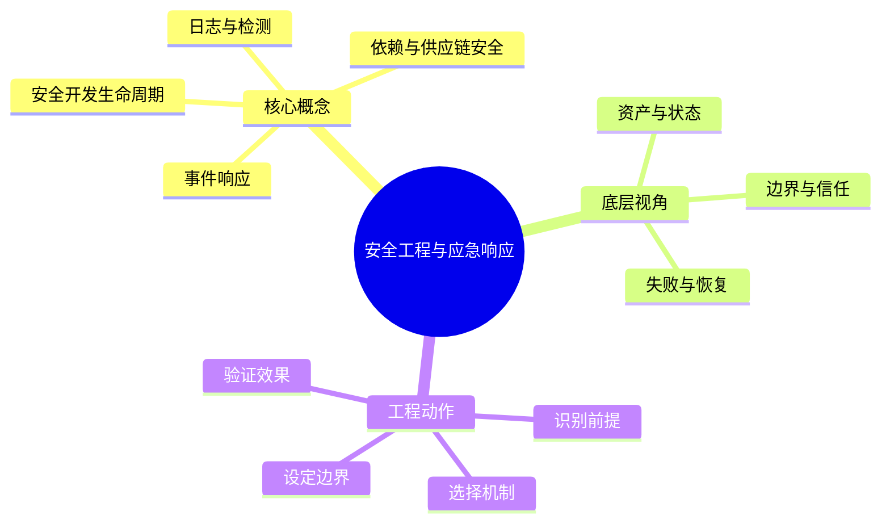

# 信息安全：安全工程与应急响应

## 学习目标
- 学习安全开发生命周期、漏洞管理、监控告警和事件响应。
- 能从底层机制、适用边界、工程实践和面试表达四个角度解释本章概念。
- 能画出本章核心流程图，并能用自己的话解释每个节点。
- 能说出至少一个不适用场景、一个常见误区和一个纠正方式。

## 一句话总纲
安全能力要左移到开发流程，也要在运行时能检测、响应和复盘。

## 记忆口诀
> 左移预防，运行检测，响应复盘

## 思维导图

## Mermaid 图解：核心流程

## 分章节讲解
### 1. 安全开发生命周期
**核心定义：** 安全开发生命周期把威胁建模、安全编码、依赖治理、测试、评审和上线门禁嵌入软件交付流程。

**底层原理 / 机制拆解：**
- 需求阶段定义安全需求和滥用案例，设计阶段做威胁建模，开发阶段用安全编码和代码扫描，测试阶段做 DAST/IAST，发布阶段做门禁。
- 左移不是把责任全部推给开发，而是让安全控制尽早、自动、可重复。
- 风险接受必须有业务 owner、有效期和补偿控制，不能成为永久例外。

**适用场景：** 适用于互联网应用、内部系统、云平台、数据处理链路和任何持续迭代的软件项目。

**不适用场景 / 失败边界：** 不适合只在上线前做一次渗透测试；越晚发现问题，修复成本越高。

**工程实践或做题/面试理解：** 工程上建立安全需求模板、SAST 规则、依赖扫描、密钥扫描、代码评审 checklist 和安全验收；面试中说明“SDL 是流程化风险控制”。

**常见误区与纠正方式：** 把安全当安全团队最后把关；纠正方式是定义研发自检、自动化门禁和安全专家抽样复核。

**速记：** 需求定边界，设计找威胁，发布有门禁。

### 2. 依赖与供应链安全
**核心定义：** 供应链安全治理第三方库、构建工具、镜像、CI/CD、制品仓库和发布签名，防止可信链路被污染。

**底层原理 / 机制拆解：**
- 风险来源包括已知漏洞、恶意包、依赖混淆、锁文件漂移、构建脚本执行、制品篡改和 CI 密钥泄露。
- 控制手段包括锁版本、SBOM、漏洞扫描、来源校验、制品签名、最小 CI 权限和可重现构建。
- 依赖治理要结合可利用性、暴露面、补丁可用性和业务影响排序，而不是只看 CVSS。

**适用场景：** 适用于 npm/pip/maven/go modules、容器镜像、基础镜像、GitHub Actions、制品发布和开源合规。

**不适用场景 / 失败边界：** 不适合盲目升级所有依赖导致业务回归，也不能只扫描直接依赖忽视传递依赖。

**工程实践或做题/面试理解：** 工程上固定 lockfile、启用 Dependabot/Renovate、构建时生成 SBOM、发布时签名；面试中举 Log4Shell 或依赖混淆说明攻击路径。

**常见误区与纠正方式：** 认为开源库“大家都用所以安全”；纠正方式是评估维护活跃度、下载来源、权限脚本和漏洞响应。

**速记：** 锁版本、知来源、签制品、少权限。

### 3. 日志与检测
**核心定义：** 日志与检测通过采集关键安全事件、建立规则和行为基线，在攻击发生时尽早发现并支持溯源。

**底层原理 / 机制拆解：**
- 高价值日志包括登录、授权失败、权限变更、敏感数据访问、管理操作、网络流量、进程行为和云控制面事件。
- 检测规则要关注攻击链信号，例如异常地理位置登录、短时间失败爆破、权限突增、可疑出网和大批量下载。
- 日志必须保证时间同步、字段一致、关联 ID、完整性保护和保留周期，否则事故中难以取证。

**适用场景：** 适用于账号安全、Web 攻击检测、云审计、数据泄露监控、主机入侵检测和合规审计。

**不适用场景 / 失败边界：** 不适合只收集大量无结构日志而没有告警、降噪和响应流程。

**工程实践或做题/面试理解：** 工程上定义安全事件 schema、接入 SIEM、设定告警分级和 runbook；面试中强调“日志要能回答谁在何时对什么做了什么”。

**常见误区与纠正方式：** 认为有日志就能检测；纠正方式是为每类威胁写检测逻辑、阈值、误报处理和验证样例。

**速记：** 日志有字段，告警有剧本，证据能串链。

### 4. 事件响应
**核心定义：** 事件响应是在安全事件发生后按准备、识别、遏制、根除、恢复和复盘的流程降低损失并防止复发。

**底层原理 / 机制拆解：**
- 识别阶段确认范围和影响，遏制阶段阻断攻击扩散，根除阶段清除根因，恢复阶段验证业务安全上线。
- 响应中要保护证据链，避免盲目重启、删除日志或覆盖现场。
- 复盘要输出根因、时间线、影响面、修复项、检测改进和责任人。

**适用场景：** 适用于账号泄露、Web 入侵、勒索软件、数据泄露、供应链污染、云资源滥用和内部误操作。

**不适用场景 / 失败边界：** 不适合临场 improvisation；没有预案、通讯录、权限和演练会显著拖慢处置。

**工程实践或做题/面试理解：** 工程上准备分级响应、应急权限、隔离脚本、取证清单和演练；面试回答按 NIST 六阶段展开即可。

**常见误区与纠正方式：** 只修当前漏洞不复盘检测缺口；纠正方式是把修复项分为代码、配置、监控、流程和培训五类。

**速记：** 先遏制扩散，再根除根因，最后复盘补洞。

## 实战深化：从预防到检测响应

### 1. 底层机制拆解
安全工程要把安全要求前移到设计和流水线，同时用日志、检测、演练和复盘缩短攻击停留时间。

### 2. 适用与不适用
| 判断点 | 适用信号 | 不适用/风险信号 |
|---|---|---|
| 前提 | 对象、约束和目标清晰 | 概念边界含糊或约束缺失 |
| 机制 | 能说明中间状态如何变化 | 只能背结论，无法解释过程 |
| 成本 | 复杂度、维护成本或风险可接受 | 资源、复杂度或安全边界失控 |
| 验证 | 有样例、测试、证明或观测证据 | 无法复现、无法审计、无法回滚 |

### 3. 案例理解
供应链漏洞爆发时，要能快速定位受影响版本、隔离服务、轮换密钥、修复镜像并复盘检测缺口。

### 4. 常见误区与纠正
- **误区：** 只记概念定义，不问前提。**纠正：** 每次回答都先说适用条件。
- **误区：** 用单个样例证明普遍正确。**纠正：** 补充边界样例、反例或不变量。
- **误区：** 忽略工程成本。**纠正：** 同时说明性能、可靠性、安全性和维护代价。

### 5. 面试追问路径
- 如果输入规模、业务约束或安全边界变化，结论是否还成立？
- 这个概念和相邻概念的区别是什么？
- 如何设计一个测试、证明或观测指标来验证你的判断？

## 关键对比表
| 知识点 | 解决的核心问题 | 适用边界 | 不适用/风险边界 | 面试抓手 |
|---|---|---|---|---|
| 安全开发生命周期 | 安全开发生命周期把威胁建模、安全编码、依赖治理、测试、评审和上线门禁嵌入软件交付流程。 | 适用于互联网应用、内部系统、云平台、数据处理链路和任何持续迭代的软件项目。 | 不适合只在上线前做一次渗透测试；越晚发现问题，修复成本越高。 | 需求定边界，设计找威胁，发布有门禁。 |
| 依赖与供应链安全 | 供应链安全治理第三方库、构建工具、镜像、CI/CD、制品仓库和发布签名，防止可信链路被污染。 | 适用于 npm/pip/maven/go modules、容器镜像、基础镜像、GitHub Actions、制品发布和开源合规。 | 不适合盲目升级所有依赖导致业务回归，也不能只扫描直接依赖忽视传递依赖。 | 锁版本、知来源、签制品、少权限。 |
| 日志与检测 | 日志与检测通过采集关键安全事件、建立规则和行为基线，在攻击发生时尽早发现并支持溯源。 | 适用于账号安全、Web 攻击检测、云审计、数据泄露监控、主机入侵检测和合规审计。 | 不适合只收集大量无结构日志而没有告警、降噪和响应流程。 | 日志有字段，告警有剧本，证据能串链。 |
| 事件响应 | 事件响应是在安全事件发生后按准备、识别、遏制、根除、恢复和复盘的流程降低损失并防止复发。 | 适用于账号泄露、Web 入侵、勒索软件、数据泄露、供应链污染、云资源滥用和内部误操作。 | 不适合临场 improvisation；没有预案、通讯录、权限和演练会显著拖慢处置。 | 先遏制扩散，再根除根因，最后复盘补洞。 |

## 边界条件表
| 边界条件 | 应优先检查什么 | 如果忽视会怎样 | 推荐纠正方式 |
|---|---|---|---|
| 输入跨信任边界 | 身份、来源、格式、权限 | 被伪造、篡改或越权利用 | 边界处重新认证、授权、校验和审计 |
| 控制依赖人工流程 | owner、时限、证据 | 例外长期存在，风险不可追踪 | 自动化门禁 + 风险接受有效期 |
| 机制带来额外复杂度 | 性能、可用性、维护成本 | 安全控制被绕过或误伤业务 | 用威胁和资产价值决定控制强度 |
| 运行环境会变化 | 配置、依赖、权限漂移 | 文档正确但系统实际暴露 | 持续扫描、基线检测和复盘更新 |

## 常见误区总结
- **安全开发生命周期：** 把安全当安全团队最后把关；纠正方式是定义研发自检、自动化门禁和安全专家抽样复核。
- **依赖与供应链安全：** 认为开源库“大家都用所以安全”；纠正方式是评估维护活跃度、下载来源、权限脚本和漏洞响应。
- **日志与检测：** 认为有日志就能检测；纠正方式是为每类威胁写检测逻辑、阈值、误报处理和验证样例。
- **事件响应：** 只修当前漏洞不复盘检测缺口；纠正方式是把修复项分为代码、配置、监控、流程和培训五类。

## 自检题
1. 本章的核心问题是什么？请用一句话回答：安全能力要左移到开发流程，也要在运行时能检测、响应和复盘。
2. 任选两个概念，说出它们的适用场景和不适用场景。
3. 如果机制失效，最可能先出现在哪个边界？如何验证？
4. 面试中如何用“定义 → 机制 → 场景 → 权衡 → 误区”回答本章任一概念？
5. 给一个真实系统例子，说明你会怎样落地本章控制或设计。

## 速记卡片
- 章节口诀：左移预防，运行检测，响应复盘
- 答题结构：定义 → 机制 → 场景 → 权衡 → 误区 → 记忆点。
- 工程落地：先列前提，再定机制，最后用日志、测试或演练验证。
- 安全开发生命周期：需求定边界，设计找威胁，发布有门禁。
- 依赖与供应链安全：锁版本、知来源、签制品、少权限。
- 日志与检测：日志有字段，告警有剧本，证据能串链。
- 事件响应：先遏制扩散，再根除根因，最后复盘补洞。

## 深度扩展：底层原理与应用边界

### 1. 本章在「信息安全」中的位置
- **核心定位：** 围绕资产、攻击者、信任边界和控制措施保护机密性、完整性、可用性。
- **本章作用：** 「信息安全：安全工程与应急响应」负责把总纲落到可操作的判断框架：先确认问题边界，再拆解机制，最后根据代价和风险选择方法。
- **主要风险：** 最大风险是把安全当成单点功能，而不是贯穿设计、实现、部署、运行和响应的闭环。
- **实践抓手：** 任何安全问题先问资产是什么、入口在哪里、权限如何判断、证据如何审计。

### 2. 小流程图：从概念到应用

### 3. 概念深化：逐个击破
#### 3.1 安全开发生命周期
- **先问它解决什么：** 安全开发生命周期 不是孤立名词，而是用来解决本章某类约束、关系、代价或风险判断的问题。
- **底层机制：** 学习时要拆成“输入条件 → 中间结构 → 处理规则 → 输出结果”四步；如果任何一步说不清，说明只是记住了结论。
- **适用条件：** 当前提满足、边界清楚、代价可接受时使用；如果输入分布、规模、时序、权限或一致性假设变化，就要重新评估。
- **不适用信号：** 需要违反前提才能套用、只能靠特殊样例解释、复杂度或维护成本明显失控时，应换方案。
- **面试表达：** “我会先定义 安全开发生命周期，再说明它依赖的前提，最后用一个反例说明边界。”

#### 3.2 依赖与供应链安全
- **先问它解决什么：** 依赖与供应链安全 不是孤立名词，而是用来解决本章某类约束、关系、代价或风险判断的问题。
- **底层机制：** 学习时要拆成“输入条件 → 中间结构 → 处理规则 → 输出结果”四步；如果任何一步说不清，说明只是记住了结论。
- **适用条件：** 当前提满足、边界清楚、代价可接受时使用；如果输入分布、规模、时序、权限或一致性假设变化，就要重新评估。
- **不适用信号：** 需要违反前提才能套用、只能靠特殊样例解释、复杂度或维护成本明显失控时，应换方案。
- **面试表达：** “我会先定义 依赖与供应链安全，再说明它依赖的前提，最后用一个反例说明边界。”

#### 3.3 日志与检测
- **先问它解决什么：** 日志与检测 不是孤立名词，而是用来解决本章某类约束、关系、代价或风险判断的问题。
- **底层机制：** 学习时要拆成“输入条件 → 中间结构 → 处理规则 → 输出结果”四步；如果任何一步说不清，说明只是记住了结论。
- **适用条件：** 当前提满足、边界清楚、代价可接受时使用；如果输入分布、规模、时序、权限或一致性假设变化，就要重新评估。
- **不适用信号：** 需要违反前提才能套用、只能靠特殊样例解释、复杂度或维护成本明显失控时，应换方案。
- **面试表达：** “我会先定义 日志与检测，再说明它依赖的前提，最后用一个反例说明边界。”

#### 3.4 事件响应
- **先问它解决什么：** 事件响应 不是孤立名词，而是用来解决本章某类约束、关系、代价或风险判断的问题。
- **底层机制：** 学习时要拆成“输入条件 → 中间结构 → 处理规则 → 输出结果”四步；如果任何一步说不清，说明只是记住了结论。
- **适用条件：** 当前提满足、边界清楚、代价可接受时使用；如果输入分布、规模、时序、权限或一致性假设变化，就要重新评估。
- **不适用信号：** 需要违反前提才能套用、只能靠特殊样例解释、复杂度或维护成本明显失控时，应换方案。
- **面试表达：** “我会先定义 事件响应，再说明它依赖的前提，最后用一个反例说明边界。”

### 4. 适用边界对比表
| 判断维度 | 应该怎么想 | 典型错误 | 记忆提示 |
|---|---|---|---|
| 前提条件 | 先列出输入规模、数据分布、系统假设或业务约束 | 不看条件直接套模板 | 先问“凭什么能用” |
| 正确性 | 需要能说明为什么结果保持不变或为什么局部选择成立 | 只给经验结论 | 用不变量、反例或交换论证检查 |
| 复杂度/成本 | 同时估算时间、空间、延迟、吞吐、人力和维护成本 | 只看理论最优 | 工程里还要看常数和可观测性 |
| 失败模式 | 主动说明边界外会怎样失败 | 面试中只讲优点 | 能说失败边界才算真理解 |

### 5. 记忆强化：三层复述法
1. **概念层：** 用一句话定义本章每个核心概念。
2. **机制层：** 不看原文画出输入到输出的流程。
3. **边界层：** 为每个概念准备一个“不能这样用”的反例。

### 6. 工程/做题/面试迁移
- **工程迁移：** 任何安全问题先问资产是什么、入口在哪里、权限如何判断、证据如何审计。
- **做题迁移：** 先把题目中的对象、关系、约束和目标函数圈出来，再映射到本章概念。
- **面试迁移：** 回答时不要只报名词，要说清“为什么需要它、它如何工作、它何时失效”。

### 7. 深度自检题
1. 你能否把本章概念按“前提 → 机制 → 结果 → 代价”重新组织？
2. 如果输入规模、并发量、数据分布或安全边界变化，原结论是否仍成立？
3. 本章哪个概念最容易被误用？请给出一个反例。
4. 如果让你设计一道面试题，你会怎样考察候选人是否真的理解？

### 8. 深度速记卡片
- **总抓手：** 围绕资产、攻击者、信任边界和控制措施保护机密性、完整性、可用性。
- **答题模板：** 定义边界 → 拆底层机制 → 说适用条件 → 讲权衡 → 给反例。
- **复习动作：** 每次复习只看图和表，尝试口述 3 分钟；卡住处再回正文。

## 专题深化：具体机制、案例与追问

### 1. 具体案例：把「安全工程与应急响应」放进真实问题
例如一个上传接口要同时考虑身份认证、对象级授权、文件类型校验、恶意内容扫描、存储权限、日志审计和限速。

### 2. 本章关键机制细化
- 安全左移把威胁建模和安全测试提前到设计实现阶段。
- 供应链风险包括传递依赖、构建脚本、镜像和制品仓库。
- 事件响应要先保全证据，再遏制、根除、恢复和复盘。

### 3. 概念到判断的检查清单
| 概念/动作 | 你要检查什么 | 如果检查失败会怎样 |
|---|---|---|
| 安全开发生命周期 | 前提、输入、输出、代价、失败边界是否都说清 | 可能套错模型、复杂度失控或得到不可验证结论 |
| 依赖与供应链安全 | 前提、输入、输出、代价、失败边界是否都说清 | 可能套错模型、复杂度失控或得到不可验证结论 |
| 日志与检测 | 前提、输入、输出、代价、失败边界是否都说清 | 可能套错模型、复杂度失控或得到不可验证结论 |
| 事件响应 | 前提、输入、输出、代价、失败边界是否都说清 | 可能套错模型、复杂度失控或得到不可验证结论 |
| 本章在「信息安全」中的位置 | 前提、输入、输出、代价、失败边界是否都说清 | 可能套错模型、复杂度失控或得到不可验证结论 |

### 4. 面试追问路径

- 资产是什么，攻击者能接触哪里？
- 信任边界在哪里跨越？
- 失败后能否发现、遏制和追溯？

### 5. 验证与复盘
- **验证方式：** 用威胁建模、权限测试、模糊测试、日志审计和演练验证。
- **复盘方式：** 每次做题或设计后，记录“我使用了哪个前提、哪个前提最容易被破坏、如果破坏如何调整”。
- **记忆方式：** 不背孤立结论，只背“问题 → 机制 → 边界 → 验证”的链路。

## 继续扩写：机制、边界与面试追问

### 机制拆解补充
- 安全工程要把威胁建模、代码扫描、依赖治理、密钥扫描、权限测试和发布门禁纳入 SDLC。
- 检测规则要绑定资产和攻击路径，单纯收集日志不等于具备发现能力。
- 事件响应要提前定义分级、隔离、取证、修复、复盘和对外沟通流程。

### 适用 / 不适用场景
| 维度 | 适用信号 | 不适用信号 | 纠偏动作 |
|---|---|---|---|
| 前提 | 关键假设可明确写出 | 只能靠经验套模板 | 先补定义、约束和反例 |
| 代价 | 时间、空间、人力成本可接受 | 复杂度或维护成本不可控 | 降维、分层或换方案 |
| 验证 | 能用样例、测试或演练证明 | 只能口头保证 | 增加边界用例和观测点 |
| 演进 | 变化范围局部可控 | 一处变化牵动多处 | 重画边界和依赖关系 |

### 工程实践案例
- **场景：** 在真实项目或面试题中遇到 `05-安全工程与应急响应` 相关问题时，先列出输入、输出、约束、风险和验收标准。
- **做法：** 用最小可行方案跑通主链路，再补边界用例、错误处理和性能/安全验证。
- **复盘：** 如果方案失败，优先检查前提是否被破坏，而不是继续堆叠特殊判断。

### 面试追问路径
1. 这个概念依赖哪些前提？前提不成立时会发生什么？
2. 和相邻方案相比，它牺牲了什么、换来了什么？
3. 如何用最小反例证明误用会失败？
4. 工程落地时需要哪些监控、测试或回滚手段？
