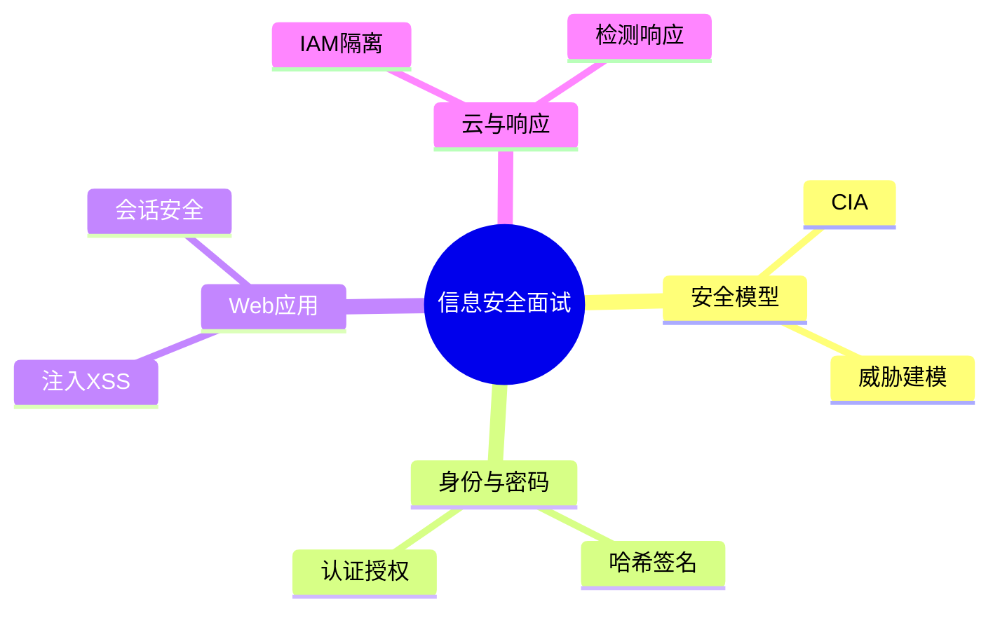
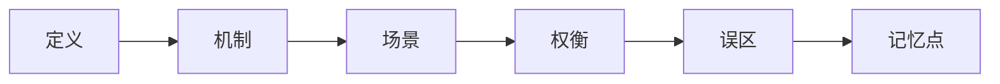
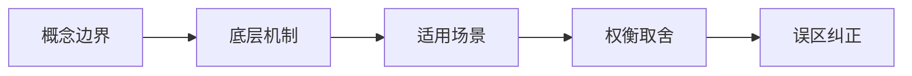
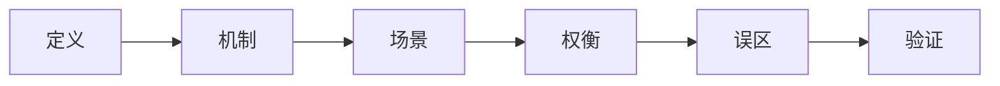
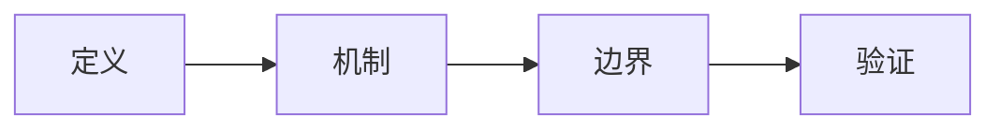
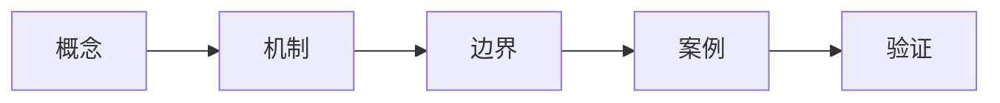
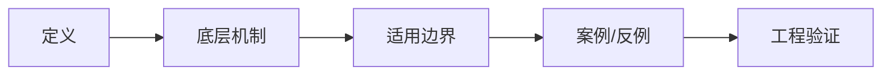

# 信息安全面试20问

## 学习目标
- 用 20 个高频问题串起 信息安全 的核心知识。
- 每个答案都按“定义 → 机制 → 场景 → 权衡 → 误区 → 记忆点”组织，便于面试复述。
- 通过小型 Mermaid 图辅助记忆，避免超大图难以阅读。

## 一句话总纲
信息安全的核心是保护机密性、完整性、可用性，并围绕身份、权限、输入、边界和审计建立可验证防线。

## 记忆口诀
> 先建模威胁，再最小权限；输入要验证，密钥要托管，日志能追踪。

## 思维导图

## 答题总流程

## 第 1-5 问：小图记忆

## 深度面试答题框架

- **总主线：** 围绕资产、攻击者、信任边界和控制措施保护机密性、完整性、可用性。
- **风险提醒：** 最大风险是把安全当成单点功能，而不是贯穿设计、实现、部署、运行和响应的闭环。
- **实践抓手：** 任何安全问题先问资产是什么、入口在哪里、权限如何判断、证据如何审计。

## 面试答案强化版：逐题深答

> 回答每题都按：定义 → 机制 → 场景 → 权衡 → 误区 → 验证。

### Q1：请解释“CIA 三元组”的核心思想、适用场景和常见误区。

**答：**
1. **定义：** 机密性防止未授权读取，完整性防止未授权篡改，可用性保证服务在需要时可被使用；三者共同定义安全目标，而不是三个互相独立的口号。
2. **机制：** 把“CIA 三元组”放入本学科主线：围绕资产、威胁、信任边界、控制措施、检测响应和持续改进建立风险降低闭环。回答时先说明输入或前提，再说明内部结构、状态变化或控制规则，最后说明输出结论为什么可信。
3. **适用场景：** 当问题需要围绕 CIA 三元组 判断正确性、效率、风险、边界或工程取舍时使用；如果前提不满足，应先换模型或补充约束。
4. **权衡：** 它能降低理解或实现复杂度，但可能引入计算成本、维护成本、误判风险或安全边界问题；面试中要主动比较相邻概念。
5. **常见误区：** 只背定义不讲前提；只讲优点不讲失败模式；不能给出反例、验证方法或工程落地证据。
6. **验证/记忆点：** 用“定义 → 机制 → 场景 → 权衡 → 误区 → 验证”复述；再准备一个正例、一个反例和一个边界条件。

**追问路径：**
- 如果输入规模、数据分布、权限边界或业务目标变化，CIA 三元组 是否仍成立？
- 它和相邻概念的边界在哪里，如何用反例区分？
- 如果落到工程实践，你会用什么测试、指标、日志、证明或审计证据验证？

### Q2：请解释“攻击面”的核心思想、适用场景和常见误区。

**答：**
1. **定义：** 攻击面是攻击者可接触、可影响或可诱导执行的入口集合，包括公网接口、内部 API、依赖组件、配置、权限、运维流程和人员操作。
2. **机制：** 把“攻击面”放入本学科主线：围绕资产、威胁、信任边界、控制措施、检测响应和持续改进建立风险降低闭环。回答时先说明输入或前提，再说明内部结构、状态变化或控制规则，最后说明输出结论为什么可信。
3. **适用场景：** 当问题需要围绕 攻击面 判断正确性、效率、风险、边界或工程取舍时使用；如果前提不满足，应先换模型或补充约束。
4. **权衡：** 它能降低理解或实现复杂度，但可能引入计算成本、维护成本、误判风险或安全边界问题；面试中要主动比较相邻概念。
5. **常见误区：** 只背定义不讲前提；只讲优点不讲失败模式；不能给出反例、验证方法或工程落地证据。
6. **验证/记忆点：** 用“定义 → 机制 → 场景 → 权衡 → 误区 → 验证”复述；再准备一个正例、一个反例和一个边界条件。

**追问路径：**
- 如果输入规模、数据分布、权限边界或业务目标变化，攻击面 是否仍成立？
- 它和相邻概念的边界在哪里，如何用反例区分？
- 如果落到工程实践，你会用什么测试、指标、日志、证明或审计证据验证？

### Q3：请解释“信任边界”的核心思想、适用场景和常见误区。

**答：**
1. **定义：** 信任边界区分不同信任级别的数据、身份、网络和执行环境；任何跨边界的数据都必须重新验证、授权、记录和限制副作用。
2. **机制：** 把“信任边界”放入本学科主线：围绕资产、威胁、信任边界、控制措施、检测响应和持续改进建立风险降低闭环。回答时先说明输入或前提，再说明内部结构、状态变化或控制规则，最后说明输出结论为什么可信。
3. **适用场景：** 当问题需要围绕 信任边界 判断正确性、效率、风险、边界或工程取舍时使用；如果前提不满足，应先换模型或补充约束。
4. **权衡：** 它能降低理解或实现复杂度，但可能引入计算成本、维护成本、误判风险或安全边界问题；面试中要主动比较相邻概念。
5. **常见误区：** 只背定义不讲前提；只讲优点不讲失败模式；不能给出反例、验证方法或工程落地证据。
6. **验证/记忆点：** 用“定义 → 机制 → 场景 → 权衡 → 误区 → 验证”复述；再准备一个正例、一个反例和一个边界条件。

**追问路径：**
- 如果输入规模、数据分布、权限边界或业务目标变化，信任边界 是否仍成立？
- 它和相邻概念的边界在哪里，如何用反例区分？
- 如果落到工程实践，你会用什么测试、指标、日志、证明或审计证据验证？

### Q4：请解释“威胁建模”的核心思想、适用场景和常见误区。

**答：**
1. **定义：** 威胁建模是在设计阶段系统识别资产、数据流、边界、攻击者能力、威胁类别和缓解措施的工程活动。
2. **机制：** 把“威胁建模”放入本学科主线：围绕资产、威胁、信任边界、控制措施、检测响应和持续改进建立风险降低闭环。回答时先说明输入或前提，再说明内部结构、状态变化或控制规则，最后说明输出结论为什么可信。
3. **适用场景：** 当问题需要围绕 威胁建模 判断正确性、效率、风险、边界或工程取舍时使用；如果前提不满足，应先换模型或补充约束。
4. **权衡：** 它能降低理解或实现复杂度，但可能引入计算成本、维护成本、误判风险或安全边界问题；面试中要主动比较相邻概念。
5. **常见误区：** 只背定义不讲前提；只讲优点不讲失败模式；不能给出反例、验证方法或工程落地证据。
6. **验证/记忆点：** 用“定义 → 机制 → 场景 → 权衡 → 误区 → 验证”复述；再准备一个正例、一个反例和一个边界条件。

**追问路径：**
- 如果输入规模、数据分布、权限边界或业务目标变化，威胁建模 是否仍成立？
- 它和相邻概念的边界在哪里，如何用反例区分？
- 如果落到工程实践，你会用什么测试、指标、日志、证明或审计证据验证？

### Q5：请解释“哈希函数”的核心思想、适用场景和常见误区。

**答：**
1. **定义：** 安全哈希把任意长度输入映射为固定长度摘要，并要求抗原像、抗第二原像和抗碰撞，常用于完整性校验、索引指纹和签名前摘要。
2. **机制：** 把“哈希函数”放入本学科主线：围绕资产、威胁、信任边界、控制措施、检测响应和持续改进建立风险降低闭环。回答时先说明输入或前提，再说明内部结构、状态变化或控制规则，最后说明输出结论为什么可信。
3. **适用场景：** 当问题需要围绕 哈希函数 判断正确性、效率、风险、边界或工程取舍时使用；如果前提不满足，应先换模型或补充约束。
4. **权衡：** 它能降低理解或实现复杂度，但可能引入计算成本、维护成本、误判风险或安全边界问题；面试中要主动比较相邻概念。
5. **常见误区：** 只背定义不讲前提；只讲优点不讲失败模式；不能给出反例、验证方法或工程落地证据。
6. **验证/记忆点：** 用“定义 → 机制 → 场景 → 权衡 → 误区 → 验证”复述；再准备一个正例、一个反例和一个边界条件。

**追问路径：**
- 如果输入规模、数据分布、权限边界或业务目标变化，哈希函数 是否仍成立？
- 它和相邻概念的边界在哪里，如何用反例区分？
- 如果落到工程实践，你会用什么测试、指标、日志、证明或审计证据验证？

### Q6：请解释“对称与非对称加密”的核心思想、适用场景和常见误区。

**答：**
1. **定义：** 对称加密加解密使用同一密钥，速度快；非对称加密使用公私钥对，便于密钥交换和身份绑定但成本高。
2. **机制：** 把“对称与非对称加密”放入本学科主线：围绕资产、威胁、信任边界、控制措施、检测响应和持续改进建立风险降低闭环。回答时先说明输入或前提，再说明内部结构、状态变化或控制规则，最后说明输出结论为什么可信。
3. **适用场景：** 当问题需要围绕 对称与非对称加密 判断正确性、效率、风险、边界或工程取舍时使用；如果前提不满足，应先换模型或补充约束。
4. **权衡：** 它能降低理解或实现复杂度，但可能引入计算成本、维护成本、误判风险或安全边界问题；面试中要主动比较相邻概念。
5. **常见误区：** 只背定义不讲前提；只讲优点不讲失败模式；不能给出反例、验证方法或工程落地证据。
6. **验证/记忆点：** 用“定义 → 机制 → 场景 → 权衡 → 误区 → 验证”复述；再准备一个正例、一个反例和一个边界条件。

**追问路径：**
- 如果输入规模、数据分布、权限边界或业务目标变化，对称与非对称加密 是否仍成立？
- 它和相邻概念的边界在哪里，如何用反例区分？
- 如果落到工程实践，你会用什么测试、指标、日志、证明或审计证据验证？

### Q7：请解释“数字签名”的核心思想、适用场景和常见误区。

**答：**
1. **定义：** 数字签名用私钥对消息摘要生成签名，接收方用公钥验证，提供身份认证、完整性和一定的不可否认性。
2. **机制：** 把“数字签名”放入本学科主线：围绕资产、威胁、信任边界、控制措施、检测响应和持续改进建立风险降低闭环。回答时先说明输入或前提，再说明内部结构、状态变化或控制规则，最后说明输出结论为什么可信。
3. **适用场景：** 当问题需要围绕 数字签名 判断正确性、效率、风险、边界或工程取舍时使用；如果前提不满足，应先换模型或补充约束。
4. **权衡：** 它能降低理解或实现复杂度，但可能引入计算成本、维护成本、误判风险或安全边界问题；面试中要主动比较相邻概念。
5. **常见误区：** 只背定义不讲前提；只讲优点不讲失败模式；不能给出反例、验证方法或工程落地证据。
6. **验证/记忆点：** 用“定义 → 机制 → 场景 → 权衡 → 误区 → 验证”复述；再准备一个正例、一个反例和一个边界条件。

**追问路径：**
- 如果输入规模、数据分布、权限边界或业务目标变化，数字签名 是否仍成立？
- 它和相邻概念的边界在哪里，如何用反例区分？
- 如果落到工程实践，你会用什么测试、指标、日志、证明或审计证据验证？

### Q8：请解释“认证与授权”的核心思想、适用场景和常见误区。

**答：**
1. **定义：** 认证确认主体是谁，授权决定主体能对哪些资源执行哪些动作；二者必须在后端可信边界内完成。
2. **机制：** 把“认证与授权”放入本学科主线：围绕资产、威胁、信任边界、控制措施、检测响应和持续改进建立风险降低闭环。回答时先说明输入或前提，再说明内部结构、状态变化或控制规则，最后说明输出结论为什么可信。
3. **适用场景：** 当问题需要围绕 认证与授权 判断正确性、效率、风险、边界或工程取舍时使用；如果前提不满足，应先换模型或补充约束。
4. **权衡：** 它能降低理解或实现复杂度，但可能引入计算成本、维护成本、误判风险或安全边界问题；面试中要主动比较相邻概念。
5. **常见误区：** 只背定义不讲前提；只讲优点不讲失败模式；不能给出反例、验证方法或工程落地证据。
6. **验证/记忆点：** 用“定义 → 机制 → 场景 → 权衡 → 误区 → 验证”复述；再准备一个正例、一个反例和一个边界条件。

**追问路径：**
- 如果输入规模、数据分布、权限边界或业务目标变化，认证与授权 是否仍成立？
- 它和相邻概念的边界在哪里，如何用反例区分？
- 如果落到工程实践，你会用什么测试、指标、日志、证明或审计证据验证？

### Q9：请解释“注入攻击”的核心思想、适用场景和常见误区。

**答：**
1. **定义：** 注入攻击把不可信输入拼接进命令、查询、模板或解释器上下文，使攻击者改变原本语义，SQL 注入是最典型形式。
2. **机制：** 把“注入攻击”放入本学科主线：围绕资产、威胁、信任边界、控制措施、检测响应和持续改进建立风险降低闭环。回答时先说明输入或前提，再说明内部结构、状态变化或控制规则，最后说明输出结论为什么可信。
3. **适用场景：** 当问题需要围绕 注入攻击 判断正确性、效率、风险、边界或工程取舍时使用；如果前提不满足，应先换模型或补充约束。
4. **权衡：** 它能降低理解或实现复杂度，但可能引入计算成本、维护成本、误判风险或安全边界问题；面试中要主动比较相邻概念。
5. **常见误区：** 只背定义不讲前提；只讲优点不讲失败模式；不能给出反例、验证方法或工程落地证据。
6. **验证/记忆点：** 用“定义 → 机制 → 场景 → 权衡 → 误区 → 验证”复述；再准备一个正例、一个反例和一个边界条件。

**追问路径：**
- 如果输入规模、数据分布、权限边界或业务目标变化，注入攻击 是否仍成立？
- 它和相邻概念的边界在哪里，如何用反例区分？
- 如果落到工程实践，你会用什么测试、指标、日志、证明或审计证据验证？

### Q10：请解释“XSS”的核心思想、适用场景和常见误区。

**答：**
1. **定义：** XSS 是攻击者让恶意脚本在受害者浏览器中以目标站点上下文执行，从而窃取凭证、冒充操作或篡改页面。
2. **机制：** 把“XSS”放入本学科主线：围绕资产、威胁、信任边界、控制措施、检测响应和持续改进建立风险降低闭环。回答时先说明输入或前提，再说明内部结构、状态变化或控制规则，最后说明输出结论为什么可信。
3. **适用场景：** 当问题需要围绕 XSS 判断正确性、效率、风险、边界或工程取舍时使用；如果前提不满足，应先换模型或补充约束。
4. **权衡：** 它能降低理解或实现复杂度，但可能引入计算成本、维护成本、误判风险或安全边界问题；面试中要主动比较相邻概念。
5. **常见误区：** 只背定义不讲前提；只讲优点不讲失败模式；不能给出反例、验证方法或工程落地证据。
6. **验证/记忆点：** 用“定义 → 机制 → 场景 → 权衡 → 误区 → 验证”复述；再准备一个正例、一个反例和一个边界条件。

**追问路径：**
- 如果输入规模、数据分布、权限边界或业务目标变化，XSS 是否仍成立？
- 它和相邻概念的边界在哪里，如何用反例区分？
- 如果落到工程实践，你会用什么测试、指标、日志、证明或审计证据验证？

### Q11：请解释“CSRF”的核心思想、适用场景和常见误区。

**答：**
1. **定义：** CSRF 利用浏览器自动携带 Cookie 的特性，诱导已登录用户向目标站点发起非本人意图的状态变更请求。
2. **机制：** 把“CSRF”放入本学科主线：围绕资产、威胁、信任边界、控制措施、检测响应和持续改进建立风险降低闭环。回答时先说明输入或前提，再说明内部结构、状态变化或控制规则，最后说明输出结论为什么可信。
3. **适用场景：** 当问题需要围绕 CSRF 判断正确性、效率、风险、边界或工程取舍时使用；如果前提不满足，应先换模型或补充约束。
4. **权衡：** 它能降低理解或实现复杂度，但可能引入计算成本、维护成本、误判风险或安全边界问题；面试中要主动比较相邻概念。
5. **常见误区：** 只背定义不讲前提；只讲优点不讲失败模式；不能给出反例、验证方法或工程落地证据。
6. **验证/记忆点：** 用“定义 → 机制 → 场景 → 权衡 → 误区 → 验证”复述；再准备一个正例、一个反例和一个边界条件。

**追问路径：**
- 如果输入规模、数据分布、权限边界或业务目标变化，CSRF 是否仍成立？
- 它和相邻概念的边界在哪里，如何用反例区分？
- 如果落到工程实践，你会用什么测试、指标、日志、证明或审计证据验证？

### Q12：请解释“会话安全”的核心思想、适用场景和常见误区。

**答：**
1. **定义：** 会话安全管理用户登录后身份状态的创建、存储、传输、刷新、失效和审计，目标是限制凭证被盗后的影响半径。
2. **机制：** 把“会话安全”放入本学科主线：围绕资产、威胁、信任边界、控制措施、检测响应和持续改进建立风险降低闭环。回答时先说明输入或前提，再说明内部结构、状态变化或控制规则，最后说明输出结论为什么可信。
3. **适用场景：** 当问题需要围绕 会话安全 判断正确性、效率、风险、边界或工程取舍时使用；如果前提不满足，应先换模型或补充约束。
4. **权衡：** 它能降低理解或实现复杂度，但可能引入计算成本、维护成本、误判风险或安全边界问题；面试中要主动比较相邻概念。
5. **常见误区：** 只背定义不讲前提；只讲优点不讲失败模式；不能给出反例、验证方法或工程落地证据。
6. **验证/记忆点：** 用“定义 → 机制 → 场景 → 权衡 → 误区 → 验证”复述；再准备一个正例、一个反例和一个边界条件。

**追问路径：**
- 如果输入规模、数据分布、权限边界或业务目标变化，会话安全 是否仍成立？
- 它和相邻概念的边界在哪里，如何用反例区分？
- 如果落到工程实践，你会用什么测试、指标、日志、证明或审计证据验证？

### Q13：请解释“网络分区”的核心思想、适用场景和常见误区。

**答：**
1. **定义：** 网络分区按业务敏感度和访问方向划分网络区域，通过边界控制减少横向移动和爆炸半径。
2. **机制：** 把“网络分区”放入本学科主线：围绕资产、威胁、信任边界、控制措施、检测响应和持续改进建立风险降低闭环。回答时先说明输入或前提，再说明内部结构、状态变化或控制规则，最后说明输出结论为什么可信。
3. **适用场景：** 当问题需要围绕 网络分区 判断正确性、效率、风险、边界或工程取舍时使用；如果前提不满足，应先换模型或补充约束。
4. **权衡：** 它能降低理解或实现复杂度，但可能引入计算成本、维护成本、误判风险或安全边界问题；面试中要主动比较相邻概念。
5. **常见误区：** 只背定义不讲前提；只讲优点不讲失败模式；不能给出反例、验证方法或工程落地证据。
6. **验证/记忆点：** 用“定义 → 机制 → 场景 → 权衡 → 误区 → 验证”复述；再准备一个正例、一个反例和一个边界条件。

**追问路径：**
- 如果输入规模、数据分布、权限边界或业务目标变化，网络分区 是否仍成立？
- 它和相邻概念的边界在哪里，如何用反例区分？
- 如果落到工程实践，你会用什么测试、指标、日志、证明或审计证据验证？

### Q14：请解释“主机加固”的核心思想、适用场景和常见误区。

**答：**
1. **定义：** 主机加固通过减少服务、收敛权限、修补漏洞、强化审计和限制执行来降低服务器被攻陷概率与后果。
2. **机制：** 把“主机加固”放入本学科主线：围绕资产、威胁、信任边界、控制措施、检测响应和持续改进建立风险降低闭环。回答时先说明输入或前提，再说明内部结构、状态变化或控制规则，最后说明输出结论为什么可信。
3. **适用场景：** 当问题需要围绕 主机加固 判断正确性、效率、风险、边界或工程取舍时使用；如果前提不满足，应先换模型或补充约束。
4. **权衡：** 它能降低理解或实现复杂度，但可能引入计算成本、维护成本、误判风险或安全边界问题；面试中要主动比较相邻概念。
5. **常见误区：** 只背定义不讲前提；只讲优点不讲失败模式；不能给出反例、验证方法或工程落地证据。
6. **验证/记忆点：** 用“定义 → 机制 → 场景 → 权衡 → 误区 → 验证”复述；再准备一个正例、一个反例和一个边界条件。

**追问路径：**
- 如果输入规模、数据分布、权限边界或业务目标变化，主机加固 是否仍成立？
- 它和相邻概念的边界在哪里，如何用反例区分？
- 如果落到工程实践，你会用什么测试、指标、日志、证明或审计证据验证？

### Q15：请解释“容器安全”的核心思想、适用场景和常见误区。

**答：**
1. **定义：** 容器安全覆盖镜像、运行时、编排平台、网络、密钥和宿主机边界，核心是避免容器逃逸和供应链污染。
2. **机制：** 把“容器安全”放入本学科主线：围绕资产、威胁、信任边界、控制措施、检测响应和持续改进建立风险降低闭环。回答时先说明输入或前提，再说明内部结构、状态变化或控制规则，最后说明输出结论为什么可信。
3. **适用场景：** 当问题需要围绕 容器安全 判断正确性、效率、风险、边界或工程取舍时使用；如果前提不满足，应先换模型或补充约束。
4. **权衡：** 它能降低理解或实现复杂度，但可能引入计算成本、维护成本、误判风险或安全边界问题；面试中要主动比较相邻概念。
5. **常见误区：** 只背定义不讲前提；只讲优点不讲失败模式；不能给出反例、验证方法或工程落地证据。
6. **验证/记忆点：** 用“定义 → 机制 → 场景 → 权衡 → 误区 → 验证”复述；再准备一个正例、一个反例和一个边界条件。

**追问路径：**
- 如果输入规模、数据分布、权限边界或业务目标变化，容器安全 是否仍成立？
- 它和相邻概念的边界在哪里，如何用反例区分？
- 如果落到工程实践，你会用什么测试、指标、日志、证明或审计证据验证？

### Q16：请解释“云 IAM”的核心思想、适用场景和常见误区。

**答：**
1. **定义：** 云 IAM 通过身份、方案、角色和临时凭证控制云资源访问，是云上安全边界的核心控制面。
2. **机制：** 把“云 IAM”放入本学科主线：围绕资产、威胁、信任边界、控制措施、检测响应和持续改进建立风险降低闭环。回答时先说明输入或前提，再说明内部结构、状态变化或控制规则，最后说明输出结论为什么可信。
3. **适用场景：** 当问题需要围绕 云 IAM 判断正确性、效率、风险、边界或工程取舍时使用；如果前提不满足，应先换模型或补充约束。
4. **权衡：** 它能降低理解或实现复杂度，但可能引入计算成本、维护成本、误判风险或安全边界问题；面试中要主动比较相邻概念。
5. **常见误区：** 只背定义不讲前提；只讲优点不讲失败模式；不能给出反例、验证方法或工程落地证据。
6. **验证/记忆点：** 用“定义 → 机制 → 场景 → 权衡 → 误区 → 验证”复述；再准备一个正例、一个反例和一个边界条件。

**追问路径：**
- 如果输入规模、数据分布、权限边界或业务目标变化，云 IAM 是否仍成立？
- 它和相邻概念的边界在哪里，如何用反例区分？
- 如果落到工程实践，你会用什么测试、指标、日志、证明或审计证据验证？

### Q17：请解释“安全开发生命周期”的核心思想、适用场景和常见误区。

**答：**
1. **定义：** 安全开发生命周期把威胁建模、安全编码、依赖治理、测试、评审和上线门禁嵌入软件交付流程。
2. **机制：** 把“安全开发生命周期”放入本学科主线：围绕资产、威胁、信任边界、控制措施、检测响应和持续改进建立风险降低闭环。回答时先说明输入或前提，再说明内部结构、状态变化或控制规则，最后说明输出结论为什么可信。
3. **适用场景：** 当问题需要围绕 安全开发生命周期 判断正确性、效率、风险、边界或工程取舍时使用；如果前提不满足，应先换模型或补充约束。
4. **权衡：** 它能降低理解或实现复杂度，但可能引入计算成本、维护成本、误判风险或安全边界问题；面试中要主动比较相邻概念。
5. **常见误区：** 只背定义不讲前提；只讲优点不讲失败模式；不能给出反例、验证方法或工程落地证据。
6. **验证/记忆点：** 用“定义 → 机制 → 场景 → 权衡 → 误区 → 验证”复述；再准备一个正例、一个反例和一个边界条件。

**追问路径：**
- 如果输入规模、数据分布、权限边界或业务目标变化，安全开发生命周期 是否仍成立？
- 它和相邻概念的边界在哪里，如何用反例区分？
- 如果落到工程实践，你会用什么测试、指标、日志、证明或审计证据验证？

### Q18：请解释“依赖与供应链安全”的核心思想、适用场景和常见误区。

**答：**
1. **定义：** 供应链安全治理第三方库、构建工具、镜像、CI/CD、制品仓库和发布签名，防止可信链路被污染。
2. **机制：** 把“依赖与供应链安全”放入本学科主线：围绕资产、威胁、信任边界、控制措施、检测响应和持续改进建立风险降低闭环。回答时先说明输入或前提，再说明内部结构、状态变化或控制规则，最后说明输出结论为什么可信。
3. **适用场景：** 当问题需要围绕 依赖与供应链安全 判断正确性、效率、风险、边界或工程取舍时使用；如果前提不满足，应先换模型或补充约束。
4. **权衡：** 它能降低理解或实现复杂度，但可能引入计算成本、维护成本、误判风险或安全边界问题；面试中要主动比较相邻概念。
5. **常见误区：** 只背定义不讲前提；只讲优点不讲失败模式；不能给出反例、验证方法或工程落地证据。
6. **验证/记忆点：** 用“定义 → 机制 → 场景 → 权衡 → 误区 → 验证”复述；再准备一个正例、一个反例和一个边界条件。

**追问路径：**
- 如果输入规模、数据分布、权限边界或业务目标变化，依赖与供应链安全 是否仍成立？
- 它和相邻概念的边界在哪里，如何用反例区分？
- 如果落到工程实践，你会用什么测试、指标、日志、证明或审计证据验证？

### Q19：请解释“日志与检测”的核心思想、适用场景和常见误区。

**答：**
1. **定义：** 日志与检测通过采集关键安全事件、建立规则和行为基线，在攻击发生时尽早发现并支持溯源。
2. **机制：** 把“日志与检测”放入本学科主线：围绕资产、威胁、信任边界、控制措施、检测响应和持续改进建立风险降低闭环。回答时先说明输入或前提，再说明内部结构、状态变化或控制规则，最后说明输出结论为什么可信。
3. **适用场景：** 当问题需要围绕 日志与检测 判断正确性、效率、风险、边界或工程取舍时使用；如果前提不满足，应先换模型或补充约束。
4. **权衡：** 它能降低理解或实现复杂度，但可能引入计算成本、维护成本、误判风险或安全边界问题；面试中要主动比较相邻概念。
5. **常见误区：** 只背定义不讲前提；只讲优点不讲失败模式；不能给出反例、验证方法或工程落地证据。
6. **验证/记忆点：** 用“定义 → 机制 → 场景 → 权衡 → 误区 → 验证”复述；再准备一个正例、一个反例和一个边界条件。

**追问路径：**
- 如果输入规模、数据分布、权限边界或业务目标变化，日志与检测 是否仍成立？
- 它和相邻概念的边界在哪里，如何用反例区分？
- 如果落到工程实践，你会用什么测试、指标、日志、证明或审计证据验证？

### Q20：请解释“事件响应”的核心思想、适用场景和常见误区。

**答：**
1. **定义：** 事件响应是在安全事件发生后按准备、识别、遏制、根除、恢复和复盘的流程降低损失并防止复发。
2. **机制：** 把“事件响应”放入本学科主线：围绕资产、威胁、信任边界、控制措施、检测响应和持续改进建立风险降低闭环。回答时先说明输入或前提，再说明内部结构、状态变化或控制规则，最后说明输出结论为什么可信。
3. **适用场景：** 当问题需要围绕 事件响应 判断正确性、效率、风险、边界或工程取舍时使用；如果前提不满足，应先换模型或补充约束。
4. **权衡：** 它能降低理解或实现复杂度，但可能引入计算成本、维护成本、误判风险或安全边界问题；面试中要主动比较相邻概念。
5. **常见误区：** 只背定义不讲前提；只讲优点不讲失败模式；不能给出反例、验证方法或工程落地证据。
6. **验证/记忆点：** 用“定义 → 机制 → 场景 → 权衡 → 误区 → 验证”复述；再准备一个正例、一个反例和一个边界条件。

**追问路径：**
- 如果输入规模、数据分布、权限边界或业务目标变化，事件响应 是否仍成立？
- 它和相邻概念的边界在哪里，如何用反例区分？
- 如果落到工程实践，你会用什么测试、指标、日志、证明或审计证据验证？

## 追问矩阵：把 20 问串成一条能力链

| 追问方向 | 应答抓手 | 常见扣分点 |
|---|---|---|
| 前提是否成立 | 先列输入、约束、信任边界或数学条件 | 直接套模板 |
| 机制如何运作 | 讲清状态、转换、不变量或控制点 | 只背定义 |
| 何时失效 | 给出反例、边界值或攻击/故障场景 | 只讲优点 |
| 如何验证 | 用测试、证明、指标、日志、审计或对拍 | 无法落地 |

## 面试终局复盘
| 能力 | 合格表现 | 优秀表现 |
|---|---|---|
| 概念 | 说清定义 | 还能说清边界和反例 |
| 机制 | 说清流程 | 能画图解释不变量或控制点 |
| 工程 | 能给场景 | 能给验证和回滚方式 |
| 表达 | 结构完整 | 能应对追问和对比 |

## 继续扩写：信息安全面试追问与作答校准

### 统一作答校准

面试中不要只背概念。每道 Q1-Q20 都应补足五个层次：
- **定义：** 一句话说清它解决的问题。
- **机制：** 说明输入、状态变化、输出和保持正确的关键不变量。
- **边界：** 主动说出不适用场景、失败条件或常见误用。
- **案例：** 给出一个小例子或工程落地场景。
- **验证：** 说明如何用测试、推导、演练、监控或反例证明回答可信。

### 高频追问矩阵
| 追问类型 | 回答抓手 | 推荐句式 |
|---|---|---|
| 为什么成立 | 不变量、证明、约束 | “它成立的前提是……，关键不变量是……” |
| 为什么不用别的方案 | 成本、边界、失败模式 | “替代方案在……场景更好，但这里受……约束” |
| 工程如何落地 | 测试、监控、回滚 | “我会先用……验证，再用……观测异常” |
| 误区如何纠正 | 反例、边界样例 | “最小反例是……，说明不能把……混为一谈” |

### 二十问复习动作
- 第一遍：只看题目，口头按“定义→机制→边界→案例→验证”复述。
- 第二遍：为每题补一个反例或失败条件。
- 第三遍：把相邻题串联，例如从基础概念追问到工程实践，再回到验证方法。
