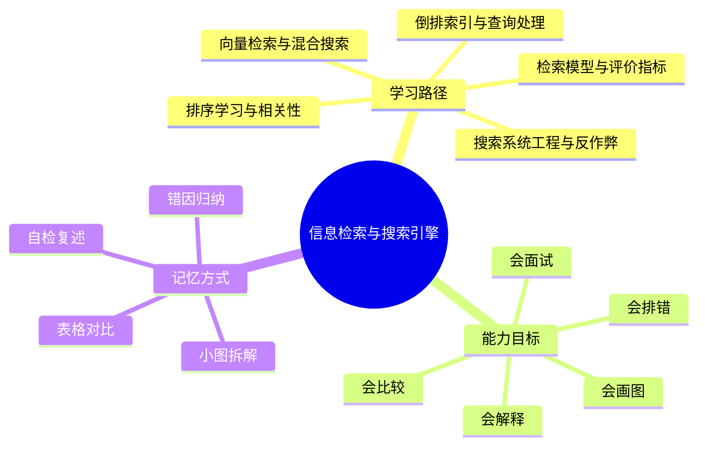
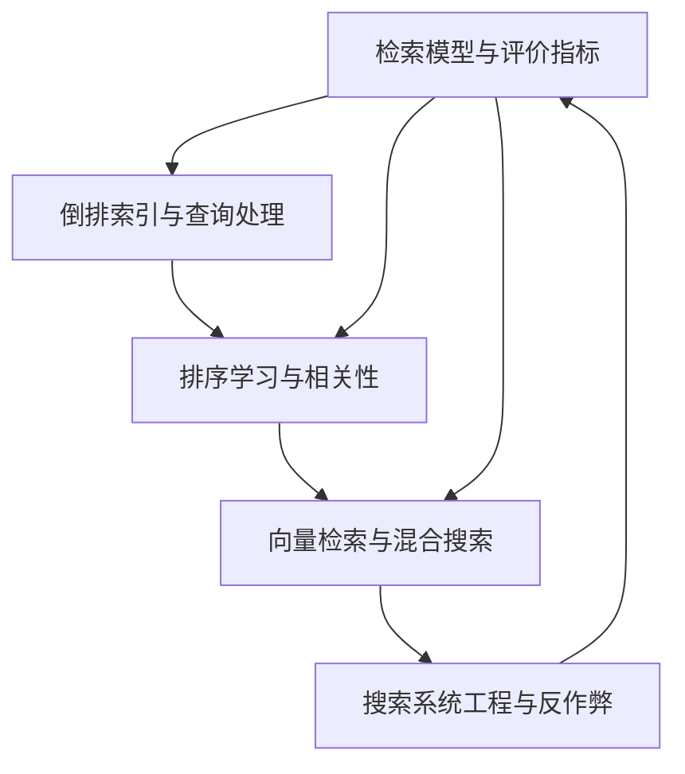
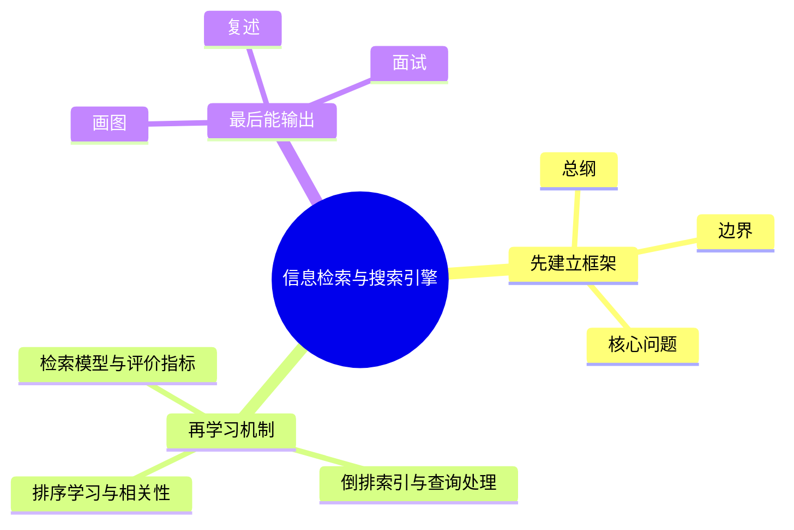

# 信息检索与搜索引擎学习路线与知识地图

## 学习目标
- 建立 信息检索与搜索引擎 的整体知识框架，并知道每章的输入、输出和适用边界。
- 明确每个章节解决什么问题、需要记住什么、如何用于工程、面试和排障。
- 通过小图、对比表、自检题把概念压缩成可复述的知识块，避免只会看不会讲。

## 一句话总纲
信息检索研究如何从大规模文档中找到与用户意图最相关的结果，现代搜索通常结合倒排索引、排序学习和向量检索。

## 记忆口诀
> 建索引快召回，算相关排好序，评指标看效果，混合检索补短板。

## 思维导图

## Mermaid 图解：学习路线

## 章节总览
| 顺序 | 文件 | 学习重点 | 关键能力 | 记忆抓手 |
|---|---|---|---|---|
| 第 1 章 | [[01-检索模型与评价指标]] | 理解布尔检索、向量空间、BM25、召回率、准确率和 NDCG。 | 解释为什么“相关”不等于“包含词”。 | 召回找全，排序找准，评价闭环 |
| 第 2 章 | [[02-倒排索引与查询处理]] | 掌握分词、倒排表、跳表、压缩、查询执行和索引更新。 | 说清搜索为什么能快。 | 词到文档，跳表加速，压缩省空间 |
| 第 3 章 | [[03-排序学习与相关性]] | 理解特征工程、Learning to Rank、点击偏差和相关性调优。 | 说清“相关性”如何被训练和校正。 | 召回给候选，排序定名次 |
| 第 4 章 | [[04-向量检索与混合搜索]] | 掌握 Embedding、ANN、RAG 检索和混合排序。 | 说清语义召回与词面召回如何互补。 | 词面保精确，向量补语义，融合稳效果 |
| 第 5 章 | [[05-搜索系统工程与反作弊]] | 理解分布式搜索、缓存、延迟优化、日志评估和反作弊。 | 说清搜索系统如何在成本、延迟和质量间取舍。 | 分布式扩展，缓存降延迟，日志促迭代 |
| 面试 | [[20-信息检索与搜索引擎面试20问]] | 高频问答、表达模板、易错点、场景化回答 | 能把概念讲成工程语言。 | Q-A-图-口诀 |

## 每章统一阅读法
1. 先看“一句话总纲”，确认本章在全局里解决什么问题。
2. 再看“思维导图”，建立树状记忆，不要直接背段落。
3. 继续看“分章节讲解”里的底层原则、适用场景和工程理解。
4. 最后看“关键对比表”和“常见误区”，把相近概念区分开。
5. 面试前只复述“定义 → 机制 → 场景 → 权衡 → 误区 → 自检题”。

## 章节层面的通用底层原则
- **先问题，后方法：** 先问系统要解决什么，再问它靠什么实现。
- **先召回，后排序：** 任何大规模搜索都要先保证候选覆盖，再谈精排质量。
- **先离线，后在线：** 评价先用指标和日志建立方向，再用实验验证是否真的变好。
- **先精确，后语义：** 词面匹配保证精确，语义检索负责补盲区，混合方案通常更稳。
- **先能用，后更快：** 先让系统正确，再做压缩、缓存、并行和近似优化。

## 工程落地方式
| 章节 | 工程里最常见的落地点 | 典型判断题 |
|---|---|---|
| 检索模型与评价指标 | 指标设计、召回阈值、排序目标定义 | 指标涨了为什么体验未必更好？ |
| 倒排索引与查询处理 | 索引构建、查询改写、短语查询、增量更新 | 为什么某些查询会慢？ |
| 排序学习与相关性 | 特征工程、样本构造、点击去偏、重排 | 为什么点击多不代表更相关？ |
| 向量检索与混合搜索 | Embedding 服务、ANN 索引、混合融合 | 为什么纯向量检索会漏结果？ |
| 搜索系统工程与反作弊 | 分片、缓存、实验平台、风控方案 | 为什么搜索越大越需要治理？ |

## 章节间的依赖关系

## 自检题
- 你能用 1 分钟说清 信息检索与搜索引擎 的核心问题吗？
- 你能指出每章最容易混淆的两个概念吗？
- 你能把章节图不看原文复画出来吗？
- 你能说出“离线指标、在线指标、工程约束”之间的关系吗？

## 速记卡片
- 总纲：信息检索研究如何从大规模文档中找到与用户意图最相关的结果，现代搜索通常结合倒排索引、排序学习和向量检索。
- 口诀：建索引快召回，算相关排好序，评指标看效果，混合检索补短板。
- 面试表达：先定义边界，再解释机制，最后讲权衡和误区。
- 工程表达：先保证正确，再优化延迟，最后治理规模和风险。

## 深度扩展：如何把本学科学到可迁移

### 1. 学科主线
通过索引、召回、排序和评估，从大规模内容中找到最符合用户意图的结果。

这意味着学习时不要把章节看成离散文件，而要形成一条稳定链路：**问题从哪里来 → 需要哪些抽象 → 底层机制如何保证结果 → 代价和风险在哪里 → 如何验证理解是否正确**。

### 2. 小思维导图：三阶段学习法

### 3. 分阶段学习重点
| 阶段 | 目标 | 学习动作 | 产出物 |
|---|---|---|---|
| 入门 | 建立全局地图 | 先读路线，再快速浏览每章思维导图 | 能说清本学科解决什么问题 |
| 理解 | 掌握机制和边界 | 对每章画流程图、列前提条件 | 能解释为什么这样设计 |
| 应用 | 做题或工程迁移 | 用案例检查概念是否能落地 | 能选择方案并说出权衡 |
| 面试 | 形成表达模板 | 按 Q-A-图-误区复述 | 能稳定回答 20 个核心问题 |

### 4. 章节之间的关系
- **第 1 层：检索模型与评价指标** —— 学习时要问：它承接了前一章什么问题，又为后一章提供什么工具？
- **第 2 层：倒排索引与查询处理** —— 学习时要问：它承接了前一章什么问题，又为后一章提供什么工具？
- **第 3 层：排序学习与相关性** —— 学习时要问：它承接了前一章什么问题，又为后一章提供什么工具？
- **第 4 层：向量检索与混合搜索** —— 学习时要问：它承接了前一章什么问题，又为后一章提供什么工具？
- **第 5 层：搜索系统工程与反作弊** —— 学习时要问：它承接了前一章什么问题，又为后一章提供什么工具？

### 5. 复习闭环
- **风险提醒：** 最大风险是只做关键词匹配，不区分召回、排序、相关性、点击偏差和向量语义边界。
- **实践抓手：** 搜索优化要拆成索引质量、召回覆盖、排序特征、评估指标和线上实验。
- **闭环方式：** 每学完一章，必须能完成“三件事”：复画图、讲反例、做迁移。

### 6. 总自检
1. 你能否不看目录，按依赖关系重新排列所有章节？
2. 你能否为每章说出一个工程场景或面试场景？
3. 你能否说明本学科与操作系统、网络、数据库、LLM 或后端工程的连接点？

## 专题深化：与其他学科的连接

- **本学科核心连接点：** 例如搜索“苹果手机电池”既要词面召回，也要理解同义词和意图，还要用排序模型处理时效、质量和点击偏差。
- **向上连接：** 可以支撑系统设计、工程实践、AI Agent 开发和面试表达。
- **向下连接：** 依赖数据结构、操作系统、计算机网络、数据库和数学基础中的概念。

### 学习产出标准
| 层次 | 能力表现 | 自检方式 |
|---|---|---|
| 记住 | 能说出核心名词 | 不看目录复述章节 |
| 理解 | 能画出机制图 | 给别人讲清流程 |
| 应用 | 能解决案例问题 | 用真实约束做方案选择 |
| 迁移 | 能跨学科解释 | 连接 OS/网络/数据库/LLM 场景 |
