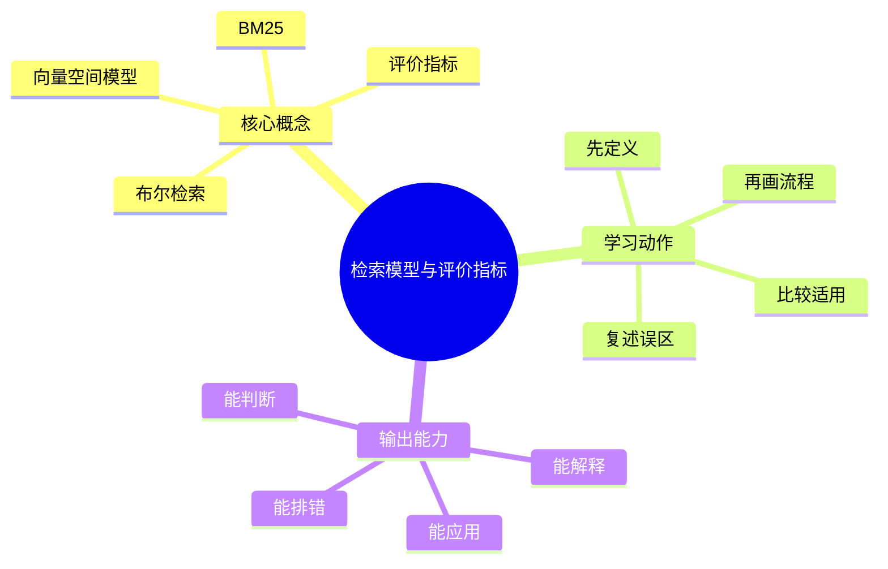

# 信息检索与搜索引擎：检索模型与评价指标

## 学习目标
- 理解布尔检索、向量空间、BM25、召回率、准确率和 NDCG。
- 能画出本章核心流程图，并能用自己的话解释每个节点。
- 能说出适用场景、边界条件、指标偏差和常见误区。

## 一句话总纲
搜索系统不是返回包含关键词的文档，而是按用户意图排序相关结果。

## 记忆口诀
> 召回找全，排序找准，评价闭环

## 思维导图

## Mermaid 图解：核心流程

## 底层原则
- **检索先召回、再区分：** 任何检索模型都先决定候选集合，再决定候选排序。
- **不同模型解决不同层次的问题：** 布尔检索解决“是否满足条件”，向量空间和 BM25 解决“谁更像查询”，评价指标解决“系统是否真的变好”。
- **离线与在线不是一回事：** 指标变化不等于用户体验变化，必须看是否存在位置偏差、样本偏差和数据漂移。
- **模型选择受目标约束：** 精确过滤、自然语言搜索、长尾召回、排序质量和解释性对模型的要求不同。

## 分章节讲解
### 1. 布尔检索
**核心定义：** 布尔检索用 AND、OR、NOT 组合词项，适合精确过滤和结构化条件。

**为什么它有价值：**
- 它的优势不是“智能”，而是“可控、可解释、结果边界清楚”。
- 在制度性约束、权限过滤、分类标签筛选等场景里，它比复杂模型更可靠。

**工程理解：**
- 如果查询表达清晰且约束明确，布尔检索可以直接把搜索空间收窄。
- 但当用户意图模糊时，布尔模型往往过于刚性，容易出现“查不到”而不是“排不准”。

**常见误区：** 布尔模型缺少自然相关性排序；用户表达不完整时召回较弱。

### 2. 向量空间模型
**核心定义：** 向量空间模型把文档和查询表示为词项权重向量，用余弦相似度衡量相关性。

**为什么它有价值：**
- 它把“相关”从纯布尔条件提升为连续相似度。
- 适合处理词频、词重要性和部分匹配问题。

**工程理解：**
- 词袋表示忽视词序和句法，但能换来很好的可计算性。
- 当文档很长或语义很复杂时，它往往只是一个可解释的起点，而不是终点。

**常见误区：** 词袋表示忽视词序和语义；高频常见词需要降权。

### 3. BM25
**核心定义：** BM25 基于词频、逆文档频率和文档长度归一，是传统文本检索强基线。

**为什么它有价值：**
- BM25 常常是文本检索系统里最强的“低成本默认方案”。
- 它对词面匹配、长文档惩罚和停用词处理都有较稳定的表现。

**工程理解：**
- BM25 常被当作召回层或初排层的基线，不是因为它先进，而是因为它稳定、快、可解释。
- 它特别适合与向量召回结合，形成“关键词 + 语义”的混合路径。

**常见误区：** BM25 主要处理词面匹配，不能充分理解同义改写。

### 4. 评价指标
**核心定义：** Precision、Recall、MRR、MAP、NDCG 分别衡量准确、覆盖、首个正确结果和排序质量。

**为什么它有价值：**
- 指标把“感觉变好”转成“可以比较的数字”。
- 没有指标，搜索迭代只能靠主观判断。

**工程理解：**
- Recall 关注找全，Precision 关注找准，NDCG 关注排序位置的重要性。
- MRR 适合关注首个正确结果的场景，MAP 适合多个相关结果的整体排序。
- 指标之间经常冲突，不能只盯一个数。

**常见误区：** 只看点击率会受位置偏差影响；离线指标和线上指标要结合。

## 关键对比表
| 知识点 | 正确理解 | 适用场景 | 常见误区 |
|---|---|---|---|
| 布尔检索 | 用 AND、OR、NOT 组合词项，适合精确过滤和结构化条件。 | 权限过滤、标签筛选、规范查询。 | 以为它能替代排序模型。 |
| 向量空间模型 | 用词项权重向量和余弦相似度表示相关性。 | 词面相关、解释性要求较高的系统。 | 以为词袋模型能理解真正语义。 |
| BM25 | 结合词频、IDF 和文档长度归一的强基线。 | 文本召回、初排基线、混合检索。 | 以为它天然理解同义词和改写。 |
| 评价指标 | 用指标把离线效果变成可比较的量化结果。 | 模型比较、A/B 前评估、方案回归。 | 以为单一指标足够代表用户体验。 |

## 场景判断
- **明确条件过滤：** 优先考虑布尔检索。
- **词面匹配但要考虑权重：** 向量空间模型和 BM25 更合适。
- **需要检验系统变化是否更好：** 先定义离线指标，再设计在线实验。
- **既想要精确又想要召回：** 需要把检索模型和排序模型分层看待。

## 指标对照表
| 指标 | 关注点 | 更适合回答的问题 | 常见盲点 |
|---|---|---|---|
| Precision | 结果有多少是对的 | 返回的结果“准不准” | 不关心有没有漏掉相关结果。 |
| Recall | 相关结果找回了多少 | 系统“找全了吗” | 可能不管排序前后。 |
| MRR | 第一个正确结果出现得多靠前 | 用户很快能不能看到正确答案 | 只看首个命中，忽视后续结果。 |
| MAP | 多个查询下整体相关结果排序情况 | 批量效果是否稳定 | 不反映单个结果的重要位置。 |
| NDCG | 相关结果的排序位置和等级 | 相关性等级越高是否排得越前 | 需要更明确的标注等级。 |

## 常见误区总结
- **布尔检索：** 布尔模型缺少自然相关性排序；用户表达不完整时召回较弱。
- **向量空间模型：** 词袋表示忽视词序和语义；高频常见词需要降权。
- **BM25：** BM25 主要处理词面匹配，不能充分理解同义改写。
- **评价指标：** 只看点击率会受位置偏差影响；离线指标和线上指标要结合。

## 自检题
1. 本章的核心问题是什么？请用一句话回答：搜索系统不是返回包含关键词的文档，而是按用户意图排序相关结果。
2. 本章每个概念的适用前提分别是什么？
3. 你能区分 Precision、Recall、MRR 和 NDCG 各自关注的对象吗？
4. 哪个误区最容易在面试或工程实践中出现？为什么？

## 速记卡片
- 章节口诀：召回找全，排序找准，评价闭环
- 答题结构：定义 → 机制 → 场景 → 权衡 → 误区。
- 复习动作：遮住正文，只根据思维导图复述一遍。

## 深度扩展：底层原理与应用边界

### 1. 本章在「信息检索与搜索引擎」中的位置
- **核心定位：** 通过索引、召回、排序和评估，从大规模内容中找到最符合用户意图的结果。
- **本章作用：** 「信息检索与搜索引擎：检索模型与评价指标」负责把总纲落到可操作的判断框架：先确认问题边界，再拆解机制，最后根据代价和风险选择方法。
- **主要风险：** 最大风险是只做关键词匹配，不区分召回、排序、相关性、点击偏差和向量语义边界。
- **实践抓手：** 搜索优化要拆成索引质量、召回覆盖、排序特征、评估指标和线上实验。

### 2. 小流程图：从概念到应用

### 3. 概念深化：逐个击破
#### 3.1 布尔检索
- **先问它解决什么：** 布尔检索 不是孤立名词，而是用来解决本章某类约束、关系、代价或风险判断的问题。
- **底层机制：** 学习时要拆成“输入条件 → 中间结构 → 处理规则 → 输出结果”四步；如果任何一步说不清，说明只是记住了结论。
- **适用条件：** 当前提满足、边界清楚、代价可接受时使用；如果输入分布、规模、时序、权限或一致性假设变化，就要重新评估。
- **不适用信号：** 需要违反前提才能套用、只能靠特殊样例解释、复杂度或维护成本明显失控时，应换方案。
- **面试表达：** “我会先定义 布尔检索，再说明它依赖的前提，最后用一个反例说明边界。”

#### 3.2 向量空间模型
- **先问它解决什么：** 向量空间模型 不是孤立名词，而是用来解决本章某类约束、关系、代价或风险判断的问题。
- **底层机制：** 学习时要拆成“输入条件 → 中间结构 → 处理规则 → 输出结果”四步；如果任何一步说不清，说明只是记住了结论。
- **适用条件：** 当前提满足、边界清楚、代价可接受时使用；如果输入分布、规模、时序、权限或一致性假设变化，就要重新评估。
- **不适用信号：** 需要违反前提才能套用、只能靠特殊样例解释、复杂度或维护成本明显失控时，应换方案。
- **面试表达：** “我会先定义 向量空间模型，再说明它依赖的前提，最后用一个反例说明边界。”

#### 3.3 BM25
- **先问它解决什么：** BM25 不是孤立名词，而是用来解决本章某类约束、关系、代价或风险判断的问题。
- **底层机制：** 学习时要拆成“输入条件 → 中间结构 → 处理规则 → 输出结果”四步；如果任何一步说不清，说明只是记住了结论。
- **适用条件：** 当前提满足、边界清楚、代价可接受时使用；如果输入分布、规模、时序、权限或一致性假设变化，就要重新评估。
- **不适用信号：** 需要违反前提才能套用、只能靠特殊样例解释、复杂度或维护成本明显失控时，应换方案。
- **面试表达：** “我会先定义 BM25，再说明它依赖的前提，最后用一个反例说明边界。”

#### 3.4 评价指标
- **先问它解决什么：** 评价指标 不是孤立名词，而是用来解决本章某类约束、关系、代价或风险判断的问题。
- **底层机制：** 学习时要拆成“输入条件 → 中间结构 → 处理规则 → 输出结果”四步；如果任何一步说不清，说明只是记住了结论。
- **适用条件：** 当前提满足、边界清楚、代价可接受时使用；如果输入分布、规模、时序、权限或一致性假设变化，就要重新评估。
- **不适用信号：** 需要违反前提才能套用、只能靠特殊样例解释、复杂度或维护成本明显失控时，应换方案。
- **面试表达：** “我会先定义 评价指标，再说明它依赖的前提，最后用一个反例说明边界。”

### 4. 适用边界对比表
| 判断维度 | 应该怎么想 | 典型错误 | 记忆提示 |
|---|---|---|---|
| 前提条件 | 先列出输入规模、数据分布、系统假设或业务约束 | 不看条件直接套模板 | 先问“凭什么能用” |
| 正确性 | 需要能说明为什么结果保持不变或为什么局部选择成立 | 只给经验结论 | 用不变量、反例或交换论证检查 |
| 复杂度/成本 | 同时估算时间、空间、延迟、吞吐、人力和维护成本 | 只看理论最优 | 工程里还要看常数和可观测性 |
| 失败模式 | 主动说明边界外会怎样失败 | 面试中只讲优点 | 能说失败边界才算真理解 |

### 5. 记忆强化：三层复述法
1. **概念层：** 用一句话定义本章每个核心概念。
2. **机制层：** 不看原文画出输入到输出的流程。
3. **边界层：** 为每个概念准备一个“不能这样用”的反例。

### 6. 工程/做题/面试迁移
- **工程迁移：** 搜索优化要拆成索引质量、召回覆盖、排序特征、评估指标和线上实验。
- **做题迁移：** 先把题目中的对象、关系、约束和目标函数圈出来，再映射到本章概念。
- **面试迁移：** 回答时不要只报名词，要说清“为什么需要它、它如何工作、它何时失效”。

### 7. 深度自检题
1. 你能否把本章概念按“前提 → 机制 → 结果 → 代价”重新组织？
2. 如果输入规模、并发量、数据分布或安全边界变化，原结论是否仍成立？
3. 本章哪个概念最容易被误用？请给出一个反例。
4. 如果让你设计一道面试题，你会怎样考察候选人是否真的理解？

### 8. 深度速记卡片
- **总抓手：** 通过索引、召回、排序和评估，从大规模内容中找到最符合用户意图的结果。
- **答题模板：** 定义边界 → 拆底层机制 → 说适用条件 → 讲权衡 → 给反例。
- **复习动作：** 每次复习只看图和表，尝试口述 3 分钟；卡住处再回正文。

## 专题深化：具体机制、案例与追问

### 1. 具体案例：把「检索模型与评价指标」放进真实问题
例如搜索“苹果手机电池”既要词面召回，也要理解同义词和意图，还要用排序模型处理时效、质量和点击偏差。

### 2. 本章关键机制细化
- BM25 是词面匹配强基线，向量模型补语义。
- Precision、Recall、MRR、NDCG 关注不同质量维度。
- 指标必须匹配用户意图和业务目标。

### 3. 概念到判断的检查清单
| 概念/动作 | 你要检查什么 | 如果检查失败会怎样 |
|---|---|---|
| 布尔检索 | 前提、输入、输出、代价、失败边界是否都说清 | 可能套错模型、复杂度失控或得到不可验证结论 |
| 向量空间模型 | 前提、输入、输出、代价、失败边界是否都说清 | 可能套错模型、复杂度失控或得到不可验证结论 |
| BM25 | 前提、输入、输出、代价、失败边界是否都说清 | 可能套错模型、复杂度失控或得到不可验证结论 |
| 评价指标 | 前提、输入、输出、代价、失败边界是否都说清 | 可能套错模型、复杂度失控或得到不可验证结论 |
| 本章在「信息检索与搜索引擎」中的位置 | 前提、输入、输出、代价、失败边界是否都说清 | 可能套错模型、复杂度失控或得到不可验证结论 |

### 4. 面试追问路径

- 召回不全还是排序不准？
- 评价指标是否匹配用户体验？
- 点击数据是否有位置偏差？

### 5. 验证与复盘
- **验证方式：** 用离线标注集、NDCG/MRR、人工评测、A/B 实验和失败查询分析验证。
- **复盘方式：** 每次做题或设计后，记录“我使用了哪个前提、哪个前提最容易被破坏、如果破坏如何调整”。
- **记忆方式：** 不背孤立结论，只背“问题 → 机制 → 边界 → 验证”的链路。
