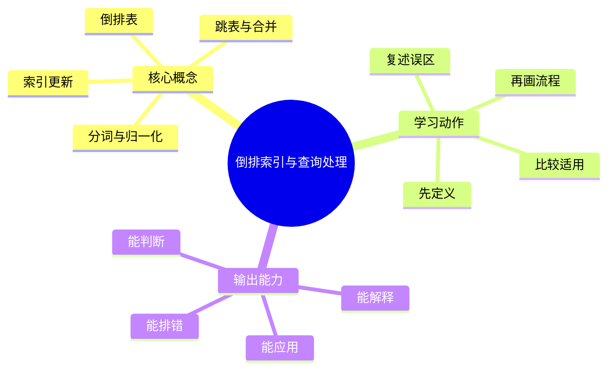
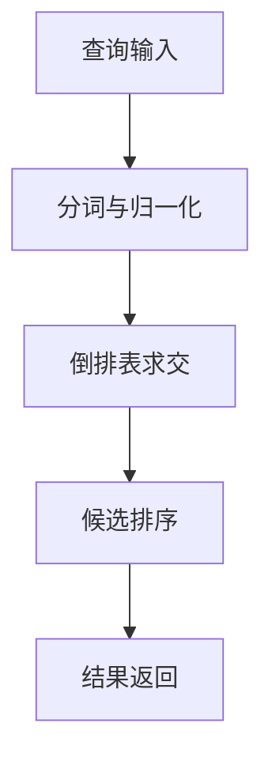

# 信息检索与搜索引擎：倒排索引与查询处理

## 学习目标
- 掌握分词、倒排表、跳表、压缩、查询执行和索引更新。
- 能画出本章核心流程图，并能用自己的话解释每个节点。
- 能说出适用场景、边界条件、性能瓶颈和常见误区。

## 一句话总纲
倒排索引用词到文档列表的映射换取快速召回。

## 记忆口诀
> 词到文档，跳表加速，压缩省空间

## 思维导图

## Mermaid 图解：核心流程

## 底层原则
- **核心是反向映射：** 正向索引是“文档包含哪些词”，倒排索引是“词出现在哪些文档”。搜索快，主要快在这一步。
- **查询速度和索引成本互相制约：** 预计算越多，查询越快；但写入、存储和合并成本会更高。
- **位置和频次决定可用性：** 如果只保存文档 ID，很多高级查询和排序特征无法支持。
- **更新不是附属问题：** 搜索系统不是静态书库，索引更新、近实时刷新和段合并直接决定可用性。

## 分章节讲解
### 1. 分词与归一化
**核心定义：** 分词、大小写归一、词干化、停用词处理会影响召回和精确度。

**工程理解：**
- 分词不是前处理小步骤，而是索引结构是否可用的前置条件。
- 中文搜索里，分词错误会直接影响召回；英文搜索里，词形变化会影响匹配质量。
- 归一化目标不是“全部变一样”，而是“把对用户无意义的表面差异压掉”。

**适用场景：**
- 需要提升召回一致性。
- 需要支持跨词形、大小写和常见拼写变化。
- 需要将规范化后的词项作为索引键。

**常见误区：** 过度归一化会把不同含义混在一起；中文分词错误会直接影响召回。

### 2. 倒排表
**核心定义：** 倒排表记录每个词出现在哪些文档以及位置、频次等信息。

**工程理解：**
- 倒排表不仅是“文档列表”，更是后续排序、短语查询和字段权重计算的基础数据。
- 位置、频次、文档 ID 顺序和字段信息都可能影响查询执行效率。
- 倒排表的设计，本质上是在存储空间和查询能力之间做平衡。

**适用场景：**
- 关键词搜索。
- 短语查询和邻近查询。
- 基于词频、位置和字段的排序特征构建。

**常见误区：** 只存文档 ID 无法支持短语查询和高质量排序。

### 3. 跳表与合并
**核心定义：** 跳表帮助快速跳过不可能匹配的文档，提升多词查询的倒排表求交效率。

**工程理解：**
- 求交是查询处理里的高频动作，跳表、skip pointer、块级统计都是为了减少无效扫描。
- 当一个词很热、另一个词很冷时，查询计划应尽量先处理短列表。
- 合并方案决定了系统是在写时更重，还是在读时更重。

**适用场景：**
- 多词 AND 查询。
- 需要降低长倒排表扫描成本的场景。
- 大量词项共现时的快速过滤。

**常见误区：** 跳跃间隔选择不当会收益有限；高频词仍可能成为瓶颈。

### 4. 索引更新
**核心定义：** 索引更新可采用增量段、合并方案和近实时刷新平衡写入和查询性能。

**工程理解：**
- 索引更新通常分成“写入缓冲、生成小段、后台合并、刷新可见”几个阶段。
- 近实时搜索通常允许短暂延迟，但需要明确延迟上限和可见性语义。
- 更新方案影响“数据新鲜度、索引碎片、写放大和查询时延”。

**适用场景：**
- 内容持续写入。
- 需要分钟级甚至秒级可见性。
- 搜索系统要兼顾实时性和吞吐。

**常见误区：** 频繁全量重建成本高；近实时搜索存在刷新延迟。

## 关键对比表
| 知识点 | 正确理解 | 适用场景 | 常见误区 |
|---|---|---|---|
| 分词与归一化 | 归一化是把无意义表面差异压掉，不是把所有词变一样。 | 提升召回一致性、支持词形变化。 | 过度归一化会损伤语义区分。 |
| 倒排表 | 倒排表记录词到文档的反向映射，还可带位置和频次。 | 关键词搜索、短语查询、排序特征。 | 只存文档 ID 会丢掉能力。 |
| 跳表与合并 | 跳表和合并是为了减少无效扫描、加速求交。 | 多词查询、长列表求交。 | 以为跳表能彻底解决高频词问题。 |
| 索引更新 | 增量段和后台合并让系统兼顾吞吐和可见性。 | 持续写入、近实时搜索。 | 以为搜索索引只能全量重建。 |

## 查询处理视角

## 性能与成本对照表
| 设计选择 | 优点 | 代价 | 常见判断 |
|---|---|---|---|
| 更多预计算 | 查询更快 | 写入更重、存储更大 | 读多写少时常见。 |
| 更强压缩 | 存储更省 | 解压开销增加 | 容量敏感但延迟可接受时使用。 |
| 更多跳跃信息 | 求交更快 | 索引更复杂 | 长列表和多词查询更有价值。 |
| 更频繁刷新 | 数据更新 | 合并与抖动更明显 | 实时性强的内容场景常用。 |

## 常见误区总结
- **分词与归一化：** 过度归一化会把不同含义混在一起；中文分词错误会直接影响召回。
- **倒排表：** 只存文档 ID 无法支持短语查询和高质量排序。
- **跳表与合并：** 跳跃间隔选择不当会收益有限；高频词仍可能成为瓶颈。
- **索引更新：** 频繁全量重建成本高；近实时搜索存在刷新延迟。

## 自检题
1. 本章的核心问题是什么？请用一句话回答：倒排索引用词到文档列表的映射换取快速召回。
2. 为什么倒排索引比正向逐文档扫描更适合搜索？
3. 本章每个概念的适用前提分别是什么？
4. 哪个误区最容易在面试或工程实践中出现？为什么？

## 速记卡片
- 章节口诀：词到文档，跳表加速，压缩省空间
- 答题结构：定义 → 机制 → 场景 → 权衡 → 误区。
- 复习动作：遮住正文，只根据思维导图复述一遍。

## 深度扩展：底层原理与应用边界

### 1. 本章在「信息检索与搜索引擎」中的位置
- **核心定位：** 通过索引、召回、排序和评估，从大规模内容中找到最符合用户意图的结果。
- **本章作用：** 「信息检索与搜索引擎：倒排索引与查询处理」负责把总纲落到可操作的判断框架：先确认问题边界，再拆解机制，最后根据代价和风险选择方法。
- **主要风险：** 最大风险是只做关键词匹配，不区分召回、排序、相关性、点击偏差和向量语义边界。
- **实践抓手：** 搜索优化要拆成索引质量、召回覆盖、排序特征、评估指标和线上实验。

### 2. 小流程图：从概念到应用

### 3. 概念深化：逐个击破
#### 3.1 分词与归一化
- **先问它解决什么：** 分词与归一化 不是孤立名词，而是用来解决本章某类约束、关系、代价或风险判断的问题。
- **底层机制：** 学习时要拆成“输入条件 → 中间结构 → 处理规则 → 输出结果”四步；如果任何一步说不清，说明只是记住了结论。
- **适用条件：** 当前提满足、边界清楚、代价可接受时使用；如果输入分布、规模、时序、权限或一致性假设变化，就要重新评估。
- **不适用信号：** 需要违反前提才能套用、只能靠特殊样例解释、复杂度或维护成本明显失控时，应换方案。
- **面试表达：** “我会先定义 分词与归一化，再说明它依赖的前提，最后用一个反例说明边界。”

#### 3.2 倒排表
- **先问它解决什么：** 倒排表 不是孤立名词，而是用来解决本章某类约束、关系、代价或风险判断的问题。
- **底层机制：** 学习时要拆成“输入条件 → 中间结构 → 处理规则 → 输出结果”四步；如果任何一步说不清，说明只是记住了结论。
- **适用条件：** 当前提满足、边界清楚、代价可接受时使用；如果输入分布、规模、时序、权限或一致性假设变化，就要重新评估。
- **不适用信号：** 需要违反前提才能套用、只能靠特殊样例解释、复杂度或维护成本明显失控时，应换方案。
- **面试表达：** “我会先定义 倒排表，再说明它依赖的前提，最后用一个反例说明边界。”

#### 3.3 跳表与合并
- **先问它解决什么：** 跳表与合并 不是孤立名词，而是用来解决本章某类约束、关系、代价或风险判断的问题。
- **底层机制：** 学习时要拆成“输入条件 → 中间结构 → 处理规则 → 输出结果”四步；如果任何一步说不清，说明只是记住了结论。
- **适用条件：** 当前提满足、边界清楚、代价可接受时使用；如果输入分布、规模、时序、权限或一致性假设变化，就要重新评估。
- **不适用信号：** 需要违反前提才能套用、只能靠特殊样例解释、复杂度或维护成本明显失控时，应换方案。
- **面试表达：** “我会先定义 跳表与合并，再说明它依赖的前提，最后用一个反例说明边界。”

#### 3.4 索引更新
- **先问它解决什么：** 索引更新 不是孤立名词，而是用来解决本章某类约束、关系、代价或风险判断的问题。
- **底层机制：** 学习时要拆成“输入条件 → 中间结构 → 处理规则 → 输出结果”四步；如果任何一步说不清，说明只是记住了结论。
- **适用条件：** 当前提满足、边界清楚、代价可接受时使用；如果输入分布、规模、时序、权限或一致性假设变化，就要重新评估。
- **不适用信号：** 需要违反前提才能套用、只能靠特殊样例解释、复杂度或维护成本明显失控时，应换方案。
- **面试表达：** “我会先定义 索引更新，再说明它依赖的前提，最后用一个反例说明边界。”

### 4. 适用边界对比表
| 判断维度 | 应该怎么想 | 典型错误 | 记忆提示 |
|---|---|---|---|
| 前提条件 | 先列出输入规模、数据分布、系统假设或业务约束 | 不看条件直接套模板 | 先问“凭什么能用” |
| 正确性 | 需要能说明为什么结果保持不变或为什么局部选择成立 | 只给经验结论 | 用不变量、反例或交换论证检查 |
| 复杂度/成本 | 同时估算时间、空间、延迟、吞吐、人力和维护成本 | 只看理论最优 | 工程里还要看常数和可观测性 |
| 失败模式 | 主动说明边界外会怎样失败 | 面试中只讲优点 | 能说失败边界才算真理解 |

### 5. 记忆强化：三层复述法
1. **概念层：** 用一句话定义本章每个核心概念。
2. **机制层：** 不看原文画出输入到输出的流程。
3. **边界层：** 为每个概念准备一个“不能这样用”的反例。

### 6. 工程/做题/面试迁移
- **工程迁移：** 搜索优化要拆成索引质量、召回覆盖、排序特征、评估指标和线上实验。
- **做题迁移：** 先把题目中的对象、关系、约束和目标函数圈出来，再映射到本章概念。
- **面试迁移：** 回答时不要只报名词，要说清“为什么需要它、它如何工作、它何时失效”。

### 7. 深度自检题
1. 你能否把本章概念按“前提 → 机制 → 结果 → 代价”重新组织？
2. 如果输入规模、并发量、数据分布或安全边界变化，原结论是否仍成立？
3. 本章哪个概念最容易被误用？请给出一个反例。
4. 如果让你设计一道面试题，你会怎样考察候选人是否真的理解？

### 8. 深度速记卡片
- **总抓手：** 通过索引、召回、排序和评估，从大规模内容中找到最符合用户意图的结果。
- **答题模板：** 定义边界 → 拆底层机制 → 说适用条件 → 讲权衡 → 给反例。
- **复习动作：** 每次复习只看图和表，尝试口述 3 分钟；卡住处再回正文。

## 专题深化：具体机制、案例与追问

### 1. 具体案例：把「倒排索引与查询处理」放进真实问题
例如搜索“苹果手机电池”既要词面召回，也要理解同义词和意图，还要用排序模型处理时效、质量和点击偏差。

### 2. 本章关键机制细化
- 倒排表把词映射到文档列表，是快速召回的核心。
- 位置信息支持短语查询和更精细排序。
- 段合并平衡写入吞吐和查询效率。

### 3. 概念到判断的检查清单
| 概念/动作 | 你要检查什么 | 如果检查失败会怎样 |
|---|---|---|
| 分词与归一化 | 前提、输入、输出、代价、失败边界是否都说清 | 可能套错模型、复杂度失控或得到不可验证结论 |
| 倒排表 | 前提、输入、输出、代价、失败边界是否都说清 | 可能套错模型、复杂度失控或得到不可验证结论 |
| 跳表与合并 | 前提、输入、输出、代价、失败边界是否都说清 | 可能套错模型、复杂度失控或得到不可验证结论 |
| 索引更新 | 前提、输入、输出、代价、失败边界是否都说清 | 可能套错模型、复杂度失控或得到不可验证结论 |
| 本章在「信息检索与搜索引擎」中的位置 | 前提、输入、输出、代价、失败边界是否都说清 | 可能套错模型、复杂度失控或得到不可验证结论 |

### 4. 面试追问路径

- 召回不全还是排序不准？
- 评价指标是否匹配用户体验？
- 点击数据是否有位置偏差？

### 5. 验证与复盘
- **验证方式：** 用离线标注集、NDCG/MRR、人工评测、A/B 实验和失败查询分析验证。
- **复盘方式：** 每次做题或设计后，记录“我使用了哪个前提、哪个前提最容易被破坏、如果破坏如何调整”。
- **记忆方式：** 不背孤立结论，只背“问题 → 机制 → 边界 → 验证”的链路。
