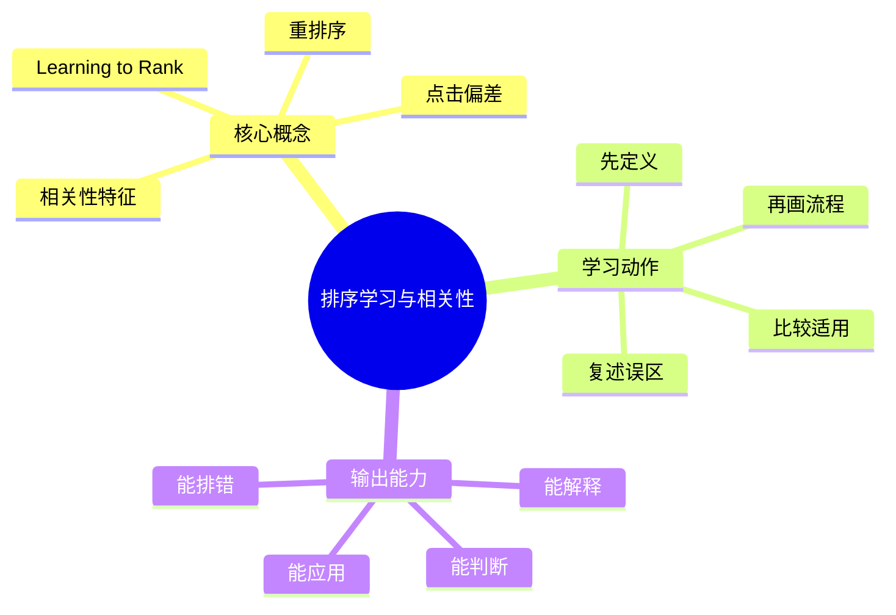
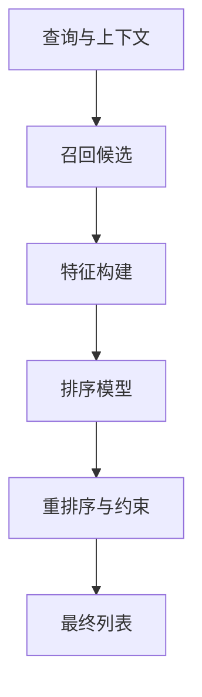

# 信息检索与搜索引擎：排序学习与相关性

## 学习目标
- 理解特征工程、Learning to Rank、点击偏差和相关性调优。
- 能画出本章核心流程图，并能用自己的话解释每个节点。
- 能说出适用场景、边界条件、训练偏差和常见误区。

## 一句话总纲
排序把召回候选按相关性、质量和业务约束重新排列。

## 记忆口诀
> 召回给候选，排序定名次

## 思维导图

## Mermaid 图解：核心流程

## 底层原则
- **排序不是召回的替代品：** 没有足够好的候选，再强的排序也无能为力。
- **相关性不是单一分数：** 文本匹配、质量、时效、用户行为、商业约束常常同时存在。
- **训练目标必须与产品目标对齐：** 训练一个“更像点击”的模型，不等于训练一个“更相关”的模型。
- **反馈数据天然有偏：** 排名位置、曝光机会和界面设计会影响点击，不能把点击当成纯真值。

## 分章节讲解
### 1. 相关性特征
**核心定义：** 相关性特征包括文本匹配、字段权重、文档质量、时效性、用户行为和个性化信号。

**工程理解：**
- 相关性特征可以看成排序模型的“证据”。
- 证据越多，模型越有机会区分候选；但特征越多，也越容易引入噪声和泄漏。
- 特征设计的第一原则是“可获得、可解释、可稳定复用”。

**常见误区：** 把业务转化率直接当相关性可能牺牲用户意图。

### 2. Learning to Rank
**核心定义：** 排序学习用人工标注或行为数据训练模型，常见思路有 pointwise、pairwise、listwise。

**工程理解：**
- Pointwise 更像做回归/分类，简单直接。
- Pairwise 更关注两个结果谁更好，适合相对排序。
- Listwise 更贴近整页排序，但训练和优化更复杂。

**适用场景：**
- 有稳定训练样本和标注体系时。
- 需要把多种特征统一到一个排序分数时。
- 召回候选已经比较靠谱，主要瓶颈在精排时。

**常见误区：** 训练数据有偏会导致模型放大偏见；点击不等于真实相关。

### 3. 重排序
**核心定义：** 重排序在初排结果上使用更复杂模型或规则，兼顾质量、多样性和约束。

**工程理解：**
- 重排序常放在延迟预算更宽的环节，因为它处理的是更小的候选集。
- 它经常承担业务规则注入、多样性控制、去重复和安全过滤的职责。
- 很多系统里，重排不是“纯模型”，而是“模型 + 规则 + 约束”的组合体。

**常见误区：** 重排候选太少会错失好结果，太多会增加延迟。

### 4. 点击偏差
**核心定义：** 用户点击受位置、摘要、品牌和界面影响，需要去偏或实验设计校正。

**工程理解：**
- 点击偏差最常见的来源是位置偏差：排在前面的更容易被点。
- 还要区分“看见了但没点”和“没看到”。
- 训练前常需要做曝光建模、逆倾向加权或人工标注校正。

**常见误区：** 直接用点击数训练会偏向原本排在前面的结果。

## 排序链路视角

## 关键对比表
| 知识点 | 正确理解 | 适用场景 | 常见误区 |
|---|---|---|---|
| 相关性特征 | 相关性是多信号综合判断，不是单一文本匹配。 | 特征工程、质量建模、个性化排序。 | 以业务转化率替代相关性。 |
| Learning to Rank | 用数据学习“谁更该排前面”。 | 已有高质量候选，需要精排。 | 只关注训练损失，忽视线上目标。 |
| 重排序 | 在小候选集上做更强判断和约束控制。 | 延迟允许、需多样性或强规则时。 | 候选太少或太多都不合适。 |
| 点击偏差 | 点击受曝光位置和界面影响，不能直接等于相关性。 | 样本构造、去偏、评估校正。 | 把点击当作天然真值。 |

## 指标和目标对照表
| 目标 | 更该关注什么 | 常见风险 |
|---|---|---|
| 提升用户满意度 | 真实相关性、结果可解释性、多样性 | 只追点击，忽视长期体验。 |
| 提升转化 | 任务完成率、结果质量、后续行为 | 牺牲广义相关性。 |
| 提升排序稳定性 | 样本一致性、特征漂移、模型鲁棒性 | 线上线下不一致。 |
| 控制延迟 | 候选规模、模型复杂度、重排序开销 | 分数提升但响应变慢。 |

## 常见误区总结
- **相关性特征：** 把业务转化率直接当相关性可能牺牲用户意图。
- **Learning to Rank：** 训练数据有偏会导致模型放大偏见；点击不等于真实相关。
- **重排序：** 重排候选太少会错失好结果，太多会增加延迟。
- **点击偏差：** 直接用点击数训练会偏向原本排在前面的结果。

## 自检题
1. 本章的核心问题是什么？请用一句话回答：排序把召回候选按相关性、质量和业务约束重新排列。
2. 为什么“点击多”不能直接等于“更相关”？
3. pointwise、pairwise、listwise 各自更像什么问题？
4. 哪个误区最容易在面试或工程实践中出现？为什么？

## 速记卡片
- 章节口诀：召回给候选，排序定名次
- 答题结构：定义 → 机制 → 场景 → 权衡 → 误区。
- 复习动作：遮住正文，只根据思维导图复述一遍。

## 深度扩展：底层原理与应用边界

### 1. 本章在「信息检索与搜索引擎」中的位置
- **核心定位：** 通过索引、召回、排序和评估，从大规模内容中找到最符合用户意图的结果。
- **本章作用：** 「信息检索与搜索引擎：排序学习与相关性」负责把总纲落到可操作的判断框架：先确认问题边界，再拆解机制，最后根据代价和风险选择方法。
- **主要风险：** 最大风险是只做关键词匹配，不区分召回、排序、相关性、点击偏差和向量语义边界。
- **实践抓手：** 搜索优化要拆成索引质量、召回覆盖、排序特征、评估指标和线上实验。

### 2. 小流程图：从概念到应用

### 3. 概念深化：逐个击破
#### 3.1 相关性特征
- **先问它解决什么：** 相关性特征 不是孤立名词，而是用来解决本章某类约束、关系、代价或风险判断的问题。
- **底层机制：** 学习时要拆成“输入条件 → 中间结构 → 处理规则 → 输出结果”四步；如果任何一步说不清，说明只是记住了结论。
- **适用条件：** 当前提满足、边界清楚、代价可接受时使用；如果输入分布、规模、时序、权限或一致性假设变化，就要重新评估。
- **不适用信号：** 需要违反前提才能套用、只能靠特殊样例解释、复杂度或维护成本明显失控时，应换方案。
- **面试表达：** “我会先定义 相关性特征，再说明它依赖的前提，最后用一个反例说明边界。”

#### 3.2 Learning to Rank
- **先问它解决什么：** Learning to Rank 不是孤立名词，而是用来解决本章某类约束、关系、代价或风险判断的问题。
- **底层机制：** 学习时要拆成“输入条件 → 中间结构 → 处理规则 → 输出结果”四步；如果任何一步说不清，说明只是记住了结论。
- **适用条件：** 当前提满足、边界清楚、代价可接受时使用；如果输入分布、规模、时序、权限或一致性假设变化，就要重新评估。
- **不适用信号：** 需要违反前提才能套用、只能靠特殊样例解释、复杂度或维护成本明显失控时，应换方案。
- **面试表达：** “我会先定义 Learning to Rank，再说明它依赖的前提，最后用一个反例说明边界。”

#### 3.3 重排序
- **先问它解决什么：** 重排序 不是孤立名词，而是用来解决本章某类约束、关系、代价或风险判断的问题。
- **底层机制：** 学习时要拆成“输入条件 → 中间结构 → 处理规则 → 输出结果”四步；如果任何一步说不清，说明只是记住了结论。
- **适用条件：** 当前提满足、边界清楚、代价可接受时使用；如果输入分布、规模、时序、权限或一致性假设变化，就要重新评估。
- **不适用信号：** 需要违反前提才能套用、只能靠特殊样例解释、复杂度或维护成本明显失控时，应换方案。
- **面试表达：** “我会先定义 重排序，再说明它依赖的前提，最后用一个反例说明边界。”

#### 3.4 点击偏差
- **先问它解决什么：** 点击偏差 不是孤立名词，而是用来解决本章某类约束、关系、代价或风险判断的问题。
- **底层机制：** 学习时要拆成“输入条件 → 中间结构 → 处理规则 → 输出结果”四步；如果任何一步说不清，说明只是记住了结论。
- **适用条件：** 当前提满足、边界清楚、代价可接受时使用；如果输入分布、规模、时序、权限或一致性假设变化，就要重新评估。
- **不适用信号：** 需要违反前提才能套用、只能靠特殊样例解释、复杂度或维护成本明显失控时，应换方案。
- **面试表达：** “我会先定义 点击偏差，再说明它依赖的前提，最后用一个反例说明边界。”

### 4. 适用边界对比表
| 判断维度 | 应该怎么想 | 典型错误 | 记忆提示 |
|---|---|---|---|
| 前提条件 | 先列出输入规模、数据分布、系统假设或业务约束 | 不看条件直接套模板 | 先问“凭什么能用” |
| 正确性 | 需要能说明为什么结果保持不变或为什么局部选择成立 | 只给经验结论 | 用不变量、反例或交换论证检查 |
| 复杂度/成本 | 同时估算时间、空间、延迟、吞吐、人力和维护成本 | 只看理论最优 | 工程里还要看常数和可观测性 |
| 失败模式 | 主动说明边界外会怎样失败 | 面试中只讲优点 | 能说失败边界才算真理解 |

### 5. 记忆强化：三层复述法
1. **概念层：** 用一句话定义本章每个核心概念。
2. **机制层：** 不看原文画出输入到输出的流程。
3. **边界层：** 为每个概念准备一个“不能这样用”的反例。

### 6. 工程/做题/面试迁移
- **工程迁移：** 搜索优化要拆成索引质量、召回覆盖、排序特征、评估指标和线上实验。
- **做题迁移：** 先把题目中的对象、关系、约束和目标函数圈出来，再映射到本章概念。
- **面试迁移：** 回答时不要只报名词，要说清“为什么需要它、它如何工作、它何时失效”。

### 7. 深度自检题
1. 你能否把本章概念按“前提 → 机制 → 结果 → 代价”重新组织？
2. 如果输入规模、并发量、数据分布或安全边界变化，原结论是否仍成立？
3. 本章哪个概念最容易被误用？请给出一个反例。
4. 如果让你设计一道面试题，你会怎样考察候选人是否真的理解？

### 8. 深度速记卡片
- **总抓手：** 通过索引、召回、排序和评估，从大规模内容中找到最符合用户意图的结果。
- **答题模板：** 定义边界 → 拆底层机制 → 说适用条件 → 讲权衡 → 给反例。
- **复习动作：** 每次复习只看图和表，尝试口述 3 分钟；卡住处再回正文。

## 专题深化：具体机制、案例与追问

### 1. 具体案例：把「排序学习与相关性」放进真实问题
例如搜索“苹果手机电池”既要词面召回，也要理解同义词和意图，还要用排序模型处理时效、质量和点击偏差。

### 2. 本章关键机制细化
- 排序特征来自文本匹配、质量、时效、行为和个性化。
- 点击数据有位置偏差，不能直接等同相关性。
- 重排用更贵模型处理更少候选。

### 3. 概念到判断的检查清单
| 概念/动作 | 你要检查什么 | 如果检查失败会怎样 |
|---|---|---|
| 相关性特征 | 前提、输入、输出、代价、失败边界是否都说清 | 可能套错模型、复杂度失控或得到不可验证结论 |
| Learning to Rank | 前提、输入、输出、代价、失败边界是否都说清 | 可能套错模型、复杂度失控或得到不可验证结论 |
| 重排序 | 前提、输入、输出、代价、失败边界是否都说清 | 可能套错模型、复杂度失控或得到不可验证结论 |
| 点击偏差 | 前提、输入、输出、代价、失败边界是否都说清 | 可能套错模型、复杂度失控或得到不可验证结论 |
| 本章在「信息检索与搜索引擎」中的位置 | 前提、输入、输出、代价、失败边界是否都说清 | 可能套错模型、复杂度失控或得到不可验证结论 |

### 4. 面试追问路径

- 召回不全还是排序不准？
- 评价指标是否匹配用户体验？
- 点击数据是否有位置偏差？

### 5. 验证与复盘
- **验证方式：** 用离线标注集、NDCG/MRR、人工评测、A/B 实验和失败查询分析验证。
- **复盘方式：** 每次做题或设计后，记录“我使用了哪个前提、哪个前提最容易被破坏、如果破坏如何调整”。
- **记忆方式：** 不背孤立结论，只背“问题 → 机制 → 边界 → 验证”的链路。
