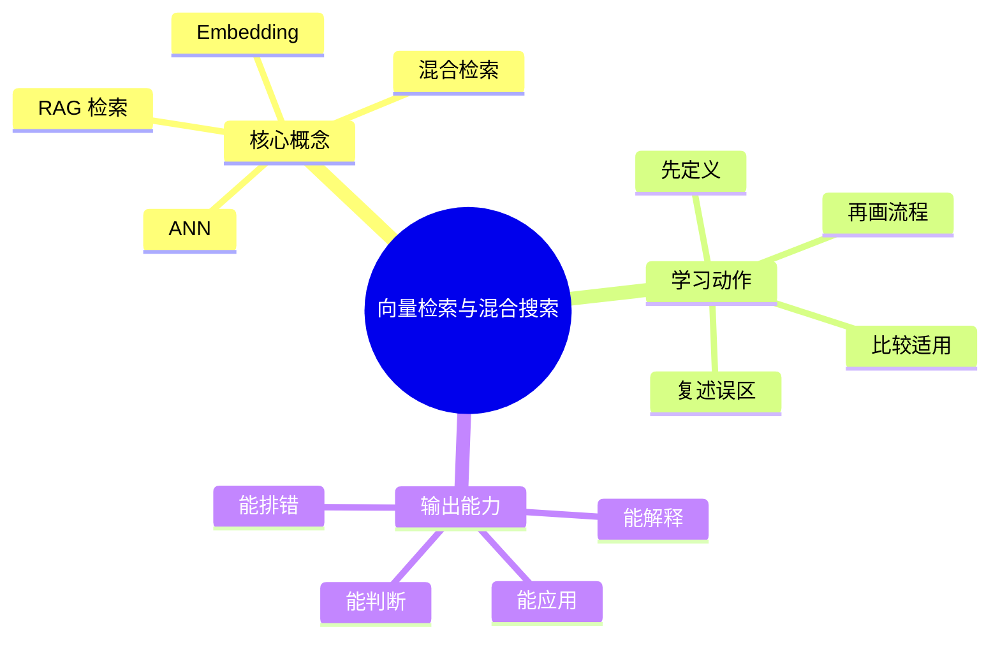
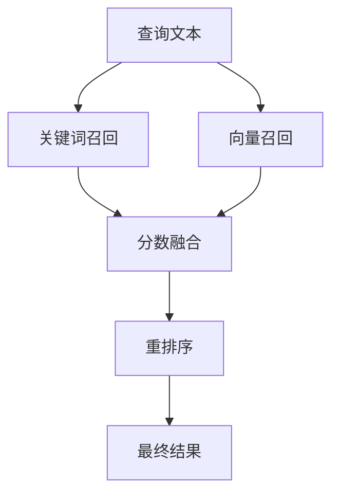

# 信息检索与搜索引擎：向量检索与混合搜索

## 学习目标
- 掌握 Embedding、ANN、HNSW、RAG 检索和混合排序。
- 能画出本章核心流程图，并能用自己的话解释每个节点。
- 能说出适用场景、边界条件、召回损失和常见误区。

## 一句话总纲
向量检索补足语义召回，关键词检索保证精确匹配，混合搜索常优于单一路径。

## 记忆口诀
> 词面保精确，向量补语义，融合稳效果

## 思维导图

## Mermaid 图解：核心流程

## 底层原则
- **语义补盲，词面保真：** 关键词检索擅长精确命中，向量检索擅长捕获改写和同义表达。
- **向量不是万能语义理解：** 向量近并不等于业务相关，也不等于用户真的想要。
- **近似检索是工程折中：** ANN 用可控的近似换吞吐和延迟，核心是调节召回与性能的平衡。
- **混合方案通常更稳：** 只用一种召回方式很容易在长尾、歧义或结构化查询上失分。

## 分章节讲解
### 1. Embedding
**核心定义：** Embedding 把文本映射到稠密向量，使语义相近内容在向量空间中距离更近。

**工程理解：**
- Embedding 是把离散文本映射到连续空间的表示学习结果。
- 其质量依赖模型、训练语料和任务对齐方式。
- 如果 embedding 目标和业务目标不一致，向量再好看也可能召回不对。

**适用场景：**
- 语义相似度搜索。
- 同义改写和表达不一致的召回。
- 文本聚类、推荐和多模态检索。

**常见误区：** Embedding 质量依赖模型和训练语料；向量相近不一定符合业务相关性。

### 2. ANN
**核心定义：** 近似最近邻用牺牲少量精确性换取大规模向量检索速度，常见结构包括 HNSW、IVF 等。

**工程理解：**
- ANN 的本质是让“最接近”变成“足够接近”。
- 常见指标不是只有查询速度，还包括召回率、延迟抖动、内存占用和构建成本。
- HNSW 更像图搜索，IVF 更像分桶检索，不同结构的调优思路不同。

**适用场景：**
- 百万到亿级向量检索。
- 对延迟有要求，但允许少量近似损失。
- 需要通过索引结构换取实时查询能力。

**常见误区：** ANN 参数会影响召回率、延迟和内存；不能只看查询速度。

### 3. 混合检索
**核心定义：** 混合检索结合 BM25 与向量召回，再用融合或重排得到最终结果。

**工程理解：**
- 混合检索不是把两个结果直接拼起来，而是要处理分值归一化、去重、权重协调和冲突消解。
- 它的目标是同时拿到“词面精确性”和“语义覆盖率”。
- 如果只加一个向量通道但没有评估，系统可能看起来更“智能”，实际却更不稳定。

**适用场景：**
- 既有明确关键词也有模糊语义查询。
- 内容长尾大、表达差异大。
- 需要兼顾结构化信息和语义信息。

**常见误区：** 简单拼接结果可能重复或权重失衡；需要归一化和评估。

### 4. RAG 检索
**核心定义：** RAG 中检索质量直接影响生成答案，需关注切块、召回、重排、引用和新鲜度。

**工程理解：**
- RAG 中最危险的不是“模型不会说”，而是“模型拿到了错误上下文”。
- 检索切块过大，会稀释精确信号；切块过小，会丢失上下文。
- 引用和可追溯性在 RAG 场景里非常重要，因为检索结果本身就是答案依据的一部分。

**适用场景：**
- 知识库问答。
- 文档辅助生成。
- 需要新鲜信息和可引用证据的问答系统。

**常见误区：** 只提高生成模型能力不能弥补错误检索上下文。

## 召回链路视角

## 关键对比表
| 知识点 | 正确理解 | 适用场景 | 常见误区 |
|---|---|---|---|
| Embedding | 把文本映射到稠密向量，语义相近内容更接近。 | 语义搜索、推荐、聚类。 | 向量相近不等于业务相关。 |
| ANN | 用近似换速度，关注召回、延迟和内存的平衡。 | 大规模向量检索。 | 只看查询快不看召回损失。 |
| 混合检索 | 关键词与向量互补，需做融合和归一化。 | 词面与语义都重要的场景。 | 结果简单拼接就能最优。 |
| RAG 检索 | 检索质量决定生成质量，需关注切块、引用和新鲜度。 | 知识库问答、辅助生成。 | 只调大模型就能解决坏检索。 |

## 混合方案对照表
| 方案 | 优点 | 风险 | 常用判断 |
|---|---|---|---|
| 只用 BM25 | 精确、稳定、解释性强 | 语义改写召回差 | 结构化查询多时适合。 |
| 只用向量 | 语义覆盖强 | 精确匹配和可解释性弱 | 自然语言查询多时有优势。 |
| 先各自召回再融合 | 覆盖广、鲁棒性好 | 融合复杂、调参成本高 | 大多数生产系统的默认选择。 |
| 混合后重排 | 精度高、排序更稳 | 延迟更高 | 候选不太大时更划算。 |

## 常见误区总结
- **Embedding：** Embedding 质量依赖模型和训练语料；向量相近不一定符合业务相关性。
- **ANN：** ANN 参数会影响召回率、延迟和内存；不能只看查询速度。
- **混合检索：** 简单拼接结果可能重复或权重失衡；需要归一化和评估。
- **RAG 检索：** 只提高生成模型能力不能弥补错误检索上下文。

## 自检题
1. 本章的核心问题是什么？请用一句话回答：向量检索补足语义召回，关键词检索保证精确匹配，混合搜索常优于单一路径。
2. 为什么很多生产系统会把 BM25 和向量检索放在一起？
3. ANN 为什么是“近似”而不是“完全精确”？
4. 你能说出混合检索里分数融合最常见的两个坑吗？
5. 哪个误区最容易在面试或工程实践中出现？为什么？

## 速记卡片
- 章节口诀：词面保精确，向量补语义，融合稳效果
- 答题结构：定义 → 机制 → 场景 → 权衡 → 误区。
- 复习动作：遮住正文，只根据思维导图复述一遍。

## 深度扩展：底层原理与应用边界

### 1. 本章在「信息检索与搜索引擎」中的位置
- **核心定位：** 通过索引、召回、排序和评估，从大规模内容中找到最符合用户意图的结果。
- **本章作用：** 「信息检索与搜索引擎：向量检索与混合搜索」负责把总纲落到可操作的判断框架：先确认问题边界，再拆解机制，最后根据代价和风险选择方法。
- **主要风险：** 最大风险是只做关键词匹配，不区分召回、排序、相关性、点击偏差和向量语义边界。
- **实践抓手：** 搜索优化要拆成索引质量、召回覆盖、排序特征、评估指标和线上实验。

### 2. 小流程图：从概念到应用

### 3. 概念深化：逐个击破
#### 3.1 Embedding
- **先问它解决什么：** Embedding 不是孤立名词，而是用来解决本章某类约束、关系、代价或风险判断的问题。
- **底层机制：** 学习时要拆成“输入条件 → 中间结构 → 处理规则 → 输出结果”四步；如果任何一步说不清，说明只是记住了结论。
- **适用条件：** 当前提满足、边界清楚、代价可接受时使用；如果输入分布、规模、时序、权限或一致性假设变化，就要重新评估。
- **不适用信号：** 需要违反前提才能套用、只能靠特殊样例解释、复杂度或维护成本明显失控时，应换方案。
- **面试表达：** “我会先定义 Embedding，再说明它依赖的前提，最后用一个反例说明边界。”

#### 3.2 ANN
- **先问它解决什么：** ANN 不是孤立名词，而是用来解决本章某类约束、关系、代价或风险判断的问题。
- **底层机制：** 学习时要拆成“输入条件 → 中间结构 → 处理规则 → 输出结果”四步；如果任何一步说不清，说明只是记住了结论。
- **适用条件：** 当前提满足、边界清楚、代价可接受时使用；如果输入分布、规模、时序、权限或一致性假设变化，就要重新评估。
- **不适用信号：** 需要违反前提才能套用、只能靠特殊样例解释、复杂度或维护成本明显失控时，应换方案。
- **面试表达：** “我会先定义 ANN，再说明它依赖的前提，最后用一个反例说明边界。”

#### 3.3 混合检索
- **先问它解决什么：** 混合检索 不是孤立名词，而是用来解决本章某类约束、关系、代价或风险判断的问题。
- **底层机制：** 学习时要拆成“输入条件 → 中间结构 → 处理规则 → 输出结果”四步；如果任何一步说不清，说明只是记住了结论。
- **适用条件：** 当前提满足、边界清楚、代价可接受时使用；如果输入分布、规模、时序、权限或一致性假设变化，就要重新评估。
- **不适用信号：** 需要违反前提才能套用、只能靠特殊样例解释、复杂度或维护成本明显失控时，应换方案。
- **面试表达：** “我会先定义 混合检索，再说明它依赖的前提，最后用一个反例说明边界。”

#### 3.4 RAG 检索
- **先问它解决什么：** RAG 检索 不是孤立名词，而是用来解决本章某类约束、关系、代价或风险判断的问题。
- **底层机制：** 学习时要拆成“输入条件 → 中间结构 → 处理规则 → 输出结果”四步；如果任何一步说不清，说明只是记住了结论。
- **适用条件：** 当前提满足、边界清楚、代价可接受时使用；如果输入分布、规模、时序、权限或一致性假设变化，就要重新评估。
- **不适用信号：** 需要违反前提才能套用、只能靠特殊样例解释、复杂度或维护成本明显失控时，应换方案。
- **面试表达：** “我会先定义 RAG 检索，再说明它依赖的前提，最后用一个反例说明边界。”

### 4. 适用边界对比表
| 判断维度 | 应该怎么想 | 典型错误 | 记忆提示 |
|---|---|---|---|
| 前提条件 | 先列出输入规模、数据分布、系统假设或业务约束 | 不看条件直接套模板 | 先问“凭什么能用” |
| 正确性 | 需要能说明为什么结果保持不变或为什么局部选择成立 | 只给经验结论 | 用不变量、反例或交换论证检查 |
| 复杂度/成本 | 同时估算时间、空间、延迟、吞吐、人力和维护成本 | 只看理论最优 | 工程里还要看常数和可观测性 |
| 失败模式 | 主动说明边界外会怎样失败 | 面试中只讲优点 | 能说失败边界才算真理解 |

### 5. 记忆强化：三层复述法
1. **概念层：** 用一句话定义本章每个核心概念。
2. **机制层：** 不看原文画出输入到输出的流程。
3. **边界层：** 为每个概念准备一个“不能这样用”的反例。

### 6. 工程/做题/面试迁移
- **工程迁移：** 搜索优化要拆成索引质量、召回覆盖、排序特征、评估指标和线上实验。
- **做题迁移：** 先把题目中的对象、关系、约束和目标函数圈出来，再映射到本章概念。
- **面试迁移：** 回答时不要只报名词，要说清“为什么需要它、它如何工作、它何时失效”。

### 7. 深度自检题
1. 你能否把本章概念按“前提 → 机制 → 结果 → 代价”重新组织？
2. 如果输入规模、并发量、数据分布或安全边界变化，原结论是否仍成立？
3. 本章哪个概念最容易被误用？请给出一个反例。
4. 如果让你设计一道面试题，你会怎样考察候选人是否真的理解？

### 8. 深度速记卡片
- **总抓手：** 通过索引、召回、排序和评估，从大规模内容中找到最符合用户意图的结果。
- **答题模板：** 定义边界 → 拆底层机制 → 说适用条件 → 讲权衡 → 给反例。
- **复习动作：** 每次复习只看图和表，尝试口述 3 分钟；卡住处再回正文。

## 专题深化：具体机制、案例与追问

### 1. 具体案例：把「向量检索与混合搜索」放进真实问题
例如搜索“苹果手机电池”既要词面召回，也要理解同义词和意图，还要用排序模型处理时效、质量和点击偏差。

### 2. 本章关键机制细化
- Embedding 处理语义相似，但可能损失精确词面约束。
- ANN 用近似换速度，要调召回、延迟和内存。
- 混合检索需要归一化、融合和重排。

### 3. 概念到判断的检查清单
| 概念/动作 | 你要检查什么 | 如果检查失败会怎样 |
|---|---|---|
| Embedding | 前提、输入、输出、代价、失败边界是否都说清 | 可能套错模型、复杂度失控或得到不可验证结论 |
| ANN | 前提、输入、输出、代价、失败边界是否都说清 | 可能套错模型、复杂度失控或得到不可验证结论 |
| 混合检索 | 前提、输入、输出、代价、失败边界是否都说清 | 可能套错模型、复杂度失控或得到不可验证结论 |
| RAG 检索 | 前提、输入、输出、代价、失败边界是否都说清 | 可能套错模型、复杂度失控或得到不可验证结论 |
| 本章在「信息检索与搜索引擎」中的位置 | 前提、输入、输出、代价、失败边界是否都说清 | 可能套错模型、复杂度失控或得到不可验证结论 |

### 4. 面试追问路径

- 召回不全还是排序不准？
- 评价指标是否匹配用户体验？
- 点击数据是否有位置偏差？

### 5. 验证与复盘
- **验证方式：** 用离线标注集、NDCG/MRR、人工评测、A/B 实验和失败查询分析验证。
- **复盘方式：** 每次做题或设计后，记录“我使用了哪个前提、哪个前提最容易被破坏、如果破坏如何调整”。
- **记忆方式：** 不背孤立结论，只背“问题 → 机制 → 边界 → 验证”的链路。

## 本轮扩写：ANN、混合召回与 RAG 失败模式

### 1. ANN 的核心权衡是召回率、延迟和内存
精确最近邻在大规模向量库上成本高，ANN 用索引结构换取近似结果。

| 索引思路 | 核心机制 | 优点 | 风险 |
|---|---|---|---|
| HNSW | 多层小世界图，贪心搜索 | 召回高，在线查询快 | 内存占用高，构建成本高 |
| IVF | 先聚类，再查部分倒排桶 | 易控制延迟 | 聚类边界可能漏召回 |
| PQ | 向量量化压缩 | 节省内存 | 精度损失，需要校准 |
| Flat | 暴力精确搜索 | 结果准确 | 大规模延迟不可接受 |

### 2. 混合检索不是简单相加
BM25 擅长关键词精确匹配，向量召回擅长语义相似；混合检索要解决分数不可比、召回集合重叠和重排成本。

| 融合方式 | 做法 | 适用 | 注意点 |
|---|---|---|---|
| 并联召回 | BM25 和向量各取候选 | 召回覆盖优先 | TopK 分配影响召回 |
| 分数归一 | 归一后加权 | 分数稳定场景 | 不同 query 分布会漂移 |
| RRF | 按排名倒数融合 | 分数不可比 | 对尾部排序不敏感 |
| 学习排序 | 用模型融合多特征 | 数据充足 | 标注和线上反馈成本高 |

### 3. RAG 检索失败模式
- **没召回：** 分块过大/过小、embedding 不适配领域、query 改写失败。
- **召回但没排前：** 混合权重不合理、重排器缺失、上下文长度挤压。
- **文档过期：** 索引刷新延迟、权限变更未同步、版本未标记。
- **答案不引用：** 生成阶段没有强制基于证据，或引用片段粒度不对。

### 4. 评测闭环
1. 构造 query-doc 相关性集合，覆盖关键词、同义词、长尾、否定和多跳问题。
2. 同时看 Recall@K、MRR、nDCG、答案可支持率和引用准确率。
3. 把失败样本分类到分块、召回、融合、重排、生成和权限六类。
4. 每次调参只改变一个变量，避免无法解释线上变化。

### 5. 面试追问路径
- “为什么向量检索不能替代倒排？”——回答精确词匹配、过滤、可解释性和成本。
- “HNSW 为什么快？”——回答图结构近邻导航、多层入口和贪心搜索。
- “RAG 答错怎么排查？”——按 query 改写、召回、重排、上下文、生成、权限逐层定位。
