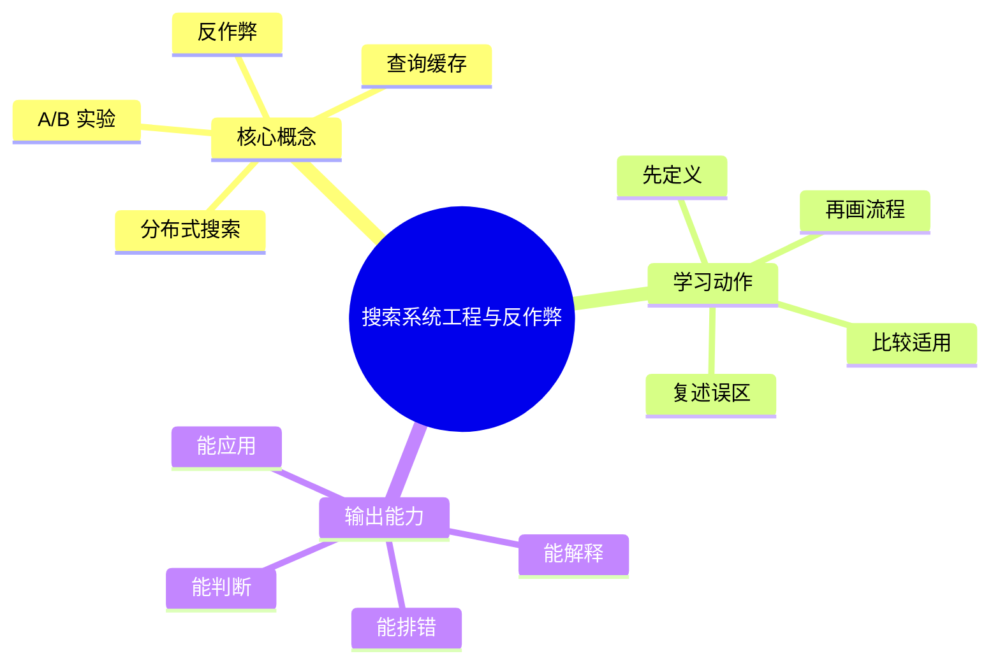
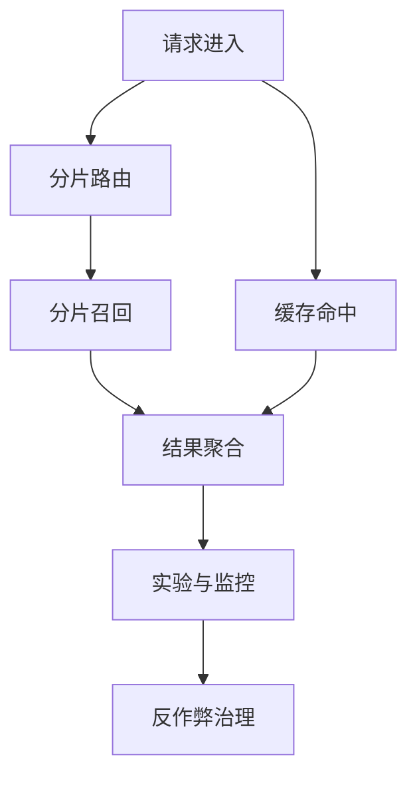

# 信息检索与搜索引擎：搜索系统工程与反作弊

## 学习目标
- 理解分布式搜索、缓存、延迟优化、日志评估和反作弊。
- 能画出本章核心流程图，并能用自己的话解释每个节点。
- 能说出适用场景、边界条件、风险治理和常见误区。

## 一句话总纲
搜索工程是在相关性、延迟、成本和安全之间做持续权衡。

## 记忆口诀
> 分布式扩展，缓存降延迟，日志促迭代

## 思维导图

## Mermaid 图解：核心流程

## 底层原则
- **工程目标不是单点最优：** 搜索系统要在相关性、时延、成本、稳定性和安全之间找平衡。
- **规模会放大问题：** 数据量变大后，尾延迟、热点、缓存一致性和作弊对抗都会显著变难。
- **可观测性是优化前提：** 没有日志、指标和实验，优化往往只是“感觉更快了”。
- **治理是长期战：** 搜索反作弊不是一次性规则，而是持续对抗、持续修正和持续复盘。

## 分章节讲解
### 1. 分布式搜索
**核心定义：** 分布式搜索把索引分片并并行查询，再聚合排序结果以支撑大规模数据。

**工程理解：**
- 分布式设计的本质是把数据和计算拆开，再在最后合并结果。
- 关键问题不只是“能不能查到”，而是“如何保证全局排序正确、结果一致、尾延迟可控”。
- 分片方案、路由方案和聚合方案决定了系统上限。

**适用场景：**
- 数据量单机放不下。
- 并发请求高。
- 索引写入和查询都需要扩展。

**常见误区：** 分片不均会导致尾延迟；聚合阶段要处理全局排序。

### 2. 查询缓存
**核心定义：** 缓存热门查询、过滤结果或特征可降低延迟和成本。

**工程理解：**
- 缓存不是只缓存“最终结果”，也可以缓存中间特征、候选集或聚合片段。
- 适合高重复率、低更新率和读多写少的场景。
- 缓存命中率、失效方案和个性化程度决定它的实际收益。

**适用场景：**
- 热门查询频繁出现。
- 结果更新不需要绝对实时。
- 可以接受一定的缓存失效和近似返回。

**常见误区：** 缓存会带来新鲜度问题；个性化结果不宜简单全局缓存。

### 3. A/B 实验
**核心定义：** 搜索效果需要通过离线评估、在线实验和人工评测结合验证。

**工程理解：**
- 离线评估看的是“模型或方案是否有潜力”。
- 在线实验看的是“真实用户行为是否变好”。
- 人工评测可以补充离线和在线都看不到的细节。

**适用场景：**
- 需要验证新排序方案、新召回方案或新反作弊规则是否真的有效。
- 不同目标之间存在冲突时，需要用实验裁决。

**常见误区：** 单次实验要控制样本、周期和显著性，避免季节或流量偏差。

### 4. 反作弊
**核心定义：** 搜索反作弊识别关键词堆砌、链接操纵、点击刷量和低质内容，保护结果质量。

**工程理解：**
- 反作弊既有规则，也有模型，还常常依赖人工审核和申诉机制。
- 攻防是动态的，作弊者会学习规则，因此方案需要持续更新。
- 真正有效的反作弊不是“把坏内容全部打掉”，而是“尽量低误杀地控制系统被操纵的风险”。

**适用场景：**
- 搜索质量被垃圾内容污染。
- 流量和排名可能被操纵。
- 需要保护结果可信度和商业安全。

**常见误区：** 过强规则会误伤正常内容；反作弊需要持续对抗和人工复核。

## 系统工程视角

## 关键对比表
| 知识点 | 正确理解 | 适用场景 | 常见误区 |
|---|---|---|---|
| 分布式搜索 | 分布式把索引分片并并行查询，再聚合排序结果。 | 大规模数据、高并发。 | 只看扩展，不看全局排序和尾延迟。 |
| 查询缓存 | 缓存热点查询或中间结果来降延迟。 | 热门、低更新、读多写少。 | 把个性化结果当全局缓存。 |
| A/B 实验 | 离线、在线、人工评测结合验证搜索效果。 | 验证新方案、做方案取舍。 | 样本不足或周期太短就下结论。 |
| 反作弊 | 用规则、模型和人工复核一起治理操纵行为。 | 垃圾内容、刷量、操纵排名。 | 过度规则化导致误伤。 |

## 工程权衡表
| 权衡维度 | 提升方向 | 典型代价 | 说明 |
|---|---|---|---|
| 相关性 vs 延迟 | 更复杂模型、更重重排 | 响应更慢 | 通常只能在候选变少后做更强判断。 |
| 新鲜度 vs 成本 | 更频繁刷新、更少缓存 | 资源消耗更高 | 热点和实时内容尤其明显。 |
| 稳定性 vs 灵活性 | 更保守发布、更严格审核 | 迭代更慢 | 搜索质量系统很怕大面积误伤。 |
| 安全 vs 覆盖 | 更强风控、更严规则 | 正常内容可能受影响 | 反作弊要特别注意误杀成本。 |

## 常见误区总结
- **分布式搜索：** 分片不均会导致尾延迟；聚合阶段要处理全局排序。
- **查询缓存：** 缓存会带来新鲜度问题；个性化结果不宜简单全局缓存。
- **A/B 实验：** 单次实验要控制样本、周期和显著性，避免季节或流量偏差。
- **反作弊：** 过强规则会误伤正常内容；反作弊需要持续对抗和人工复核。

## 自检题
1. 本章的核心问题是什么？请用一句话回答：搜索工程是在相关性、延迟、成本和安全之间做持续权衡。
2. 为什么搜索系统的“尾延迟”特别重要？
3. 缓存为什么在搜索里既是优化手段也是风险来源？
4. 为什么反作弊不能只依赖一套静态规则？
5. 哪个误区最容易在面试或工程实践中出现？为什么？

## 速记卡片
- 章节口诀：分布式扩展，缓存降延迟，日志促迭代
- 答题结构：定义 → 机制 → 场景 → 权衡 → 误区。
- 复习动作：遮住正文，只根据思维导图复述一遍。

## 深度扩展：底层原理与应用边界

### 1. 本章在「信息检索与搜索引擎」中的位置
- **核心定位：** 通过索引、召回、排序和评估，从大规模内容中找到最符合用户意图的结果。
- **本章作用：** 「信息检索与搜索引擎：搜索系统工程与反作弊」负责把总纲落到可操作的判断框架：先确认问题边界，再拆解机制，最后根据代价和风险选择方法。
- **主要风险：** 最大风险是只做关键词匹配，不区分召回、排序、相关性、点击偏差和向量语义边界。
- **实践抓手：** 搜索优化要拆成索引质量、召回覆盖、排序特征、评估指标和线上实验。

### 2. 小流程图：从概念到应用

### 3. 概念深化：逐个击破
#### 3.1 分布式搜索
- **先问它解决什么：** 分布式搜索 不是孤立名词，而是用来解决本章某类约束、关系、代价或风险判断的问题。
- **底层机制：** 学习时要拆成“输入条件 → 中间结构 → 处理规则 → 输出结果”四步；如果任何一步说不清，说明只是记住了结论。
- **适用条件：** 当前提满足、边界清楚、代价可接受时使用；如果输入分布、规模、时序、权限或一致性假设变化，就要重新评估。
- **不适用信号：** 需要违反前提才能套用、只能靠特殊样例解释、复杂度或维护成本明显失控时，应换方案。
- **面试表达：** “我会先定义 分布式搜索，再说明它依赖的前提，最后用一个反例说明边界。”

#### 3.2 查询缓存
- **先问它解决什么：** 查询缓存 不是孤立名词，而是用来解决本章某类约束、关系、代价或风险判断的问题。
- **底层机制：** 学习时要拆成“输入条件 → 中间结构 → 处理规则 → 输出结果”四步；如果任何一步说不清，说明只是记住了结论。
- **适用条件：** 当前提满足、边界清楚、代价可接受时使用；如果输入分布、规模、时序、权限或一致性假设变化，就要重新评估。
- **不适用信号：** 需要违反前提才能套用、只能靠特殊样例解释、复杂度或维护成本明显失控时，应换方案。
- **面试表达：** “我会先定义 查询缓存，再说明它依赖的前提，最后用一个反例说明边界。”

#### 3.3 A/B 实验
- **先问它解决什么：** A/B 实验 不是孤立名词，而是用来解决本章某类约束、关系、代价或风险判断的问题。
- **底层机制：** 学习时要拆成“输入条件 → 中间结构 → 处理规则 → 输出结果”四步；如果任何一步说不清，说明只是记住了结论。
- **适用条件：** 当前提满足、边界清楚、代价可接受时使用；如果输入分布、规模、时序、权限或一致性假设变化，就要重新评估。
- **不适用信号：** 需要违反前提才能套用、只能靠特殊样例解释、复杂度或维护成本明显失控时，应换方案。
- **面试表达：** “我会先定义 A/B 实验，再说明它依赖的前提，最后用一个反例说明边界。”

#### 3.4 反作弊
- **先问它解决什么：** 反作弊 不是孤立名词，而是用来解决本章某类约束、关系、代价或风险判断的问题。
- **底层机制：** 学习时要拆成“输入条件 → 中间结构 → 处理规则 → 输出结果”四步；如果任何一步说不清，说明只是记住了结论。
- **适用条件：** 当前提满足、边界清楚、代价可接受时使用；如果输入分布、规模、时序、权限或一致性假设变化，就要重新评估。
- **不适用信号：** 需要违反前提才能套用、只能靠特殊样例解释、复杂度或维护成本明显失控时，应换方案。
- **面试表达：** “我会先定义 反作弊，再说明它依赖的前提，最后用一个反例说明边界。”

### 4. 适用边界对比表
| 判断维度 | 应该怎么想 | 典型错误 | 记忆提示 |
|---|---|---|---|
| 前提条件 | 先列出输入规模、数据分布、系统假设或业务约束 | 不看条件直接套模板 | 先问“凭什么能用” |
| 正确性 | 需要能说明为什么结果保持不变或为什么局部选择成立 | 只给经验结论 | 用不变量、反例或交换论证检查 |
| 复杂度/成本 | 同时估算时间、空间、延迟、吞吐、人力和维护成本 | 只看理论最优 | 工程里还要看常数和可观测性 |
| 失败模式 | 主动说明边界外会怎样失败 | 面试中只讲优点 | 能说失败边界才算真理解 |

### 5. 记忆强化：三层复述法
1. **概念层：** 用一句话定义本章每个核心概念。
2. **机制层：** 不看原文画出输入到输出的流程。
3. **边界层：** 为每个概念准备一个“不能这样用”的反例。

### 6. 工程/做题/面试迁移
- **工程迁移：** 搜索优化要拆成索引质量、召回覆盖、排序特征、评估指标和线上实验。
- **做题迁移：** 先把题目中的对象、关系、约束和目标函数圈出来，再映射到本章概念。
- **面试迁移：** 回答时不要只报名词，要说清“为什么需要它、它如何工作、它何时失效”。

### 7. 深度自检题
1. 你能否把本章概念按“前提 → 机制 → 结果 → 代价”重新组织？
2. 如果输入规模、并发量、数据分布或安全边界变化，原结论是否仍成立？
3. 本章哪个概念最容易被误用？请给出一个反例。
4. 如果让你设计一道面试题，你会怎样考察候选人是否真的理解？

### 8. 深度速记卡片
- **总抓手：** 通过索引、召回、排序和评估，从大规模内容中找到最符合用户意图的结果。
- **答题模板：** 定义边界 → 拆底层机制 → 说适用条件 → 讲权衡 → 给反例。
- **复习动作：** 每次复习只看图和表，尝试口述 3 分钟；卡住处再回正文。

## 专题深化：具体机制、案例与追问

### 1. 具体案例：把「搜索系统工程与反作弊」放进真实问题
例如搜索“苹果手机电池”既要词面召回，也要理解同义词和意图，还要用排序模型处理时效、质量和点击偏差。

### 2. 本章关键机制细化
- 分片会带来负载不均和尾延迟问题。
- 缓存要处理热门查询和结果新鲜度。
- 反作弊是持续对抗，需要规则、模型和人工复核。

### 3. 概念到判断的检查清单
| 概念/动作 | 你要检查什么 | 如果检查失败会怎样 |
|---|---|---|
| 分布式搜索 | 前提、输入、输出、代价、失败边界是否都说清 | 可能套错模型、复杂度失控或得到不可验证结论 |
| 查询缓存 | 前提、输入、输出、代价、失败边界是否都说清 | 可能套错模型、复杂度失控或得到不可验证结论 |
| A/B 实验 | 前提、输入、输出、代价、失败边界是否都说清 | 可能套错模型、复杂度失控或得到不可验证结论 |
| 反作弊 | 前提、输入、输出、代价、失败边界是否都说清 | 可能套错模型、复杂度失控或得到不可验证结论 |
| 本章在「信息检索与搜索引擎」中的位置 | 前提、输入、输出、代价、失败边界是否都说清 | 可能套错模型、复杂度失控或得到不可验证结论 |

### 4. 面试追问路径

- 召回不全还是排序不准？
- 评价指标是否匹配用户体验？
- 点击数据是否有位置偏差？

### 5. 验证与复盘
- **验证方式：** 用离线标注集、NDCG/MRR、人工评测、A/B 实验和失败查询分析验证。
- **复盘方式：** 每次做题或设计后，记录“我使用了哪个前提、哪个前提最容易被破坏、如果破坏如何调整”。
- **记忆方式：** 不背孤立结论，只背“问题 → 机制 → 边界 → 验证”的链路。

## 本轮扩写：查询改写、分片扇出与反作弊闭环

### 1. 搜索链路的工程视角

每一层都可能引入偏差：Query 改写可能改错意图，召回可能漏掉长尾，排序可能过拟合点击，规则可能伤害相关性。

### 2. 分布式搜索的扇出成本
| 设计点 | 收益 | 成本 | 控制方式 |
|---|---|---|---|
| 多分片 fanout | 提升容量 | 尾延迟由最慢分片决定 | 超时截断、分片副本、动态裁剪 |
| 查询缓存 | 降低热点延迟 | 结果过期和个性化冲突 | 按 query/过滤条件/用户段设计 key |
| 索引分层 | 热数据更快 | 数据迁移复杂 | 热温冷分层和生命周期策略 |
| 降级召回 | 故障时保可用 | 相关性下降 | 明确降级标记和质量监控 |

### 3. 反作弊不是单个模型
作弊会利用排序规则、点击反馈、内容生成和账号网络，因此要结合规则、模型、图关系和人工审核。

| 作弊类型 | 表现 | 检测信号 | 处置 |
|---|---|---|---|
| 关键词堆砌 | 文本重复、无语义 | 词频异常、可读性差 | 降权、重写、拒收 |
| 点击操纵 | CTR 异常升高 | IP/设备/时间模式异常 | 过滤反馈、账号限权 |
| 内容农场 | 大量低质页面 | 模板相似、停留低 | 聚类降权 |
| 权限绕过 | 不该搜到的文档出现 | ACL 与索引不一致 | 查询时权限过滤和索引修复 |

### 4. 面试追问路径
- “搜索为什么 P99 高？”——回答分片扇出、慢分片、重排模型、缓存未命中和下游特征服务。
- “如何评估反作弊是否误伤？”——回答人工标注、抽样复核、分群指标和申诉反馈。
- “A/B 实验为什么不能只看 CTR？”——回答满意度、长点击、转化、留存和生态质量。
