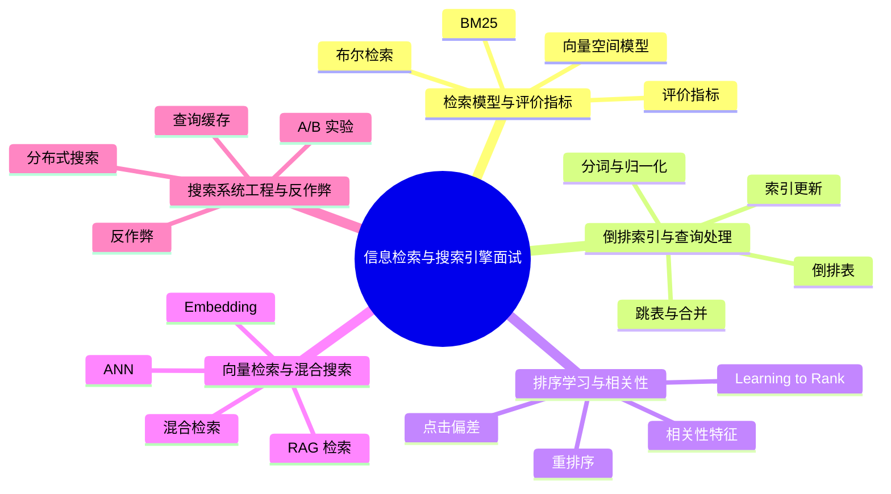

# 信息检索与搜索引擎面试20问

## 学习目标
- 用 20 个高频问题串起 信息检索与搜索引擎 的核心知识。
- 每个答案都按“定义 → 机制 → 场景 → 权衡 → 误区 → 记忆点”组织，便于面试复述。
- 通过小型 Mermaid 图辅助记忆，避免超大图难以阅读。

## 一句话总纲
信息检索研究如何从大规模文档中找到与用户意图最相关的结果，现代搜索通常结合倒排索引、排序学习和向量检索。

## 记忆口诀
> 建索引快召回，算相关排好序，评指标看效果，混合检索补短板。

## 思维导图

## 答题总流程

## 第 1-5 问：检索基础

## 深度面试答题框架

- **总主线：** 通过索引、召回、排序和评估，从大规模内容中找到最符合用户意图的结果。
- **风险提醒：** 最大风险是只做关键词匹配，不区分召回、排序、相关性、点击偏差和向量语义边界。
- **实践抓手：** 搜索优化要拆成索引质量、召回覆盖、排序特征、评估指标和线上实验。

## 面试答案强化版：逐题深答

> 回答每题都按：定义 → 机制 → 场景 → 权衡 → 误区 → 验证。

### Q1：请解释“布尔检索”的核心思想、适用场景和常见误区。

**答：**
1. **定义：** 布尔检索用 AND、OR、NOT 组合词项，适合精确过滤和结构化条件。
2. **机制：** 先确认前提，再说明它处理的数据、状态、边界或资源，最后说明输出结果为什么可信。结合本学科主线看，例如搜索“苹果手机电池”既要词面召回，也要理解同义词和意图，还要用排序模型处理时效、质量和点击偏差。
3. **适用场景：** 当问题与 布尔检索 的前提一致，并且需要在正确性、性能、可靠性或可维护性之间做判断时使用。
4. **权衡：** 要主动比较收益和代价：它可能提升表达力、效率或可靠性，但也可能增加复杂度、资源消耗或维护成本。
5. **误区：** 不检查前提就套用；只讲结论不讲失败边界；无法说明如何验证。
6. **验证：** 用离线标注集、NDCG/MRR、人工评测、A/B 实验和失败查询分析验证。
**追问回答模板：** 如果面试官继续问“为什么不用别的方案”，从前提差异、失败模式和验证成本三个角度回答。

### Q2：请解释“向量空间模型”的核心思想、适用场景和常见误区。

**答：**
1. **定义：** 向量空间模型把文档和查询表示为词项权重向量，用余弦相似度衡量相关性。
2. **机制：** 先确认前提，再说明它处理的数据、状态、边界或资源，最后说明输出结果为什么可信。结合本学科主线看，例如搜索“苹果手机电池”既要词面召回，也要理解同义词和意图，还要用排序模型处理时效、质量和点击偏差。
3. **适用场景：** 当问题与 向量空间模型 的前提一致，并且需要在正确性、性能、可靠性或可维护性之间做判断时使用。
4. **权衡：** 要主动比较收益和代价：它可能提升表达力、效率或可靠性，但也可能增加复杂度、资源消耗或维护成本。
5. **误区：** 不检查前提就套用；只讲结论不讲失败边界；无法说明如何验证。
6. **验证：** 用离线标注集、NDCG/MRR、人工评测、A/B 实验和失败查询分析验证。
**追问回答模板：** 如果面试官继续问“为什么不用别的方案”，从前提差异、失败模式和验证成本三个角度回答。

### Q3：请解释“BM25”的核心思想、适用场景和常见误区。

**答：**
1. **定义：** BM25 基于词频、逆文档频率和文档长度归一，是传统文本检索强基线。
2. **机制：** 先确认前提，再说明它处理的数据、状态、边界或资源，最后说明输出结果为什么可信。结合本学科主线看，例如搜索“苹果手机电池”既要词面召回，也要理解同义词和意图，还要用排序模型处理时效、质量和点击偏差。
3. **适用场景：** 当问题与 BM25 的前提一致，并且需要在正确性、性能、可靠性或可维护性之间做判断时使用。
4. **权衡：** 要主动比较收益和代价：它可能提升表达力、效率或可靠性，但也可能增加复杂度、资源消耗或维护成本。
5. **误区：** 不检查前提就套用；只讲结论不讲失败边界；无法说明如何验证。
6. **验证：** 用离线标注集、NDCG/MRR、人工评测、A/B 实验和失败查询分析验证。
**追问回答模板：** 如果面试官继续问“为什么不用别的方案”，从前提差异、失败模式和验证成本三个角度回答。

### Q4：请解释“评价指标”的核心思想、适用场景和常见误区。

**答：**
1. **定义：** Precision、Recall、MRR、MAP、NDCG 分别衡量准确、覆盖、首个正确结果和排序质量。
2. **机制：** 先确认前提，再说明它处理的数据、状态、边界或资源，最后说明输出结果为什么可信。结合本学科主线看，例如搜索“苹果手机电池”既要词面召回，也要理解同义词和意图，还要用排序模型处理时效、质量和点击偏差。
3. **适用场景：** 当问题与 评价指标 的前提一致，并且需要在正确性、性能、可靠性或可维护性之间做判断时使用。
4. **权衡：** 要主动比较收益和代价：它可能提升表达力、效率或可靠性，但也可能增加复杂度、资源消耗或维护成本。
5. **误区：** 不检查前提就套用；只讲结论不讲失败边界；无法说明如何验证。
6. **验证：** 用离线标注集、NDCG/MRR、人工评测、A/B 实验和失败查询分析验证。
**追问回答模板：** 如果面试官继续问“为什么不用别的方案”，从前提差异、失败模式和验证成本三个角度回答。

### Q5：请解释“分词与归一化”的核心思想、适用场景和常见误区。

**答：**
1. **定义：** 分词、大小写归一、词干化、停用词处理会影响召回和精确度。
2. **机制：** 先确认前提，再说明它处理的数据、状态、边界或资源，最后说明输出结果为什么可信。结合本学科主线看，例如搜索“苹果手机电池”既要词面召回，也要理解同义词和意图，还要用排序模型处理时效、质量和点击偏差。
3. **适用场景：** 当问题与 分词与归一化 的前提一致，并且需要在正确性、性能、可靠性或可维护性之间做判断时使用。
4. **权衡：** 要主动比较收益和代价：它可能提升表达力、效率或可靠性，但也可能增加复杂度、资源消耗或维护成本。
5. **误区：** 不检查前提就套用；只讲结论不讲失败边界；无法说明如何验证。
6. **验证：** 用离线标注集、NDCG/MRR、人工评测、A/B 实验和失败查询分析验证。
**追问回答模板：** 如果面试官继续问“为什么不用别的方案”，从前提差异、失败模式和验证成本三个角度回答。

### Q6：请解释“倒排表”的核心思想、适用场景和常见误区。

**答：**
1. **定义：** 倒排表记录每个词出现在哪些文档以及位置、频次等信息。
2. **机制：** 先确认前提，再说明它处理的数据、状态、边界或资源，最后说明输出结果为什么可信。结合本学科主线看，例如搜索“苹果手机电池”既要词面召回，也要理解同义词和意图，还要用排序模型处理时效、质量和点击偏差。
3. **适用场景：** 当问题与 倒排表 的前提一致，并且需要在正确性、性能、可靠性或可维护性之间做判断时使用。
4. **权衡：** 要主动比较收益和代价：它可能提升表达力、效率或可靠性，但也可能增加复杂度、资源消耗或维护成本。
5. **误区：** 不检查前提就套用；只讲结论不讲失败边界；无法说明如何验证。
6. **验证：** 用离线标注集、NDCG/MRR、人工评测、A/B 实验和失败查询分析验证。
**追问回答模板：** 如果面试官继续问“为什么不用别的方案”，从前提差异、失败模式和验证成本三个角度回答。

### Q7：请解释“跳表与合并”的核心思想、适用场景和常见误区。

**答：**
1. **定义：** 跳表帮助快速跳过不可能匹配的文档，提升多词查询的倒排表求交效率。
2. **机制：** 先确认前提，再说明它处理的数据、状态、边界或资源，最后说明输出结果为什么可信。结合本学科主线看，例如搜索“苹果手机电池”既要词面召回，也要理解同义词和意图，还要用排序模型处理时效、质量和点击偏差。
3. **适用场景：** 当问题与 跳表与合并 的前提一致，并且需要在正确性、性能、可靠性或可维护性之间做判断时使用。
4. **权衡：** 要主动比较收益和代价：它可能提升表达力、效率或可靠性，但也可能增加复杂度、资源消耗或维护成本。
5. **误区：** 不检查前提就套用；只讲结论不讲失败边界；无法说明如何验证。
6. **验证：** 用离线标注集、NDCG/MRR、人工评测、A/B 实验和失败查询分析验证。
**追问回答模板：** 如果面试官继续问“为什么不用别的方案”，从前提差异、失败模式和验证成本三个角度回答。

### Q8：请解释“索引更新”的核心思想、适用场景和常见误区。

**答：**
1. **定义：** 索引更新可采用增量段、合并方案和近实时刷新平衡写入和查询性能。
2. **机制：** 先确认前提，再说明它处理的数据、状态、边界或资源，最后说明输出结果为什么可信。结合本学科主线看，例如搜索“苹果手机电池”既要词面召回，也要理解同义词和意图，还要用排序模型处理时效、质量和点击偏差。
3. **适用场景：** 当问题与 索引更新 的前提一致，并且需要在正确性、性能、可靠性或可维护性之间做判断时使用。
4. **权衡：** 要主动比较收益和代价：它可能提升表达力、效率或可靠性，但也可能增加复杂度、资源消耗或维护成本。
5. **误区：** 不检查前提就套用；只讲结论不讲失败边界；无法说明如何验证。
6. **验证：** 用离线标注集、NDCG/MRR、人工评测、A/B 实验和失败查询分析验证。
**追问回答模板：** 如果面试官继续问“为什么不用别的方案”，从前提差异、失败模式和验证成本三个角度回答。

### Q9：请解释“查询处理”的核心思想、适用场景和常见误区。

**答：**
1. **定义：** 查询处理 是 信息检索与搜索引擎 中用于连接概念、机制和工程判断的关键知识点。
2. **机制：** 先确认前提，再说明它处理的数据、状态、边界或资源，最后说明输出结果为什么可信。结合本学科主线看，例如搜索“苹果手机电池”既要词面召回，也要理解同义词和意图，还要用排序模型处理时效、质量和点击偏差。
3. **适用场景：** 当问题与 查询处理 的前提一致，并且需要在正确性、性能、可靠性或可维护性之间做判断时使用。
4. **权衡：** 要主动比较收益和代价：它可能提升表达力、效率或可靠性，但也可能增加复杂度、资源消耗或维护成本。
5. **误区：** 不检查前提就套用；只讲结论不讲失败边界；无法说明如何验证。
6. **验证：** 用离线标注集、NDCG/MRR、人工评测、A/B 实验和失败查询分析验证。
**追问回答模板：** 如果面试官继续问“为什么不用别的方案”，从前提差异、失败模式和验证成本三个角度回答。

### Q10：请解释“压缩”的核心思想、适用场景和常见误区。

**答：**
1. **定义：** 压缩 是 信息检索与搜索引擎 中用于连接概念、机制和工程判断的关键知识点。
2. **机制：** 先确认前提，再说明它处理的数据、状态、边界或资源，最后说明输出结果为什么可信。结合本学科主线看，例如搜索“苹果手机电池”既要词面召回，也要理解同义词和意图，还要用排序模型处理时效、质量和点击偏差。
3. **适用场景：** 当问题与 压缩 的前提一致，并且需要在正确性、性能、可靠性或可维护性之间做判断时使用。
4. **权衡：** 要主动比较收益和代价：它可能提升表达力、效率或可靠性，但也可能增加复杂度、资源消耗或维护成本。
5. **误区：** 不检查前提就套用；只讲结论不讲失败边界；无法说明如何验证。
6. **验证：** 用离线标注集、NDCG/MRR、人工评测、A/B 实验和失败查询分析验证。
**追问回答模板：** 如果面试官继续问“为什么不用别的方案”，从前提差异、失败模式和验证成本三个角度回答。

### Q11：请解释“相关性特征”的核心思想、适用场景和常见误区。

**答：**
1. **定义：** 相关性特征包括文本匹配、字段权重、文档质量、时效性、用户行为和个性化信号。
2. **机制：** 先确认前提，再说明它处理的数据、状态、边界或资源，最后说明输出结果为什么可信。结合本学科主线看，例如搜索“苹果手机电池”既要词面召回，也要理解同义词和意图，还要用排序模型处理时效、质量和点击偏差。
3. **适用场景：** 当问题与 相关性特征 的前提一致，并且需要在正确性、性能、可靠性或可维护性之间做判断时使用。
4. **权衡：** 要主动比较收益和代价：它可能提升表达力、效率或可靠性，但也可能增加复杂度、资源消耗或维护成本。
5. **误区：** 不检查前提就套用；只讲结论不讲失败边界；无法说明如何验证。
6. **验证：** 用离线标注集、NDCG/MRR、人工评测、A/B 实验和失败查询分析验证。
**追问回答模板：** 如果面试官继续问“为什么不用别的方案”，从前提差异、失败模式和验证成本三个角度回答。

### Q12：请解释“Learning to Rank”的核心思想、适用场景和常见误区。

**答：**
1. **定义：** 排序学习用人工标注或行为数据训练模型，常见思路有 pointwise、pairwise、listwise。
2. **机制：** 先确认前提，再说明它处理的数据、状态、边界或资源，最后说明输出结果为什么可信。结合本学科主线看，例如搜索“苹果手机电池”既要词面召回，也要理解同义词和意图，还要用排序模型处理时效、质量和点击偏差。
3. **适用场景：** 当问题与 Learning to Rank 的前提一致，并且需要在正确性、性能、可靠性或可维护性之间做判断时使用。
4. **权衡：** 要主动比较收益和代价：它可能提升表达力、效率或可靠性，但也可能增加复杂度、资源消耗或维护成本。
5. **误区：** 不检查前提就套用；只讲结论不讲失败边界；无法说明如何验证。
6. **验证：** 用离线标注集、NDCG/MRR、人工评测、A/B 实验和失败查询分析验证。
**追问回答模板：** 如果面试官继续问“为什么不用别的方案”，从前提差异、失败模式和验证成本三个角度回答。

### Q13：请解释“重排序”的核心思想、适用场景和常见误区。

**答：**
1. **定义：** 重排序在初排结果上使用更复杂模型或规则，兼顾质量、多样性和约束。
2. **机制：** 先确认前提，再说明它处理的数据、状态、边界或资源，最后说明输出结果为什么可信。结合本学科主线看，例如搜索“苹果手机电池”既要词面召回，也要理解同义词和意图，还要用排序模型处理时效、质量和点击偏差。
3. **适用场景：** 当问题与 重排序 的前提一致，并且需要在正确性、性能、可靠性或可维护性之间做判断时使用。
4. **权衡：** 要主动比较收益和代价：它可能提升表达力、效率或可靠性，但也可能增加复杂度、资源消耗或维护成本。
5. **误区：** 不检查前提就套用；只讲结论不讲失败边界；无法说明如何验证。
6. **验证：** 用离线标注集、NDCG/MRR、人工评测、A/B 实验和失败查询分析验证。
**追问回答模板：** 如果面试官继续问“为什么不用别的方案”，从前提差异、失败模式和验证成本三个角度回答。

### Q14：请解释“点击偏差”的核心思想、适用场景和常见误区。

**答：**
1. **定义：** 用户点击受位置、摘要、品牌和界面影响，需要去偏或实验设计校正。
2. **机制：** 先确认前提，再说明它处理的数据、状态、边界或资源，最后说明输出结果为什么可信。结合本学科主线看，例如搜索“苹果手机电池”既要词面召回，也要理解同义词和意图，还要用排序模型处理时效、质量和点击偏差。
3. **适用场景：** 当问题与 点击偏差 的前提一致，并且需要在正确性、性能、可靠性或可维护性之间做判断时使用。
4. **权衡：** 要主动比较收益和代价：它可能提升表达力、效率或可靠性，但也可能增加复杂度、资源消耗或维护成本。
5. **误区：** 不检查前提就套用；只讲结论不讲失败边界；无法说明如何验证。
6. **验证：** 用离线标注集、NDCG/MRR、人工评测、A/B 实验和失败查询分析验证。
**追问回答模板：** 如果面试官继续问“为什么不用别的方案”，从前提差异、失败模式和验证成本三个角度回答。

### Q15：请解释“Embedding、ANN 和混合检索”的关系。

**答：**
1. **定义：** Embedding、ANN 和混合检索 是 信息检索与搜索引擎 中用于连接概念、机制和工程判断的关键知识点。
2. **机制：** 先确认前提，再说明它处理的数据、状态、边界或资源，最后说明输出结果为什么可信。结合本学科主线看，例如搜索“苹果手机电池”既要词面召回，也要理解同义词和意图，还要用排序模型处理时效、质量和点击偏差。
3. **适用场景：** 当问题与 Embedding、ANN 和混合检索 的前提一致，并且需要在正确性、性能、可靠性或可维护性之间做判断时使用。
4. **权衡：** 要主动比较收益和代价：它可能提升表达力、效率或可靠性，但也可能增加复杂度、资源消耗或维护成本。
5. **误区：** 不检查前提就套用；只讲结论不讲失败边界；无法说明如何验证。
6. **验证：** 用离线标注集、NDCG/MRR、人工评测、A/B 实验和失败查询分析验证。
**追问回答模板：** 如果面试官继续问“为什么不用别的方案”，从前提差异、失败模式和验证成本三个角度回答。

### Q16：请解释“RAG 检索”的核心思想、适用场景和常见误区。

**答：**
1. **定义：** RAG 中检索质量直接影响生成答案，需关注切块、召回、重排、引用和新鲜度。
2. **机制：** 先确认前提，再说明它处理的数据、状态、边界或资源，最后说明输出结果为什么可信。结合本学科主线看，例如搜索“苹果手机电池”既要词面召回，也要理解同义词和意图，还要用排序模型处理时效、质量和点击偏差。
3. **适用场景：** 当问题与 RAG 检索 的前提一致，并且需要在正确性、性能、可靠性或可维护性之间做判断时使用。
4. **权衡：** 要主动比较收益和代价：它可能提升表达力、效率或可靠性，但也可能增加复杂度、资源消耗或维护成本。
5. **误区：** 不检查前提就套用；只讲结论不讲失败边界；无法说明如何验证。
6. **验证：** 用离线标注集、NDCG/MRR、人工评测、A/B 实验和失败查询分析验证。
**追问回答模板：** 如果面试官继续问“为什么不用别的方案”，从前提差异、失败模式和验证成本三个角度回答。

### Q17：请解释“分布式搜索”的核心思想、适用场景和常见误区。

**答：**
1. **定义：** 分布式搜索把索引分片并并行查询，再聚合排序结果以支撑大规模数据。
2. **机制：** 先确认前提，再说明它处理的数据、状态、边界或资源，最后说明输出结果为什么可信。结合本学科主线看，例如搜索“苹果手机电池”既要词面召回，也要理解同义词和意图，还要用排序模型处理时效、质量和点击偏差。
3. **适用场景：** 当问题与 分布式搜索 的前提一致，并且需要在正确性、性能、可靠性或可维护性之间做判断时使用。
4. **权衡：** 要主动比较收益和代价：它可能提升表达力、效率或可靠性，但也可能增加复杂度、资源消耗或维护成本。
5. **误区：** 不检查前提就套用；只讲结论不讲失败边界；无法说明如何验证。
6. **验证：** 用离线标注集、NDCG/MRR、人工评测、A/B 实验和失败查询分析验证。
**追问回答模板：** 如果面试官继续问“为什么不用别的方案”，从前提差异、失败模式和验证成本三个角度回答。

### Q18：请解释“查询缓存”的核心思想、适用场景和常见误区。

**答：**
1. **定义：** 缓存热门查询、过滤结果或特征可降低延迟和成本。
2. **机制：** 先确认前提，再说明它处理的数据、状态、边界或资源，最后说明输出结果为什么可信。结合本学科主线看，例如搜索“苹果手机电池”既要词面召回，也要理解同义词和意图，还要用排序模型处理时效、质量和点击偏差。
3. **适用场景：** 当问题与 查询缓存 的前提一致，并且需要在正确性、性能、可靠性或可维护性之间做判断时使用。
4. **权衡：** 要主动比较收益和代价：它可能提升表达力、效率或可靠性，但也可能增加复杂度、资源消耗或维护成本。
5. **误区：** 不检查前提就套用；只讲结论不讲失败边界；无法说明如何验证。
6. **验证：** 用离线标注集、NDCG/MRR、人工评测、A/B 实验和失败查询分析验证。
**追问回答模板：** 如果面试官继续问“为什么不用别的方案”，从前提差异、失败模式和验证成本三个角度回答。

### Q19：请解释“A/B 实验”的核心思想、适用场景和常见误区。

**答：**
1. **定义：** 搜索效果需要通过离线评估、在线实验和人工评测结合验证。
2. **机制：** 先确认前提，再说明它处理的数据、状态、边界或资源，最后说明输出结果为什么可信。结合本学科主线看，例如搜索“苹果手机电池”既要词面召回，也要理解同义词和意图，还要用排序模型处理时效、质量和点击偏差。
3. **适用场景：** 当问题与 A/B 实验 的前提一致，并且需要在正确性、性能、可靠性或可维护性之间做判断时使用。
4. **权衡：** 要主动比较收益和代价：它可能提升表达力、效率或可靠性，但也可能增加复杂度、资源消耗或维护成本。
5. **误区：** 不检查前提就套用；只讲结论不讲失败边界；无法说明如何验证。
6. **验证：** 用离线标注集、NDCG/MRR、人工评测、A/B 实验和失败查询分析验证。
**追问回答模板：** 如果面试官继续问“为什么不用别的方案”，从前提差异、失败模式和验证成本三个角度回答。

### Q20：请解释“反作弊”的核心思想、适用场景和常见误区。

**答：**
1. **定义：** 搜索反作弊识别关键词堆砌、链接操纵、点击刷量和低质内容，保护结果质量。
2. **机制：** 先确认前提，再说明它处理的数据、状态、边界或资源，最后说明输出结果为什么可信。结合本学科主线看，例如搜索“苹果手机电池”既要词面召回，也要理解同义词和意图，还要用排序模型处理时效、质量和点击偏差。
3. **适用场景：** 当问题与 反作弊 的前提一致，并且需要在正确性、性能、可靠性或可维护性之间做判断时使用。
4. **权衡：** 要主动比较收益和代价：它可能提升表达力、效率或可靠性，但也可能增加复杂度、资源消耗或维护成本。
5. **误区：** 不检查前提就套用；只讲结论不讲失败边界；无法说明如何验证。
6. **验证：** 用离线标注集、NDCG/MRR、人工评测、A/B 实验和失败查询分析验证。
**追问回答模板：** 如果面试官继续问“为什么不用别的方案”，从前提差异、失败模式和验证成本三个角度回答。

## 面试终局复盘
| 能力 | 合格表现 | 优秀表现 |
|---|---|---|
| 概念 | 说清定义 | 还能说清边界和反例 |
| 机制 | 说清流程 | 能画图解释不变量或控制点 |
| 工程 | 能给场景 | 能给验证和回滚方式 |
| 表达 | 结构完整 | 能应对追问和对比 |

## 本轮扩写：Q1-Q20 追问速查表

| 题号 | 高频追问 | 回答抓手 |
|---|---|---|
| Q1 | 布尔检索为什么仍有价值？ | 精确过滤、权限、结构化条件和可解释。 |
| Q2 | 向量空间模型的局限？ | 词独立、语义弱、稀疏高维。 |
| Q3 | BM25 为什么有效？ | TF 饱和、IDF 和文档长度归一。 |
| Q4 | nDCG 比 Precision 多看什么？ | 排名位置和相关性等级。 |
| Q5 | 中文分词难在哪里？ | 歧义、新词、领域词和粒度。 |
| Q6 | 倒排表里存什么？ | term、doc id、词频、位置、跳表和压缩块。 |
| Q7 | 跳表为何加速合并？ | 跳过不可能命中的 doc id 区间。 |
| Q8 | 实时索引怎么做？ | 小段刷新、segment merge、近实时查询。 |
| Q9 | 查询处理如何降延迟？ | 改写、剪枝、缓存、并发 fanout 和超时截断。 |
| Q10 | 压缩会不会变慢？ | 节省 IO/内存但增加解码 CPU，要权衡。 |
| Q11 | 相关性特征有哪些？ | 文本、行为、质量、时效、个性化和上下文。 |
| Q12 | LTR 风险是什么？ | 标注偏差、点击偏差、线上反馈闭环污染。 |
| Q13 | 重排序为什么不能召回全部？ | 模型成本高，只能处理候选集。 |
| Q14 | 点击偏差如何校正？ | 随机化、位置模型、反事实估计和人工标注。 |
| Q15 | 混合检索如何融合？ | 并联召回、分数归一、RRF 或学习排序。 |
| Q16 | RAG 检索失败怎么排查？ | 分块、召回、融合、重排、上下文和权限。 |
| Q17 | 分布式搜索 P99 来源？ | 慢分片、fanout、重排、缓存未命中。 |
| Q18 | 查询缓存 key 怎么设计？ | query、过滤条件、用户段、权限和版本。 |
| Q19 | A/B 实验看哪些指标？ | 相关性、满意度、转化、长点击和生态质量。 |
| Q20 | 反作弊如何防误伤？ | 分群评估、人工复核、申诉和渐进处置。 |
