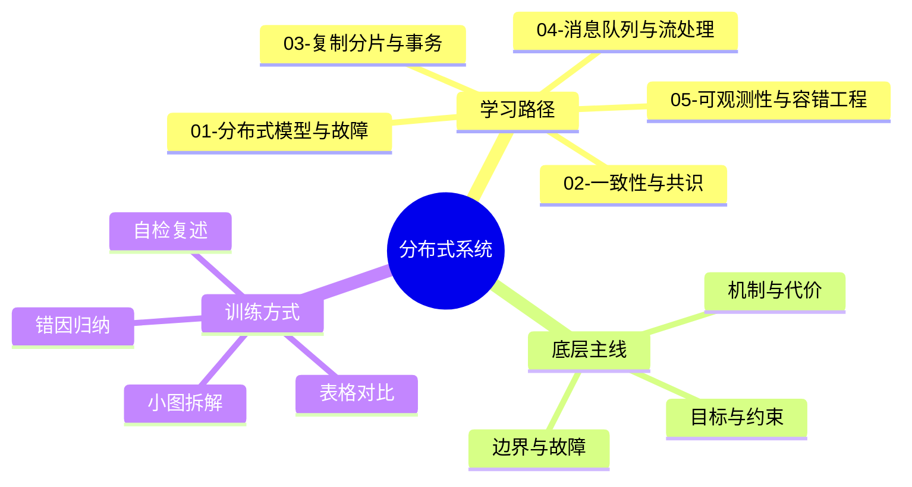
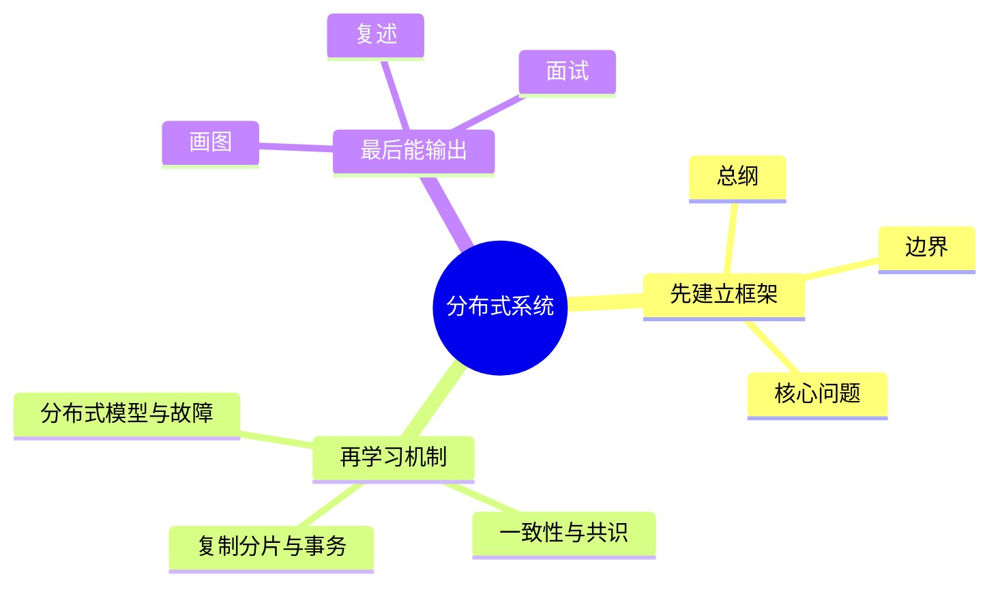

# 分布式系统学习路线与知识地图

## 学习目标
- 建立 分布式系统 的整体知识框架。
- 明确每个章节解决什么问题、需要记住什么、如何用于工程或面试。
- 能按“概念 → 机制 → 边界 → 实践 → 误区”复述每个章节。
- 用多张小图和表格降低记忆负担，避免单张巨大思维导图。

## 一句话总纲
分布式系统把多个节点组织成一个逻辑系统，核心挑战来自部分失败、网络不可靠、时钟不一致和状态复制。

## 记忆口诀
> 网络会丢，节点会挂，时钟会偏，复制要权衡，一致性要定义。

## 思维导图

## Mermaid 图解：学习路线

## 底层原理总览
- 先承认网络和节点会部分失败，再定义读写一致性承诺。
- 复制提升可用性，分片提升容量，但都把顺序、事务和故障恢复变复杂。
- 消息、超时、重试、熔断和追踪构成运行时可靠性闭环。

## 适用场景与不适用场景
| 场景 | 适合怎么学 | 不适合怎么学 | 原因 |
|---|---|---|---|
| 面试准备 | 用 Q1-Q20 训练结构化表达 | 只背定义 | 面试追问通常落在机制、边界和权衡 |
| 工程设计 | 画边界图、列前提、做对比表 | 直接套方案 | 分布式系统 的机制都有适用前提 |
| 排障复盘 | 从失败模式和观测证据倒推 | 只看单点日志 | 复杂问题往往跨多个边界传播 |
| 考试做题 | 先识别关键词和约束 | 看到术语就套模板 | 题目常考边界条件而非名词本身 |

## 分文件章节安排
| 顺序 | 文件 | 学习重点 | 记忆抓手 |
|---|---|---|---|
| 第 1 章 | [[01-分布式模型与故障]] | 部分失败、网络模型、时钟、CAP | 部分失败，网络不信，时钟不准 |
| 第 2 章 | [[02-一致性与共识]] | 线性一致、最终一致、共识、Raft | 先定义一致性，再选择协议 |
| 第 3 章 | [[03-复制分片与事务]] | 复制、分片、2PC、Saga | 复制保可用，分片扩容量，事务控一致 |
| 第 4 章 | [[04-消息队列与流处理]] | 投递语义、幂等、顺序、背压 | 异步解耦，幂等兜底，背压保稳 |
| 第 5 章 | [[05-可观测性与容错工程]] | 超时、重试、熔断、追踪 | 超时定边界，重试要幂等，熔断防雪崩 |
| 面试 | [[20-分布式系统面试20问]] | Q1-Q20 高频表达 | 定义-机制-场景-权衡-误区 |

## 工程实践或做题/面试理解
1. 每章先用一句话说清核心问题，再解释机制为什么成立。
2. 每个概念都补一个“不适用场景”，避免把强机制用在弱需求上，或把弱机制误用在强约束上。
3. 表格用于比较边界，小图用于记流程，面试回答用于训练表达。
4. 工程落地要补验证：日志、测试、演练、监控或审计证据。

## 章节边界对比表
| 章节 | 主要解决 | 典型代价 | 容易误用 |
|---|---|---|---|
| [[01-分布式模型与故障]] | 部分失败、网络模型、时钟、CAP | 复杂度、性能或维护成本上升 | 只记口诀，不检查前提和边界 |
| [[02-一致性与共识]] | 线性一致、最终一致、共识、Raft | 复杂度、性能或维护成本上升 | 只记口诀，不检查前提和边界 |
| [[03-复制分片与事务]] | 复制、分片、2PC、Saga | 复杂度、性能或维护成本上升 | 只记口诀，不检查前提和边界 |
| [[04-消息队列与流处理]] | 投递语义、幂等、顺序、背压 | 复杂度、性能或维护成本上升 | 只记口诀，不检查前提和边界 |
| [[05-可观测性与容错工程]] | 超时、重试、熔断、追踪 | 复杂度、性能或维护成本上升 | 只记口诀，不检查前提和边界 |

## 推荐学习方法
1. 先读本路线，知道每章在全局中的位置。
2. 每章先看思维导图，再看概念解释，最后用自检题复述。
3. 面试题不要死背，按“定义 → 机制 → 场景 → 权衡 → 误区 → 记忆点”回答。
4. 复杂图拆成小图，每次只记一个因果链或流程链。
5. 复习时用“适用/不适用”检验自己是否真正理解边界。

## 常见误区与纠正方式
- **误区：** 只背名词。**纠正：** 每个名词必须说出输入、输出、代价和失败边界。
- **误区：** 只看理想路径。**纠正：** 主动问故障、攻击、重试、延迟或权限变化时会怎样。
- **误区：** 只画大图。**纠正：** 拆成 4-6 个节点的小图并配一张边界表。

## 自检题
- 你能用 1 分钟说清本学科的核心问题吗？
- 你能指出每章最容易混淆的两个概念吗？
- 你能把章节图不看原文复画出来吗？
- 你能为每章举一个适用场景和一个不适用场景吗？
- 你能把任一面试题按六段式完整回答吗？

## 速记卡片
- 总纲：分布式系统把多个节点组织成一个逻辑系统，核心挑战来自部分失败、网络不可靠、时钟不一致和状态复制。
- 口诀：网络会丢，节点会挂，时钟会偏，复制要权衡，一致性要定义。
- 面试表达：先定义边界，再解释机制，最后讲权衡、误区和记忆点。
- 工程表达：先列前提，再给方案，最后给验证证据。

## 深度扩展：如何把本学科学到可迁移

### 1. 学科主线
在网络不可靠、节点会失败、时钟不一致的条件下组织多节点协同。

这意味着学习时不要把章节看成离散文件，而要形成一条稳定链路：**问题从哪里来 → 需要哪些抽象 → 底层机制如何保证结果 → 代价和风险在哪里 → 如何验证理解是否正确**。

### 2. 小思维导图：三阶段学习法

### 3. 分阶段学习重点
| 阶段 | 目标 | 学习动作 | 产出物 |
|---|---|---|---|
| 入门 | 建立全局地图 | 先读路线，再快速浏览每章思维导图 | 能说清本学科解决什么问题 |
| 理解 | 掌握机制和边界 | 对每章画流程图、列前提条件 | 能解释为什么这样设计 |
| 应用 | 做题或工程迁移 | 用案例检查概念是否能落地 | 能选择方案并说出权衡 |
| 面试 | 形成表达模板 | 按 Q-A-图-误区复述 | 能稳定回答 20 个核心问题 |

### 4. 章节之间的关系
- **第 1 层：分布式模型与故障** —— 学习时要问：它承接了前一章什么问题，又为后一章提供什么工具？
- **第 2 层：一致性与共识** —— 学习时要问：它承接了前一章什么问题，又为后一章提供什么工具？
- **第 3 层：复制分片与事务** —— 学习时要问：它承接了前一章什么问题，又为后一章提供什么工具？
- **第 4 层：消息队列与流处理** —— 学习时要问：它承接了前一章什么问题，又为后一章提供什么工具？
- **第 5 层：可观测性与容错工程** —— 学习时要问：它承接了前一章什么问题，又为后一章提供什么工具？
- **第 6 层：分布式模型与故障** —— 学习时要问：它承接了前一章什么问题，又为后一章提供什么工具？

### 5. 复习闭环
- **风险提醒：** 最大风险是把远程调用当本地调用，忽视超时、重试、幂等、分区和一致性语义。
- **实践抓手：** 设计时先声明系统模型和一致性要求，再选择复制、分片、共识或异步补偿方案。
- **闭环方式：** 每学完一章，必须能完成“三件事”：复画图、讲反例、做迁移。

### 6. 总自检
1. 你能否不看目录，按依赖关系重新排列所有章节？
2. 你能否为每章说出一个工程场景或面试场景？
3. 你能否说明本学科与操作系统、网络、数据库、LLM 或后端工程的连接点？

## 专题深化：与其他学科的连接

- **本学科核心连接点：** 例如下单链路要考虑请求超时、重复提交、消息至少一次投递、库存扣减幂等、读写一致性和补偿任务。
- **向上连接：** 可以支撑系统设计、工程实践、AI Agent 开发和面试表达。
- **向下连接：** 依赖数据结构、操作系统、计算机网络、数据库和数学基础中的概念。

### 学习产出标准
| 层次 | 能力表现 | 自检方式 |
|---|---|---|
| 记住 | 能说出核心名词 | 不看目录复述章节 |
| 理解 | 能画出机制图 | 给别人讲清流程 |
| 应用 | 能解决案例问题 | 用真实约束做方案选择 |
| 迁移 | 能跨学科解释 | 连接 OS/网络/数据库/LLM 场景 |
