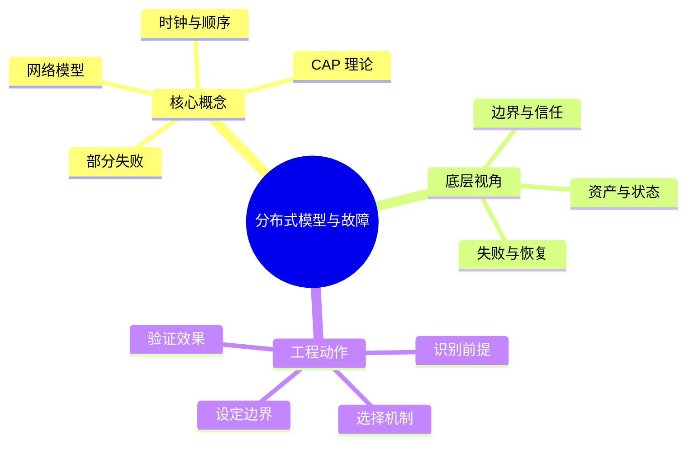

# 分布式系统：分布式模型与故障

## 学习目标
- 理解部分失败、网络模型、时钟顺序和 CAP 的真实边界。
- 能从底层机制、适用边界、工程实践和面试表达四个角度解释本章概念。
- 能画出本章核心流程图，并能用自己的话解释每个节点。
- 能说出至少一个不适用场景、一个常见误区和一个纠正方式。

## 一句话总纲
分布式系统最难的是某些节点失败而另一些节点仍继续运行。

## 记忆口诀
> 部分失败，网络不信，时钟不准

## 思维导图

## Mermaid 图解：核心流程

## 分章节讲解
### 1. 部分失败
**核心定义：** 部分失败指分布式系统中一部分节点、链路或依赖异常，而其他部分仍在运行；调用方常无法立即区分慢、丢包、暂停和宕机。

**底层原理 / 机制拆解：**
- 本地调用要么返回要么抛异常，远程调用还会遇到超时、重复执行、请求到达但响应丢失等中间状态。
- 部分失败要求所有跨网络交互都设置超时、重试、幂等、限流和降级。
- 故障检测只能基于心跳、租约和超时做怀疑，不能在异步网络中获得绝对确定。

**适用场景：** 适用于微服务、数据库集群、消息系统、跨机房调用和任何远程依赖设计。

**不适用场景 / 失败边界：** 不适合把 RPC 当本地函数直接抽象掉；过度透明会隐藏延迟和失败语义。

**工程实践或做题/面试理解：** 工程上为每个远程调用定义超时预算、重试次数、幂等键和失败返回；面试中用“请求成功但响应丢失”说明为什么需要幂等。

**常见误区与纠正方式：** 把远程调用当本地调用；纠正方式是默认远程调用可能慢、失败、重复和乱序。

**速记：** 远程只有三种确定：会慢、会丢、会重复。

### 2. 网络模型
**核心定义：** 网络模型描述消息延迟、丢失、重复、乱序和分区等假设，算法正确性必须建立在明确的同步、异步或部分同步模型上。

**底层原理 / 机制拆解：**
- 同步模型假设消息和处理有已知上界，异步模型没有任何时间上界，部分同步模型认为稳定后存在上界但未知。
- 现实系统通常按部分同步设计：平时用超时推进，异常时允许误判并通过多数派/任期修正。
- 网络分区会让不同节点看到不同世界，系统必须选择拒绝服务、降级或接受短期不一致。

**适用场景：** 适用于共识算法、故障检测、超时设置、跨地域复制和 CAP 权衡分析。

**不适用场景 / 失败边界：** 不适合在无界异步模型中用固定超时“证明”对方宕机；超时只能表示怀疑。

**工程实践或做题/面试理解：** 工程上通过 P99/P999 延迟、拥塞指标和故障演练校准超时；面试回答要先说明算法依赖的网络假设。

**常见误区与纠正方式：** 认为网络稳定时就不用考虑分区；纠正方式是在设计中明确分区发生时读写方案。

**速记：** 超时是怀疑，不是证明。

### 3. 时钟与顺序
**核心定义：** 分布式系统中物理时钟会漂移，逻辑时钟用于表达事件先后，向量时钟可识别并发与因果关系。

**底层原理 / 机制拆解：**
- 物理时钟适合近似时间和过期判断，但 NTP 调整、闰秒和虚拟化暂停会造成跳变。
- Lamport 时钟能给事件一个符合因果的全序扩展，但不能判断两个事件是否并发。
- 向量时钟记录每个节点版本，可判断 A 先于 B、B 先于 A 或二者并发，但元数据随节点数增长。

**适用场景：** 适用于冲突检测、版本合并、事件排序、缓存过期、租约和审计时间线。

**不适用场景 / 失败边界：** 不适合把数据库时间戳或本机时间直接当全局因果顺序。

**工程实践或做题/面试理解：** 工程上强一致路径使用日志索引/版本号，最终一致路径可用版本向量或业务时间加冲突规则；面试中区分“时间顺序”和“因果顺序”。

**常见误区与纠正方式：** 时间戳顺序不一定等于因果顺序；纠正方式是用逻辑时钟、版本号或单调序列描述写入顺序。

**速记：** 物理时钟看大概，逻辑时钟看因果。

### 4. CAP 理论
**核心定义：** CAP 指在网络分区发生时，系统无法同时保证线性一致性意义下的一致性和每个非故障节点都响应的可用性。

**底层原理 / 机制拆解：**
- P 不是可选功能，而是分布式系统必须面对的故障条件。
- 选择 CP 意味着分区时拒绝部分请求以保护一致性；选择 AP 意味着继续服务但接受短期不一致并依赖合并。
- CAP 关注分区时的极限取舍，日常延迟、隔离级别、数据模型还需要 PACELC 等视角补充。

**适用场景：** 适用于解释跨副本读写、网络分区下的服务方案、数据库选型和一致性等级讨论。

**不适用场景 / 失败边界：** 不适合把所有系统简单贴成“CA/CP/AP”标签，更不能说“分布式系统三选二”。

**工程实践或做题/面试理解：** 工程上对每类操作分别决策：余额扣减偏 CP，点赞计数可 AP；面试中强调“发生 P 时在 C 和 A 之间取舍”。

**常见误区与纠正方式：** CAP 是三选二配置题；纠正方式是先说明分区条件，再说明业务操作的 C/A 方案。

**速记：** P 来了，C/A 才真冲突。

## 关键对比表
| 知识点 | 解决的核心问题 | 适用边界 | 不适用/风险边界 | 面试抓手 |
|---|---|---|---|---|
| 部分失败 | 部分失败指分布式系统中一部分节点、链路或依赖异常，而其他部分仍在运行 | 适用于微服务、数据库集群、消息系统、跨机房调用和任何远程依赖设计。 | 不适合把 RPC 当本地函数直接抽象掉；过度透明会隐藏延迟和失败语义。 | 远程只有三种确定：会慢、会丢、会重复。 |
| 网络模型 | 网络模型描述消息延迟、丢失、重复、乱序和分区等假设，算法正确性必须建立在明确的同步、异步或部分同步模型上。 | 适用于共识算法、故障检测、超时设置、跨地域复制和 CAP 权衡分析。 | 不适合在无界异步模型中用固定超时“证明”对方宕机；超时只能表示怀疑。 | 超时是怀疑，不是证明。 |
| 时钟与顺序 | 分布式系统中物理时钟会漂移，逻辑时钟用于表达事件先后，向量时钟可识别并发与因果关系。 | 适用于冲突检测、版本合并、事件排序、缓存过期、租约和审计时间线。 | 不适合把数据库时间戳或本机时间直接当全局因果顺序。 | 物理时钟看大概，逻辑时钟看因果。 |
| CAP 理论 | CAP 指在网络分区发生时，系统无法同时保证线性一致性意义下的一致性和每个非故障节点都响应的可用性。 | 适用于解释跨副本读写、网络分区下的服务方案、数据库选型和一致性等级讨论。 | 不适合把所有系统简单贴成“CA/CP/AP”标签，更不能说“分布式系统三选二”。 | P 来了，C/A 才真冲突。 |

## 边界条件表
| 边界条件 | 应优先检查什么 | 如果忽视会怎样 | 推荐纠正方式 |
|---|---|---|---|
| 输入跨信任边界 | 身份、来源、格式、权限 | 被伪造、篡改或越权利用 | 边界处重新认证、授权、校验和审计 |
| 控制依赖人工流程 | owner、时限、证据 | 例外长期存在，风险不可追踪 | 自动化门禁 + 风险接受有效期 |
| 机制带来额外复杂度 | 性能、可用性、维护成本 | 安全控制被绕过或误伤业务 | 用威胁和资产价值决定控制强度 |
| 运行环境会变化 | 配置、依赖、权限漂移 | 文档正确但系统实际暴露 | 持续扫描、基线检测和复盘更新 |

## 常见误区总结
- **部分失败：** 把远程调用当本地调用；纠正方式是默认远程调用可能慢、失败、重复和乱序。
- **网络模型：** 认为网络稳定时就不用考虑分区；纠正方式是在设计中明确分区发生时读写方案。
- **时钟与顺序：** 时间戳顺序不一定等于因果顺序；纠正方式是用逻辑时钟、版本号或单调序列描述写入顺序。
- **CAP 理论：** CAP 是三选二配置题；纠正方式是先说明分区条件，再说明业务操作的 C/A 方案。

## 自检题
1. 本章的核心问题是什么？请用一句话回答：分布式系统最难的是某些节点失败而另一些节点仍继续运行。
2. 任选两个概念，说出它们的适用场景和不适用场景。
3. 如果机制失效，最可能先出现在哪个边界？如何验证？
4. 面试中如何用“定义 → 机制 → 场景 → 权衡 → 误区”回答本章任一概念？
5. 给一个真实系统例子，说明你会怎样落地本章控制或设计。

## 速记卡片
- 章节口诀：部分失败，网络不信，时钟不准
- 答题结构：定义 → 机制 → 场景 → 权衡 → 误区 → 记忆点。
- 工程落地：先列前提，再定机制，最后用日志、测试或演练验证。
- 部分失败：远程只有三种确定：会慢、会丢、会重复。
- 网络模型：超时是怀疑，不是证明。
- 时钟与顺序：物理时钟看大概，逻辑时钟看因果。
- CAP 理论：P 来了，C/A 才真冲突。

## 深度扩展：底层原理与应用边界

### 1. 本章在「分布式系统」中的位置
- **核心定位：** 在网络不可靠、节点会失败、时钟不一致的条件下组织多节点协同。
- **本章作用：** 「分布式系统：分布式模型与故障」负责把总纲落到可操作的判断框架：先确认问题边界，再拆解机制，最后根据代价和风险选择方法。
- **主要风险：** 最大风险是把远程调用当本地调用，忽视超时、重试、幂等、分区和一致性语义。
- **实践抓手：** 设计时先声明系统模型和一致性要求，再选择复制、分片、共识或异步补偿方案。

### 2. 小流程图：从概念到应用

### 3. 概念深化：逐个击破
#### 3.1 部分失败
- **先问它解决什么：** 部分失败 不是孤立名词，而是用来解决本章某类约束、关系、代价或风险判断的问题。
- **底层机制：** 学习时要拆成“输入条件 → 中间结构 → 处理规则 → 输出结果”四步；如果任何一步说不清，说明只是记住了结论。
- **适用条件：** 当前提满足、边界清楚、代价可接受时使用；如果输入分布、规模、时序、权限或一致性假设变化，就要重新评估。
- **不适用信号：** 需要违反前提才能套用、只能靠特殊样例解释、复杂度或维护成本明显失控时，应换方案。
- **面试表达：** “我会先定义 部分失败，再说明它依赖的前提，最后用一个反例说明边界。”

#### 3.2 网络模型
- **先问它解决什么：** 网络模型 不是孤立名词，而是用来解决本章某类约束、关系、代价或风险判断的问题。
- **底层机制：** 学习时要拆成“输入条件 → 中间结构 → 处理规则 → 输出结果”四步；如果任何一步说不清，说明只是记住了结论。
- **适用条件：** 当前提满足、边界清楚、代价可接受时使用；如果输入分布、规模、时序、权限或一致性假设变化，就要重新评估。
- **不适用信号：** 需要违反前提才能套用、只能靠特殊样例解释、复杂度或维护成本明显失控时，应换方案。
- **面试表达：** “我会先定义 网络模型，再说明它依赖的前提，最后用一个反例说明边界。”

#### 3.3 时钟与顺序
- **先问它解决什么：** 时钟与顺序 不是孤立名词，而是用来解决本章某类约束、关系、代价或风险判断的问题。
- **底层机制：** 学习时要拆成“输入条件 → 中间结构 → 处理规则 → 输出结果”四步；如果任何一步说不清，说明只是记住了结论。
- **适用条件：** 当前提满足、边界清楚、代价可接受时使用；如果输入分布、规模、时序、权限或一致性假设变化，就要重新评估。
- **不适用信号：** 需要违反前提才能套用、只能靠特殊样例解释、复杂度或维护成本明显失控时，应换方案。
- **面试表达：** “我会先定义 时钟与顺序，再说明它依赖的前提，最后用一个反例说明边界。”

#### 3.4 CAP 理论
- **先问它解决什么：** CAP 理论 不是孤立名词，而是用来解决本章某类约束、关系、代价或风险判断的问题。
- **底层机制：** 学习时要拆成“输入条件 → 中间结构 → 处理规则 → 输出结果”四步；如果任何一步说不清，说明只是记住了结论。
- **适用条件：** 当前提满足、边界清楚、代价可接受时使用；如果输入分布、规模、时序、权限或一致性假设变化，就要重新评估。
- **不适用信号：** 需要违反前提才能套用、只能靠特殊样例解释、复杂度或维护成本明显失控时，应换方案。
- **面试表达：** “我会先定义 CAP 理论，再说明它依赖的前提，最后用一个反例说明边界。”

### 4. 适用边界对比表
| 判断维度 | 应该怎么想 | 典型错误 | 记忆提示 |
|---|---|---|---|
| 前提条件 | 先列出输入规模、数据分布、系统假设或业务约束 | 不看条件直接套模板 | 先问“凭什么能用” |
| 正确性 | 需要能说明为什么结果保持不变或为什么局部选择成立 | 只给经验结论 | 用不变量、反例或交换论证检查 |
| 复杂度/成本 | 同时估算时间、空间、延迟、吞吐、人力和维护成本 | 只看理论最优 | 工程里还要看常数和可观测性 |
| 失败模式 | 主动说明边界外会怎样失败 | 面试中只讲优点 | 能说失败边界才算真理解 |

### 5. 记忆强化：三层复述法
1. **概念层：** 用一句话定义本章每个核心概念。
2. **机制层：** 不看原文画出输入到输出的流程。
3. **边界层：** 为每个概念准备一个“不能这样用”的反例。

### 6. 工程/做题/面试迁移
- **工程迁移：** 设计时先声明系统模型和一致性要求，再选择复制、分片、共识或异步补偿方案。
- **做题迁移：** 先把题目中的对象、关系、约束和目标函数圈出来，再映射到本章概念。
- **面试迁移：** 回答时不要只报名词，要说清“为什么需要它、它如何工作、它何时失效”。

### 7. 深度自检题
1. 你能否把本章概念按“前提 → 机制 → 结果 → 代价”重新组织？
2. 如果输入规模、并发量、数据分布或安全边界变化，原结论是否仍成立？
3. 本章哪个概念最容易被误用？请给出一个反例。
4. 如果让你设计一道面试题，你会怎样考察候选人是否真的理解？

### 8. 深度速记卡片
- **总抓手：** 在网络不可靠、节点会失败、时钟不一致的条件下组织多节点协同。
- **答题模板：** 定义边界 → 拆底层机制 → 说适用条件 → 讲权衡 → 给反例。
- **复习动作：** 每次复习只看图和表，尝试口述 3 分钟；卡住处再回正文。

## 专题深化：具体机制、案例与追问

### 1. 具体案例：把「分布式模型与故障」放进真实问题
例如下单链路要考虑请求超时、重复提交、消息至少一次投递、库存扣减幂等、读写一致性和补偿任务。

### 2. 本章关键机制细化
- 远程调用无法区分慢、丢包和宕机，只能通过超时和重试管理不确定性。
- 物理时钟不能直接代表因果顺序。
- CAP 讨论的是网络分区下 C 与 A 的取舍。

### 3. 概念到判断的检查清单
| 概念/动作 | 你要检查什么 | 如果检查失败会怎样 |
|---|---|---|
| 部分失败 | 前提、输入、输出、代价、失败边界是否都说清 | 可能套错模型、复杂度失控或得到不可验证结论 |
| 网络模型 | 前提、输入、输出、代价、失败边界是否都说清 | 可能套错模型、复杂度失控或得到不可验证结论 |
| 时钟与顺序 | 前提、输入、输出、代价、失败边界是否都说清 | 可能套错模型、复杂度失控或得到不可验证结论 |
| CAP 理论 | 前提、输入、输出、代价、失败边界是否都说清 | 可能套错模型、复杂度失控或得到不可验证结论 |
| 本章在「分布式系统」中的位置 | 前提、输入、输出、代价、失败边界是否都说清 | 可能套错模型、复杂度失控或得到不可验证结论 |

### 4. 面试追问路径

- 网络分区时选择什么语义？
- 重试是否幂等？
- 副本之间如何收敛或提交？

### 5. 验证与复盘
- **验证方式：** 用故障注入、超时重试测试、乱序重复消息测试和一致性检查验证。
- **复盘方式：** 每次做题或设计后，记录“我使用了哪个前提、哪个前提最容易被破坏、如果破坏如何调整”。
- **记忆方式：** 不背孤立结论，只背“问题 → 机制 → 边界 → 验证”的链路。
