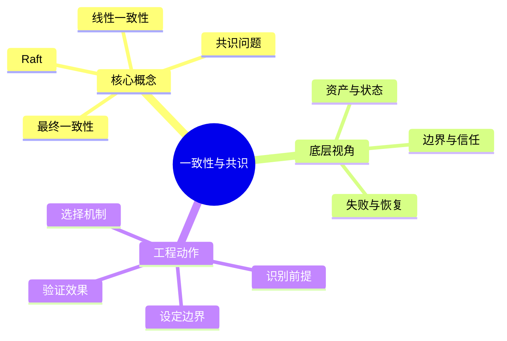
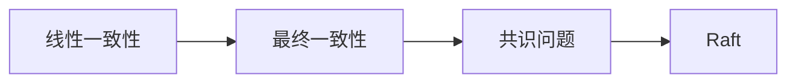
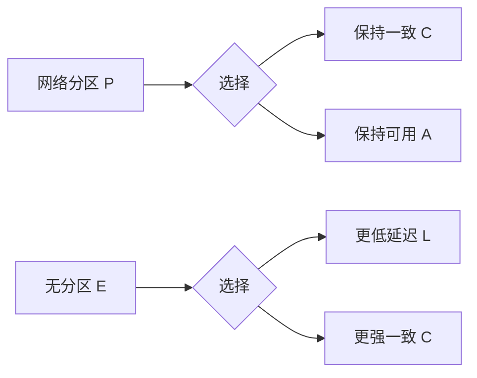

# 分布式系统：一致性与共识

## 学习目标
- 区分线性一致、最终一致、共识问题和 Raft 的机制边界。
- 能从底层机制、适用边界、工程实践和面试表达四个角度解释本章概念。
- 能画出本章核心流程图，并能用自己的话解释每个节点。
- 能说出至少一个不适用场景、一个常见误区和一个纠正方式。

## 一句话总纲
一致性是读写表现出来的语义，共识是在故障下让节点对值达成一致。

## 记忆口诀
> 先定义一致性，再选择协议

## 思维导图

## Mermaid 图解：核心流程

## 分章节讲解
### 1. 线性一致性
**核心定义：** 线性一致性要求每个操作看起来在调用开始与返回结束之间某个瞬间原子生效，所有客户端观察到同一个实时顺序。

**底层原理 / 机制拆解：**
- 它把并发操作排列成一个符合真实时间先后关系的单一序列。
- 常通过单领导者、多数派读写、租约读或共识日志实现。
- 强语义通常带来更高延迟和分区时不可用，因为读写要协调最新提交位置。

**适用场景：** 适用于锁服务、配置中心、主节点选举、余额扣减、唯一约束和权限变更。

**不适用场景 / 失败边界：** 不适合对延迟极敏感且可容忍短暂旧值的计数、推荐、动态流等场景。

**工程实践或做题/面试理解：** 工程上明确哪些 API 承诺读己之写或线性一致读；面试中用“操作在调用和返回之间找线性化点”定义。

**常见误区与纠正方式：** 把主库读写等同于线性一致；纠正方式是检查故障切换、读缓存、租约和复制提交语义。

**速记：** 线性一致 = 像一个最新单机。

### 2. 最终一致性
**核心定义：** 最终一致性保证在没有新写入且副本通信恢复后，多个副本最终收敛到一致状态。

**底层原理 / 机制拆解：**
- 它允许读到旧值、并发冲突和临时分歧，通过异步复制、反熵、冲突解决和版本合并收敛。
- 冲突解决可用最后写入胜出、向量时钟、CRDT、业务合并或人工仲裁。
- 最终一致关注收敛性，仍要定义单调读、读己之写、因果一致等更细体验保证。

**适用场景：** 适用于评论计数、社交动态、缓存、搜索索引、跨地域多活和离线同步。

**不适用场景 / 失败边界：** 不适合直接处理强约束交易、库存唯一扣减和权限撤销等必须立即生效的操作。

**工程实践或做题/面试理解：** 工程上为每种冲突定义合并规则和补偿流程；面试中强调“最终一致不是没有一致性，而是收敛规则不同”。

**常见误区与纠正方式：** 最终一致等于随便不一致；纠正方式是明确传播机制、冲突检测、合并规则和最大收敛时间目标。

**速记：** 能暂歧，但要会合。

### 3. 共识问题
**核心定义：** 共识要求多个节点在可能失败的情况下对同一个值达成一致，满足一致性、有效性和终止性等性质。

**底层原理 / 机制拆解：**
- 共识通常需要多数派交集保证两个已提交值不会冲突。
- 在纯异步系统中遇到崩溃故障无法同时保证确定性终止，即 FLP 不可能性；现实算法依赖部分同步和随机/超时推进。
- 共识输出常被组织为复制日志，让所有状态机按相同顺序执行命令。

**适用场景：** 适用于元数据管理、配置变更、选主、分布式锁、复制状态机和事务协调。

**不适用场景 / 失败边界：** 不适合每个普通业务请求都直接走昂贵共识，除非业务强一致收益大于延迟和成本。

**工程实践或做题/面试理解：** 工程上优先使用成熟系统如 etcd/ZooKeeper/Consul；面试中说明“共识不是简单投票，关键是多数派交集和日志顺序”。

**常见误区与纠正方式：** 多数节点同意一次就永远安全；纠正方式是加入任期、日志匹配、提交索引和成员变更协议。

**速记：** 多数派要有交集，日志要有顺序。

### 4. Raft
**核心定义：** Raft 是一种易理解的共识算法，通过领导者、任期、选举、日志复制和安全提交维护复制状态机。

**底层原理 / 机制拆解：**
- 任期是逻辑时代，节点只承认不小于自己任期的领导者，避免旧领导者继续提交。
- 领导者接收客户端命令并复制日志，日志项复制到多数派后才能提交。
- 跟随者根据日志索引和任期匹配回退，保证已提交日志不会被覆盖。

**适用场景：** 适用于小规模强一致元数据集群、配置中心、服务发现、分布式锁和控制面状态。

**不适用场景 / 失败边界：** 不适合超大吞吐数据面或跨洲低延迟强一致写入；多数派 RTT 会成为瓶颈。

**工程实践或做题/面试理解：** 工程上关注奇数节点、选举超时、快照压缩、成员变更和磁盘 fsync；面试按“选主-复制-提交-故障恢复”讲。

**常见误区与纠正方式：** 日志写到 leader 就算成功；纠正方式是提交必须达到多数派，并由 leader 推进 commit index。

**速记：** Raft 三件事：选主、复制、多数提交。

## 关键对比表
| 知识点 | 解决的核心问题 | 适用边界 | 不适用/风险边界 | 面试抓手 |
|---|---|---|---|---|
| 线性一致性 | 线性一致性要求每个操作看起来在调用开始与返回结束之间某个瞬间原子生效，所有客户端观察到同一个实时顺序。 | 适用于锁服务、配置中心、主节点选举、余额扣减、唯一约束和权限变更。 | 不适合对延迟极敏感且可容忍短暂旧值的计数、推荐、动态流等场景。 | 线性一致 = 像一个最新单机。 |
| 最终一致性 | 最终一致性保证在没有新写入且副本通信恢复后，多个副本最终收敛到一致状态。 | 适用于评论计数、社交动态、缓存、搜索索引、跨地域多活和离线同步。 | 不适合直接处理强约束交易、库存唯一扣减和权限撤销等必须立即生效的操作。 | 能暂歧，但要会合。 |
| 共识问题 | 共识要求多个节点在可能失败的情况下对同一个值达成一致，满足一致性、有效性和终止性等性质。 | 适用于元数据管理、配置变更、选主、分布式锁、复制状态机和事务协调。 | 不适合每个普通业务请求都直接走昂贵共识，除非业务强一致收益大于延迟和成本。 | 多数派要有交集，日志要有顺序。 |
| Raft | Raft 是一种易理解的共识算法，通过领导者、任期、选举、日志复制和安全提交维护复制状态机。 | 适用于小规模强一致元数据集群、配置中心、服务发现、分布式锁和控制面状态。 | 不适合超大吞吐数据面或跨洲低延迟强一致写入；多数派 RTT 会成为瓶颈。 | Raft 三件事：选主、复制、多数提交。 |

## 边界条件表
| 边界条件 | 应优先检查什么 | 如果忽视会怎样 | 推荐纠正方式 |
|---|---|---|---|
| 输入跨信任边界 | 身份、来源、格式、权限 | 被伪造、篡改或越权利用 | 边界处重新认证、授权、校验和审计 |
| 控制依赖人工流程 | owner、时限、证据 | 例外长期存在，风险不可追踪 | 自动化门禁 + 风险接受有效期 |
| 机制带来额外复杂度 | 性能、可用性、维护成本 | 安全控制被绕过或误伤业务 | 用威胁和资产价值决定控制强度 |
| 运行环境会变化 | 配置、依赖、权限漂移 | 文档正确但系统实际暴露 | 持续扫描、基线检测和复盘更新 |

## 常见误区总结
- **线性一致性：** 把主库读写等同于线性一致；纠正方式是检查故障切换、读缓存、租约和复制提交语义。
- **最终一致性：** 最终一致等于随便不一致；纠正方式是明确传播机制、冲突检测、合并规则和最大收敛时间目标。
- **共识问题：** 多数节点同意一次就永远安全；纠正方式是加入任期、日志匹配、提交索引和成员变更协议。
- **Raft：** 日志写到 leader 就算成功；纠正方式是提交必须达到多数派，并由 leader 推进 commit index。

## 自检题
1. 本章的核心问题是什么？请用一句话回答：一致性是读写表现出来的语义，共识是在故障下让节点对值达成一致。
2. 任选两个概念，说出它们的适用场景和不适用场景。
3. 如果机制失效，最可能先出现在哪个边界？如何验证？
4. 面试中如何用“定义 → 机制 → 场景 → 权衡 → 误区”回答本章任一概念？
5. 给一个真实系统例子，说明你会怎样落地本章控制或设计。

## 速记卡片
- 章节口诀：先定义一致性，再选择协议
- 答题结构：定义 → 机制 → 场景 → 权衡 → 误区 → 记忆点。
- 工程落地：先列前提，再定机制，最后用日志、测试或演练验证。
- 线性一致性：线性一致 = 像一个最新单机。
- 最终一致性：能暂歧，但要会合。
- 共识问题：多数派要有交集，日志要有顺序。
- Raft：Raft 三件事：选主、复制、多数提交。

## 深度扩展：底层原理与应用边界

### 1. 本章在「分布式系统」中的位置
- **核心定位：** 在网络不可靠、节点会失败、时钟不一致的条件下组织多节点协同。
- **本章作用：** 「分布式系统：一致性与共识」负责把总纲落到可操作的判断框架：先确认问题边界，再拆解机制，最后根据代价和风险选择方法。
- **主要风险：** 最大风险是把远程调用当本地调用，忽视超时、重试、幂等、分区和一致性语义。
- **实践抓手：** 设计时先声明系统模型和一致性要求，再选择复制、分片、共识或异步补偿方案。

### 2. 小流程图：从概念到应用

### 3. 概念深化：逐个击破
#### 3.1 线性一致性
- **先问它解决什么：** 线性一致性 不是孤立名词，而是用来解决本章某类约束、关系、代价或风险判断的问题。
- **底层机制：** 学习时要拆成“输入条件 → 中间结构 → 处理规则 → 输出结果”四步；如果任何一步说不清，说明只是记住了结论。
- **适用条件：** 当前提满足、边界清楚、代价可接受时使用；如果输入分布、规模、时序、权限或一致性假设变化，就要重新评估。
- **不适用信号：** 需要违反前提才能套用、只能靠特殊样例解释、复杂度或维护成本明显失控时，应换方案。
- **面试表达：** “我会先定义 线性一致性，再说明它依赖的前提，最后用一个反例说明边界。”

#### 3.2 最终一致性
- **先问它解决什么：** 最终一致性 不是孤立名词，而是用来解决本章某类约束、关系、代价或风险判断的问题。
- **底层机制：** 学习时要拆成“输入条件 → 中间结构 → 处理规则 → 输出结果”四步；如果任何一步说不清，说明只是记住了结论。
- **适用条件：** 当前提满足、边界清楚、代价可接受时使用；如果输入分布、规模、时序、权限或一致性假设变化，就要重新评估。
- **不适用信号：** 需要违反前提才能套用、只能靠特殊样例解释、复杂度或维护成本明显失控时，应换方案。
- **面试表达：** “我会先定义 最终一致性，再说明它依赖的前提，最后用一个反例说明边界。”

#### 3.3 共识问题
- **先问它解决什么：** 共识问题 不是孤立名词，而是用来解决本章某类约束、关系、代价或风险判断的问题。
- **底层机制：** 学习时要拆成“输入条件 → 中间结构 → 处理规则 → 输出结果”四步；如果任何一步说不清，说明只是记住了结论。
- **适用条件：** 当前提满足、边界清楚、代价可接受时使用；如果输入分布、规模、时序、权限或一致性假设变化，就要重新评估。
- **不适用信号：** 需要违反前提才能套用、只能靠特殊样例解释、复杂度或维护成本明显失控时，应换方案。
- **面试表达：** “我会先定义 共识问题，再说明它依赖的前提，最后用一个反例说明边界。”

#### 3.4 Raft
- **先问它解决什么：** Raft 不是孤立名词，而是用来解决本章某类约束、关系、代价或风险判断的问题。
- **底层机制：** 学习时要拆成“输入条件 → 中间结构 → 处理规则 → 输出结果”四步；如果任何一步说不清，说明只是记住了结论。
- **适用条件：** 当前提满足、边界清楚、代价可接受时使用；如果输入分布、规模、时序、权限或一致性假设变化，就要重新评估。
- **不适用信号：** 需要违反前提才能套用、只能靠特殊样例解释、复杂度或维护成本明显失控时，应换方案。
- **面试表达：** “我会先定义 Raft，再说明它依赖的前提，最后用一个反例说明边界。”

### 4. 适用边界对比表
| 判断维度 | 应该怎么想 | 典型错误 | 记忆提示 |
|---|---|---|---|
| 前提条件 | 先列出输入规模、数据分布、系统假设或业务约束 | 不看条件直接套模板 | 先问“凭什么能用” |
| 正确性 | 需要能说明为什么结果保持不变或为什么局部选择成立 | 只给经验结论 | 用不变量、反例或交换论证检查 |
| 复杂度/成本 | 同时估算时间、空间、延迟、吞吐、人力和维护成本 | 只看理论最优 | 工程里还要看常数和可观测性 |
| 失败模式 | 主动说明边界外会怎样失败 | 面试中只讲优点 | 能说失败边界才算真理解 |

### 5. 记忆强化：三层复述法
1. **概念层：** 用一句话定义本章每个核心概念。
2. **机制层：** 不看原文画出输入到输出的流程。
3. **边界层：** 为每个概念准备一个“不能这样用”的反例。

### 6. 工程/做题/面试迁移
- **工程迁移：** 设计时先声明系统模型和一致性要求，再选择复制、分片、共识或异步补偿方案。
- **做题迁移：** 先把题目中的对象、关系、约束和目标函数圈出来，再映射到本章概念。
- **面试迁移：** 回答时不要只报名词，要说清“为什么需要它、它如何工作、它何时失效”。

### 7. 深度自检题
1. 你能否把本章概念按“前提 → 机制 → 结果 → 代价”重新组织？
2. 如果输入规模、并发量、数据分布或安全边界变化，原结论是否仍成立？
3. 本章哪个概念最容易被误用？请给出一个反例。
4. 如果让你设计一道面试题，你会怎样考察候选人是否真的理解？

### 8. 深度速记卡片
- **总抓手：** 在网络不可靠、节点会失败、时钟不一致的条件下组织多节点协同。
- **答题模板：** 定义边界 → 拆底层机制 → 说适用条件 → 讲权衡 → 给反例。
- **复习动作：** 每次复习只看图和表，尝试口述 3 分钟；卡住处再回正文。

## 专题深化：具体机制、案例与追问

### 1. 具体案例：把「一致性与共识」放进真实问题
例如下单链路要考虑请求超时、重复提交、消息至少一次投递、库存扣减幂等、读写一致性和补偿任务。

### 2. 本章关键机制细化
- 线性一致性提供最接近单机的读写语义。
- 最终一致需要冲突解决和收敛规则。
- Raft 用任期、领导者和多数派约束避免脑裂。

### 3. 概念到判断的检查清单
| 概念/动作 | 你要检查什么 | 如果检查失败会怎样 |
|---|---|---|
| 线性一致性 | 前提、输入、输出、代价、失败边界是否都说清 | 可能套错模型、复杂度失控或得到不可验证结论 |
| 最终一致性 | 前提、输入、输出、代价、失败边界是否都说清 | 可能套错模型、复杂度失控或得到不可验证结论 |
| 共识问题 | 前提、输入、输出、代价、失败边界是否都说清 | 可能套错模型、复杂度失控或得到不可验证结论 |
| Raft | 前提、输入、输出、代价、失败边界是否都说清 | 可能套错模型、复杂度失控或得到不可验证结论 |
| 本章在「分布式系统」中的位置 | 前提、输入、输出、代价、失败边界是否都说清 | 可能套错模型、复杂度失控或得到不可验证结论 |

### 4. 面试追问路径

- 网络分区时选择什么语义？
- 重试是否幂等？
- 副本之间如何收敛或提交？

### 5. 验证与复盘
- **验证方式：** 用故障注入、超时重试测试、乱序重复消息测试和一致性检查验证。
- **复盘方式：** 每次做题或设计后，记录“我使用了哪个前提、哪个前提最容易被破坏、如果破坏如何调整”。
- **记忆方式：** 不背孤立结论，只背“问题 → 机制 → 边界 → 验证”的链路。

## 本轮扩写：一致性语义、共识边界与面试辨析

### 1. 先区分“数据一致性”和“事务隔离”
很多面试错误来自把线性一致性、串行化、顺序一致性混为一谈：

| 概念 | 关注对象 | 典型问题 | 常见误区 | 纠正方式 |
|---|---|---|---|---|
| 线性一致性 | 单对象或多对象操作的实时可见性 | 写成功后其他客户端是否立刻读到 | 以为它等同于高性能 | 强调它通常牺牲延迟和可用性 |
| 顺序一致性 | 所有客户端看到同一操作顺序 | 是否需要尊重真实时间先后 | 以为所有一致性都要求真实时间 | 顺序一致不一定满足实时性 |
| 因果一致性 | 有因果关系的操作顺序 | 评论必须在帖子之后可见 | 误把并发事件强行排序 | 只排序有因果依赖的事件 |
| 串行化 | 事务执行结果等价于某个串行顺序 | 多事务并发是否破坏不变量 | 把数据库隔离级别当复制一致性 | 明确它属于事务调度语义 |

### 2. PACELC：CAP 之外还要看正常路径
CAP 只强调分区发生时的一致性和可用性取舍；工程系统更多时间处于未分区状态，此时也要在延迟和一致性之间取舍。

- **适用：** 讨论跨地域数据库、分布式 KV、缓存读写一致性、搜索索引刷新延迟。
- **不适用：** 单机数据库事务内部的锁冲突分析，此时重点是隔离级别和并发控制。
- **面试表达：** “CAP 告诉我分区时不能同时要 C 和 A；PACELC 继续提醒我，即使没有分区，也要在延迟和一致性之间选。”

### 3. 共识不是“多数派投票”这么简单
多数派只是容错的数学基础，共识还需要处理领导者、任期、日志匹配、提交规则和成员变更。

| 机制 | 解决什么 | 边界条件 | 面试追问 |
|---|---|---|---|
| 任期/epoch | 区分新旧领导者 | 旧 leader 可能继续对外响应 | 如何防止脑裂写入 |
| 多数派 quorum | 在失败节点存在时仍能推进 | 少于多数派时必须停止写入 | 为什么 3 节点只能容忍 1 个故障 |
| 日志复制 | 让状态机按同一顺序执行命令 | follower 落后或出现冲突日志 | leader 如何覆盖不一致日志 |
| 提交规则 | 判断日志何时对外可见 | 不能只看单副本落盘 | 为什么提交后不能回滚 |
| 成员变更 | 调整集群规模 | 新旧配置可能同时存在 | 为什么需要 joint consensus 或等价机制 |

### 4. 工程案例：库存扣减需要什么一致性
- **强约束库存：** 秒杀扣库存、防超卖，通常需要单分片串行化、乐观锁或强一致事务；跨分片时要谨慎设计预扣、冻结和补偿。
- **弱约束展示：** 商品详情页库存展示可以允许秒级延迟，用缓存或异步刷新降低读压力。
- **订单状态：** 用户支付成功后订单页必须读到确定状态，至少要保证读己之写或按主库/会话一致性读取。
- **搜索索引：** 商品状态进搜索索引通常接受最终一致，但要有延迟监控和纠错任务。

### 5. 常见误区与纠正
1. **误区：** “用了 Raft 就所有读都强一致。”  
   **纠正：** follower 读、lease read、read index 都有前提；要说明读路径如何确认 leader 仍有效。
2. **误区：** “最终一致就是随便不一致。”  
   **纠正：** 最终一致必须说明收敛机制、冲突解决、最大延迟和异常修复。
3. **误区：** “CAP 三选二。”  
   **纠正：** 分区不可避免，真实选择是在分区时偏 CP 或 AP，并在正常路径权衡延迟。

### 6. 追问路径
- 面试官问“为什么不用强一致”：回答延迟、跨地域可用性、吞吐和热点成本。
- 面试官问“最终一致怎么兜底”：回答幂等事件、重放、对账、补偿、延迟指标。
- 面试官问“Raft 如何防脑裂”：回答任期、投票、心跳、提交规则和多数派交集。
